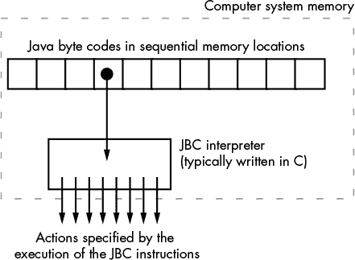
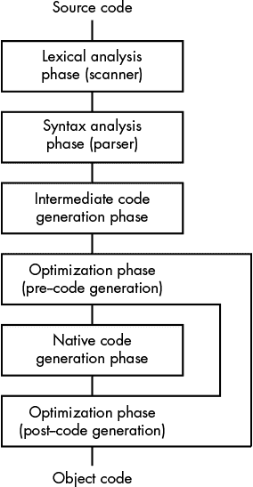
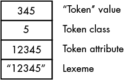
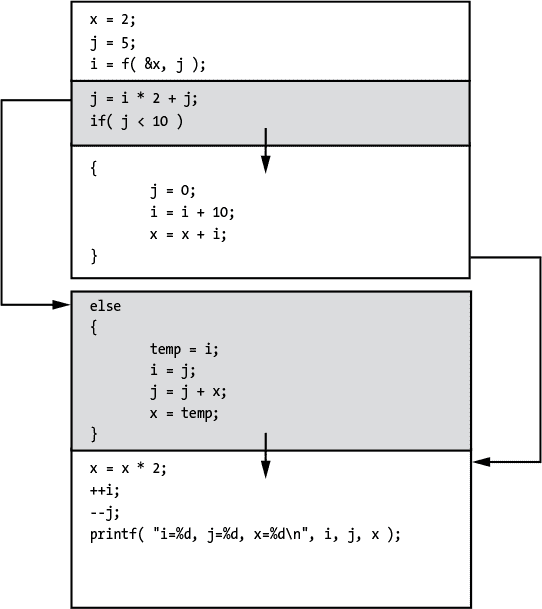
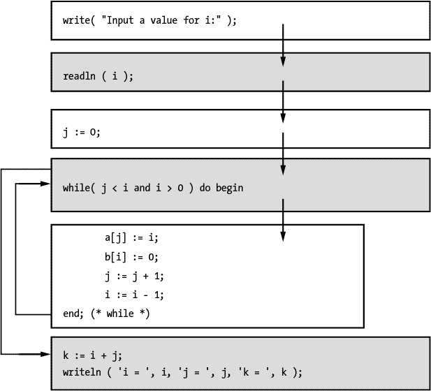
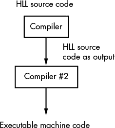
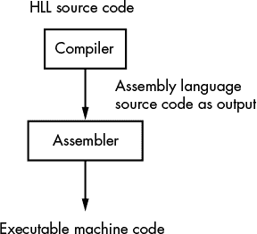
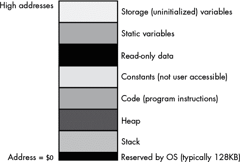
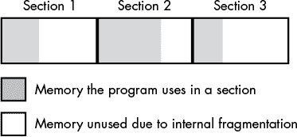

# 第四章：**编译器操作与代码生成**


为了编写生成高效机器代码的高级语言代码，首先必须理解编译器和链接器如何将高级源语句翻译成可执行的机器代码。完整的编译器理论涵盖超出了本书的范围；然而，本章将解释翻译过程的基础知识，帮助你理解并在高级语言编译器的局限性内工作。我们将涵盖以下主题：

+   编程语言使用的不同类型的输入文件

+   编译器与解释器的区别

+   典型编译器如何处理源文件以生成可执行程序

+   优化过程以及为什么编译器无法为给定的源文件生成最佳代码

+   编译器生成的不同类型的输出文件

+   常见的目标文件格式，如 COFF 和 ELF

+   影响编译器生成的可执行文件大小和效率的内存组织和对齐问题

+   链接器选项如何影响代码的效率

本材料为后续各章奠定了基础，对于帮助编译器生成最佳代码至关重要。我们将从编程语言使用的文件格式开始讨论。

### 4.1 编程语言使用的文件类型

一个典型的程序可以有多种形式。*源文件*是程序员创建并提供给语言翻译器（如编译器）的可读文本形式。典型的编译器将源文件或多个源文件翻译成*目标代码*文件。*链接程序*将多个独立的目标模块合并，生成可重定位或可执行文件。最后，*加载程序*（通常是操作系统）将可执行文件加载到内存中，并在执行之前对目标代码进行最终修改。请注意，修改是针对现在在内存中的目标代码进行的；磁盘上的实际文件不会被修改。这些并不是语言处理系统操作的唯一文件类型，但它们是典型的。要充分理解编译器的局限性，了解语言处理器如何处理这些文件类型是非常重要的。我们首先来看源文件。

### 4.2 源文件

传统上，源文件包含程序员使用文本编辑器创建的纯 ASCII 或 Unicode 文本（或其他字符集）。使用纯文本文件的一个优点是，程序员可以使用任何处理文本文件的程序来操作源文件。例如，一个计算任意文本文件中行数的程序也会计算程序中的源行数。由于有成百上千个小型过滤程序可以操作文本文件，因此以纯文本格式维护源文件是一种不错的方法。这种格式有时称为*纯原生文本*。

#### 4.2.1 标记化源文件

一些语言处理系统（尤其是解释器）将源文件以*标记化*形式存储。标记化源文件通常使用特殊的单字节*标记*值来压缩源语言中的保留字和其他词法元素，因此它们通常比文本源文件小。此外，处理标记化代码的解释器通常比处理纯文本的解释器要快一个数量级，因为处理单字节标记的字符串比识别保留字字符串要高效得多。

通常，解释器的标记化文件由一系列字节组成，这些字节直接映射到源文件中的字符串，如`if`和`print`。因此，通过使用一个字符串表和一些额外的逻辑，你可以解码一个标记化的程序，恢复出原始的源代码。（通常，你会失去插入到源文件中的额外空白，但这几乎是唯一的区别。）许多早期 PC 系统上的 BASIC 解释器都是这样工作的。你在解释器中输入一行 BASIC 源代码，解释器会立即将该行进行标记化，并将标记化后的形式存储在内存中。稍后，当你执行`LIST`命令时，解释器会*去标记化*内存中的源代码，生成源代码列表。

另一方面，标记化的源文件通常使用专有格式。这意味着它们不能利用像`wc`（单词计数）、`entab`和`detab`（分别用来计算文本文件中的行数、单词数和字符数；用制表符替换空格；用空格替换制表符）这样的通用文本处理工具。

为了克服这一限制，大多数使用标记化文件的语言都允许你去标记化源文件，生成标准的文本文件。（它们也允许你根据输入文本文件重新标记化源文件。）然后，你将生成的文本文件通过某个过滤程序处理，并重新标记化过滤程序的输出，以生成一个新的标记化源文件。虽然这需要相当大的工作量，但它允许与标记化文件一起工作的语言翻译器利用各种基于文本的实用程序。

#### 4.2.2 专用源文件

一些编程语言，例如 Embarcadero 的 Delphi 和 Free Pascal 的类似 Lazarus 程序，根本不使用传统的基于文本的文件格式。相反，它们通常使用图形元素，如流程图和表单，来表示程序要执行的指令。其他例子包括 Scratch 编程语言，它允许你使用位图显示上的图形元素编写简单程序，以及 Microsoft Visual Studio 和 Apple Xcode 集成开发环境（IDE），这两个 IDE 都允许你使用图形操作来指定屏幕布局，而不是基于文本的源文件。

### 4.3 计算机语言处理器的类型

计算机语言处理系统通常分为四类：纯解释器、解释器、编译器和增量编译器。这些系统在处理源程序和执行结果的方式上有所不同，进而影响它们各自的效率。

#### 4.3.1 纯解释器

*纯解释器*直接作用于文本源文件，通常效率非常低。它们不断扫描源文件（通常是 ASCII 文本文件），将其处理为字符串数据。识别*词素*（如保留字、字面常量等语言成分）是一个耗时的过程。实际上，许多纯解释器花费更多的时间来处理词素（即执行*词法分析*）而不是执行程序。因为词素的实际即时执行只需要比词法分析稍多的努力，纯解释器通常是计算机语言处理程序中最小的。这也是为什么当需要一个非常紧凑的语言处理器时，纯解释器非常流行。它们也广泛用于脚本语言和允许在程序执行期间将语言源代码作为字符串数据操作的高级语言。

#### 4.3.2 解释器

*解释器*在运行时执行程序源文件的某种表示形式。这个表示形式不一定是人类可读的文本文件。如前一节所述，许多解释器处理的是标记化的源文件，以避免在执行过程中进行词法分析。一些解释器会将文本源文件作为输入，并在执行前将输入文件转换为标记化格式。这使得程序员可以在他们喜欢的编辑器中使用文本文件，同时享受标记化格式带来的快速执行。唯一的成本是标记化源文件的初始延迟（在大多数现代机器上这一延迟几乎不被察觉），以及可能无法执行包含程序语句的字符串这一事实。

#### 4.3.3 编译器

*编译器*将文本形式的源程序转换为可执行的机器代码。这是一个复杂的过程，特别是在优化编译器中。关于编译器生成的代码，有几点需要注意。首先，编译器生成的是底层 CPU 可以直接执行的机器指令。因此，CPU 在执行程序时无需解码源文件，所有的 CPU 资源都用于执行机器代码。因此，生成的程序通常比解释执行的版本运行得要快得多。当然，一些编译器在将高级语言源代码转换为机器代码时比其他编译器做得更好，但即使是低质量的编译器也比大多数解释器做得要好。

编译器从源代码到机器代码的翻译是一个单向函数。与解释器不同，如果只给出程序的机器代码输出，通常很难，甚至不可能，重建原始源文件。

#### 4.3.4 增量编译器

*增量编译器* 是编译器和解释器之间的结合体。增量编译器有许多不同的类型，但通常，它们像解释器一样工作，即不直接将源文件编译成机器代码；而是将源代码翻译成一种中间形式。然而，与解释器的标记化代码不同，这种中间形式通常与原始源文件没有强相关性。中间形式通常是*虚拟机语言*的机器代码——“虚拟”是因为没有实际的 CPU 可以执行这些代码。然而，编写一个可以执行它的解释器是很容易的。因为虚拟机（VM）的解释器通常比标记化代码的解释器高效得多，所以执行 VM 代码通常比执行解释器中的标记列表要快。像 Java 这样的语言采用这种编译技术，并结合*Java 字节码引擎*（一种解释程序），来解释执行 Java 的“机器代码”（参见图 4-1）。虚拟机执行的最大优势是 VM 代码是可移植的；也就是说，运行在虚拟机上的程序可以在任何有解释器的地方执行。相比之下，真正的机器代码只能在为其编写的 CPU（系列）上执行。通常，解释执行的 VM 代码比解释执行的标记化代码快约 2 到 10 倍，而纯机器代码比解释执行的 VM 代码快约 2 到 10 倍。



*图 4-1：JBC 解释器*

为了提高通过增量编译器编译的程序的性能，许多供应商（特别是 Java 系统供应商）采用了一种称为*即时编译（JIT）*的技术。这个概念基于这样的事实：解释所花费的时间大部分被运行时获取和解码 VM 代码所消耗。随着程序的执行，这种解释会反复发生。JIT 编译在首次遇到 VM 指令时将其翻译成实际的机器代码。这样可以避免每次遇到相同的语句（例如在循环中）时都重复解释过程。尽管 JIT 编译远不如真正的编译器，但通常可以将程序的性能提高 2 到 5 倍。

**注意**

*较旧的编译器和一些免费提供的编译器将源代码编译成汇编语言，然后由另一个被称为*汇编器*的编译器将该输出汇编成所需的机器代码。大多数现代且高效的编译器完全跳过这一步骤。有关此主题的更多信息，请参见 第 67 页的“编译器输出”。*

在刚才描述的四种计算机语言处理器类别中，本章将重点讨论编译器。通过理解编译器如何生成机器代码，你可以选择合适的高级语言（HLL）语句来生成更好、更高效的机器代码。如果你想提高用解释器或增量编译器编写的程序的性能，最好的方法是使用优化编译器来处理你的应用程序。例如，GNU 提供了一个 Java 编译器，它生成优化后的机器代码，而不是解释执行的 Java 字节码（JBC）；生成的可执行文件运行速度比解释执行的 JBC 或 JIT 编译的字节码快得多。

### 4.4 翻译过程

典型的编译器被分解成多个逻辑组件，称为*阶段*。尽管不同编译器之间这些阶段的确切数量和名称可能会有所不同，但最常见的五个阶段是*词法分析*、*语法分析*、*中间代码生成*、*本地代码生成*，以及对于支持优化的编译器，*优化*。

图 4-2 展示了编译器如何逻辑性地安排这些阶段，将高级语言（HLL）源代码翻译成机器（目标）代码。



*图 4-2：编译阶段*

虽然 图 4-2 建议编译器按顺序执行这些阶段，但大多数编译器并非如此。相反，这些阶段通常并行执行，每个阶段完成一小部分工作，将输出传递给下一个阶段，然后等待前一个阶段的输入。在典型的编译器中，*解析器*（语法分析阶段）可能是最接近主程序或主进程的部分。解析器通常主导整个编译过程，它调用*扫描器*（词法分析阶段）获取输入，并调用中间代码生成器处理其输出。中间代码生成器可能（可选）调用优化器，然后调用本地代码生成器。本地代码生成器也可能（可选）调用优化器。来自本地代码生成阶段的输出是可执行代码。在本地代码生成器/优化器生成一些代码后，执行将返回到中间代码生成器，然后到解析器，解析器请求扫描器提供更多输入，整个过程重新开始。

**注意**

*其他编译器的组织形式是可能的。例如，一些编译器允许用户选择是否运行优化阶段，而其他编译器则根本没有优化阶段。类似地，一些编译器省略了中间代码生成，直接调用本地代码生成器。一些编译器还包括其他阶段，处理不同时间编译的目标模块。*

因此，尽管图 4-2 未能准确描绘典型（并行）执行路径，但它展示的*数据流*是正确的。扫描器读取源文件，将其转换为另一种形式，然后将这些转换后的数据传递给解析器。解析器接受来自扫描器的输入，将其转换为另一种形式，然后将新的数据传递给中间代码生成器。同样，其他阶段也从前一个阶段读取输入，将输入转换为（可能的）不同形式，然后将该输入传递给下一个阶段。编译器将其最后一个阶段的输出写入可执行对象文件。

让我们更仔细地看一下代码翻译过程的每个阶段。

#### 4.4.1 扫描（词法分析）

扫描器（也叫*词法分析器*或*词法分析器*）负责读取源文件中的字符/字符串数据，并将这些数据分解为表示源文件中词法项或词素的标记。如前所述，词素是我们在源文件中会识别为语言的原子组件的字符序列。例如，C 语言的扫描器会将`if`和`while`这样的子字符串识别为 C 语言保留字。然而，扫描器不会将标识符`ifReady`中的`if`提取出来并视为保留字。相反，扫描器会考虑保留字使用的上下文，以便区分保留字和标识符。对于每个词素，扫描器会创建一个小的数据包——标记——并将其传递给解析器。标记通常包含几个值：

+   一个小整数，用于唯一标识符的类别（无论是保留字、标识符、整数常量、运算符还是字符字符串字面量）

+   区分同一类别中标记的另一个值（例如，这个值将指示扫描器已经处理的保留字）

+   扫描器可能与词素关联的任何其他属性

**注意**

*不要将此对标记的引用与前面讨论的解释器中的压缩式标记混淆。在此上下文中，标记仅仅是一个可变大小的数据结构，包含与词素相关的信息供解释器/编译器使用。*

当扫描器在源文件中看到字符字符串 `12345` 时，例如，它可能将标记的类识别为字面常量，标记的第二个值为整数类型常量，标记的属性为字符串的数字等价物（即一万二千三百四十五）。图 4-3 演示了这个标记在内存中的表现。



*图 4-3：词法单元“12345”的标记*

该标记的枚举值为 `345`（表示整数常量），标记类的值为 `5`（表示字面常量），标记的属性值为 `12345`（词法单元的数字形式），词法单元字符串为扫描器返回的 `"12345"`。编译器中的不同代码序列可以根据需要引用此标记数据结构。

严格来说，词法分析阶段是可选的。语法分析器可以直接处理源文件。然而，标记化使得编译过程更加高效，因为它允许语法分析器将标记视为整数值而不是字符串数据。由于大多数 CPU 可以比处理字符串数据更高效地处理小的整数值，而且因为语法分析器在处理过程中必须多次引用标记数据，词法分析在编译期间节省了大量时间。通常，纯解释器是唯一在语法分析时重新扫描每个标记的语言处理器，这也是它们速度如此慢的一个主要原因（与例如将源文件以标记化形式存储的解释器相比，以避免不断处理纯文本源文件）。

#### 4.4.2 语法分析（语法分析）

语法分析器是编译器的一部分，负责检查源程序在语法（和语义）上的正确性。如果源文件中有错误，通常是语法分析器发现并报告该错误。语法分析器还负责将标记流（即源代码）重新组织成一个更复杂的数据结构，以表示程序的意义或语义。扫描器和语法分析器通常按顺序从源文件的开始到结束处理源文件，编译器通常只读取源文件一次。然而，后续阶段需要以更临时的方式引用源程序的主体。通过构建源代码的数据结构表示（通常称为*抽象语法树*，或*AST*），语法分析器使得代码生成和优化阶段能够轻松地引用程序的不同部分。

图 4-4 显示了编译器如何使用 AST 中的三个节点来表示表达式 `12345+6`（`43` 是加法运算符的值，`7` 是表示算术运算符的子类）。


*图 4-4：抽象语法树的一部分*

#### 4.4.3 中间代码生成

中间代码生成阶段负责将源文件的 AST 表示转换为一种准机器代码形式。编译器通常将程序翻译成中间形式而不是直接转换为本地机器代码，有两个原因。

首先，编译器的优化阶段可以在这种中间形式上更轻松地进行某些类型的优化，如公共子表达式消除。

其次，许多编译器，称为*交叉编译器*，为多种不同的 CPU 生成可执行的机器代码。通过将代码生成阶段分为两部分——中间代码生成器和本地代码生成器——编译器开发者可以将所有与 CPU 无关的活动放入中间代码生成阶段，并且只需要编写一次此代码。这简化了本地代码生成阶段。也就是说，由于编译器只需要一个中间代码生成阶段，但可能需要为每个编译器支持的 CPU 分别进行本地代码生成阶段，将尽可能多的与 CPU 无关的代码放入中间代码生成器将减少本地代码生成器的体积。出于同样的原因，优化阶段通常也被分为两个部分（参见图 4-2）：一个与 CPU 无关的部分（位于中间代码生成器之后）和一个与 CPU 相关的部分。

一些语言系统，如微软的 VB.NET 和 C#，实际上将中间代码作为编译器的输出（在.NET 系统中，微软称这种代码为*公共中间语言*，或*CIL*）。本地代码生成和优化实际上是由微软的*公共语言运行时（CLR）*系统处理的，该系统对.NET 编译器生成的 CIL 代码进行即时编译（JIT）。

#### 4.4.4 优化

优化阶段，在中间代码生成之后，将中间代码转换为更高效的形式。这通常涉及从 AST 中消除不必要的条目。例如，编译器的优化器可能会将以下中间代码转换为：

```

			move the constant 5 into the variable i
move a copy of i into j
move a copy of j into k
add k to m
```

转换成如下形式：

```

			move the constant 5 into k
add k to m
```

如果没有更多对`i`和`j`的引用，优化器可以消除对它们的所有引用。事实上，如果`k`再也没有被使用，优化器可以将这两条指令替换为单条指令`add 5 to m`。请注意，这种类型的转换几乎在所有 CPU 上都是有效的。因此，这种类型的转换/优化非常适合第一阶段的优化。

##### 4.4.4.1 优化的问题

将中间代码“转换为更高效的形式”不是一个明确的过程——是什么使得某种程序形式比另一种更高效呢？效率的主要定义是程序尽量减少某种系统资源的使用，通常是内存（空间）或 CPU 周期（速度）。编译器的优化器可能会管理其他资源，但空间和速度是程序员最关心的主要因素。但是，即使我们仅仅考虑这两方面的优化，描述“最优”结果也是困难的。问题在于，优化一个目标（比如更好的性能）可能会与另一个优化目标（比如减少内存使用）发生冲突。因此，优化过程通常是一个妥协的过程，你需要进行权衡，牺牲某些子目标（例如，让某些代码部分运行得稍慢一些），以便生成一个合理的结果（比如生成一个不消耗太多内存的程序）。

##### 4.4.4.2 优化对编译时间的影响

你可能认为可以设定一个单一的目标（例如，最高的性能），并严格地为此进行优化。然而，编译器还必须能够在合理的时间内生成可执行的结果。优化过程是复杂性理论所称的*NP 完全问题*的一个例子。这些问题是，至少就目前所知，是无法解决的；也就是说，你不能在不先计算所有可能性并从中选择的情况下，产生一个保证正确的结果（例如，一个程序的最优版本）。不幸的是，解决一个 NP 完全问题所需的时间通常会随着输入大小的增加呈指数级增长，在编译器优化的情况下，这意味着大致是源代码的行数。

这意味着在最坏的情况下，生成一个真正最优的程序可能需要比它所值的时间还要长。增加一行源代码可能会大约*翻倍*编译和优化代码所需的时间。增加两行可能会*四倍*增加所需的时间。实际上，一个现代应用程序的完整保证优化可能需要的时间，甚至可能超过已知宇宙的生命周期。

除了最小的源文件（几十行）之外，一个完美的优化器将花费过长的时间，无法在实际应用中发挥任何价值（事实上，这样的优化器已经被编写出来了；可以在线搜索“超优化器”以了解更多细节）。因此，编译器优化器很少能生成一个真正最优的程序。它们只会在用户愿意为该过程分配的有限 CPU 时间内，生成它们能做到的最佳结果。

**注意**

*依赖即时编译（JIT）的语言（如 Java、C#和 VB.Net）将部分优化阶段推迟到运行时。因此，优化器的性能直接影响到应用程序的运行时。由于 JIT 编译器系统与应用程序同时运行，它无法花费大量时间进行代码优化，而不对运行时产生巨大影响。这就是为什么像 Java 和 C#这样的语言，即使最终编译成低级机器代码，也往往无法像传统语言（如 C/C++和 Pascal）编译的高度优化代码那样表现得更好。*

现代优化器不会尝试所有可能性并选择最佳结果，而是使用启发式方法和基于案例的算法来确定它们将应用于所生成机器代码的转换。你需要了解这些技术，这样你才能以一种允许优化器轻松处理并生成更好机器代码的方式编写你的高级语言代码。

##### 4.4.4.3 基本块、可化简代码与优化

如果你想更高效地帮助优化器完成工作，理解编译器如何组织中间代码（以便在后续阶段输出更好的机器代码）是非常重要的。随着控制流在程序中流动，优化器通过一种被称为*数据流分析（DFA）*的过程来追踪变量值。在仔细进行数据流分析后，编译器可以确定变量何时未初始化、变量何时包含某些值、程序何时不再使用该变量，以及（同样重要的是）编译器何时根本不知道变量的值。例如，考虑以下 Pascal 代码：

```

			    path := 5;
    if( i = 2 ) then begin

        writeln( 'Path = ', path );

    end;
    i := path + 1;
    if( i < 20 ) then begin

        path := path + 1;
        i := 0;

    end;
```

一个好的优化器会将这段代码替换为如下内容：

```

			    if( i = 2 ) then begin

        (* Because the compiler knows that path = 5 *)

        writeln( 'path = ', 5 );

    end;
    i := 0;     (* Because the compiler knows that path < 20 *)
    path := 6;  (* Because the compiler knows that path < 20 *)
```

事实上，编译器可能根本不会为最后两条语句生成代码；相反，它会在后续引用中将`i`替换为值`0`，将`path`替换为值`6`。如果这让你觉得很了不起，请注意，某些编译器甚至可以通过嵌套函数调用和复杂表达式跟踪常量赋值和表达式。

尽管编译器如何分析数据流的完整描述超出了本书的范围，但你应该对这一过程有基本的理解，因为写得不够规范的程序可能会妨碍编译器的优化能力。优秀的代码与编译器是协同工作的，而不是与之对抗的。

一些编译器在优化高级代码方面能做出一些非常惊人的事情。然而，优化本身是一个固有的慢过程。正如前面所提到的，这是一个无法解决的问题。幸运的是，大多数程序并不需要完全优化。即使程序运行略慢于最佳程序，当与不可解决的编译时间相比时，一个好的近似是一个可以接受的折中方案。

编译器在优化过程中对编译时间的主要妥协是，它们仅在一定数量的可能改进之后才会继续处理代码的某个部分。因此，如果你的编程风格让编译器感到困惑，它可能无法生成一个优化的（甚至接近优化的）可执行文件，因为它需要考虑的可能性太多。诀窍是学习编译器如何优化源文件，这样你就能适应它们。

为了分析数据流，编译器将源代码划分为称为*基本块*的序列——进入和离开基本块的机器指令之间没有分支，除了在开始和结束时。例如，考虑以下 C 代码：

```

			    x = 2;              // Basic block 1
    j = 5;
    i = f( &x, j );     // End of basic block 1
    j = i * 2 + j;      // Basic block 2
    if( j < 10 )        // End of basic block 2
    {
        j = 0;          // Basic block 3
        i = i + 10;
        x = x + i;      // End of basic block 3
    }
    else
    {
        temp = i;       // Basic block 4
        i = j;
        j = j + x;
        x = temp;       // End of basic block 4
    }
    x = x * 2;          // Basic block 5
    ++i;
    --j;

    printf( "i=%d, j=%d, x=%d\n", i, j, x ); // End basic block 5

    // Basic block 6 begins here
```

这段代码包含五个基本块。基本块 1 从源代码的开始处开始。一个基本块在存在跳转进入或离开指令序列的地方结束。基本块 1 在调用`f()`函数时结束。基本块 2 从调用`f()`函数后的语句开始，然后在`if`语句的开头结束，因为`if`语句可以将控制转移到两个不同的地方。`else`子句终止了基本块 3，并且标志着基本块 4 的开始，因为从`if`的`then`子句存在一个跳转到`else`子句后面第一个语句。基本块 4 的结束不是因为代码将控制转移到别处，而是因为从基本块 2 到基本块 5 开始的第一条语句有一个跳转（来自`if`的`then`部分）。基本块 5 在调用 C 语言的`printf()`函数时结束。

确定基本块开始和结束位置的最简单方法是考虑编译器将生成的汇编代码。每当出现条件分支/跳转、无条件跳转或调用指令时，一个基本块就会结束。然而，请注意，基本块包括转移控制到新位置的指令。新的基本块将在转移控制到新位置的指令后立即开始。还需要注意的是，任何条件分支、无条件跳转或调用指令的目标标签开始一个基本块。

基本块使得编译器能够轻松跟踪变量和其他程序对象的变化。当编译器处理每条语句时，它可以（象征性地）跟踪一个变量将持有的值，这些值是基于其初始值以及在基本块内的计算得出的。

当两个基本块的路径汇聚成一个单一的代码流时，会出现问题。例如，在当前示例中的基本块 3 的末尾，编译器可以轻松确定变量`j`的值为零，因为基本块中的代码将`0`赋值给`j`，并且之后没有对`j`进行其他赋值。同样，在基本块 3 的末尾，程序知道`j`的值为`j0 + x0`（假设`j0`表示`j`进入基本块时的初始值，`x0`表示`x`进入基本块时的初始值）。但是，当路径在基本块 4 的开始汇合时，编译器可能无法确定`j`的值是零还是`j0 + x0`。这意味着编译器必须注意到此时`j`的值可能是两个不同的值之一。

虽然追踪一个变量在给定点可能包含的两个值对一个合适的优化器来说不算困难，但不难想象，编译器需要追踪许多不同可能值的情况。事实上，如果你有几个`if`语句代码按顺序执行，并且每个路径都修改了某个变量的值，那么每个变量的可能值数量会随着每个`if`语句的增加而翻倍。换句话说，随着代码序列中`if`语句的增多，可能性数目呈指数增长。到某个时候，编译器无法跟踪一个变量可能包含的所有值，因此必须停止对该变量的信息监控。发生这种情况时，编译器能考虑的优化可能性就会减少。

幸运的是，尽管循环、条件语句、`switch/case`语句和过程/函数调用可能会使代码的路径数呈指数级增长，但实际上编译器在处理典型的良好编写的程序时很少遇到问题。这是因为随着基本块路径的汇合，程序通常会对其变量进行新的赋值（从而消除编译器所追踪的旧值）。编译器通常假设程序在每个不同的路径上不会为变量赋予不同的值，并且它们的内部数据结构反映了这一点。请记住，如果违反了这个假设，编译器可能会失去对变量值的跟踪，从而生成较差的代码。

结构不良的程序会产生控制流路径，使编译器感到困惑，从而减少优化的机会。良好的程序会生成*可简化的控制流图*，即控制流路径的图示。图 4-5 是之前代码片段的控制流图。



*图 4-5：一个示例控制流图*

如你所见，箭头将每个基本块的结尾与它们控制流转移的下一个基本块的开头连接起来。在这个特定的例子中，所有的箭头都指向下方，但并非总是如此。例如，循环会在流图中将控制转移回头。再举个例子，考虑以下 Pascal 代码：

```

			    write( 'Input a value for i:' );
    readln( i );
    j := 0;
    while( ( j < i ) and ( i > 0 ) ) do begin

        a[j] := i;
        b[i] := 0;
        j := j + 1;
        i := i - 1;
    end; (* while *)
    k := i + j;
    writeln( 'i = ', i, 'j = ', j, 'k = ', k );
```

图 4-6 展示了这个简单代码片段的流图。



*图 4-6：while 循环的流图*

如前所述，结构良好的程序中的流图是*可简化的*。尽管完整描述可简化流图的定义超出了本书的范围，但任何只包含结构化控制语句（如`if`、`while`、`repeat..until`等）并避免使用`goto`语句的程序都将是可简化的。这是一个重要的点，因为编译器优化器通常在处理可简化程序时表现更好。相比之下，无法简化的程序往往会使它们感到困惑。

使优化器更容易处理可简化程序的是，它们的基本块可以以大纲的方式进行合并，封闭的基本块将继承一些属性（例如，修改了哪些变量）。通过这种方式处理源文件，优化器可以处理较少的基本块，而不是大量的语句。这种层次化的优化方法更加高效，并且使优化器能够保持关于程序状态的更多信息。此外，优化问题的指数时间复杂度在此情况下对我们有利。通过减少代码需要处理的块数量，显著减少了优化器需要做的工作。再次强调，编译器如何实现这一点的具体细节在此并不重要。关键是，使程序可简化能够让优化器更有效地完成其工作。试图通过加入大量`goto`语句来“优化”代码——以避免重复代码和执行不必要的测试——实际上可能适得其反。虽然你可能在当前工作区域节省了一些字节或周期，但最终结果可能会让编译器迷惑，从而无法有效优化，导致整体效率下降。

##### 4.4.4.4 常见的编译器优化

第十二章将提供常见编译器优化的完整定义和示例，适用于编译器通常使用这些优化的编程环境。但现在，先简要预览一下基本类型：

**常量折叠**

常量折叠在编译时计算常量表达式或子表达式的值，而不是在运行时计算。有关更多信息，请参见第 397 页的“常量折叠”。

**常量传播**

常量传播将一个变量替换为常量值，如果编译器确定程序在代码的早期已经将常量赋值给该变量。更多信息请参见第 400 页的“常量传播”。

**死代码消除**

死代码消除移除与特定源代码语句相关的目标代码，当程序永远不会使用该语句的结果，或者当条件块永远不会为`true`时。更多信息请参见第 404 页的“死代码消除”。

**公共子表达式消除**

通常，一个表达式的部分会在当前函数的其他地方出现；这称为*子表达式*。如果子表达式中变量的值没有变化，程序就不需要在子表达式出现的每个地方重新计算它们。程序可以简单地在第一次计算时保存子表达式的值，然后在子表达式的每个其他出现处使用它。更多信息请参见第 410 页的“公共子表达式消除”。

**强度缩减**

通常，CPU 可以使用与源代码指定的不同操作符直接计算一个值。例如，`shift`指令可以实现乘法或除法，乘除的常数是 2 的幂，而按位`and`指令可以计算某些模（余数）运算（`shift`和`and`指令通常比乘法和除法指令执行得更快）。大多数编译器优化器善于识别这种操作，并将成本较高的计算替换为一系列成本较低的机器指令。更多信息请参见第 417 页的“强度缩减”。

**归纳**

在许多表达式中，特别是在循环中出现的表达式，某个变量的值完全依赖于其他变量。通常，编译器可以消除新值的计算，或者在该循环期间将两次计算合并为一次。更多信息请参见第 422 页的“归纳”。

**循环不变式**

目前为止的优化方法都是编译器用来改进已经编写得较好的代码的技术。与此相比，处理循环不变式是一种用于修复糟糕代码的编译器优化。*循环不变式*是指在某个循环的每次迭代中都不会变化的表达式。优化器可以在循环外部仅计算一次该计算的结果，然后在循环体内使用计算出的值。许多优化器足够聪明，可以发现循环不变式的计算，并使用*代码移动*将不变式计算移到循环外部。更多信息请参见第 427 页的“循环不变式”。

优秀的编译器可以执行许多其他优化，但这些是任何一个合格编译器都应该能够做的标准优化。

##### 4.4.4.5 编译器优化控制

默认情况下，大多数编译器不会做太多或任何优化，除非你明确告诉它们。这可能看起来有些反直觉；毕竟，我们通常希望编译器为我们生成最好的代码。然而，“最优”有很多种定义，没有任何一种编译器输出能满足所有可能的需求。

你可能会争辩说，某种优化，即使它不是你感兴趣的那种，至少比没有优化要好。然而，有一些原因解释了为什么没有优化是编译器的默认状态：

+   优化是一个缓慢的过程。当你关闭优化时，编译的周转时间会更快。这在快速编辑-编译-测试循环中非常有帮助。

+   许多调试器在优化后的代码中无法正常工作，因此你需要关闭优化才能在应用程序中使用调试器（这也使得分析编译器输出更加容易）。

+   大多数编译器缺陷发生在优化器中。通过生成未优化的代码，你更不容易遇到编译器缺陷（不过，编译器的作者也更不容易收到有关编译器缺陷的反馈）。

大多数编译器提供命令行选项，让你控制编译器执行的优化类型。早期的 Unix C 编译器使用了像`-O`、`-O1`和`-O2`这样的命令行参数。许多后来的编译器（包括 C 编译器及其他语言编译器）也采用了这一策略，尽管它们的命令行选项可能不完全相同。

如果你在想为什么编译器会提供多个选项来控制优化，而不仅仅是一个选项（优化与否），请记住，“最优”对不同的人有不同的定义。有些人可能希望代码在空间上得到优化；而其他人可能更关注代码的速度优化（在某些情况下，这两种优化可能是互斥的）。有些人可能希望优化他们的文件，但又不希望编译器花费过多时间来处理它们，因此他们愿意通过一组小而快速的优化来妥协。其他人可能希望针对特定的 CPU 系列（例如 80x86 系列中的 Core i9 处理器）控制优化。此外，某些优化只有在程序以特定方式编写时才是“安全”的（即，它们总是生成正确的代码）。你肯定不希望启用这些优化，除非程序员保证他们已经按照要求编写了代码。最后，对于那些精心编写 HLL 代码的程序员来说，编译器执行的某些优化实际上可能会生成*较差*的代码，在这种情况下，能够指定优化就非常有用。基于这些原因以及更多原因，大多数现代编译器在执行优化时提供了相当大的灵活性。

考虑一下 Microsoft Visual C++编译器。它提供了以下命令行选项来控制优化：

```

			                              -OPTIMIZATION-

/O1 minimize space
/O2 maximize speed
/Ob<n> inline expansion (default n=0)
/Od disable optimizations (default)
/Og enable global optimization
/Oi[-] enable intrinsic functions
/Os favor code space
/Ot favor code speed
/Ox maximum optimizations
/favor:<blend|AMD64|INTEL64|ATOM> select processor to optimize for, one of:
    blend - a combination of optimizations for several different x64 processors
    AMD64 - 64-bit AMD processors
    INTEL64 - Intel(R)64 architecture processors
    ATOM - Intel(R) Atom(TM) processors

                             -CODE GENERATION-

/Gw[-] separate global variables for linker
/GF enable read-only string pooling
/Gm[-] enable minimal rebuild
/Gy[-] separate functions for linker
/GS[-] enable security checks
/GR[-] enable C++ RTTI
/GX[-] enable C++ EH (same as /EHsc)
/guard:cf[-] enable CFG (control flow guard)
/EHs enable C++ EH (no SEH exceptions)
/EHa enable C++ EH (w/ SEH exceptions)
/EHc extern "C" defaults to nothrow
/EHr always generate noexcept runtime termination checks
/fp:<except[-]|fast|precise|strict> choose floating-point model:
    except[-] - consider floating-point exceptions when generating code
    fast - "fast" floating-point model; results are less predictable
    precise - "precise" floating-point model; results are predictable
    strict - "strict" floating-point model (implies /fp:except)
/Qfast_transcendentals generate inline FP intrinsics even with /fp:except
/Qspectre[-] enable mitigations for CVE 2017-5753
/Qpar[-] enable parallel code generation
/Qpar-report:1 auto-parallelizer diagnostic; indicate parallelized loops
/Qpar-report:2 auto-parallelizer diagnostic; indicate loops not parallelized
/Qvec-report:1 auto-vectorizer diagnostic; indicate vectorized loops
/Qvec-report:2 auto-vectorizer diagnostic; indicate loops not vectorized
/GL[-] enable link-time code generation
/volatile:<iso|ms> choose volatile model:
    iso - Acquire/release semantics not guaranteed on volatile accesses
    ms  - Acquire/release semantics guaranteed on volatile accesses
/GA optimize for Windows Application
/Ge force stack checking for all funcs
/Gs[num] control stack checking calls
/Gh enable _penter function call
/GH enable _pexit function call
/GT generate fiber-safe TLS accesses
/RTC1 Enable fast checks (/RTCsu)
/RTCc Convert to smaller type checks
/RTCs Stack Frame runtime checking
/RTCu Uninitialized local usage checks
/clr[:option] compile for common language runtime, where option is:
    pure - produce IL-only output file (no native executable code)
    safe - produce IL-only verifiable output file
    initialAppDomain - enable initial AppDomain behavior of Visual C++ 2002
    noAssembly - do not produce an assembly
    nostdlib - ignore the default \clr directory
/homeparams Force parameters passed in registers to be written to the stack
/GZ Enable stack checks (/RTCs)
/arch:AVX enable use of instructions available with AVX-enabled CPUs
/arch:AVX2 enable use of instructions available with AVX2-enabled CPUs
/Gv __vectorcall calling convention
```

GCC 有一个类似的—但要长得多—的列表，您可以通过在 GCC 命令行中指定`-v --help`来查看。大多数单独的优化标志以`-f`开头。您还可以使用`-On`，其中 n 是一个单数字整数值，以指定不同级别的优化。使用`-O3`（或更高）时需要小心，因为在某些情况下这样做可能会执行一些不安全的优化。

#### 4.4.5 编译器基准测试

我们生成优质代码的一个现实约束是，不同的编译器提供的优化集差异极大。即使是两个不同编译器执行相同的优化，其效果也可能差异显著。

幸运的是，有几个网站对各种编译器进行了基准测试。（一个好的例子是 Willus.com。）只需在网上搜索类似“编译器基准”或“编译器比较”的主题，就可以尽情享受。

#### 4.4.6 本地代码生成

本地代码生成阶段负责将中间代码转换为目标 CPU 的机器代码。例如，80x86 本地代码生成器可能会将之前给出的中间代码序列转换为如下内容：

```

			mov( 5, eax ); // move the constant 5 into the EAX register.
mov( eax, k ); // Store the value in EAX (5) into k.
add( eax, m ); // Add the value in EAX to variable m.
```

第二个优化阶段发生在本地代码生成之后，处理的是在所有机器上不存在的机器特性。例如，针对 Pentium II 处理器的优化器可能会将`add(1, eax);`这一指令替换为`inc(eax);`。而针对后续 CPU 的优化器可能会做相反的事情。某些 80x86 处理器的优化器可能会按照某种方式排列指令序列，以最大化超标量 CPU 中指令的并行执行，而针对不同（80x86）CPU 的优化器可能会以不同方式排列指令。

### 4.5 编译器输出

上一节指出，编译器通常将机器代码作为输出。严格来说，这既不是必需的，也不常见。大多数编译器输出的不是给定 CPU 可以直接执行的代码。一些编译器输出汇编语言源代码，执行之前需要进一步由汇编器处理。其他编译器则生成类似于可执行代码的目标文件，但无法直接执行。还有一些编译器实际上会生成需要通过其他 HLL 编译器进一步处理的源代码输出。在本节中，我将讨论这些不同的输出格式及其优缺点。

#### 4.5.1 以 HLL 代码作为编译器输出

一些编译器实际上会输出作为另一种高级编程语言的源代码（见图 4-7）。例如，许多编译器（包括最初的 C++编译器）将 C 代码作为输出。实际上，那些从编译器中输出一些高级源代码的编译器，通常选择 C 编程语言。

输出 HLL 代码作为编译器输出有几个优点。输出是人类可读的，通常容易验证。输出的 HLL 代码通常可以跨多个平台移植；例如，如果编译器输出 C 代码，你通常可以在不同的机器上编译该输出，因为大多数平台都有 C 编译器。最后，通过输出 HLL 代码，翻译器可以依赖目标语言编译器的优化器，从而节省编写自己优化器的工作。换句话说，输出 HLL 代码使得编译器开发者可以创建一个较简单的代码生成模块，并依赖其他编译器的强大功能来处理编译过程中的最复杂部分。



*图 4-7：编译器输出 HLL 代码*

输出 HLL 代码也有几个缺点。首先，这种方法通常比直接生成可执行代码需要更多的处理时间。为了生成可执行文件，可能需要一个第二个、本不必要的编译器。更糟糕的是，这个第二个编译器的输出可能需要通过另一个编译器或汇编器进一步处理，问题因此更加严重。另一个缺点是，在 HLL 代码中很难嵌入调试信息，供调试程序使用。然而，这种方法的最根本问题是，HLL 通常是对底层机器的抽象。因此，编译器在 HLL 中生成与低级机器代码高效对应的语句可能相当困难。

通常，输出 HLL 语句作为编译器输出的编译器是将*非常高级语言（VHLL）*转换为较低级语言。例如，C 通常被认为是相对较低级的 HLL，这也是它成为许多编译器流行输出格式的原因之一。尝试创建专门用于此目的的特殊便携式低级语言的项目从未获得过广泛的流行。你可以查看互联网中的任何“C--”项目，了解这类系统的示例。

如果你想通过分析编译器输出编写高效的代码，你可能会发现处理输出 HLL 代码的编译器更为困难。使用标准编译器，你只需要学习编译器生成的特定机器代码语句。然而，当编译器输出 HLL 语句时，学习如何用该编译器编写优秀的代码就变得更加困难。你需要理解主语言如何生成 HLL 语句，以及第二个编译器如何将代码转换为机器代码。

通常，生成高级语言代码作为输出的编译器要么是面向非常高级语言（VHLL）的实验性编译器，要么是尝试将遗留代码从较旧的语言翻译成现代语言的编译器（例如，将 FORTRAN 转换为 C）。因此，期望这些编译器生成高效代码通常是要求过高。因此，你可能会明智地避免使用那些输出高级语言语句的编译器。直接生成机器代码（或汇编语言代码）的编译器更有可能生成更小、更快速运行的可执行文件。

#### 4.5.2 将汇编语言作为编译器输出

许多编译器会输出人类可读的汇编语言源文件，而不是二进制机器代码文件（参见图 4-8）。最著名的例子可能是 FSF/GNU 的 GCC 编译器套件，它为 FSF/GNU 的汇编器 Gas 输出汇编语言代码。与输出高级语言源代码的编译器一样，输出汇编语言也有一些优缺点。



*图 4-8：编译器发出的汇编代码*

输出汇编代码的主要缺点与输出高级语言（HLL）源代码的缺点相似。首先，你需要运行第二个语言翻译器（即汇编器）来生成实际的可执行目标代码。其次，一些汇编器可能不允许嵌入调试元数据，这些元数据允许调试器与原始源代码协同工作（尽管许多汇编器支持此功能）。如果编译器为合适的汇编器生成代码，这两个缺点实际上是最小的。例如，Gas 非常快，并且支持插入调试信息供源级调试器使用。因此，FSF/GNU 编译器不会因为输出 Gas 代码而受到影响。

输出汇编语言的优点，特别是对我们的目的来说，是可以轻松地阅读编译器的输出并确定编译器发出的机器指令。事实上，本书就使用了这一编译器功能来分析编译器输出。输出汇编代码使得编译器作者不必担心多种不同的目标代码输出格式——底层汇编器处理这些——这使得编译器作者能够创建更具可移植性的编译器。确实，汇编器必须能够为不同的操作系统生成代码，但你只需要为每个目标文件格式重复这一过程一次，而不是每个格式都要为每个编写的编译器重复一次。FSF/GNU 编译器套件很好地利用了 Unix 哲学，即使用小工具串联起来完成更大、更复杂的任务——即，最小化冗余。

能够输出汇编语言的编译器的另一个优点是，它们通常允许你在高级语言代码中嵌入*内联汇编语言*语句。这样，你可以将一些机器指令直接插入到代码中对时间要求严格的部分，而不需要麻烦地创建一个单独的汇编语言程序并将其输出与高级语言程序链接。

#### 4.5.3 作为编译器输出生成目标文件

大多数编译器将源语言翻译成目标文件格式，这是一种包含机器指令和二进制运行时数据以及某些元数据的中间文件格式。这些元数据允许链接器/加载程序将不同的目标模块组合在一起，生成一个完整的可执行文件。这使得程序员能够链接*库模块*和他们自己编写并单独编译的其他目标模块与主应用程序模块。

输出目标文件的优点是，你不需要单独的编译器或汇编器将编译器的输出转换为目标代码格式，这在编译过程中节省了一些时间。然而，需要注意的是，链接器程序仍然必须处理目标文件输出，这会在编译后消耗一些时间。尽管如此，链接器通常非常快速，因此将单个模块编译并与多个之前编译的模块链接在一起，通常比将所有模块一起编译生成可执行文件更具成本效益。

目标模块是二进制文件，不包含可供人类阅读的数据，因此分析这种格式的编译器输出比我们讨论的其他格式更困难。幸运的是，有一些实用程序可以将目标模块的输出反汇编成易于人类阅读的形式。虽然结果不如直接的汇编编译器输出那样容易读取，但你仍然可以进行合理的分析。

由于目标文件难以分析，许多编译器作者提供了一个选项，允许输出汇编代码而不是目标代码。这个实用功能使分析变得更加容易，因此我们将在本书中使用它与各种编译器一起工作。

**注意**

*“目标文件格式”部分在第 71 页详细介绍了目标文件的元素，重点讲解了 COFF（通用目标文件格式）。*

#### 4.5.4 作为编译器输出生成可执行文件

一些编译器直接输出可执行文件。这些编译器通常非常快速，在编辑-编译-运行-测试-调试循环中几乎能即时完成。不过，遗憾的是，它们的输出通常是最难以阅读和分析的，需要使用调试器或反汇编程序，并且需要大量的手动工作。尽管如此，快速的编译周期使得这些编译器非常受欢迎，因此在本书后面，我们将探讨如何分析它们生成的可执行文件。

### 4.6 目标文件格式

如前所述，目标文件是编译器输出中最常见的格式之一。虽然可以创建专有的目标文件格式——这种格式只有单一的编译器及其相关工具能使用——但大多数编译器会使用一种或多种标准化的目标文件格式来生成代码。这使得不同的编译器可以共享相同的目标文件工具集，包括链接器、库管理器、转储工具和反汇编器。常见的目标文件格式包括：OMF（目标模块格式）、COFF（通用目标文件格式）、PE/COFF（微软的 PE 格式，COFF 的变种）和 ELF（可执行与可链接格式）。这些文件格式有几个变体，也有许多完全不同的目标文件格式。

大多数程序员理解目标文件代表应用程序执行的机器码，但他们常常没有意识到目标文件的组织结构会对应用程序的性能和大小产生影响。尽管编写优秀的代码不需要深入了解目标文件的内部表示，但对其有基本的理解将有助于你组织源文件，以更好地利用编译器和汇编器生成应用程序代码的方式。

目标文件通常以一个包含文件前几个字节的头部开始。这个头部包含某些*签名信息*，用来标识该文件是一个有效的目标文件，同时还包含一些其他值，用于定义文件中各种数据结构的位置。头部之后，目标文件通常会分为多个部分，每部分包含应用数据、机器指令、符号表项、重定位数据及其他元数据（程序的相关数据）。在某些情况下，实际的代码和数据只是整个目标文件中的一小部分。

为了更好地理解目标文件是如何构建的，值得详细了解某一特定目标文件格式。我将在接下来的讨论中使用 COFF，因为大多数目标文件格式（例如 ELF 和 PE/COFF）都基于 COFF 或与其非常相似。COFF 文件的基本布局见图 4-9，之后我将依次描述每个部分。


*图 4-9：COFF 文件布局*

#### 4.6.1 COFF 文件头

每个 COFF 文件的开头都有一个*COFF 文件头*。以下是微软 Windows 和 Linux 用来定义 COFF 文件头结构的定义：

```

			// Microsoft Windows winnt.h version:

typedef struct _IMAGE_FILE_HEADER {
    WORD    Machine;
    WORD    NumberOfSections;
    DWORD   TimeDateStamp;
    DWORD   PointerToSymbolTable;
    DWORD   NumberOfSymbols;
    WORD    SizeOfOptionalHeader;
    WORD    Characteristics;
} IMAGE_FILE_HEADER, *PIMAGE_FILE_HEADER;

// Linux coff.h version:

struct COFF_filehdr {
        char f_magic[2];        /* magic number */
        char f_nscns[2];        /* number of sections */
        char f_timdat[4];       /* time & date stamp */
        char f_symptr[4];       /* file pointer to symtab */
        char f_nsyms[4];        /* number of symtab entries */
        char f_opthdr[2];       /* sizeof(optional hdr) */
        char f_flags[2];        /* flags */
};
```

Linux 的*coff.h*头文件使用传统的 Unix 命名方式；微软的*winnt.h*头文件则使用（可以说）更易读的命名方式。以下是头文件中每个字段的总结，Unix 命名在斜杠左侧，微软的对应命名在右侧：

f_magic/Machine

标识此 COFF 文件为哪个系统创建。在原 Unix 定义中，该值标识为特定 Unix 端口创建的代码。如今的操作系统定义此值有所不同，但最重要的是，这个值是一个签名，用来指定 COFF 文件是否包含当前操作系统和 CPU 适用的数据或机器指令。

表 4-1 提供了 `f_magic/Machine` 字段的编码。

**表 4-1：** `f_magic/Machine` 字段编码

| **值** | **描述** |
| --- | --- |
| 0x14c | 英特尔 386 |
| 0x8664 | x86-64 |
| 0x162 | MIPS R3000 |
| 0x168 | MIPS R10000 |
| 0x169 | MIPS 小端 WCI v2 |
| 0x183 | 旧版 Alpha AXP |
| 0x184 | Alpha AXP |
| 0x1a2 | Hitachi SH3 |
| 0x1a3 | Hitachi SH3 DSP |
| 0x1a6 | Hitachi SH4 |
| 0x1a8 | Hitachi SH5 |
| 0x1c0 | ARM 小端 |
| 0x1c2 | Thumb |
| 0x1c4 | ARMv7 |
| 0x1d3 | 松下 AM33 |
| 0x1f0 | PowerPC 小端 |
| 0x1f1 | 支持浮点运算的 PowerPC |
| 0x200 | Intel IA64 |
| 0x266 | MIPS16 |
| 0x268 | 摩托罗拉 68000 系列 |
| 0x284 | Alpha AXP 64 位 |
| 0x366 | 带 FPU 的 MIPS |
| 0x466 | 带 FPU 的 MIPS16 |
| 0xebc | EFI 字节码 |
| 0x8664 | AMD AMD64 |
| 0x9041 | 三菱 M32R 小端 |
| 0xaa64 | ARM64 小端 |
| 0xc0ee | CLR 纯 MSIL |

f_nscns/节数量

指定 COFF 文件中存在多少个段（节）。链接器程序可以使用此值迭代一组节头（稍后会描述）。

f_timdat/时间戳

包含一个 Unix 风格的时间戳（自 1970 年 1 月 1 日起的秒数），指定文件的创建日期和时间。

f_symptr/指向符号表的指针

包含一个文件偏移量值（即从文件开始位置算起的字节数），指定符号表在文件中的位置。符号表是一个数据结构，指定 COFF 文件中所有外部、全局和其他符号的名称及其他信息。链接器使用符号表来解决外部引用。这个符号表信息也可能出现在最终的可执行文件中，供符号调试器使用。

f_nsyms/符号数量

符号表中的条目数量。

f_opthdr/可选头大小

指定紧跟在文件头后面的可选头的大小（即可选头的第一个字节紧随`f_flags/Characteristics`字段之后）。链接器或其他目标代码操作程序会使用此字段中的值来确定可选头的结束位置，以及文件中节头的开始位置。节头紧跟在可选头之后，但可选头的大小并不是固定的。COFF 文件的不同实现可以有不同的可选头结构。如果 COFF 文件中没有可选头，则`f_opthdr/SizeOfOptionalHeader`字段将包含零，且第一个节头将紧随文件头之后。

f_flags/Characteristics

一个小型位图，用于指定某些布尔标志，如文件是否可执行、是否包含符号信息，以及是否包含行号信息（供调试器使用）。

#### 4.6.2 COFF 可选头

COFF 可选头包含与可执行文件相关的信息。如果文件包含不可执行的目标代码（因为存在未解析的引用），则该头可能不存在。然而，请注意，即使文件不可执行，Linux 的 COFF 和微软的 PE/COFF 文件中此可选头仍然存在。Windows 和 Linux 的结构体对于这个可选文件头在 C 语言中采用以下形式。

```
// Microsoft PE/COFF Optional Header (from winnt.h)

typedef struct _IMAGE_OPTIONAL_HEADER {
    //
    // Standard fields.
    //

    WORD    Magic;
    BYTE    MajorLinkerVersion;
    BYTE    MinorLinkerVersion;
    DWORD   SizeOfCode;
    DWORD   SizeOfInitializedData;
    DWORD   SizeOfUninitializedData;
    DWORD   AddressOfEntryPoint;
    DWORD   BaseOfCode;
    DWORD   BaseOfData;

    //
    // NT additional fields.
    //

    DWORD   ImageBase;
    DWORD   SectionAlignment;
    DWORD   FileAlignment;
    WORD    MajorOperatingSystemVersion;
    WORD    MinorOperatingSystemVersion;
    WORD    MajorImageVersion;
    WORD    MinorImageVersion;
    WORD    MajorSubsystemVersion;
    WORD    MinorSubsystemVersion;
    DWORD   Win32VersionValue;
    DWORD   SizeOfImage;
    DWORD   SizeOfHeaders;
    DWORD   CheckSum;
    WORD    Subsystem;
    WORD    DllCharacteristics;
    DWORD   SizeOfStackReserve;
    DWORD   SizeOfStackCommit;
    DWORD   SizeOfHeapReserve;
    DWORD   SizeOfHeapCommit;
    DWORD   LoaderFlags;
    DWORD   NumberOfRvaAndSizes;
    IMAGE_DATA_DIRECTORY DataDirectory[IMAGE_NUMBEROF_DIRECTORY_ENTRIES];
} IMAGE_OPTIONAL_HEADER32, *PIMAGE_OPTIONAL_HEADER32;

// Linux/COFF Optional Header format (from coff.h)

typedef struct
{
  char  magic[2];  /* type of file */
  char  vstamp[2]; /* version stamp */
  char  tsize[4];  /* text size in bytes, padded to
                      FW bdry */
  char  dsize[4]; /* initialized   data "   " */
  char  bsize[4]; /* uninitialized data "   " */
  char  entry[4]; /* entry pt. */
  char  text_start[4]; /* base of text used for this file */
  char  data_start[4]; /* base of data used for this file */
} COFF_AOUTHDR;
```

首先需要注意的是，这些结构并不完全相同。微软版本的信息比 Linux 版本要多得多。`f_opthdr/SizeOfOptionalHeader`字段存在于文件头中，用于确定可选头的实际大小。

magic/Magic

提供 COFF 文件的另一个签名值。此签名值标识文件类型（即 COFF），而不是创建它的系统。链接器使用此字段的值来确定它们是否真正在操作一个 COFF 文件（而不是某个可能会混淆链接器的任意文件）。

vstamp/MajorLinkerVersion/MinorLinkerVersion

指定 COFF 格式的版本号，以便为旧版本文件格式编写的链接器不会尝试处理针对新版本链接器的文件。

tsize/SizeOfCode

尝试指定文件中代码部分的大小。如果 COFF 文件包含多个代码部分，则此字段的值未定义，尽管通常它指定 COFF 文件中第一个代码/文本部分的大小。

dsize/SizeOfInitializedData

指定此 COFF 文件中数据段的大小。再次说明，如果文件中有两个或多个数据部分，则此字段未定义。通常，如果文件中有多个数据部分，此字段指定第一个数据部分的大小。

bsize/SizeOfUninitializedData

指定 COFF 文件中*由符号（BSS）*段开始的块的大小——未初始化的数据段。与文本和数据段类似，如果有两个或更多的 BSS 段，则此字段未定义；在这种情况下，此字段通常指定文件中第一个 BSS 段的大小。

**注意**

*参见第 81 页的“页面、段和文件大小”了解更多关于 BSS 段的信息。*

entry/AddressOfEntryPoint

包含可执行程序的起始地址。像 COFF 文件头中的其他指针一样，这个字段实际上是一个文件中的偏移量；它不是一个实际的内存地址。

text_start/BaseOfCode

指定 COFF 文件中代码段开始的文件偏移量。如果有两个或更多的代码段，则此字段未定义，但通常它指定 COFF 文件中第一个代码段的偏移量。

data_start/BaseOfData

指定 COFF 文件中数据段开始的文件偏移量。如果有两个或更多的数据段，则此字段未定义，但通常它指定 COFF 文件中第一个数据段的偏移量。

不需要`bss_start/StartOfUninitializedData`字段。COFF 文件格式假设操作系统的程序加载器将在程序加载到内存时自动为 BSS 段分配存储空间。对于未初始化的数据，COFF 文件中不需要占用空间（然而，“可执行文件格式”在第 80 页中描述了一些编译器如何实际上为了性能原因将 BSS 和 DATA 段合并在一起）。

可选的文件头结构实际上是* a.out*格式的回溯，这是一种在 Unix 系统中使用的较旧的目标文件格式。这就是为什么它无法处理多个文本/代码和数据段，即使 COFF 格式允许它们。

Windows 变体的可选头中其余的字段包含 Windows 链接器允许程序员指定的值。虽然这些值的目的对于任何手动从命令行运行 Microsoft 链接器的人来说可能很清楚，但在这里并不重要。重要的是，COFF 并不要求可选头使用特定的数据结构。不同的 COFF 实现（如 Microsoft 的）可以自由扩展可选头的定义。

#### 4.6.3 COFF 段头

节头位于 COFF 文件的可选头之后。与文件头和可选头不同，COFF 文件可以包含多个节头。文件头中的`f_nscns/节的数量`字段指定 COFF 文件中找到的节头的确切数量（因此也就指定了节的数量）。请记住，第一个节头并不从文件中的固定偏移量开始。由于可选头的大小是可变的（实际上，如果可选头不存在，其大小甚至可以为 0），因此你必须将文件头中的`f_opthdr/可选头的大小`字段与文件头的大小相加，以获取第一个节头的起始偏移量。节头是固定大小的，因此一旦知道第一个节头的地址，你就可以通过将所需节头编号乘以节头的大小，并将结果加到第一个节头的基准偏移量来轻松计算出其他节头的地址。

以下是 Windows 和 Linux 节头的 C 结构定义：

```

			// Windows section header structure (from winnt.h)

typedef struct _IMAGE_SECTION_HEADER {
    BYTE    Name[IMAGE_SIZEOF_SHORT_NAME];
    union {
            DWORD   PhysicalAddress;
            DWORD   VirtualSize;
    } Misc;
    DWORD   VirtualAddress;
    DWORD   SizeOfRawData;
    DWORD   PointerToRawData;
    DWORD   PointerToRelocations;
    DWORD   PointerToLinenumbers;
    WORD    NumberOfRelocations;
    WORD    NumberOfLinenumbers;
    DWORD   Characteristics;
} IMAGE_SECTION_HEADER, *PIMAGE_SECTION_HEADER;

// Linux section header definition (from coff.h)

struct COFF_scnhdr
{
  char s_name[8]; /* section name */
  char s_paddr[4]; /* physical address, aliased s_nlib */
  char s_vaddr[4]; /* virtual address */
  char s_size[4]; /* section size */
  char s_scnptr[4]; /* file ptr to raw data */
  char s_relptr[4]; /* file ptr to relocation */
  char s_lnnoptr[4]; /* file ptr to line numbers */
  char s_nreloc[2]; /* number of relocation entries */
  char s_nlnno[2]; /* number of line number entries */
  char s_flags[4]; /* flags */
};
```

如果你仔细检查这两个结构，你会发现它们大致是等效的（唯一的结构性区别是，Windows 重载了物理地址字段，而在 Linux 中，这个字段始终等同于`VirtualAddress`字段，用来存放`VirtualSize`字段）。

以下是每个字段的总结：

s_name/名称

指定节的名称。如 Linux 定义所示，该字段的长度限制为八个字符，因此节名称最多为八个字符长。（通常，如果源文件指定了更长的名称，编译器/汇编器在创建 COFF 文件时会将其截断为 8 个字符。）如果节名称恰好为八个字符，这八个字符将占用该字段的全部 8 个字节，并且没有零终止字节。如果节名称少于八个字符，则名称后面会跟一个零终止字节。该字段的值通常是`.text`、`CODE`、`.data`或`DATA`之类的内容。但需要注意的是，节名称并不定义该段的类型。你可以创建一个代码/文本节，并将其命名为`DATA`；你也可以创建一个数据节，并将其命名为`.text`或`CODE`。`s_flags/特性`字段决定了该节的实际类型。

s_paddr/物理地址/虚拟大小

大多数工具不使用此字段。在类 Unix 操作系统（如 Linux）中，通常将此字段设置为与`VirtualAddress`字段相同的值。不同的 Windows 工具将此字段设置为不同的值（包括零）；链接器/加载器似乎忽略此字段中出现的任何值。

s_vaddr/虚拟地址

指定节在内存中的加载地址（即其虚拟内存地址）。请注意，这个是运行时的内存地址，而不是文件中的偏移量。程序加载器使用这个值来确定将节加载到内存中的位置。

s_size/原始数据的大小

指定节的大小，以字节为单位。

s_scnptr/原始数据的指针

提供文件中节数据起始位置的偏移量。

s_relptr/PointerToRelocations

提供指向该特定节的重定位列表的文件偏移量。

s_lnnoptr/PointerToLinenumbers

包含指向当前节的行号记录的文件偏移量。

s_nreloc/NumberOfRelocations

指定在该文件偏移位置找到的*重定位条目*的数量。重定位条目是小型结构体，它提供文件偏移量，指向节数据区域中必须在文件加载到内存时进行修补的地址数据。我们在本书中不会讨论这些重定位条目，但如果你有兴趣了解更多细节，请参阅本章末尾的参考资料。

s_nlnno/NumberOfLinenumbers

指定在该偏移量处可以找到多少行号记录。行号信息由调试器使用，超出了本章的讨论范围。如果你对行号条目有兴趣，详见本章末尾的参考资料。

s_flags/Characteristics

一个位图，指定该节的特性。特别是，该字段会告诉你节是否需要重定位，是否包含代码，是否是只读的，等等。

#### 4.6.4 COFF 节

节头提供了一个目录，描述了目标文件中实际数据和代码的位置。`s_scnptr/PointerToRawData` 字段包含了文件中原始二进制数据或代码的偏移位置，而 `s_size/SizeOfRawData` 字段指定了该节数据的长度。由于重定位的需求，实际出现在节块中的数据可能并不完全代表操作系统加载到内存中的数据。这是因为节中出现的许多指令操作数地址和指针值可能需要进行*修补*，以便根据操作系统将文件加载到内存的位置进行重定位。重定位列表（与节数据分开）包含了节中的偏移量，操作系统必须在这些位置修补可重定位的地址。操作系统在从磁盘加载节数据时执行这些修补操作。

尽管 COFF 部分中的字节在运行时可能不是内存中数据的精确表示，但 COFF 格式要求该部分中的所有字节*映射*到内存中相应的地址。这使得加载器能够将部分数据直接从文件复制到顺序的内存位置。重定位操作永远不会插入或删除部分中的字节；它只会改变部分中某些字节的值。这个要求有助于简化系统加载器，并提高应用程序性能，因为操作系统在加载应用程序到内存时不需要移动大块内存。这个方案的缺点是，COFF 格式错过了压缩部分数据区域中冗余数据的机会。COFF 设计者认为，在设计中，强调性能比节省空间更重要。

#### 4.6.5 重定位部分

COFF 文件中的重定位部分包含指向 COFF 部分指针的偏移量，这些指针在系统将这些部分的代码或数据加载到内存时必须进行重定位。

#### 4.6.6 调试和符号信息

图 4-9 中显示的最后三个部分包含调试器和链接器使用的信息。一个部分包含调试器用来将源代码的行与可执行机器代码指令关联的行号信息。符号表和字符串表部分存储 COFF 文件的公共和外部符号。链接器使用这些信息来解析目标模块之间的外部引用；调试器使用这些信息在调试过程中显示符号化的变量和函数名。

**注意**

*本书没有提供 COFF 文件格式的完整描述，但如果你有兴趣编写诸如汇编器、编译器和链接器等应用程序，肯定会希望更深入地了解它以及其他目标代码格式（ELF、MACH-O、OMF 等）。要进一步研究这个领域，请参阅本章末尾的参考资料。*

### 4.7 可执行文件格式

大多数操作系统使用一种特殊的文件格式来处理可执行文件。通常，可执行文件格式类似于目标文件格式，主要区别在于可执行文件中通常没有未解决的外部引用。

除了机器代码和二进制数据外，可执行文件还包含其他元数据，包括调试信息、动态链接库的链接信息以及操作系统如何将文件的不同部分加载到内存中的详细信息。根据 CPU 和操作系统的不同，可执行文件还可能包含重定位信息，以便操作系统在加载文件到内存时修补绝对地址。目标代码文件包含相同的信息，因此许多操作系统使用的可执行文件格式与它们的目标文件格式相似也就不足为奇了。

可执行与可链接格式（ELF）被 Linux、QNX 和其他类 Unix 操作系统广泛使用，是一种典型的结合对象文件格式和可执行文件格式。事实上，该格式的名称也表明了它的双重性质。举个例子，微软的 PE 文件格式是 COFF 格式的简单变种。对象文件格式与可执行文件格式之间的相似性使得操作系统设计师可以在加载器（负责执行程序）和链接器应用程序之间共享代码。鉴于这种相似性，几乎没有必要再讨论可执行文件中的特定数据结构，因为这样做基本上会重复前面章节中的信息。

然而，值得一提的是，这两种文件类型的布局有一个非常实际的区别。对象文件通常设计得尽可能小，而可执行文件则通常设计得尽可能快地加载到内存中，即使这意味着它们的大小超出了绝对必要的范围。看似矛盾的是，一个较大的文件可能比较小的文件加载到内存的速度更快；然而，如果操作系统支持虚拟内存，它可能一次只加载可执行文件的一小部分。正如我们接下来将讨论的，一个设计良好的可执行文件格式可以利用这一点，通过合理安排文件中的数据和机器指令布局，从而减少虚拟内存的开销。

#### 4.7.1 页面、段和文件大小

虚拟内存子系统和内存保护机制通常基于内存中的*页面*进行操作。典型处理器中的页面大小通常在 1KB 到 64KB 之间。不论其大小如何，页面是可以应用离散保护特性的最小内存单位（例如，判断该页面中的数据是只读、可读写还是可执行）。特别地，你不能将只读/可执行代码与可读写数据混合在同一页面中——它们必须分别出现在内存中的不同页面。以 80x86 CPU 家族为例，内存中的页面大小为 4KB。因此，如果我们有可读写的数据，并且希望将机器指令放在只读内存中，那么我们可以分配给进程的最小代码空间和最小数据空间为 8KB。事实上，大多数程序包含多个段或区（如前面在对象文件中看到的），我们可以对这些段应用个别的保护权限，每个段都需要在内存中一个唯一的页面集，且这些页面不与其他任何段共享。一个典型的程序在内存中有四个或更多的段：代码或文本、静态数据、未初始化数据和栈是最常见的。此外，许多编译器还会生成堆段、链接段、只读段、常量数据段和应用程序命名的数据段（参见 图 4-10）。



*图 4-10：内存中典型的段*

由于操作系统将段映射到页面，一个段总是需要一定数量的字节，这个数量是页面大小的倍数。例如，如果一个程序的段只包含一个字节的数据，该段仍然会在 80x86 处理器上消耗 4,096 字节。类似地，如果一个 80x86 应用程序由六个不同的段组成，那么无论程序使用多少机器指令和数据字节，也无论可执行文件的大小如何，该应用程序至少会消耗 24KB 的内存。

许多可执行文件格式（如 ELF 和 PE/COFF）在内存中提供了一个 BSS 段选项，程序员可以在其中放置未初始化的静态变量。由于这些变量的值未初始化，因此无需在可执行文件中为每个变量填充随机数据值。因此，某些可执行文件格式中的 BSS 段只是一个小的占位符，告诉操作系统加载器 BSS 段的大小。这样，你可以向应用程序添加新的未初始化静态变量，而不影响可执行文件的大小。当你增加 BSS 数据量时，编译器只需要调整一个值，告诉加载器为未初始化的变量预留多少字节。如果你将这些变量添加到已初始化的数据段中，随着每个新增字节的添加，可执行文件的大小将随之增长。显然，节省存储设备空间是一个好主意，因此，使用 BSS 段来减小可执行文件大小是一种有用的优化。

然而，许多人往往忽略的一点是，BSS 段在运行时仍然需要主内存。尽管可执行文件的大小可能较小，但你在程序中声明的每一个字节数据都会转换为内存中的 1 个字节。某些程序员误以为可执行文件的大小能够反映程序实际消耗的内存量。然而，这种看法并不一定正确，正如我们 BSS 的例子所示。一个特定应用程序的可执行文件可能只有 600 字节，但如果该程序使用了四个不同的段，每个段在内存中消耗一个 4KB 的页面，那么当操作系统将程序加载到内存时，该程序将需要 16,384 字节的内存。这是因为底层的内存保护硬件要求操作系统为给定进程分配完整的内存页面。

#### 4.7.2 内部碎片化

可执行文件比应用程序的*执行内存占用*（应用程序在运行时消耗的内存量）小的另一个原因是*内部碎片化*。内部碎片化发生在你必须以固定大小的块分配内存段，即使你可能只需要每个块的一部分（参见图 4-11）。



*图 4-11：内部碎片化*

请记住，内存中的每个部分都占用整数页数，即使该部分的数据大小不是页大小的倍数。从部分中的最后一个数据/代码字节到包含该字节的页末的所有字节都是浪费的；这就是内部碎片。一些可执行文件格式允许您在不填充到页大小的倍数的情况下打包每个部分。然而，正如您很快会看到的，以这种方式打包部分可能会导致性能损失，因此一些可执行格式不这样做。

最后，不要忘记，可执行文件的大小不包括运行时动态分配的任何数据（包括堆上的数据对象和放置在 CPU 堆栈上的值）。正如您所看到的，一个应用程序实际上可能比可执行文件的大小消耗更多的内存。

程序员通常竞争，看看谁能用自己喜欢的语言写出最小的“Hello World”程序。汇编语言程序员尤其喜欢吹嘘他们能够在汇编中比在 C 或其他高级语言中写的程序更小。这是一个有趣的心理挑战，但无论程序的可执行文件是 600 字节还是 16,000 字节长，这个程序在运行时消耗的内存几乎是一样的，一旦操作系统为程序的不同部分分配了四到五页。虽然写出世界上最短的“Hello World”应用程序可能会赢得吹嘘的权利，但从实际角度来看，由于内部碎片，这样的应用程序几乎节省不了任何资源。

#### 4.7.3 优化空间的原因

这并不是在暗示优化空间不值得。写出优秀代码的程序员考虑他们的应用程序使用的所有机器资源，并且避免浪费这些资源。然而，试图将这个过程推向极端是一种浪费。一旦您将某个部分减小到 4,096 字节以下（在 80x86 或其他具有 4KB 页大小的 CPU 上），额外的优化将不会为您节省任何资源。请记住，*分配粒度*——即最小分配块大小——为 4,096 字节。如果您有一个有 4,097 字节数据的部分，它将在运行时消耗 8,192 字节。在这种情况下，最好将该部分减少 1 字节（从而在运行时节省 4,096 字节）。但是，如果您有一个消耗 16,380 字节的数据部分，并试图将其大小减少 4,092 字节以减小文件大小，除非数据组织非常糟糕，否则这将是困难的。

请注意，大多数操作系统以集群（或块）的方式分配磁盘空间，这些集群通常与 CPU 中的内存管理单元的页面大小相当（甚至更大）。因此，如果你试图通过将可执行文件的大小压缩到 700 字节来节省磁盘空间（即使考虑到现代磁盘驱动子系统的庞大容量，这依然是一个值得称赞的目标），节省的空间可能并不像你预期的那样大。例如，这个 700 字节的应用程序，仍然会在磁盘表面消耗至少一个块。通过减少应用程序的代码或数据大小，你所做的只是浪费更多的磁盘空间——当然，这要受段/块分配粒度的影响。

对于较大的可执行文件，特别是那些大于磁盘块大小的文件，内部碎片对浪费空间的影响较小。如果一个可执行文件将数据和代码段打包在一起，并且段与段之间没有任何浪费的空间，那么内部碎片只会出现在文件的末尾，即最后一个磁盘块中。假设文件大小是随机的（均匀分布），那么每个文件的内部碎片大约会浪费半个磁盘块（也就是说，当磁盘块大小为 4KB 时，每个文件大约浪费 2KB）。对于一个非常小的文件，尤其是小于 4KB 的文件，这可能会占据文件空间的相当大一部分。然而，对于较大的应用程序来说，浪费的空间则变得微不足道。因此，看起来只要可执行文件将程序的所有段按顺序打包在文件中，该文件就会尽可能小。但这真的是我们所期望的吗？

假设所有条件相同，拥有较小的可执行文件是好事。然而，所有条件并非总是相同，所以有时候创建尽可能小的可执行文件并不一定是最好的选择。要理解为什么，回想一下之前讨论的操作系统的虚拟内存子系统。当操作系统将应用程序加载到内存中执行时，它并不一定需要读取整个文件。相反，操作系统的分页系统只会加载启动应用程序所需的那些页面。这通常包括可执行代码的第一页、一页用于存放堆栈数据的内存页，以及可能的某些数据页。理论上，应用程序可以在只用两三页内存的情况下开始执行，并根据需要（当应用程序请求那些页面中包含的数据或代码时）加载其余的代码和数据页。这就是所谓的*按需分页内存管理*。在实践中，大多数操作系统为了提高效率，会预加载页面（保持一个工作集的页面在内存中）。然而，操作系统通常不会将整个可执行文件加载到内存中；相反，它们会根据应用程序的需求加载不同的块。因此，从文件加载一个内存页所需的努力，可能会显著影响程序的性能。那么，有没有办法组织可执行文件，以便在操作系统使用按需分页内存管理时提升性能呢？有的——如果你让文件稍微大一点。

提高性能的诀窍在于将可执行文件的块组织成与内存页面布局相匹配的方式。这意味着内存中的各个部分应该在可执行文件中对齐到页面大小的边界。这也意味着磁盘块的大小应该与磁盘扇区或块的大小相等或是其倍数。这样，虚拟内存管理系统就可以迅速将磁盘上的一个块复制到一个内存页中，更新任何必要的重定位值，然后继续程序执行。另一方面，如果一页数据跨越磁盘上的两个块并且没有对齐到磁盘块边界，操作系统就必须从磁盘读取两个块（而不是一个）到一个内部缓冲区，然后将数据页从该缓冲区复制到它应该存放的目标页面。这额外的工作可能会非常耗时，并且会影响应用程序的性能。

因此，一些编译器实际上会填充可执行文件，以确保可执行文件中的每个部分都从虚拟内存管理子系统能够直接映射到内存中的页边界开始。采用这种技术的编译器通常会生成比那些不采用这种技术的编译器更大的可执行文件。这在可执行文件包含大量 BSS（未初始化）数据且打包文件格式能够非常紧凑地表示这些数据时尤其如此。

由于一些编译器在牺牲执行时间的前提下生成紧凑的文件，而其他编译器则生成加载和运行速度更快的扩展文件，因此仅仅根据可执行文件的大小来比较编译器的质量是危险的。判断编译器输出质量的最佳方式是直接分析这些输出，而不是使用像输出文件大小这样的弱指标。

**注意**

*分析编译器输出是下一个章节的内容，如果你对这个话题感兴趣，请继续阅读。*

### 4.8 目标文件中的数据和代码对齐

正如我在*WGC1*中指出的，将数据对象对齐到一个“自然”的地址边界上，可以提高性能，这个边界通常是该对象大小的倍数。同样地，将一个过程的代码起始位置或一个循环的起始指令对齐到某个合适的边界上，也可以提高性能。编译器作者都非常清楚这一点，因此他们通常会在数据或代码流中插入*填充字节*，以将数据或代码序列对齐到适当的边界上。然而，请注意，链接器在链接两个目标文件生成一个可执行文件时，可以自由地调整代码段的位置。

各个段通常会对齐到内存中的页面边界。对于一个典型的应用程序，文本/代码段会从一个页面边界开始，数据段会从另一个页面边界开始，BSS 段（如果存在的话）会从其自己的页面边界开始，等等。然而，这并不意味着与目标文件中的段头相关的每一个段都会在内存中从它自己的页面开始。链接器程序会将具有相同名称的段合并成一个段，在最终的可执行文件中。例如，如果两个不同的目标文件都包含 `.text` 段，链接器会将它们合并为最终可执行文件中的一个 `.text` 段。通过合并具有相同名称的段，链接器避免了为了内部碎片化而浪费大量内存。

链接器是如何遵守它所组合的各个部分的对齐要求的呢？答案当然取决于你使用的具体目标文件格式和操作系统，但通常可以在目标文件格式本身中找到。例如，在 Windows PE/COFF 文件中，`IMAGE_OPTIONAL_HEADER32` 结构体包含一个名为 `SectionAlignment` 的字段。这个字段指定了链接器和操作系统在组合段并将段加载到内存时必须遵守的地址边界。在 Windows 中，PE/COFF 可选头部的 `SectionAlignment` 字段通常包含 32 或 4,096 字节。4KB 的值将把一个段对齐到内存中的 4KB 页面边界。32 的对齐值可能是因为这是一个合理的缓存行大小（有关缓存行的讨论，请参见*WGC1*）。当然，也有其他可能的值——应用程序程序员通常可以通过使用链接器（或编译器）命令行参数来指定段对齐值。

#### 4.8.1 选择节对齐大小

在每个节内，编译器、汇编器或其他代码生成工具可以保证任何是节对齐值的子倍数的对齐。例如，如果节的对齐值是 32，则在该节内可以实现 1、2、4、8、16 和 32 的对齐。不可能实现更大的对齐值。如果节的对齐值是 32 字节，则无法保证该节内的对齐是 64 字节的边界，因为操作系统或链接器将只尊重节的对齐值，它可以将该节放置在任何是 32 字节倍数的边界上，而这些边界中大约一半不会是 64 字节的边界。

也许不那么显而易见，但同样正确的是，不能在节内将对象对齐到一个不是节对齐值的子倍数的边界。例如，一个对齐值为 32 字节的节不能允许对齐值为 5 字节的对象。确实，你可以确保节内某个对象的偏移量是 5 的倍数；然而，如果节的起始内存地址不是 5 的倍数，那么你试图对齐的对象的地址可能不会落在 5 字节的倍数上。唯一的解决方法是选择一个节对齐值，它是 5 的倍数。

由于内存地址是二进制值，大多数语言翻译器和链接器将对齐值限制为一个小于或等于某个最大值的 2 的幂，通常是内存管理单元的页面大小。许多语言将对齐值限制为一个小的 2 的幂（例如 32、64 或 256）。

#### 4.8.2 合并节

当链接器合并两个节时，它必须尊重与每个节相关的对齐值，因为应用程序可能依赖于该对齐值以确保正确操作。因此，链接器或其他合并目标文件中节的程序在构建合并节时不能简单地将两个节的数据连接在一起。

当合并两个节时，如果一个或两个节的长度不是节对齐值的倍数，链接器可能需要在节与节之间添加填充字节。例如，如果两个节的对齐值是 32，而一个节的长度是 37 字节，另一个节的长度是 50 字节，链接器必须在第一个节和第二个节之间添加 27 字节的填充，或者它也可以在第二个节和第一个节之间添加 14 字节的填充（链接器通常可以选择将节放置在合并文件中的顺序）。

如果两个节的对齐值不同，情况就变得更加复杂。当链接器合并两个节时，必须确保两个节的数据都满足对齐要求。如果一个节的对齐值是另一个节对齐值的倍数，那么链接器可以简单地选择两个对齐值中的较大者。例如，如果对齐值始终是 2 的幂次方（大多数链接器要求如此），那么链接器可以简单地选择两个对齐值中的较大者作为合并节的对齐值。

如果一个节的对齐值不是另一个节对齐值的倍数，那么在将它们组合时，确保两个节的对齐要求唯一的方式是使用一个两者值的乘积作为对齐值（或者更好的是，使用两者值的*最小公倍数*）。例如，将一个 32 字节对齐的节与一个 5 字节对齐的节组合，需要使用 160 字节的对齐值（5 × 32）。由于组合这类节的复杂性，大多数链接器要求节的大小是 2 的幂次方，这样可以确保较大的节对齐值总是较小对齐值的倍数。

#### 4.8.3 控制节对齐

你通常使用链接器选项来控制程序中的节对齐。例如，使用微软的*link.exe*程序时，`/ALIGN:value`命令行参数告诉链接器将所有节对齐到指定的边界（该边界必须是 2 的幂次方）。GNU 的*ld*链接器程序允许你通过在链接脚本文件中使用`BLOCK(value)`选项来指定节的对齐。macOS 链接器（`ld`）提供了`-segalign value`命令行选项，允许你指定节对齐。具体的命令和可能的值取决于链接器；然而，几乎所有现代链接器都允许你指定节对齐属性。有关详细信息，请参见链接器的文档。

关于设置节对齐，有一点需要注意：大多数情况下，链接器要求一个文件中的所有节都对齐到相同的边界（必须是 2 的幂次方）。因此，如果所有节的对齐要求不同，那么你需要选择最大的对齐值作为对象文件中所有节的对齐值。

#### 4.8.4 在库模块中对齐节

如果你使用了许多短小的库例程，节对齐会对可执行文件的大小产生很大的影响。假设例如你为与库中的目标文件关联的节指定了 16 字节的对齐大小。链接器处理的每个库函数都会被放置在一个 16 字节的边界上。如果这些函数很小（长度小于 16 字节），那么当链接器创建最终的可执行文件时，函数之间的空间将不会被使用。这是另一种形式的内部碎片。

要理解为什么你可能希望在给定的边界上对代码（或数据）进行对齐，可以考虑缓存行是如何工作的（参见*WGC1*了解更多）。通过将函数的开始位置对齐到缓存行，你可能能够略微提高该函数的执行速度，因为它在执行过程中可能会产生更少的缓存未命中。因此，许多程序员喜欢将所有函数对齐到缓存行的起始位置。尽管缓存行的大小因 CPU 而异，但典型的缓存行长度为 16 到 64 字节，因此许多编译器、汇编器和链接器会尝试将代码和数据对齐到这些边界之一。在 80x86 处理器上，16 字节对齐有其他一些好处，因此许多基于 80x86 的工具默认将目标文件的节对齐到 16 字节。

例如，考虑以下由微软工具处理的短小 HLA（高级汇编）程序，它调用了两个相对较小的库例程：

```

			program t;
#include( "bits.hhf" )

begin t;

bits.cnt( 5 );
bits.reverse32( 10 );

end t;

Here is the source code to the bits.cnt library module:

unit bitsUnit;

#includeonce( "bits.hhf" );

    // bitCount-
    //
    //  Counts the number of "1" bits in a dword value.
    //  This function returns the dword count value in EAX.

    procedure bits.cnt( BitsToCnt:dword ); @nodisplay;

    const
        EveryOtherBit       := $5555_5555;
        EveryAlternatePair  := $3333_3333;
        EvenNibbles         := $0f0f_0f0f;

    begin cnt;

        push( edx );
        mov( BitsToCnt, eax );
        mov( eax, edx );

        // Compute sum of each pair of bits
        // in EAX. The algorithm treats
        // each pair of bits in EAX as a
        // 2-bit number and calculates the
        // number of bits as follows (description
        // is for bits 0 and 1, but it generalizes
        // to each pair):
        //
        //  EDX =   BIT1  BIT0
        //  EAX =      0  BIT1
        //
        //  EDX-EAX =   00 if both bits were 0.
        //              01 if Bit0 = 1 and Bit1 = 0.
        //              01 if Bit0 = 0 and Bit1 = 1.
        //              10 if Bit0 = 1 and Bit1 = 1.
        //
        // Note that the result is left in EDX.

        shr( 1, eax );
        and( EveryOtherBit, eax );
        sub( eax, edx );

        // Now sum up the groups of 2 bits to
        // produces sums of 4 bits. This works
        // as follows:
        //
        //  EDX = bits 2,3, 6,7, 10,11, 14,15, ..., 30,31
        //        in bit positions 0,1, 4,5, ..., 28,29 with
        //        0s in the other positions.
        //
        //  EAX = bits 0,1, 4,5, 8,9, ... 28,29 with 0s
        //        in the other positions.
        //
        //  EDX + EAX produces the sums of these pairs of bits.
        //  The sums consume bits 0,1,2, 4,5,6, 8,9,10, ...
        //                                            28,29,30
        //  in EAX with the remaining bits all containing 0.
        mov( edx, eax );
        shr( 2, edx );
        and( EveryAlternatePair, eax );
        and( EveryAlternatePair, edx );
        add( edx, eax );

        // Now compute the sums of the even and odd nibbles in
        // the number. Since bits 3, 7, 11, etc. in EAX all
        // contain 0 from the above calculation, we don't need
        // to AND anything first, just shift and add the two
        // values.
        // This computes the sum of the bits in the 4 bytes
        // as four separate values in EAX (AL contains number of
        // bits in original AL, AH contains number of bits in
        // original AH, etc.)

        mov( eax, edx );
        shr( 4, eax );
        add( edx, eax );
        and( EvenNibbles, eax );

        // Now for the tricky part.
        // We want to compute the sum of the 4 bytes
        // and return the result in EAX. The following
        // multiplication achieves this. It works
        // as follows:
        //  (1) the $01 component leaves bits 24..31
        //      in bits 24..31.
        //
        //  (2) the $100 component adds bits 17..23
        //      into bits 24..31.
        //
        //  (3) the $1_0000 component adds bits 8..15
        //      into bits 24..31.
        //
        //  (4) the $1000_0000 component adds bits 0..7
        //      into bits 24..31.
        //
        //  Bits 0..23 are filled with garbage, but bits
        //  24..31 contain the actual sum of the bits
        //  in EAX's original value. The SHR instruction
        //  moves this value into bits 0..7 and zeros
        //  out the HO bits of EAX.

        intmul( $0101_0101, eax );
        shr( 24, eax );

        pop( edx );

    end cnt;

end bitsUnit;
```

这是`bits.reverse32()`库函数的源代码。请注意，这个源文件还包括了`bits.reverse16()`和`bits.reverse8()`函数（为了节省空间，这些函数的具体实现不在下面显示）。虽然它们的操作与我们的讨论无关，但请注意，这些函数交换了 HO（高位）和 LO（低位）比特位置的值。由于这三个函数位于同一个源文件中，任何包含其中一个函数的程序都会自动包含这三个函数（因为编译器、汇编器和链接器的工作方式）。

```

			unit bitsUnit;

#include( "bits.hhf" );

    procedure bits.reverse32( BitsToReverse:dword ); @nodisplay; @noframe;
    begin reverse32;

        push( ebx );
        mov( [esp+8], eax );

        // Swap the bytes in the numbers:

        bswap( eax );

        // Swap the nibbles in the numbers

        mov( $f0f0_f0f0, ebx );
        and( eax, ebx );
        and( $0f0f_0f0f, eax );
        shr( 4, ebx );
        shl( 4, eax );
        or( ebx, eax );

        // Swap each pair of 2 bits in the numbers:

        mov( eax, ebx );
        shr( 2, eax );
        shl( 2, ebx );
        and( $3333_3333, eax );
        and( $cccc_cccc, ebx );
        or( ebx, eax );

        // Swap every other bit in the number:

        lea( ebx, [eax + eax] );
        shr( 1, eax );
        and( $5555_5555, eax );
        and( $aaaa_aaaa, ebx );
        or( ebx, eax );
        pop( ebx );
        ret( 4 );
    end reverse32;

    procedure bits.reverse16( BitsToReverse:word );
        @nodisplay; @noframe;
    begin reverse16;

        // Uninteresting code that is very similar to
        // that appearing in reverse32 has been snipped...

    end reverse16;

    procedure bits.reverse8( BitsToReverse:byte );
        @nodisplay; @noframe;
    begin reverse8;

        // Uninteresting code snipped...

    end reverse8;

end bitsUnit;
```

微软的*dumpbin.exe*工具允许你检查*.obj*或*.exe*文件的各个字段。使用`dumpbin`命令并加上`/headers`选项运行*bitcnt.obj*和*reverse.obj*文件（这些文件是为 HLA 标准库生成的），可以看到每个段都对齐到 16 字节边界。因此，当链接器将*bitcnt.obj*和*reverse.obj*的数据与前面给出的示例程序结合时，它将把*bitcnt.obj*文件中的`bits.cnt()`函数对齐到 16 字节边界，将*reverse.obj*文件中的三个函数对齐到 16 字节边界。（注意，它不会把文件中的每个函数都对齐到 16 字节边界。这项任务是创建对象文件的工具的责任，如果需要这种对齐的话。）通过使用*dumpbin.exe*程序并加上`/disasm`命令行选项运行可执行文件，你可以看到链接器已经遵循了这些对齐请求（注意，对齐到 16 字节边界的地址在低位十六进制数中会有一个`0`）：

```

			  Address   opcodes            Assembly Instructions
  --------- ------------------ -----------------------------
  04001000: E9 EB 00 00 00     jmp         040010F0
  04001005: E9 57 01 00 00     jmp         04001161
  0400100A: E8 F1 00 00 00     call        04001100

; Here's where the main program starts.

  0400100F: 6A 00              push        0
  04001011: 8B EC              mov         ebp,esp
  04001013: 55                 push        ebp
  04001014: 6A 05              push        5
  04001016: E8 65 01 00 00     call        04001180
  0400101B: 6A 0A              push        0Ah
  0400101D: E8 0E 00 00 00     call        04001030
  04001022: 6A 00              push        0
  04001024: FF 15 00 20 00 04  call        dword ptr ds:[04002000h]

;The following INT3 instructions are used as padding in order
;to align the bits.reverse32 function (which immediately follows)
;to a 16-byte boundary:

  0400102A: CC                 int         3
  0400102B: CC                 int         3
  0400102C: CC                 int         3
  0400102D: CC                 int         3
  0400102E: CC                 int         3
  0400102F: CC                 int         3

; Here's where bits.reverse32 starts. Note that this address
; is rounded up to a 16-byte boundary.

  04001030: 53                 push        ebx
  04001031: 8B 44 24 08        mov         eax,dword ptr [esp+8]
  04001035: 0F C8              bswap       eax
  04001037: BB F0 F0 F0 F0     mov         ebx,0F0F0F0F0h
  0400103C: 23 D8              and         ebx,eax
  0400103E: 25 0F 0F 0F 0F     and         eax,0F0F0F0Fh
  04001043: C1 EB 04           shr         ebx,4
  04001046: C1 E0 04           shl         eax,4
  04001049: 0B C3              or          eax,ebx
  0400104B: 8B D8              mov         ebx,eax
  0400104D: C1 E8 02           shr         eax,2
  04001050: C1 E3 02           shl         ebx,2
  04001053: 25 33 33 33 33     and         eax,33333333h
  04001058: 81 E3 CC CC CC CC  and         ebx,0CCCCCCCCh
  0400105E: 0B C3              or          eax,ebx
  04001060: 8D 1C 00           lea         ebx,[eax+eax]
  04001063: D1 E8              shr         eax,1
  04001065: 25 55 55 55 55     and         eax,55555555h
  0400106A: 81 E3 AA AA AA AA  and         ebx,0AAAAAAAAh
  04001070: 0B C3              or          eax,ebx
  04001072: 5B                 pop         ebx
  04001073: C2 04 00           ret         4

; Here's where bits.reverse16 begins. As this function appeared
; in the same file as bits.reverse32, and no alignment option
; was specified in the source file, HLA and the linker won't
; bother aligning this to any particular boundary. Instead, the
; code immediately follows the bits.reverse32 function
; in memory.

  04001076: 53                 push        ebx
  04001077: 50                 push        eax
  04001078: 8B 44 24 0C        mov         eax,dword ptr [esp+0Ch]

        .
        .    ; uninteresting code for bits.reverse16 and
        .    ; bits.reverse8 was snipped
; end of bits.reverse8 code

  040010E6: 88 04 24           mov         byte ptr [esp],al
  040010E9: 58                 pop         eax
  040010EA: C2 04 00           ret         4

; More padding bytes to align the following function (used by
; HLA exception handling) to a 16-byte boundary:

  040010ED: CC                 int         3
  040010EE: CC                 int         3
  040010EF: CC                 int         3

; Default exception return function (automatically generated
; by HLA):

  040010F0: B8 01 00 00 00     mov         eax,1
  040010F5: C3                 ret

; More padding bytes to align the internal HLA BuildExcepts
; function to a 16-byte boundary:

  040010F6: CC                 int         3
  040010F7: CC                 int         3
  040010F8: CC                 int         3
  040010F9: CC                 int         3
  040010FA: CC                 int         3
  040010FB: CC                 int         3
  040010FC: CC                 int         3
  040010FD: CC                 int         3
  040010FE: CC                 int         3
  040010FF: CC                 int         3

; HLA BuildExcepts code (automatically generated by the
; compiler):

  04001100: 58                 pop         eax
  04001101: 68 05 10 00 04     push        4001005h
  04001106: 55                 push        ebp

        .
        .    ; Remainder of BuildExcepts code goes here
        .    ; along with some other code and data
        .

; Padding bytes to ensure that bits.cnt is aligned
; on a 16-byte boundary:

  0400117D: CC                 int         3
  0400117E: CC                 int         3
  0400117F: CC                 int         3

; Here's the low-level machine code for the bits.cnt function:

  04001180: 55                 push        ebp
  04001181: 8B EC              mov         ebp,esp
  04001183: 83 E4 FC           and         esp,0FFFFFFFCh
  04001186: 52                 push        edx
  04001187: 8B 45 08           mov         eax,dword ptr [ebp+8]
  0400118A: 8B D0              mov         edx,eax
  0400118C: D1 E8              shr         eax,1
  0400118E: 25 55 55 55 55     and         eax,55555555h
  04001193: 2B D0              sub         edx,eax
  04001195: 8B C2              mov         eax,edx
  04001197: C1 EA 02           shr         edx,2
  0400119A: 25 33 33 33 33     and         eax,33333333h
  0400119F: 81 E2 33 33 33 33  and         edx,33333333h
  040011A5: 03 C2              add         eax,edx
  040011A7: 8B D0              mov         edx,eax
  040011A9: C1 E8 04           shr         eax,4
  040011AC: 03 C2              add         eax,edx
  040011AE: 25 0F 0F 0F 0F     and         eax,0F0F0F0Fh
  040011B3: 69 C0 01 01 01 01  imul        eax,eax,1010101h
  040011B9: C1 E8 18           shr         eax,18h
  040011BC: 5A                 pop         edx
  040011BD: 8B E5              mov         esp,ebp
  040011BF: 5D                 pop         ebp
  040011C0: C2 04 00           ret         4
```

这个程序的具体操作其实并不重要（毕竟，它并没有做任何有用的事情）。要点是，链接器如何在源文件中一个或多个函数的前面插入额外的字节（`$cc`，即`int 3`指令），以确保它们在指定的边界上对齐。

在这个特定的例子中，`bits.cnt()`函数实际上是 64 字节长，链接器仅插入了 3 个字节来将其对齐到 16 字节边界。这种浪费的百分比——填充字节与函数大小的比率——相当低。然而，如果有大量的小函数，浪费的空间可能会变得显著（就像这个例子中的默认异常处理程序，它只有两条指令）。在创建自己的库模块时，你需要权衡填充的额外空间带来的低效与通过使用对齐代码所获得的微小性能提升。

对象代码转储工具（如*dumpbin.exe*）对于分析目标代码和可执行文件非常有用，可以用来确定诸如段大小和对齐方式等属性。Linux（以及大多数类 Unix 系统）提供了类似的`objdump`工具。我将在下一章中讨论这些工具，因为它们对于分析编译器输出非常有用。

### 4.9 链接器如何影响代码

对象文件格式（如 COFF 和 ELF）的局限性对编译器生成的代码质量有很大影响。由于对象文件格式的设计方式，链接器和编译器通常需要将额外的代码插入到可执行文件中，而这些代码在其他情况下是不必要的。在本节中，我们将探讨像 COFF 和 ELF 这样的通用对象代码格式对可执行代码造成的一些问题。

像 COFF 和 ELF 这样的通用目标文件格式的一个问题是，它们并没有设计成为特定 CPU 生成高效的可执行文件。相反，它们是为了支持多种不同的 CPU，并使目标模块的链接变得容易。遗憾的是，它们的通用性往往使它们无法生成最佳的目标文件。

COFF 和 ELF 格式的最大问题之一是，目标文件中的重定位值必须适用于目标代码中的 32 位和 64 位指针。例如，当指令使用少于 32 位（或 64 位）的位移或地址值时，这就会产生问题。在某些处理器上，比如 80x86，位移小于 32 位的值非常小（例如，80x86 的 8 位位移），你永远不会用它们来引用当前目标模块外部的代码。然而，在一些 RISC 处理器上，比如 PowerPC 或 ARM，位移要大得多（以 PowerPC 的分支指令为例，位移为 26 位）。这可能导致像 GCC 为外部函数调用生成的函数存根一样的代码变通。考虑下面的 C 程序以及 GCC 为其生成的 PowerPC 代码：

```

			#include <stdio.h>
int main( int argc )
{
      .
      .
      .
    printf
    (
        "%d %d %d %d %d ",
        .
        .
        .
    );
    return( 0 );
}

; PowerPC assembly output from GCC:

            .
            .
            .
        ;The following sets up the
        ; call to printf and calls printf:

        addis r3,r31,ha16(LC0-L1$pb)
        la r3,lo16(LC0-L1$pb)(r3)
        lwz r4,64(r30)
        lwz r5,80(r30)
        lwz r6,1104(r30)
        lwz r7,1120(r30)
        lis r0,0x400
        ori r0,r0,1120
        lwzx r8,r30,r0
        bl L_printf$stub ; Call to printf "stub" routine.

        ;Return from main program:

        li r0,0
        mr r3,r0
        lwz r1,0(r1)
        lwz r0,8(r1)
        mtlr r0
        lmw r30,-8(r1)
        blr

; Stub, to call the external printf function.
; This code does an indirect jump to the printf
; function using the 32-bit L_printf$lazy_ptr
; pointer that the linker can modify.

        .data
        .picsymbol_stub
L_printf$stub:
        .indirect_symbol _printf
        mflr r0
        bcl 20,31,L0$_printf
L0$_printf:
        mflr r11
        addis r11,r11,ha16(L_printf$lazy_ptr-L0$_printf)
        mtlr r0
        lwz r12,lo16(L_printf$lazy_ptr-L0$_printf)(r11)
        mtctr r12
        addi r11,r11,lo16(L_printf$lazy_ptr-L0$_printf)
        bctr
.data
.lazy_symbol_pointer
L_printf$lazy_ptr:
        .indirect_symbol _printf

; The following is where the compiler places a 32-bit
; pointer that the linker can fill in with the address
; of the actual printf function:

        .long dyld_stub_binding_helper
```

编译器必须生成`L_printf$stub`存根，因为它不知道当链接器将`printf()`例程添加到最终可执行文件时，实际的`printf()`例程会离得多远。`printf()`不太可能超出 PowerPC 24 位分支位移支持的±32MB 范围（扩展到 26 位），但这并不能保证。如果`printf()`是一个在运行时动态链接的共享库的一部分，那么它很可能会超出这个范围。因此，编译器必须做出安全的选择，使用 32 位位移来表示`printf()`函数的地址。不幸的是，PowerPC 指令不支持 32 位位移，因为所有 PowerPC 指令都是 32 位长的。32 位位移将没有空间放置指令的操作码。因此，编译器必须在一个变量中存储指向`printf()`例程的 32 位指针，并通过该变量进行间接跳转。如果没有将指针的地址存储在寄存器中，在 PowerPC 上访问 32 位内存指针需要相当多的代码，因此在`L_printf$stub`标签后会有额外的代码。

如果链接器能够调整 26 位位移，而不仅仅是 32 位值，那么就不需要`L_printf$stub`例程或`L_printf$lazy_ptr`指针变量了。相反，`bl L_printf$stub`指令就可以直接跳转到`printf()`例程（假设它不超过±32MB）。因为单个程序文件通常不包含超过 32MB 的机器指令，所以通常不需要像这段代码那样做大量的处理才能调用外部例程。

不幸的是，你无法对目标文件格式做出任何改变；你只能使用操作系统指定的格式（在现代 32 位和 64 位机器上通常是 COFF 或 ELF 的变种）。然而，你可以在这些限制内进行工作。

如果你希望你的代码能够在像 PowerPC 或 ARM（或其他 RISC 处理器）这样的 CPU 上运行，而这些 CPU 无法在指令中直接编码 32 位偏移量，你可以通过尽量避免跨模块调用来进行优化。尽管将所有源代码都放在一个源文件中（或通过单次编译处理）来创建单体应用并不是一个好的编程实践，但实际上并不需要将所有自己的函数放在单独的源模块中，并分别编译它们——特别是当这些例程相互调用时。通过将一组你代码中使用的常见例程放入一个单一的编译单元（源文件），你可以让编译器优化这些函数之间的调用，并避免像 PowerPC 这样的处理器生成所有的存根代码。这并不是建议你简单地将所有外部函数放入一个源文件。只有当一个模块中的函数相互调用或共享其他全局对象时，代码才会更好。如果这些函数完全独立，并且只由编译单元外部的代码调用，那么你并没有节省任何东西，因为编译器仍然可能需要在外部代码中生成存根例程。

### 4.10 更多信息

Aho, Alfred V., Monica S. Lam, Ravi Sethi, 和 Jeffrey D. Ullman. *编译原理：技术与工具*。第二版。Essex, UK: Pearson Education Limited, 1986。

Gircys, Gintaras. *理解和使用 COFF*。Sebastopol, CA: O'Reilly Media, 1988。

Levine, John R. *链接器与加载器*。San Diego: Academic Press, 2000。
