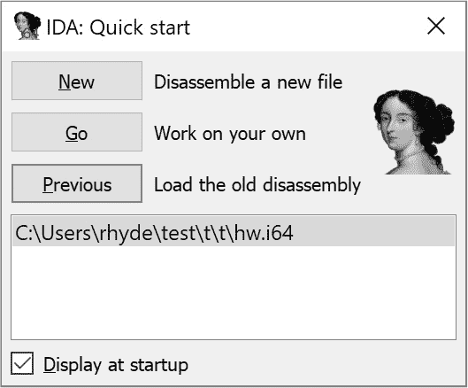
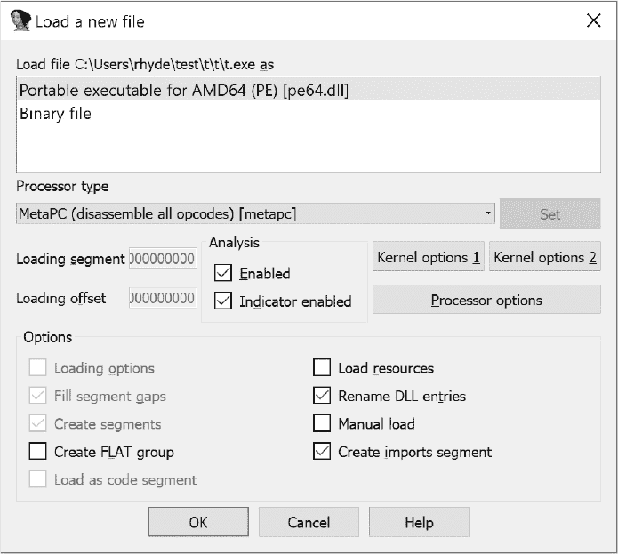
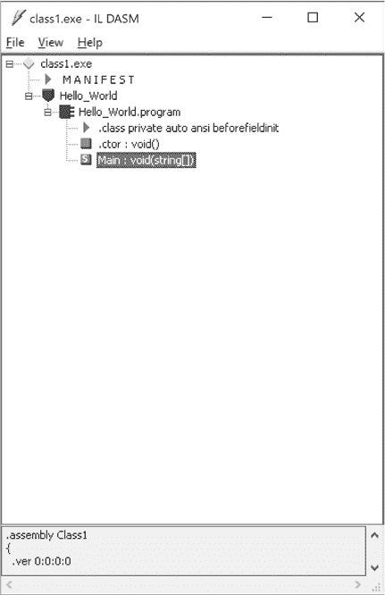

# 第五章：**分析编译器输出的工具**


为了编写优秀的代码，你必须能够识别编程语言序列之间的差异，即那些完成工作相对充分的序列与那些优秀的序列之间的差异。在我们讨论的背景下，优秀的代码序列比平庸的代码序列使用更少的指令、更少的机器周期或更少的内存。如果你在汇编语言中工作，CPU 制造商的技术手册和一些实验就足以确定哪些代码序列是优秀的，哪些不是。然而，在使用高级语言时，你需要某种方式将程序中的高级语言语句映射到相应的机器代码，以便你能够确定这些高级语言语句的质量。在本章中，我们将讨论如何：

+   查看并分析编译器的机器语言输出，以便你可以利用这些信息编写更好的高级语言代码

+   告诉某些编译器生成易于人类阅读的汇编语言输出文件

+   使用`dumpbin`和`objdump`等工具分析二进制目标输出文件

+   使用反汇编器检查编译器生成的机器代码输出

+   使用调试器分析编译器输出

+   比较两个不同的汇编语言清单，以确定哪个版本更好

分析编译器输出是你区分优秀机器代码与仅仅足够的机器代码所需的主要技能之一。要分析编译器输出，你需要学习几件事情。首先，你需要学习足够的汇编语言编程，以便能够有效地阅读编译器输出。^(1) 其次，你需要学习如何告诉编译器（或其他工具）生成易于人类阅读的汇编语言输出。最后，你必须学会如何将汇编指令与高级语言代码进行关联。第三章和第四章为你提供了阅读基本汇编代码所需的基础。本章讨论如何将编译器输出转化为人类可读的形式。本书其余部分则讲解如何分析这些汇编代码，从而通过明智选择高级语言语句生成更好的机器代码。

让我们从一些编译器输出的背景和优化时需要注意的事项开始。

### 5.1 背景

正如第四章所讨论的，大多数现有编译器生成目标代码输出，链接程序读取并处理这些目标代码以生成可执行程序。由于目标代码文件通常由不可读的二进制数据组成，因此许多编译器还提供生成汇编语言版本的输出代码的选项。通过启用此选项，你可以分析编译器的输出，并在必要时相应地改进 HLL 源代码。事实上，使用特定的编译器并对其优化有深入了解时，你可以编写出几乎与最佳手写汇编语言代码一样高效的 HLL 源代码，经过编译后生成的机器代码几乎达到最佳水平。尽管不能期望这种优化在每个编译器上都能有效，但这种技巧使你能够编写出优秀的代码，在一个编译器上运行良好，并且仍然能够在其他处理器上运行（尽管可能效率较低）。这对于需要在某些特定机器上尽可能高效运行的代码，同时还需要在其他 CPU 上运行的情况，是一个很好的解决方案。

**注意**

*请记住，检查编译器输出可能会导致你实现不可移植的优化。也就是说，当你检查编译器的输出时，你可能会决定修改 HLL 源代码以产生更好的输出；然而，这些优化可能不会在不同的编译器上生效。*

生成汇编语言输出的能力是编译器特有的。有些编译器默认就会这样做。例如，GCC 总是生成一个汇编语言文件（尽管通常在编译后会删除该文件）。然而，大多数编译器必须显式地告诉它们生成汇编语言清单。有些编译器生成的汇编清单可以通过汇编程序处理生成目标代码。有些编译器可能只在清单文件中生成汇编注释，而该“汇编代码”与现有的任何汇编程序都不兼容。对于你的用途而言，不需要关心现实世界中的汇编程序是否能够处理编译器的汇编输出；你只需要阅读这些输出，以确定如何调整 HLL 代码，从而生成更好的目标代码。

对于那些能够生成汇编语言输出的编译器，汇编代码的可读性差异很大。有些编译器将原始的高级语言（HLL）源代码作为注释插入到汇编输出中，这使得将汇编指令与 HLL 代码关联变得容易。其他编译器（如 GCC）则输出纯汇编语言代码；因此，除非你对特定 CPU 的汇编语言非常熟悉，否则分析输出可能会很困难。

另一个可能影响编译器输出可读性的问题是你选择的优化级别。如果你禁用所有优化，通常更容易确定哪些汇编指令对应于高级语言语句。不幸的是，禁用优化后，大多数编译器会生成低质量的代码。如果查看编译器汇编输出的目的是选择更好的高级语言序列，那么你必须指定与生产版本应用程序相同的优化级别。你绝不应该调整高级语言代码，以便在某一优化级别下生成更好的汇编代码，然后再为生产代码更改优化级别。如果你这样做，你可能会做一些优化器通常会为你做的额外工作。更糟糕的是，这些手动优化可能实际上会妨碍编译器在你提高优化级别时完成良好的工作。

当你为编译器指定更高的优化级别时，编译器通常会在汇编输出文件中移动代码，完全消除代码，或进行其他代码转换，这些操作使得高级语言代码与汇编输出之间的对应关系变得模糊。然而，通过一些实践，你仍然可以确定哪些机器指令对应于高级语言代码中的某个语句。

### 5.2 告诉编译器生成汇编输出

如何告诉编译器生成汇编语言输出文件是特定于编译器的。有关该信息，你需要查阅特定编译器的文档。本节将讨论两个常用的 C/C++ 编译器：GCC 和微软的 Visual C++。

#### 5.2.1 来自 GNU 编译器的汇编输出

要使用 GCC 编译器生成汇编输出，你需要在命令行中调用编译器时指定 `-S` 选项。以下是 GCC 的示例命令行：

```
gcc -O2 -S t1.c     # -O2 option is for optimization
```

当提供给 GCC 时，`-S` 选项实际上并不会告诉编译器生成汇编输出文件。GCC *总是* 会生成汇编输出文件。`-S` 只是告诉 GCC 在生成汇编文件后停止所有处理。GCC 会生成一个汇编输出文件，其根文件名与原始 C 文件相同（在这些示例中是 *t1*），并带有 *.s* 后缀（在正常编译过程中，GCC 会在汇编后删除 *.s* 文件）。

#### 5.2.2 来自 Visual C++ 的汇编输出

Visual C++ 编译器（VC++）使用 -`FA` 命令行选项来指定与 MASM 兼容的汇编语言输出。以下是告诉 VC++ 生成汇编清单的典型命令行：

```
cl -O2 -FA t1.c
```

#### 5.2.3 示例汇编语言输出

作为生成编译器汇编语言输出的示例，考虑以下 C 程序：

```

			#include <stdio.h>
int main( int argc, char **argv )
{
    int i;
    int j;

    i = argc;
    j = **argv;

    if( i == 2 )
    {
        ++j;
    }
    else
    {
        --j;
    }

    printf( "i=%d, j=%d\n", i, j );
    return 0;
}
```

以下各小节提供了来自 Visual C++ 和 GCC 的编译器输出，以突出它们各自的汇编语言清单之间的差异。

##### 5.2.3.1 Visual C++ 汇编语言输出

使用命令行通过 VC++ 编译此文件

```
cl -Fa -O1 t1.c
```

产生以下 (MASM) 汇编语言输出。

**注意**

*此输出中每个汇编语言语句的具体含义暂时不重要——重要的是看到该列表与接下来章节中 Visual C++ 和 Gas 的语法之间的区别。*

```

			; Listing generated by Microsoft (R) Optimizing
; Compiler Version 19.00.24234.1
; This listing is manually annotated for readability.

include listing.inc

INCLUDELIB LIBCMT
INCLUDELIB OLDNAMES

PUBLIC  __local_stdio_printf_options
PUBLIC  _vfprintf_l
PUBLIC  printf
PUBLIC  main
PUBLIC  ??_C@_0M@MJLDLLNK@i?$DN?$CFd?0?5j?$DN?$CFd?6?$AA@ ; `string'
EXTRN   __acrt_iob_func:PROC
EXTRN   __stdio_common_vfprintf:PROC
_DATA   SEGMENT
COMM    ?_OptionsStorage@?1??__local_stdio_printf_options@@9@9:QWORD                                                    ; `__local_stdio_printf_options'::`2'::_OptionsStorage
_DATA   ENDS
;       COMDAT pdata
pdata   SEGMENT
    .
    .
    .
;       COMDAT main
_TEXT   SEGMENT
argc$ = 48
argv$ = 56
main    PROC                                            ; COMDAT

$LN6:
        sub     rsp, 40                                 ; 00000028H

; if( i == 2 )
;{
;    ++j;
;}
;else
;{
;    --j
;}

        mov     rax, QWORD PTR [rdx]   ; rax (i) = *argc
        cmp     ecx, 2
        movsx   edx, BYTE PTR [rax]    ; rdx(j) = **argv

        lea     eax, DWORD PTR [rdx-1] ; rax = ++j
        lea     r8d, DWORD PTR [rdx+1] ; r8d = --j;

        mov     edx, ecx               ; edx = argc (argc was passed in rcx)
        cmovne  r8d, eax               ; eax = --j if i != 2

; printf( "i=%d, j+5d\n", i, j ); (i in edx, j in eax)

        lea     rcx, OFFSET FLAT:??_C@_0M@MJLDLLNK@i?$DN?$CFd?0?5j?$DN?$CFd?6?$AA@
        call    printf

; return 0;

        xor     eax, eax

        add     rsp, 40                                 ; 00000028H
        ret     0
main    ENDP
_TEXT   ENDS
; Function compile flags: /Ogtpy
; File c:\program files (x86)\windows kits\10\include\10.0.17134.0\ucrt\stdio.h
;       COMDAT printf
_TEXT   SEGMENT
    .
    .
    .
    END
```

##### 5.2.3.2 GCC 汇编语言输出 (PowerPC)

与 Visual C++ 类似，GCC 并不会将 C 源代码插入汇编输出文件。在 GCC 的情况下，这有一定的理解空间：生成汇编输出是它总是做的事情（而不是用户请求后才做的事情）。通过不将 C 源代码插入输出文件，GCC 可以稍微减少编译时间（因为编译器不需要写入 C 源代码数据，汇编器也不需要读取这些数据）。以下是使用命令行 `gcc -O1 -S t1.c` 时，GCC 为 PowerPC 处理器生成的输出：

```

			gcc -O1 -S t1.c

.data
.cstring
        .align 2
LC0:
        .ascii "i=%d, j=%d\12\0"
.text
        .align 2
        .globl _main
_main:
LFB1:
        mflr r0
        stw r31,-4(r1)
LCFI0:
        stw r0,8(r1)
LCFI1:
        stwu r1,-80(r1)
LCFI2:
        bcl 20,31,L1$pb
L1$pb:
        mflr r31
        mr r11,r3
        lwz r9,0(r4)
        lbz r0,0(r9)
        extsb r5,r0
        cmpwi cr0,r3,2
        bne+ cr0,L2
        addi r5,r5,1
        b L3
L2:
        addi r5,r5,-1
L3:
        addis r3,r31,ha16(LC0-L1$pb)
        la r3,lo16(LC0-L1$pb)(r3)
        mr r4,r11
        bl L_printf$stub
        li r3,0
        lwz r0,88(r1)
        addi r1,r1,80
        mtlr r0
        lwz r31,-4(r1)
        blr
LFE1:
.data
.picsymbol_stub
L_printf$stub:
        .indirect_symbol _printf
        mflr r0
        bcl 20,31,L0$_printf
L0$_printf:
        mflr r11
        addis r11,r11,ha16(L_printf$lazy_ptr-L0$_printf)
        mtlr r0
        lwz r12,lo16(L_printf$lazy_ptr-L0$_printf)(r11)
        mtctr r12
        addi r11,r11,lo16(L_printf$lazy_ptr-L0$_printf)
        bctr
.data
.lazy_symbol_pointer
L_printf$lazy_ptr:
        .indirect_symbol _printf
        .long dyld_stub_binding_helper
.data
.constructor
.data
.destructor
        .align 1
```

如你所见，GCC 的输出相当简洁。当然，因为这是 PowerPC 汇编语言，与 Visual C++ 编译器的 80x86 输出进行比较并不实际。

##### 5.2.3.3 GCC 汇编语言输出 (80x86)

以下代码提供了 GCC 编译到 x86-64 汇编代码的 *t1.c* 源文件：

```

			      .section    __TEXT,__text,regular,pure_instructions
    .macosx_version_min 10, 13
    .globl  _main                   ## -- Begin function main
    .p2align    4, 0x90
_main:                              ## @main
    .cfi_startproc
## BB#0:
    pushq   %rbp
Lcfi0:
    .cfi_def_cfa_offset 16
Lcfi1:
    .cfi_offset %rbp, -16
    movq    %rsp, %rbp
Lcfi2:
    .cfi_def_cfa_register %rbp
    movl    %edi, %ecx
    movq    (%rsi), %rax
    movsbl  (%rax), %eax
    cmpl    $2, %ecx
    movl    $1, %esi
    movl    $-1, %edx
    cmovel  %esi, %edx
    addl    %eax, %edx
    leaq    L_.str(%rip), %rdi
    xorl    %eax, %eax
    movl    %ecx, %esi
    callq   _printf
    xorl    %eax, %eax
    popq    %rbp
    retq
    .cfi_endproc
                                        ## -- End function
    .section    __TEXT,__cstring,cstring_literals
L_.str:                                 ## @.str
    .asciz  "i=%d, j=%d\n"

.subsections_via_symbols
```

这个例子应该能帮助展示，GCC 为 PowerPC 生成的大量代码更多的是机器架构的作用，而不是编译器本身的原因。如果将其与其他编译器生成的代码进行比较，你会发现它大致相当。

##### 5.2.3.4 GCC 汇编语言输出 (ARMv7)

以下代码提供了 GCC 编译到 ARMv6 汇编代码的 *t1.c* 源文件，编译环境为 Raspberry Pi（运行 32 位 Raspian）：

```

			..arch armv6
    .eabi_attribute 27, 3
    .eabi_attribute 28, 1
    .fpu vfp
    .eabi_attribute 20, 1
    .eabi_attribute 21, 1
    .eabi_attribute 23, 3
    .eabi_attribute 24, 1
    .eabi_attribute 25, 1
    .eabi_attribute 26, 2
    .eabi_attribute 30, 2
    .eabi_attribute 34, 1
    .eabi_attribute 18, 4
    .file   "t1.c"
    .section    .text.startup,"ax",%progbits
    .align  2
    .global main
    .type   main, %function
main:
    @ args = 0, pretend = 0, frame = 0
    @ frame_needed = 0, uses_anonymous_args = 0
    stmfd   sp!, {r3, lr}
    cmp r0, #2
    ldr r3, [r1]
    mov r1, r0
    ldr r0, .L5
    ldrb    r2, [r3]    @ zero_extendqisi2
    addeq   r2, r2, #1
    subne   r2, r2, #1
    bl  printf
    mov r0, #0
    ldmfd   sp!, {r3, pc}
.L6:
    .align  2
.L5:
    .word   .LC0
    .size   main, .-main
    .section    .rodata.str1.4,"aMS",%progbits,1
    .align  2
.LC0:
    .ascii  "i=%d, j=%d\012\000"
    .ident  "GCC: (Raspbian 4.9.2-10) 4.9.2"
    .section    .note.GNU-stack,"",%progbits
```

请注意，`@` 表示此源代码中的注释；Gas 会忽略从 `@` 到行末的所有内容。

##### 5.2.3.5 Swift 汇编语言输出 (x86-64)

给定一个 Swift 源文件 *main.swift*，你可以使用以下命令请求来自 macOS Swift 编译器的汇编语言输出文件：

```
swiftc -O -emit-assembly main.swift -o result.asm
```

这将生成 *result.asm* 输出的汇编语言文件。考虑以下 Swift 源代码：

```

			import Foundation

var i:Int = 0;
var j:Int = 1;

    if( i == 2 )
    {
        i = i + 1
    }
    else
    {
        i = i - 1
    }

    print( "i=\(i), j=\(j)" )
```

使用之前的命令行编译此文件会生成一个相当长的汇编语言输出文件；以下是该代码中的主要过程：

```

			_main:
.cfi_startproc
    pushq   %rbp
    .cfi_def_cfa_offset 16
    .cfi_offset %rbp, -16
    movq    %rsp, %rbp
    .cfi_def_cfa_register %rbp
    pushq   %r15
    pushq   %r14
    pushq   %r13
    pushq   %r12
    pushq   %rbx
    pushq   %rax
    .cfi_offset %rbx, -56
    .cfi_offset %r12, -48
    .cfi_offset %r13, -40
    .cfi_offset %r14, -32
    .cfi_offset %r15, -24
    movq    $1, _$S6result1jSivp(%rip)
    movq    $-1, _$S6result1iSivp(%rip)
    movq    _$Ss23_ContiguousArrayStorageCyypGML(%rip), %rdi
    testq   %rdi, %rdi
    jne LBB0_3
    movq    _$SypN@GOTPCREL(%rip), %rsi
    addq    $8, %rsi
    xorl    %edi, %edi
    callq   _$Ss23_ContiguousArrayStorageCMa
    movq    %rax, %rdi
    testq   %rdx, %rdx
    jne LBB0_3
    movq    %rdi, _$Ss23_ContiguousArrayStorageCyypGML(%rip)
LBB0_3:
    movabsq $8589934584, %r12
    movl    48(%rdi), %esi
    movzwl  52(%rdi), %edx
    addq    $7, %rsi
    andq    %r12, %rsi
    addq    $32, %rsi
    orq $7, %rdx
    callq   _swift_allocObject
    movq    %rax, %r14
    movq    _$Ss27_ContiguousArrayStorageBaseC16countAndCapacitys01_B4BodyVvpWvd@GOTPCREL(%rip), %rbx
    movq    (%rbx), %r15
    movaps  LCPI0_0(%rip), %xmm0
    movups  %xmm0, (%r14,%r15)
    movq    _$SSSN@GOTPCREL(%rip), %rax
    movq    %rax, 56(%r14)
    movq    _$Ss23_ContiguousArrayStorageCySSGML(%rip), %rdi
    testq   %rdi, %rdi
    jne LBB0_6
    movq    _$SSSN@GOTPCREL(%rip), %rsi
    xorl    %edi, %edi
    callq   _$Ss23_ContiguousArrayStorageCMa
    movq    %rax, %rdi
    testq   %rdx, %rdx
    jne LBB0_6
    movq    %rdi, _$Ss23_ContiguousArrayStorageCySSGML(%rip)
    movq    (%rbx), %r15
LBB0_6:
    movl    48(%rdi), %esi
    movzwl  52(%rdi), %edx
    addq    $7, %rsi
    andq    %r12, %rsi
    addq    $80, %rsi
    orq $7, %rdx
    callq   _swift_allocObject
    movq    %rax, %rbx
    movaps  LCPI0_1(%rip), %xmm0
    movups  %xmm0, (%rbx,%r15)
    movabsq $-2161727821137838080, %r15
    movq    %r15, %rdi
    callq   _swift_bridgeObjectRetain
    movl    $15721, %esi
    movq    %r15, %rdi
    callq   _$Ss27_toStringReadOnlyStreamableySSxs010TextOutputE0RzlFSS_Tg5Tf4x_n
    movq    %rax, %r12
    movq    %rdx, %r13
    movq    %r15, %rdi
    callq   _swift_bridgeObjectRelease
    movq    %r12, 32(%rbx)
    movq    %r13, 40(%rbx)
    movq    _$S6result1iSivp(%rip), %rdi
    callq   _$Ss26_toStringReadOnlyPrintableySSxs06CustomB11ConvertibleRzlFSi_Tg5
    movq    %rax, 48(%rbx)
    movq    %rdx, 56(%rbx)
    movabsq $-2017612633061982208, %r15
    movq    %r15, %rdi
    callq   _swift_bridgeObjectRetain
    movl    $1030365228, %esi
    movq    %r15, %rdi
    callq   _$Ss27_toStringReadOnlyStreamableySSxs010TextOutputE0RzlFSS_Tg5Tf4x_n
    movq    %rax, %r12
    movq    %rdx, %r13
    movq    %r15, %rdi
    callq   _swift_bridgeObjectRelease
    movq    %r12, 64(%rbx)
    movq    %r13, 72(%rbx)
    movq    _$S6result1jSivp(%rip), %rdi
    callq   _$Ss26_toStringReadOnlyPrintableySSxs06CustomB11ConvertibleRzlFSi_Tg5
    movq    %rax, 80(%rbx)
    movq    %rdx, 88(%rbx)
    movabsq $-2305843009213693952, %r15
    movq    %r15, %rdi
    callq   _swift_bridgeObjectRetain
    xorl    %esi, %esi
    movq    %r15, %rdi
    callq   _$Ss27_toStringReadOnlyStreamableySSxs010TextOutputE0RzlFSS_Tg5Tf4x_n
    movq    %rax, %r12
    movq    %rdx, %r13
    movq    %r15, %rdi
    callq   _swift_bridgeObjectRelease
    movq    %r12, 96(%rbx)
    movq    %r13, 104(%rbx)
    movq    %rbx, %rdi
    callq   _$SSS19stringInterpolationS2Sd_tcfCTf4nd_n
    movq    %rax, 32(%r14)
    movq    %rdx, 40(%r14)
    callq   _$Ss5print_9separator10terminatoryypd_S2StFfA0_
    movq    %rax, %r12
    movq    %rdx, %r15
    callq   _$Ss5print_9separator10terminatoryypd_S2StFfA1_
    movq    %rax, %rbx
    movq    %rdx, %rax
    movq    %r14, %rdi
    movq    %r12, %rsi
    movq    %r15, %rdx
    movq    %rbx, %rcx
    movq    %rax, %r8
    callq   _$Ss5print_9separator10terminatoryypd_S2StF
    movq    %r14, %rdi
    callq   _swift_release
    movq    %r12, %rdi
    callq   _swift_bridgeObjectRelease
    movq    %rbx, %rdi
    callq   _swift_bridgeObjectRelease
    xorl    %eax, %eax
    addq    $8, %rsp
    popq    %rbx
    popq    %r12
    popq    %r13
    popq    %r14
    popq    %r15
    popq    %rbp
    retq
    .cfi_endproc
```

如你所见，与 C++ 相比，Swift 生成的代码并不特别优化。实际上，为了节省空间，这里省略了数百行额外的代码。

#### 5.2.4 汇编输出分析

除非你熟练掌握汇编语言编程，否则分析汇编输出可能会很棘手。如果你不是汇编语言程序员，最好的做法是数一数指令，并假设如果某个编译器选项（或者对你的高级语言源代码进行重组）产生了更少的指令，结果应该是更好的。但实际上，这个假设并不总是正确的。一些机器指令（特别是在 CISC 处理器上，如 80x86）执行时间比其他指令要长得多。在像 80x86 这样的处理器上，三条或更多指令的序列可能比执行相同操作的单条指令更快。幸运的是，编译器通常不会基于你高级源代码的重组而生成这两种序列。因此，检查汇编输出时，你通常不需要担心这些问题。

请注意，如果你更改优化级别，一些编译器会生成两种不同的指令序列。这是因为某些优化设置会告诉编译器偏向于生成更短的程序，而其他优化设置则会告诉编译器偏向于生成更快的执行速度。偏向于生成更小可执行文件的优化设置可能会选择单条指令，而不是执行相同操作的三条指令（假设这三条指令编译成更多的代码）；偏向于速度的优化设置可能会选择执行速度更快的指令序列。

本节使用了各种 C/C++编译器作为示例，但你应当记住，其他语言的编译器也提供了生成汇编代码的功能。你需要查看编译器的文档，了解是否支持此功能，以及可以使用哪些选项生成汇编输出。一些编译器（例如 Visual C++）提供了集成开发环境（IDE），你可以使用它替代命令行工具。尽管大多数通过 IDE 工作的编译器也能通过命令行工作，但你通常可以在 IDE 内以及通过命令行指定汇编输出。再次提醒，查看编译器厂商的文档获取详细信息。

### 5.3 使用目标代码工具分析编译器输出

尽管许多编译器提供了发出汇编语言而不是目标代码的选项，但许多编译器并不提供；它们只能将二进制机器代码输出到目标代码文件。分析这种编译器输出会稍微复杂一些，并且需要一些专用的工具。如果你的编译器生成目标代码文件（如 PE/COFF 或 ELF 文件）以供链接器使用，你可能会找到一个“目标代码转储”工具，这对分析编译器的输出非常有用。例如，微软提供了*dumpbin.exe*程序，FSF/GNU 的*dumpobj*程序也具有类似的功能，用于 Linux 及其他操作系统下的 ELF 文件。在接下来的子节中，我们将了解在分析编译器输出时如何使用这两个工具。

使用目标文件的一个优点是它们通常包含符号信息。也就是说，除了二进制机器代码外，目标文件还包含指定标识符名称的字符串，这些名称出现在源文件中（这些信息通常不会出现在可执行文件中）。目标代码工具通常可以显示这些符号名称，在引用与这些符号关联的内存位置的机器指令中。尽管这些目标代码工具不能自动将高级语言源代码与机器代码相关联，但有符号信息可用时，当你研究它们的输出时会更加有帮助，因为像`JumpTable`这样的名称比像`$401_1000`这样的内存地址更容易理解。

#### 5.3.1 Microsoft dumpbin.exe 工具

微软的`dumpbin`命令行工具允许你检查微软 PE/COFF 文件的内容。^(2)你可以按照以下方式运行该程序：

```

			dumpbin options filename
```

文件名参数是你希望检查的*.obj*文件的名称，选项参数是一组可选的命令行参数，用于指定你希望显示的信息类型。这些选项每个都以斜杠(`/`)开头。接下来我们将查看每个可能的选项。首先，这是通过`/?`命令行选项获得的可能对象的列表：

```

			Microsoft (R) COFF/PE Dumper Version 14.00.24234.1
Copyright (C) Microsoft Corporation.  All rights reserved.

usage: dumpbin options files

   options:

      /ALL
      /ARCHIVEMEMBERS
      /CLRHEADER
      /DEPENDENTS
      /DIRECTIVES
      /DISASM[:{BYTES|NOBYTES}]
      /ERRORREPORT:{NONE|PROMPT|QUEUE|SEND}
      /EXPORTS
      /FPO
      /HEADERS
      /IMPORTS[:filename]
      /LINENUMBERS
      /LINKERMEMBER[:{1|2}]
      /LOADCONFIG
      /NOLOGO
      /OUT:filename
      /PDATA
      /PDBPATH[:VERBOSE]
      /RANGE:vaMin[,vaMax]
      /RAWDATA[:{NONE|1|2|4|8}[,#]]
      /RELOCATIONS
      /SECTION:name
      /SUMMARY
      /SYMBOLS
      /TLS
      /UNWINDINFO
```

尽管`dumpbin`的主要用途是查看编译器生成的目标代码，但它也会显示关于 PE/COFF 文件的相当多的有趣信息。关于许多`dumpbin`命令行选项的含义，更多信息请参阅第 71 页的“目标文件格式”或第 80 页的“可执行文件格式”。

以下子节描述了几种可能的`dumpbin`命令行选项，并为用 C 语言编写的简单“Hello World”程序提供了示例输出。

```

			#include <stdio.h>

int main( int argc, char **argv)
{
    printf( "Hello World\n" );
}
```

##### 5.3.1.1 /all

`/all` 命令行选项指示 `dumpbin` 显示它能提供的所有信息，除了对象文件中的代码反汇编。这个方法的问题在于，*.exe* 文件包含了链接器将语言标准库（例如 C 标准库）合并到应用程序中的所有例程。当分析编译器输出以改善应用程序的代码时，浏览这些关于程序外部代码的额外信息可能会很繁琐。幸运的是，有一个简单的方法可以减少不必要的信息——对对象文件（*.obj*）而非可执行文件（*.exe*）运行 `dumpbin`。以下是 `dumpbin` 对“Hello World”示例产生的（简化）输出：

```

			G:\>dumpbin /all hw.obj
Microsoft (R) COFF/PE Dumper Version 14.00.24234.1
Copyright (C) Microsoft Corporation.  All rights reserved.

Dump of file hw.obj

File Type: COFF OBJECT

FILE HEADER VALUES
            8664 machine (x64)
               D number of sections
        5B2C175F time date stamp Thu Jun 21 14:23:43 2018
             466 file pointer to symbol table
              2D number of symbols
               0 size of optional header
               0 characteristics

SECTION HEADER #1
.drectve name
       0 physical address
       0 virtual address
      2F size of raw data
     21C file pointer to raw data (0000021C to 0000024A)
       0 file pointer to relocation table
       0 file pointer to line numbers
       0 number of relocations
       0 number of line numbers
  100A00 flags
         Info
         Remove
         1 byte align

Hundreds of lines deleted...

  Summary

           D .data
          70 .debug$S
          2F .drectve
          24 .pdata
          C2 .text$mn
          18 .xdata
```

这个示例删除了大部分输出内容（以避免你阅读多达十几页的额外信息）。你可以尝试自己执行 `/all` 命令，看看你会得到多少输出。然而，总的来说，使用这个选项时要小心。

##### 5.3.1.2 /disasm

`/disasm` 命令行选项是我们最感兴趣的选项。它会生成对象文件的反汇编清单。与 `/all` 选项一样，你不应该尝试使用 `dumpbin` 反汇编 *.exe* 文件。你得到的反汇编清单可能会非常长，而且大多数代码可能只是你的应用程序调用的所有库例程的列表。例如，简单的“Hello World”应用程序会生成超过 5000 行的反汇编代码。除了极少数语句之外，所有这些语句都对应于库例程。浏览这么多代码对大多数人来说是压倒性的。

然而，如果你对 *hw.obj* 文件进行反汇编，而不是可执行文件，通常会得到以下输出：

```

			Microsoft (R) COFF/PE Dumper Version 14.00.24234.1
Copyright (C) Microsoft Corporation.  All rights reserved.

Dump of file hw.obj

File Type: COFF OBJECT

main:
  0000000000000000: 48 89 54 24 10     mov         qword ptr [rsp+10h],rdx
  0000000000000005: 89 4C 24 08        mov         dword ptr [rsp+8],ecx
  0000000000000009: 48 83 EC 28        sub         rsp,28h
  000000000000000D: 48 8D 0D 00 00 00  lea         rcx,[$SG4247]
                    00
  0000000000000014: E8 00 00 00 00     call        printf
  0000000000000019: 33 C0              xor         eax,eax
  000000000000001B: 48 83 C4 28        add         rsp,28h
  000000000000001F: C3                 ret

// Uninterested code emitted by dumpbin.exe left out...

  Summary

           D .data
          70 .debug$S
          2F .drectve
          24 .pdata
          C2 .text$mn
          28 .xdata
```

如果你仔细查看这个反汇编代码，你会发现反汇编对象文件而不是可执行文件的主要问题——代码中的大多数地址都是可重定位地址，在对象代码列表中显示为 `$00000000`。因此，你可能很难弄清楚各个汇编语句的作用。例如，在 *hw.obj* 的反汇编清单中，你会看到以下两条语句：

```

			000000000000000D:  48 8D 0D 00 00 00  lea         rcx,[$SG4247]
                   00
0000000000000014:  E8 00 00 00 00     call        printf
```

`lea` 指令操作码是 3 字节序列 `48 8D 0D`（其中包括一个 REX 操作码前缀字节）。`"Hello World"` 字符串的地址不是 `00 00 00 00`（操作码后面的 4 字节）；而是一个可重定位地址，链接器/系统稍后会填充这个地址。如果你在 *hw.obj* 上运行带有 `/all` 命令行选项的 `dumpbin`，你会注意到这个文件有两个重定位条目：

```

			RELOCATIONS #4
                                                Symbol    Symbol
 Offset    Type              Applied To         Index     Name
 --------  ----------------  -----------------  --------  ------
 00000010  REL32                      00000000         8  $SG4247
 00000015  REL32                      00000000        15  printf
```

偏移列告诉你将在文件中应用重定位的字节偏移量。在前面的反汇编中，注意到`lea`指令从偏移量`$d`开始，因此实际的位移在偏移量`$10`处。类似地，`call`指令从偏移量`$14`开始，因此需要修补的实际例程的地址在 1 字节之后，位于偏移量`$15`。通过`dumpbin`输出的重定位信息，你可以辨认出与这些重定位相关的符号。(`$SG4247`是 C 编译器为`"Hello World"`字符串生成的内部符号。而`printf`显然是与 C 语言的`printf()`函数相关联的名称。)

交叉引用每个调用和内存引用与重定位列表可能看起来很麻烦，但至少你在这样做时会获得符号名称。

考虑在对*hw.exe*文件应用`/disasm`选项时，反汇编代码的前几行：

```

			0000000140001009: 48 83 EC 28        sub         rsp,28h
000000014000100D: 48 8D 0D EC DF 01  lea         rcx,[000000014001F000h]
                  00
0000000140001014: E8 67 00 00 00     call        0000000140001080
0000000140001019: 33 C0              xor         eax,eax
000000014000101B: 48 83 C4 28        add         rsp,28h
000000014000101F: C3                 ret
                              .
                              .
                              .
```

请注意，链接器已经填充了偏移量`$SG4247`和`print`标签的地址（相对于文件的加载地址）。这看起来可能有点方便；然而，注意到这些标签（特别是`printf`标签）不再出现在文件中。当你阅读反汇编输出时，缺少这些标签可能会使得很难搞清楚哪些机器指令对应 HLL 语句。这是你在运行`dumpbin`时应该使用目标文件而非可执行文件的又一个原因。

如果你觉得阅读`dumpbin`工具的反汇编输出会非常麻烦，不必担心：为了优化目的，你通常更关注的是 HLL 程序两个版本之间的代码差异，而不是搞清楚每条机器指令的作用。因此，你可以通过对两个版本的目标文件（一个是在 HLL 代码更改之前，另一个是在更改之后生成的）运行`dumpbin`，轻松确定哪些机器指令受到代码更改的影响。例如，考虑对“Hello World”程序的以下修改：

```

			#include <stdio.h>

int main( int argc, char **argv)
{
        char *hwstr = "Hello World\n";

        printf( hwstr );
}
```

这是`dumpbin`生成的反汇编输出：

```

			Microsoft (R) COFF Binary File Dumper Version 6.00.8168
  0000000140001000: 48 89 54 24 10     mov         qword ptr [rsp+10h],rdx
  0000000140001005: 89 4C 24 08        mov         dword ptr [rsp+8],ecx
  0000000140001009: 48 83 EC 28        sub         rsp,28h
  000000014000100D: 48 8D 0D EC DF 01  lea         rcx,[000000014001F000h]
                    00
  0000000140001014: E8 67 00 00 00     call        0000000140001080
  0000000140001019: 33 C0              xor         eax,eax
  000000014000101B: 48 83 C4 28        add         rsp,28h
  000000014000101F: C3                 ret
```

通过将此输出与之前的汇编输出进行比较（无论是手动比较还是使用基于 Unix 的`diff`工具运行程序），你可以看到对 HLL 源代码的更改对生成的机器代码的影响。

**注意**

*第 137 页的“比较两个编译输出”部分讨论了两种比较方法（手动比较和基于`diff`的方法）的优缺点。*

##### 5.3.1.3 /headers

`/headers`选项指示`dumpbin`显示 COFF 头文件和节头文件。`/all`选项也会打印这些信息，但`/header`仅显示*头部信息*，而不包括所有其他输出。以下是“Hello World”可执行文件的示例输出：

```

			G:\WGC>dumpbin /headers hw.exe
Microsoft (R) COFF/PE Dumper Version 14.00.24234.1
Copyright (C) Microsoft Corporation.  All rights reserved.

Dump of file hw.exe

PE signature found

File Type: EXECUTABLE IMAGE

FILE HEADER VALUES
            8664 machine (x64)
               6 number of sections
        5B2C1A9F time date stamp Thu Jun 21 14:37:35 2018
               0 file pointer to symbol table
               0 number of symbols
              F0 size of optional header
              22 characteristics
                   Executable
                   Application can handle large (>2GB) addresses

OPTIONAL HEADER VALUES
             20B magic # (PE32+)
           14.00 linker version
           13400 size of code
            D600 size of initialized data
               0 size of uninitialized data
            1348 entry point (0000000140001348)
            1000 base of code
       140000000 image base (0000000140000000 to 0000000140024FFF)
            1000 section alignment
             200 file alignment
            6.00 operating system version
            0.00 image version
            6.00 subsystem version
               0 Win32 version
           25000 size of image
             400 size of headers
               0 checksum
               3 subsystem (Windows CUI)
            8160 DLL characteristics
                   High Entropy Virtual Addresses
                   Dynamic base
                   NX compatible
                   Terminal Server Aware
          100000 size of stack reserve
            1000 size of stack commit
          100000 size of heap reserve
            1000 size of heap commit
               0 loader flags
              10 number of directories
               0 [       0] RVA [size] of Export Directory
           1E324 [      28] RVA [size] of Import Directory
               0 [       0] RVA [size] of Resource Directory
           21000 [    126C] RVA [size] of Exception Directory
               0 [       0] RVA [size] of Certificates Directory
           24000 [     620] RVA [size] of Base Relocation Directory
           1CDA0 [      1C] RVA [size] of Debug Directory
               0 [       0] RVA [size] of Architecture Directory
               0 [       0] RVA [size] of Global Pointer Directory
               0 [       0] RVA [size] of Thread Storage Directory
           1CDC0 [      94] RVA [size] of Load Configuration Directory
               0 [       0] RVA [size] of Bound Import Directory
           15000 [     230] RVA [size] of Import Address Table Directory
               0 [       0] RVA [size] of Delay Import Directory
               0 [       0] RVA [size] of COM Descriptor Directory
               0 [       0] RVA [size] of Reserved Directory

SECTION HEADER #1
   .text name
   1329A virtual size
    1000 virtual address (0000000140001000 to 0000000140014299)
   13400 size of raw data
     400 file pointer to raw data (00000400 to 000137FF)
       0 file pointer to relocation table
       0 file pointer to line numbers
       0 number of relocations
       0 number of line numbers
60000020 flags
         Code
         Execute Read

SECTION HEADER #2
  .rdata name
    9A9A virtual size
   15000 virtual address (0000000140015000 to 000000014001EA99)
    9C00 size of raw data
   13800 file pointer to raw data (00013800 to 0001D3FF)
       0 file pointer to relocation table
       0 file pointer to line numbers
       0 number of relocations
       0 number of line numbers
40000040 flags
         Initialized Data
         Read Only

  Debug Directories
        Time Type        Size      RVA  Pointer
    -------- ------- -------- -------- --------
    5B2C1A9F coffgrp      2CC 0001CFC4    1B7C4

SECTION HEADER #3
   .data name
    1BA8 virtual size
   1F000 virtual address (000000014001F000 to 0000000140020BA7)
     A00 size of raw data
   1D400 file pointer to raw data (0001D400 to 0001DDFF)
       0 file pointer to relocation table
       0 file pointer to line numbers
       0 number of relocations
       0 number of line numbers
C0000040 flags
         Initialized Data
         Read Write

SECTION HEADER #4
  .pdata name
    126C virtual size
   21000 virtual address (0000000140021000 to 000000014002226B)
    1400 size of raw data
   1DE00 file pointer to raw data (0001DE00 to 0001F1FF)
       0 file pointer to relocation table
       0 file pointer to line numbers
       0 number of relocations
       0 number of line numbers
40000040 flags
         Initialized Data
         Read Only

SECTION HEADER #5
  .gfids name
      D4 virtual size
   23000 virtual address (0000000140023000 to 00000001400230D3)
     200 size of raw data
   1F200 file pointer to raw data (0001F200 to 0001F3FF)
       0 file pointer to relocation table
       0 file pointer to line numbers
       0 number of relocations
       0 number of line numbers
40000040 flags
         Initialized Data
         Read Only

SECTION HEADER #6
  .reloc name
     620 virtual size
   24000 virtual address (0000000140024000 to 000000014002461F)
     800 size of raw data
   1F400 file pointer to raw data (0001F400 to 0001FBFF)
       0 file pointer to relocation table
       0 file pointer to line numbers
       0 number of relocations
       0 number of line numbers
42000040 flags
         Initialized Data
         Discardable
         Read Only

  Summary

        2000 .data
        1000 .gfids
        2000 .pdata
        A000 .rdata
        1000 .reloc
       14000 .text
```

请回顾第四章中关于目标文件格式的讨论（参见第 71 页中的“目标文件格式”），以理解当你指定`/headers`选项时，`dumpbin`输出的信息。

##### 5.3.1.4 /imports

`/imports`选项列出了操作系统在程序加载到内存时必须提供的所有动态链接符号。由于这些信息对于分析 HLL 语句生成的代码并不特别有用，因此本章不会进一步提及此选项。

##### 5.3.1.5 /relocations

`/relocations`选项显示文件中的所有重定位对象。此命令非常有用，因为它提供了程序中所有符号及其在反汇编列表中的使用偏移的列表。当然，`/all`选项也会显示这些信息，但`/relocations`仅显示这些信息，而不包含其他内容。

##### 5.3.1.6 其他 dumpbin.exe 命令行选项

`dumpbin`工具支持许多本章未涉及的命令行选项。如前所述，你可以通过在命令行中指定`/?`来获取所有可能的选项列表。当运行`dumpbin`时，你还可以在线阅读更多内容，地址是*[`docs.microsoft.com/en-us/cpp/build/reference/dumpbin-reference?view=vs-2019/`](https://docs.microsoft.com/en-us/cpp/build/reference/dumpbin-reference?view=vs-2019/)*。

#### 5.3.2 FSF/GNU objdump 工具

如果你在操作系统上运行 GNU 工具集（例如，在 Linux、Mac 或 BSD 下），那么你可以使用 FSF/GNU 的`objdump`工具来检查由 GCC 和其他符合 GNU 标准的工具生成的目标文件。以下是它支持的命令行选项：

```

			Usage: objdump <option(s)> <file(s)>
Usage: objdump <option(s)> <file(s)>
Display information from object <file(s)>.
At least one of the following switches must be given:
  -a, --archive-headers    Display archive header information
  -f, --file-headers       Display the contents of the overall file header
  -p, --private-headers    Display object format specific file header contents
  -P, --private=OPT,OPT... Display object format specific contents
  -h, --[section-]headers  Display the contents of the section headers
  -x, --all-headers        Display the contents of all headers
  -d, --disassemble        Display assembler contents of executable sections
  -D, --disassemble-all    Display assembler contents of all sections
  -S, --source             Intermix source code with disassembly
  -s, --full-contents      Display the full contents of all sections requested
  -g, --debugging          Display debug information in object file
  -e, --debugging-tags     Display debug information using ctags style
  -G, --stabs              Display (in raw form) any STABS info in the file
  -W[lLiaprmfFsoRt] or
  --dwarf[=rawline,=decodedline,=info,=abbrev,=pubnames,=aranges,=macro,=frames,
          =frames-interp,=str,=loc,=Ranges,=pubtypes,
          =gdb_index,=trace_info,=trace_abbrev,=trace_aranges,
          =addr,=cu_index]
                           Display DWARF info in the file
  -t, --syms               Display the contents of the symbol table(s)
  -T, --dynamic-syms       Display the contents of the dynamic symbol table
  -r, --reloc              Display the relocation entries in the file
  -R, --dynamic-reloc      Display the dynamic relocation entries in the file
  @<file>                  Read options from <file>
  -v, --version            Display this program's version number
  -i, --info               List object formats and architectures supported
  -H, --help               Display this information

 The following switches are optional:
  -b, --target=BFDNAME           Specify the target object format as BFDNAME
  -m, --architecture=MACHINE     Specify the target architecture as MACHINE
  -j, --section=NAME             Only display information for section NAME
  -M, --disassembler-options=OPT Pass text OPT on to the disassembler
  -EB --endian=big               Assume big endian format when disassembling
  -EL --endian=little            Assume little endian format when disassembling
      --file-start-context       Include context from start of file (with -S)
  -I, --include=DIR              Add DIR to search list for source files
  -l, --line-numbers             Include line numbers and filenames in output
  -F, --file-offsets             Include file offsets when displaying information
  -C, --demangle[=STYLE]         Decode mangled/processed symbol names
                                 The STYLE, if specified, can be `auto', `gnu',
                                  `lucid', `arm', `hp', `edg', `gnu-v3', `java'
                                  or `gnat'
  -w, --wide                     Format output for more than 80 columns
  -z, --disassemble-zeroes       Do not skip blocks of zeroes when disassembling
      --start-address=ADDR       Only process data whose address is >= ADDR
      --stop-address=ADDR        Only process data whose address is <= ADDR
      --prefix-addresses         Print complete address alongside disassembly
      --[no-]show-raw-insn       Display hex alongside symbolic disassembly
      --insn-width=WIDTH         Display WIDTH bytes on a single line for -d
      --adjust-vma=OFFSET        Add OFFSET to all displayed section addresses
      --special-syms             Include special symbols in symbol dumps
      --prefix=PREFIX            Add PREFIX to absolute paths for -S
      --prefix-strip=LEVEL       Strip initial directory names for -S
      --dwarf-depth=N            Do not display DIEs at depth N or greater
      --dwarf-start=N            Display DIEs starting with N, at the same depth
                                 or deeper
      --dwarf-check              Make additional dwarf internal consistency checks.

objdump: supported targets: elf64-x86-64 elf32-i386 elf32-iamcu elf32-x86-64 a.out-i386-linux pei-i386 pei-x86-64 elf64-l1om elf64-k1om elf64-little elf64-big elf32-little elf32-big pe-x86-64 pe-bigobj-x86-64 pe-i386 plugin srec symbolsrec verilog tekhex binary ihex
objdump: supported architectures: i386 i386:x86-64 i386:x64-32 i8086 i386:intel i386:x86-64:intel i386:x64-32:intel i386:nacl i386:x86-64:nacl i386:x64-32:nacl iamcu iamcu:intel l1om l1om:intel k1om k1om:intel plugin
The following i386/x86-64 specific disassembler options are supported for use
with the -M switch (multiple options should be separated by commas):
  x86-64          Disassemble in 64bit mode
  i386            Disassemble in 32bit mode
  i8086           Disassemble in 16bit mode
  att             Display instruction in AT&T syntax
  intel           Display instruction in Intel syntax
  att-mnemonic    Display instruction in AT&T mnemonic
  intel-mnemonic  Display instruction in Intel mnemonic
  addr64          Assume 64bit address size
  addr32          Assume 32bit address size
  addr16          Assume 16bit address size
  data32          Assume 32bit data size
  data16          Assume 16bit data size
  suffix          Always display instruction suffix in AT&T syntax
  amd64           Display instruction in AMD64 ISA
  intel64         Display instruction in Intel64 ISA
Report bugs to <http://www.sourceware.org/bugzilla/>.
```

给定以下*m.hla*源代码片段：

```

			begin t;

        // test mem.alloc and mem.free:

        for( mov( 0, ebx ); ebx < 16; inc( ebx )) do

                // Allocate lots of storage:

                for( mov( 0, ecx ); ecx < 65536; inc( ecx )) do

                        rand.range( 1, 256 );
                        malloc( eax );
                        mov( eax, ptrs[ ecx*4 ] );

                endfor;
                   .
                   .
                   .
```

这是在 80x86 上生成的一些示例输出，通过 Linux 命令行`objdump -S m`创建：

```

			        objdump -S m

 0804807e <_HLAMain>:
 804807e:   89 e0                   mov    %esp,%eax

        .
        . // Some deleted code here,
        . // that HLA automatically generated.
        .

 80480ae:   bb 00 00 00 00          mov    $0x0,%ebx
 80480b3:   eb 2a                   jmp    80480df <StartFor__hla_2124>

080480b5 <for__hla_2124>:
 80480b5:   b9 00 00 00 00          mov    $0x0,%ecx
 80480ba:   eb 1a                   jmp    80480d6 <StartFor__hla_2125>

080480bc <for__hla_2125>:
 80480bc:   6a 01                   push   $0x1
 80480be:   68 00 01 00 00          push   $0x100
 80480c3:   e8 64 13 00 00          call   804942c <RAND_RANGE>
 80480c8:   50                      push   %eax
 80480c9:   e8 6f 00 00 00          call   804813d <MEM_ALLOC1>
 80480ce:   89 04 8d 68 c9 04 08    mov    %eax,0x804c968(,%ecx,4)

080480d5 <continue__hla_2125>:
 80480d5:   41                      inc    %ecx

080480d6 <StartFor__hla_2125>:
 80480d6:   81 f9 00 00 01 00       cmp    $0x10000,%ecx
 80480dc:   72 de                   jb     80480bc <for__hla_2125>

080480de <continue__hla_2124>:
 80480de:   43                      inc    %ebx

080480df <StartFor__hla_2124>:
 80480df:   83 fb 10                cmp    $0x10,%ebx
 80480e2:   72 d1                   jb     80480b5 <for__hla_2124>

080480e4 <QuitMain__hla_>:
 80480e4:   b8 01 00 00 00          mov    $0x1,%eax
 80480e9:   31 db                   xor    %ebx,%ebx
 80480eb:   cd 80                   int    $0x80
 8048274:   bb 00 00 00 00          mov    $0x0,%ebx
 8048279:   e9 d5 00 00 00          jmp    8048353 <L1021_StartFor__hla_>
 0804827e <L1021_for__hla_>:
 804827e:   b9 00 00 00 00          mov    $0x0,%ecx
 8048283:   eb 1a                   jmp    804829f <L1022_StartFor__hla_>

08048285 <L1022_for__hla_>:
 8048285:   6a 01                   push   $0x1
 8048287:   68 00 01 00 00          push   $0x100
 804828c:   e8 db 15 00 00          call   804986c <RAND_RANGE>
 8048291:   50                      push   %eax
 8048292:   e8 63 0f 00 00          call   80491fa <MEM_ALLOC>
 8048297:   89 04 8d 60 ae 04 08    mov    %eax,0x804ae60(,%ecx,4)

0804829e <L1022_continue__hla_>:
 804829e:   41                      inc    %ecx

0804829f <L1022_StartFor__hla_>:
 804829f:   81 f9 00 00 01 00       cmp    $0x10000,%ecx
 80482a5:   72 de                   jb     8048285 <L1022_for__hla_>

080482a7 <L1022_exitloop__hla_>:
 80482a7:   b9 00 00 00 00          mov    $0x0,%ecx
 80482ac:   eb 0d                   jmp    80482bb <L1023_StartFor__hla_>
```

这些列出的内容只是总代码的一个片段（这就是为什么某些标签缺失的原因）。不过，你可以看到`objdump`工具如何通过允许你反汇编特定代码片段的目标代码来分析编译器输出。

像`dumpbin`一样，`objdump`也可以显示除机器代码反汇编外的其他信息，这在分析编译器输出时可能会有所帮助。然而，对于大多数用途而言，GCC 的`-S`（汇编输出）选项是最有用的。以下是使用`objdump`工具对一些 C 代码进行反汇编的示例。首先是原始的 C 代码：

```

			// Original C code:

#include <stdio.h>
int main( int argc, char **argv )
{
    int i,j,k;

    j = **argv;
    k = argc;
    i = j && k;
    printf( "%d\n", i );
    return 0;
}
```

下面是 GCC 为 C 代码生成的 Gas 输出（x86-64）：

```

			    .file   "t.c"
    .section    .rodata
.LC0:
    .string "%d\n"
    .text
    .globl  main
    .type   main, @function
main:
.LFB0:
    .cfi_startproc
    pushq   %rbp
    .cfi_def_cfa_offset 16
    .cfi_offset 6, -16
    movq    %rsp, %rbp
    .cfi_def_cfa_register 6
    subq    $32, %rsp
    movl    %edi, -20(%rbp)
    movq    %rsi, -32(%rbp)
    movq    -32(%rbp), %rax
    movq    (%rax), %rax
    movzbl  (%rax), %eax
    movsbl  %al, %eax
    movl    %eax, -12(%rbp)
    movl    -20(%rbp), %eax
    movl    %eax, -8(%rbp)
    cmpl    $0, -12(%rbp)
    je  .L2
    cmpl    $0, -8(%rbp)
    je  .L2
    movl    $1, %eax
    jmp .L3
.L2:
    movl    $0, %eax
.L3:
    movl    %eax, -4(%rbp)
    movl    -4(%rbp), %eax
    movl    %eax, %esi
    movl    $.LC0, %edi
    movl    $0, %eax
    call    printf
    movl    $0, %eax
    leave
    .cfi_def_cfa 7, 8
    ret
    .cfi_endproc
.LFE0:
    .size   main, .-main
    .ident  "GCC: (Ubuntu 5.4.0-6ubuntu1~16.04.9) 5.4.0 20160609"
    .section    .note.GNU-stack,"",@progbits
```

现在，这是`objdump`反汇编的主函数：

```

			.file   "t.c"

0000000000400526 <main>:
  400526:   55                      push   %rbp
  400527:   48 89 e5                mov    %rsp,%rbp
  40052a:   48 83 ec 20             sub    $0x20,%rsp
  40052e:   89 7d ec                mov    %edi,-0x14(%rbp)
  400531:   48 89 75 e0             mov    %rsi,-0x20(%rbp)
  400535:   48 8b 45 e0             mov    -0x20(%rbp),%rax
  400539:   48 8b 00                mov    (%rax),%rax
  40053c:   0f b6 00                movzbl (%rax),%eax
  40053f:   0f be c0                movsbl %al,%eax
  400542:   89 45 f4                mov    %eax,-0xc(%rbp)
  400545:   8b 45 ec                mov    -0x14(%rbp),%eax
  400548:   89 45 f8                mov    %eax,-0x8(%rbp)
  40054b:   83 7d f4 00             cmpl   $0x0,-0xc(%rbp)
  40054f:   74 0d                   je     40055e <main+0x38>
  400551:   83 7d f8 00             cmpl   $0x0,-0x8(%rbp)
  400555:   74 07                   je     40055e <main+0x38>
  400557:   b8 01 00 00 00          mov    $0x1,%eax
  40055c:   eb 05                   jmp    400563 <main+0x3d>
  40055e:   b8 00 00 00 00          mov    $0x0,%eax
  400563:   89 45 fc                mov    %eax,-0x4(%rbp)
  400566:   8b 45 fc                mov    -0x4(%rbp),%eax
  400569:   89 c6                   mov    %eax,%esi
  40056b:   bf 14 06 40 00          mov    $0x400614,%edi
  400570:   b8 00 00 00 00          mov    $0x0,%eax
  400575:   e8 86 fe ff ff          callq  400400 <printf@plt>
  40057a:   b8 00 00 00 00          mov    $0x0,%eax
  40057f:   c9                      leaveq
  400580:   c3                      retq
```

如你所见，汇编代码输出比`objdump`的输出更容易阅读。

### 5.4 使用反汇编器分析编译器输出

尽管使用目标代码“转储”工具是一种分析编译器输出的方法，另一个可能的解决方案是对可执行文件运行*反汇编器*。反汇编器是一种工具，它将二进制机器码翻译成人类可读的汇编语言语句（“人类可读”这个说法有待商榷，但大体就是这个意思）。因此，它是另一个可以用来分析编译器输出的工具。

目标代码转储工具（它包含一个简单的反汇编器）和复杂的反汇编程序之间有一个微妙但重要的区别。目标代码转储工具是自动的，但如果目标代码包含复杂的构造（例如指令流中的隐藏数据），它们很容易被弄错。*自动反汇编器*使用起来非常方便，用户不需要太多专业知识，但很少能正确反汇编机器码。另一方面，完全功能的*交互式反汇编器*需要更多的训练才能正确使用，但它能够在用户的帮助下反汇编复杂的机器码序列。因此，优秀的反汇编器能够在简单的目标代码转储工具无法处理的情况下工作。幸运的是，大多数编译器不会总是生成那些让目标代码转储工具困惑的复杂代码，因此有时你可以不用学会如何使用完全功能的反汇编程序。不过，在简单方法无法奏效的情况下，拥有一个反汇编器会非常有用。

有几款“免费”的反汇编器可供使用。本章将介绍的工具是 IDA7。IDA 是 IDA Pro 的免费版本，是一个功能强大且能力卓越的商业反汇编系统（*[`www.hex-rays.com/products/ida/`](https://www.hex-rays.com/products/ida/)*）。

当你首次运行 IDA 时，它会打开图 5-1 中显示的窗口。



*图 5-1：IDA 启动窗口*

点击**新建**按钮并输入你希望反汇编的*.exe*或*.obj*文件名。输入可执行文件名后，IDA 会弹出图 5-2 中显示的格式对话框。在这个对话框中，你可以选择二进制文件类型（例如，PE/COFF、PE64 可执行文件或纯二进制）以及反汇编文件时使用的选项。IDA 在选择这些选项的默认值时做得很好，所以大多数情况下你只需接受默认设置，除非你在处理一些特殊的二进制文件。



*图 5-2：IDA 可执行文件格式对话框*

一般来说，IDA 会找出适当的文件类型信息进行标准的反汇编，然后对目标代码文件进行“自动”反汇编。要生成汇编语言输出文件，请点击**确定**。以下是“示例汇编语言输出”中给出的*t1.c*文件反汇编的前几行，参见 第 102 页：

```

			; int __cdecl main(int argc, const char **argv, const char **envp)
main    proc    near
        sub     rsp, 28h
        mov     rax, [rdx]
        cmp     ecx, 2
        movsx   edx, byte ptr [rax]
        lea     eax, [rdx-1]
        lea     r8d, [rdx+1]
        mov     edx, ecx
        cmovnz  r8d, eax
        lea     rcx, aIDJD      ; "i=%d, j=%d\n"
        call    sub_140001040
        xor     eax, eax
        add     rsp, 28h
        retn
main endp
```

IDA 是一个 *交互式* 反汇编器。这意味着它提供了许多复杂的功能，你可以利用这些功能引导反汇编过程，以生成更合理的汇编语言输出文件。然而，它的“自动”模式通常就是你需要的，用来检查编译器输出文件并评估其质量。有关 IDA（免费版）或 IDA Pro 的更多详细信息，请参见其文档 (*[`www.hex-rays.com/products/ida/support/`](https://www.hex-rays.com/products/ida/support/)*).

### 5.5 使用 Java 字节码反汇编器分析 Java 输出

大多数 Java 编译器（特别是来自 Oracle 公司）并不会直接生成机器码。相反，它们生成 Java 字节码（JBC），计算机系统随后通过 JBC 解释器执行它。为了提高性能，一些 Java 解释器会运行即时编译器（JIT），在解释过程中将 JBC 转换为本地机器码以提高性能（尽管结果通常不如优化编译器生成的机器码）。不幸的是，由于 Java 解释器在运行时进行此转换，因此很难分析 Java 编译器生成的机器码输出。然而，可以分析它生成的 JBC。这可以让你比单纯猜测更好地了解编译器是如何处理你的 Java 代码的。考虑以下（相对简单的）Java 程序：

```

			public class Welcome
{
    public static void main( String[] args )
    {
        switch(5)
        {
            case 0:
                System.out.println("0");
                break;
            case 1:
                System.out.println("1");
                break;
            case 2:
            case 5:
                System.out.println("5");
                break;
            default:
                System.out.println("default" );
        }
        System.out.println( "Hello World" );
    }
}
```

通常，你可以使用类似下面的命令行来编译这个程序（*Welcome.java*）：

```
javac Welcome.java
```

此命令生成 *Welcome.class* JBC 文件。你可以使用以下命令来反汇编此文件（输出到标准输出）：

```
javap -c Welcome
```

请注意，在命令行中不需要包含 *.class* 文件扩展名；`javap` 命令会自动添加它。

`javap` 命令会生成类似以下的字节码反汇编清单：

```

			Compiled from "Welcome.java"
public class Welcome extends java.lang.Object{
public Welcome();
  Code:
   0:   aload_0
   1:   invokespecial   #1; //Method java/lang/Object."<init>":()V
   4:   return

public static void main(java.lang.String[]);
  Code:
   0:   iconst_5
   1:   tableswitch{ //0 to 5
        0: 40;
        1: 51;
        2: 62;
        3: 73;
        4: 73;
        5: 62;
        default: 73 }
   40:  getstatic   #2;     //Field java/lang/System.out:Ljava/io/PrintStream;
   43:  ldc #3;             //String 0
   45:  invokevirtual   #4; //Method java/io/PrintStream.println:(Ljava/lang/String;)V
   48:  goto    81
   51:  getstatic   #2;     //Field java/lang/System.out:Ljava/io/PrintStream;
   54:  ldc #5;             //String 1
   56:  invokevirtual   #4; //Method java/io/PrintStream.println:(Ljava/lang/String;)V
   59:  goto    81
   62:  getstatic   #2;     //Field java/lang/System.out:Ljava/io/PrintStream;
   65:  ldc #6;             //String 5
   67:  invokevirtual   #4; //Method java/io/PrintStream.println:(Ljava/lang/String;)V
   70:  goto    81
   73:  getstatic   #2;     //Field java/lang/System.out:Ljava/io/PrintStream;
   76:  ldc #7;             //String default
   78:  invokevirtual   #4; //Method java/io/PrintStream.println:(Ljava/lang/String;)V
   81:  getstatic   #2;     //Field java/lang/System.out:Ljava/io/PrintStream;
   84:  ldc #8;             //String Hello World
   86:  invokevirtual   #4; //Method java/io/PrintStream.println:(Ljava/lang/String;)V
   89:  return
}
```

你可以在 [Oracle.com](http://Oracle.com) 上找到 JBC 助记符和 `javap` Java 类文件反汇编器的文档（在网站中搜索`javap`和“Java 字节码反汇编器”）。此外，本书附带的在线章节（特别是附录 D）讨论了 Java VM 字节码汇编语言。

### 5.6 使用 IL 反汇编器分析微软 C# 和 Visual Basic 输出

微软的 .NET 语言编译器不会直接生成本地机器码。相反，它们会生成一种特殊的 IL（中间语言）代码。原理上，这与 Java 字节码或 UCSD p-machine 代码非常相似。 .NET 运行时系统会编译 IL 可执行文件，并通过 JIT 编译器运行它们。

微软的 C# 编译器是一个很好的例子，它属于以这种方式工作的 .NET 语言。编译一个简单的 C# 程序将生成一个微软的 *.exe* 文件，你可以使用 `dumpbin` 来查看。遗憾的是，你不能使用 `dumpbin` 来查看目标代码（无论是 IL 还是其他格式）。幸运的是，微软提供了一个工具 *ildasm.exe*，你可以用它来反汇编 IL 字节码/汇编代码。

考虑以下小型 C# 示例程序（*Class1.cs*，对常见的“Hello World!”程序稍作调整）：

```

			using System;
using System.Collections.Generic;
using System.Linq;
using System.Text;
using System.Threading.Tasks;

namespace Hello_World
{
    class program
    {
        static void Main( string[] args)
        {
            int i = 5;
            int j = 6;
            int k = i + j;
            Console.WriteLine("Hello World! k={0}", k);
        }
    }
}
```

在命令提示符下键入`ildasm class1.exe`会弹出图 5-3 所示的窗口。



*图 5-3：IL 反汇编窗口*

要查看代码反汇编，双击 S 图标（位于 Main 条目旁）。这会打开一个窗口，其中包含以下文本（为清晰起见添加了注释）：

```

			.method private hidebysig static void  Main(string[] args) cil managed
{
  .entrypoint
  // Code size       25 (0x19)
  .maxstack  2
  .locals init (int32 V_0,
           int32 V_1,
           int32 V_2)
; push constant 5 on stack

  IL_0000:  ldc.i4.5

; pop stack and store into i

  IL_0001:  stloc.0

; push constant 6 on stack

  IL_0002:  ldc.i4.6

; pop stack and store in j

  IL_0003:  stloc.1

; Push i and j onto stack:

  IL_0004:  ldloc.0
  IL_0005:  ldloc.1

; Add two items on stack, leave result on stack

  IL_0006:  add

; Store sum into k

  IL_0007:  stloc.2

; Load string onto stack (pointer to string)

  IL_0008:  ldstr      "Hello World! k={0}"

; Push k's value onto stack:

  IL_000d:  ldloc.2
  IL_000e:  box        [mscorlib]System.Int32

; call writeline routine:

  IL_0013:  call       void [mscorlib]System.Console::WriteLine(string,
                                                                object)
  IL_0018:  ret
} // end of method program::Main
```

你可以使用 IL 反汇编程序来处理任何 .NET 语言（如 Visual Basic 和 F#）。有关微软 IL 汇编语言的详细信息，请参阅在线的附录 E。

### 5.7 使用调试器分析编译器输出

另一个分析编译器输出的选项是使用调试程序，通常调试程序内置有反汇编器，可以用来查看机器指令。根据所使用的调试器，查看编译器输出的过程可能会让你头疼，也可能是轻松愉快的。通常，如果你使用独立的调试器，你会发现分析编译器输出的工作要比使用集成在编译器 IDE 中的调试器更加繁琐。本节将介绍这两种方法。

#### 5.7.1 使用 IDE 的调试器

微软的 Visual C++ 环境提供了出色的工具来分析编译过程中生成的代码（当然，编译器也会生成汇编输出，但在这里我们暂不讨论）。要使用 Visual Studio 调试器查看输出，首先将你的 C/C++ 程序编译为可执行文件，然后从 Visual Studio 调试菜单中选择 **调试** ▸ **逐步进入**。当程序暂停执行时，从调试菜单中选择 **调试** ▸ **窗口** ▸ **反汇编**。对于 *t1.c* 程序（参见第 102 页的“示例汇编语言输出”），你应该会看到如下反汇编内容（假设你正在生成 32 位代码）：

```

			--- c:\users\rhyde\test\t\t\t.cpp ----------------------------------------------
#include "stdafx.h"
#include <stdio.h>
int main(int argc, char **argv)
{
00F61000  push        ebp
00F61001  mov         ebp,esp
00F61003  sub         esp,8
    int i;
    int j;

    i = argc;
00F61006  mov         eax,dword ptr [argc]
00F61009  mov         dword ptr [i],eax
    j = **argv;
00F6100C  mov         ecx,dword ptr [argv]
00F6100F  mov         edx,dword ptr [ecx]
00F61011  movsx       eax,byte ptr [edx]
00F61014  mov         dword ptr [j],eax

    if (i == 2)
00F61017  cmp         dword ptr [i],2
00F6101B  jne         main+28h (0F61028h)
    {
        ++j;
00F6101D  mov         ecx,dword ptr [j]
00F61020  add         ecx,1
00F61023  mov         dword ptr [j],ecx
    }
    else
00F61026  jmp         main+31h (0F61031h)
    {
        --j;
00F61028  mov         edx,dword ptr [j]
00F6102B  sub         edx,1
00F6102E  mov         dword ptr [j],edx
    }

    printf("i=%d, j=%d\n", i, j);
00F61031  mov         eax,dword ptr [j]
00F61034  push        eax
00F61035  mov         ecx,dword ptr [i]
00F61038  push        ecx
00F61039  push        0F620F8h
00F6103E  call        printf (0F61090h)
00F61043  add         esp,0Ch
    return 0;
00F61046  xor         eax,eax
}
00F61048  mov         esp,ebp
00F6104A  pop         ebp
00F6104B  ret
```

当然，因为微软的 Visual C++ 包已经能够在编译过程中输出汇编语言文件，所以以这种方式使用 Visual Studio 集成调试器并非必要。^(3) 然而，有些编译器不提供汇编输出，调试器的输出可能是查看编译器生成的机器代码最简单的方式。例如，Embarcadero 的 Delphi 编译器不提供生成汇编语言输出的选项。考虑到 Delphi 在应用程序中链接了大量的类库代码，尝试通过反汇编程序查看程序小部分代码就像是在大海捞针。更好的解决方案是使用 Delphi 环境内置的调试器。

#### 5.7.2 使用独立调试器

如果你的编译器没有将自己的调试器作为 IDE 的一部分提供，另一种选择是使用像 OllyDbg、DDD 或 GDB 等独立调试器来反汇编编译器的输出。只需将可执行文件加载到调试器中，进行常规调试操作即可。

大多数与特定编程语言无关的调试器是机器级调试器，它们将二进制机器代码反汇编成机器指令，以便在调试过程中查看。使用机器级调试器的一大问题是定位要反汇编的特定代码段可能会很困难。记住，当你将整个可执行文件加载到调试器时，你同时也加载了所有静态链接的库例程和其他在应用程序源文件中通常不会出现的运行时支持代码。要在这些多余的代码中查找编译器如何将特定的语句序列转换为机器代码，可能会耗费大量时间。有时可能需要一些艰苦的代码侦探工作。幸运的是，大多数链接器会将所有的库例程集中在一起，并将它们放在可执行文件的开头或结尾。因此，通常你也会在这些位置找到与应用程序相关的代码。

调试器有三种不同的类型：纯机器级调试器、符号调试器和源代码级调试器。符号调试器和源代码级调试器要求可执行文件包含特殊的调试信息，因此编译器必须专门包含这些额外的信息。

纯机器级调试器无法访问应用程序中的原始源代码或符号。纯机器级调试器仅仅是反汇编应用程序的机器代码，并使用字面数值常量和机器地址显示反汇编列表。阅读这样的代码是困难的，但如果你理解编译器如何为高级语言（HLL）语句生成代码（正如本书将教给你的那样），那么定位机器代码就容易得多。尽管如此，由于缺乏符号信息提供“根点”，分析可能会变得困难。

符号调试器使用在可执行文件中找到的特殊符号表信息（或者在某些情况下是单独的调试文件）将标签与函数关联，并可能将变量名与源文件中的函数关联。这一功能使得在反汇编列表中定位代码段变得更加容易。当符号标签识别出函数调用时，更容易看到反汇编代码与原始高级语言（HLL）源代码之间的对应关系。然而，需要记住的是，符号信息仅在应用程序启用了调试模式编译时可用。请查看编译器的文档，了解如何为调试器启用此功能。

源代码级调试器实际上会显示与调试器正在处理的文件相关的原始源代码。为了查看编译器生成的机器代码，你通常需要激活程序的特殊机器级视图。与符号调试器一样，编译器必须生成包含调试信息的特殊可执行文件（或辅助文件），这些文件供源代码级调试器使用。显然，源代码级调试器更易于使用，因为它们显示了原始高级语言源代码与反汇编机器代码之间的对应关系。

### 5.8 比较两次编译的输出

如果你是一个资深的汇编语言程序员，并且精通编译器设计，那么你应该能够很容易地判断出需要对你的高级语言（HLL）源代码做哪些修改，以改善输出机器代码的质量。然而，大多数程序员（尤其是那些没有大量经验研究编译器输出的程序员）不能仅凭编译器的汇编语言输出进行判断。他们必须比较两组输出（修改前和修改后的输出），以确定哪一段代码更好。毕竟，并不是每一次修改高级语言源代码都会生成更好的代码。有些修改可能不会影响机器代码（在这种情况下，你应该使用更具可读性和可维护性的高级语言源代码版本）。在其他情况下，你甚至可能会让输出的机器代码变得更差。因此，除非你确切知道编译器在你修改高级语言源文件时会做什么，否则在接受任何修改之前，你应该对编译器的输出机器代码进行修改前后的对比。

#### 5.8.1 使用 diff 进行修改前后的比较

当然，任何有经验的软件开发人员的第一反应是：“嗯，如果我们需要比较文件，我们就使用`diff`！”事实证明，典型的`diff`（计算文件差异）程序在某些情况下会很有用，但在比较编译器输出的两个不同文件时，它并不总是适用。像`diff`这样的程序的问题在于，当两个文件之间只有少量差异时，它能很好地工作，但当文件差异巨大时，它就不太有用了。例如，考虑以下的 C 程序（*t.c*）和由 Microsoft VC++ 编译器产生的两个不同输出：

```

			extern void f( void );
int main( int argc, char **argv )
{
    int boolResult;

    switch( argc )
    {
        case 1:
            f();
            break;

        case 10:
            f();
            break;

        case 100:
            f();
            break;

        case 1000:
            f();
            break;

        case 10000:
            f();
            break;

        case 100000:
            f();
            break;

        case 1000000:
            f();
            break;

        case 10000000:
            f();
            break;

        case 100000000:
            f();
            break;
 case 1000000000:
            f();
            break;

    }
    return 0;
}
```

这是使用命令行 `cl /Fa t.c`（即在没有优化的情况下编译）时 MSVC++ 产生的汇编语言输出：

```

			  ; Listing generated by Microsoft (R) Optimizing Compiler Version 19.00.24234.1

include listing.inc

INCLUDELIB LIBCMT
INCLUDELIB OLDNAMES

PUBLIC  main
EXTRN   f:PROC
pdata   SEGMENT
$pdata$main DD  imagerel $LN16
        DD      imagerel $LN16+201
        DD      imagerel $unwind$main
pdata   ENDS
xdata   SEGMENT
$unwind$main DD 010d01H
        DD      0620dH
xdata   ENDS
; Function compile flags: /Odtp
_TEXT   SEGMENT
tv64 = 32
argc$ = 64
argv$ = 72
main    PROC
; File c:\users\rhyde\test\t\t\t.cpp
; Line 4
$LN16:
        mov     QWORD PTR [rsp+16], rdx
        mov     DWORD PTR [rsp+8], ecx
        sub     rsp, 56                                 ; 00000038H
; Line 7
        mov     eax, DWORD PTR argc$[rsp]
        mov     DWORD PTR tv64[rsp], eax
        cmp     DWORD PTR tv64[rsp], 100000             ; 000186a0H
        jg      SHORT $LN15@main
        cmp     DWORD PTR tv64[rsp], 100000             ; 000186a0H
        je      SHORT $LN9@main
        cmp     DWORD PTR tv64[rsp], 1
        je      SHORT $LN4@main
        cmp     DWORD PTR tv64[rsp], 10
        je      SHORT $LN5@main
        cmp     DWORD PTR tv64[rsp], 100                ; 00000064H
        je      SHORT $LN6@main
        cmp     DWORD PTR tv64[rsp], 1000               ; 000003e8H
        je      SHORT $LN7@main
        cmp     DWORD PTR tv64[rsp], 10000              ; 00002710H
        je      SHORT $LN8@main
        jmp     SHORT $LN2@main
$LN15@main:
        cmp     DWORD PTR tv64[rsp], 1000000            ; 000f4240H
        je      SHORT $LN10@main
        cmp     DWORD PTR tv64[rsp], 10000000           ; 00989680H
        je      SHORT $LN11@main
        cmp     DWORD PTR tv64[rsp], 100000000          ; 05f5e100H
        je      SHORT $LN12@main
        cmp     DWORD PTR tv64[rsp], 1000000000         ; 3b9aca00H
        je      SHORT $LN13@main
        jmp     SHORT $LN2@main
$LN4@main:
; Line 10
        call    f
; Line 11
        jmp     SHORT $LN2@main
$LN5@main:
; Line 14
        call    f
; Line 15
        jmp     SHORT $LN2@main
$LN6@main:
; Line 18
        call    f
; Line 19
        jmp     SHORT $LN2@main
$LN7@main:
; Line 22
        call    f
; Line 23
        jmp     SHORT $LN2@main
$LN8@main:
; Line 26
        call    f
; Line 27
        jmp     SHORT $LN2@main
$LN9@main:
; Line 30
        call    f
; Line 31
        jmp     SHORT $LN2@main
$LN10@main:
; Line 34
        call    f
; Line 35
        jmp     SHORT $LN2@main
$LN11@main:
; Line 38
        call    f
; Line 39
        jmp     SHORT $LN2@main

$LN12@main:
; Line 42
        call    f
; Line 43
        jmp     SHORT $LN2@main
$LN13@main:
; Line 46
        call    f
$LN2@main:
; Line 50
        xor     eax, eax
; Line 51
        add     rsp, 56                                 ; 00000038H
        ret     0
main    ENDP
_TEXT   ENDS
END
```

这是我们使用命令行 `cl /Ox /Fa t.c` 编译 C 程序时获得的汇编清单（`/Ox` 在 Visual C++ 中启用最大优化以提高速度）：

```

			    ; Listing generated by Microsoft (R) Optimizing Compiler Version 19.00.24234.1

include listing.inc

INCLUDELIB LIBCMT
INCLUDELIB OLDNAMES

PUBLIC  main
EXTRN   f:PROC
pdata   SEGMENT
$pdata$main DD  imagerel $LN18
        DD      imagerel $LN18+89
        DD      imagerel $unwind$main
pdata   ENDS
xdata   SEGMENT
$unwind$main DD 010401H
        DD      04204H
xdata   ENDS
; Function compile flags: /Ogtpy
_TEXT   SEGMENT
argc$ = 48
argv$ = 56
main    PROC
; File c:\users\rhyde\test\t\t\t.cpp
; Line 4
$LN18:
        sub     rsp, 40                                 ; 00000028H
; Line 7
        cmp     ecx, 100000                             ; 000186a0H
        jg      SHORT $LN15@main
        je      SHORT $LN10@main
        sub     ecx, 1
        je      SHORT $LN10@main
        sub     ecx, 9
        je      SHORT $LN10@main
        sub     ecx, 90                                 ; 0000005aH
        je      SHORT $LN10@main
        sub     ecx, 900                                ; 00000384H
        je      SHORT $LN10@main
        cmp     ecx, 9000                               ; 00002328H
; Line 27
        jmp     SHORT $LN16@main
$LN15@main:
; Line 7
        cmp     ecx, 1000000                            ; 000f4240H
        je      SHORT $LN10@main
        cmp     ecx, 10000000                           ; 00989680H
        je      SHORT $LN10@main
        cmp     ecx, 100000000                          ; 05f5e100H
        je      SHORT $LN10@main
        cmp     ecx, 1000000000                         ; 3b9aca00H
$LN16@main:
        jne     SHORT $LN2@main
$LN10@main:
; Line 34
        call    f
$LN2@main:
; Line 50
        xor     eax, eax
; Line 51
        add     rsp, 40                                 ; 00000028H
        ret     0
main    ENDP
_TEXT   ENDS
        END
```

不需要非常敏锐的眼力就能注意到这两个汇编语言输出文件有很大的不同。将这两个文件通过 `diff` 处理，只会产生大量噪声；`diff` 的输出比手动比较这两个汇编语言输出文件更难以理解。

像 `diff` 这样的差异比较程序（或者更好的是，许多高级编程编辑器中内置的差异比较功能）最适合用于比较给定 HLL 源文件的两个不同输出，其中你做了一个小的修改。在当前的示例中，如果我们将语句 `case 1000:` 改为 `case 1001:`，那么对比结果汇编文件与原始文件的 `diff` 输出如下：

```

			50c50
< cmp eax, 1000

---
> cmp eax, 1001
```

只要你能看懂 `diff` 输出，这并不算太难。然而，更好的解决方案是使用一些商业文件比较程序。两个优秀的选择是 Beyond Compare (*[`www.scootersoftware.com/`](https://www.scootersoftware.com/)* ) 和 Araxis Merge (*[`www.araxis.com/merge/`](https://www.araxis.com/merge/)* )。

当然，比较编译器输出的另一种方式是手动比较。将两个列表并排放置（无论是在纸上还是在显示器上），然后开始分析它们。在当前的 C 示例中，如果我们比较 C 编译器的两种不同输出（无优化和使用 `/Ox` 优化选项），我们会发现两个版本都使用二分查找算法来将 `switch` 值与一组变化较大的常量进行比较。优化版和未优化版的主要区别在于代码重复。

为了正确比较编译器生成的两个汇编列表，你需要学会如何解读编译器的机器语言输出，并将某些汇编语言序列与 HLL 代码中的语句对应起来。这也是接下来许多章节的目的。

### 5.9 更多信息

当你试图弄清楚如何查看编译器生成的机器码时，首先查看编译器手册是最好的地方。许多编译器提供汇编语言输出选项，这是查看代码输出的最佳方式。如果你的编译器没有提供这个选项，编译器 IDE 中内置的调试工具（如果有）是另一个不错的选择。有关详细信息，请查看你的 IDE 或编译器的文档。

`objdump` 和 `dumpbin` 等工具对于检查编译器输出也非常有用。有关使用这些程序的详细信息，请查阅 Microsoft、FSF/GNU 或 Apple LLVM 的文档。如果你决定使用外部调试器，如 OllyDbg 或 GDB，请查看软件的用户文档，或访问作者的支持网页（例如，* [`www.ollydbg.de/`](http://www.ollydbg.de/)* 用于 OllyDbg 调试器）。
