# 第七章：**高级语言中的变量**


本章探讨了高级语言中变量的低级实现。尽管汇编语言程序员通常能较好地理解变量与内存位置之间的联系，但高级语言通过足够的抽象来掩盖这种关系。我们将讨论以下主题：

+   大多数编译器的典型运行时内存组织

+   编译器如何将内存分割成不同的区域，并将变量放入每个区域

+   区分变量与其他对象的属性

+   静态变量、自动变量和动态变量之间的区别

+   编译器如何在堆栈帧中组织自动变量

+   硬件为变量提供的基本数据类型

+   机器指令如何编码变量的地址

当你读完本章后，应该能够清楚地了解如何在程序中声明变量，以使用最少的内存并生成运行速度较快的代码。

### 7.1 运行时内存组织

正如第四章所讨论的，操作系统（如 macOS、Linux 或 Windows）将不同类型的数据放入主内存的不同区域（或*段*）。虽然通过运行链接器并指定各种命令行参数可以控制内存组织，但默认情况下，Windows 会使用图 7-1 中所示的内存组织将典型程序加载到内存中（macOS 和 Linux 类似，尽管它们重新排列了一些区域）。


*图 7-1：Windows 的典型运行时内存组织*

操系统保留最低的内存地址。通常，您的应用程序无法访问内存中最低地址的数据（或执行指令）。操作系统保留这一空间的原因之一是帮助检测`NULL`指针引用。程序员通常使用`NULL`（`0`）来初始化指针，表示该指针无效。如果在这样的操作系统下尝试访问内存地址`0`，操作系统将生成*一般保护故障*，以表示这是一个无效的内存位置。

剩下的七个内存区域包含与程序相关的不同类型的数据：堆栈、堆、代码、常量、只读数据、静态（已初始化）变量和存储（未初始化）变量。

大多数情况下，给定的应用程序可以使用编译器和链接器/加载器为这些段选择的默认布局。然而，在某些情况下，了解内存布局可以帮助你开发更简短的程序。例如，由于代码段通常是只读的，你可能可以将代码段、常量段和只读数据段合并为一个单独的段，从而节省编译器/链接器可能在这些段之间插入的任何填充空间。尽管对于大型应用程序来说，这可能并不显著，但对于小型程序而言，这可能对可执行文件的大小产生较大影响。

接下来我们将详细讨论这些段。

#### 7.1.1 代码段、常量段和只读段

内存中的代码（或*文本*）段包含程序的机器指令。你的编译器将你写的每个语句转换为一个或多个字节值（机器指令操作码）序列。在程序执行过程中，CPU 会解释这些操作码值。

大多数编译器还将程序的只读数据和常量池（常量表）段附加到代码段，因为与代码指令一样，只有只读数据已经是写保护的。然而，在 Windows、macOS、Linux 和许多其他操作系统下，完全可以在可执行文件中创建一个独立的段并标记为只读。因此，一些编译器确实支持独立的只读数据段，甚至有些编译器为编译器生成的常量创建了一个不同的段（常量池）。这些段包含初始化数据、表格和程序在执行过程中不应修改的其他对象。

许多编译器生成多个代码段，并将其交由链接器在执行之前合并为一个单一的代码段。为了理解为什么，考虑以下简短的 Pascal 代码片段：

```

			if( SomeBooleanExpression ) then begin

    << Some code that executes 99.9% of the time >>

end
else begin

    << Some code that executes 0.01% of the time >>

end;
```

假设编译器可以搞清楚，这个`if`语句的`then`部分比`else`部分执行得要频繁得多，而无需关心其具体实现。一个汇编程序员为了编写尽可能快的代码，可能会将这个序列编码如下：

```

			    << evaluate Boolean expression, leave true/false in EAX >>
    test( eax, eax );
    jz exprWasFalse;
    << Some code that executes 99.9% of the time >>
rtnLabel:
    << Code normally following the last END in the
               Pascal example >>
        .
        .
        .
// somewhere else in the code, not in the direct execution path
// of the above:

exprWasFalse:
    << Some code that executes 0.1% of the time >>

    jmp rtnLabel;
```

这段汇编代码可能看起来有些复杂，但请记住，任何控制转移指令可能会因为现代 CPU 上的流水线操作而消耗大量时间（有关详细信息，请参见*WGC1*的第九章）。没有分支（或者直接执行）的代码执行速度最快。在前面的例子中，常见情况是 99.9%的时间都直接执行。罕见的情况则执行两个分支（一个跳转到`else`段，另一个返回正常控制流）。但因为这段代码很少执行，所以可以容忍执行时间较长。

许多编译器使用一个小技巧，在它们生成的机器代码中像这样移动代码段——它们顺序地发出代码，但将`else`代码放置在一个独立的段中。以下 MASM 代码演示了这种技术：

```

			    << evaluate Boolean expression, leave true/false in EAX >>
    test eax, eax
    jz exprWasFalse
    << Some code that executes 99.9% of the time >>
alternateCode segment

exprWasFalse:
    << Some code that executes 0.1% of the time >>

    jmp rtnLabel;
alternateCode ends

rtnLabel:
    << Code normally following the last END in the Pascal example >>
```

尽管`else`部分的代码似乎紧接着`then`部分的代码，但将其放置在不同的段落中会告诉汇编器/链接器将这段代码移动并与其他代码合并到`alternateCode`段中。这个小技巧依赖于汇编器或链接器来移动代码，因此可以简化高级语言编译器（例如，GCC 就采用这种方法来移动它发出的汇编语言文件中的代码）。因此，你会偶尔看到这个技巧被使用，并且可以预期某些编译器会生成多个代码段。

#### 7.1.2 静态变量部分

许多语言在编译阶段提供初始化全局变量的能力。例如，在 C/C++ 中，你可以使用如下语句为这些静态对象提供初始值：

```

			static int i = 10;
static char ch[] = { 'a', 'b', 'c', 'd' };
```

在 C/C++ 和其他语言中，编译器将这些初始值放置在可执行文件中。当你执行应用程序时，操作系统会将包含这些静态变量的可执行文件部分加载到内存中，以便这些值出现在与这些变量相关联的地址上。因此，当本示例中的程序第一次开始执行时，`i`和`ch`将会绑定这些初始值。

静态部分通常在大多数编译器生成的汇编清单中被称为`DATA`或`_DATA`段。以下是一个 C 代码片段的示例：

```

			#include <stdlib.h>
#include <stdio.h>

static char *c = "";
static int i = 2;
static int j = 1;
static double array[4] = {0.0, 1.0, 2.0, 3.0};

int main( void )
{

      .
      .
      .
```

以下是 Visual C++ 编译器为这些声明生成的 MASM 汇编代码：

```

			_DATA   SEGMENT
?c@@3PEADEA   DQ  FLAT:$SG6912                 ; c
?i@@3HA       DD  02H                          ; i
?j@@3HA       DD  01H                          ; j
?array@@3PANA DQ  00000000000000000r      ; 0  ; array
              DQ  03ff0000000000000r      ; 1
              DQ  04000000000000000r      ; 2
              DQ  04008000000000000r      ; 3
_DATA   ENDS
```

如你所见，Visual C++ 编译器将这些变量放置在`_DATA`段中。

#### 7.1.3 存储变量部分

大多数操作系统会在程序执行前将内存清零。因此，如果初始值为`0`是合适的，你就不需要浪费磁盘空间存储静态对象的初始值。然而，通常情况下，编译器会将静态部分中的未初始化变量当作已初始化为`0`来处理，这会占用磁盘空间。一些操作系统提供了另一种段类型，存储变量部分（也称为*BSS 段*），以避免浪费磁盘空间。

该部分是编译器通常存储没有显式初始值的静态对象的地方。如第四章中所述，BSS 代表“由符号开始的块”（block started by a symbol），这是一个旧的汇编语言术语，用来描述一个伪操作码，用来为未初始化的静态数组分配存储空间。在像 Windows 和 Linux 这样的现代操作系统中，编译器/链接器会将所有未初始化的变量放入 BSS 区，这个区只告诉操作系统为该区域预留多少字节。当操作系统将程序加载到内存中时，它会为 BSS 区中的所有对象保留足够的内存，并将这一内存区域填充为零。请注意，可执行文件中的 BSS 区并不包含实际数据，因此，在 BSS 区中声明大型未初始化静态数组的程序会占用较少的磁盘空间。以下是前一部分的 C/C++ 示例，修改后去除了初始化程序，使得编译器会将变量放入 BSS 区：

```

			#include <stdlib.h>
#include <stdio.h>

static char *c;
static int i;
static int j;
static double array[4];

int main( void )
{
      .
      .
      .
```

这是 Visual C++ 的输出：

```

			_BSS    SEGMENT
?c@@3PEADEA   DQ  01H DUP (?)                             ; c
?i@@3HA       DD  01H DUP (?)                             ; i
?j@@3HA       DD  01H DUP (?)                             ; j
?array@@3PANA DQ  04H DUP (?)                             ; array
_BSS    ENDS
```

不是所有的编译器都会使用 BSS 区。例如，许多微软的语言和链接器会将未初始化的对象与静态/只读数据区合并，并明确地给它们一个初始值 `0`。尽管微软声称这种方案更快，但如果你的代码中有大型的未初始化数组，它会导致可执行文件变得更大（因为数组的每个字节都会出现在可执行文件中——如果编译器将数组放入 BSS 区，这种情况是不会发生的）。不过，请注意，这是默认设置，你可以通过设置适当的链接器标志来更改它。

#### 7.1.4 栈区

栈是一种数据结构，它会根据过程调用和返回等操作进行扩展和收缩。在运行时，系统将所有自动变量（非静态局部变量）、子例程参数、临时值以及其他对象放入内存的栈区，并使用一种叫做*激活记录*的特殊数据结构（这个名字非常贴切，因为系统会在子例程开始执行时创建它，并在子例程返回时将其释放）。因此，内存中的栈区非常繁忙。

许多 CPU 使用一种特殊用途的寄存器，称为*栈指针*，来实现栈操作。其他一些 CPU（特别是一些 RISC CPU）不提供明确的栈指针，而是使用一个通用寄存器来实现栈。如果 CPU 提供栈指针，我们称该 CPU 支持*硬件栈*；如果它使用通用寄存器，则我们称其使用*软件实现的栈*。80x86 就是一个支持硬件栈的 CPU 的良好例子，而 PowerPC 家族则是使用软件实现栈的 CPU 家族的典型例子（大多数 PowerPC 程序使用 R1 作为栈指针寄存器）。ARM CPU 支持伪硬件栈；它将一个通用寄存器指定为硬件栈指针，但仍然要求应用程序显式地维护栈。提供硬件栈的系统通常可以使用更少的指令来操作栈上的数据，而使用软件实现栈的系统则相对较多。另一方面，选择使用软件栈实现的 RISC CPU 设计师认为，硬件栈的存在实际上会减慢 CPU 执行的所有指令。理论上，你可以说 RISC 设计师是对的；但实际上，80x86 家族包含一些最快的 CPU，充分证明了拥有硬件栈并不意味着你会得到一款慢速 CPU。

#### 7.1.5 堆区和动态内存分配

尽管简单的程序可能只需要静态和自动变量，但复杂的程序需要能够在程序控制下动态地分配和释放存储空间。在 C 和 HLA 语言中，您可以使用`malloc()`和`free()`函数来完成此任务。C++提供了`new`和`delete`（以及`std::unique_ptr`）操作符。Pascal 使用`new`和`dispose`。Java 和 Swift 使用`new`（这些语言中的内存释放是自动的）。其他语言也提供了类似的例程。这些内存分配例程有一些共同点：

+   它们允许程序员请求分配多少字节的存储空间（可以通过显式指定要分配的字节数或指定已知大小的数据类型来实现）。

+   它们返回一个指向新分配存储区的*指针*（即该存储区的地址）。

+   它们提供了一种机制，当存储空间不再需要时，将其归还给系统，以便系统可以在未来的分配调用中重新使用它。

动态内存分配发生在称为*堆区*的内存区域。通常，应用程序通过指针变量隐式或显式地引用堆中的数据；一些语言，如 Java 和 Swift，在幕后隐式使用指针。因此，这些堆内存中的对象通常被称为*匿名变量*，因为它们是通过其内存地址（通过指针）而不是名称来引用的。

操作系统和应用程序在程序开始执行后创建堆内存部分；堆内存永远不是可执行文件的一部分。通常，操作系统和语言运行时库维护着应用程序的堆内存。尽管内存管理的实现方式有所不同，但了解堆内存分配和释放的基本原理是个好主意，因为不当使用它们会对应用程序性能产生非常负面的影响。

### 7.2 变量是什么？

如果你考虑一下“*变量*”这个词，很明显它描述的是某些*变化*的事物。但究竟是什么在变化呢？大多数程序员会说是程序执行过程中可能变化的值。实际上，有几件事是可以变化的，因此，在明确地定义一个变量之前，我们先来讨论一下变量（以及其他对象）可能具备的一些特征。

#### 7.2.1 属性

一个*属性*是与某个对象相关联的某个特性。例如，变量的常见属性包括其名称、内存地址、大小（以字节为单位）、运行时值以及与该值相关联的数据类型。不同的对象可能拥有不同的属性集。例如，数据类型是一个对象，具有如名称和大小等属性，但通常没有与之关联的值或内存位置。常量可能具有如值和数据类型等属性，但它没有内存位置，且可能没有名称（例如，如果它是一个字面常量）。一个变量可能拥有所有这些属性。实际上，属性列表通常决定了一个对象是常量、数据类型、变量还是其他什么。

#### 7.2.2 绑定

*绑定*，在第六章中介绍，是将一个属性与一个对象关联的过程。例如，当一个值被赋给一个变量时，这个值在赋值时被绑定到该变量。这个绑定将持续存在，直到某个其他值被绑定到该变量（通过另一次赋值操作）。同样，如果你在程序运行时为变量分配内存，变量就会在那个时刻与内存地址绑定。变量和地址会一直绑定，直到你为变量关联一个不同的地址。绑定不一定发生在运行时。例如，值在编译时就会被绑定到常量对象，这些绑定在程序运行时无法更改。同样，地址在编译时会与某些变量绑定，这些内存地址在程序执行过程中不能更改（有关详细信息，请参见第 150 页中的“绑定时间”）。

#### 7.2.3 静态对象

*静态*对象在应用程序执行之前绑定了某个属性。常量是静态对象的典型例子；它们在整个程序执行过程中绑定了相同的值。^(1) 在 Pascal、C/C++和 Ada 等编程语言中，程序级别的全局变量也是静态对象的例子，因为它们在程序的生命周期中始终绑定相同的内存地址。系统在程序开始执行之前将属性绑定到静态对象（通常是在编译、链接，甚至加载期间，尽管也可以在更早的阶段绑定值）。

#### 7.2.4 动态对象

*动态*对象在程序执行期间绑定某些属性。在程序运行时，程序可能会选择动态地更改该属性（*动态地*）。动态属性通常无法在编译时确定。动态属性的例子包括在运行时绑定到变量的值，以及在运行时绑定到某些变量的内存地址（例如，通过`malloc()`或其他内存分配函数调用）。

#### 7.2.5 作用域

标识符的*作用域*是程序中标识符名称与对象绑定的部分。由于大多数编译语言中的名称仅在编译期间存在，因此作用域通常是一个静态属性（尽管在某些语言中它可以是动态的，稍后我会解释）。通过控制名称与对象绑定的位置，你可以在程序的其他地方重用该名称。

大多数现代编程语言（如 C/C++/C#、Java、Pascal、Swift 和 Ada）支持*局部*和*全局*变量的概念。局部变量的名称仅在程序的某个特定部分内绑定到特定对象（例如，在某个特定函数内）。在该对象的作用域之外，名称可以绑定到不同的对象。这允许全局对象和局部对象共享相同的名称，而不会产生歧义。这看起来可能会引起混淆，但能够在整个项目中重用像`i`或`j`这样的变量名称，可以避免为循环索引和程序中的其他用途发明同样无意义的唯一变量名称。对象声明的作用域决定了名称在哪个地方应用于给定对象。

在解释型语言中，解释器在程序执行期间维护标识符名称，因此作用域可以是动态属性。例如，在 BASIC 编程语言的不同版本中，`dim`是一个可执行语句。在执行`dim`之前，你定义的名称可能与执行`dim`之后完全不同。SNOBOL4 是另一种支持动态作用域的语言。然而，大多数编程语言避免使用动态作用域，因为使用它可能导致程序难以理解。

从技术上讲，作用域可以应用于任何属性，而不仅仅是名称，但本书将在名称绑定到给定变量的上下文中使用该术语。

#### 7.2.6 生命周期

一个属性的*lifetime*从你第一次将该属性绑定到一个对象时开始，到你断开这个绑定的时刻为止，可能是通过将另一个属性绑定到该对象来实现。如果程序将某个属性与对象关联，并且从未断开该关联，那么该属性的生命周期从关联时开始，到程序终止时结束。例如，变量的生命周期从你第一次为该变量分配内存开始，到你释放该变量的存储时结束。因为程序在执行之前就绑定了静态对象（并且静态属性在程序执行期间不会改变），所以静态对象的生命周期从程序开始执行时起，直到程序终止。

#### 7.2.7 变量定义

回到本节开头的问题，我们现在可以将*变量*定义为一个可以动态绑定值的对象。也就是说，程序可以在运行时改变变量的值属性。请注意，“可以”这个关键词。程序*能够*在运行时改变变量的值才是必要的；但它并不*必须*这么做，才能将对象视为一个变量。

虽然将一个值动态绑定到一个对象是变量的定义特征，但其他属性可能是动态的或静态的。例如，变量的内存地址可以在编译时静态绑定到变量，或者在运行时动态绑定。同样，某些语言中的变量具有动态类型，类型会在程序执行期间变化，而其他变量则具有静态类型，在应用程序执行过程中保持固定。只有值的绑定决定了对象是变量还是其他类型（例如常量）。

### 7.3 变量存储

值必须存储在内存中，并从内存中检索。^(2) 为了实现这一点，编译器必须将一个变量绑定到一个或多个内存位置。变量的类型决定了它需要多少存储空间。字符变量可能只需要一个字节的存储，而大型数组或记录可能需要成千上万、甚至更多的存储空间。为了将变量与某块内存关联，编译器（或运行时系统）会将该内存位置的地址绑定到该变量上。当一个变量需要两个或更多内存位置时，系统通常将第一个内存位置的地址绑定到该变量上，并假设在运行时该地址后面的连续位置也会与该变量绑定。

变量和内存位置之间可能存在三种类型的绑定：静态绑定、伪静态（自动）绑定和动态绑定。根据它们如何与内存位置绑定，变量通常被分类为静态、自动或动态。

#### 7.3.1 静态绑定和静态变量

静态绑定发生在运行时之前，可能在四个时间点之一：语言设计时、编译时、链接时，或者当系统将应用程序加载到内存时（但在执行之前）。语言设计时绑定并不常见，但在一些语言中（尤其是汇编语言）会出现。编译时绑定在直接生成可执行代码的汇编器和编译器中很常见。链接时绑定也相当常见（例如，一些 Windows 编译器就是这样做的）。加载时绑定，当操作系统将可执行文件复制到内存中时，可能是静态变量最常见的绑定方式。我们将依次查看每一种可能性。

##### 7.3.1.1 语言设计时绑定

地址可以在语言设计时分配，当语言设计者将语言定义的变量与特定的硬件地址（例如，I/O 设备或特殊类型的内存）关联时，这个地址在任何程序中都不会改变。这类对象在嵌入式系统中很常见，但在通用计算机系统的应用程序中很少见。例如，在 8051 微控制器上，许多 C 编译器和汇编器会自动将某些名称与 CPU 的 128 字节数据空间中的固定位置关联。汇编语言中的 CPU 寄存器引用是绑定到语言设计时某个位置的变量的典型例子。

##### 7.3.1.2 编译时绑定

地址可以在编译时分配，当编译器知道它可以在运行时将静态变量放置到内存中的哪个区域时。通常，这种编译器会生成绝对机器代码，该代码必须在执行前加载到内存中的特定地址。大多数现代编译器生成可重定位代码，因此不属于这一类。然而，低端编译器、高速学生编译器以及嵌入式系统的编译器通常使用这种绑定技术。

##### 7.3.1.3 链接时绑定

某些链接器和相关工具可以将应用程序的各种可重定位目标模块链接在一起，创建一个绝对加载模块。因此，虽然编译器生成可重定位代码，但链接器会将内存地址绑定到变量（以及机器指令）上。通常，程序员会通过命令行参数或链接脚本文件指定程序中所有静态变量的基地址；链接器将把静态变量绑定到从基地址开始的连续地址上。将应用程序放置在只读存储器（ROM）中的程序员（例如，PC 的 BIOS（基本输入/输出系统）ROM）通常会采用这种方案。

##### 7.3.1.4 加载时绑定

静态绑定最常见的形式发生在加载时。微软的 PE/COFF 和 Linux 的 ELF 等可执行格式通常将重定位信息嵌入可执行文件中。当操作系统将应用程序加载到内存中时，它决定将静态变量对象的块放置在哪个位置，然后修补所有引用这些静态对象的指令中的地址。这使得加载器（例如操作系统）在每次加载静态对象到内存时都能为其分配一个不同的地址。

##### 7.3.1.5 静态变量绑定

静态变量在程序执行之前就已经绑定了内存地址，并且相较于其他变量类型，它享有几个优势。由于编译器在运行时之前就知道静态变量的地址，因此它通常可以使用*绝对寻址模式*或其他简单的寻址模式来访问该变量。静态变量的访问通常比其他变量的访问更高效，因为它不需要任何额外的设置。^(3)

静态变量的另一个优点是它们保留与之绑定的任何值，直到你显式地绑定另一个值，或者程序终止。这意味着静态变量在其他事件（例如过程激活和停用）发生时仍然保留其值。在多线程应用程序中，不同线程也可以使用静态变量共享数据。

静态变量也有一些值得注意的缺点。首先，由于静态变量的生命周期与程序相同，它在程序运行期间一直占用内存。即使程序不再需要静态对象所持有的值，这一点依然成立。

静态变量的另一个缺点（尤其是在使用绝对寻址模式时）是整个绝对地址通常必须作为指令的一部分进行编码，这使得指令变得更大。事实上，在大多数 RISC 处理器上，甚至没有绝对寻址模式，因为你无法在单个指令中编码绝对地址。

最后，使用静态对象的代码不是*可重入*的（即两个线程或进程不能并发执行相同的代码序列）；这意味着在多线程环境中使用这些代码时需要更多的努力（在多线程环境中，可能有两份相同的代码同时执行，并且都访问同一个静态对象）。然而，多线程操作引入了很多复杂性，超出了本章的范围，因此我们暂时忽略这个问题。

**注意**

*有关静态对象使用的更多细节，请参阅任何一本好的操作系统设计或并发编程教科书。* 《多线程、并行与分布式编程基础*》由 Gregory R. Andrews（Addison-Wesley，1999）出版，是一个很好的起点。

以下示例演示了在 C 程序中使用静态变量，并展示了 Visual C++ 编译器生成的用于访问它们的 80x86 代码：

```

			#include <stdio.h>

static int i = 5;
static int j = 6;

int main( int argc, char **argv)
{

    i = j + 3;
    j = i + 2;
    printf( "%d %d\n", i, j );
    return 0;
}

; The following are the memory declarations
; for the 'i' and 'j' variables. Note that
; these are declared in the global '_DATA'
; section.

_DATA   SEGMENT
i       DD      05H
j       DD      06H
$SG6835 DB      '%d %d', 0aH, 00H
_DATA   ENDS
main    PROC
; File c:\users\rhyde\test\t\t\t.cpp
; Line 8
;
;    int main( int argc, char **argv)
;    {
$LN3:
        mov     QWORD PTR [rsp+16], rdx
        mov     DWORD PTR [rsp+8], ecx
        sub     rsp, 40                                 ; 00000028H
; Line 10
;
;            i = j + 3;
;
; Load the EAX register with the
; current value of the global j
; variable using the displacement-only
; addressing mode, add three to the
; value, and store back into 'i':

        mov     eax, DWORD PTR j
        add     eax, 3
        mov     DWORD PTR i, eax

; Line 11
;
;            j = i + 2;
;
        mov     eax, DWORD PTR i
        add     eax, 2
        mov     DWORD PTR j, eax

; Line 12
; Load i, j, and format string into appropriate registers
; and call printf:

        mov     r8d, DWORD PTR j
        mov     edx, DWORD PTR i
        lea     rcx, OFFSET FLAT:$SG6835
        call    printf
; Line 13
;
; RETURN 0

        xor     eax, eax
; Line 14
        add     rsp, 40                                 ; 00000028H
        ret     0
main    ENDP
_TEXT   ENDS
```

如注释所示，编译器生成的汇编语言代码使用仅有位移的寻址模式来访问所有静态变量。

#### 7.3.2 伪静态绑定与自动变量

自动变量在一个过程或其他代码块开始执行时会绑定一个地址。当该代码块或过程执行完毕时，程序会释放这些存储空间。我们称这些对象为*自动*变量，因为运行时代码会根据需要自动分配和释放它们的存储空间。

在大多数编程语言中，自动变量使用一种结合了静态绑定和动态绑定的方式，称为*伪静态绑定*。编译器在编译期间将一个偏移量分配给变量名，偏移量相对于基地址。在运行时，偏移量始终保持固定，但基地址可能会变化。例如，一个过程或函数为一块局部变量（即前面章节中提到的激活记录）分配存储空间，然后以固定的偏移量访问该块存储中的局部变量。虽然程序在运行时才能确定变量的最终内存地址，但编译器可以选择一个在程序执行期间始终不变的偏移量，因此称之为*伪静态*。

一些编程语言用*局部变量*来代替自动变量。局部变量的名称静态绑定到某个给定的过程或代码块（即该名称的作用域仅限于该过程或代码块）。因此，*局部*在这个上下文中是一个静态属性。可以很容易理解为什么*局部变量*和*自动变量*这两个术语经常被混淆。在某些编程语言中，如 Pascal，局部变量总是自动变量，反之亦然。尽管如此，始终要记住，*局部*是静态属性，而*自动*是动态属性。^(4)

自动变量有一些重要的优势。首先，它们仅在包含它们的过程或块执行时占用存储空间。这使得多个块和过程可以共享同一内存池中的自动变量需求。尽管需要执行一些额外的代码来管理自动变量（在激活记录中），但在大多数 CPU 上，这只需要几条机器指令，并且每个过程/块的进入和退出时仅需要执行一次。虽然在某些情况下，成本可能会比较高，但设置和销毁激活记录所需的额外时间和空间通常是微不足道的。自动变量的另一个优势是它们通常使用*基址加偏移量*寻址模式，其中激活记录的基址保存在寄存器中，而激活记录中的偏移量较小——通常是 256 字节或更少。因此，CPU 无需将完整的 32 位（例如）地址编码为机器指令的一部分——只需编码一个 8 位（或其他小）偏移量，从而生成较短的指令。还值得注意的是，自动变量是“线程安全”的，使用自动变量的代码可以重新进入。这是因为每个线程都有自己的栈空间（或类似的数据结构），编译器在其中维护自动变量；因此，每个线程将拥有程序使用的任何自动变量的副本。

然而，自动变量也有一些缺点。如果你想初始化一个自动变量，你必须使用机器指令来完成。你不能像静态变量那样，在程序加载到内存时初始化自动变量。此外，任何保存在自动变量中的值，在你退出包含它们的块或过程时都会丢失。如前所述，自动变量需要少量的开销；必须执行一些机器指令来构建和销毁包含这些变量的激活记录。

下面是一个简短的 C 示例，使用自动变量以及 Microsoft Visual C++编译器为其生成的 80x86 汇编代码：

```

			#include <stdio.h>

int main( int argc, char **argv)
{

    int i;
    int j;

    j = 1;
    i = j + 3;
    j = i + 2;
    printf( "%d %d\n", i, j );
    return 0;
}

; Data emitted for the string constant
; in the printf function call:

CONST   SEGMENT
$SG6917 DB      '%d %d', 0aH, 00H
CONST   ENDS

PUBLIC  _main
EXTRN   _printf:NEAR
; Function compile flags: /Ods

_TEXT   SEGMENT
j$ = 32
i$ = 36
argc$ = 64
argv$ = 72
main    PROC
; File c:\users\rhyde\test\t\t\t.cpp
; Line 5
$LN3:
        mov     QWORD PTR [rsp+16], rdx
        mov     DWORD PTR [rsp+8], ecx
        sub     rsp, 56                                 ; 00000038H
; Line 10
        mov     DWORD PTR j$[rsp], 1
; Line 11
        mov     eax, DWORD PTR j$[rsp]
        add     eax, 3
        mov     DWORD PTR i$[rsp], eax
; Line 12
        mov     eax, DWORD PTR i$[rsp]
        add     eax, 2
        mov     DWORD PTR j$[rsp], eax
; Line 13
        mov     r8d, DWORD PTR j$[rsp]
        mov     edx, DWORD PTR i$[rsp]
        lea     rcx, OFFSET FLAT:$SG6917
        call    printf
; Line 14
        xor     eax, eax
; Line 15
        add     rsp, 56                                 ; 00000038H
        ret     0
main    ENDP
_TEXT   ENDS
```

注意，在访问自动变量时，汇编代码使用*基址加位移*寻址模式（例如，`j$[rsp]`）。这种寻址模式通常比静态变量使用的仅位移或 RIP 相对寻址模式更短（当然，前提是自动对象的偏移量在基址地址 RSP 的 127 字节以内）。^(5)

#### 7.3.3 动态绑定和动态变量

动态变量在运行时绑定存储。在一些语言中，应用程序员完全负责将地址绑定到动态对象；在其他语言中，运行时系统自动为动态变量分配和释放存储。

动态变量通常通过堆中的内存分配函数，如`malloc()`或`new()`（或`std::unique_ptr`）进行分配。编译器无法确定动态对象的运行时地址，因此程序必须始终通过间接引用动态对象——即通过使用指针。

动态变量的一个主要优点是应用程序可以控制它们的生命周期。动态变量只在必要时消耗存储空间，当变量不再需要时，运行时系统可以回收该存储空间。与自动变量不同，动态变量的生命周期与其他对象（如过程或代码块的入口和出口）无关。内存分配给动态变量的时机是在该变量首次需要内存时，且当变量不再需要时可以释放这部分内存。因此，对于需要大量存储的变量，动态分配可以有效利用内存。

动态变量的另一个优点是，大多数代码通过指针引用动态对象。如果该指针值已经存储在 CPU 寄存器中，程序通常可以使用简短的机器指令来引用该数据，无需额外的位数来编码偏移量或地址。

动态变量也有几个缺点。首先，通常需要一些存储开销来维护它们。静态和自动对象通常不需要额外的存储；而运行时系统则通常需要一定数量的字节来跟踪系统中的每个动态变量。这个开销范围从 4 或 8 字节到几十字节（在极端情况下），它跟踪如对象的当前内存地址、对象的大小及其类型等信息。如果你正在分配小对象，如整数或字符，用于记录的存储开销可能会超过实际数据所需的存储空间。另外，由于大多数语言通过指针变量引用动态对象，这些指针需要额外的存储空间，超过实际存储动态数据的空间。

动态变量的另一个问题是性能。由于动态数据通常存储在内存中，CPU 必须访问内存（这比缓存内存慢）来访问几乎每个动态变量。更糟糕的是，访问动态数据通常需要两次内存访问——一次是获取指针的值，另一次是通过指针间接获取动态数据。管理堆，运行时系统存储动态数据的地方，也可能影响性能。每当应用程序请求动态对象的存储时，运行时系统必须寻找一个足够大的连续空闲内存块来满足请求。这种搜索操作可能在计算上是昂贵的，这取决于堆的组织方式（这会影响与每个动态变量相关的额外存储开销）。此外，在释放动态对象时，运行时系统可能需要执行一些代码，以便为其他动态对象释放存储空间。这些运行时堆分配和释放操作通常比在过程入口/退出时分配和释放自动变量的开销要大得多。

动态变量的另一个考虑因素是，有些语言（如 Pascal 和 C/C++^(6))要求应用程序员显式地分配和释放动态变量的存储空间。如果没有自动分配和释放，因人为错误而导致的缺陷可能会渗入代码中。这就是为什么像 C#、Java 和 Swift 这样的语言试图自动处理动态分配，尽管这个过程可能会比较慢。

下面是一个 C 语言的简短示例，演示了 Microsoft Visual C++ 编译器为了访问通过 `malloc()` 分配的动态对象所生成的代码。

```

			#include <stdlib.h>
#include <stdio.h>

int main( int argc, char **argv)
{

    int *i;
    int *j;

    i = (int *) malloc( sizeof( int ) );
    j = (int *) malloc( sizeof( int ) );
    *i = 1;
    *j = 2;
    printf( "%d %d\n", *i, *j );
    free( i );
    free( j );
    return 0;
}
```

下面是编译器生成的机器代码，包括（手动插入的）注释，描述了访问动态分配对象所需的额外工作：

```

			_DATA   SEGMENT
$SG6837 DB      '%d %d', 0aH, 00H
_DATA   ENDS
PUBLIC  _main
_TEXT   SEGMENT
i$ = 32
j$ = 40
argc$ = 64
argv$ = 72
main    PROC
; File c:\users\rhyde\test\t\t\t.cpp
; Line 7 // Construct the activation record
$LN3:

        mov     QWORD PTR [rsp+16], rdx
        mov     DWORD PTR [rsp+8], ecx
        sub     rsp, 56                                 ; 00000038H

; Line 13
; Call malloc and store the returned
; pointer value into the i variable:

        mov     ecx, 4
        call    malloc
        mov     QWORD PTR i$[rsp], rax

; Line 14
; Call malloc and store the returned
; pointer value into the j variable:

        mov     ecx, 4
        call    malloc
        mov     QWORD PTR j$[rsp], rax

; Line 15
; Store 1 into the dynamic variable pointed
; at by i. Note that this requires two
; instructions.

        mov     rax, QWORD PTR i$[rsp]
        mov     DWORD PTR [rax], 1

; Line 16
; Store 2 into the dynamic variable pointed
; at by j. This also requires two instructions.

        mov     rax, QWORD PTR j$[rsp]
        mov     DWORD PTR [rax], 2

; Line 17
; Call printf to print the dynamic variables'
; values:

        mov     rax, QWORD PTR j$[rsp]
        mov     r8d, DWORD PTR [rax]
        mov     rax, QWORD PTR i$[rsp]
        mov     edx, DWORD PTR [rax]
        lea     rcx, OFFSET FLAT:$SG6837
        call    printf

; Line 18
; Free the two variables
;
        mov     rcx, QWORD PTR i$[rsp]
        call    free
; Line 19
        mov     rcx, QWORD PTR j$[rsp]
        call    free

; Line 20
; Return a function result of zero:
        xor     eax, eax
; Line 21
        add     rsp, 56                                 ; 00000038H
        ret     0
main    ENDP
_TEXT   ENDS
END
```

正如你所看到的，通过指针访问动态分配的变量需要额外的工作。

### 7.4 常见的原始数据类型

计算机数据总是具有一个数据类型属性，用于描述程序如何解释该数据。数据类型还决定了数据在内存中的大小（以字节为单位）。数据类型可以分为两类：*原始数据类型*，这些数据类型可以被 CPU 存储在 CPU 寄存器中并直接操作；以及*复合数据类型*，它们由较小的原始数据类型组成。在接下来的章节中，我们将回顾（来自 *WGC1*）大多数现代 CPU 中的原始数据类型，而在下一章中，我将开始讨论复合数据类型。

#### 7.4.1 整型变量

大多数编程语言都提供某种机制，用于在内存变量中存储整数值。通常，编程语言使用无符号二进制表示法、二补码表示法或二进制编码十进制表示法（或这些的组合）来表示整数值。

也许编程语言中整数变量最基本的属性是用于表示该整数值的位数。在大多数现代编程语言中，用于表示整数值的位数通常是 8、16、32、64 或其他某个二的幂。许多语言只提供一种表示整数的大小，但一些语言允许你从几种不同的大小中进行选择。你根据想要表示的值的范围、希望变量消耗的内存量以及涉及该值的算术运算的性能来选择大小。表 7-1 列出了各种有符号、无符号和十进制整数变量的一些常见大小和范围。

不是所有的编程语言都支持这些不同的大小（实际上，要在同一个程序中支持所有这些大小，可能需要使用汇编语言）。如前所述，一些编程语言只提供一种大小，通常是处理器的本地整数大小（即 CPU 通用整数寄存器的大小）。

提供多种整数大小的编程语言通常并不会明确提供可以选择的大小。例如，C 语言提供最多五种不同的整数大小：`char`（始终为 1 字节）、`short`、`int`、`long` 和 `long long`。除了 `char` 类型外，C 语言并没有指定这些整数类型的具体大小，只是指出 `short` 整数的大小小于或等于 `int` 对象，`int` 对象的大小小于或等于 `long` 整数，而 `long` 整数的大小小于或等于 `long long` 整数。（实际上，这四种类型的大小可能是相同的。）依赖于整数具有特定大小的 C 程序，可能会在使用不同编译器编译时失败，因为这些编译器使用的整数大小与原编译器不同。

**注意**

*C99 和 C++11 包括了确切大小的类型：int8_t, int16_t, int32_t, int64_t，依此类推。*

**表 7-1：** 常见整数大小及其范围

| **大小（位数）** | **表示** | **无符号范围** |
| --- | --- | --- |
| 8 | 无符号 | `0..255` |
|  | 有符号 | `-128..+127` |
|  | 十进制 | `0..99` |
| 16 | 无符号 | `0..65,536` |
|  | 有符号 | `-32768..+32,767` |
|  | 十进制 | `0..9999` |
| 32 | 无符号 | `0..4,294,967,295` |
|  | 有符号 | `-2,147,483,648..+2,147,483,647` |
|  | 十进制 | `0..99999999` |
| 64 | 无符号 | `0..18,466,744,073,709,551,615` |
|  | 有符号 | `-9,223,372,036,854,775,808.. +9,223,372,036,854,775,807` |
|  | 十进制 | `0..9999999999999999` |
| 128 | 无符号 | `0..340,282,366,920,938,463,563,374,607,431,768,211,455` |
|  | 有符号 | `-170,141,183,460,469,231,731,687,303,715,884,105,728.. +170,141,183,460,469,231,731,687,303,715,884,105,727` |
|  | 十进制 | `0..99999999999999999999999999999999` |

尽管各编程语言没有明确指定整数变量的精确大小可能会显得不便，但请记住，这种模糊性是故意的。当你在某编程语言中声明一个“整数”变量时，语言会将选择该整数最佳大小的任务交给编译器的实现者，基于性能和其他考虑因素来决定。“最佳”定义可能会根据编译器为其生成代码的 CPU 而变化。例如，针对 16 位处理器的编译器可能会选择实现 16 位整数，因为该 CPU 处理它们最有效。然而，针对 32 位处理器的编译器可能会选择实现 32 位整数（出于同样的原因）。那些明确指定各种整数格式精确大小的语言（如 Java）可能会随着处理器技术的发展而受到影响，因为随着大数据对象处理变得更加高效，编译器可能需要进行调整。例如，当世界从 16 位处理器过渡到 32 位处理器时，在大多数新的处理器上执行 32 位算术运算实际上更快。因此，编译器编写者重新定义了*整数*为“32 位整数”，以最大化使用整数算术的程序的性能。

一些编程语言提供对无符号整数变量和有符号整数的支持。乍一看，似乎支持无符号整数的唯一目的是在不需要负值的情况下提供两倍的正数值。实际上，当编写高效代码时，很多优秀的程序员可能会选择无符号整数而非有符号整数，这背后有许多其他原因。

Swift 编程语言让你对整数的大小有明确的控制。Swift 提供了 8 位（有符号）整数（`Int8`）、16 位整数（`Int16`）、32 位整数（`Int32`）和 64 位整数（`Int64`）。Swift 还提供了一个`Int`类型，它的大小为 32 位或 64 位，具体取决于底层 CPU 的原生（最有效）整数格式。Swift 进一步提供了 8 位无符号整数（`UInt8`）、16 位无符号整数（`UInt16`）、32 位无符号整数（`UInt32`）、64 位无符号整数（`UInt64`），以及一个通用的`UInt`类型，其大小由原生 CPU 大小决定。

在一些 CPU 上，无符号整数的乘法和除法比有符号整数更快。你可以更高效地比较`0..n`范围内的值，使用无符号整数而不是有符号整数（无符号情况只需要对 n 进行一次比较）；这一点在检查数组索引的边界时尤其重要，因为数组的元素索引从`0`开始。

许多编程语言允许在同一个算术表达式中包含不同大小的变量。编译器会根据需要自动将操作数符号扩展或零扩展到表达式中的较大大小，以计算最终结果。这个自动转换的问题在于，它隐藏了处理表达式时需要额外工作这一事实，而表达式本身并没有明确显示这一点。像这样的赋值语句：

```
x = y + z - t;
```

如果操作数的大小相同，则可以是一个简短的机器指令序列，或者如果操作数的大小不同，可能需要一些额外的指令。例如，考虑以下 C 代码：

```

			#include <stdio.h>

static char c;
static short s;
static long l;

static long a;
static long b;
static long d;

int main( int argc, char **argv)
{

    l = l + s + c;
    printf( "%ld %hd %hhd\n", l, s, c );

    a = a + b + d;
    printf( "%ld %ld %ld\n", a, b, d );

    return 0;
}
```

使用 Visual C++编译器编译它时，给出了以下两个赋值语句的汇编语言序列：

```

			;            l = l + s + c;
;
        movsx   eax, WORD PTR s
        mov     ecx, DWORD PTR l
        add     ecx, eax
        mov     eax, ecx
        movsx   ecx, BYTE PTR c
        add     eax, ecx
        mov     DWORD PTR l, eax
;
;            a = a + b + d;
;
        mov     eax, DWORD PTR b
        mov     ecx, DWORD PTR a
        add     ecx, eax
        mov     eax, ecx
        add     eax, DWORD PTR d
        mov     DWORD PTR a, eax
```

如你所见，操作在大小相同的变量上的语句比操作混合操作数大小的表达式使用的指令少。

在表达式中使用不同大小的整数时，还需要注意，并非所有的 CPU 对所有操作数大小的支持效率相同。虽然使用大于 CPU 通用寄存器整数大小的整数会产生低效代码是有道理的，但使用*更小*的整数值也可能低效，这一点可能不那么显而易见。许多 RISC CPU 只处理与通用寄存器大小完全相同的操作数。更小的操作数必须首先通过零扩展或符号扩展到通用寄存器的大小，然后才能进行任何涉及这些值的计算。即使在有硬件支持不同大小整数的 CISC 处理器上，如 80x86，使用某些大小的整数也可能更昂贵。例如，在 32 位操作系统下，操作 16 位操作数的指令需要额外的*操作码前缀字节*，因此比操作 8 位或 32 位操作数的指令要大。

#### 7.4.2 浮点/实数变量

像整数一样，许多高级编程语言（HLL）提供多种浮点变量大小。大多数语言至少提供两种不同的大小：基于 IEEE 754 浮点标准的 32 位单精度浮点格式和 64 位双精度浮点格式。少数语言提供 80 位浮点变量（Swift 就是一个很好的例子），它基于 Intel 的 80 位扩展精度浮点格式，但这种用法越来越少。后来的 ARM 处理器支持四倍精度浮点运算（128 位）；一些 GCC 变体支持使用四倍精度运算的`_float128`类型。

不同的浮点格式在精度、空间和性能之间做出权衡。涉及较小浮点格式的计算通常比涉及较大格式的计算更快。然而，为了提高性能和节省空间，你需要牺牲精度（有关详细信息，请参见*WGC1*的第四章）。

与涉及整数运算的表达式一样，你应该避免在一个表达式中混合不同大小的浮点操作数。CPU（或 FPU）必须在使用之前将所有浮点值转换为相同的格式。这可能涉及额外的指令（消耗更多内存）和额外的时间。因此，你应该尽量在整个表达式中使用相同的浮点类型。

整数与浮点格式之间的转换是另一项昂贵的操作，你应该避免。现代高级语言尽量将变量的值保存在寄存器中。不幸的是，在一些现代 CPU 上，无法在整数和浮点寄存器之间移动数据，而不先将数据复制到内存中（这很昂贵，因为内存比较慢）。此外，整数与浮点数之间的转换通常涉及几条专门的指令，这些指令都会消耗时间和内存。尽可能避免这些转换。

#### 7.4.3 字符变量

大多数现代高级语言中的标准字符数据每个字符消耗 1 字节。在支持字节寻址的 CPU 上，例如 Intel 80x86 处理器，编译器可以为每个字符变量保留一个字节的存储空间，并高效地在内存中访问该字符变量。然而，一些 RISC CPU 不能访问内存中的数据，除非是 32 位块（或者其他非 8 位的大小）。

对于无法在内存中单独寻址字节的 CPU，高级语言编译器通常为字符变量保留 32 位，并仅使用该双字变量的低字节存储字符数据。由于很少有程序需要大量的标量字符变量^(7)，因此大多数系统中的空间浪费问题并不严重。然而，如果你有一个未打包的字符数组，那么浪费的空间可能会变得显著。我们将在第八章中回到这个问题。

现代编程语言支持 Unicode 字符集。Unicode 字符可能需要 1 到 4 字节的内存来存储字符的数据值（具体取决于底层编码，例如 UTF-8、UTF-16 或 UTF-32）。随着时间的推移，Unicode 可能会取代 ASCII 字符集，成为大多数面向字符和字符串操作的程序的标准，除了那些需要高效随机访问字符串中字符的程序（在这些程序中，Unicode 的性能较差）。

#### 7.4.4 布尔变量

布尔变量只需要一个位来表示`true`或`false`两个值。高级语言通常为这些变量保留最小的内存空间（在支持字节寻址的机器上为 1 字节，而在只能寻址 16 位、32 位或 64 位内存值的 CPU 上，则保留更大的内存空间）。然而，这并不总是如此。有些语言（如 FORTRAN）允许你创建多字节布尔变量（例如，FORTRAN 中的`LOGICAL*4`数据类型）。

一些语言（例如 C/C++的早期版本）不支持显式的布尔数据类型。相反，它们使用整数数据类型来表示布尔值。这些 C/C++实现使用`0`和非零值分别表示`false`和`true`。在这些语言中，你可以通过选择用于存储布尔值的整数大小来决定布尔变量的大小。例如，在一个典型的旧版 32 位 C/C++实现中，你可以定义 1 字节、2 字节或 4 字节的布尔值，如表 7-2 所示。^(8)

**表 7-2：** 定义布尔值大小

| **C 整型数据类型** | **布尔对象的大小** |
| --- | --- |
| `char` | 1 字节 |
| `short int` | 2 字节 |
| `long int` | 4 字节 |

有些语言在特定情况下，当布尔变量是记录的字段或数组的元素时，仅使用一个存储位。我们将在第八章–第十一章中讨论复合数据结构时再回到这个话题。

### 7.5 变量地址和高级语言

程序中变量的组织、类别和类型会影响编译器生成的代码效率。此外，声明顺序、对象大小以及对象在内存中的位置等问题，会对程序的运行时间产生巨大影响。本节将介绍如何组织变量声明以生成高效的代码。

至于机器指令中编码的立即数，许多 CPU 提供了专门的寻址模式，比其他更通用的寻址模式更高效地访问内存。就像通过仔细选择常量来减少程序的大小并提高速度一样，通过仔细选择变量的声明方式，也可以使程序更高效。对于常量，你主要关心它们的值；而对于变量，你必须考虑编译器将它们放置在内存中的地址。

80x86 是一个典型的 CISC 处理器，提供多种地址大小。在现代 32 位或 64 位操作系统上运行时，如 macOS、Linux 或 Windows，80x86 CPU 支持三种地址大小：0 位、8 位和 32 位。80x86 使用 0 位位移来进行寄存器间接寻址模式。我们暂时忽略 0 位位移寻址模式，因为 80x86 编译器通常不使用它来访问你在代码中显式声明的变量。8 位和 32 位位移寻址模式是当前讨论中更有趣的部分。

#### 7.5.1 为全局和静态变量分配存储空间

32 位位移也许是最容易理解的。你在程序中声明的变量，编译器会将它们分配到内存中，而不是寄存器中，这些变量必须出现在内存的某个地方。在大多数 32 位处理器中，地址总线宽度为 32 位，因此需要一个 32 位地址来访问内存中任意位置的变量。编码此 32 位地址的指令可以访问任何内存变量。80x86 提供了 *仅位移* 寻址模式，其有效地址就是嵌入指令中的 32 位常量。

32 位地址的一个问题（随着我们转向使用 64 位处理器和 64 位地址，这个问题会变得更加严重）是，地址最终会占用指令编码中最大的一部分。例如，80x86 上某些形式的仅位移寻址模式，拥有 1 字节的操作码和 4 字节的地址。因此，地址占用了指令大小的 80%。如果 80x86 的 64 位变体（x86-64）真的将一个 64 位的绝对地址作为指令的一部分进行编码，那么该指令将是 9 字节长，并且几乎占用了指令字节的 90%。为了避免这种情况，x86-64 修改了仅位移寻址模式。它不再将绝对地址编码到指令中；相反，它将一个带符号的 32 位偏移量（±20 亿字节）编码到指令中。

在典型的 RISC 处理器上，情况甚至更糟。由于典型的 RISC CPU 上的指令都是 32 位长，因此无法将 32 位地址作为指令的一部分进行编码。为了访问内存中任意的 32 位或 64 位地址的变量，你需要将该变量的 32 位或 64 位地址加载到寄存器中，然后使用寄存器间接寻址模式来访问它。对于 32 位地址，这可能需要三条 32 位指令，正如 图 7-2 所示；这在速度和空间上都是昂贵的。对于 64 位地址，情况则更加昂贵。

由于 RISC CPU 的运行速度并不会比 CISC 处理器慢得离谱，编译器很少生成如此糟糕的代码。实际上，运行在 RISC CPU 上的程序通常将对象块的基地址保存在寄存器中，这样可以通过基寄存器的短偏移量高效地访问这些块中的变量。但编译器如何处理内存中的任意地址呢？

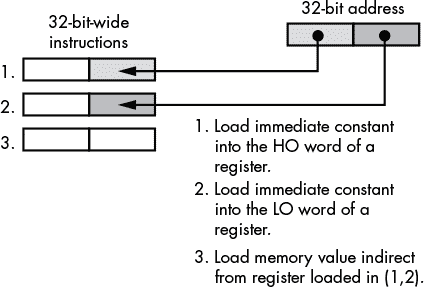

*图 7-2：RISC CPU 访问绝对地址*

#### 7.5.2 使用自动变量来减少偏移量大小

避免使用大位移的一个方法是使用较小位移的寻址模式。例如，80x86（以及 x86-64）提供了一种 8 位位移形式，用于基址加索引寻址模式。该形式允许你在基地址（存储在寄存器中）附近，以–128 到+127 字节的偏移量访问数据。RISC 处理器也有类似的特性，尽管位移位数通常较大，从而允许更大的地址范围。

通过将寄存器指向内存中的某个基地址，并将变量放置在该基地址附近，你可以使用这些指令的简短形式，从而使程序更小且运行更快。如果你在汇编语言中工作并能直接访问 CPU 的寄存器，这并不难。然而，如果你在高级语言（HLL）中工作，你可能无法直接访问 CPU 的寄存器，即使能访问，你也可能无法说服编译器将变量分配到方便的地址。那么，如何在 HLL 程序中利用这种小位移寻址模式呢？答案是，你并不需要显式指定使用这种寻址模式；编译器会自动为你处理。

考虑以下在 Pascal 中的简单函数：

```

			function trivial( i:integer; j:integer ):integer;
var
    k:integer;
begin

    k := i + j;
    trivial := k;

end;
```

进入这个函数时，编译后的代码构造了一个激活记录（有时称为*堆栈帧*）。如你在本章之前看到的，激活记录是内存中的一种数据结构，系统在其中保存与函数或过程相关的局部数据。激活记录包括参数数据、自动变量、返回地址、编译器分配的临时变量和机器状态信息（例如，保存的寄存器值）。运行时系统动态分配存储空间用于激活记录，实际上，对同一过程或函数的两次调用可能会将激活记录放置在内存中的不同地址。为了访问激活记录中的数据，大多数高级语言（HLL）会将一个寄存器（通常称为*帧指针*）指向激活记录，然后过程或函数在该帧指针的某个偏移量处引用自动变量和参数。除非你有许多自动变量和参数，或者你的自动变量和参数非常大，否则这些变量通常会出现在内存中接近基地址的偏移量处。这意味着 CPU 在引用接近帧指针持有的基地址的变量时，可以使用较小的偏移量。在前面给出的 Pascal 示例中，参数`i`和`j`以及局部变量`k`最有可能位于离帧指针地址几字节的地方，因此编译器可以使用小的位移编码这些指令，而不是大的位移。如果你的编译器在激活记录中分配局部变量和参数，你需要做的就是将你的变量安排在激活记录中，使它们出现在其基地址附近。但你该如何做到这一点呢？

激活记录的构建从调用过程的代码开始。调用者将参数数据（如果有的话）放入激活记录中。然后，执行一个汇编语言的`call`（或等效）指令将返回地址添加到激活记录中。此时，激活记录的构建继续在过程内部进行。过程复制寄存器值和其他重要的状态信息，然后为局部变量在激活记录中腾出空间。过程还必须更新帧指针寄存器（例如，在 80x86 中是 EBP，或在 x86-64 中是 RBP），使其指向激活记录的基地址。

要查看典型的激活记录是什么样的，考虑以下 HLA 过程声明：

```

			procedure ARDemo( i:uns32; j:int32; k:dword ); @nodisplay;
var
    a:int32;
    r:real32;
    c:char;
    b:boolean;
    w:word;
begin ARDemo;
    .
    .
    .
end ARDemo;
```

每当 HLA 程序调用这个 `ARDemo` 过程时，它会通过按照参数列表中的顺序将参数数据从左到右依次推送到栈上来构建激活记录。因此，调用代码首先将 `i` 参数的值推送到栈上，然后是 `j` 参数的值，最后是 `k` 参数的值。在推送参数之后，程序调用 `ARDemo` 过程。进入该过程时，栈中包含这四个项，按照 图 7-3 所示的方式排列，假设栈是从高地址向低地址增长的（如大多数处理器一样）。

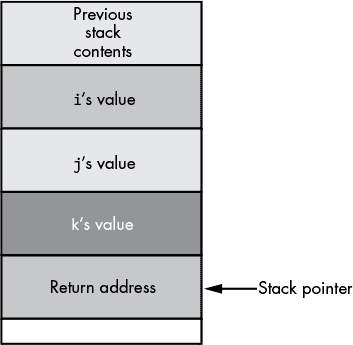

*图 7-3：进入 ARDemo 时的栈组织*

`ARDemo` 中的前几条指令将当前的框架指针寄存器值（例如，32 位 80x86 上的 EBP，或 x86-64 上的 RBP）推送到栈上，然后将栈指针（80x86/x86-64 上的 ESP/RSP）的值复制到框架指针中。接下来，代码将栈指针向下移动到内存中，以便为局部变量腾出空间。这就产生了如 图 7-4 所示的栈组织（在 80x86 CPU 上）。

要访问激活记录中的对象，必须使用框架指针寄存器（如 图 7-4 中的 EBP）到目标对象的偏移量。

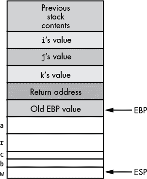

*图 7-4：ARDemo 的激活记录（32 位 80x86）*

目前最关心的两个项目是参数和局部变量。如 图 7-5 所示，您可以通过框架指针寄存器的正偏移量访问参数，通过框架指针寄存器的负偏移量访问局部变量。

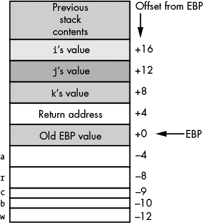

*图 7-5：32 位 80x86 中 ARDemo 激活记录中对象的偏移量*

英特尔专门保留了 EBP/RBP（基指针寄存器）用于指向激活记录的基址。因此，编译器通常会使用这个寄存器作为框架指针寄存器，在栈上分配激活记录。有些编译器则尝试使用 80x86 的 ESP/RSP（栈指针）寄存器指向激活记录，因为这样可以减少程序中的指令数量。无论编译器使用 EBP/RBP、ESP/RSP 还是其他寄存器作为框架指针，最终的结论是编译器通常会将某个寄存器指向激活记录，而大多数局部变量和参数都位于激活记录基址附近。

正如你在图 7-5 中看到的，`ARDemo`过程中的所有局部变量和参数都在帧指针寄存器（EBP）127 字节范围内。这意味着，在 80x86 CPU 上，引用这些变量或参数的指令将能够使用单字节编码 EBP 的偏移量。如前所述，由于程序构建激活记录的方式，参数出现在帧指针寄存器的正偏移量处，而局部变量则出现在帧指针寄存器的负偏移量处。

对于只有少数参数和局部变量的过程，CPU 能够使用较小的偏移量（即 80x86 上的 8 位，某些 RISC 处理器上可能更大）访问所有参数和局部变量。然而，请考虑以下 C/C++函数：

```
int BigLocals( int i, int j )
{
    int array[256];
    int k;
        .
        .
        .
}
```

该函数在 32 位 80x86 上的激活记录如图 7-6 所示。

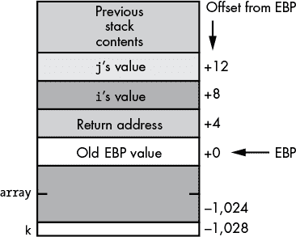

*图 7-6：BigLocals()函数的激活记录*

**注意**

*这个激活记录与 Pascal 和 HLA 函数的激活记录之间的一个区别是，C 语言将参数逆序压入栈中（即先压入最后一个参数，再压入第一个参数）。然而，这一差异对我们的讨论没有任何影响。*

在图 7-6 中需要注意的重要一点是，局部变量`array`和`k`有较大的负偏移量。由于偏移量为–1,024 和–1,028，从 EBP 到`array`和`k`的位移远超编译器能够在 80x86 上用单字节编码的范围。因此，编译器别无选择，只能使用 32 位值来编码这些位移。当然，这使得在函数中访问这些局部变量变得更加昂贵。

对于这个例子中的数组变量，无法做任何处理（无论你把它放在哪里，数组基地址的偏移量至少会比激活记录的基地址远 1,024 字节）。然而，请考虑图 7-7 中的激活记录。

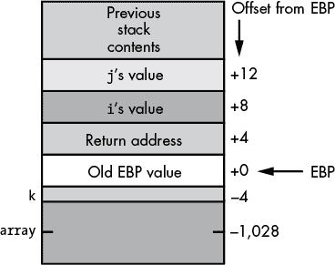

*图 7-7：BigLocals()函数的另一种可能的激活记录布局*

编译器已重新排列了此激活记录中的局部变量。尽管访问`array`变量仍然需要一个 32 位的位移，但访问`k`时现在使用 8 位位移（在 32 位 80x86 上），因为`k`的偏移量为–4。你可以使用以下代码生成这些偏移量：

```

			int BigLocals( int i, int j );
{
    int k;
    int array[256];
        .
        .
        .
}
```

理论上，重新排列激活记录中变量的顺序对编译器来说并不十分困难，因此你可以预期编译器会进行此修改，以便通过小的偏移量尽可能访问更多的局部变量。但实际上，并非所有编译器都会进行此优化，原因有很多，包括技术性和实际性的原因（具体来说，它可能会破坏一些对激活记录中变量位置做假设的写得不好的代码）。

如果你想确保在你的过程中的局部变量有尽可能小的偏移量，解决方案很简单：首先声明所有的 1 字节变量，其次是 2 字节变量，再然后是 4 字节变量，依此类推，直到函数中最大的局部变量。一般来说，然而，你可能更关心的是减少函数中最大数量的指令的大小，而不是减少函数中最大数量的变量所需的偏移量的大小。例如，如果你有 128 个 1 字节变量，并且首先声明这些变量，那么访问它们时只需要 1 字节的偏移量。然而，如果你从未访问这些变量，那么它们有 1 字节偏移量而不是 4 字节偏移量对你并没有任何帮助。你唯一节省空间的时刻是当你通过某个使用 1 字节而不是 4 字节偏移量的机器指令实际访问该变量的值时。因此，为了减少函数的目标代码大小，你希望最大化使用小偏移量的指令数量。如果你在函数中比任何其他变量更频繁地引用一个 100 字节的数组，那么你可能更好地首先声明这个数组，即使这会导致（在 80x86 上）只为其他将使用较短偏移量的变量留下 28 字节的存储空间。

RISC 处理器通常使用有符号的 12 位或 16 位偏移量来访问激活记录的字段。因此，使用 RISC 芯片时，你在声明时有更多的灵活性（这很好，因为当你超出 12 位或 16 位的限制时，访问局部变量会变得非常昂贵）。除非你声明一个或多个数组，它们消耗超过 2,048 字节（12 位）或 32,768 字节（合计），否则典型的 RISC 编译器会生成高效的代码。

同样的理由也适用于参数和局部变量。然而，代码中传递大型数据结构（按值传递）给函数的情况很少，因为这样做的开销较大。

#### 7.5.3 分配中间变量的存储

中间变量对一个过程/函数来说是局部的，但对另一个过程/函数来说是全局的。你会在支持嵌套过程的块结构语言中看到它们——比如 Free Pascal、Delphi、Ada、Modula-2、Swift 和 HLA。考虑一下下面这个用 Swift 写的示例程序：

```

			import Cocoa
import Foundation

var globalVariable = 2

func procOne()
{
    var intermediateVariable = 2;

    func procTwo()
    {
        let localVariable =
            intermediateVariable + globalVariable
        print( localVariable )
    }
    procTwo()
}

procOne()
```

请注意，嵌套过程可以访问在主程序中找到的变量（即全局变量），以及在包含嵌套过程的过程中找到的变量（即中间变量）。正如你所看到的，与全局变量访问相比，本地变量的访问成本较低（因为你总是需要使用较大的偏移量来访问过程中的全局对象）。如`procTwo`过程中所做的，中间变量访问是昂贵的。本地和全局变量访问的区别在于指令中编码的偏移量/位移的大小，本地变量通常使用比全局对象更短的偏移量。另一方面，中间变量访问通常需要多个机器指令。这使得访问一个中间变量的指令序列比访问本地（甚至全局）变量要慢几倍，且指令的体积也要大几倍。

使用中间变量的问题在于，编译器必须维护一个激活记录的链表，或者维护一个指向激活记录的指针表（*显示表*），以便引用中间对象。为了访问一个中间变量，`procTwo`过程必须跟随一条链（在这个例子中只有一条链），或者进行表查找，以便获取指向`procOne`激活记录的指针。更糟糕的是，维护这个指针链表的显示表并不便宜。维护这些对象的工作必须在每次过程/函数的入口和出口时完成，即使该过程或函数在某次调用中并不访问任何中间变量。尽管使用中间变量（与全局变量相比，涉及信息隐藏）在某些软件工程方面可能有好处，但请记住，访问中间对象是昂贵的。

#### 7.5.4 动态变量和指针的存储分配

高级语言中的指针访问提供了代码优化的另一个机会。指针的使用可能非常昂贵，但在某些情况下，它们实际上可以通过减少位移大小来提高程序的效率。

指针只是一个内存变量，其值是某个其他内存对象的地址（因此，指针的大小与机器上的地址相同）。因为大多数现代 CPU 只通过机器寄存器支持间接访问，所以间接访问一个对象通常是一个两步过程：首先，代码必须将指针变量的值加载到寄存器中，然后通过该寄存器间接引用对象。

请考虑以下 C/C++代码片段：

```

			int *pi;
    .
    .
    .
i = *pi;    // Assume pi is initialized with a
            // reasonable address at this point.
```

以下是相应的 80x86/HLA 汇编代码：

```

			pi: pointer to int32;
    .
    .
    .
mov( pi, ebx );     // Again, assume pi has
mov( [ebx], eax );  // been properly initialized
mov( eax, i );
```

如果`pi`是一个普通变量而不是指针对象，这段代码本可以省略`mov([ebx], eax);`指令，直接将`pi`移动到`eax`中。因此，使用这个指针变量既增加了程序的大小，又通过在编译器生成的代码序列中插入了额外的指令，降低了执行速度。

然而，如果你多次间接引用一个对象，编译器可能会重新利用它已加载到寄存器中的指针值，从而将额外指令的开销分摊到几条不同的指令上。考虑以下的 C/C++代码序列：

```

			int *pi;
    .
    .   // Assume code in this area
    .   // initializes pi appropriately.
    .
*pi = i;
*pi = *pi + 2;
*pi = *pi + *pi;
printf( "pi = %d\n", *pi );
```

这是相应的 80x86/HLA 代码：

```

			pi: pointer to int32;
    .
    . // Assume code in this area
    . // initializes pi appropriately.
    .
// Extra instruction that we need to initialize EBX

mov( pi, ebx );

mov( i, eax );
mov( eax, [ebx] );  //  This code can clearly be optimized,
mov( [ebx], eax );  //  but we'll ignore that fact for the
add( 2, eax );      //  sake of the discussion here.
mov( eax, [ebx] );
mov( [ebx], eax );
add( [ebx], eax );
mov( eax [ebx] );
stdout.put( "pi = ", (type int32 [ebx]), nl );
```

这段代码仅在一次操作中将实际指针值加载到 EBX 寄存器。从那时起，代码将仅使用 EBX 中包含的指针值来引用`pi`所指向的对象。当然，任何能够进行这种优化的编译器可能会从这段汇编语言序列中去除五次冗余的内存加载和存储操作，但我们暂时假设它们并非冗余。因为代码在每次需要访问`pi`所指向的对象时无需重新加载 EBX 中的`pi`值，所以只有一条开销指令（`mov(pi, ebx);`）被分摊到六条指令中。这样看起来并不算太差。

事实上，你完全可以提出一个很好的论点，认为这段代码比直接访问本地或全局变量更加优化。一条形式为

```
mov([ebx],eax);
```

编码的是一个 0 位偏移量。因此，这条移动指令只有 2 个字节长，而不是 3、5 甚至 6 个字节长。如果`pi`是一个局部变量，那么原始将`pi`复制到 EBX 的指令很可能只有 3 个字节长（2 字节操作码和 1 字节偏移量）。因为形式为`mov([ebx], eax);`的指令只有 2 个字节长，所以使用间接寻址而不是 8 位偏移量时，只有三条指令“达到平衡”。在第三条引用`pi`指向的内容的指令之后，涉及指针的代码实际上变得更短了。

你甚至可以使用间接寻址来高效地访问一块全局变量。如前所述，编译器通常无法在编译程序时确定全局对象的地址。因此，它必须假设最坏的情况，并在生成机器代码以访问全局变量时允许最大的位移/偏移量。当然，你刚刚看到，通过使用指向对象的指针而不是直接访问对象，你可以将位移值的大小从 32 位减少到 0 位。因此，你可以获取全局对象的地址（例如，使用 C/C++中的`&`运算符），然后使用间接寻址来访问变量。这种方法的问题是，它需要一个寄存器（寄存器在任何处理器中都是宝贵资源，尤其是在 32 位的 80x86 中，它只有六个通用寄存器可供使用）。如果你在快速连续的代码中多次访问同一变量，这个 0 位位移技巧可以提高代码效率。然而，在短序列代码中反复访问同一变量而不需要同时访问其他多个变量的情况相对较少。这意味着编译器可能需要将指针从寄存器中刷新出来，稍后重新加载指针值，从而降低这种方法的效率。如果你在 RISC 芯片或具有多个寄存器的 x86-64 处理器上工作，你可能能利用这个技巧来提高效率。然而，在寄存器数量有限的处理器上，你就无法频繁使用它了。

#### 7.5.5 使用记录/结构体来减少指令偏移量大小

你还可以使用一个技巧，通过单一指针访问多个变量：将这些变量放入一个结构体中，然后使用结构体的地址。通过指针访问结构体的字段，你可以使用更小的指令来访问对象。这几乎与激活记录的方式完全相同（实际上，激活记录就是程序通过帧指针寄存器间接引用的记录）。在用户定义的记录/结构体中间接访问对象和在激活记录中访问对象之间的唯一区别是，大多数编译器不允许你使用负偏移量来引用用户结构体/记录中的字段。因此，你只能访问激活记录中通常可以访问的字节数量的一半。例如，在 80x86 架构中，你可以使用 0 位位移从指针访问偏移量为 0 的对象，使用单字节位移访问偏移量为 1 到+127 的对象。考虑以下使用此技巧的 C/C++示例：

```

			typedef struct
{
    int i;
    int j;
    char *s;
    char name[20];
    short t;
} vars;

static vars v;
vars *pv = &v;  // Initialize pv with the address of v.
        .
        .
        .
    pv->i = 0;
    pv->j = 5;
    pv->s = pv->name;
    pv->t = 0;
    strcpy( pv->name, "Write Great Code!" );
        .
        .
        .
```

一个设计良好的编译器会在这段代码中将`pv`的值加载到寄存器中，只会加载一次。因为`vars`结构体的所有字段都位于结构体基地址内存的 127 字节以内，80x86 编译器可以发出一系列仅需 1 字节偏移的指令，即使`v`变量本身是静态/全局对象。顺便提一下，`vars`结构体中的第一个字段是特殊的。由于这个字段位于结构体的 0 偏移位置，因此在访问这个字段时，你可以使用 0 位偏移。因此，如果你打算间接访问某个结构体，最好将最常访问的字段放在结构体的第一个位置。

在代码中使用间接寻址确实是有代价的。对于像 32 位 80x86 这样的有限寄存器 CPU，使用这种方法会占用一个寄存器一段时间，这可能会导致编译器生成较差的代码。如果编译器必须不断地重新加载寄存器，以获取结构体在内存中的地址，那么这种技巧带来的节省就会很快消失。此类技巧在不同处理器（以及同一处理器的不同编译器）上效果不同，因此一定要查看编译器生成的代码，确认一个技巧是否真正节省了资源，而不是让你付出了更多的代价。

#### 7.5.6 将变量存储在机器寄存器中

说到寄存器，值得指出的是，另一种通过 0 位偏移来访问程序中变量的方式：将它们保存在机器寄存器中。机器寄存器始终是存储变量和参数的最有效地方。不幸的是，只有在汇编语言中，以及在 C/C++中有限地，你才可以控制编译器是否将变量或参数保存在寄存器中。在某些方面，这并不坏。优秀的编译器在寄存器分配方面比随便的程序员做得更好。然而，专家程序员可以比编译器做得更好，因为专家程序员理解程序将要处理的数据以及对特定内存位置的访问频率。（当然，专家程序员可以先查看编译器的做法，而编译器无法看到程序员的处理方式。）

一些语言，如 Delphi，提供了对程序员控制寄存器分配的有限支持。特别是，Delphi 编译器允许你指示它将函数或过程的前三个（顺序）参数传递到 EAX、EDX 和 ECX 寄存器中。这个选项被称为*fastcall 调用约定*，多个 C/C++编译器也支持它。

在 Delphi 和某些其他语言中，选择 fastcall 参数传递约定是你唯一能控制的方式。然而，C/C++语言提供了`register`关键字，它是一个存储说明符（类似于`const`、`static`和`auto`关键字），告诉编译器程序员期望频繁使用该变量，因此编译器应尝试将其保留在寄存器中。请注意，编译器也可以选择忽略`register`关键字（此时，它会使用自动分配来保留变量存储）。许多编译器完全忽略`register`关键字，因为编译器的作者有点傲慢地认为，他们可以比任何程序员做得更好，进行寄存器分配。当然，在一些寄存器稀缺的机器上，比如 32 位的 80x86，寄存器数量极少，可能甚至无法在某些函数的执行过程中将一个变量分配到寄存器中。然而，一些编译器确实会尊重程序员的要求，并*确实*会将一些变量分配到寄存器中，如果你要求它们这么做。

大多数 RISC 编译器会为传递参数保留几个寄存器，为局部变量保留几个寄存器。因此，最好（如果可能的话）将你最常访问的参数放在参数声明的最前面，因为它们很可能是编译器分配到寄存器中的参数。^(9) 局部变量声明也是如此。总是先声明经常使用的局部变量，因为许多编译器可能会将这些（顺序）变量分配到寄存器中。

编译器寄存器分配的一个问题是它是静态的。也就是说，编译器在编译过程中根据对源代码的分析来决定将哪些变量放入寄存器，而不是在运行时决定。编译器通常会做出一些假设（这些假设通常是正确的），比如“这个函数比任何其他变量更频繁地引用变量`xyz`，因此它是寄存器变量的良好候选。”的确，通过将变量放入寄存器，编译器肯定会减少程序的大小。然而，也有可能是所有这些对`xyz`的引用出现在一些很少执行甚至从不执行的代码中。虽然编译器可能通过发出较小的指令来访问寄存器而不是内存，从而节省一些空间，但代码不会显著变得更快。毕竟，如果代码很少或从不执行，那么让这段代码更快运行对程序的执行时间没有太大贡献。另一方面，也很有可能将对某个变量的单次引用埋藏在一个深度嵌套的循环中，而这个循环会执行多次。整个函数中只有一次引用时，编译器的优化器可能会忽视程序执行过程中频繁引用该变量的事实。虽然编译器在处理循环中的变量时已经变得更加智能，但事实上，没有任何编译器能够预测任意循环在运行时会执行多少次。人类在预测这种行为（或者至少通过分析工具进行测量）方面要比编译器强得多，因此在寄存器中进行变量分配时，人类通常能够做出更好的决策。

### 7.6 内存中变量的对齐

在许多处理器（特别是 RISC 处理器）中，你必须考虑另一个效率问题。许多现代处理器不允许你在内存中的任意地址访问数据。相反，所有访问都必须在 CPU 支持的某个原生边界上进行（通常是 4 字节）。^(10) 即使 CISC 处理器允许在任意字节边界上访问内存，通常将原始对象（字节、字和双字）在对象大小的倍数边界上进行访问，效率更高（见图 7-8）。

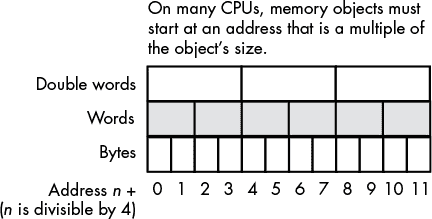

*图 7-8：内存中的变量对齐*

如果 CPU 支持不对齐访问——也就是说，如果 CPU 允许你在不是对象原始大小的倍数的边界上访问内存对象——那么你应该能够将变量打包到激活记录中。这样，你就可以获得最大数量的变量，并且这些变量的偏移量较小。然而，由于不对齐访问有时比对齐访问更慢，许多优化编译器会在激活记录中插入*填充字节*，以确保所有变量都按照合理的边界对齐，以适应它们的原生大小（见图 7-9）。这种做法以稍微更大的程序换取了略微更好的性能。

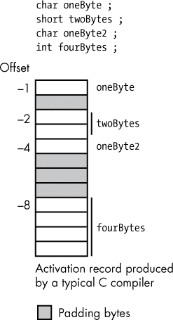

*图 7-9：激活记录中的填充字节*

然而，如果你将所有的双字声明放在前面，字声明放在第二，字节声明放在第三，数组/结构声明放在最后，你可以提高代码的速度和大小。编译器通常会确保你声明的第一个局部变量出现在一个合理的边界上（通常是双字边界）。通过先声明所有的双字变量，你可以确保它们都出现在一个地址，该地址是 4 的倍数（因为编译器通常将相邻的变量按声明顺序分配到内存中的相邻位置）。你声明的第一个字大小的对象也会出现在一个 4 的倍数地址上——这意味着它的地址也是 2 的倍数（这对于字访问是最佳的）。通过将所有的字变量一起声明，你可以确保每个变量都出现在一个 2 的倍数地址上。在允许字节访问内存的处理器上，字节变量的放置（相对于高效访问字节数据）并不重要。通过将所有的局部字节变量放在过程或函数的最后，你通常可以确保这些声明不会影响你在函数中使用的双字和字变量的性能。图 7-10 展示了如果你按照以下函数中的方式声明变量，典型的激活记录会是什么样子：

```

			int someFunction( void )
{
    int d1;   // Assume ints are 32-bit objects
    int d2;
    int d3;
    short w1; // Assume shorts are 16-bit objects
    short w2;
    char b1;  // Assume chars are 8-bit objects
    char b2;
    char b3;
        .
        .
        .
} // end someFunction
```

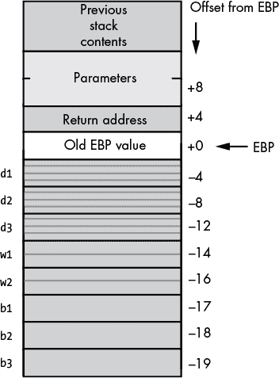

*图 7-10：激活记录中的对齐变量（32 位 80x86）*

请注意，所有的双字变量（`d1`、`d2` 和 `d3`）的地址都是 4 的倍数（–4、–8 和 –12）。同时，注意到所有的字大小变量（`w1` 和 `w2`）的地址是 2 的倍数（–14 和 –16）。字节变量（`b1`、`b2` 和 `b3`）的地址是内存中的任意地址（包括偶数和奇数地址）。

现在考虑以下函数，它具有任意（无序的）变量声明，以及在图 7-11 中显示的相应激活记录：

```

			int someFunction2( void )
{
    char  b1; // Assume chars are 8-bit objects
    int   d1; // Assume ints are 32-bit objects
    short w1; // Assume shorts are 16-bit objects
    int   d2;
    short w2;
    char  b2;
    int   d3;
    char  b3;
        .
        .
        .
} // end someFunction2
```

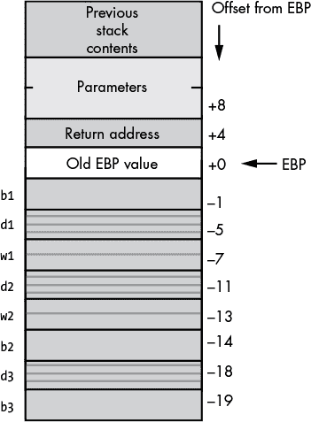

*图 7-11：激活记录中的未对齐变量（32 位 80x86）*

如您所见，除了字节变量外，其他所有变量都出现在不适合该对象的地址上。在允许在任意地址访问内存的处理器上，访问未对齐到合适地址边界的变量可能需要更长的时间。

一些处理器不允许程序在未对齐的地址访问对象。例如，大多数 RISC 处理器不能在非 32 位地址边界访问内存。要访问短整数或字节值，一些 RISC 处理器要求软件读取 32 位值并提取 16 位或 8 位值（也就是说，CPU 强制软件将字节和字作为打包数据处理）。为了打包和解包这些数据，所需的额外指令和内存访问会显著降低内存访问的速度（通常需要两条或更多指令才能从内存中获取一个字节或一个字）。将数据写入内存的情况更糟，因为 CPU 必须先从内存中提取数据，将新数据与旧数据合并，然后将结果写回内存。因此，大多数 RISC 编译器不会创建类似于图 7-11 中的激活记录。相反，它们会添加填充字节，使得每个内存对象都以一个 4 字节的倍数地址边界开始（见图 7-12）。

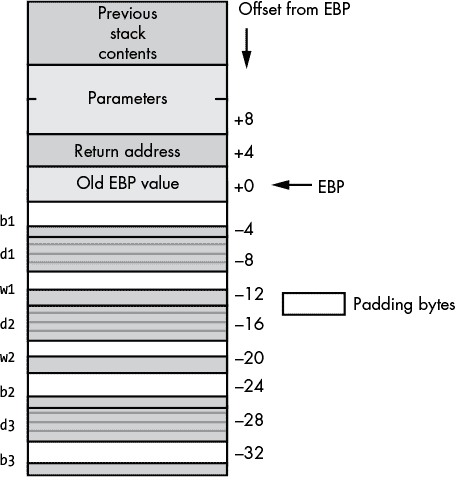

*图 7-12：RISC 编译器通过添加填充字节来强制对齐访问。*

请注意，在图 7-12 中，所有变量都位于 32 位的倍数地址处。因此，RISC 处理器在访问这些变量时不会遇到问题。当然，代价是激活记录要大得多（局部变量占用 32 字节，而不是 19 字节）。

虽然图 7-12 中的例子是典型的 32 位 RISC 编译器，但这并不意味着 CISC CPU 的编译器也不会这样做。例如，许多 80x86 的编译器也会构建这种激活记录，以提高编译器生成代码的性能。尽管在 CISC CPU 上不对齐声明变量可能不会降低代码的运行速度，但它可能会使用更多的内存。

当然，如果你使用汇编语言工作，通常由你决定如何声明变量，使其适合或高效地适应特定处理器。例如，在 HLA（在 80x86 上）中，以下两个过程声明会产生在图 7-10、图 7-11 和图 7-12 中所示的激活记录。

```

			procedure someFunction; @nodisplay; @noalignstack;
var
    d1  :dword;
    d2  :dword;
    d3  :dword;
    w1  :word;
    w2  :word;
    b1  :byte;
    b2  :byte;
    b3  :byte;
begin someFunction;
        .
        .
        .
end someFunction;

procedure someFunction2; @nodisplay; @noalignstack;
var
    b1  :byte;
    d1  :dword;
    w1  :word;
    d2  :dword;
    w2  :word;
    b2  :byte;
    d3  :dword;
    b3  :byte;
begin someFunction2;
        .
        .
        .
end someFunction2;

procedure someFunction3; @nodisplay; @noalignstack;
var
    // HLA align directive forces alignment of the next declaration.

    align(4);
    b1  :byte;
    align(4);
    d1  :dword;
    align(4);
    w1  :word;
    align(4);
    d2  :dword;
    align(4);
    w2  :word;
    align(4);
    b2  :byte;
    align(4);
    d3  :dword;
    align(4);
    b3  :byte;
begin someFunction3;
        .
        .
        .
end someFunction3;
```

HLA 的 someFunction 和 someFunction3 过程将在任何 80x86 处理器上产生最快的代码，因为所有变量都对齐到合适的边界；HLA 的 someFunction 和 someFunction2 过程将在 80x86 CPU 上产生最紧凑的激活记录，因为激活记录中的变量之间没有填充。如果你在 RISC CPU 上使用汇编语言工作，你可能希望选择 someFunction 或 someFunction3 的等效方法，这样可以更容易地访问内存中的变量。

#### 7.6.1 记录和对齐

高级语言（HLL）中的记录/结构也存在对齐问题，这些问题是你应该关注的。最近，CPU 制造商提倡 *应用二进制接口（ABI）* 标准，以促进不同编程语言及其实现之间的互操作性。虽然并非所有语言和编译器都遵循这些建议，但许多新型编译器是遵循的。其中，ABI 规范描述了编译器应如何在内存中组织记录或结构对象中的字段。虽然规则因 CPU 而异，但适用于大多数 ABI 的一条规则是：编译器应该将记录/结构字段对齐到一个是该对象大小倍数的偏移量。如果记录或结构中的两个相邻字段具有不同的大小，并且第一个字段的放置会导致第二个字段出现在一个不是该第二个字段原生大小倍数的偏移量位置，那么编译器将插入一些填充字节，将第二个字段推到一个适合该第二个对象大小的更高偏移量。

在实际应用中，不同 CPU 和操作系统的 ABI 存在细微的差异，这些差异主要取决于 CPU 访问内存中不同地址的对象的能力。例如，英特尔建议编译器将字节对齐到任何偏移量，将字对齐到偶数偏移量，并将其他所有内容对齐到 4 的倍数的偏移量。一些 ABI 建议将 64 位对象放置在记录中的 8 字节边界上。x86-64 SSE 和 AVX 指令要求对 128 位和 256 位数据值进行 16 字节和 32 字节对齐。一些 CPU 在访问小于 32 位的对象时会遇到困难，可能会建议对记录/结构中的所有对象使用最小 32 位的对齐。规则会根据 CPU 的不同以及制造商是希望优化代码执行速度（通常情况）还是减小数据结构的大小而有所不同。

如果你正在为单一 CPU（例如基于英特尔的 PC）编写代码，并使用单一编译器，请了解该编译器的填充字段规则，并根据最大性能和最小浪费调整声明。然而，如果你需要使用多个不同的编译器进行编译，特别是针对不同 CPU 的编译器，遵循一套规则可能在一台机器上工作得很好，但在其他几台机器上却会生成低效的代码。幸运的是，有一些规则可以帮助减少由于重新编译不同 ABI 所产生的低效问题。

从性能/内存使用的角度来看，最佳解决方案与我们之前看到的激活记录规则相同：在声明记录字段时，将所有相同大小的对象放在一起，并将所有较大的（标量）对象放在前面，较小的对象放在记录/结构体的最后。这个方案产生的浪费（填充字节）最少，并且在大多数现有的 ABI 中提供了最高的性能。唯一的缺点是你必须根据字段的原生大小而非它们之间的逻辑关系来组织字段。然而，由于记录/结构体的所有字段在逻辑上都与该记录/结构体相关联，因此这个问题并不像为某个特定函数的所有局部变量采用这种组织方式那么严重。

许多程序员尝试自己为结构体添加填充字段。例如，以下类型的代码在 Linux 内核及其他被过度修改的软件中非常常见：

```

			typedef struct IveAligned
{
    char byteValue;
    char padding0[3];
    int  dwordValue;
    short wordValue;
    char padding1[2];
    unsigned long dwordValue2;
        .
        .
        .
};
```

这个结构体中的`padding0`和`padding1`字段是为了手动对齐`dwordValue`和`dwordValue2`字段，使它们的偏移量成为 4 的偶数倍。

尽管这种填充并不不合理，但如果你使用的编译器没有自动对齐字段，请记住，在不同的机器上尝试编译这段代码可能会产生意外的结果。例如，如果一个编译器将所有字段对齐到 32 位边界，不管字段的大小，那么这个结构体声明将需要两个额外的双字来存放两个`paddingX`数组。这样就会无缘无故浪费空间。如果你决定手动添加填充字段，请记住这一点。

许多自动对齐结构体字段的编译器提供关闭此功能的选项。对于生成 CPU 代码的编译器尤其如此，其中字段对齐是可选的，编译器只会在轻微提升性能的情况下进行对齐。如果你打算手动为记录/结构体添加填充字段，你需要指定这个选项，以防编译器在你手动对齐后重新对齐字段。

从理论上讲，编译器可以自由地重新排列激活记录中局部变量的偏移量。然而，编译器重新排列用户定义的记录或结构体的字段是极为罕见的。太多外部程序和数据结构依赖于记录的字段按声明的顺序出现。尤其是在两个不同语言编写的代码之间传递记录/结构体数据时（例如，在调用汇编语言编写的函数时）或直接将记录数据转储到磁盘文件时，情况尤为如此。

在汇编语言中，字段对齐所需的工作量从纯手工劳动到具有自动处理几乎任何 ABI 的丰富功能集不等。有些（低端）汇编器甚至不提供记录或结构数据类型。在这种系统中，汇编程序员必须手动指定记录结构中的偏移量（通常通过声明常量，表示结构中的数值偏移量）。其他汇编器（例如 NASM）提供宏，可以自动为你生成等式。在这些系统中，程序员必须手动提供填充字段，以将某些字段对齐到给定边界。一些汇编器，如 MASM，提供简单的对齐功能。你可以在 MASM 中声明 `struct` 时指定值 `1`、`2` 或 `4`，汇编器将自动为结构添加填充字节，以使所有字段对齐到你指定的对齐值，或者到对象大小的倍数，以较小的为准。同时，请注意，MASM 会在结构体的末尾添加足够的填充字节，以确保整个结构体的长度是对齐大小的倍数。考虑下面这个 MASM 中的 `struct` 声明：

```

			Student  struct  2
score    word    ?   ; offset:0
id       byte    ?   ; offset 2 + 1 byte of padding
year     dword   ?   ; offset 4
id2      byte    ?   ; offset:8
Student  ends
```

在这个例子中，MASM 会在结构体的末尾添加一个额外的填充字节，使其长度成为 2 字节的倍数。

MASM 还允许你通过使用 `align` 指令控制结构中单个字段的对齐。以下结构声明与当前示例等效（请注意 `struct` 操作数字段中没有对齐值操作数）：

```

			Student  struct
score    word    ?   ; offset:0
id       byte    ?   ; offset 2
         align   2   ; Injects 1 byte of padding.
year     dword   ?   ; offset 4
id2      byte    ?   ; offset:8
         align   2   ; Adds 1 byte of padding to the end of the struct.
Student  ends
```

MASM 结构的默认字段对齐是未对齐的。也就是说，字段从结构中下一个可用的偏移量开始，无论字段的大小（以及前一个字段的大小）如何。

高级汇编语言（HLA）可能提供对记录字段对齐的最大控制（既有自动也有手动）。与 MASM 一样，默认的记录对齐是未对齐的。同样如同 MASM，你可以使用 HLA 的 `align` 指令手动对齐 HLA 记录中的字段。下面是之前 MASM 示例的 HLA 版本：

```

			type
    Student :record
        score :word;
        id    :byte;
        align(2);
        year  :dword;
        id2   :byte;
        align(2);
    endrecord;
```

HLA 还允许你为记录中的所有字段指定自动对齐。例如：

```

			type
    Student :record[2]  // This tells HLA to align all
                        // fields on a word boundary
        score :word;
        id    :byte;
        year  :dword;
        id2   :byte;
    endrecord;
```

这个 HLA 记录和之前的 MASM 结构（具有自动对齐）之间有一个微妙的区别。记住，当你指定 `Student struct 2` 形式的指令时，MASM 会将所有字段对齐到 2 的倍数或对象大小的倍数，*以较小者为准*。而 HLA 会始终使用此声明将所有字段对齐到 2 字节的边界，即使该字段只有一个字节。

强制字段对齐到最小大小的能力是一个不错的功能，如果你正在处理在不同机器（或编译器）上生成的数据结构，而该机器（或编译器）强制这种对齐。然而，如果你只希望字段按自然边界对齐（这正是 MASM 所做的），这种对齐方式可能会不必要地浪费记录中的空间。幸运的是，HLA 提供了另一种记录声明语法，允许你指定 HLA 应用到字段的最大和最小对齐方式：

```

			recordID: record[ maxAlign : minAlign ]
    <<fields>>
endrecord;
```

`maxAlign` 项指定了 HLA 在记录中使用的最大对齐方式。HLA 会将任何原生大小大于 `maxAlign` 的对象对齐到 `maxAlign` 字节的边界。同样，HLA 会将任何原生大小小于 `minAlign` 的对象对齐到至少 `minAlign` 字节的边界。HLA 会将原生大小介于 `minAlign` 和 `maxAlign` 之间的对象对齐到该对象大小的倍数字节边界。以下是等效的 HLA 和 MASM 记录/结构声明：

这是 MASM 代码：

```

			Student  struct  4
score    word    ?   ; offset:0
id       byte    ?   ; offset 2

    ; 1 byte of padding appears here

year     dword   ?   ; offset 4
id2      byte    ?   ; offset:8

    ; 3 padding bytes appear here

courses  dword   ?   ; offset:12
Student  ends
```

这是 HLA 代码：

```

			type
    //  Align on 4-byte offset, or object's size, whichever
    //  is the smaller of the two. Also, make sure that the
    //  entire record is a multiple of 4 bytes long.

    Student  :record[4:1]
        score   :word;
        id      :byte;
        year    :dword;
        id2     :byte;
      courses   :dword;
    endrecord;
```

尽管很少有高级语言（HLL）在语言设计中提供控制记录（或其他数据结构）字段对齐的功能，但许多编译器通过扩展这些语言，形式为编译器指令，允许程序员指定默认的变量和字段对齐方式。由于很少有语言有这种标准，因此你需要查看特定编译器的参考手册（注意，C++11 是少数几种提供对齐支持的语言之一）。尽管这些扩展是非标准的，但它们通常非常有用，特别是当你在链接不同语言编译的代码，或试图从系统中挤压最后一滴性能时。

### 7.7 更多信息

Aho, Alfred V.，Monica S. Lam，Ravi Sethi 和 Jeffrey D. Ullman. *编译原理：技术与工具*。第 2 版。英国埃塞克斯：Pearson Education Limited，1986 年。

Barrett, William 和 John Couch. *编译器构造：理论与实践*。芝加哥：SRA，1986 年。

Dershem, Herbert 和 Michael Jipping. *编程语言、结构与模型*。加利福尼亚州贝尔蒙特：Wadsworth，1990 年。

Duntemann, Jeff. *汇编语言逐步学习*。第 3 版。印第安纳波利斯：Wiley，2009 年。

Fraser, Christopher 和 David Hansen. *可重定向的 C 编译器：设计与实现*。波士顿：Addison-Wesley Professional，1995 年。

Ghezzi, Carlo 和 Jehdi Jazayeri. *编程语言概念*。第 3 版。纽约：Wiley，2008 年。

Hoxey, Steve，Faraydon Karim，Bill Hay 和 Hank Warren，编。*PowerPC 编译器写作指南*。加利福尼亚州帕洛阿尔托：Warthman Associates for IBM，1996 年。

Hyde, Randall. *汇编语言艺术*。第 2 版。旧金山：No Starch Press，2010 年。

英特尔。“Intel 64 和 IA-32 架构软件开发手册。”更新于 2019 年 11 月 11 日。*[`software.intel.com/en-us/articles/intel-sdm`](https://software.intel.com/en-us/articles/intel-sdm)*。

Ledgard, Henry, 和 Michael Marcotty. *The Programming Language Landscape*. 芝加哥: SRA, 1986.

Louden, Kenneth C. *Compiler Construction: Principles and Practice*. 波士顿: Cengage, 1997.

Louden, Kenneth C., 和 Kenneth A. Lambert. *Programming Languages: Principles and Practice*. 第 3 版. 波士顿: Course Technology, 2012.

Parsons, Thomas W. *Introduction to Compiler Construction*. 纽约: W. H. Freeman, 1992.

Pratt, Terrence W., 和 Marvin V. Zelkowitz. *Programming Languages, Design and Implementation*. 第 4 版. Upper Saddle River, NJ: Prentice Hall, 2001.

Sebesta, Robert. *Concepts of Programming Languages*. 第 11 版. 波士顿: Pearson, 2016.
