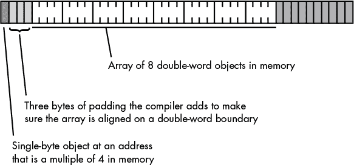
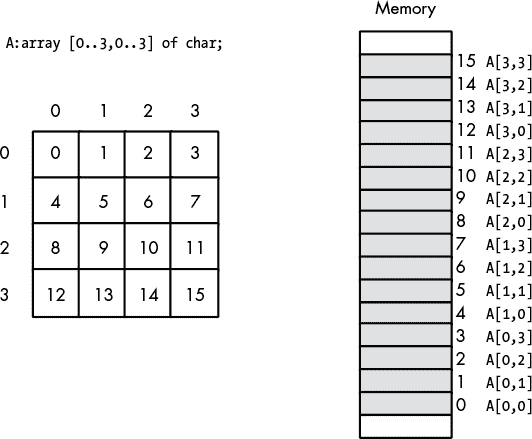
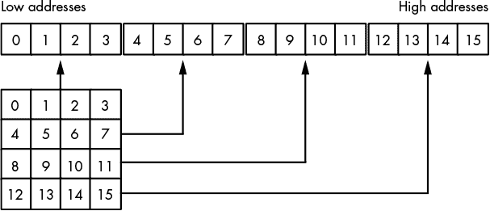
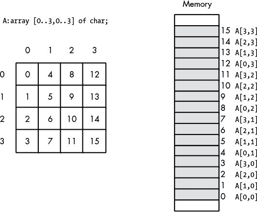

# 第八章：**数组数据类型**


高级语言的抽象隐藏了机器如何处理*复合数据类型*（由较小的数据对象组成的复杂数据类型）。虽然这些抽象通常很方便，但如果你不了解它们背后的细节，你可能会不经意地使用某些构造，导致生成不必要的代码或运行速度比需要的慢。本章将介绍一个最重要的复合数据类型：数组。我们将考虑以下主题：

+   数组的定义

+   如何在不同的语言中声明数组

+   数组在内存中的表示方式

+   访问数组元素

+   声明、表示和访问多维数组

+   行优先和列优先的多维数组访问

+   动态数组与静态数组

+   使用数组如何影响应用程序的性能和大小

数组在现代应用程序中非常常见，因此你应该深入理解程序如何在内存中实现和使用数组，这样才能编写出优秀的代码。本章将为你提供在程序中更高效使用数组所需的基础。

### 8.1 数组

数组是最常见的复合（或*聚合*）数据类型之一，但很少有程序员能完全理解它们是如何工作的。一旦他们理解了数组在机器级别的运作方式，程序员通常会从完全不同的角度看待它们。

从抽象的角度来看，数组是一种聚合数据类型，其成员（元素）都是相同类型的。要选择数组中的成员，你需要使用整数（或某些其底层表示为整数的值，例如字符、枚举和布尔类型）来指定该成员的数组索引。在本章中，我们假设数组的所有整数索引都是数值上连续的。也就是说，如果`x`和`y`都是数组的有效索引，并且如果`x` < `y`，那么所有满足`x` < `i` < `y`的`i`也是有效的索引。我们还通常假设数组元素在内存中占据连续的位置，尽管这不是数组的一般定义所要求的。一个包含五个元素的数组在内存中的表现如图 8-1 所示。


*图 8-1：数组在内存中的布局*

数组的*基地址*是其第一个元素的地址，该元素占据最低的内存位置。第二个数组元素直接跟在第一个元素后面，第三个元素跟在第二个元素后面，依此类推。请注意，索引不必从`0`开始；它们可以从任何数字开始，只要它们是连续的。然而，讨论数组访问时，如果第一个索引是`0`会更容易，因此除非另有说明，本章中的数组从索引`0`开始。

每当你对数组应用索引操作符时，结果就是由该索引指定的唯一数组元素。例如，`A[i]`选择数组`A`中的第`i`个元素。

#### 8.1 数组声明

数组声明在许多高级语言（HLL）中非常相似。本节提供了几种语言的示例。

##### 8.1.1.1 在 C、C++和 Java 中声明数组

C、C++和 Java 都允许你通过指定元素的总数来声明数组。这些语言中的数组声明语法如下：

```
data_type  array_name [ number_of_elements ];
```

这里是一些 C/C++数组声明的示例：

```

			char CharArray[ 128 ];
int intArray[ 8 ];
unsigned char ByteArray[ 10 ];
int *PtrArray[ 4 ];
```

如果你将这些数组声明为自动变量，C/C++会使用内存中现有的位模式初始化它们。另一方面，如果你将这些数组声明为静态对象，C/C++会将每个数组元素初始化为`0`。如果你想自行初始化数组，可以使用以下 C/C++语法：

```
data_type array_name[ number_of_elements ] = {element_list};
```

这是一个典型的例子：

```
int intArray[8] = {0,1,2,3,4,5,6,7};
```

C/C++编译器将这些初始数组值存储在目标代码文件中，当操作系统将程序加载到内存时，会将这些值加载到与`intArray`相关联的内存位置。为了查看这一过程是如何工作的，考虑以下简短的 C/C++程序：

```

			#include <stdio.h>
static int intArray[8] = {1,2,3,4,5,6,7,8};
static int array2[8];

int main( int argc, char **argv )
{
    int i;
    for( i=0; i<8; ++i )
    {
        array2[i] = intArray[i];
    }
    for( i=7; i>= 0; --i )
    {
        printf( "%d\n", array2[i] );
    }
    return 0;
}
```

Microsoft 的 Visual C++编译器为这两个数组声明生成以下 80x86 汇编代码：

```

			_DATA    SEGMENT
intArray DD      01H
         DD      02H
         DD      03H
         DD      04H
         DD      05H
         DD      06H
         DD      07H
         DD      08H
$SG6842  DB      '%d', 0aH, 00H
_DATA    ENDS
_BSS     SEGMENT
_array2  DD      08H DUP (?)
_BSS     ENDS
```

每个`DD`（“定义双字”）语句预留 4 字节的存储空间，操作数指定它们在操作系统将程序加载到内存时的初始值。`intArray`声明出现在`_DATA`段中，该段在 Microsoft 内存模型中可以包含初始化数据。另一方面，`array2`变量是在`_BSS`段内声明的，MSVC++将未初始化的变量放置在该段中（操作数字段中的`?`字符告诉汇编器数据未初始化；`8 dup (?)`操作数告诉汇编器将声明复制八次）。当操作系统将`_BSS`段加载到内存时，它会将与该段关联的所有内存清零。在初始化和未初始化的情况下，编译器都会在连续的内存位置上分配这两个数组的所有八个元素。

##### 8.1.1.2 在 HLA 中声明数组

HLA 的数组声明语法如下，它在语义上等同于 C/C++声明：

```
array_name : data_type [ number_of_elements ];
```

以下是一些 HLA 数组声明的例子，它们为未初始化的数组分配存储空间（第二个例子假设你已经在 HLA 程序的`type`部分定义了`integer`数据类型）：

```

			static

 // Character array with elements 0..127.

 CharArray: char[128];

 // "integer" array with elements 0..7.

 IntArray: integer[ 8 ];

// Byte array with elements 0..9.

 ByteArray: byte[10];

 // Double word array with elements 0..3.

 PtrArray: dword[4];
```

你也可以使用以下声明初始化数组元素：

```

			RealArray: real32[8] :=
    [ 0.0, 1.0, 2.0, 3.0, 4.0, 5.0, 6.0, 7.0 ];

IntegerAry: integer[8] :=
    [ 8, 9, 10, 11, 12, 13, 14, 15 ];
```

这两种定义都创建了包含八个元素的数组。第一个定义将每个 4 字节的`real32`数组元素初始化为`0.0..7.0`范围内的某个值。第二个声明将每个`integer`数组元素初始化为`8..15`范围内的某个值。

##### 8.1.1.3 在 Pascal/Delphi 中声明数组

Pascal/Delphi 使用以下语法声明数组：

```
array_name : array[ lower_bound..upper_bound ] of data_type;
```

与之前的示例一样，array_name 是标识符，data_type 是该数组中每个元素的类型。在 Pascal/Delphi 中（不同于 C/C++、Java 和 HLA），你指定数组的上下边界，而不是数组的大小。以下是 Pascal 中的典型数组声明：

```

			type
    ptrToChar = ^char;
var
    CharArray: array[ 0..127 ] of char;   // 128 elements
    IntArray: array[ 0..7 ] of integer;   // 8 elements
    ByteArray: array[ 0..9 ] of char;     // 10 elements
    PtrArray: array[ 0..3 ] of ptrToChar; // 4 elements
```

尽管这些 Pascal 示例的索引从 `0` 开始，但 Pascal 并不要求这样做。以下是 Pascal 中一个完全有效的数组声明：

```

			var
   ProfitsByYear : array[ 1998..2028 ] of real; // 31 elements
```

声明此数组的程序在访问该数组元素时会使用索引 `1998..2028`，而不是 `0..30`。

许多 Pascal 编译器提供了一个非常有用的功能，帮助你在程序中找到缺陷。每当你访问数组的元素时，这些编译器会自动插入代码，验证数组索引是否在声明时指定的范围内。如果索引超出范围，这段额外的代码会停止程序。例如，如果 `ProfitsByYear` 的索引超出了 `1998..2028` 范围，程序将因错误而中止。^(1)

##### 8.1.1.4 在 Swift 中声明数组

Swift 中的数组声明与其他基于 C 的语言有所不同。Swift 的数组声明有以下两种（等效的）形式：

```

			var data_type array_name = Array<element_type>()
var data_type array_name = [element_type]()
```

与其他语言不同，Swift 中的数组是完全动态的。你通常不会在第一次创建数组时指定元素的数量；相反，你可以根据需要使用 `append()` 等函数向数组添加元素。如果你想预声明一个包含一定数量元素的数组，你可以使用特殊的数组构造形式，如下所示：

```

			var data_type array_name = Array<element_type>( repeating: initial_value, count: elements )
```

在这个例子中，initial_value 是元素类型的值，elements 是要在数组中创建的元素数量。例如，以下 Swift 代码创建了两个包含 100 个 `Int` 值的数组，每个数组都初始化为 `0`：

```

			var intArray = Array<Int>( repeating: 0, count: 100 )
var intArray2 = Int
```

请注意，你仍然可以扩展此数组的大小（例如，通过使用 `append()` 函数）；由于 Swift 数组是动态的，它们的大小可以在运行时增长或缩小。

也可以使用初始值来创建一个 Swift 数组：

```

			var intArray = [1, 2, 3]
var strArray = ["str1", "str2", "str3"]
```

Swift 和 Pascal 一样，会在运行时检查数组索引的有效性。如果你尝试访问一个不存在的数组元素，Swift 会抛出异常。

##### 8.1.1.5 声明非整数索引值的数组

通常，数组索引是整数值，尽管一些语言允许其他*序数类型*（使用基础整数表示的类型）。例如，Pascal 允许使用 `char` 和 `boolean` 类型作为数组索引。在 Pascal 中，声明数组如下是完全合理且有用的：

```
alphaCnt : array[ 'A'..'Z' ] of integer;
```

你可以使用字符表达式作为数组索引来访问 `alphaCnt` 的元素。例如，考虑下面的 Pascal 代码，它将 `alphaCnt` 中的每个元素初始化为 `0`：

```

			for ch := 'A' to 'Z' do
    alphaCnt[ ch ] := 0;
```

汇编语言和 C/C++ 将大多数顺序值视为整数值的特殊实例，因此它们是合法的数组索引。大多数 BASIC 的实现允许将浮点数作为数组索引，尽管 BASIC 在使用它作为索引之前总是将值截断为整数。

**注意**

*BASIC 允许你使用浮点值作为数组索引，因为原始语言不支持整数表达式；它只提供了实数和字符串值。*

#### 8.1.2 数组在内存中的表示

抽象地说，数组是一组变量，你可以通过索引来访问它们。在语义上，你可以按任何方式定义数组，只要它将不同的索引映射到内存中的不同对象，并且始终将相同的索引映射到相同的对象。然而，实际上，大多数语言使用一些常见的算法来提供对数组数据的高效访问。

数组最常见的实现方式是将元素存储在连续的内存位置。如前所述，大多数编程语言将数组的第一个元素存储在较低的内存地址，然后将后续元素存储在逐渐更高的内存位置。

考虑以下 C 程序：

```

			#include <stdio.h>

static char array[8] = {0,1,2,3,4,5,6,7};

int main( void )
{

    printf( "%d\n", array[0] );
}
```

这是 GCC 为它生成的相应 PowerPC 汇编代码：

```

			        .align 2
_array:
        .byte   0   ; Note that the assembler stores the byte
        .byte   1   ; values on successive lines into
        .byte   2   ; contiguous memory locations.
        .byte   3
        .byte   4
        .byte   5
        .byte   6
        .byte   7
```

数组占用的字节数是元素个数与每个元素占用字节数的乘积。在前面的例子中，每个数组元素占用一个字节，因此数组占用的字节数与元素个数相同。然而，对于更大元素的数组，整个数组的大小（以字节为单位）相应地更大。考虑以下 C 代码：

```

			#include <stdio.h>

static int array[8] = {0,0,0,0,0,0,0,1};

int main( void )
{
    printf( "%d\n", array[0] );
}
```

这是相应的 GCC 汇编语言输出：

```

			        .align 2
_array:
        .long   0
        .long   0
        .long   0
        .long   0
        .long   0
        .long   0
        .long   0
        .long   1
```

许多语言还会在数组的末尾添加一些填充字节，以使数组的总长度成为像 2 或 4 这样的方便值的倍数（这使得使用位移计算数组索引变得容易，或者为内存中紧跟数组后的下一个对象添加额外的填充字节；详细信息请参见 *WGC1* 的第三章）。然而，程序不能依赖这些额外的填充字节，因为它们可能存在也可能不存在。一些编译器总是将它们加入，另一些则从不加入，还有一些编译器根据内存中紧跟数组的对象类型决定是否加入。

许多优化编译器会尝试将数组放置在内存地址为常见大小（如 2、4 或 8 字节）倍数的地址上。实际上，这会在数组的开始前添加填充字节，或者，如果你更愿意这样理解的话，在内存中紧跟数组的前一个对象之后添加填充字节（参见图 8-2）。



*图 8-2：在数组前添加填充字节*

在不支持字节寻址内存的机器上，尝试将数组的第一个元素放置在容易访问的边界上的编译器，将根据机器支持的边界分配数组的存储。在前面的示例中，注意到`.align 2`指令位于`_array`声明之前。在 Gas 语法中，`.align`指令告诉汇编器调整源文件中下一个声明对象的内存地址，使其开始于某个边界地址，而这个边界地址是 2 的某个幂（由`.align`的操作数指定）的倍数。在这个示例中，`.align 2`告诉汇编器将`_array`的第一个元素对齐到一个是 4 的倍数的地址边界（即 2²）。

如果每个数组元素的大小小于 CPU 支持的最小内存对象大小，编译器的实现者有两个选择：

1.  为数组的每个元素分配最小的可访问内存对象。

1.  将多个数组元素打包到一个内存单元中。

选项 1 的优点是速度快，但它浪费了内存，因为每个数组元素都携带一些它不需要的额外存储。以下 C 语言示例为一个元素大小为 5 字节的数组分配存储空间，其中每个元素是一个结构体对象，由一个 4 字节的`long`对象和一个 1 字节的`char`对象组成（我们将在第十一章中讨论 C 语言结构体）。

```

			#include <stdio.h>

typedef struct
{
    long a;
    char b;
} FiveBytes;

static FiveBytes shortArray[2] = {{2,3}, {4,5}};
int main( void )
{
    printf( "%ld\n", shortArray[0].a );
}
```

当 GCC 将此代码编译为在 PowerPC 处理器上运行时，该处理器需要对`long`对象进行双字对齐，编译器会自动在每个元素之间插入 3 个字节的填充：

```

			.data
        .align 2   ; Ensure that _shortArray begins on an
                   ; address boundary that is a multiple
                   ; of 4.
_shortArray:
        .long   2  ; shortArray[0].a
        .byte   3  ; shortArray[0].b
        .space  3  ; Padding, to align next element to 4 bytes
        .long   4  ; shortArray[1].a
        .byte   5  ; shortArray[1].b
        .space  3  ; Padding, at end of array.
```

选项 2 比较紧凑，但速度较慢，因为它在访问数组元素时需要额外的指令来打包和解包数据。在这种机器上的编译器通常提供一个选项，让你指定是否希望数据被打包或解包，从而在空间和速度之间做出选择。

请记住，如果你在使用字节寻址的机器（如 80x86）上工作，那么你可能不需要担心这个问题。然而，如果你正在使用高级语言（HLL），并且你的代码将来可能会在不同的机器上运行，那么你应该选择一种在所有机器上都高效的数组组织方式（即，采用填充每个数组元素的额外字节的组织方式）。

#### 8.1.3 Swift 数组实现

尽管到目前为止的示例都涉及 Swift 中的数组，但 Swift 数组有不同的实现方式。首先，Swift 数组是基于 `struct` 对象的一个不透明类型^(2)，而不仅仅是内存中元素的集合。Swift 不保证数组元素在连续的内存位置出现；因此，你不能假设在 Swift 数组中的对象元素和某些其他元素类型是连续存储的。作为解决方法，Swift 提供了 `ContiguousArray` 类型说明。为了保证数组元素出现在连续的内存位置，你可以在声明 Swift 数组变量时指定 `ContiguousArray` 而非 `Array`，如下所示：

```

			var data_type array_name = ContiguousArray<element_type>()
```

Swift 数组的内部实现是一个包含计数（当前数组元素数量）、容量（当前已分配的数组元素数量）和指向存储数组元素的指针的结构体。由于 Swift 数组是一个不透明类型，这种实现可能随时发生变化；然而，在结构体中的某个位置会有指向实际数组数据的内存指针。

Swift 动态地分配数组存储，这意味着你永远看不到 Swift 编译器生成的目标代码文件中嵌入的数组存储（除非 Swift 语言规范发生变化，支持静态分配数组）。你可以通过向数组追加元素来增加数组的大小，但如果你尝试将其扩展超过当前容量，Swift 运行时系统可能需要动态地重新定位数组对象。为了提高性能，Swift 使用指数分配方案：每当你向数组追加一个会超过其容量的值时，Swift 运行时系统会分配当前容量的两倍（或其他常数）存储空间，将当前数组缓冲区的数据复制到新缓冲区中，然后将数组的内部指针指向新的内存块。这个过程的一个重要方面是，你永远不能假设指向数组数据的指针是静态的，也不能假设数组数据始终保存在内存中的同一缓冲区位置——在不同的时间点，数组可能出现在内存中的不同位置。

#### 8.1.4 访问数组元素

如果你为数组分配了所有存储空间，并且数组的第一个索引是 `0`，那么访问一维数组的元素就变得很简单。你可以使用以下公式计算数组中任何给定元素的地址：

```
Element_Address = Base_Address + index * Element_Size
```

Element_Size 是每个数组元素所占的字节数。因此，如果数组包含 `byte` 类型的元素，则 Element_Size 字段为 `1`，计算就非常简单。如果数组的每个元素是 `word`（或其他 2 字节类型），则 Element_Size 为 `2`，依此类推。考虑以下 Pascal 数组声明：

```
var  SixteenInts : array[0..15] of integer;
```

要在字节可寻址的机器上访问 `SixteenInts` 数组的元素，假设使用的是 4 字节整数，你需要使用以下计算：

```
Element_Address = AddressOf( SixteenInts ) + index * 4
```

在 HLA 汇编语言中（在这里你必须手动进行这个计算，而不是让编译器为你完成），你可以使用类似这样的代码来访问数组元素 `SixteenInts[index]`：

```

			mov( index, ebx );
mov( SixteenInts[ ebx*4 ], eax );
```

要看到这个过程的实际操作，请考虑以下 Pascal/Delphi 程序和生成的 32 位 80x86 代码（我通过反汇编 Delphi 编译器输出的 *.exe* 文件并将结果粘贴回原始 Pascal 代码中获得）：

```

			program x(input,output);
var
    i :integer;
    sixteenInts :array[0..15] of integer;

    function changei(i:integer):integer;
    begin
        changei := 15 - i;
    end;

    // changei         proc    near
    //                 mov     edx, 0Fh
    //                 sub     edx, eax
    //                 mov     eax, edx
    //                 retn
    // changei         endp

begin
    for i:= 0 to 15 do
        sixteenInts[ changei(i) ] := i;

    //                 xor     ebx, ebx
    //
    // loc_403AA7:
    //                 mov     eax, ebx
    //                 call    changei
    //
    // Note the use of the scaled-index addressing mode
    // to multiply the array index by 4 prior to accessing
    // elements of the array:
    //
    //                 mov     ds:sixteenInts[eax*4], ebx
    //                 inc     ebx
    //                 cmp     ebx, 10h
    //                 jnz     short loc_403AA7

end.
```

如同 HLA 示例中所示，Delphi 编译器使用 80x86 缩放索引寻址模式，将索引乘以元素大小（4 字节）。80x86 提供了四种不同的缩放值用于缩放索引寻址模式：1、2、4 或 8 字节。如果数组的元素大小不是这四个值中的任何一个，机器代码必须显式地将索引乘以数组元素的大小。以下 Delphi/Pascal 代码（及来自反汇编的相应 80x86 代码）演示了这个过程，其中使用了一个有 9 字节活动数据的记录（Delphi 将其四舍五入到下一个 4 字节的倍数，因此实际上为每个记录数组元素分配了 12 字节）：

```

			program x(input,output);
type
    NineBytes=
        record
            FourBytes       :integer;
            FourMoreBytes   :integer;
            OneByte         :char;
        end;

var
    i               :integer;
    NineByteArray   :array[0..15] of NineBytes;

    function changei(i:integer):integer;
    begin
        changei := 15 - i;
    end;

    // changei         proc    near
    //                 mov     edx, 0Fh
    //                 sub     edx, eax
    //                 mov     eax, edx
    //                 retn
    // changei         endp

begin

    for i:= 0 to 15 do
        NineByteArray[ changei(i) ].FourBytes := i;

//                  xor     ebx, ebx
//
//  loc_403AA7:
//                  mov     eax, ebx
//                  call    changei
//
//            // Compute EAX = EAX * 3
//
//                  lea     eax, [eax+eax*2]
//
//            // Actual index used is index*12 ((EAX*3) * 4)
//
//                  mov     ds:NineByteArray[eax*4], ebx
//                  inc     ebx
//                  cmp     ebx, 10h
//                  jnz     short loc_403AA7

end.
```

微软的 C/C++ 编译器生成可比的代码（也为每个记录数组元素分配 12 字节）。

#### 8.1.5 填充与打包

这些 Pascal 示例重申了一个重要的观点：编译器通常会将每个数组元素填充到 4 字节的倍数，或者根据机器架构的要求填充到最合适的大小，以提高访问数组元素（和记录字段）的效率，确保它们始终在合理的内存边界上对齐。一些编译器提供了选项，可以消除每个数组元素末尾的填充，使得连续的数组元素在内存中紧接在前一个元素之后。例如，在 Pascal/Delphi 中，你可以通过使用 `packed` 关键字来实现这一点：

```

			program x(input,output);

// Note the use of the "packed" keyword.
// This tells Delphi to pack each record
// into 9 consecutive bytes, without
// any padding at the end of the record.

type
    NineBytes=
        packed record
            FourBytes       :integer;
            FourMoreBytes   :integer;
            OneByte         :char;
        end;

var
    i               :integer;
    NineByteArray   :array[0..15] of NineBytes;

    function changei(i:integer):integer;
    begin
        changei := 15 - i;
    end;

    // changei         proc near
    //                 mov     edx, 0Fh
    //                 sub     edx, eax
    //                 mov     eax, edx
    //                 retn
    // changei         endp

begin

    for i:= 0 to 15 do
        NineByteArray[ changei(i) ].FourBytes := i;
//                 xor     ebx, ebx
//
// loc_403AA7:
//                 mov     eax, ebx
//                 call    changei
//
//      // Compute index (eax) = index * 9
//      // (computed as index = index + index*8):
//
//                 lea     eax, [eax+eax*8]
//
//                 mov     ds:NineBytes[eax], ebx
//                 inc     ebx
//                 cmp     ebx, 10h
//                 jnz     short loc_403AA7

end.
```

`packed` 保留字仅仅是给 Pascal 编译器的一个提示。通用的 Pascal 编译器可以选择忽略它；Pascal 标准并没有明确说明它对编译器代码生成的影响。Delphi 使用 `packed` 关键字来告诉编译器将数组（和记录）元素打包到字节边界，而不是 4 字节边界。其他 Pascal 编译器实际上使用这个关键字将对象对齐到比特边界。

**注意**

*有关 `packed` 关键字的更多信息，请参阅编译器文档。*

很少有其他语言在通用语言定义中提供将数据打包到给定边界的方式。例如，在 C/C++ 语言中，许多编译器提供了 pragma 或命令行开关来控制数组元素的填充，但这些功能几乎总是特定于某个编译器。

通常，在选择打包和填充数组元素（当你有选择时）时，通常是在速度和空间之间进行权衡。打包可以为每个数组元素节省少量空间，但代价是访问速度变慢（例如，当访问内存中位于奇数地址的`dword`对象时）。此外，计算数组中元素的索引（当元素大小不是 2 的倍数时，或者更好的是 2 的幂次）可能需要更多的指令，这也会减慢访问此类数组元素的程序的速度。

当然，一些机器架构不允许未对齐的数据访问，因此，如果你正在编写必须在不同 CPU 上编译和运行的可移植代码，你不应指望数组元素可以紧密地打包到内存中。一些编译器可能不提供这个选项。

在结束这段讨论之前，值得强调的是，最佳的数组元素大小是 2 的幂次。通常，只需一条指令就可以将任何数组索引乘以 2 的幂（这条指令是左移指令）。考虑以下 C 程序和 Borland C++编译器生成的汇编输出，它使用具有 32 字节元素的数组：

```

			typedef struct
{
    double EightBytes;
    double EightMoreBytes;
    float  SixteenBytes[4];
} PowerOfTwoBytes;

int i;
PowerOfTwoBytes ThirtyTwoBytes[16];

int changei(int i)
{
    return 15 - i;
}

int main( int argc, char **argv )
{
    for( i=0; i<16; ++i )
    {
        ThirtyTwoBytes[ changei(i) ].EightBytes = 0.0;
    }

    // @5:
    //  push      ebx
    //  call      _changei
    //  pop       ecx           // Remove parameter
    //
    // Multiply index (in EAX) by 32.
    // Note that (eax << 5) = eax * 32
    //
    //  shl       eax,5
    //
    // 8 bytes of zeros are the coding for
    // (double) 0.0:
    //
    //  xor       edx,edx
    //  mov       dword ptr [eax+_ThirtyTwoBytes],edx
    //  mov       dword ptr [eax+_ThirtyTwoBytes+4],edx
    //
    // Finish up the for loop here:
    //
    //  inc       dword ptr [esi]   ;ESI points at i.
    // @6:
    //  mov       ebx,dword ptr [esi]
    //  cmp       ebx,16
    //  jl        short @5

    return 0;
}
```

如你所见，Borland C++编译器发出`shl`指令来将索引乘以 32。

#### 8.1.6 多维数组

*多维*数组是指允许使用两个或更多独立的索引值来选择数组元素的数组。一个经典的例子是二维数据结构（矩阵），它跟踪按日期的产品销售情况。表中的一个索引可能是日期，另一个索引可能是产品的标识（某个整数值）。通过这两个索引选择的数组元素将是该产品在某个特定日期的总销售额。这个例子的三维扩展可以是按日期和国家销售的产品。再次，产品值、日期值和国家值的组合将用来定位数组中的元素，从而得到该产品在该国家指定日期的销售情况。

大多数 CPU 可以轻松处理使用索引寻址模式的一维数组。不幸的是，没有一种神奇的寻址模式可以让你轻松访问多维数组的元素。这将需要一些工作和几条机器指令。

##### 8.1.6.1 声明多维数组

一个“*m*乘*n*”的数组有`m` × `n`个元素，需要`m` × `n` × 元素大小字节的存储空间。对于一维数组，高级语言的语法非常相似。然而，它们的语法在多维数组中开始有所不同。

在 C、C++和 Java 中，你可以使用以下语法声明一个多维数组：

```
data_type array_name [dim1][dim2]...[dimn];
```

例如，这是一个 C/C++中的三维数组声明：

```
int threeDInts[ 4 ][ 2 ][ 8 ];
```

这个示例创建了一个包含 64 个元素的数组，按 4 深度、2 行、8 列的结构组织。假设每个 `int` 对象需要 4 字节，那么这个数组消耗了 256 字节的存储空间。

Pascal 的语法支持两种等效的声明多维数组的方式。以下示例演示了这两种方式：

```

			var
    threeDInts:
        array[0..3] of array[0..1] of array[0..7] of integer;

    threeDInts2: array[0..3, 0..1, 0..7] of integer;
```

第一个 Pascal 声明在技术上是一个*数组的数组*，而第二个声明是一个标准的多维数组。

从语义上讲，不同语言处理多维数组的方式有两个主要差异：是否数组声明指定了每个数组维度的总体大小或上下边界；以及起始索引是否为`0`、`1`或用户指定的值。

##### 8.1.6.2 声明 Swift 多维数组

Swift 不支持原生的多维数组，而是使用数组的数组。对于大多数编程语言来说，数组对象严格来说是内存中数组元素的序列，因此数组的数组和多维数组是相同的（参见前面的 Pascal 示例）。然而，Swift 使用描述符（基于 `struct`）对象来指定数组。与字符串描述符类似，Swift 数组由一个包含各种字段的数据结构组成（例如容量、当前大小和指向数据的指针；有关更多细节，请参见 第 234 页的“Swift 数组实现”）。当你创建一个数组的数组时，实际上是在创建一个包含这些描述符的数组，每个描述符都指向一个子数组。考虑以下（等效的）Swift 数组的数组声明和示例程序：

```

			import Foundation

var a1 = [[Int]]()
var a2 = ContiguousArray<Array<Int>>()
a1.append( [1,2,3] )
a1.append( [4,5,6] )
a2.append( [1,2,3] )
a2.append( [4,5,6] )

print( a1 )
print( a2 )
print( a1[0] )
print( a1[0][1] )
```

运行此程序会产生以下输出：

```

			[[1, 2, 3], [4, 5, 6]]
[[1, 2, 3], [4, 5, 6]]
[1, 2, 3]
2
```

这是合理的——对于二维数组，你会期望看到这种类型的输出。然而，从内部来看，`a1` 和 `a2` 是具有两个元素的单维数组。这两个元素是数组描述符，它们分别指向数组（每个数组在本示例中包含三个元素）。尽管 `a2` 是一个连续的数组类型，但与 `a2` 相关的六个数组元素不太可能出现在连续的内存位置。`a2` 中持有的两个数组描述符可能出现在连续的内存位置，但这不一定会延续到它们共同指向的六个数据元素上。

由于 Swift 动态分配数组存储，二维数组中的行可以具有不同的元素数量。考虑对之前的 Swift 程序进行以下修改：

```

			import Foundation

var a2 = ContiguousArray<Array<Int>>()
a2.append( [1,2,3] )
a2.append( [4,5] )

print( a2 )
print( a2[0] )
print( a2[0][1] )
```

运行这个程序会产生以下输出：

```

			[[1, 2, 3], [4, 5]]
[1, 2, 3]
2
```

请注意，`a2` 数组中的两行具有不同的大小。这可能是有用的，或者根据你要实现的目标可能是缺陷的来源。

在 Swift 中获取标准的多维数组存储的一种方法是声明一个一维的 `ContiguousArray`，该数组的元素数足够容纳所有多维数组的元素。然后使用行主序（或列主序）功能计算数组中的索引（参见第 244 页的“实现行主序”以及第 247 页的“实现列主序”）。

##### 8.1.6.3 将多维数组元素映射到内存

现在您已经了解了如何声明数组，接下来需要知道如何在内存中实现它们。第一个挑战是将多维对象存储到一维内存空间中。

考虑一个如下形式的 Pascal 数组：

```
A:array[0..3,0..3] of char;
```

这个数组包含 16 字节，组织为四行四列的字符。您需要将该数组中的每个 16 字节映射到主内存中每个连续的 16 字节。图 8-3 展示了其中一种方法。

您可以通过不同的方式将数组网格中的位置映射到内存地址，只要遵循两个规则：

+   数组中的任何两个元素不能占用相同的内存位置。

+   数组中的每个元素始终映射到相同的内存位置。

因此，您真正需要的是一个具有两个输入参数的函数（一个用于行值，一个用于列值），它会生成一个偏移量，指向一个连续的 16 个内存位置的块。


*图 8-3：将 4×4 数组映射到连续内存位置*

现在，任何满足这两个约束的旧函数都能正常工作。然而，您真正需要的是一个映射函数，它能在运行时高效地计算，并且适用于具有任意维数和维度边界的数组。虽然有许多选项符合这一要求，但大多数高级编程语言使用两种组织方式之一：*行主序*和*列主序*。

##### 8.1.6.4 实现行主序

行主序通过跨越行并向下移动列来将数组元素分配到连续的内存位置。图 8-4 演示了`A[col,row]`的这种映射。



*图 8-4：4×4 数组的行主序*

行主序是大多数高级编程语言使用的方法，包括 Pascal、C/C++/C#、Java、Ada 和 Modula-2。它非常容易实现，并且在机器语言中也很容易使用。从二维结构到线性序列的转换非常直观。图 8-5 提供了一个 4×4 数组的行主序的另一种视图。



*图 8-5：4×4 数组的行主序的另一种视图*

将多维数组索引集转换为单一偏移量的函数，是计算一维数组元素地址公式的一个轻微修改。给定形式的二维行优先顺序数组访问时，计算偏移量的通用公式如下：

```
array[ colindex ][ rowindex ]
```

如下所示：

```
Element_Address =
    Base_Address +
        (colindex * row_size + rowindex) * Element_Size
```

和往常一样，Base_Address 是数组第一个元素的地址（在本例中为 `A[0][0]`），Element_Size 是数组中单个元素的大小（以字节为单位）。Row_size 是数组每行元素的数量（在本例中是 4，因为每行有四个元素）。假设 Element_Size 为 `1` 且 row_size 为 `4`，则该公式计算出从基地址开始的偏移量，如 表 8-1 所示。

对于三维数组，计算偏移量的公式仅稍微复杂一些。考虑以下给定的 C/C++ 数组声明：

```
someType array[depth_size][col_size][row_size];
```

**表 8-1：** 二维行优先顺序数组的偏移量

| **列索引** | **行索引** | **数组偏移量** |
| --- | --- | --- |
| `0` | `0` | `0` |
| `0` | `1` | `1` |
| `0` | `2` | `2` |
| `0` | `3` | `3` |
| `1` | `0` | `4` |
| `1` | `1` | `5` |
| `1` | `2` | `6` |
| `1` | `3` | `7` |
| `2` | `0` | `8` |
| `2` | `1` | `9` |
| `2` | `2` | `10` |
| `2` | `3` | `11` |
| `3` | `0` | `12` |
| `3` | `1` | `13` |
| `3` | `2` | `14` |
| `3` | `3` | `15` |

如果你有类似 `array[depth_index] [col_index] [row_index]` 的数组访问，则产生内存偏移量的计算公式为：

```
Address =
    Base +
        ((depth_index * col_size + col_index) *
            row_size + row_index) * Element_Size
```

再次强调，Element_Size 是单个数组元素的大小（以字节为单位）。

对于四维数组，声明为 C/C++ 如下：

```
type A[bounds0] [bounds1] [bounds2] [bounds3];
```

访问元素 `A[i][j][k][m]` 时，计算数组元素地址的公式为：

```
Address =
    Base +
        (((i * bounds1 + j) * bounds2 + k) * bounds3 + m) *
            Element_Size
```

如果你在 C/C++ 中声明了一个 *n* 维数组，如下所示：

```
dataType array[bn-1][bn-2]...[b0];
```

并且你希望访问该数组的以下元素：

```
array[an-1][an-2]...[a1][a0]
```

然后你可以使用以下算法计算特定数组元素的地址：

```
Address := an-1
for i := n-2 downto 0 do
    Address := Address * bi + ai
Address := Base_Address + Address * Element_Size
```

编译器实际执行这样的循环来计算数组索引是非常罕见的。通常维度较小，编译器会展开循环，从而避免了循环控制指令的开销。

##### 8.1.6.5 实现列优先顺序

列优先顺序，另一种常见的数组元素地址函数，被 FORTRAN、OpenGL 和各种 BASIC 方言（如早期版本的 Microsoft BASIC）用于索引数组。列优先顺序的数组（访问形式为 `A[col,row]`）的组织方式如 图 8-6 所示。



*图 8-6：列优先顺序*

使用列主序（column-major）排序时，计算数组元素地址的公式与行主序（row-major）排序时非常相似。不同之处在于，你需要反转计算中的索引和大小变量的顺序。也就是说，计算时不是从最左边的索引开始，而是从最右边的索引开始操作。

对于二维列主序数组：

```
Element_Address =
    Base_Address +
        (rowindex * col_size + colindex) *
            Element_Size
```

对于三维列主序数组：

```
Element_Address =
    Base_Address +
        ((rowindex * col_size + colindex) *
            depth_size + depthindex) *
                Element_Size
```

依此类推。除了使用这些新公式之外，使用列主序访问数组元素与使用行主序访问数组元素是相同的。

##### 8.1.6.6 访问多维数组的元素

在高级语言中访问多维数组的元素非常容易，以至于许多程序员在没有考虑相关成本的情况下就这么做了。在本节中，为了让你更清楚地了解这些成本，我们将查看编译器常常生成的一些汇编语言序列，用于访问多维数组的元素。由于数组是现代应用程序中最常见的数据结构之一，而多维数组也非常常见，因此编译器设计师投入了大量的工作，以确保它们尽可能高效地计算数组索引。给定如下声明：

```
int ThreeDInts[ 8 ][ 2 ][ 4 ];
```

以及像下面这样的数组引用：

```
ThreeDInts[i][j][k] = n;
```

访问数组元素（使用行主序）需要计算以下内容：

```
Element_Address =
    Base_Address +
        ((i * col_size + j) * // col_size = 2
            row_size + k) *   // row_size = 4
                Element_Size
```

在暴力汇编代码中，这可能是：

```

			intmul( 2, i, ebx );    // EBX = 2*i
add( j, ebx );          // EBX = 2*i + j
intmul( 4, ebx );       // EBX = (2*i + j)*4
add( k, ebx );          // EBX = (2*i + j)*4 + k
mov( n, eax );
mov( eax, ThreeDInts[ebx*4] );  // ThreeDInts[i][j][k] = n; assumes 4-byte ints
```

然而，在实践中，编译器作者避免使用 80x86 的`intmul`（`imul`）指令，因为它很慢。许多不同的机器惯用法可以用来模拟乘法，利用短小的加法、移位和“加载有效地址”指令序列来实现。大多数优化编译器使用计算数组元素地址的指令序列，而不是使用乘法指令的暴力代码。

考虑以下 C 程序，它初始化了一个 4×4 数组的 16 个元素：

```

			int i, j;
int TwoByTwo[4][4];

int main( int argc, char **argv )
{
    for( j=0; j<4; ++j )
    {
        for( i=0; i<4; ++i )
        {
            TwoByTwo[i][j] = i+j;
        }
    }
    return 0;
}
```

现在考虑 Borland C++ v5.0 编译器（一个老旧的编译器）为此示例中的`for`循环生成的汇编代码：

```

			    mov       ecx,offset _i
    mov       ebx,offset _j
   ;
   ;    {
   ;        for( j=0; j<4; ++j )
   ;
?live1@16: ; ECX = &i, EBX = &j
    xor       eax,eax
    mov       dword ptr [ebx],eax ;i = 0
    jmp       short @3
   ;
   ;        {
   ;            for( i=0; i<4; ++i )
   ;
@2:
    xor       edx,edx
    mov       dword ptr [ecx],edx ; j = 0

; Compute the index to the start of the
; current column of the array as
; base( TwoByTwo ) + eax*4\. Leave this
; "column base address" in EDX:

    mov       eax,dword ptr [ebx]
    lea       edx,dword ptr [_TwoByTwo+4*eax]
    jmp       short @5
   ;
   ;            {
   ;                TwoByTwo[i][j] = i+j;
   ;
?live1@48: ; EAX = @temp0, EDX = @temp1, ECX = &i, EBX = &j
@4:

;
    mov       esi,eax                  ; Compute i+j
    add       esi,dword ptr [ebx]      ; EBX points at j's value

    shl       eax,4                    ; Multiply row index by 16

; Store the sum (held in ESI) into the specified array element.
; Note that EDX contains the base address plus the column
; offset into the array. EAX contains the row offset into the
; array. Their sum produces the address of the desired array
; element.

    mov       dword ptr [edx+eax],esi  ; Store sum into element

    inc       dword ptr [ecx]          ; increment i by 1
@5:
    mov       eax,dword ptr [ecx]      ; Fetch i's value
    cmp       eax,4                    ; Is i less than 4?
    jl        short @4                 ; If so, repeat inner loop
    inc       dword ptr [ebx]          ; Increment j by 1
@3:
    cmp       dword ptr [ebx],4        ; Is j less than 4?
    jl        short @2                 ; If so, repeat outer loop.
   ;

       .
       .
       .
; Storage for the 4x4 (x4 bytes) two-dimensional array:
; Total = 4*4*4 = 64 bytes:

    align   4
_TwoByTwo   label   dword
    db  64  dup(?)
```

在这个例子中，计算 `rowIndex * 4 + columnIndex` 通过以下四条指令来处理（这些指令也存储了数组元素）：

```

			; EDX = base address + columnIndex * 4

    mov       eax,dword ptr [ebx]
    lea       edx,dword ptr [_TwoByTwo+4*eax]
      .
      .
      .
; EAX = rowIndex, ESI = i+j

    shl       eax,4                    ; Multiply row index by 16
    mov       dword ptr [edx+eax],esi  ; Store sum into element
```

注意，这段代码使用了缩放索引寻址模式（以及`lea`指令）和`shl`指令来完成必要的乘法运算。由于乘法操作通常是昂贵的操作，大多数编译器避免在计算多维数组的索引时使用它。尽管如此，通过将这段代码与用于一维数组访问的示例进行比较，你可以看到在计算数组索引时，二维数组访问在机器指令数量上稍微更为昂贵。

三维数组的访问比二维数组的访问更昂贵。这里有一个 C/C++ 程序，它初始化了一个三维数组的元素：

```

			#include <stdlib.h>
int i, j, k;
int ThreeByThree[3][3][3];

int main( int argc, char **argv )
{
    for( j=0; j<3; ++j )
    {
        for( i=0; i<3; ++i )
        {
            for( k=0; k<3; ++k )
            {
                // Initialize the 27 array elements
                // with a set of random values:

                ThreeByThree[i][j][k] = rand();
            }
        }
    }
    return 0;
}
```

这是 Microsoft Visual C++编译器生成的 32 位 80x86 汇编语言输出：

```

			; Line 9
        mov     DWORD PTR j, 0     // for( j = 0;...;... )
        jmp     SHORT $LN4@main

$LN2@main:
        mov     eax, DWORD PTR j   // for( ...;...;++j )
        inc     eax
        mov     DWORD PTR j, eax

$LN4@main:
        cmp     DWORD PTR j, 4     // for( ...;j<4;... )
        jge     $LN3@main

; Line 11
        mov     DWORD PTR i, 0     // for( i=0;...;... )
        jmp     SHORT $LN7@main

$LN5@main:
        mov     eax, DWORD PTR i   // for( ...;...;++i )
        inc     eax
        mov     DWORD PTR i, eax

$LN7@main:
        cmp     DWORD PTR i, 4     // for( ...;i<4;... )
        jge     SHORT $LN6@main

; Line 13
        mov     DWORD PTR k, 0     // for( k=0;...;... )
        jmp     SHORT $LN10@main

$LN8@main:
        mov     eax, DWORD PTR k   // for( ...;...;++k )
        inc     eax
        mov     DWORD PTR k, eax

$LN10@main:
        cmp     DWORD PTR k, 3     // for( ...; k<3;... )
        jge     SHORT $LN9@main

; Line 18
        call    rand
        movsxd  rcx, DWORD PTR i   // Index =( (( ( i*3 + j ) * 3 + k ) * 4 )
        imul    rcx, rcx, 36       // 00000024H
        lea     rdx, OFFSET FLAT:ThreeByThree
        add     rdx, rcx
        mov     rcx, rdx
        movsxd  rdx, DWORD PTR j
        imul    rdx, rdx, 12
        add     rcx, rdx
        movsxd  rdx, DWORD PTR k
//  ThreeByThree[i][j][k] = rand();

        mov     DWORD PTR [rcx+rdx*4], eax

; Line 19
        jmp     SHORT $LN8@main // End of for( k = 0; k<3; ++k )
$LN9@main:
; Line 20
        jmp     SHORT $LN5@main // End of for( i = 0; i<4; ++i )
$LN6@main:
; Line 21
        jmp     $LN2@main       // End of for( j = 0; j<4; ++j )
$LN3@main:
```

如果你感兴趣，你可以编写自己的短小 HLL 程序，并分析为*n*维数组（*n*大于或等于 4）生成的汇编代码。

列主序或行主序数组的选择通常由编译器决定，如果没有，则由编程语言的定义决定。我所知道的没有任何编译器允许你按数组逐个选择你偏好的数组排序方式（或者甚至是跨整个程序）。然而，实际上没有必要这样做，因为你可以通过简单地改变程序中“行”和“列”的定义来轻松模拟这两种存储机制。

请考虑以下 C/C++数组声明：

```

			int array[ NumRows ][ NumCols ];
```

通常，你会通过如下引用访问此数组的元素：

```
element = array[ rowIndex ][ colIndex ]
```

如果你按每行的列索引值递增（你也会递增行索引值），你将在访问此数组的元素时访问连续的内存位置。也就是说，以下 C `for`循环用`0`初始化内存中的连续位置：

```

			for( row=0; row<NumRows; ++row )
{
    for( col=0; col<NumCols; ++col )
    {
        array[ row ][ col ] = 0;
    }
}
```

如果 NumRow 和 NumCols 的值相同，那么以列主序而不是行主序访问数组元素是微不足道的。只需交换前面代码片段中的索引即可得到：

```

			for( row=0; row<NumRows; ++row )
{
    for( col=0; col<NumCols; ++col )
    {
        array[ col ][ row ] = 0;
    }
}
```

如果 NumCols 和 NumRows 的值不相同，你将需要手动计算列主序数组中的索引，并像下面这样分配一个一维数组的存储：

```

			int columnMajor[ NumCols * NumRows ]; // Allocate storage
    .
    .
    .
for( row=0; row<NumRows; ++row)
{
    for( col=0; col<NumCols; ++col )
    {
        columnMajor[ col*NumRows + row ] = 0;
    }
}
```

希望实现真正的多维数组（而不是数组的数组实现）的 Swift 用户需要为整个数组分配存储空间，作为一个单一的`ContiguousArray`类型，然后手动计算数组中的索引：

```

			import Foundation

// Create a 3-D array[4][4][4]:

var a1 = ContiguousArray<Int>( repeating:0, count:4*4*4 )

for var i in 0...3
{
    for var j in 0...3
    {
        for var k in 0...3
        {
            a1[ (i*4+j)*4 + k ] = (i*4+j)*4 + k
        }
    }
}
print( a1 )
```

这是该程序的输出：

```

			[0, 1, 2, 3, 4, 5, 6, 7, 8, 9, 10, 11, 12, 13, 14, 15, 16, 17, 18, 19, 20, 21,
22, 23, 24, 25, 26, 27, 28, 29, 30, 31, 32, 33, 34, 35, 36, 37, 38, 39, 40,
41, 42, 43, 44, 45, 46, 47, 48, 49, 50, 51, 52, 53, 54, 55, 56, 57, 58, 59,
60, 61, 62, 63]
```

尽管如果应用程序需要，使用列主序方式访问数组是可能的，但在以非语言默认方案的方式访问数组时，应该非常小心。许多优化编译器足够聪明，能够识别你是否以默认方式访问数组，并且在这种情况下，它们会生成更好的代码。事实上，迄今为止呈现的示例显式地以不常见的方式访问数组，以阻止编译器的优化器。请考虑以下 C 代码和启用优化后的 Visual C++输出：

```

			#include <stdlib.h>
int i, j, k;
int ThreeByThreeByThree[3][3][3];

int main( int argc, char **argv )
{
    // The important difference to note here is how
    // the loops are arranged with the indices i, j, and k
    // used so that i changes the slowest and k changes
    // most rapidly (corresponding to row-major ordering).

    for( i=0; i<3; ++i )
    {
        for( j=0; j<3; ++j )
        {
            for( k=0; k<3; ++k )
            {
                ThreeByThreeByThree[i][j][k] = 0;
            }
        }
    }
    return 0;
}
```

这是前面代码中`for`循环的 Visual C++汇编语言输出。特别地，注意编译器如何将三个循环替换为一个 80x86 的`stosd`指令：

```

			    push    edi
;
; The following code zeros out the 27 (3*3*3) elements
; of the ThreeByThreeByThree array.

    mov ecx, 27                 ; 0000001bH
    xor eax, eax
    mov edi, OFFSET FLAT:_ThreeByThreeByThree
    rep stosd
```

如果你重新排列索引，使得不再将零存储到连续的内存位置，Visual C++ 将不会编译成 `stosd` 指令。即使最终结果是将整个数组置零，编译器仍然认为 `stosd` 的语义不同。（想象一下程序中有两个线程，它们同时读写 `ThreeByThreeByThree` 数组元素；程序的行为可能会根据写入数组的顺序不同而有所不同。）

除了编译器语义之外，还有一些硬件方面的原因不建议更改默认的数组顺序。现代 CPU 的性能高度依赖于 CPU 缓存的有效性。由于缓存性能取决于缓存中数据的时间局部性和空间局部性，因此必须小心避免以破坏局部性的方式访问数据。特别是，以与存储顺序不一致的方式访问数组元素，会显著影响空间局部性，从而降低性能。这个故事的寓意是：除非你真的知道自己在做什么，否则应该采用编译器的数组组织方式。

##### 8.1.6.7 在应用程序中提高数组访问效率

在你的应用程序中使用数组时，遵循以下规则：

+   当一维数组能够满足需求时，切勿使用多维数组。这并不是建议你通过手动计算行优先（或列优先）索引将多维数组模拟成一维数组，而是如果你可以使用一维数组来表达算法而不是多维数组，应该选择一维数组。

+   当必须在应用程序中使用多维数组时，尽量使用 2 的幂次方或至少是 4 的倍数作为数组的边界值。编译器可以比使用任意边界值的数组更有效地计算索引。

+   在访问多维数组的元素时，尽量以支持顺序内存访问的方式进行。对于行优先顺序的数组，这意味着应从最右侧的索引开始最快地进行访问，而从最左侧的索引开始最慢地进行访问（对于列优先顺序的数组则相反）。

+   如果你的编程语言支持对整个行或列（或其他大型数组片段）进行单次操作，那么应该使用这些功能，而不是通过嵌套循环访问单个元素。通常，循环的开销在每个访问的数组元素上摊销后，往往大于索引计算和元素访问的成本。当数组操作是循环中唯一的操作时，这一点尤为重要。

+   在访问数组元素时，始终牢记空间局部性和时间局部性的问题。以随机（或非缓存友好）方式访问大量数组元素可能会导致缓存和虚拟内存子系统的抖动。^(3)

最后一条尤其重要。考虑以下 HLA 程序：

```

			program slow;
#include ( "stdlib.hhf" )
begin slow;

    // A dynamically allocated array accessed as follows:
    // array [12][1000][1000]

    malloc( 12_000_000 ); // Allocate 12,000,000 bytes
    mov( eax, esi );

    // Initialize each byte of the array to 0:

    for( mov( 0, ecx ); ecx < 1000; inc( ecx ) ) do

        for( mov( 0, edx ); edx < 1000; inc( edx ) ) do

            for( mov( 0, ebx ); ebx < 12; inc( ebx ) ) do

                // Compute the index into the array
                // as EBX*1_000_000 + EDX*1_000 + ECX

                intmul( 1_000_000, ebx, eax );
                intmul( 1_000, edx, edi );
                add( edi, eax );
                add( ecx, eax );
                mov( 0, (type byte [esi+eax]) );

            endfor;

        endfor;

    endfor;

end slow;
```

仅仅交换循环的顺序——使得 EBX 循环成为最外层循环，ECX 循环成为最内层循环——就可以使这个程序运行速度提高最多 10 倍。原因在于，当前写法下，程序以行主序的方式非顺序访问数组。频繁改变最右侧的索引（ECX）而最不频繁改变最左侧的索引（EBX），这意味着该程序将顺序访问内存。这使得缓存能够更好地工作，从而显著提升程序性能。

#### 8.1.7 动态数组与静态数组

一些语言允许你声明在程序运行之前其大小未知的数组。这些数组非常有用，因为许多程序在接收到用户输入之前无法预测数据结构需要多少空间。例如，考虑一个程序，它将从磁盘逐行读取文本文件，并将内容存入字符串数组中。在程序实际读取文件并计算行数之前，它并不知道需要多少元素来存储字符串数组。在编写程序时，程序员无法知道数组需要多大。

支持这种数组的语言通常称其为*动态数组*。本节探讨与动态数组及其对应物*静态数组*相关的问题。一个好的起点是一些定义：

**静态数组（或纯静态数组）**

一个数组，其大小在编译期间程序就已知道。这意味着编译器/链接器/操作系统可以在程序执行之前为该数组分配存储空间。

**伪静态数组**

一个数组，其大小编译器知道，但程序直到运行时才实际分配存储空间。自动变量（即，函数或过程中的非静态局部变量）就是伪静态对象的一个很好的例子。编译器在编译程序时就知道它们的确切大小，但程序直到包含声明的函数或过程执行时，才会为它们分配内存存储空间。

**伪动态数组**

一个数组，其大小编译器无法在程序执行前确定。通常，程序会在运行时根据用户输入或其他计算来确定数组的大小。然而，一旦程序为伪动态数组分配了存储空间，该数组的大小将保持不变，直到程序终止或释放该数组的存储空间。特别地，不能在不释放整个数组存储空间的情况下更改伪动态数组的大小以添加或删除特定元素。

**动态数组（或纯动态数组）**

一个数组，其大小编译器无法在程序运行前确定，实际上，即使创建了数组，编译器也不能确保它的大小。程序可以随时改变动态数组的大小，添加或删除元素，而不会影响数组中已有的值（当然，如果删除了一些数组元素，它们的值会丢失）。

**注意**

*静态数组和伪静态数组是本书之前讨论过的静态和自动对象的例子。请参阅第七章进行复习。*

##### 8.1.7.1 一维伪动态数组

大多数声称支持动态数组的语言实际上只支持伪动态数组。也就是说，当你首次创建数组时，可以指定数组的大小，但一旦指定了大小，就无法轻松更改数组的大小，除非先释放原始的数组存储空间。考虑以下 Visual Basic 语句：

```
dim dynamicArray[ i * 2 ]
```

假设 `i` 是你在执行此语句之前已赋值的整数变量，当 Visual Basic 遇到此语句时，它将创建一个包含 `i`×`2` 个元素的数组。在支持（伪）动态数组的语言中，数组声明通常是可执行语句，而在不支持动态数组的语言（如 C 和 Pascal）中，数组声明则不是可执行的。它们只是声明，编译器出于记账目的进行处理，但编译器不会为此生成机器代码。

虽然标准 C/C++ 不支持伪动态数组，但 GNU C/C++ 实现支持。因此，在 GNU C/C++ 中编写如下函数是合法的：

```

			void usesPDArray( int aSize )
{
    int array[ aSize ];
        .
        .
        .
} /* end of function usesPDArray */
```

当然，如果你在 GCC 中使用这个功能，你将只能使用 GCC 编译你的程序。^(4) 这就是为什么你不会看到很多 C/C++ 程序员在他们的程序中使用这种类型的代码。

如果你使用的是像 C/C++ 这样的语言，且该语言不支持伪动态数组，但提供了通用的内存分配函数，那么你可以轻松创建像一维伪动态数组一样的数组。特别是在像 C/C++ 这种不检查数组索引范围的语言中，这尤其容易实现。考虑以下代码：

```

			void usesPDArray( int aSize )
{
    int *array;

    array = (int *) malloc( aSize * sizeof( int ) );
        .
        .
        .
    free( array );

} /* end of function usesPDArray */
```

使用像 `malloc()` 这样的内存分配函数的一个问题是，必须记得在函数返回之前显式释放存储（如本例中的 `free()` 调用）。某些版本的 C 标准库包括一个 `talloc()` 函数，该函数在堆栈上分配动态存储。调用 `talloc()` 比调用 `malloc()` 和 `free()` 更快，并且 `talloc()` 会在你返回时自动释放存储。

##### 8.1.7.2 多维伪动态数组

如果你想创建多维伪动态数组，那是完全不同的问题了。对于一维伪动态数组，程序实际上不需要跟踪数组的边界，除非是为了验证数组索引是否合法。而对于多维数组，程序必须维护每个维度的上下边界的额外信息；程序需要这些大小信息来计算数组元素相对于数组索引列表的偏移量，正如你在本章之前看到的那样。因此，除了保持一个指针来保存数组基元素的地址外，使用伪动态数组的程序还必须跟踪数组的边界。^(5) 这一信息集合——基地址、维度数和每个维度的边界——被称为*多维向量*。在像 HLA、C/C++ 或 Pascal 这样的语言中，你通常会创建一个 `struct` 或 `record` 来维护多维向量（有关 `struct` 和记录的更多信息，请参见第十一章）。以下是你可能为一个二维整数数组创建的多维向量的示例，使用 HLA：

```

			type
    dopeVector2D :
        record
            ptrToArray :pointer to int32;
            bounds :uns32[2];
        endrecord;
```

以下是你将用来从用户读取二维数组的边界并使用此多维向量为伪动态数组分配存储的 HLA 代码：

```

			var
    pdArray :dopeVector2D;
        .
        .
        .
stdout.put( "Enter array dimension #1:" );
stdin.get( pdArray.bounds[0] );
stdout.put( "Enter array dimension #2:" );
stdin.get( pdArray.bounds[4] );  //Remember, '4' is a
                                 // byte offset into bounds.
// To allocate storage for the array, we must
// allocate bounds[0]*bounds[4]*4 bytes:

mov( pdArray.bounds[0], eax );

// bounds[0]*bounds[4] -> EAX

intmul( pdArray.bounds[4], eax );

// EAX := EAX * 4 (4=size of int32).

shl( 2, eax );

// Allocate the bytes for the array.

malloc( eax );

// Save away base address.

mov( eax, pdArray.ptrToArray );
```

这个示例强调了程序必须将数组的大小计算为数组维度的乘积与元素大小的乘积。在处理静态数组时，编译器可以在编译时计算这个乘积。然而，在处理动态数组时，编译器必须在运行时生成机器指令来计算这个乘积，这意味着你的程序会比使用静态数组时稍大且稍慢。

如果某种语言不直接支持伪动态数组，你将不得不使用行主序函数（或类似的函数）将索引列表转换为单一偏移量。这在高级语言和汇编语言中都是如此。考虑以下 C++ 示例，它使用行主序方式访问伪动态数组的一个元素：

```

			typedef struct
{
    int *ptrtoArray;
    int bounds[2];
} dopeVector2D;

dopeVector2D pdArray;
        .
        .
        .
    // Allocate storage for the pseudo-dynamic array:

    cout << "Enter array dimension #1:";
    cin >> pdArray.bounds[0];
    cout << "Enter array dimension #2:" ;
    cin >> pdArray.bounds[1];
    pdArray.ptrtoArray =
        new int[ pdArray.bounds[0] * pdArray.bounds[1] ];
        .
        .
        .
    // Set all the elements of this dynamic array to
    // successive integer values:

    k = 0;
    for( i=0; i < pdArray.bounds[0]; ++i )
    {
        for( j=0; j < pdArray.bounds[1]; ++j )
        {
            // Use row-major ordering to access
            // element [i][j]:

            *(pdArray.ptrtoArray + i*pdArray.bounds[1] + j) = k;
            ++k;
        }
    }
```

至于一维伪动态数组，内存分配和回收可能比实际的数组访问更昂贵——尤其是当你分配和回收许多小数组时。

多维动态数组的一个大问题是编译器在编译时无法知道数组的边界，因此它无法生成像伪静态数组和静态数组那样高效的数组访问代码。举个例子，考虑以下的 C 代码：

```

			#include <stdlib.h>

int main( int argc, char **argv )
{

    // Allocate storage for a 3x3x3 dynamic array:

    int *iptr = (int*) malloc( 3*3*3 *4 );
    int depthIndex;
    int rowIndex;
    int colIndex;

    // A pseudo-static 3x3x3 array for comparison:

    int ssArray[3][3][3];

    // The following nested for loops initialize all
    // the elements of the dynamic 3x3x3 array with
    // zeros:

    for( depthIndex=0; depthIndex<3; ++depthIndex )
    {
        for( rowIndex=0; rowIndex<3; ++rowIndex )
        {
            for( colIndex=0; colIndex<3; ++colIndex )
            {
                iptr
                [
                    // Row-major order computation:

                      ((depthIndex*3) + rowIndex)*3
                    + colIndex

                ] = 0;
            }
        }
    }

    // The following three nested loops are comparable
    // to the above, but they initialize the elements
    // of a pseudo-static array. Because the compiler
    // knows the array bounds at compile time, it can
    // generate better code for this sequence.

    for( depthIndex=0; depthIndex<3; ++depthIndex )
    {
        for( rowIndex=0; rowIndex<3; ++rowIndex )
        {
            for( colIndex=0; colIndex<3; ++colIndex )
            {
                ssArray[depthIndex][rowIndex][colIndex] = 0;
            }
        }
    }

    return 0;
}
```

以下是 GCC 为该 C 程序生成的 PowerPC 代码的相关部分（手动注释）。需要注意的重要一点是，动态数组代码被迫使用昂贵的乘法指令，而伪静态数组代码则不需要这条指令。

```

			    .section __TEXT,__text,regular,pure_instructions

_main:

// Allocate storage for local variables
// (192 bytes, includes the ssArray,
// loop control variables, other stuff,
// and padding to 64 bytes):

    mflr r0
    stw r0,8(r1)
    stwu r1,-192(r1)

// Allocate 108 bytes of storage for
// the 3x3x3 array of 4-byte ints.
// This call to  malloc leaves the
// pointer to the array in R3.
    li r3,108
    bl L_malloc$stub

    li r8,0     // R8= depthIndex
    li r0,0

    // R10 counts off the number of
    // elements in rows we've processed:

    li r10,0

// Top of the outermost for loop

L16:
    // Compute the number of bytes
    // from the beginning of the
    // array to the start of the
    // row we are about to process.
    // Each row contains 12 bytes and
    // R10 contains the number of rows
    // processed so far. The product
    // of 12 by R10 gives us the number
    // of bytes to the start of the
    // current row. This value is put
    // into R9:

    mulli r9,r10,12

    li r11,0    // R11 = rowIndex

// Top of the middle for loop

L15:
    li r6,3     // R6/CTR = colIndex

    // R3 is the base address of the array.
    // R9 is the index to the start of the
    // current row, computed by the MULLI
    // instruction, above. R2 will now
    // contain the base address of the
    // current row in the array.

    add r2,r9,r3

    // CTR = 3

    mtctr r6

    // Repeat the following loop
    // once for each element in
    // the current row of the array:

L45:
    stw r0,0(r2)    // Zero out current element
    addi r2,r2,4    // Move on to next element
    bdnz L45        // Repeat loop CTR times

    addi r11,r11,1  // Bump up RowIndex by 1
    addi r9,r9,12   // Index of next row in array
    cmpwi cr7,r11,2 // Repeat for RowIndex=0..2
    ble+ cr7,L15

    addi r8,r8,1    // Bump up depthIndex by 1
    addi r10,r10,3  // Bump up element cnt by 3
    cmpwi cr7,r8,2  // Repeat for depthIndex=0..2
    ble+ cr7,L16

/////////////////////////////////////////////////////
//
// Here's the code that initializes the pseudo-static
// array:

    li r8,0         // DepthIndex = 0
    addi r10,r1,64  // Compute base address of ssArray
    li r0,0
    li r7,0         // R7 is index to current row
L31:
    li r11,0        // RowIndex = 0
    slwi r9,r7,2    // Convert row/int index to
                    // row/byte index (int_index*4)
L30:
    li r6,3         // # iterations for colIndex
    add r2,r9,r10   // Base+row_index = row address
    mtctr r6        // CTR = 3

// Repeat innermost loop three times:

L44:
    stw r0,0(r2)    // Zero out current element
    addi r2,r2,4    // Bump up to next element
    bdnz L44        // Repeat CTR times

    addi r11,r11,1  // Bump up RowIndex by 1
    addi r9,r9,12   // R9=Adrs of start of next row
    cmpwi cr7,r11,2 // Repeat until RowIndex >=3
    ble+ cr7,L30

    addi r8,r8,1    // Bump up depthIndex by 1
    addi r7,r7,9    // Index of next depth in array
    cmpwi cr7,r8,2
    ble+ cr7,L31

    lwz r0,200(r1)
    li r3,0
    addi r1,r1,192
    mtlr r0
    blr
```

不同的编译器和不同的优化级别以不同的方式处理动态数组和伪静态数组的访问。有些编译器为这两种序列生成相同的代码，但很多编译器并不如此。底线是，多维动态数组访问从来不比伪静态多维数组访问更快，有时甚至更慢。

##### 8.1.7.3 纯动态数组

纯动态数组的管理更加困难。你很少能在像 APL、SNOBOL4、LISP 和 Prolog 这样的高级语言之外看到它们。唯一的显著例外是 Swift，它的数组就是纯动态数组。大多数支持纯动态数组的语言不会强制要求你显式声明或分配数组的存储空间。相反，你只需使用数组中的元素，如果某个元素当前不在数组中，语言会自动为你创建它。那么，如果你当前有一个包含元素 `0` 到 `9` 的数组，决定使用元素 `100` 会发生什么呢？嗯，结果依赖于语言。一些支持纯动态数组的语言会自动创建数组元素 `10..100`，并将元素 `10..99` 初始化为 `0`（或其他默认值）。其他语言可能只分配元素 `100`，并跟踪其他元素尚未出现在数组中的事实。不管怎样，每次访问数组时所需的额外记录是相当昂贵的。这就是为什么支持纯动态数组的语言不太流行——它们通常执行程序较慢。

如果你使用的是支持动态数组的语言，请记住该语言中与数组访问相关的开销。如果你使用的语言不支持动态数组，但支持内存分配/释放（例如，C/C++、Java 或汇编语言），你可以自行实现动态数组。你将深刻意识到使用此类数组的开销，因为你可能需要编写所有操作其元素的代码，尽管这并不完全是坏事。如果你使用的是 C++，你甚至可以重载数组索引运算符（`[ ]`）来隐藏动态数组元素访问的复杂性。不过，一般来说，真正需要动态数组语义的程序员通常会选择直接支持动态数组的语言。同样，如果你选择了这种方式，记得留意其开销。

### 8.2 更多信息

Duntemann, Jeff. *汇编语言一步一步*. 第 3 版。印第安纳波利斯：Wiley，2009 年。

Hyde, Randall. *汇编语言艺术*. 第 2 版。旧金山：No Starch Press，2010 年。

Knuth, Donald. *计算机程序设计艺术，第一卷：基础算法，第三版*。波士顿：Addison-Wesley Professional，1997 年。
