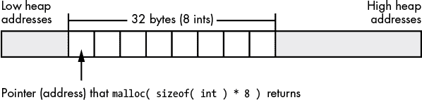
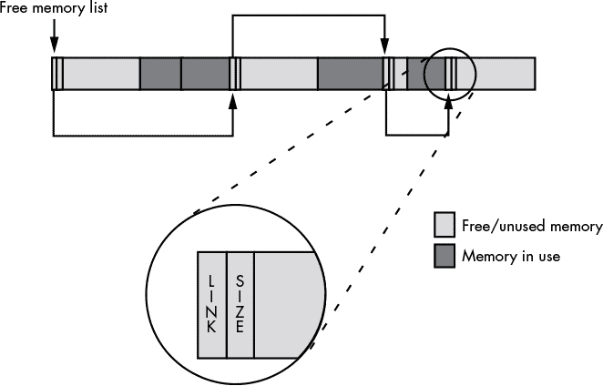
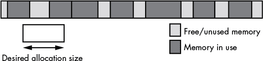
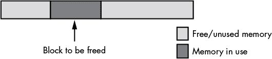
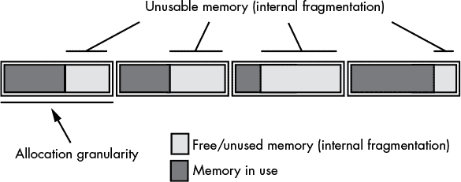

# 第九章：**指针数据类型**


指针是 `goto` 语句的数据类型等价物。若使用不当，它们会将一个稳健高效的程序变成一个充满 bug 和效率低下的垃圾堆。然而，与 `goto` 语句不同，指针在许多常见编程语言中难以避免。像 Dijkstra 的《Go To 语句不良影响》一文那样的“指针有害”文章，在学术期刊中是不存在的。^[1] 许多语言，如 Java 和 Swift，试图限制指针，但一些流行语言仍然使用它们，因此优秀的程序员需要能够处理它们。因此，本章将讨论：

+   指针的内存表示

+   高级语言如何实现指针

+   动态内存分配及其与指针的关系

+   指针运算

+   内存分配器如何工作

+   垃圾回收

+   常见的指针问题

通过理解指针的低级实现和使用，你将能够编写更高效、更安全、更易读的高级代码。本章将提供你需要的所有信息，帮助你正确使用指针，并避免通常与指针相关的问题。

### 9.1 指针的定义

指针只是一个变量，其值指向其他对象。像 Pascal 和 C/C++ 这样的高级语言通过抽象层隐藏了指针的简单性。HLL 程序员通常依赖于语言提供的高度抽象，因为他们不想了解幕后发生了什么。他们只需要一个“黑箱”，能够生成可预测的结果。然而，在指针的情况下，这种抽象可能*过于*有效；许多程序员觉得指针既令人畏惧又晦涩难懂。好吧，别怕！指针其实很容易处理。

为了理解指针是如何工作的，我将使用数组数据类型作为例子。考虑以下 Pascal 中的数组声明：

```
M: array [0..1023] of integer;
```

即使你不知道 Pascal，这里的概念也很容易理解。`M` 是一个包含 1,024 个整数的数组，索引从 `M[0]` 到 `M[1023]`。每个数组元素都可以存储一个独立的整数值。换句话说，这个数组给你提供了 1,024 个不同的整数变量，你可以通过数组索引（变量在数组中的顺序位置）来访问它们，而不是通过名称。

语句 `M[0] := 100;` 将值 `100` 存储到数组 `M` 的第一个元素中。现在考虑以下两个语句：

```

			i := 0; (* assume "i" is an integer variable *)
M [i] := 100;
```

这两个语句的作用与 `M[0] := 100;` 相同。事实上，你可以使用任何产生 `0..1023` 范围内的整数表达式作为该数组的索引。以下语句仍然执行与之前语句相同的操作：

```

			i := 5;         (* assume all variables are integers*)
j := 10;
k := 50;
m [i*j-k] := 100;
```

但现在看看以下语句：

```

			M [1] := 0;
M [ M [1] ] := 100;
```

初看之下，这些语句可能会让人困惑；然而，它们执行的操作与前面的例子相同。第一条语句将 `0` 存储到数组元素 `M[1]` 中。第二条语句取出 `M[1]` 的值，即 `0`，并利用该值来决定将 `100` 存储到哪里。

如果你认为这个例子是合理的——或许有点奇怪，但仍然可用——那么你就不会对指针感到困惑，因为`M[1]`是一个指针！好吧，严格来说不是，但如果你将 `M` 改为“内存”，并将该数组的每个元素视为单独的内存位置，那么它就符合指针的定义——即，一个内存变量，其值是某个其他内存对象的地址。

### 9.2 高级语言中的指针实现

尽管大多数语言使用内存地址实现指针，但指针实际上是内存地址的抽象。因此，一种语言可以通过任何机制来定义指针，这种机制将指针的值映射到内存中某个对象的地址。例如，一些 Pascal 的实现使用相对于固定内存地址的偏移量作为指针值。一些语言（包括像 Lisp 这样的动态语言）可能实际上使用*双级间接寻址*来实现指针；也就是说，指针对象包含某个内存变量的地址，而该内存变量的值是要访问对象的地址。这种方法看起来有点复杂，但它在复杂的内存管理系统中提供了某些优势，使得重用内存块变得更容易和高效。然而，为了简化起见，我们假设，如前所定义，指针是一个其值为内存中某个对象地址的变量。这对于许多你可能遇到的高性能高级语言（如 C、C++ 和 Delphi）来说是一个安全的假设。

你可以通过两条 80x86 机器指令间接访问对象，具体如下：

```

			mov( PointerVariable, ebx ); // Load pointer variable into a register.
mov( [ebx], eax );           // Use register-indirect mode to access data.
```

现在考虑前面描述的双级间接指针实现。通过双级间接访问数据比直接指针实现效率低，因为它需要额外的一条机器指令来从内存中取出数据。这在像 C/C++ 或 Pascal 这样的高级语言中并不明显，在这些语言中使用双级间接是显式的：

```

			i = **cDblPtr;
i := pDblPtr^^;
```

这在语法上类似于单级间接寻址。然而，在汇编语言中，你将看到额外的工作：

```

			mov( hDblPtr, ebx );  // Get the pointer to a pointer
mov( [ebx], ebx );    // Get the pointer to the value
mov( [ebx], eax );    // Get the value
```

与之前的两条汇编指令使用单级间接寻址访问对象相比，双级间接寻址需要比单级间接多 50% 的代码（并且需要两倍的内存访问速度），你可以理解为什么许多语言采用单级间接来实现指针。为了验证这一点，考虑以下 C 代码在不同编译器下生成的机器代码：

```

			static int i;
static int j;
static int *cSnglPtr;
static int **cDblPtr;

int main( void )
{
        .
        .
        .
    j = *cSnglPtr;
    i = **cDblPtr;
        .
        .
        .
```

下面是 PowerPC 处理器的 GCC 输出：

```

			; j = *cSnglPtr;

        addis r11,r31,ha16(_j-L1$pb)
        la r11,lo16(_j-L1$pb)(r11)
        addis r9,r31,ha16(_cSnglPtr-L1$pb)
        la r9,lo16(_cSnglPtr-L1$pb)(r9)
        lwz r9,0(r9)  // Get the ptr into register R9
        lwz r0,0(r9)  // Get the data at the pointer
        stw r0,0(r11) // Store into j

; i = **cDblPtr;
;
; Begin by getting the address of cDblPtr into R9:

        addis r11,r31,ha16(_i-L1$pb)
        la r11,lo16(_i-L1$pb)(r11)
        addis r9,r31,ha16(_cDblPtr-L1$pb)
        la r9,lo16(_cDblPtr-L1$pb)(r9)

        lwz r9,0(r9)  // Get the dbl ptr into R9
        lwz r9,0(r9)  // Get the ptr into R9
        lwz r0,0(r9)  // Get the value into R9
        stw r0,0(r11) // Store value into i
```

如你在这个 PowerPC 示例中看到的，使用双重间接寻址获取值比使用单重间接寻址多一条指令。当然，这里的总指令数相当大，因此这条额外的指令对执行时间的影响没有 80x86 中那么大，因为 80x86 中涉及的指令较少。考虑以下为 32 位 80x86 生成的 GCC 代码输出：

```

			; j = *cSnglPtr;

        movl    cSnglPtr, %eax
        movl    (%eax), %eax
        movl    %eax, j

; i = **cDblPtr;

        movl    cDblPtr, %eax
        movl    (%eax), %eax
        movl    (%eax), %eax
        movl    %eax, i
```

正如我们在 PowerPC 代码中看到的，双重间接寻址需要额外的机器指令，因此使用双重间接寻址的程序将变得更大且更慢。

请注意，PowerPC 指令序列的长度是 80x86 指令序列的两倍。^(2) 一种积极的看法是，双重间接寻址对 PowerPC 代码的执行时间的影响比对 80x86 代码的影响小。也就是说，额外的指令在 PowerPC 代码中只占总指令的 13%，而在 80x86 代码中则占总指令的 25%。^(3) 这个简短的例子应该能表明，执行时间和代码空间不是处理器独立的。糟糕的编码实践（例如在不需要时使用双重间接寻址）可能对某些处理器的影响更大。

### 9.3 指针和动态内存分配

指针通常引用匿名变量，这些匿名变量是通过堆上的内存分配/释放函数（如 `malloc()`/`free()`、`new()`/`dispose()`、以及 `new()`/`delete()`（C++17 中的 `std::make_unique`））进行分配的。你在堆上分配的对象被称为*匿名变量*，因为你通过它们的地址而不是名称来引用它们。虽然指针变量可能有一个名称，但该名称适用于指针的数据（一个地址），而不是该地址所引用的对象。

**注意**

*正如第七章所解释的，堆是内存中为动态存储分配保留的区域。*

动态语言以透明、自动的方式处理内存分配和释放操作。应用程序仅使用动态数据，并将内存分配的任务交给运行时系统，根据需要分配内存，并在内存不再需要时将存储空间重新用于其他目的。由于无需显式地为指针变量分配和释放内存，用动态语言（如 AWK 或 Perl）编写的应用程序通常更容易编写，而且往往包含更少的错误。但这也带来了效率上的代价，因为它们通常比用其他语言编写的程序运行得要慢。相反，传统语言（如 C/C++）要求程序员显式地管理内存，通常能够生成更高效的应用程序，尽管由于内存管理代码的额外复杂性，它更容易出现缺陷。

### 9.4 指针操作和指针算术

大多数提供指针数据类型的高级语言（HLL）允许你将地址分配给指针变量，比较指针值的相等性或不等性，并通过指针间接引用对象。一些语言还允许进行其他操作，正如你在本节中将看到的那样。

许多编程语言允许你对指针进行有限的算术操作。至少，这些语言允许你向指针添加一个整数常量，或从指针中减去一个整数。为了理解这两种算术操作的目的，请回顾一下 C 标准库中 `malloc()` 函数的语法：

```

			ptrVar = malloc( bytes_to_allocate );
```

你传递给 `malloc()` 的参数指定了要分配的存储字节数。一个好的 C 程序员通常会提供像 `sizeof(int)` 这样的表达式作为此参数。`sizeof()` 函数返回其单一参数所需的字节数。因此，`sizeof(int)` 告诉 `malloc()` 至少分配足够存储一个 `int` 变量的空间。现在考虑以下对 `malloc()` 的调用：

```
ptrVar = malloc( sizeof( int ) * 8 ); // An array of 8 integers
```

如果一个整数的大小是 4 字节，那么对 `malloc()` 的调用将分配 32 字节的存储空间，位于内存中的连续地址（参见图 9-1）。



*图 9-1：通过 malloc(sizeof(int) * 8) 分配内存*

`malloc()` 返回的指针包含此集合中第一个整数的地址，因此 C 程序只能直接访问这八个整数中的第一个。要访问其他七个整数的单独地址，你需要在该 *基准* 地址上加上一个整数偏移量。在支持字节可寻址内存的机器（如 80x86）上，内存中每个连续整数的地址是前一个整数地址加上整数大小。例如，如果对 C 标准库中的 `malloc()` 函数的调用返回内存地址 `$0300_1000`，那么 `malloc()` 分配的八个整数将位于表 9-1 中显示的内存地址。

**表 9-1：为基地址 `$0300_1000` 分配的整数地址**

| **整数** | **内存地址** |
| --- | --- |
| 第一 | `$0300_1000..$0300_1003` |
| 第二 | `$0300_1004..$0300..1007` |
| 第三 | `$0300_1008..$0300_100b` |
| 第四 | `$0300_100c..$0300_100f` |
| 第五 | `$0300_1010..$0300_1013` |
| 第六 | `$0300_1014..$0300..1017` |
| 第七 | `$0300_1018..$0300_101b` |
| 第八 | `$0300_101c..$0300_101f` |

#### 9.4.1 将整数添加到指针

由于前一部分中的八个整数相隔恰好 4 字节，你可以通过将 4 加到第一个整数的地址来获得第二个整数的地址。同样，第三个整数的地址是第二个整数的地址加上 4 字节，依此类推。在汇编语言中，你可以使用如下代码访问这八个整数：

```

			// malloc returns storage for eight
//  int32 objects in EAX.

malloc( @size( int32 ) * 8 );

mov( 0, ecx );
mov( ecx, [eax] );     // Zero out the 32 bytes
mov( ecx, [eax+4] );   // (4 bytes at a time).
mov( ecx, [eax+8] );
mov( ecx, [eax+12] );
mov( ecx, [eax+16] );
mov( ecx, [eax+20] );
mov( ecx, [eax+24] );
mov( ecx, [eax+28] );
```

请注意使用 80x86 索引寻址模式来访问 `malloc()` 分配的八个整数。EAX 寄存器保持了这段代码分配的八个整数的基地址（第一个地址），而 `mov()` 指令的寻址模式中的常数表示相对于这个基地址的特定整数的偏移量。

大多数 CPU 使用字节地址来表示内存对象。因此，当一个程序在内存中分配多个 *n* 字节对象时，这些对象不会从连续的内存地址开始；相反，它们会出现在相隔 *n* 字节的内存地址上。然而，某些机器不允许程序访问任意地址的内存；它们要求程序只能在对齐边界上访问数据，这些边界是字、双字甚至四字的倍数。任何试图在其他边界访问内存的行为都将引发异常，可能会终止应用程序。如果高级语言（HLL）支持指针运算，它必须考虑到这一点，并提供一个跨不同 CPU 架构可移植的通用指针运算方案。当 HLL 在指针上加上一个整数偏移时，最常见的解决方案是将该偏移量乘以指针所引用对象的大小。也就是说，如果你有一个指向内存中 16 字节对象的指针 `p`，那么 `p + 1` 指向比 `p` 指向的位置多 16 字节。同样，`p + 2` 指向比 `p` 指向的地址多 32 字节。只要数据对象的大小是所需对齐大小的倍数（编译器可以通过添加填充字节来强制执行，如果需要），这个方案就能避免在需要对齐数据访问的架构上出现问题。举个例子，考虑以下 C/C++ 代码：

```

			int *intPtr;
        .
        .
        .
    // Allocate storage for eight integers:

    intPtr = malloc( sizeof( int ) * 8 );

    // Initialize each of these integer values:

    *(intPtr+0) = 0;
    *(intPtr+1) = 1;
    *(intPtr+2) = 2;
    *(intPtr+3) = 3;
    *(intPtr+4) = 4;
    *(intPtr+5) = 5;
    *(intPtr+6) = 6;
    *(intPtr+7) = 7;
```

这个例子演示了 C/C++ 如何使用指针运算来指定相对于基指针地址的整数大小偏移。

需要注意的是，加法运算符只在指针和整数值之间才有意义。例如，在 C/C++ 中，你可以使用像 `*(p + i)` 这样的表达式间接访问内存中的对象（其中 `p` 是指向某个对象的指针，`i` 是整数值）。将两个指针相加是没有意义的。同样，将其他数据类型与指针相加也是不合理的——例如，将一个浮动点值加到指针上。（参考某个基地址加上 1.5612 是什么意思呢？）涉及字符串、字符和其他数据类型的指针运算也没有多大意义。整数（有符号和无符号）是唯一合理的可以加到指针上的值。

另一方面，你不仅可以将整数加到指针上，还可以将指针加到整数上，结果仍然是一个指针（`p + i` 和 `i + p` 都是合法的）。这是因为加法是 *可交换的*——操作数的顺序不会影响结果。

#### 9.4.2 从指针中减去一个整数

从指针中减去一个整数会引用紧接在指针所指向的基地址之前的内存位置。然而，减法不是交换律的，且将指针从整数中减去并不是一个合法操作（`p - i` 是合法的，但 `i - p` 不是）。

在 C/C++ 中，`*(p - i)` 访问的是紧接在 `p` 所指向的对象之前的第 `i` 个对象。在 80x86 汇编语言中，和许多处理器上的汇编语言一样，你还可以在使用索引寻址模式时指定一个负常量偏移量。例如：

```
mov( [ebx-4], eax );
```

请记住，80x86 汇编语言使用的是字节偏移量，而不是对象偏移量（如同 C/C++ 中使用的那样）。因此，这条语句将内存中紧接着 EBX 所指向的内存地址前面的双字加载到 EAX 中。

#### 9.4.3 从指针中减去另一个指针

与加法不同，减去一个指针变量的值是有意义的。考虑以下 C/C++ 代码，它通过一个字符字符串查找紧随第一个 `a` 字符之后的第一个 `e` 字符（例如，你可以使用这种计算的结果来提取子字符串）：

```

			int distance;
char *aPtr;
char *ePtr;
    .
    .
    .
aPtr = someString;  // Get ptr to start of string in aPtr.
// While we're not at the end of the string
// and the current char isn't 'a':

while( *aPtr != '\0' && *aPtr != 'a' )
{
    // Move on to the next character pointed at by aPtr.

    aPtr = aPtr + 1;
}

// while we're not at the end of the string
// and the current character isn't 'e'
//
// Start at the 'a' char (or end of string if no 'a').

ePtr = aPtr;
while( *ePtr != '\0' && *ePtr != 'e' )
{
    // Move on to the next character pointed at by aPtr.
    ePtr = ePtr + 1;
}

// Now compute the number of characters between
// the 'a' and the 'e' (counting the 'a' but not
// counting the 'e'):

distance = (ePtr - aPtr);
```

将一个指针从另一个指针中减去，得到的是它们之间存在的数据对象的数量（在本例中，`ePtr` 和 `aPtr` 指向的是字符，因此这次减法得到的是两个指针之间的字符数，或者如果是 1 字节字符的话，则是字节数）。

只有当两个指针都引用内存中相同的数据结构（例如数组、字符串或记录）时，指针值的减法才是有意义的。虽然汇编语言允许你减去指向内存中完全不同对象的两个指针，但它们的差值可能几乎没有什么意义。

在 C/C++ 中进行指针减法时，两个指针的基类型必须相同（即，两个指针必须包含类型相同的两个对象的地址）。这个限制存在的原因是，在 C/C++ 中，指针减法计算的是两个指针之间的对象数量，而不是字节数。计算内存中的字节与双字之间的对象数量是没有意义的。结果既不是字节数也不是双字数。

如果左侧指针操作数的内存地址低于右侧指针操作数的内存地址，则两个指针的减法可能返回一个负数。根据你使用的语言及其实现，如果你只关心两个指针之间的距离，而不在乎哪个指针包含较大的地址，可能需要取结果的绝对值。

#### 9.4.4 比较指针

比较是另一类对指针有意义的操作。几乎所有支持指针的语言都允许你比较两个指针，以查看它们是否相等。指针比较告诉你这些指针是否引用了内存中的同一对象。一些语言（如汇编和 C/C++）还允许你比较两个指针，查看一个指针是否小于或大于另一个指针。像减去两个指针一样，比较两个指针只有在它们具有相同的基类型并指向相同的数据结构时才有意义。如果一个指针小于另一个指针，这意味着该指针引用的数据结构中的某个对象出现在第二个指针包含的对象之前。大于比较的反之亦然。以下是一个 C 语言示例，演示了指针比较：

```

			#include <stdio.h>

int iArray[256];
int *ltPtr;
int *gtPtr;

int main( int argc, char **argv )
{
    int lt;
    int gt;

    // Put the address of the "argc" element
    // of iArray into ltPtr. This is done
    // so that the optimizer doesn't completely
    // eliminate the following code (as would
    // happen if we just specified a constant
    // index):

    ltPtr = &iArray[argc];

    // Put the address of the eighth array
    // element into gtPtr.

    gtPtr = &iArray[7];

    // Assuming you don't type seven or more
    // command-line parameters when running
    // this program, the following two
    // assignments should set lt and gt to 1.

    lt = ltPtr < gtPtr;
    gt = gtPtr > ltPtr;
    printf( "lt:%d, gt:%d\n", lt, gt );
    return 0;
}
```

在 (x86-64) 机器语言层面，地址仅仅是 64 位的量，因此机器代码可以将这些指针当作 64 位整数值进行比较。以下是 Visual C++ 为此示例生成的 x86-64 汇编代码：

```

			;
; Grab ARGC (passed to the program in rcx), use
; it as an index into iArray (4 bytes per element,
; hence the "*4" in the scaled-index addressing mode),
; compute the address of this array element (using the
; LEA -- load effective address -- instruction), and
; store the resulting address into ltPtr:
; Line 24
        movsxd  rax, ecx ; rax=rcx
; Line 37
        xor     edx, edx ;edx = 0
        mov     r8d, edx ;Initialize boolean result w/false
        lea     rcx, OFFSET FLAT:iArray ;rcx = base address of iArray
        lea     rcx, QWORD PTR [rcx+rax*4] ;rcx = &iArray[argc]

        lea     rax, OFFSET FLAT:iArray+28 ;rax=&iArray[7] (7*4 = 28)
        mov     QWORD PTR ltPtr, rcx ;ltPtr = &iArray[argc]
        cmp     rax, rcx ;carry flag = !(ltPtr < gtPtr)
        mov     QWORD PTR gtPtr, rax ;gtPtr = &iArray[7]
        seta    r8b ;r8b = ltPtr < gtPtr (which is !gtPtr > ltPtr)
        cmp     rcx, rax ;Carry flag = !(gtPtr > ltPtr)
; Line 38
        lea     rcx, OFFSET FLAT:??_C@_0O@KJKFINNE@lt?3?$CFd?0?5gt?3?$CFd?6?$AA@
        setb    dl ;dl = !(ltPtr < gtPtr ) (which is !(gtPtr > ltPtr)
        call    printf
;
```

除了比较两个地址后计算 `true`（`1`）或 `false`（`0`）的技巧之外，这段代码是一个非常直接的机器代码编译。

#### 9.4.5 使用逻辑与/或操作与指针

在字节可寻址的机器上，使用与（AND）操作符对地址与位串值进行逻辑与运算是有意义的，因为掩码低位（LO）位是将地址对齐到 2 的幂次方边界的一种简单方法。例如，如果 32 位的 80x86 EBX 寄存器包含一个任意地址，以下汇编语言语句将指针 EBX 向下舍入到一个 4 字节对齐的地址：

```
and( $FFFF_FFFC, ebx );
```

这种操作在确保内存以良好的内存边界进行访问时非常有用。例如，假设你有一个内存分配函数，它返回一个指向在任意字节边界开始的内存块的指针。为了确保指针所指向的数据结构从双字（`dword`）边界开始，你可以使用类似下面的汇编代码：

```

			// # of bytes to allocate

mov( nBytes, eax );

// Provide a "cushion" for rounding.

add( 3, eax );

// Allocate the memory (returns pointer in EAX).

malloc( eax );

// Round up to the next higher dword, if not dword-aligned.

add( 3, eax );

// Make the address a multiple of 4.

and( $ffff_fffc, eax );
```

这段代码在调用 `malloc()` 时额外分配了 3 个字节，以便它可以将 0、1、2 或 3 加到 `malloc()` 返回的地址上，从而将对象对齐到一个 `dword` 地址上。从 `malloc()` 返回时，代码将地址加 3，如果它本来不是 4 的倍数，那么地址将跨越到下一个 `dword` 边界。使用 AND 指令可以将地址还原到之前的 `dword` 边界（无论是下一个 `dword` 边界，还是如果它已经是 `dword` 对齐的原始地址）。

#### 9.4.6 使用其他操作与指针

除了加法、减法、比较操作，以及可能的与操作（AND）或或操作（OR）外，极少有算术操作对于指针操作数是有意义的。将指针乘以某个整数值（或另一个指针）是什么意思？指针的除法是什么意思？将指针左移一位是什么意思？你可以为这些操作编造一些定义，但考虑到原始的算术定义，这些操作对于指针来说根本不合理。

一些语言（包括 C/C++ 和 Pascal）限制了其他指针操作。有几个好的理由限制程序员对指针的操作，例如：

+   涉及指针的代码通常很难优化。通过限制指针操作的数量，编译器可以对代码做出一些假设，这是在没有限制的情况下无法做到的。这使得编译器（理论上）能够生成更好的机器代码。

+   包含指针操作的代码更容易出现缺陷。限制程序员在这一领域的选择有助于防止指针滥用，从而导致更健壮的代码。

**注意**

*“常见指针问题”一节在第 286 页中描述了这些错误中最严重的，并提供了避免它们的方法。*

+   一些指针操作——尤其是某些算术操作——在不同的 CPU 架构之间并不具有可移植性。例如，在一些分段架构（如原始的 16 位 80x86 架构）上，减去两个指针的值可能无法产生预期的结果。

+   正确使用指针有助于创建高效的程序，但反过来也成立：不当使用指针会破坏程序的效率。通过限制语言支持的指针操作数量，可以防止由于过度使用指针而导致的代码低效。

限制指针操作的这些理由的主要问题在于，大多数理由是为了保护程序员不犯错误，事实上，许多程序员（尤其是初学者）从这些限制所强制执行的纪律中受益。然而，对于那些谨慎使用指针、不滥用指针的程序员来说，这些限制可能会消除一些编写优秀代码的机会。因此，像 C/C++ 和汇编语言这样提供丰富指针操作集的语言，深受那些更喜欢对指针使用拥有完全控制的高级程序员欢迎。

### 9.5 一个简单的内存分配器示例

为了演示使用动态分配的内存和指向它的指针的性能和内存成本，本节展示了一个简单的内存分配/释放系统。通过考虑与内存分配和释放相关的操作，你将更加意识到它们的成本，并更好地了解如何以合适的方式使用它们。

一个极其简单（且快速）的内存分配方案是维护一个指向堆内存区域的单一变量。每当有内存分配请求时，系统就会复制这个堆指针并返回给应用程序。堆管理例程会将内存请求的大小加到指针变量中的地址上，并验证内存请求是否会尝试使用超过堆可用内存的空间。（一些内存管理器在内存请求过大时会返回一个错误指示，如`NULL`指针；其他则会抛出异常。）这个简单的内存管理方案的问题在于它浪费内存，因为没有*垃圾回收*机制让应用程序能够释放内存以便后续重用。垃圾回收是堆管理系统的一个主要目的。

唯一的问题是，支持垃圾回收需要一些额外开销。内存管理代码将需要更复杂，执行时间更长，并且需要一些额外的内存来维护堆管理系统使用的内部数据结构。考虑一个支持垃圾回收的堆管理器的简单实现，该实现适用于 32 位系统。这个简单的系统维护一个（链式）空闲内存块的列表。列表中的每个空闲内存块需要两个`dword`值：一个指定空闲块的大小，另一个包含下一个空闲块的地址（即链接）；参见图 9-2。



*图 9-2：使用空闲内存块列表的堆管理*

系统用一个`NULL`链接指针初始化堆，并且大小字段包含堆中所有空闲空间的大小。当有内存分配请求时，堆管理器会在列表中搜索，找到一个足够大的空闲块来满足请求。这个搜索过程是堆管理器的一个特征。一些常见的搜索算法包括首次适应搜索和最佳适应搜索。*首次适应搜索*顾名思义，会扫描块列表，直到找到第一个足够大的内存块来满足分配请求。*最佳适应搜索*则扫描整个列表，找到一个最小的足够大的块来满足请求。最佳适应算法的优点是，它比首次适应算法更能有效保存较大的块，因此在后续有更大的分配请求时，系统仍然能够满足这些请求。而首次适应算法则是抓住第一个合适大小的块，哪怕有一个较小的块也能满足需求，这可能会限制系统处理未来大内存请求的能力。

话虽如此，首次适配算法确实比最佳适配算法有一些优势。最明显的一点是，它通常更快。最佳适配算法必须扫描空闲块列表中的每个块，以找到一个足够大的最小块来满足分配请求（当然，如果途中找到一个完全合适的块，它就会停止）。而首次适配算法则可以在找到一个足够大的块满足请求后立即停止。

另一个首次适配算法的优点是，它往往较少遭受一种叫做*外部碎片*的退化状况。碎片化发生在一系列分配和释放请求之后。

请记住，当堆管理器满足内存分配请求时，它通常会创建两个内存块：一个是用于请求的在用块，另一个是包含原始块剩余字节的空闲块（假设请求的大小与块大小不完全匹配）。经过一段时间后，最佳适配算法可能会产生许多剩余的内存块，这些块太小，无法满足一般的内存请求，从而变得实际上不可用。随着这些小碎片在堆中积累，它们可能会消耗相当多的内存。这可能导致即使堆中有足够的空闲内存（分布在堆的各个位置），堆也没有足够大的块来满足内存分配请求。请参见图 9-3 中的示例。



*图 9-3：内存碎片化*

除了首次适配（first-fit）和最佳适配（best-fit）搜索算法，还有其他内存分配策略。它们中的一些执行速度更快，一些内存开销更少，一些容易理解（也有一些非常复杂），一些产生更少的碎片，而有些则可以组合并使用不连续的空闲内存块。内存/堆管理是计算机科学中研究较多的课题之一，关于不同方案的优缺点有大量文献解释。如需了解更多内存分配策略的信息，请参考一本关于操作系统设计的好书。

### 9.6 垃圾回收

内存分配只是故事的一半。如前所述，堆管理器还需要提供一个调用，允许应用程序释放其不再需要的内存，以供将来重用——这一过程称为垃圾回收。例如，在 C 和 HLA 中，应用程序通过调用`free()`函数来完成这一操作。乍一看，`free()`似乎是一个非常简单的函数。它要做的只是将先前分配的、现在未使用的内存块附加到空闲列表的末尾，对吧？然而，这种简单实现的`free()`存在一个问题，那就是它几乎可以确保堆会在短时间内变得碎片化并不可用。考虑图 9-4 中的情况。

如果`free()`仅仅将要释放的内存块添加到空闲列表中，则在图 9-4 所示的内存组织方式下会生成三个空闲块。然而，由于这三个块是连续的，堆管理器实际上应该将它们合并为一个单一的空闲块，以便能够满足更大的请求。不幸的是，这个操作需要扫描空闲块列表，以确定是否有任何空闲块与系统正在释放的块相邻。虽然你可以设计一种数据结构，使得合并相邻空闲块更加容易，但这种方案通常会为堆中的每个块增加 8 个或更多字节的开销。是否这是一个合理的权衡，取决于内存分配的平均大小。如果使用堆管理器的应用程序倾向于分配小对象，则每个内存块的额外开销可能会占用堆空间的很大一部分。然而，如果大多数分配是大的，少量的开销就不会有什么影响。



*图 9-4：释放内存块*

### 9.7 操作系统与内存分配

堆管理器所使用的算法和数据结构的性能只是性能难题的一部分。堆管理器最终需要向操作系统请求内存块。在一种极端情况下，操作系统直接处理所有的内存分配请求。在另一种极端情况下，堆管理器是一个与应用程序链接的运行时库例程，首先向操作系统请求大量的内存块，然后根据应用程序发出的分配请求将其拆分成小块。

向操作系统直接请求内存分配的问题在于操作系统的 API 调用通常非常慢。这是因为它们通常涉及在 CPU 上切换内核模式和用户模式（这并不快）。因此，如果操作系统直接实现堆管理器，而应用程序频繁调用内存分配和释放例程，堆管理器的性能将不会很好。

由于操作系统调用的高开销，大多数语言在它们的运行时库中实现了自己的`malloc()`和`free()`函数版本。在第一次内存分配时，`malloc()`例程向操作系统请求一个大块内存，而应用程序的`malloc()`和`free()`例程自行管理这块内存。如果出现了一个`malloc()`函数无法在它最初创建的内存块中满足的分配请求，`malloc()`将向操作系统请求另一个大块内存（通常比请求的要大得多），并将该块添加到其空闲列表的末尾。因为应用程序的`malloc()`和`free()`例程仅偶尔调用操作系统，所以应用程序不会遭遇频繁操作系统调用带来的性能损失。

然而，请记住，这个过程是非常依赖实现和语言的；在编写需要高性能组件的软件时，假设 `malloc()` 和 `free()` 是相对高效的做法是危险的。确保高性能堆管理器的唯一便携方法是开发自己特定应用程序的分配/释放例程。编写这些例程超出了本书的范围（大多数标准堆管理函数对于典型程序的表现良好），但你应该知道你有这个选择。

### 9.8 堆内存开销

堆管理器通常会表现出两种类型的开销：性能（速度）和内存（空间）。到目前为止，这个讨论主要处理了性能方面的问题，但现在我们将把注意力转向内存。

系统分配的每个块都需要一定的额外开销，这些开销超出了应用程序请求的存储空间；至少，这些开销是一些字节，用于跟踪块的大小。更复杂（高性能）的方案可能需要额外的字节，但通常开销在 8 到 64 字节之间。堆管理器可以将这些信息保存在一个单独的内部表中，也可以将块的大小和其他内存管理信息直接附加到它分配的块上。

将这些信息保存在内部表中有几个优点。首先，应用程序很难意外覆盖存储在其中的信息；将数据附加到堆内存块本身并不能提供足够的保护，防止这种情况发生。其次，将内存管理信息放入内部数据结构中，使得内存管理器可以轻松地确定给定的指针是否有效（也就是说，指向堆管理器认为已分配的某个内存块）。

将控制信息直接附加到堆管理器分配的每个块的优点在于，定位这些信息非常容易，而将信息存储在内部表中可能需要进行搜索操作。

另一个影响堆管理器开销的问题是*分配粒度*——即堆管理器支持的最小字节数。尽管大多数堆管理器允许你请求最小为 1 字节的分配，但实际上它们可能分配大于 1 字节的最小字节数。通常，设计内存分配函数的工程师会选择一个粒度，确保堆上分配的任何对象都能以该对象合理对齐的内存地址开始。因此，大多数堆管理器会在 4 字节、8 字节或 16 字节边界上分配内存块。出于性能考虑，许多堆管理器会在缓存行边界上开始每次分配，通常是 16、32 或 64 字节。不管粒度是多少，如果应用程序请求的字节数少于堆管理器粒度或不是粒度的倍数，堆管理器就会分配额外的存储字节（参见图 9-5）。这个数值因堆管理器而异（甚至可能因特定堆管理器的版本而异），因此程序员不应该假设应用程序有比请求的更多内存可用；如果他们有这种想法，应该提前请求更多的内存。

堆管理器分配的额外内存导致了另一种形式的碎片化，称为*内部碎片化*（在图 9-5 中也有显示）。与外部碎片化类似，内部碎片化会在系统中产生少量无法满足未来分配请求的剩余内存。假设是随机大小的内存分配，每次分配时发生的平均内部碎片化量是粒度大小的一半。幸运的是，对于大多数内存管理器来说，粒度大小通常非常小（通常为 16 字节或更少），因此经过成千上万次的内存分配后，你失去的内部碎片也只会是几十个字节。



*图 9-5：分配粒度和内部碎片化*

在分配粒度的成本和内存控制信息之间，典型的内存请求可能需要 8 到 64 字节，再加上应用程序请求的内存。如果你进行大规模内存分配（几百或几千字节），则开销字节不会占用堆内存的大部分比例。然而，如果你分配许多小对象，内部碎片和内存控制信息所消耗的内存可能占用堆区域的相当大一部分。例如，考虑一个简单的内存管理器，它总是在 4 字节对齐的边界上分配数据块，并且为每个内存存储分配请求附加一个 4 字节的长度值。这意味着堆管理器为每次分配所需的最小存储量是 8 字节。如果你进行一系列 `malloc()` 调用来分配一个字节，应用程序几乎无法使用它分配的 88% 内存。即使你在每次分配请求时分配 4 字节的值，堆管理器也会消耗三分之二的内存作为开销。然而，如果你的平均分配是 256 字节的块，开销仅占总内存分配的约 2%。简而言之，你的分配请求越大，控制信息和内部碎片对堆的影响就越小。

许多计算机科学期刊中的软件工程研究发现，内存分配/释放请求会导致性能的显著损失。在这些研究中，作者通过简单实现自己特定应用的简化内存管理算法，而不是调用标准运行时库或操作系统内核的内存分配代码，通常能获得 100% 或更好的性能提升。希望这一节已经让你意识到自己代码中可能存在的这个问题。

### 9.9 常见的指针问题

程序员在使用指针时会犯六个常见的错误。其中一些错误会立即通过诊断信息停止程序。其他错误则较为微妙，会导致错误结果，而不报告其他错误。还有一些错误会直接影响程序的性能。优秀的程序员始终意识到使用指针的风险，并避免这些错误：

+   使用未初始化的指针

+   使用包含非法值的指针，例如 `NULL`

+   在存储已释放后继续使用

+   程序使用完存储后未释放

+   使用错误的数据类型访问间接数据

+   执行无效的指针操作

#### 9.9.1 使用未初始化的指针

在为指针分配有效的内存地址之前使用指针变量是一个非常常见的错误。初学的程序员往往没有意识到，声明一个指针变量只会为指针本身保留存储空间，而不是为指针所引用的数据分配存储空间。以下是一个简短的 C/C++程序，演示了这个问题：

```

			int main()
{
    static int *pointer;

    *pointer = 0;
}
```

尽管你声明的静态变量从技术上讲是以`0`（即`NULL`）初始化的，但静态初始化并不会将指针初始化为有效的地址。因此，当该程序执行时，变量指针将不包含有效地址，程序将会失败。为避免这个问题，确保所有指针变量在解引用之前包含有效地址。例如：

```

			int main()
{
     static int i;

     static int *pointer = &i;

    *pointer = 0;
}
```

当然，在大多数 CPU 上并没有真正的未初始化变量。变量的初始化有两种方式：

+   程序员显式地为它们赋予初始值。

+   它们继承了系统为其绑定存储时内存中的任何位模式。

大多数时候，内存中残留的垃圾位模式并不对应有效的内存地址。尝试*解引用*这样的无效指针（即访问它所指向的内存中的数据）会引发内存访问违规异常，前提是你的操作系统能够捕捉到这个异常。

然而，有时候内存中的这些随机位恰好对应于一个你可以访问的有效内存位置。在这种情况下，CPU 会访问指定的内存位置而不会中止程序。一个初学者可能会认为，访问随机内存比中止程序更可取。然而，忽视错误要糟糕得多，因为你的有缺陷的程序会继续运行，而没有提醒你。如果你使用未初始化的指针存储数据，很可能会覆盖内存中其他重要变量的值。这会产生一些非常难以定位的问题。

#### 9.9.2 使用包含非法值的指针

程序员在使用指针时常犯的第二个错误是将无效值赋给它们（“无效”是指指针不包含内存中实际对象的地址）。这可以看作是第一个问题的一个更一般的情况；如果没有初始化，内存中的垃圾位就会提供无效的地址。其效果是一样的。如果你尝试解引用一个包含无效地址的指针，你将会遇到内存访问违规异常，或者访问一个意外的内存位置。解引用指针变量时要小心，确保在使用它之前已经为指针分配了有效地址。

#### 9.9.3 在释放存储后继续使用它

第三个错误被称为*悬空指针问题*。为了理解它，考虑以下 Pascal 代码片段：

```

			(* Allocate storage for a new object of type p  *)

new( p );

(* Use the pointer *)

p^ := 0;
    .
    . (* Code that uses the storage associated with p *)
    .
(* free the storage associated with pointer p *)

dispose( p );

    .
    . (* Code that doesn't reference p *)
    .
(* Dangling pointer                             *)

p^ := 5;
```

该程序分配了一些存储空间，并将该存储空间的地址保存在`p`变量中。代码使用这块存储空间一段时间后，再通过`dispose()`释放它，将内存归还给系统供其他用途。请注意，调用`dispose()`并不会改变分配的内存中的任何数据。它不会以任何方式改变`p`的值；`p`仍然指向之前由`new()`分配的内存块。然而，调用`dispose()`确实通知系统该程序不再需要这块内存，因此系统可以将该内存用于其他目的。`dispose()`函数无法强制确保你再也不会访问这些数据，你只是承诺不会再访问。当然，这段代码打破了这个承诺：最后一条语句将值`5`存储到`p`指向的内存地址中。

悬挂指针的最大问题在于，有时候你可能会侥幸使用它们，因此你不会立刻发现问题。只要系统没有重用你已经释放的存储空间，使用悬挂指针对你的程序没有直接影响。然而，随着每次调用`new()`，系统可能会决定重用之前调用`dispose()`释放的内存。当系统重用内存时，任何后续对悬挂指针的解引用操作可能会产生一些意想不到的后果。这些问题包括读取已被覆盖的数据、覆盖新的数据，或者（在最坏的情况下）覆盖系统堆管理指针（这可能导致程序崩溃）。解决方案很明确：一旦释放了与指针关联的存储空间，就绝不再使用该指针的值。

#### 9.9.4 使用后未释放存储空间

在所有这些错误中，未能释放已分配的存储空间可能对程序的正常运行影响最小。以下 C 语言代码片段展示了这个问题：

```

			// Pointer to storage in "ptr" variable.

ptr = malloc( 256 );
    .
    . // Code that doesn't free "ptr"
    .
ptr = malloc( 512 );

// At this point, there is no way to reference the
// original block of 256 bytes allocated by malloc.
```

在这个示例中，程序分配了 256 字节的存储空间，并使用`ptr`变量引用该存储空间。随后，程序分配了另一块 512 字节的存储空间，并将`ptr`中的值覆盖为新块的地址。原来在`ptr`中的地址值丢失了。由于程序已经覆盖了这个值，所以没有办法将最初的 256 字节的地址传递给`free()`函数。因此，这 256 字节的内存就无法再被程序使用。

尽管让程序无法访问 256 字节的内存看起来似乎没什么大不了的，但想象一下这段代码在循环中执行的情况。每次循环迭代，程序都会丧失另外 256 字节的内存。经过足够多次的重复后，程序就会耗尽堆上的可用内存。这个问题通常被称为*内存泄漏*，因为其效果就像是内存数据在程序执行过程中从计算机中“泄漏”出去。

内存泄漏不如悬空指针问题严重。实际上，内存泄漏只有两个问题：

+   堆空间耗尽的危险（这最终可能导致程序中止，尽管这种情况比较罕见）

+   由于虚拟内存页面交换导致的性能问题（*换页*）

尽管如此，释放你分配的所有存储空间是一个值得培养的好习惯。

**注意**

*当你的程序退出时，操作系统将回收所有存储空间，包括通过内存泄漏丢失的数据。因此，泄漏的内存只是对你的程序丢失，而不是整个系统。*

#### 9.9.5 使用错误的数据类型访问间接数据

指针的另一个问题是，它们缺乏类型安全的访问，使得容易不小心使用错误的数据类型。一些语言，比如汇编语言，不能也不强制进行指针类型检查。其他语言，比如 C/C++，则非常容易覆盖指针引用对象的类型。例如，考虑以下 C/C++程序片段：

```

			char *pc;
    .
    .
    .
pc = malloc( sizeof( char ));
    .
    .
    .
// Typecast pc to be a pointer to an integer
// rather than a pointer to a character:

*((int *) pc) = 5000;
```

通常，如果你试图将值`5000`赋给`pc`指向的对象，编译器会强烈抱怨。值`5000`无法适应与字符（`char`）对象相关联的存储空间，即 1 字节。然而，本文使用了*类型转换*（或*强制转换*）来告诉编译器，`pc`实际上包含的是指向一个整数的指针，而不是指向字符的指针。因此，编译器会认为这个赋值是合法的。

然而，如果`pc`实际上没有指向一个整数对象，这个序列中的最后一条语句可能会造成灾难。字符是 1 字节长，而整数通常更大。如果整数大于 1 字节，这个赋值会覆盖`malloc()`分配的 1 字节存储空间之外的若干字节。是否灾难性取决于字符对象后面在内存中紧跟的数据是什么。

#### 9.9.6 对指针执行非法操作

常见的指针错误的最后一类与指针本身的操作有关。任意的指针运算可能导致指针指向原本分配的数据范围之外的地方。通过一些疯狂的运算，甚至可以修改指针，使其不再指向正确的对象。考虑以下（非常糟糕的）C 代码：

```

			int  i [4] = {1,2,3,4};
int *p     = &i[0];
      .
      .
      .
    p = (int *)((char *)p + 1);
    *p = 5;
```

这个示例将`p`转换为指向`char`的指针。然后，它将`1`加到`p`中值的基础上。由于编译器认为`p`指向一个字符（因为有类型转换），它实际上将值`1`加到`p`中保存的地址上。这个序列中的最后一条指令将值`5`存储到`p`指向的内存地址中，这个地址现在距离`i[0]`元素的 4 字节区间只有 1 字节。在一些机器上，这将导致故障；而在其他机器上，它将把一个奇怪的值存储到`i[0]`和`i[1]`中。

比较两个指针是否小于或大于当这两个指针不指向同一个对象（通常是数组或结构体）时，就是另一个非法的指针操作例子，类似地，将指针强制转换为整数并赋予该指针一个整数值，也可能产生意想不到的结果。

### 9.10 现代语言中的指针

由于上一节中描述的问题，现代高级语言（如 Java、C#、Swift 和 C++11/C++14）尝试消除手动内存分配和释放。这些语言允许你在堆上创建新的对象（通常使用`new()`函数），但不提供显式释放存储的设施。相反，语言的运行时系统会追踪内存使用情况，并在程序不再使用内存时通过垃圾回收自动回收存储。这消除了大多数（但不是所有）与未初始化和悬空指针相关的问题，也降低了内存泄漏的可能性。这些新语言大大减少了与错误指针使用相关的问题数量。

当然，放弃对内存分配和释放的控制也会带来一些问题。特别是，你失去了控制内存分配生命周期的能力。现在，运行时系统决定何时进行垃圾回收以回收未使用的数据，因此，即使你已经不再使用某些数据，这些数据可能仍然会保留一段时间。

### 9.11 托管指针

一些编程语言提供非常有限的指针功能。例如，标准 Pascal 仅允许对指针进行少数几种操作：赋值（复制）、比较（用于相等/不相等）和解引用。它不支持指针算术，这意味着许多指针相关的错误是不可能发生的^(4)。另一方面，C/C++允许对指针进行不同的算术运算，使得该语言非常强大，但也引入了代码缺陷的可能性。

现代语言系统（例如，C#和微软通用语言运行时系统）引入了*托管指针*，它允许对指针进行各种算术运算，比标准的 Pascal 语言提供了更大的灵活性，但也有一些限制，帮助避免许多常见的指针问题。例如，在这些语言中，你不能将任意整数加到任意指针上（这在 C/C++中是可能的）。如果你想将一个整数加到指针上并获得合法的结果，指针必须包含一个数组对象的地址（或内存中其他类似元素的集合）。此外，整数的值必须限制在不超过数据类型大小的范围内（即，运行时系统会强制执行数组边界检查）。

虽然使用智能指针不能消除所有指针问题，但它确实可以防止指针引用的数据对象范围外的数据被擦除。它还帮助防止软件中的安全问题，例如通过在指针运算中提供非法偏移量来尝试攻击系统。

### 9.12 更多信息

Duntemann, Jeff. *汇编语言一步步*. 第 3 版。印第安纳波利斯：Wiley，2009 年。

Hyde, Randall. *汇编语言艺术*。第 2 版。旧金山：No Starch Press，2010 年。

Oualline, Steve. *如何避免在 C++中编程错误*。旧金山：No Starch Press，2003 年。
