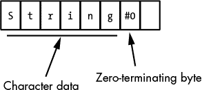
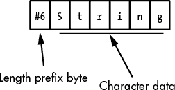
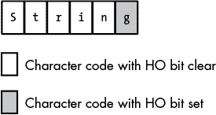
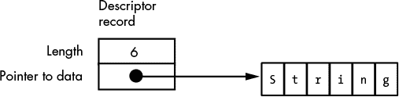

# 第十章：**字符串数据类型**


在整数之后，字符字符串可能是现代程序中最常用的数据类型；仅次于数组，它们是第二常用的复合数据类型。字符串是对象的序列。通常，*字符串*这一术语描述的是字符值的序列，但也有可能存在由整数、实数、布尔值等组成的字符串（例如，我已经在本书和*WGC1*中讨论过位字符串）。不过在本章中，我们将专注于字符字符串。

一般来说，字符字符串具有两个主要属性：*长度*和一些*字符数据*。字符字符串还可以具有其他属性，例如该特定变量的*最大长度*或*引用计数*，指示有多少不同的字符串变量引用相同的字符字符串。我们将研究这些属性及其程序如何使用它们，以及各种字符串格式和可能的字符串操作。具体而言，本章讨论以下主题：

+   字符串格式，包括零终止字符串、长度前缀字符串、HLA 字符串和 7 位字符串

+   何时使用（以及何时不使用）标准库字符串处理函数

+   静态、伪动态和动态字符串

+   引用计数与字符串

+   字符串中的 Unicode 和 UTF-8/UTF-16/UTF-32 字符数据

字符串操作在当今的应用程序中消耗了相当多的 CPU 时间。因此，如果你想编写高效操作字符串的代码，理解编程语言如何表示和操作字符字符串是非常重要的。本章提供了你所需要的基本信息。

### 10.1 字符串格式

不同的编程语言使用不同的数据结构来表示字符串。一些字符串格式使用较少的内存，其他格式允许更快的处理，一些格式更方便使用，一些对编译器开发者来说更易于实现，而一些则为程序员和操作系统提供了额外的功能。

尽管它们的内部表示方式各不相同，但所有字符串格式有一个共同点：字符数据。这是一系列 0 个或多个字节（*序列*一词意味着字符的顺序是重要的）。程序如何引用这组字符的方式因格式而异。在某些字符串格式中，字符序列存储在数组中；而在其他字符串格式中，程序保持指向内存中其他位置字符序列的指针。

所有字符字符串格式都共享长度属性；然而，它们使用多种不同的方式来表示字符串的长度。有些字符串格式使用一个特殊的*哨兵字符*来标记字符串的结尾。其他格式则在字符数据之前加上一个指定字符序列长度的数值。还有一些将长度编码为一个与字符序列无关的变量中的数值。某些字符字符串格式使用一个特殊的位（设置或清除）来标记字符串的结尾。最后，某些字符串格式结合了这些方法。一个特定字符串格式如何确定字符串的长度，可能会对操作这些字符串的函数性能产生较大影响，也会影响表示字符串数据所需的额外存储空间。

一些字符串格式提供附加的属性，如最大长度和引用计数值，这些属性可以让某些字符串函数更高效地操作字符串数据。这些附加属性是可选的，因为它们并不是定义字符串值所必须的。然而，它们确实允许字符串操作函数进行正确性检查或比其他方法更高效地工作。

为了帮助你更好地理解字符字符串设计背后的原因，我们来看一下由各种语言推广的几种常见字符串表示形式。

#### 10.1.1 零终止字符串

毫无疑问，*零终止字符串*（见图 10-1）可能是目前使用最广泛的字符串表示形式，因为这是 C、C++及其他几种语言的本地字符串格式。此外，你还会发现零终止字符串用于一些没有特定本地字符串格式的语言编写的程序中，例如汇编语言。



*图 10-1：零终止字符串格式*

零终止的 ASCII 字符串，也称为*ASCIIz*字符串或*zstring*，是包含零个或多个 8 位字符编码，并以包含`0`的字节结尾的序列——或者在 Unicode（UTF-16）的情况下，是一个包含零个或多个 16 位字符编码并以一个包含`0`的 16 位字结尾的序列。对于 UTF-32 字符串，字符串中的每个项都是 32 位（4 字节）宽，并以 32 位`0`值结尾。例如，在 C/C++中，ASCIIz 字符串`"abc"`需要 4 个字节：每个字符`a`、`b`、`c`各占 1 字节，后跟一个`0`字节。

零终止字符串相较于其他字符串格式有一些优势：

+   零终止字符串可以表示任何实际长度的字符串，且仅需 1 字节的开销（在 UTF-16 中为 2 字节，在 UTF-32 中为 4 字节）。

+   由于 C/C++编程语言的流行，现有许多高性能的字符串处理库，它们能够很好地处理零终止字符串。

+   零终止字符串易于实现。实际上，除了处理字符串字面常量外，C/C++ 编程语言并不提供本地的字符串支持。就这些语言而言，字符串只是字符数组。这也可能是 C 的设计者最初选择这种格式的原因——这样他们就不需要用字符串操作符来混乱语言的设计。

+   你可以在任何提供创建字符数组能力的语言中轻松表示零终止字符串。

然而，零终止字符串也有一些缺点，这意味着它们并不总是表示字符字符串数据的最佳选择：

+   当操作零终止字符串时，字符串函数通常效率较低。许多字符串操作需要在处理字符串数据之前知道字符串的长度。计算零终止字符串的长度的唯一合理方法是从头到尾扫描字符串。你的字符串越长，这个函数运行得就越慢，因此，如果你需要处理长字符串，零终止字符串格式不是最佳选择。

+   尽管这是一个小问题，但你无法轻松地使用零终止字符串格式表示字符代码`0`（例如 ASCII 和 Unicode 中的 NUL 字符）。

+   零终止字符串不包含任何信息，无法告诉你字符串可以扩展到终止 `0` 字节之后的长度。因此，一些字符串函数（如拼接）只能扩展现有字符串变量的长度，并且只有在调用者显式传递最大长度时才会检查溢出。

如前所述，零终止字符串的一个优点是你可以通过使用指针和字符数组轻松实现它们。考虑以下 C/C++ 语句：

```
someCharPtrVar = "Hello World";
```

以下是 Borland C++ v5.0 编译器为此语句生成的代码：

```

			;       char *someCharPtrVar;
   ;        someCharPtrVar = "Hello World";
   ;
@1:
; "offset" means "take the address of" and "s@" is
; the compiler-generated label where the string
; "Hello World" can be found.

    mov       eax,offset s@
        .
        .
        .
_DATA   segment dword public use32 'DATA'
;       s@+0:
        ; Zero-terminated sequence of characters
        ; emitted for the literal string "Hello World":

s@      label   byte
        db      "Hello World",0

        ;       s@+12:
        db      "%s",0
        align   4
_DATA   ends
```

Borland C++ 编译器将字面字符串 `"Hello World"` 直接输出到内存的全局数据段，然后将 `someCharPtrVar` 变量加载为该字符串字面量在数据段中的第一个字符的地址。从那时起，程序可以通过这个指针间接引用字符串数据。从编译器编写者的角度来看，这是一种非常方便的方案。

在使用像 C、C++、Python 或其他采用 C 字符串格式的语言时，你可以通过记住以下几点来提高字符串处理代码序列的性能：

+   尝试使用语言的运行时库函数，而不是尝试自己编写类似的函数。大多数编译器供应商提供了高度优化的字符串函数版本，这些函数的运行速度可能比你自己编写的代码快得多。

+   一旦通过扫描整个字符串计算了字符串的长度，应该将该长度保存以供将来使用（而不是每次需要时重新计算它）。

+   避免将字符串数据从一个字符串变量复制到另一个。这样做是使用零终止字符串的应用程序中最昂贵的操作之一（仅次于长度计算）。

以下小节将依次讨论每个要点。

##### 10.1.1.1 何时使用 C 标准库字符串函数

一些程序员怀疑别人能写出更快或更高质量的代码。但当涉及到标准库函数时，你应该避免用自己选择的代码替代它们。除非你考虑的库代码特别差，否则你很难接近它的效率。这一点在处理像 C 和 C++ 中的零终止字符串的字符串函数时尤其如此。标准库通常比你自己编写的代码表现得更好，有三个主要原因：经验、成熟度和内联替换。

编写编译器运行时库的典型程序员在字符串处理函数方面有着丰富的经验。尽管过去新编译器往往伴随着效率低下的库，但随着时间的推移，编译器程序员积累了相当多的经验，编写出了高效的字符串处理函数。除非你花费了大量时间编写相同类型的例程，否则你的代码不太可能与他们的代码表现得一样好。许多编译器供应商会从专门编写库代码的第三方购买标准库代码，所以即使你使用的编译器相对较新，它也可能有一个不错的库。如今，几乎没有商业编译器包含效率极低的库代码。大多数情况下，只有研究型或“爱好者”编译器才会包含那么糟糕的库代码，以至于你可以轻松编写出更好的代码。考虑一个简单的例子——C 标准库中的 `strlen()`（字符串长度）函数。以下是一个没有经验的程序员可能会编写的典型 `strlen()` 实现：

```

			#include <stdlib.h>
#include <stdio.h>
int myStrlen( char *s )
{
    char *start;

    start = s;
    while( *s != 0 )
    {
        ++s;
    }
    return s - start;
}

int main( int argc, char **argv )
{

    printf( "myStrlen = %d", myStrlen( "Hello World" ));
    return 0;
}
```

微软 Visual C++ 编译器为 `myStrlen()` 生成的 80x86 机器代码可能是任何汇编程序员所预期的样子：

```

			myStrlen PROC                                           ; COMDAT
; File c:\users\rhyde\test\t\t\t.cpp
; Line 10                           // Pointer to string (s) is passed in RCX register.
        cmp     BYTE PTR [rcx], 0   // Is *s = 0?
        mov     rax, rcx            // Save ptr to start of string to compute length
        je      SHORT $LN3@myStrlen // Bail if we hit the end of the string
$LL2@myStrlen:
; Line 12
        inc     rcx                 // Move on to next char in string
        cmp     BYTE PTR [rcx], 0   // Hit the 0 byte yet?
        jne     SHORT $LL2@myStrlen // If not, repeat loop
$LN3@myStrlen:
; Line 14
        sub     rcx, rax            // Compute length of string.
        mov     eax, ecx            // Return function result in EAX.
; Line 15
        ret     0
myStrlen ENDP
```

毫无疑问，一位经验丰富的汇编语言程序员可以重新排列这些特定的指令，稍微加速它。事实上，即使是一个普通的 80x86 汇编语言程序员，也能指出 80x86 的`scasb`指令在这段代码序列中完成了大部分工作。尽管这段代码相当简短且易于理解，但它并不会以最快的速度运行。一位专家级的汇编语言程序员可能会注意到，这个循环每次迭代处理字符串中的一个字符，并且一次访问一个字节的字符，它可能会通过展开^(1)循环并在每次迭代中处理多个字符来改进它。例如，考虑以下 HLA 标准库的`zstr.len()`函数，它通过一次处理四个字符来计算零终止字符串的长度：

```

			unit stringUnit;

#include( "strings.hhf" );

/*******************************************************************/
/*                                                                 */
/* zlen-                                                           */
/*                                                                 */
/* Returns the current length of the z-string passed as a parm.    */
/*                                                                 */
/*******************************************************************/

procedure zstr.len( zstr:zstring ); @noframe;
const
    zstrp   :text := "[esp+8]";

begin len;

    push( esi );
    mov( zstrp, esi );

    // We need to get ESI dword-aligned before proceeding.
    // If the LO 2 bits of ESI contain 0s, then
    // the address in ESI is a multiple of 4\. If they
    // are not both 0, then we need to check the 1,
    // 2, or 3 bytes starting at ESI to see if they
    // contain a zero-terminator byte.

    test( 3, esi );
    jz ESIisAligned;

    cmp( (type char [esi]), #0 );
    je SetESI;
    inc( esi );
    test( 3, esi );
    jz ESIisAligned;

    cmp( (type char [esi]), #0 );
    je SetESI;
    inc( esi );
    test( 3, esi );
    jz ESIisAligned;

    cmp( (type char [esi]), #0 );
    je SetESI;
    inc( esi );                 // After this, ESI is aligned.

    ESIisAligned:
        sub( 32, esi );         // To counteract add immediately below.
    ZeroLoop:
        add( 32, esi );         // Skip chars this loop just processed.
    ZeroLoop2:
        mov( [esi], eax );      // Get next four chars into EAX.
        and( $7f7f7f7f, eax );  // Clear HO bit (note:$80->$00!)
        sub( $01010101, eax );  // $00 and $80->$FF, all others have pos val.
        and( $80808080, eax );  // Test all HO bits.  If any are set, then
        jnz MightBeZero0;       // we've got a $00 or $80 byte.

        mov( [esi+4], eax );    // The following are all inline expansions
        and( $7f7f7f7f, eax );  // of the above (we'll process 32 bytes on
        sub( $01010101, eax );  // each iteration of this loop).
        and( $80808080, eax );
        jnz MightBeZero4;

        mov( [esi+8], eax );
        and( $7f7f7f7f, eax );
        sub( $01010101, eax );
        and( $80808080, eax );
        jnz MightBeZero8;

        mov( [esi+12], eax );
        and( $7f7f7f7f, eax );
        sub( $01010101, eax );
        and( $80808080, eax );
        jnz MightBeZero12;

        mov( [esi+16], eax );
        and( $7f7f7f7f, eax );
        sub( $01010101, eax );
        and( $80808080, eax );
        jnz MightBeZero16;

        mov( [esi+20], eax );
        and( $7f7f7f7f, eax );
        sub( $01010101, eax );
        and( $80808080, eax );
        jnz MightBeZero20;

        mov( [esi+24], eax );
        and( $7f7f7f7f, eax );
        sub( $01010101, eax );
        and( $80808080, eax );
        jnz MightBeZero24;

        mov( [esi+28], eax );
        and( $7f7f7f7f, eax );
        sub( $01010101, eax );
        and( $80808080, eax );
        jz ZeroLoop;

    // The following code handles the case where we found a $80
    // or a $00 byte. We need to determine whether it was a 0
    // byte and the exact position of the 0 byte. If it was a
    // $80 byte, then we've got to continue processing characters
    // in the string.

    // Okay, we've found a $00 or $80 byte in positions
    // 28..31\. Check for the location of the 0 byte, if any.

        add( 28, esi );
        jmp MightBeZero0;

    // If we get to this point, we've found a 0 byte in
    // positions 4..7:

    MightBeZero4:
        add( 4, esi );
        jmp MightBeZero0;

    // If we get to this point, we've found a 0 byte in
    // positions 8..11:

    MightBeZero8:
        add( 8, esi );
        jmp MightBeZero0;

    // If we get to this point, we've found a 0 byte in
    // positions 12..15:

    MightBeZero12:
        add( 12, esi );
        jmp MightBeZero0;

    // If we get to this point, we've found a 0 byte in
    // positions 16..19:

    MightBeZero16:
        add( 16, esi );
        jmp MightBeZero0;

    // If we get to this point, we've found a 0 byte in
    // positions 20..23:

    MightBeZero20:
        add( 20, esi );
        jmp MightBeZero0;

    // If we get to this point, we've found a 0 byte in
    // positions 24..27:

    MightBeZero24:
        add( 24, esi );

    // If we get to this point, we've found a 0 byte in
    // positions 0..3 or we've branched here from one of the
    // above conditions

    MightBeZero0:
        mov( [esi], eax );          // Get the original 4 bytes.
        cmp( al, 0 );               // See if the first byte contained 0.
        je SetESI;
        cmp( ah, 0 );               // See if the second byte contained 0.
        je SetESI1;
        test( $FF_0000, eax );      // See if byte #2 contained a 0.
        je SetESI2;
        test( $FF00_0000, eax );    // See if the HO byte contained 0.
        je SetESI3;

    // Well, it must have been a $80 byte we encountered.
    // (Fortunately, they are rare in ASCII strings, so all this
    // extra computation rarely occurs). Jump back into the 0
    // loop and continue processing.

        add( 4, esi );              // Skip bytes we just processed.
        jmp ZeroLoop2;              // Don't bother adding 32 in the ZeroLoop!

    // The following computes the length of the string by subtracting
    // the current ESI value from the original value and then adding
    // 0, 1, 2, or 3, depending on where we branched out
    // of the MightBeZero0 sequence above.

    SetESI3:
        sub( zstrp, esi );          // Compute length
        lea( eax, [esi+3] );        // +3 since it was in the HO byte.
        pop( esi );
        ret(4);

    SetESI2:
        sub( zstrp, esi );          // Compute length
        lea( eax, [esi+2] );        // +2 since zero was in byte #2
        pop( esi );
        ret(4);

    SetESI1:
        sub( zstrp, esi );          // Compute length
        lea( eax, [esi+1] );        // +1 since zero was in byte #1
        pop( esi );
        ret(4);

    SetESI:
        mov( esi, eax );
        sub( zstrp, eax );          // Compute length. No extra addition since
        pop( esi );                 // 0 was in LO byte.
        ret( _parms_ );

end len;
end stringUnit;
```

即使这个函数比之前给出的简单示例更长且更复杂，但它运行得更快，因为它每次循环迭代处理四个字符，而不是一个，这意味着它执行的循环迭代次数大大减少。此外，这段代码通过展开八个循环副本（即将循环体的八个副本内联展开）来减少循环开销，这节省了 87%的循环控制指令的执行。因此，这段代码的运行速度比之前的代码快两到六倍；具体的节省取决于字符串的长度。^(2)

避免自己编写库函数的第二个原因是代码的成熟度。现今大多数流行的优化编译器已经存在了一段时间。在此期间，编译器厂商已经使用了他们的例程，找出了瓶颈所在，并对他们的代码进行了优化。当你编写自己的标准库字符串处理函数时，你可能不会有足够的时间来进行优化——你还得处理整个应用程序。由于项目的时间限制，你很可能永远不会回过头来重写那个字符串函数以提高性能。即使你现在的程序有些微的性能优势，编译器厂商将来可能会更新他们的库，而你只需将更新后的代码与项目重新链接，就能利用这些改进。然而，如果你自己编写库代码，除非你明确更新它，否则它永远不会改进。大多数人都忙于处理新项目，没有时间回去清理旧代码，所以未来改进自己编写的字符串函数的可能性非常低。

在像 C 或 C++ 这样的语言中使用标准库字符串函数的第三个原因是最重要的：内联扩展。许多编译器能够识别某些标准库函数名，并将它们内联展开为高效的机器代码，取代函数调用。这个内联扩展通常比显式的函数调用快得多，尤其是在函数调用包含多个参数的情况下。举个简单的例子，考虑以下（几乎微不足道的）C 程序：

```

			#include <string.h>
#include <stdio.h>

int main( int argc, char **argv )
{
    char localStr[256];

    strcpy( localStr, "Hello World" );
    printf( localStr );
    return 0;
}
```

Visual C++ 生成的相应的 64 位 x86-64 汇编代码相当有趣：

```

			; Storage for the literal string appearing in the
; strcpy invocation:

_DATA   SEGMENT
$SG6874 DB  'Hello World', 00H
_DATA   ENDS

_TEXT   SEGMENT
localStr$ = 32
__$ArrayPad$ = 288
argc$ = 320
argv$ = 328
main    PROC
; File c:\users\rhyde\test\t\t\t.cpp
; Line 6
$LN4:
    sub rsp, 312                ; 00000138H
    mov rax, QWORD PTR __security_cookie
    xor rax, rsp
    mov QWORD PTR __$ArrayPad$[rsp], rax
; Line 9
    movsd   xmm0, QWORD PTR $SG6874
; Line 10
    lea rcx, QWORD PTR localStr$[rsp]
    mov eax, DWORD PTR $SG6874+8
    movsd   QWORD PTR localStr$[rsp], xmm0
    mov DWORD PTR localStr$[rsp+8], eax
    call    printf
; Line 11
    xor eax, eax
; Line 12
    mov rcx, QWORD PTR __$ArrayPad$[rsp]
    xor rcx, rsp
    call    __security_check_cookie
    add rsp, 312                ; 00000138H
    ret 0
main    ENDP
_TEXT   ENDS
```

编译器能够识别正在发生的事情，并替换为四条内联指令，将字符串的 12 个字节从内存中的字面常量复制到`localStr`变量中（具体来说，它使用 XMM0 寄存器复制 8 个字节，使用 EAX 寄存器复制 4 个字节；注意，这段代码使用 RCX 将`localStr`的地址传递给`printf()`函数）。调用和返回一个实际的`strcpy()`函数的开销将比这个更昂贵（更不用说复制字符串数据所需的工作）。这个例子很好地演示了为什么你通常应该调用标准库函数，而不是编写你自己的“优化”函数来完成相同的工作。

##### 10.1.1.2 何时不使用标准库函数

尽管如你所见，通常调用标准库例程要比编写你自己的版本更好，但在某些特殊情况下，你**不应该**依赖标准库中的一个或多个库函数。

当库函数完全执行你需要的功能时，它们非常有效——既不多也不少。程序员容易出问题的一个地方是，他们错误地使用库函数，调用它来做一些它并不真正打算做的事，或者他们只需要它提供功能的一部分。例如，考虑 C 标准库中的`strcspn()`函数：

```

			size_t strcspn( char *source, char *cset );
```

这个函数返回源字符串中字符数，直到它找到一个在`cset`字符串中也出现的第一个字符为止。看到像这样的函数调用并不罕见：

```

			len = strcspn( SomeString, "a" );
```

这里的目的是返回 SomeString 中第一次出现字符`a`之前的字符数。也就是说，它尝试做类似以下的事情：

```

			len = 0;
while
(
        SomeString[ len ] != '\0'
    &&  SomeString[ len ] != 'a'
){
    ++len;
}
```

不幸的是，调用`strcspn()`函数可能比这个简单的`while`循环实现要慢得多。这是因为`strcspn()`实际上做了比仅仅在字符串中查找单个字符更多的工作。它会在源字符串中查找来自一组字符的任何字符。这个函数的通用实现可能像这样：

```

			len = 0;
for(;;) // Infinite loop
{
    ch = SomeString[ len ];
    if( ch == '\0' ) break;
    for( i=0; i<strlen( cset ); ++i )
    {
        if( ch == cset[i] ) break;
    }
    if( ch == cset[i] ) break;
    ++len;
}
```

通过稍微分析（并注意到我们有一对嵌套循环），很明显这段代码比前面的代码慢，即使你传入一个只包含单个字符的 `cset` 字符串。这是一个经典的例子，展示了调用一个比实际需要更通用的函数，因为它会搜索多个终止字符，而不是单一终止字符的特殊情况。当一个函数完全符合你的需求时，使用标准库的版本是一个好主意。然而，当它做的事情超出你的需求时，使用标准库函数可能会非常昂贵，这时自己写一个版本会更好。

##### 10.1.1.3 为什么要避免重新计算字符串长度

前一节的最后一个例子演示了一个常见的 C 编程错误。考虑以下代码片段：

```

			for( i=0; i<strlen( cset ); ++i )
{
    if( ch == cset[i] ) break;
}
```

在每次循环迭代中，代码都会测试循环索引，看它是否小于 `cset` 字符串的长度。但因为循环体没有修改 `cset` 字符串（并且假设这不是一个多线程应用程序，另一个线程没有修改 `cset` 字符串），实际上没有必要在每次循环迭代中重新计算字符串长度。看一下微软 Visual C++ 32 位编译器为这段代码生成的机器代码：

```

			; Line 10
        mov     DWORD PTR i$1[rsp], 0 ;for(i = 0;...;...)
        jmp     SHORT $LN4@main

$LN2@main:
        mov     eax, DWORD PTR i$1[rsp] ;for(...;...;++i)
        inc     eax
        mov     DWORD PTR i$1[rsp], eax

$LN4@main: ;for(...; i < strlen(localStr);...)
        movsxd  rax, DWORD PTR i$1[rsp]
        mov     QWORD PTR tv65[rsp], rax
        lea     rcx, QWORD PTR localStr$[rsp]
        call    strlen
        mov     rcx, QWORD PTR tv65[rsp]
        cmp     rcx, rax
        jae     SHORT $LN3@main
; Line 12
        movsx   eax, BYTE PTR ch$[rsp]
        movsxd  rcx, DWORD PTR i$1[rsp]
        movsx   ecx, BYTE PTR localStr$[rsp+rcx]
        cmp     eax, ecx
        jne     SHORT $LN5@main
        jmp     SHORT $LN3@main
$LN5@main:
; Line 13
        jmp     SHORT $LN2@main
$LN3@main:
```

同样，机器代码在每次内层 `for` 循环的迭代中重新计算字符串的长度，但由于 `cset` 字符串的长度始终不变，这完全是不必要的。我们可以通过将代码片段重写成这样，轻松地解决这个问题：

```

			slen = strlen( cset );
len = 0;
for(;;) // Infinite loop
{
    ch = SomeString[ len ];
    if( ch == '\0' ) break;
    for( i=0; i<slen; ++i )
    {
        if( ch == cset[i] ) break;
    }
    if( ch == cset[i] ) break;
    ++len;
}
```

另一方面，如果你启用了优化，微软 VC++ 编译器的最新版本会识别这种情况。因为 VC++ 确定字符串长度是一个循环不变的计算（即它的值在每次循环迭代中都不会改变），VC++ 会把对 `strlen()` 的调用移出循环。不幸的是，VC++ 并不能在所有情况下都捕捉到这一点。例如，如果你调用一个 VC++ 不知道的函数，并将 `localStr` 的地址作为一个（非 `const`）参数传递给它，VC++ 将不得不假设字符串的长度可能会改变（即使实际上没有改变），因此它无法将 `strlen()` 的调用移出循环。

很多字符串操作在执行之前需要知道字符串的长度。考虑 `strdup()` 函数，它在许多 C 库中常见。^(3) 以下代码是这个函数的常见实现：

```

			char *strdup( char *src )
{
    char *result;

    result = malloc( strlen( src ) + 1 );
    assert( result != NULL ); // Check malloc check
    strcpy( result, src );
    return result;
}
```

从根本上讲，这个 `strdup()` 的实现没有错。如果你对传递的字符串对象一无所知，那么你必须计算字符串的长度，以便知道为该字符串的副本分配多少内存。然而，考虑以下调用 `strdup()` 的代码序列：

```

			len = strlen( someStr );
if( len == 0 )
{
    newStr = NULL;
}
else
{
    newStr = strdup( someStr );
}
```

这里的问题是你会调用`strlen()`两次：一次是显式调用`strlen()`，另一次是在`strdup()`函数内部调用。更糟糕的是，这并不明显，因此你甚至无法察觉到你在这段代码中浪费了 CPU 周期。这是另一个例子，说明调用了一个比你实际需要的更通用的函数，导致程序重新计算字符串的长度（这是一种低效的过程）。一种解决方案是提供一个更不通用的版本，比如`strduplen()`，它允许你传递已经计算过的字符串长度。你可以按如下方式实现`strduplen()`：

```

			char *strduplen( char *src, size_t len)
{
    char *result;

    // Allocate storage for new string:

    result = malloc( len + 1 );
    assert( result != NULL );

    // Copy the source string and
    // 0 byte to the new string:

    memcpy( result, src, len+1 );
    return result;
}
```

注意使用`memcpy()`而不是`strcpy()`（或者更好的是`strncpy()`）。同样，我们已经知道字符串的长度，因此没有必要执行任何代码来查找终止字节`0`（这正是`strcpy()`和`strncpy()`所做的）。当然，这个函数实现假设调用者传递了正确的长度，但对于大多数字符串和数组操作来说，这是标准 C 语言的假设。

##### 10.1.1.4 为什么要避免复制数据

复制字符串，尤其是长字符串，可能是一个耗时的过程。大多数程序在内存中维护字符串数据，而内存比 CPU 慢得多（通常慢一个数量级或更多）。尽管缓存内存可以帮助缓解这个问题，但处理大量字符串数据可能会从缓存中移除其他数据，并且如果你不经常重用所有通过缓存移动的字符串数据，就会导致缓存抖动问题。虽然并非总能避免在字符串数据之间移动，但许多程序不必要地复制数据，这会影响程序性能。

更好的解决方案是传递指向零终止字符串的*指针*，而不是将这些字符串从一个字符串变量复制到另一个字符串变量。指向零终止字符串的指针可以存储在寄存器中，并且在使用内存变量来存储它们时不会占用太多内存。因此，传递指针对缓存和 CPU 性能的影响远远小于在字符串变量之间复制字符串数据。

正如你在本节中所看到的，零终止字符串函数通常比操作其他类型字符串的函数效率低。此外，使用零终止字符串的程序往往会出错，比如多次调用`strlen()`函数，或者滥用通用函数来实现特定的目标。幸运的是，在以零终止字符串为本地字符串格式的编程语言中，设计和使用更高效的字符串格式是相对简单的。

#### 10.1.2 长度前缀字符串

第二种常见的字符串格式，*长度前缀字符串*，克服了零终止字符串的一些问题。长度前缀字符串在像 Pascal 这样的语言中很常见；它们通常由一个字节组成，指定字符串的长度，后面跟着零个或多个 8 位字符代码（见 图 10-2）。在长度前缀方案中，字符串 `"String"` 由 4 个字节组成：长度字节（`6`），后面是字符 `S`、`t`、`r`、`i`、`n` 和 `g`。



*图 10-2：长度前缀字符串格式*

长度前缀字符串解决了与零终止字符串相关的两个问题：

+   NUL 字符可以在长度前缀字符串中表示。

+   字符串操作更高效。

长度前缀字符串的另一个优点是，长度通常位于字符串中的位置 `0`（如果我们将字符串视为字符数组），因此字符串的第一个字符在数组表示中从索引 `1` 开始。对于许多字符串函数，使用基于 `1` 的索引比基于 `0` 的索引（零终止字符串使用的索引）要方便得多。

长度前缀字符串确实有其自身的缺点，主要是它们的长度限制为最多 255 个字符（假设使用 1 字节长度前缀）。你可以通过使用 2 字节或 4 字节的长度值来去除这个限制，但这样会将额外的开销数据从 1 字节增加到 2 字节或 4 字节。而且，它还会将字符串的起始索引从 1 改为 2 或 4，消除了 `1` 基索引的特点。虽然有方法可以克服这个问题，但它们会带来更多的开销。

许多字符串函数在长度前缀字符串上更高效。显然，计算字符串的长度是一个简单的操作——它只是一次内存访问——但其他最终需要字符串长度的字符串函数（如连接和赋值）通常比零终止字符串的类似函数更高效。此外，每次调用语言标准库中内置的字符串函数时，你不必担心重新计算字符串的长度。

尽管有这些优点，但不要产生这样的印象：使用长度前缀字符串函数的程序总是高效的。你仍然可以通过不必要地复制数据而浪费许多 CPU 周期。和零终止字符串一样，如果你只使用字符串函数的一部分功能，仍然会浪费大量 CPU 周期来执行不必要的任务。

使用长度前缀字符串函数时，请记住以下几点：

+   尽量使用语言的运行时库函数，而不是自己编写类似的函数。大多数编译器供应商提供的字符串函数经过高度优化，运行速度可能比你自己编写的代码快得多。

+   尽管在使用带长度前缀的字符串格式时计算字符串长度相对简单，但许多（Pascal）编译器实际上会调用一个函数来从字符串数据中提取长度值。函数调用和返回比从变量中获取长度值要昂贵得多。因此，一旦计算出字符串的长度，如果打算再次使用该值，考虑将该长度保存在局部变量中。当然，如果编译器足够智能，能够将对长度函数的调用替换为从字符串数据结构中简单地获取数据，那么这种“优化”对你帮助不大。

+   避免将字符串数据从一个字符串变量复制到另一个。这样做是使用带长度前缀的字符串的程序中较为昂贵的操作之一。传递字符串的指针与零终止字符串的好处相同。

#### 10.1.3 七位字符串

7 位字符串格式是一个有趣的选择，适用于像 ASCII 这样的 7 位编码。它使用字符串中字符的（通常未使用的）高阶位来表示字符串的结束。字符串中的每个字符代码，除了最后一个字符，其高阶位都是清除的，最后一个字符的高阶位是设置的（见图 10-3）。



*图 10-3：七位字符串格式*

这种 7 位字符串格式有几个缺点：

+   你必须扫描整个字符串才能确定字符串的长度。

+   这种格式中不能有零长度的字符串。

+   很少有语言提供用于 7 位字符串的字面量字符串常量。

+   你最多只能有 128 个字符代码，尽管在使用普通 ASCII 时这并不成问题。

然而，7 位字符串的最大优势是它们不需要任何额外的字节来编码长度。当处理 7 位字符串时，汇编语言（使用宏来创建字面量字符串常量）可能是最适合的语言。因为 7 位字符串的优点是它们紧凑，而汇编语言程序员通常最关心紧凑性，因此这是一个很好的匹配。以下是一个 HLA 宏，它将字面量字符串常量转换为 7 位字符串：

```

			#macro sbs( s );

    // Grab all but the last character of the string:

    (@substr( s, 0, @length(s) - 1) +

        // Concatenate the last character
        // with its HO bit set:

        char
        (
            uns8
            (
               char( @substr( s, @length(s) - 1, 1))
            ) | $80
        )
    )
#endmacro
    .
    .
    .
byte sbs( "Hello World" );
```

由于很少有语言支持 7 位字符串，第一个适用于零终止和带长度前缀字符串的建议并不适用于 7 位字符串：你可能必须编写自己的字符串处理函数。然而，即使是 7 位字符串，计算长度和复制数据也是昂贵的操作，所以这两条建议仍然适用：

+   一旦你通过扫描整个字符串计算出字符串的长度，就可以保存该长度以备将来使用（而不是每次需要时都重新计算它）。

+   避免将字符串数据从一个字符串变量复制到另一个。这样做是使用 7 位字符串的程序中成本较高的操作之一。

#### 10.1.4 HLA 字符串

只要你不太关心每个字符串多出的几个字节开销，你就可以创建一种结合了长度前缀和零终止字符串优点的字符串格式，而没有它们各自的缺点。高级汇编语言已经通过其原生字符串格式实现了这一点。^(4)

HLA 字符串格式的最大缺点是每个字符串所需的开销（如果你在内存受限的环境中，并且处理许多小字符串，这个开销可能会非常显著）。HLA 字符串包含一个长度前缀和一个零终止字节，以及一些其他信息，每个字符串总共有 9 个字节的开销。^(5)

HLA 字符串格式使用一个 4 字节的长度前缀，使得字符字符串的长度可以达到超过 40 亿个字符（远远超出任何实际应用的需求）。HLA 还会在字符字符串数据后附加一个 `0` 字节，因此 HLA 字符串与引用（但不更改长度）零终止字符串的字符串函数兼容。HLA 字符串中的剩余 4 字节开销包含该字符串的最大合法长度（加上一个 `0` 终止字节）。这个额外的字段允许 HLA 字符串函数在必要时检查字符串溢出。在内存中，HLA 字符串的形式如图 10-4 所示。


*图 10-4：HLA 字符串格式*

字符串第一个字符之前的 4 个字节包含当前字符串长度。当前字符串长度之前的 4 个字节包含最大字符串长度。紧随字符数据后面的是一个 `0` 字节。最后，HLA 始终确保字符串数据结构的长度是 4 字节的倍数，以提高性能，因此在内存中对象的末尾可能会有最多 3 个额外的填充字节。（注意，图 10-4 中显示的字符串只需要 1 个填充字节，以确保数据结构的长度是 4 字节的倍数。）

HLA 字符串变量实际上是指针，包含字符串第一个字符的字节地址。要访问长度字段，你需要将字符串指针的值加载到一个 32 位寄存器中，然后从该寄存器偏移 -4 处访问长度字段，从寄存器偏移 -8 处访问最大长度字段。以下是一个示例：

```

			static
    s :string := "Hello World";
        .
        .
        .
// Move the address of 'H' in
// "Hello World" into esi.

mov( s, esi );

// Puts length of string
// (11 for "Hello World") into ECX.

mov( [esi-4], ecx );
        .
        .
        .
mov( s, esi );

// See if value in ECX exceeds the
// maximum string length.

cmp( ecx, [esi-8] );
jae StringOverflow;
```

如前所述，HLA 字符串的字符数据（包括 `0` 字节）所保留的内存量始终是 4 字节的倍数。因此，总是可以通过复制双字而不是单个字节来将数据从一个 HLA 字符串移动到另一个 HLA 字符串。这使得字符串复制例程运行速度提高最多四倍，因为复制双字字符串的循环迭代次数是逐字节复制字符串的四分之一。例如，这是 HLA `str.cpy()` 函数中复制一个字符串到另一个字符串的高度修改版代码：

```

			// Get the source string pointer into ESI,
// and the destination pointer into EDI.
    mov( dest, edi );
    mov( src, esi );

    // Get the length of the source string
    // and make sure that the source string
    // will fit in the destination string.

    mov( [esi-4], ecx );

    // Save as the length of the destination string.

    mov( ecx, [edi-4] );

    // Add 1 byte to the length so we will
    // copy the 0 byte. Also compute the
    // number of dwords to copy (rather than bytes).
    // Then copy the data.

    add( 4, ecx );  // Adds one, after division by 4.
    shr( 2, ecx );  // Divides length by 4
    rep.movsd();    // Moves length/4 dwords
```

HLA `str.cpy()` 函数还会检查字符串溢出和 `NULL` 指针引用（为了清晰起见，这段代码在本示例中没有出现）。然而，重点是 HLA 以双字的形式复制字符串，以提高性能。

HLA 字符串变量的一个优点是（作为只读对象）HLA 字符串与零终止字符串兼容。例如，如果你有一个用 C 或其他语言编写的函数，要求你传递一个零终止的字符串，你可以调用该函数并传递一个 HLA 字符串变量，如下所示：

```
someCFunc( hlaStringVar );
```

唯一需要注意的是，C 函数不得对字符串进行任何会影响其长度的修改（因为 C 代码不会更新 HLA 字符串的 `Length` 字段）。当然，你可以在返回时调用 C 的 `strlen()` 函数来更新长度字段，但通常最好不要将 HLA 字符串传递给会修改零终止字符串的函数。

关于长度前缀字符串的评论通常适用于 HLA 字符串，具体而言：

+   尝试使用 HLA 标准库函数，而不是自己编写相应的函数。尽管你可能想查看库函数的源代码（HLA 中提供了源代码），但大多数字符串函数对于通用字符串数据的处理都很不错。

+   虽然理论上你不应该依赖 HLA 字符串数据格式中显式的长度字段，但大多数程序会从字符串数据之前的 4 个字节获取长度，因此通常不需要保存长度。细心的 HLA 程序员实际上会调用 HLA 标准库中的 `str.len()` 函数，并将此值保存在局部变量中以供将来使用。然而，直接访问长度通常是安全的。

+   避免将字符串数据从一个字符串变量复制到另一个字符串变量中。在使用 HLA 字符串的程序中，这种操作是相对昂贵的。

#### 10.1.5 基于描述符的字符串

迄今为止我们讨论的字符串格式将属性信息（即长度和终止字节）与字符数据一起保存在内存中。一种稍微灵活一些的方案是将这些信息保存在一个记录结构中，该结构称为*描述符*，它还包含指向字符数据的指针。考虑以下 Pascal/Delphi 数据结构（参见图 10-5）：

```

			type
    dString = record
        curLength  :integer;
        strData    :^char;
    end;
```



*图 10-5：字符串描述符*

请注意，这个数据结构并不保存实际的字符数据。相反，`strData`指针包含字符串第一个字符的地址。`curLength`字段指定字符串的当前长度。您可以根据需要向该记录添加其他字段，比如最大长度字段，尽管通常不需要最大长度，因为大多数采用描述符的字符串格式都是动态的（如下一节将讨论的那样）。

基于描述符的字符串系统的一个有趣特性是，与字符串相关的实际字符数据可能是一个更大字符串的一部分。由于实际字符数据中没有长度或终止字节，因此两个字符串的字符数据可以重叠（参见图 10-6）。


*图 10-6：使用描述符的重叠字符串*

这个例子展示了两个重叠的字符串——`"Hello World"`和`"World"`。这样可以节省内存，并使某些函数，如`substring()`，非常高效。当然，当字符串像这样重叠时，您不能修改字符串数据，因为那样可能会破坏其他字符串的一部分。

针对其他字符串格式的建议并不完全适用于基于描述符的字符串。确实，如果有标准库可用，您应该调用那些函数，因为它们可能比您自己编写的函数更高效。不需要保存长度，因为从字符串的描述符中提取长度字段通常是一个小任务。此外，许多基于描述符的字符串系统使用*写时复制*（参见*WGC1*和第 317 页的“动态字符串”部分）来减少字符串复制的开销。在字符串描述符系统中，您应避免修改字符串，因为写时复制语义通常要求系统在您更改单个字符时对整个字符串进行完整复制（与其他字符串格式不同，这种操作通常是不必要的）。

### 10.2 静态、伪动态和动态字符串

在介绍了各种字符串数据格式之后，接下来需要考虑的是在哪里存储字符串数据。字符串可以根据系统何时以及何地分配存储来分类。它们有三种类别：静态字符串、伪动态字符串和动态字符串。

#### 10.2.1 静态字符串

纯*静态字符串*是程序员在编写程序时选择其最大大小的字符串。Pascal 字符串和 Delphi*短字符串*属于这一类别。你在 C/C++中用来保存零终止字符串的字符数组也属于这一类别，固定长度的字符数组也在此类之中。考虑以下在 Pascal 中的声明：

```

			(* Pascal static string example *)

var
    //Max length will always be 255 characters.

    pascalString :string[255];
```

这里有一个 C/C++的例子：

```

			// C/C++ static string example:

//Max length will always be 255 characters (plus 0 byte).

char cString[256];
```

在程序运行时，无法增加这些静态字符串的最大大小，也无法减少它们所使用的存储空间；这些字符串对象在运行时将消耗 256 字节的存储空间，且不可改变。纯静态字符串的一个优点是编译器可以在编译时确定它们的最大长度，并隐式地将此信息传递给字符串函数，以便在运行时检查边界溢出。

#### 10.2.2 伪动态字符串

伪动态字符串是系统通过调用像`malloc()`这样的内存管理函数在运行时为其分配存储空间的字符串。然而，一旦系统为该字符串分配了存储空间，字符串的最大长度就固定了。HLA 字符串通常属于这一类别。^(6) HLA 程序员通常会调用`stralloc()`函数为字符串变量分配存储空间，之后该字符串对象的长度将固定，无法更改。^(7)

#### 10.2.3 动态字符串

动态字符串系统通常使用基于描述符的格式，每当创建新字符串或对现有字符串进行影响时，系统会自动为字符串对象分配足够的存储空间。在动态字符串系统中，像字符串赋值和子字符串提取这样的操作相对简单——通常它们只复制字符串描述符数据，因此这些操作很快。然而，正如在第 315 页“基于描述符的字符串”一节中所提到的，使用这种方式的字符串时，无法将数据存储回字符串对象中，因为这可能会修改系统中其他字符串对象的数据。

解决这个问题的方法是使用写时复制技术。每当一个字符串函数需要修改动态字符串中的字符时，该函数首先会复制一份字符串，然后对那份副本进行必要的修改。研究表明，写时复制语义可以提高许多典型应用程序的性能，因为像字符串赋值和子字符串提取（其实只是部分字符串赋值）这样的操作，比修改字符串内的字符数据要常见得多。这种方法唯一的缺点是，在内存中对字符串数据进行多次修改后，字符串堆区域可能会包含一些不再使用的字符数据。为了避免内存泄漏，采用写时复制的动态字符串系统通常会提供垃圾回收代码，扫描字符串堆区域，寻找过时的字符数据，以便将这些内存回收用于其他目的。不幸的是，根据使用的算法不同，垃圾回收可能非常缓慢。

**注意**

*有关内存泄漏和垃圾回收的更多信息，请参见第九章。*

### 10.3 字符串的引用计数

假设有两个字符串描述符（或指针）指向内存中相同的字符串数据。显然，在程序仍然使用另一个指针访问相同数据时，你不能释放与其中一个指针关联的存储空间。一个常见的解决方案是让程序员负责跟踪这些细节。不幸的是，随着应用程序变得更加复杂，这种方法往往会导致悬空指针、内存泄漏和其他与指针相关的问题。一个更好的解决方案是允许程序员释放字符串中字符数据的存储空间，并且让实际的释放过程推迟，直到程序员释放掉最后一个引用该数据的指针。为了实现这一点，字符串系统可以使用*引用计数器*，它们跟踪指针及其关联的数据。

引用计数器是一个整数，用来统计内存中引用字符串字符数据的指针数量。每次将字符串的地址赋值给某个指针时，引用计数器加 1。同样，当你想要释放与字符串字符数据关联的存储空间时，引用计数器减 1。直到引用计数器减到 0，才会真正释放字符数据的存储空间。

引用计数在语言自动处理字符串赋值的细节时效果很好。如果你尝试手动实现引用计数，必须确保每次将字符串指针赋值给其他指针变量时，都要始终递增引用计数器。最好的做法是不要直接赋值指针，而是通过某个函数（或宏）调用来处理所有字符串赋值，这样不仅能复制指针数据，还能更新引用计数器。如果你的代码未能正确更新引用计数器，最终可能会出现悬空指针或内存泄漏。

### 10.4 Delphi 字符串

尽管 Delphi 提供了与早期版本 Delphi 和 Turbo Pascal 中的长度前缀字符串兼容的“短字符串”格式，但从 Delphi v4.0 版本开始，后续版本使用动态字符串作为其本地字符串格式。虽然这种字符串格式未公开（因此可能会发生变化），但有迹象表明，Delphi 的字符串格式与 HLA 非常相似。Delphi 使用一个零终止的字符序列，前面有字符串长度和引用计数器（而不是像 HLA 使用的最大长度）。图 10-7 显示了 Delphi 字符串在内存中的布局。


*图 10-7：Delphi 字符串数据格式*

与 HLA 一样，Delphi 字符串变量是指针，指向实际字符串数据的第一个字符地址。为了访问长度和引用计数字段，Delphi 字符串例程使用从字符数据基地址偏移的负值 -4 和 -8。然而，由于这种字符串格式并未公开，应用程序不应直接访问长度或引用计数字段（例如，这些字段将来可能会变为 64 位值）。Delphi 提供了一个长度函数来提取字符串长度，而你的应用程序实际上无需访问引用计数字段，因为 Delphi 字符串函数会自动维护它。

### 10.5 在高级语言中使用字符串

字符串是高级编程语言中非常常见的数据类型。由于应用程序经常大量使用字符串数据，许多高级编程语言提供了包含大量复杂字符串操作例程的库，这些操作例程将相当复杂的细节隐藏在程序员的视野之外。不幸的是，当你执行像下面这样的语句时，很容易忽视典型字符串操作所涉及的工作量：

```
aLengthPrefixedString := 'Hello World';
```

在典型的 Pascal 实现中，这个赋值语句会调用一个函数，将字符串字面量的每个字符复制到为 aLengthPrefixedString 变量保留的存储空间中。也就是说，这个语句大致展开为如下：

```

			(* Copy the characters in the string *)

    for i:= 1 to length( HelloWorldLiteralString ) do begin

        aLengthPrefixedString[ i ] :=
            HelloWorldLiteralString[ i ];

    end;

    (* Set the string's length *)

    aLengthPrefixedString[0] :=
        char( length( HelloWorldLiteralString ));
```

这段代码甚至不包括过程调用、返回和参数传递的开销。正如本章各处提到的，复制字符串数据是程序中常见的昂贵操作之一。这就是为什么许多高级语言（HLL）已转向动态字符串和写时复制语义——当你仅复制指针而不是所有字符数据时，字符串赋值要高效得多。这并不是说写时复制总是更好，但对于许多字符串操作——比如赋值、子字符串操作和其他不会改变字符串字符数据的操作——它可以非常高效。

尽管很少有编程语言允许你选择想要使用的字符串格式，但许多语言允许你创建指向字符串的指针，因此你可以手动支持写时复制。如果你愿意编写自己的字符串处理函数，通过避免使用语言内置的字符串处理功能，你可以创建一些非常高效的程序。例如，C 语言中的子字符串操作通常由`strncpy()`函数处理，通常像这样实现：^(8)

```

			char *
strncpy( char* dest, char *src, int max )
{
    char *result = dest;
    while( max > 0 )
    {
        *dest = *src++;
        if( *dest++ == '\0') break;
        --max;
    }
    return result;
}
```

一个典型的“子字符串”操作可能会像下面这样使用`strncpy()`：

```

			strncpy( substring, fullString + start, length );
substring[ length ] = '\0';
```

其中 substring 是目标字符串对象，fullString 是源字符串，start 是要复制的子字符串的起始索引，length 是要复制的子字符串的长度。

如果你使用 C 语言中的`struct`创建一个基于描述符的字符串格式，类似于《基于描述符的字符串》一章中“描述符式字符串”部分提到的 HLA 记录，在 C 语言中，你可以通过以下两个语句进行子字符串操作：

```

			// Assumption: ".strData" field is char*

    substring.strData = fullString.strData + start;
    substring.curLength = length;
```

这段代码的执行速度比`strncpy()`版本要快得多。

有时，某些编程语言不会提供访问其支持的底层字符串数据表示的功能，你将不得不忍受性能损失、切换语言，或者编写自己的汇编语言字符串处理代码。然而，通常来说，在应用程序中有替代方法来避免复制字符串数据，比如使用字符串描述符，就像刚才的示例所示。

### 10.6 Unicode 字符数据在字符串中的应用

到目前为止，我们假设字符串中的每个字符都占用精确的 1 字节存储空间。我们还假设在讨论字符串中的字符数据时使用的是 7 位 ASCII 字符集。传统上，这一直是编程语言表示字符串字符数据的方式。然而，今天，ASCII 字符集对于全球使用来说太有限了，许多新的字符集已经逐渐流行起来，其中包括 Unicode 的变体：UTF-8、UTF-16、UTF-32 和 UTF-7。因为这些字符格式可能对操作它们的字符串函数的效率产生重大影响，我们将花一些时间讨论它们。

#### 10.6.1 Unicode 字符集

几十年前，Aldus、NeXT、Sun、Apple Computer、IBM、Microsoft、研究图书馆集团和 Xerox 的工程师意识到，他们的新计算机系统支持位图和用户可选择字体，可以同时显示比 256 个字符更多的字符。当时，*双字节字符集（DBCSs）*是最常见的解决方案。然而，DBCSs 有几个问题。首先，作为典型的可变长度编码，DBCSs 需要特殊的库代码；依赖固定长度字符编码的常见字符/字符串算法在它们上面无法正常工作。其次，没有统一的标准——不同的 DBCSs 对不同的字符使用相同的编码。因此，为了避免这些兼容性问题，工程师们寻找了另一种解决方案。

他们想出的解决方案是 Unicode 字符集。最初开发 Unicode 的工程师选择了 2 字节字符大小。像 DBCSs 一样，这种方法仍然需要特殊的库代码（现有的单字节字符串函数并不总是能与 2 字节字符兼容），但除了改变字符的大小外，大多数现有的字符串算法仍然可以与 2 字节字符一起使用。Unicode 的定义包括了当时所有的（已知/在用的）字符集，为每个字符分配了唯一的编码，以避免不同 DBCSs 所困扰的一致性问题。

原始的 Unicode 标准使用 16 位字表示每个字符。因此，Unicode 支持最多 65,536 个不同的字符编码——相比 8 位字节能够表示的 256 个编码，这是一个巨大的进步。此外，Unicode 向下兼容 ASCII。如果 Unicode 字符的高 9 位^(9)的二进制表示中包含`0`，则低 7 位使用标准 ASCII 码。如果高 9 位包含非零值，则 16 位形成扩展字符编码（即从 ASCII 扩展过来）。如果你在想为什么需要这么多不同的字符编码，值得注意的是，当时某些亚洲字符集包含了 4,096 个字符。Unicode 字符集甚至提供了一组编码，可以用来创建自定义的字符集。65,536 个可能的字符编码中，大约一半已经被定义，剩余的字符编码保留用于未来扩展。

今天，Unicode 已经成为一个通用字符集，长期取代了 ASCII 和旧版的双字节字符集（DBCS）。所有现代操作系统（包括 macOS、Windows、Linux、iOS、Android 和 Unix）、网页浏览器以及大多数现代应用程序都支持 Unicode。Unicode 联盟是一个非营利机构，负责维护 Unicode 标准。通过维护该标准，Unicode 公司（*[`home.unicode.org`](https://home.unicode.org)）帮助确保你在一个系统上写下的字符能够在不同的系统或应用程序中按预期显示。

#### 10.6.2 Unicode 代码点

可惜的是，尽管最初的 Unicode 标准设计得非常周到，但它无法预见到字符的激增。表情符号、星座符号、箭头、指针以及为互联网、移动设备和网页浏览器引入的各种符号大大扩展了 Unicode 符号的范围（同时也带来了对历史、过时和稀有文字的支持需求）。1996 年，系统工程师发现 65,536 个符号已经不够用了。为了避免每个 Unicode 字符需要 3 或 4 个字节，负责 Unicode 定义的人员放弃了创建固定大小字符表示的想法，转而允许 Unicode 字符使用不透明的（且可变的）编码。如今，Unicode 定义了 1,112,064 个代码点，远超最初为 Unicode 字符设置的 2 字节容量。

Unicode *代码点* 只是一个整数值，Unicode 将其与特定字符符号关联；你可以将其视为字符的 Unicode 等价物，类似于 ASCII 代码。Unicode 代码点的约定是以十六进制表示，并以 `U+` 前缀指定；例如，`U+0041` 是字母 *A* 的 Unicode 代码点。

**注意**

*查看更多关于代码点的详细信息，请访问* [`en.wikipedia.org/wiki/Unicode#General_Category_property`](https://en.wikipedia.org/wiki/Unicode#General_Category_property) *。*

#### 10.6.3 Unicode 编码平面

由于历史原因，Unicode 中的 65,536 个字符块具有特殊意义——它们被称为*多语言平面*。第一个多语言平面，`U+000000` 到 `U+00FFFF`，大致对应于最初的 16 位 Unicode 定义；Unicode 标准将其称为*基本多语言平面（BMP）*。平面 1（`U+010000` 到 `U+01FFFF`）、平面 2（`U+020000` 到 `U+02FFFF`）和平面 14（`U+0E0000` 到 `U+0EFFFF`）是补充平面。Unicode 保留平面 3 到 13 供未来扩展，平面 15 和 16 用于用户自定义字符集。

Unicode 标准定义了范围为 `U+000000` 到 `U+10FFFF` 的代码点。请注意，`0x10FFFF` 是 1,114,111，这是 Unicode 字符集中的大部分 1,112,064 个字符的来源；其余的 2,048 个代码点被保留用于作为*替代符*，即 Unicode 扩展。你可能还会听到另一个术语——*Unicode 标量*；这是指来自所有 Unicode 代码点集合的值，*但不包括*那 2,048 个替代符代码点。六位数的代码点值中的前两位十六进制数字指定了多语言平面。为什么有 17 个平面？原因是，正如你将看到的，Unicode 使用特殊的多字条目来编码 `U+FFFF` 以外的代码点。每个扩展编码 10 位，共 20 位；20 位可以表示 16 个多语言平面，加上原始的 BMP，总共 17 个多语言平面。这也是为什么代码点范围是 `U+000000` 到 `U+10FFFF`：编码这 16 个多语言平面加上 BMP 需要 21 位。

#### 10.6.4 代理代码点

如前所述，Unicode 最初是一个 16 位（2 字节）字符集编码。当 16 位的编码容量显然不足以处理当时所有可能的字符时，便需要扩展。从 Unicode v2.0 开始，Unicode, Inc. 组织扩展了 Unicode 的定义，以包括多字字符。现在 Unicode 使用代理代码点（`U+D800` 到 `U+DFFF`）来编码大于 `U+FFFF` 的值。图 10-8 显示了编码方式。


*图 10-8：Unicode 平面 1 到 16 的代理代码点编码*

请注意，两个单词（单元 1/高代理和单元 2/低代理）总是一起出现。单元 1 的值（带有 HO 位 `%110110`）指定 Unicode 标量的上 10 位（`b[10]`..`b[19]`），而单元 2 的值（带有 HO 位 `%110111`）指定 Unicode 标量的下 10 位（`b[0]`..`b[9]`）。因此，位 `b[16]`..`b[19]` 加 1 的值指定 Unicode 平面 1 到 16。位 `b[0]`..`b[15]` 指定平面内的 Unicode 标量值。

注意，代理代码仅出现在基本多文种平面（BMP）中。其他多语言平面不包含代理代码。位 `b[0]`..`b[19]` 从单元 1 和 2 提取的值始终指定一个 Unicode 标量值（即使该值落在 `U+D800` 到 `U+DFFF` 范围内）。

#### 10.6.5 字形、字符和字形簇

每个 Unicode 码点都有一个唯一的名称。例如，`U+0045` 的名称是 “LATIN CAPITAL LETTER A”。请注意，符号 *A* 不是字符的名称。*A* 是一个 *字形*——设备通过绘制一系列笔画（一个水平笔画和两个倾斜笔画）来表示该字符。

单一的 Unicode 字符 “LATIN CAPITAL LETTER A” 有许多不同的字形。例如，Times Roman A 和 Times Roman Italic *A* 有不同的字形，但 Unicode 不区分它们（也不区分 *A* 字符在任何两种不同字体中的差异）。字符 “LATIN CAPITAL LETTER A” 始终是 `U+0045`，无论你使用何种字体或样式来绘制它。

顺便提一句，如果你有使用 Swift 编程语言的权限，你可以通过以下代码打印任何 Unicode 字符的名称：

```

			import Foundation
let charToPrintName  :String = "A"      // Print name of this character

let unicodeName =
    String(charToPrintName).applyingTransform(
        StringTransform(rawValue: "Any-Name"),
        reverse: false
    )! // Forced unwrapping is legit here because it always succeeds.
print( unicodeName )

Output from program:
\N{LATIN CAPITAL LETTER A}
```

那么，Unicode 中的字符究竟是什么？Unicode 标量是 Unicode 字符，但通常所说的字符和 Unicode 字符（标量）的定义之间是有区别的。例如，*é* 是一个字符还是两个字符？考虑以下 Swift 代码：

```

			import Foundation
let eAccent  :String = "e\u{301}"
print( eAccent )
print( "eAccent.count=\(eAccent.count)" )
print( "eAccent.utf16.count=\(eAccent.utf16.count)" )
```

`"\u{301}"` 是 Swift 语法中指定字符串内 Unicode 标量值的方式；在这个特定的例子中，`301` 是 *组合尖音符* 字符的十六进制代码。

第一个 `print` 语句：

```
print( eAccent )
```

打印该字符（输出 `é`，正如我们所期望的）。

第二个 `print` 语句打印出 Swift 确定字符串中包含的字符数量：

```
print( "eAccent.count=\(eAccent.count)" )
```

这会在标准输出中打印 `1`。

第三个`print`语句打印字符串中的元素数量（UTF-16 元素^(10))：

```
print( "eAccent.utf16.count=\(eAccent.utf16.count)" )
```

这在标准输出中打印 `2`，因为字符串包含 2 个 UTF-16 数据单元。

那么，这到底是一个字符还是两个字符呢？在内部（假设使用 UTF-16 编码），计算机为这个单一字符分配了 4 字节的内存（两个 16 位 Unicode 标量值）。^(11) 然而，在屏幕上，输出仅占用一个字符位置，并且看起来就像是一个字符。当这个字符出现在文本编辑器中，并且光标紧挨字符的右侧时，用户期望按下退格键时能够删除它。从用户的角度来看，这确实是一个字符（就像当你打印字符串的 `count` 属性时 Swift 所报告的那样）。

然而，在 Unicode 中，字符大体上等同于一个代码点。这并不是人们通常所认为的字符。在 Unicode 术语中，*字素簇* 是人们通常所称为字符的东西——它是一个或多个 Unicode 代码点的序列，组合成一个单一的语言元素（即单一字符）。因此，当我们谈论应用程序向终端用户展示的符号时，实际上是在谈论字素簇。

字素簇（Grapheme clusters）可能会让软件开发者感到头痛。考虑以下的 Swift 代码（对之前示例的修改）：

```

			import Foundation
let eAccent  :String = "e\u{301}\u{301}"
print( eAccent )
print( "eAccent.count=\(eAccent.count)" )
print( "eAccent.utf16.count=\(eAccent.utf16.count)" )
```

这段代码从前两个 `print` 语句中产生相同的 `é` 和 `1` 输出。以下代码输出 `é`：

```
print( eAccent )
```

而这个 `print` 语句输出的是 `1`。

```
print( "eAccent.count=\(eAccent.count)" )
```

然而，第三个 `print` 语句：

```
print( "eAccent.utf16.count=\(eAccent.utf16.count)" )
```

显示 `3` 而不是原示例中的 `2`。

这个字符串中无疑有三个 Unicode 标量值（`U+0065`、`U+0301` 和 `U+0301`）。在打印时，操作系统将字符 `e` 和两个急音符组合字符组合成单一字符 `é`，然后将该字符输出到标准输出设备。Swift 足够聪明，知道这个组合会在显示器上生成一个单一输出符号，因此打印 `count` 属性的结果仍然输出 `1`。然而，这个字符串中确实包含（不可否认的）三个 Unicode 代码点，因此打印 `utf16.count` 时输出的是 `3`。

#### 10.6.6 Unicode 标准与规范等价性

Unicode 字符 *é* 实际上早在 Unicode 出现之前就已经存在于个人电脑中。它是原始 IBM PC 字符集的一部分，也是 Latin-1 字符集的一部分（例如在旧款 DEC 终端上使用）。事实证明，Unicode 使用 Latin-1 字符集来表示从 `U+00A0` 到 `U+00FF` 范围内的代码点，而 `U+00E9` 正好对应于 *é* 字符。因此，我们可以像之前那样修改程序：

```

			import Foundation
let eAccent  :String = "\u{E9}"
print( eAccent )
print( "eAccent.count=\(eAccent.count)" )
print( "eAccent.utf16.count=\(eAccent.utf16.count)" )
```

以下是该程序的输出：

```

			é
1
1
```

哎呀！三个不同的字符串都产生 `é`，但包含不同数量的代码点。想象一下，这将如何使得包含 Unicode 字符的编程字符串更加复杂。例如，如果你有以下三个字符串（Swift 语法），并且尝试比较它们，结果会是什么？

```

			let eAccent1 :String = "\u{E9}"
let eAccent2 :String = "e\u{301}"
let eAccent3 :String = "e\u{301}\u{301}"
```

对用户来说，这三种字符串在屏幕上看起来是相同的。然而，它们明显包含不同的值。如果你比较它们看看是否相等，结果是`true`还是`false`？

最终，这取决于你使用的字符串库。大多数当前的字符串库在比较这些字符串是否相等时会返回 `false`。有趣的是，Swift 会声称 `eAccent1` 等于 `eAccent2`，但它不够聪明，无法报告 `eAccent1` 等于 `eAccent3`，或者 `eAccent2` 等于 `eAccent3`——尽管它为所有三个字符串显示相同的符号。许多语言的字符串库简单地报告这三个字符串都不相等。

这三个 Unicode/Swift 字符串 `"\u{E9}"`、`"e\u{301}"` 和 `"e\u{301}\u{301}"` 在显示上都产生相同的输出。因此，根据 Unicode 标准，它们是规范等价的。一些字符串库不会报告这些字符串中的任何一个是相等的。像 Swift 附带的字符串库会处理小的规范等价性（例如，`"\u{E9}" == "e\u{301}"`），但不会处理那些应该等价的任意序列（可能是正确性与效率之间的一个良好平衡；处理所有那些通常不会发生的奇怪情况（如 `"e\u{301}\u{301}"`）可能在计算上代价较高）。

Unicode 定义了*正常形式*用于 Unicode 字符串。正常形式的一个方面是将规范等价的序列替换为等价序列——例如，将 `"e\u{309}"` 替换为 `"\u{E9}"` 或将 `"\u{E9}"` 替换为 `"e\u{309}"`（通常，较短的形式更为优选）。一些 Unicode 序列允许多个组合字符。通常，组合字符的顺序对于产生期望的字形聚集体是无关紧要的。然而，如果组合字符按指定顺序排列，比较两个这样的字符串会更容易。规范化 Unicode 字符串还可能产生其组合字符总是按固定顺序出现的结果（从而提高字符串比较的效率）。

#### 10.6.7 Unicode 编码

从 Unicode v2.0 起，标准支持一个 21 位的字符空间，能够处理超过百万个字符（尽管大多数代码点仍保留供未来使用）。为了允许更大的字符集，Unicode, Inc. 允许不同的编码——UTF-32、UTF-16 和 UTF-8——每种编码都有自己的优缺点。^(12)

UTF-32 使用 32 位整数来存储 Unicode 标量值。这种方案的优点在于，32 位整数可以表示每个 Unicode 标量值（只需要 21 位）。需要随机访问字符串中的字符的程序——无需查找代理对——以及其他常数时间操作，在使用 UTF-32 时（大多）是可能的。UTF-32 的明显缺点是，每个 Unicode 标量值需要 4 个字节的存储空间——是原始 Unicode 定义的两倍，ASCII 字符的四倍。看起来使用两倍或四倍的存储空间（相比 ASCII 和原始 Unicode）似乎是一个小代价。毕竟，现代计算机的存储容量比 Unicode 刚出现时大了几个数量级。然而，这额外的存储空间对性能有巨大影响，因为这些额外的字节会迅速占用缓存存储空间。此外，现代字符串处理库通常每次操作 8 字节（在 64 位机器上）。对于 ASCII 字符，这意味着给定的字符串函数可以并发处理最多 8 个字符；而对于 UTF-32，相同的字符串函数只能并发处理 2 个字符。因此，UTF-32 版本的运行速度会比 ASCII 版本慢四倍。最终，甚至 Unicode 标量值也不足以表示所有 Unicode 字符（即，许多 Unicode 字符需要一系列 Unicode 标量），所以使用 UTF-32 并不能解决这个问题。

Unicode 支持的第二种编码格式是 UTF-16。顾名思义，UTF-16 使用 16 位（无符号）整数来表示 Unicode 值。为了处理大于 `0xFFFF` 的标量值，UTF-16 使用代理对方案来表示范围从 `0x010000` 到 `0x10FFFF` 的值（请参见 第 323 页的“代理代码点”）。因为绝大多数有用字符适合 16 位表示，所以大多数 UTF-16 字符只需要 2 个字节。对于那些需要代理的少数情况，UTF-16 需要 2 个字（32 位）来表示该字符。

最后一种编码方式，毫无疑问是最流行的，是 UTF-8。UTF-8 编码与 ASCII 字符集向前兼容。特别是，所有 ASCII 字符都有单字节表示（它们原始的 ASCII 码，其中包含字符的字节的 HO 位为 `0`）。如果 UTF-8 的 HO 位为 `1`，那么 UTF-8 需要 1 到 3 个附加字节来表示 Unicode 代码点。表格 10-1 提供了 UTF-8 编码方案。

**表格 10-1：** UTF 编码

| **字节数** | **代码点的位数** | **第一个代码点** | **最后一个代码点** | **字节 1** | **字节 2** | **字节 3** | **字节 4** |
| --- | --- | --- | --- | --- | --- | --- | --- |
| `1` | `7` | `U+00` | `U+7F` | `0`*xxxxxxx* |  |  |  |
| `2` | `11` | `U+80` | `U+7FF` | `110`*xxxxx* | `10`*xxxxxx* |  |  |
| `3` | `16` | `U+800` | `U+FFFF` | `1110`*xxxx* | `10`*xxxxxx* | `10`*xxxxxx* |  |
| `4` | `21` | `U+10000` | `U+10FFFF` | `11110`*xxx* | `10`*xxxxxx* | `10`*xxxxxx* | `10`*xxxxxx* |

“xxx . . . ”位是 Unicode 代码点位。对于多字节序列，第 1 字节包含高位位，第 2 字节包含下一个高位位（与字节 1 的低位相比），依此类推。例如，2 字节序列（`%11011111`，`%10000001`）对应的 Unicode 标量是`%0000_0111_1100_0001`（`U+07C1`）。

UTF-8 编码可能是最常用的编码。大多数网页使用它。大多数 C 标准库字符串函数将处理 UTF-8 文本而无需修改（尽管一些 C 标准库函数可能会在程序员不小心的情况下生成格式错误的 UTF-8 字符串）。

不同的语言和操作系统使用不同的编码作为默认编码。例如，macOS 和 Windows 通常使用 UTF-16 编码，而大多数 Unix 系统使用 UTF-8。Python 的一些变种使用 UTF-32 作为其本地字符格式。不过，总体而言，大多数编程语言使用 UTF-8，因为它们可以继续使用基于 ASCII 的旧字符处理库来处理 UTF-8 字符。Apple 的 Swift 是最早尝试正确处理 Unicode 的编程语言之一（尽管这样做会带来巨大的性能损失）。

#### 10.6.8 Unicode 组合字符

尽管 UTF-8 和 UTF-16 编码比 UTF-32 更加紧凑，但处理多字节（或多字）字符集的 CPU 开销和算法复杂性使得它们的使用变得复杂（可能引入错误和性能问题）。尽管浪费内存（特别是在缓存中）是个问题，为什么不直接将字符定义为 32 位实体，然后就此了事呢？这看起来能简化字符串处理算法，提高性能，并减少代码中的缺陷概率。

这个理论的问题在于，仅用 21 位（甚至 32 位）的存储空间无法表示所有可能的字形簇。许多字形簇由几个连接在一起的 Unicode 代码点组成。以下是 Chris Eidhof 和 Ole Begemann 的*高级 Swift*（CreateSpace，2017 年）中的一个示例：

```

			let chars: [Character] = [
    "\u{1ECD}\u{300}",
    "\u{F2}\u{323}",
    "\u{6F}\u{323}\u{300}",
    "\u{6F}\u{300}\u{323}"
]
```

每个 Unicode 字形簇都会产生一个相同的字符：带下点的`ó`字符（这是来自约鲁巴字符集的字符）。字符序列（`U+1ECD`，`U+300`）是带下点的`o`，后面跟着一个组合尖音符。字符序列（`U+F2`，`U+323`）是`ó`后跟一个组合点。字符序列（`U+6F`，`U+323`，`U+300`）是`o`，后跟一个组合点，再后跟一个组合尖音符。最后，字符序列（`U+6F`，`U+300`，`U+323`）是`o`，后跟一个组合尖音符，再后跟一个组合点。所有四个字符串都会产生相同的输出。事实上，Swift 字符串比较将这四个字符串视为相等：

```

			print("\u{1ECD} + \u{300} = \u{1ECD}\u{300}")
print("\u{F2} + \u{323} = \u{F2}\u{323}")
print("\u{6F} + \u{323} + \u{300} = \u{6F}\u{323}\u{300}")
print("\u{6F} + \u{300} + \u{323} = \u{6F}\u{300}\u{323}")
print( chars[0] == chars[1] ) // Outputs true
print( chars[0] == chars[2] ) // Outputs true
print( chars[0] == chars[3] ) // Outputs true
print( chars[1] == chars[2] ) // Outputs true
print( chars[1] == chars[3] ) // Outputs true
print( chars[2] == chars[3] ) // Outputs true
```

请注意，并没有单一的 Unicode 标量值可以产生这个字符。你必须至少结合两个 Unicode 标量（或者最多三个）才能在输出设备上显示这个字形簇。即使使用 UTF-32 编码，仍然需要两个（32 位）标量来产生这个特定的输出。

表情符号提出了另一个挑战，无法通过 UTF-32 解决。考虑 Unicode 标量 `U+1F471`。它显示的是一个金发的人的表情符号。如果我们在此基础上添加皮肤颜色修饰符，则得到（`U+1F471`，`U+1F3FF`），显示的是一个深色肤色（并且有金发）的人。在这两种情况下，屏幕上显示的是一个单一字符。第一个例子使用一个 Unicode 标量值，而第二个例子则需要两个。没有办法用单个 UTF-32 值来编码这个字符。

最终的结论是，某些 Unicode 字形簇将需要多个标量，不管我们为标量分配多少位（例如，可能将 30 或 40 个标量组合成一个字形簇）。这意味着我们不得不处理多个单词序列来表示一个单一的“字符”，无论我们如何努力避免这种情况。这就是为什么 UTF-32 从未真正流行的原因。它并没有解决随机访问 Unicode 字符串的问题。如果你必须处理 Unicode 标量的归一化和组合，使用 UTF-8 或 UTF-16 编码会更高效。

再次强调，如今大多数编程语言和操作系统都以某种形式支持 Unicode（通常使用 UTF-8 或 UTF-16 编码）。尽管处理多字节字符集存在明显问题，但现代程序需要处理 Unicode 字符串，而不是简单的 ASCII 字符串。几乎“纯 Unicode”的 Swift 甚至没有提供多少标准 ASCII 字符支持。

### 10.7 Unicode 字符串函数与性能

Unicode 字符串有一个根本问题：由于 Unicode 是一种多字节字符集，字符字符串中的字节数并不等于字符串中的字符数（或者更重要的，字形数）。不幸的是，确定字符串长度的唯一方法是扫描字符串中的所有字节（从开始到结束），并计算这些字符。在这方面，Unicode 字符串长度函数的性能将与字符串的大小成正比，就像零终止字符串一样。

更糟糕的是，计算字符串中字符位置的索引（即，从字符串开始处的字节偏移量）的唯一方法是从字符串的开头扫描，并计算所需的字符数。即使是零终止（ASCII）字符串也不会遇到这个问题。在 Unicode 中，像子字符串或插入/删除字符这样的函数可能非常昂贵。

Swift 标准库的字符串函数性能受限于语言的 Unicode 纯净性。Swift 程序员在处理字符串时必须小心，因为在 C/C++ 或其他语言中通常很快的操作，在 Swift 的 Unicode 环境下可能会成为性能问题的根源。

### 10.8 更多信息

Hyde, Randall. *汇编语言艺术*. 第二版. 旧金山：No Starch Press, 2010。

———. *编写高效代码，第 1 卷：理解计算机*. 第二版. 旧金山：No Starch Press, 2020。
