# 第十一章：**记录、联合体和类数据类型**


记录、联合体和类是许多现代编程语言中常见的复合数据类型。使用不当时，这些数据类型可能对软件性能产生非常负面的影响。然而，正确使用时，它们实际上可以提高应用程序的性能（与使用替代数据结构相比）。在本章中，我们将探讨如何充分利用这些数据类型，以最大化程序的效率。本章涵盖的主题包括：

+   记录、联合体和类数据类型的定义

+   各种语言中记录、联合体和类的声明语法

+   记录变量和实例化

+   记录的编译时初始化

+   记录、联合体和类数据的内存表示

+   使用记录来提高运行时内存性能

+   动态记录类型

+   命名空间

+   变体数据类型及其作为联合体的实现

+   类的虚方法表及其实现

+   类中的继承与多态

+   类和对象相关的性能开销

在我们深入探讨如何实现这些数据类型以生成更高效、更易读和更易维护的代码之前，先从一些定义开始。

### 11.1 记录

Pascal 中的*记录*和 C/C++中的*结构*是用于描述可比的复合数据结构的术语。语言设计教材有时将这些类型称为*笛卡尔积*或*元组*。Pascal 的术语可能是最好的，因为它避免了与*数据结构*一词的混淆，因此我们在这里使用*记录*。无论你称其为何种名称，记录都是组织应用程序数据的一个极好工具，对语言如何实现它们有良好的理解将帮助你编写更高效的代码。

数组是*同质的*，意味着其元素都是相同类型的。另一方面，记录是*异质的*——其元素可以具有不同类型。记录的目的是将逻辑相关的值封装为一个对象。

数组让你通过整数索引选择特定元素。使用记录时，你必须通过字段的名称选择一个元素，该元素称为*字段*。记录中的每个字段名称必须唯一；也就是说，不能在同一个记录中使用相同的名称多次。然而，所有字段名称仅限于其记录，因此你可以在程序中的其他地方重复使用这些名称。^(1)

#### 11.1.1 在各种语言中声明记录

在讨论各种语言如何实现记录数据类型之前，我们将快速查看其中一些语言的声明语法，包括 Pascal、C/C++/C#、Swift 和 HLA。

##### 11.1.1.1 Pascal/Delphi 中的记录声明

这是 Pascal/Delphi 中`student`数据类型的典型记录声明：

```

			type
    student =
        record
            Name:     string [64];
            Major:    smallint;    // 2-byte integer in Delphi
            SSN:      string[11];
            Mid1:     smallint;
            Mid2:     smallint;
            Final:    smallint;
            Homework: smallint;
            Projects: smallint;
        end;
```

记录声明由关键字 `record` 开始，后跟一系列 *字段声明*，并以关键字 `end` 结束。字段声明的语法与 Pascal 语言中的变量声明完全相同。

许多 Pascal 编译器将所有字段分配到连续的内存位置。这意味着 Pascal 会为名字预留前 65 字节，接下来的 2 字节存储主代码，接下来的 12 字节存储社会安全号码，依此类推。

##### 11.1.1.2 C/C++ 中的记录声明

这是 C/C++ 中相同的声明：

```

			typedef
    struct
    {
        // Room for a 64-character zero-terminated string:

        char Name[65];

        // Typically a 2-byte integer in C/C++:

        short Major;

        // Room for an 11-character zero-terminated string:

        char SSN[12];

        short Mid1;
        short Mid2;
        short Final;
        short Homework;
        short Projects;

    } student;
```

C/C++ 中的记录（结构体）声明以关键字 `typedef` 开头，接着是 `struct` 关键字，一对大括号括起来的 *字段声明*，以及结构体名称。与 Pascal 类似，大多数 C/C++ 编译器按照字段在记录中的声明顺序为字段分配内存偏移量。

##### 11.1.1.3 C# 中的记录声明

C# 结构体声明与 C/C++ 非常相似：

```

			struct student
 {
    // Room for a 64-character zero-terminated string:

    public char[] Name;

    // Typically a 2-byte integer in C/C++:

    public short Major;

    // Room for an 11-character zero-terminated string:

    public char[] SSN;

    public short Mid1;
    public short Mid2;
    public short Final;
    public short Homework;
    public short Projects;
 };
```

C# 中的记录（结构体）声明以关键字 `struct` 开头，结构体名称，后跟一对大括号括起来的 *字段声明*。与 Pascal 类似，大多数 C# 编译器按照字段在记录中的声明顺序为字段分配内存偏移量。

这个例子将 `Name` 和 `SSN` 字段定义为字符数组，以匹配本章中的其他记录声明示例。在实际的 C# 程序中，你可能会想要使用 `string` 数据类型，而不是字符数组来表示这些字段。然而，请记住，C# 使用动态分配的数组；因此，C# 结构体的内存布局与 C/C++、Pascal 和 HLA 的布局有所不同。

##### 11.1.1.4 Java 中的记录声明

Java 不支持纯粹的记录类型，但仅包含数据成员的类声明具有相同的作用（请参见 第 366 页 中的“C# 和 Java 中的类声明”部分）。

##### 11.1.1.5 HLA 中的记录声明

在 HLA 中，你可以使用 `record`/`endrecord` 声明来创建记录类型。你可以像下面这样编码前面章节中的记录：

```

			type
    student:
        record
            sName:    char[65];
            Major:    int16;
            SSN:      char[12];
            Mid1:     int16;
            Mid2:     int16;
            Final:    int16;
            Homework: int16;
            Projects: int16;
        endrecord;
```

如你所见，HLA 声明与 Pascal 声明非常相似。请注意，为了与 Pascal 声明保持一致，这个例子使用字符数组，而不是字符串，来表示 `sName` 和 `SSN`（社会安全号码）字段。在典型的 HLA 记录声明中，你可能会使用 `string` 类型，至少对于 `sName` 字段（记住，字符串变量只是一个 4 字节的指针）。

##### 11.1.1.6 Swift 中的记录（元组）声明

虽然 Swift 不支持记录的概念，但你可以使用 Swift 的 *元组* 来模拟记录。元组是一种创建复合/聚合数据类型的有用结构，不需要像类那样的开销。（不过请注意，Swift 不以与其他编程语言相同的方式在内存中存储记录/元组元素。）

Swift 元组仅仅是一个值的列表。从语法上讲，元组具有以下形式：

```

			( value[1], value[2], ..., value[n] )
```

元组中的值类型不必完全相同。

Swift 通常使用元组从函数返回多个值。考虑以下简短的 Swift 代码片段：

```

			func returns3Ints()->(Int, Int, Int )
{
    return(1, 2, 3)
}
var (r1, r2, r3) = returns3Ints();
print( r1, r2, r3 )
```

`returns3Ints`函数返回三个值（`1`，`2`，和`3`）。该语句

```
var (r1, r2, r3) = returns3Ints();
```

将这三个整数值分别存储到`r1`、`r2`和`r3`中。

你还可以将元组赋值给一个变量，并使用整数索引作为字段名称来访问元组的“字段”：

```

			let rTuple = ( "a", "b", "c" )
print( rTuple.0, rTuple.1, rTuple.2 ) // Prints "a b c"
```

使用像`.0`这样的字段名称是不推荐的，因为它会导致难以维护的代码。你可以通过元组创建记录，但在现实世界的程序中，使用整数索引引用字段通常不合适。

幸运的是，Swift 允许你为元组字段分配标签，并通过标签名称而不是整数索引来引用这些字段，可以通过`typealias`关键字实现：

```

			typealias record = ( field1:Int, field2:Int, field3:Float64 )

var r = record(1, 2, 3.0 )
print( r.field1, r.field2, r.field3 )  // prints "1 2 3.0"
```

请记住，元组在内存中的存储方式可能与其他语言中的记录或结构布局不完全相同。就像 Swift 中的数组一样，元组是一个不透明类型，没有保证 Swift 如何在内存中存储它们的定义。

#### 11.1.2 实例化记录

通常，记录声明并不会为记录对象保留存储空间；相反，它指定了一个数据类型，作为声明记录变量时的模板。*实例化*指的是使用记录模板或类型来创建记录变量的过程。

考虑前一节中`student`的 HLA 类型声明。这个类型声明并没有为记录变量分配任何存储空间；它仅仅提供了记录对象使用的结构。要创建一个实际的`student`变量，你必须为记录变量预留一些存储空间，无论是在编译时还是运行时。在 HLA 中，你可以通过使用如下的变量声明在编译时为`student`对象预留存储空间：

```

			var
    automaticStudent :student;

static
    staticStudent :student;
```

`var`声明告诉 HLA 在程序进入当前过程时，为当前激活记录中的`student`对象保留足够的存储空间。`static`语句告诉 HLA 在静态数据区保留足够的存储空间给`student`对象；这在编译时完成。

你还可以使用内存分配函数动态分配记录对象的存储空间。例如，在 C 语言中，你可以使用`malloc()`像这样为`student`对象分配存储空间：

```

			student *ptrToStudent;
        .
        .
        .
    ptrToStudent = malloc( sizeof( student ));
```

记录只是（否则）不相关变量的集合。那么为什么不创建单独的变量呢？例如，在 C 语言中，为什么不直接写：

```

			// Room for a 64-character zero-terminated string:

char someStudent_Name[65];

// Typically a 2-byte integer in C/C++:

short someStudent_Major;

// Room for an 11-character zero-terminated string:

char someStudent_SSN[12];

short someStudent_Mid1;
short someStudent_Mid2;
short someStudent_Final;
short someStudent_Homework;
short someStudent_Projects;
```

这种方法并不理想的原因有几个。在软件工程方面，需要考虑维护问题。例如，如果你创建了多个`student`变量集，然后决定要添加一个字段，怎么办？现在你得回去编辑你创建的每一组声明——这可不是什么好事。然而，使用结构/记录声明时，你只需对类型声明进行一次更改，所有变量声明都会自动获得新字段。此外，考虑一下如果你想创建一个`student`对象的数组会发生什么。

撇开软件工程问题不谈，将不同的字段收集到一个记录中对于提高效率是一个好主意。许多编译器允许你将整个记录视为一个单一对象，用于赋值、参数传递等。例如，在 Pascal 中，如果你有两个`student`类型的变量`s1`和`s2`，你可以使用一个赋值语句将一个`student`对象的所有值赋给另一个对象，像这样：

```
s2 := s1;
```

这不仅比分配单个字段更方便，而且编译器通常可以通过使用块移动操作生成更好的代码。考虑以下 C++代码及其相关的 x86 汇编语言输出：

```

			#include <stdio.h>

// A good-sized but otherwise arbitrary structure that
// demonstrates how a C++ compiler can handle structure
// assignments.

typedef struct
{
    int x;
    int y;
    char *z;
    int a[16];
}aStruct;

int main( int argc, char **argv )
{
    static aStruct s1;
    aStruct s2;
    int i;

    // Give s1 some nonzero values so
    // that the optimizer doesn't simply
    // substitute zeros everywhere fields
    // of s1 are referenced:

    s1.x = 5;
    s1.y = argc;
    s1.z = *argv;

    // Do a whole structure assignment
    // (legal in C++!)

    s2 = s1;

    // Make an arbitrary change to S2
    // so that the compiler's optimizer
    // won't eliminate the code to build
    // s2 and just use s1 because s1 and
    // s2 have the same values.

    s2.a[2] = 2;

    // The following loop exists, once again,
    // to thwart the optimizer from eliminating
    // s2 from the code:

    for( i=0; i<16; ++i)
    {
        printf( "%d\n", s2.a[i] );
    }

    // Now demonstrate a field-by-field assignment
    // so we can see the code the compiler generates:

    s1.y = s2.y;
    s1.x = s2.x;
    s1.z = s2.z;
    for( i=0; i<16; ++i )
    {
        s1.a[i] = s2.a[i];
    }
    for( i=0; i<16; ++i)
    {
        printf( "%d\n", s2.a[i] );
    }
    return 0;
}
```

下面是微软 Visual C++编译器生成的 x86-64 汇编代码的相关部分（使用`/O2`优化选项）：

```

			; Storage for the s1 array in the BSS segment:

_BSS    SEGMENT
?s1@?1??main@@9@9 DB 050H DUP (?)                       ; `main'::`2'::s1
_BSS    ENDS
;
s2$1$ = 32
s2$2$ = 48
s2$3$ = 64
s2$ = 80
__$ArrayPad$ = 160
argc$ = 192
argv$ = 200

; Note: on entry to main, rcx = argc, rdx = argv

main    PROC                                            ; COMDAT
; File c:\users\rhyde\test\t\t\t.cpp
; Line 20
$LN27:
        mov     r11, rsp
        mov     QWORD PTR [r11+24], rbx
        push    rdi
;
; Allocate storage for the local variables
; (including s2):

        sub     rsp, 176                                ; 000000b0H
        mov     rax, QWORD PTR __security_cookie
        xor     rax, rsp
        mov     QWORD PTR __$ArrayPad$[rsp], rax

        xor     ebx, ebx   ; ebx = 0
        mov     edi, ebx  ; edi = 0

     ; s1.z = *argv
        mov     rax, QWORD PTR [rdx] ;rax = *argv
        mov     QWORD PTR ?s1@?1??main@@9@9+8, rax

     ; s1.x = 5
        mov     DWORD PTR ?s1@?1??main@@9@9, 5

     ;s1.y = argc
        mov     DWORD PTR ?s1@?1??main@@9@9+4, ecx
;     s2 = s1;
;
;       xmm1=s1.a[0..1]
        movaps  xmm1, XMMWORD PTR ?s1@?1??main@@9@9+16
        movaps  XMMWORD PTR s2$[rsp+16], xmm1 ;s2.a[0..1] = xmm1
        movaps  xmm0, XMMWORD PTR ?s1@?1??main@@9@9
        movaps  XMMWORD PTR s2$[rsp], xmm0
        movaps  xmm0, XMMWORD PTR ?s1@?1??main@@9@9+32
        movaps  XMMWORD PTR s2$[rsp+32], xmm0
        movups  XMMWORD PTR s2$1$[rsp], xmm0
        movaps  xmm0, XMMWORD PTR ?s1@?1??main@@9@9+48
        movaps  XMMWORD PTR [r11-56], xmm0
        movups  XMMWORD PTR s2$2$[rsp], xmm0
        movaps  xmm0, XMMWORD PTR ?s1@?1??main@@9@9+64
        movaps  XMMWORD PTR [r11-40], xmm0
        movups  XMMWORD PTR s2$3$[rsp], xmm0

    ; s2.a[2] = 2

        mov     DWORD PTR s2$[rsp+24], 2
        npad    14

;    for (i = 0; i<16; ++i)
;    {

$LL4@main:
; Line 53
        mov     edx, DWORD PTR s2$[rsp+rdi*4+16]
        lea     rcx, OFFSET FLAT:??_C@_03PMGGPEJJ@?$CFd?6?$AA@
        call    printf
        inc     rdi
        cmp     rdi, 16
        jl      SHORT $LL4@main

.;     } //endfor

; Line 59 // s1.y = s2.y
        mov     eax, DWORD PTR s2$[rsp+4]
        mov     DWORD PTR ?s1@?1??main@@9@9+4, eax

       ;s1.x = s2.x
        mov     eax, DWORD PTR s2$[rsp]
        mov     DWORD PTR ?s1@?1??main@@9@9, eax

       ; s1.z = s2.z
        mov     rax, QWORD PTR s2$[rsp+8]
        mov     QWORD PTR ?s1@?1??main@@9@9+8, rax

;    for (i = 0; i<16; ++i)
;    {
;        printf("%d\n", s2.a[i]);
;    }
; Line 64
        movups  xmm1, XMMWORD PTR s2$1$[rsp]
        movaps  xmm0, XMMWORD PTR s2$[rsp+16]
        movups  XMMWORD PTR ?s1@?1??main@@9@9+32, xmm1
        movups  xmm1, XMMWORD PTR s2$3$[rsp]
        movups  XMMWORD PTR ?s1@?1??main@@9@9+16, xmm0
        movups  xmm0, XMMWORD PTR s2$2$[rsp]
        movups  XMMWORD PTR ?s1@?1??main@@9@9+64, xmm1
        movups  XMMWORD PTR ?s1@?1??main@@9@9+48, xmm0
        npad    7

$LL10@main:
; Line 68
        mov     edx, DWORD PTR s2$[rsp+rbx*4+16]
        lea     rcx, OFFSET FLAT:??_C@_03PMGGPEJJ@?$CFd?6?$AA@
        call    printf
        inc     rbx
        cmp     rbx, 16
        jl      SHORT $LL10@main

; Return 0
; Line 70
        xor     eax, eax
; Line 71
        mov     rcx, QWORD PTR __$ArrayPad$[rsp]
        xor     rcx, rsp
        call    __security_check_cookie
        mov     rbx, QWORD PTR [rsp+208]
        add     rsp, 176                                ; 000000b0H
        pop     rdi
        ret     0
main    ENDP
```

这个例子中需要注意的一个重要点是，Visual C++编译器在你分配整个结构时会发出一系列`movaps`和`movups`指令。然而，当你进行逐字段分配两个结构时，它可能会退化为针对每个字段的单独`mov`指令序列。同样，如果你没有将所有字段封装到一个结构中，那么通过块复制操作分配与你的“结构”关联的变量就不可能了。

将多个字段组合成一个记录有许多优点，包括：

+   维护记录结构要容易得多（即添加、删除、重命名和更改字段）。

+   编译器可以对记录进行额外的类型和语义检查，从而帮助在你错误使用记录时捕捉程序中的逻辑错误。

+   编译器可以将记录视为一个整体对象，从而生成比处理单个字段变量时更高效的代码（例如，`movsd`和`movaps`指令）。

+   大多数编译器会遵循记录中声明的顺序，将连续的字段分配到连续的内存位置。这在从两种不同语言接口数据结构时尤为重要。在大多数语言中，无法保证单独变量在内存中的组织方式。

+   你可以使用记录来提高缓存内存性能并减少虚拟内存抖动（正如你很快就会看到的那样）。

+   记录可以包含指针字段，这些字段存储其他（相同类型）记录对象的地址。而当你使用内存中的大规模变量时，这是不可能的。

在接下来的章节中，你将看到记录的一些其他优势。

#### 11.1.3 在编译时初始化记录数据

一些语言——例如 C/C++和 HLA——允许你在编译时初始化记录变量。对于静态对象，这可以节省应用程序手动初始化每个记录字段所需的代码和时间。例如，考虑以下 C 代码，它为静态和自动结构变量提供了初始化器：

```

			#include <stdlib.h>

// Arbitrary structure that consumes a nontrival
// amount of space:

typedef struct
{
    int x;
    int y;
    char *z;
    int a[4];
}initStruct;

// The following exists just to thwart
// the optimizer and make it think that
// all the fields of the structure are
// needed.

extern void thwartOpt( initStruct *i );

int main( int argc, char **argv )
{
    static initStruct staticStruct = {1,2,"Hello", {3,4,5,6}};
    initStruct autoStruct = {7,8,"World", {9,10,11,12}};

    thwartOpt( &staticStruct );
    thwartOpt( &autoStruct );
    return 0;

}
```

当使用 Visual C++并使用`/O2`和`/Fa`命令行选项编译时，此示例会生成以下 x86-64 机器代码（手动编辑以去除不相关的输出）：

```

			; Static structure declaration.
; Note how each of the fields is
; initialized with the initial values
; specified in the C source file:

; String used in static initStruct:

CONST   SEGMENT
??_C@_05COLMCDPH@Hello?$AA@ DB 'Hello', 00H       ; `string'
CONST   ENDS

_DATA   SEGMENT
; `main'::`2'::staticStruct
?staticStruct@?1??main@@9@9 DD 01H ;x field
        DD      02H ;y field
        DQ      FLAT:??_C@_05COLMCDPH@Hello?$AA@  ; z field
        DD      03H ;a[0] field
        DD      04H ;a[1] field
        DD      05H ;a[2] field
        DD      06H ;a[3] field
_DATA   ENDS

; String used to initialize autoStruct:

CONST   SEGMENT
??_C@_05MFLOHCHP@World?$AA@ DB 'World', 00H       ; `string'
CONST   ENDS
;
_TEXT   SEGMENT
autoStruct$ = 32
__$ArrayPad$ = 64
argc$ = 96
argv$ = 104
main    PROC                                      ; COMDAT
; File c:\users\rhyde\test\t\t\t.cpp
; Line 26
$LN9: ;Main program startup code:
        sub     rsp, 88                           ; 00000058H
        mov     rax, QWORD PTR __security_cookie
        xor     rax, rsp
        mov     QWORD PTR __$ArrayPad$[rsp], rax

; Line 28
;
; Initialize autoStruct:

        lea     rax, OFFSET FLAT:??_C@_05MFLOHCHP@World?$AA@
        mov     DWORD PTR autoStruct$[rsp], 7 ;autoStruct.x
        mov     QWORD PTR autoStruct$[rsp+8], rax
        mov     DWORD PTR autoStruct$[rsp+4], 8 ;autoStruct.y
        lea     rcx, QWORD PTR autoStruct$[rsp+16] ;autoStruct.a
        mov     eax, 9
        lea     edx, QWORD PTR [rax-5] ;edx = 4
$LL3@main:
; autoStruct.a[0] = 9, 10, 11, 12 (this is a loop)
        mov     DWORD PTR [rcx], eax
        inc     eax

; point RCX at next element of autoStruct.a
        lea     rcx, QWORD PTR [rcx+4]
        sub     rdx, 1
        jne     SHORT $LL3@main

; Line 30
; thwartOpt(&staticStruct );

        lea     rcx, OFFSET FLAT:?staticStruct@?1??main@@9@9
        call    thwartOpt

; Line 31
; thwartOpt( &autoStruct );

        lea     rcx, QWORD PTR autoStruct$[rsp]
        call    thwartOpt
; Line 32
; Return 0
        xor     eax, eax ;EAX = 0
; Line 34
        mov     rcx, QWORD PTR __$ArrayPad$[rsp]
        xor     rcx, rsp
        call    __security_check_cookie
        add     rsp, 88                                 ; 00000058H
        ret     0
main    ENDP
_TEXT   ENDS
        END
```

仔细观察编译器为初始化`autoStruct`变量所生成的机器代码。与静态初始化不同，编译器无法在编译时初始化内存，因为它不知道系统在运行时为自动记录分配的各个字段的地址。不幸的是，这个特定的编译器生成了逐字段赋值的初始化序列来初始化结构的字段。虽然这样做相对较快，但可能会消耗相当多的内存，尤其是当结构很大时。如果你希望减少自动结构变量初始化的大小，一种可能的做法是创建一个初始化的静态结构，并在每次进入声明了自动变量的函数时将其赋值给自动变量。考虑以下的 C++和 80x86 汇编代码：

```

			#include <stdlib.h>
typedef struct
{
    int x;
    int y;
    char *z;
    int a[4];
}initStruct;

// The following exists just to thwart
// the optimizer and make it think that
// all the fields of the structure are
// needed.

extern void thwartOpt( initStruct *i );

int main( int argc, char **argv )
{
    static initStruct staticStruct = {1,2,"Hello", {3,4,5,6}};

    // initAuto is a "readonly" structure used to initialize
    // autoStruct upon entry into this function:

    static initStruct initAuto = {7,8,"World", {9,10,11,12}};

    // Allocate autoStruct on the stack and assign the initial
    // values kept in initAuto to this new structure:

    initStruct autoStruct = initAuto;

    thwartOpt( &staticStruct );
    thwartOpt( &autoStruct );
    return 0;

}
```

这是 Visual C++生成的相应 x86-64 汇编代码：

```

			; Static initialized data for the staticStruct structure:

_DATA   SEGMENT

; Initialized data for staticStruct:

?staticStruct@?1??main@@9@9 DD 01H                      ; `main'::`2'::staticStruct
        DD      02H
        DQ      FLAT:??_C@_05COLMCDPH@Hello?$AA@
        DD      03H
        DD      04H
        DD      05H
        DD      06H

; Initialization data to be copied to autoStruct:

?initAuto@?1??main@@9@9 DD 07H                          ; `main'::`2'::initAuto
        DD      08H
        DQ      FLAT:??_C@_05MFLOHCHP@World?$AA@
        DD      09H
        DD      0aH
        DD      0bH
        DD      0cH
_DATA   ENDS

_TEXT   SEGMENT
autoStruct$ = 32
__$ArrayPad$ = 64
argc$ = 96
argv$ = 104
main    PROC                                    ; COMDAT
; File c:\users\rhyde\test\t\t\t.cpp
; Line 23
$LN4:
; Main startup code:

        sub     rsp, 88                         ; 00000058H
        mov     rax, QWORD PTR __security_cookie
        xor     rax, rsp
        mov     QWORD PTR __$ArrayPad$[rsp], rax
; Line 34
; Initialize autoStruct by copying the data from the static
; initializer to the automatic variable:

        movups  xmm0, XMMWORD PTR ?initAuto@?1??main@@9@9
        movups  xmm1, XMMWORD PTR ?initAuto@?1??main@@9@9+16
        movups  XMMWORD PTR autoStruct$[rsp], xmm0
        movups  XMMWORD PTR autoStruct$[rsp+16], xmm1

; thwartOpt( &staticStruct );

        lea     rcx, OFFSET FLAT:?staticStruct@?1??main@@9@9
        call    thwartOpt  ; Arg is passed in RCX.

; thwartOpt( &autoStruct );

        lea     rcx, QWORD PTR autoStruct$[rsp]
        call    thwartOpt

; Return 0;
        xor     eax, eax
; Line 40
        mov     rcx, QWORD PTR __$ArrayPad$[rsp]
        xor     rcx, rsp
        call    __security_check_cookie
        add     rsp, 88                         ; 00000058H
        ret     0
main    ENDP
_TEXT   ENDS
        END
```

如你在这段汇编代码中看到的，将静态初始化的记录数据复制到自动分配的记录中只需要四条指令。这个代码简洁很多。然而，值得注意的是，它不一定更快。从一个结构复制数据到另一个结构涉及内存到内存的移动，如果所有的内存位置都没有被缓存，可能会非常慢。将常数直接移动到各个字段通常更快，尽管可能需要多条指令来完成。

这个示例应该提醒你，如果你给一个自动变量附加了一个初始化器，编译器将不得不生成一些代码，以便在运行时处理该初始化。除非你的变量需要在每次进入函数时重新初始化，否则考虑使用静态记录对象。

#### 11.1.4 在内存中存储记录

以下 Pascal 示例演示了一个典型的`student`记录变量声明：

```

			var
    John: student;
```

根据之前对 Pascal `student` 数据类型的声明，这会分配 81 字节的存储，并按 图 11-1 所示的方式在内存中布局。如果标签 `John` 对应于该记录的*基地址*，则 `Name` 字段位于偏移量 `John+0`，`Major` 字段位于偏移量 `John+65`，`SSN` 字段位于偏移量 `John+67`，依此类推。

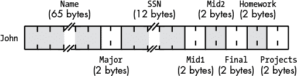

*图 11-1：学生数据结构在内存中的存储*

大多数编程语言允许你通过字段名称而非记录中字段的数字偏移量来引用记录字段（实际上，只有少数低端汇编器要求你通过数字偏移量来引用字段；可以说，这样的汇编器并不真正支持记录）。字段访问的典型语法使用*点操作符*从记录变量中选择字段。假设变量 `John` 来自前面的示例，以下是如何访问该记录中的不同字段：

```

			John.Mid1 = 80;           // C/C++ example
John.Final := 93;         (* Pascal example *)
mov( 75, John.Projects ); // HLA example
```

图 11-1 表明记录的所有字段在内存中按声明顺序排列，通常情况也是如此（尽管从理论上讲，编译器可以自由地将字段放置在内存中的任何位置）。第一个字段通常位于记录中的最低地址，第二个字段位于下一个较高地址，第三个字段跟随第二个字段依次排列，依此类推。

图 11-1 还表明编译器将字段打包到相邻的内存位置中，字段之间没有空隙。虽然这对许多语言来说是正确的，但这肯定不是记录的最常见内存组织方式。出于性能考虑，大多数编译器将记录的字段对齐到适当的内存边界。具体细节因语言、编译器实现和 CPU 而异，但典型的编译器会将字段放置在记录存储区域内一个对该特定字段数据类型“自然”的偏移量上。例如，在 80x86 上，遵循 Intel ABI（应用程序二进制接口）的编译器将单字节对象分配到记录中的任何偏移量，字（word）仅分配在偶数偏移量上，而双字或更大的对象则放置在双字边界上。虽然并非所有 80x86 编译器都支持 Intel ABI，但大多数都支持，这使得记录能够在用不同语言编写的函数和过程之间共享。其他 CPU 制造商为其处理器提供了自己的 ABI，遵循 ABI 的程序可以在运行时与其他遵循相同 ABI 的程序共享二进制数据。

除了将记录的字段对齐到合理的偏移量边界，大多数编译器还确保整个记录的长度是 2、4、8 或 16 字节的倍数。正如你在前几章中看到的，它们通过在记录末尾添加填充字节来实现这一点，从而填满记录的大小。这确保了记录的长度是记录中最大标量（非数组/非记录）对象的倍数。例如，如果一个记录的字段长度分别为 1、2、4 和 8 字节，那么 80x86 编译器通常会填充记录的长度，使其成为 8 的倍数。这样，你可以创建一个记录数组，并确保数组中的每个记录都从内存中的合理地址开始。

尽管一些 CPU 不允许访问内存中不对齐地址的对象，许多编译器仍然允许你禁用记录字段的自动对齐。通常，编译器会提供一个选项，允许你全局禁用此功能。这些编译器中的许多还提供`pragma`、`alignas`或`packed`关键字，让你可以在每个记录的基础上禁用字段对齐。禁用自动字段对齐功能可能会通过消除字段之间（以及记录末尾）的填充字节来节省一些内存——当然，前提是你的 CPU 可以接受字段的不对齐。代价当然是，当程序需要访问内存中不对齐的值时，运行速度可能会稍微变慢。

使用打包记录的一个原因是为了手动控制记录字段的对齐。例如，假设你有几个用两种不同语言编写的函数，并且这两个函数都需要访问记录中的某些数据。进一步假设这两个函数的编译器使用不同的字段对齐算法。像以下这样的记录声明（在 Pascal 中）可能与这两个函数访问记录数据的方式不兼容：

```

			type
    aRecord = record

        (* assume Pascal compiler supports a
        ** byte, word, and dword type
        *)

        bField : byte;
        wField : word;
        dField : dword;

    end; (* record *)
```

这里的问题是，第一个编译器可能使用偏移量 0、2 和 4 分别为`bField`、`wField`和`dField`字段，而第二个编译器可能使用偏移量 0、4 和 8。

然而，假设第一个编译器允许你在`record`关键字之前指定`packed`关键字，这将导致编译器将每个字段紧接着前一个字段存储。尽管使用`packed`关键字并不能使记录与两种函数兼容，但它确实允许你手动向记录声明中添加填充字段，具体如下：

```

			type
    aRecord = packed record
        bField   :byte;  (* Offset 0 *)

        (* add padding to dword align wField *)

        padding0 :array[0..2] of byte;

        wField   :word; (* offset 4 *)

        (* add padding to dword align dField *)

        padding1 :word;

        dField   :dword;  (* offset 8 *)

    end; (* record *)
```

手动添加填充可能会使代码维护变得非常繁琐。然而，如果不兼容的编译器需要共享数据，这是一个值得了解的技巧。有关打包记录的具体细节，请参考你所使用语言的参考手册。

#### 11.1.5 使用记录来提高内存性能

对于那些想写出高质量代码的人来说，记录提供了一个重要的好处：能够控制变量在内存中的位置。这一能力让你可以更好地控制这些变量的缓存使用，从而帮助你编写执行速度更快的代码。

想一想以下的 C 全局/静态变量声明：

```

			int i;
int j = 5;
int cnt = 0;
char a = 'a';
char b;
```

你可能会认为编译器会将这些变量存储在连续的内存位置。然而，很少（如果有的话）有编程语言能保证这一点。C 语言显然没有，并且事实上，像 Microsoft 的 Visual C++ 编译器这样的 C 编译器并不会将这些变量分配在连续的内存位置。考虑一下 Visual C++ 汇编语言输出的前述变量声明：

```

			PUBLIC  j
PUBLIC  cnt
PUBLIC  a
_DATA   SEGMENT
COMM    i:DWORD
_DATA   ENDS
_BSS    SEGMENT
cnt     DD      01H DUP (?)
_BSS    ENDS
_DATA   SEGMENT
COMM    b:BYTE
_DATA   ENDS
_DATA   SEGMENT
j       DD      05H
a       DB      061H
_DATA   ENDS
```

即使你不理解这里所有指令的用途，也可以明显看出 Visual C++ 已经重新排列了内存中的所有变量声明。因此，你不能指望源文件中的相邻声明会在内存中产生相邻的存储单元。实际上，没有任何东西能够阻止编译器将一个或多个变量分配到机器寄存器中。

你可能会想，为什么你需要关注变量在内存中的位置。毕竟，使用命名变量作为内存抽象的主要原因之一，就是避免考虑低级的内存分配策略。然而，有时候，能够控制变量在内存中的位置是很重要的。例如，如果你想最大化程序的性能，你应该尽量将一起访问的变量放置在相邻的内存位置。这样，这些变量会倾向于位于同一缓存行中，访问不在缓存中的变量时，你就不会付出过高的延迟代价。此外，通过将一起使用的变量放置在相邻的内存位置，你将使用更少的缓存行，从而减少缓存抖动。

通常情况下，支持传统记录概念的编程语言会将记录的字段存储在相邻的内存位置；因此，如果你有某种理由将不同的变量放置在相邻的内存位置（以便它们尽可能共享缓存行），将变量放入记录中是一种合理的方法。然而，这里关键的词是*传统*——如果你的语言使用动态记录类型，你就需要采用不同的方法。

#### 11.1.6 使用动态记录类型和数据库

一些动态语言采用动态类型系统，且对象类型可以在运行时发生变化。我们将在本章稍后讨论动态类型，但可以简单地说，如果你的语言使用动态类型的记录结构，那么关于字段在内存中的位置就无法确定了。很有可能这些字段不会位于相邻的内存位置。再者，如果你使用的是动态语言，因未能最大化缓存的利用率而牺牲了些许性能，反倒是你最不需要担心的问题。

动态记录的经典例子是你从数据库引擎中读取的数据。引擎本身没有任何预设（即编译时）的观念来定义数据库记录的结构。相反，数据库本身提供元数据，告诉数据库记录的结构。数据库引擎从数据库中读取这些元数据，利用它来将字段数据组织成一个单一的记录，然后将这些数据返回给数据库应用程序。在动态语言中，实际的字段数据通常分布在内存的不同位置，数据库应用程序间接引用这些数据。

当然，如果你使用的是动态语言，那么你对性能的关注远远大于记录字段在内存中的位置或组织方式。动态语言，如数据库引擎，会执行许多指令来处理元数据（或以其他方式确定数据操作数的类型），因此，在这里丢失几个周期导致缓存抖动不会产生太大影响。有关与动态类型系统相关的开销的更多信息，请参见第 356 页的“变体类型”。

### 11.2 判别联合

判别联合（或简称联合）与记录非常相似。*判别*是用来区分或分隔数量中各项的东西。在判别联合的情况下，它意味着使用不同的字段名来区分给定内存位置的数据类型的不同解释方式。

像记录一样，支持联合的典型语言中，联合也有字段，你可以使用点符号来访问。事实上，在许多语言中，记录和联合之间唯一的语法差异就是使用关键字`union`而不是`record`或`struct`。然而，在语义上，记录和联合之间有很大的区别。在记录中，每个字段相对于记录的基地址都有自己的偏移量，且字段不会重叠。然而，在联合中，所有字段都共享相同的偏移量 0，所有联合的字段都重叠。因此，记录的大小是所有字段大小的总和（可能还包括一些填充字节），而联合的大小是其最大字段的大小（可能还包括一些末尾的填充字节）。

由于联合的字段是重叠的，修改一个字段的值会改变其他所有字段的值。这通常意味着联合字段的使用是互斥的——也就是说，你只能在任何给定时间使用一个字段。因此，联合不像记录那样具有广泛的适用性，但它仍然有许多用途。正如你在本章后面将看到的，你可以使用联合通过重用内存来节省内存，强制数据类型转换，以及创建变体数据类型。大多数情况下，程序使用联合在不同的变量对象之间共享内存，而这些对象的使用永远不会重叠（也就是说，变量的使用是互斥的）。

例如，假设你有一个 32 位的双字变量，并且你发现自己不断地提取出 LO 或 HO 的 16 位字。在大多数高级语言中，这将需要先进行一次 32 位读取，然后执行与操作以屏蔽掉不需要的字。如果这还不够，如果你需要 HO 字，你还需要将结果右移 16 位。使用联合时，你可以将 32 位双字与一个包含两个元素的 16 位字数组叠加，并直接访问这些字。你将在《以其他方式使用联合》一节中看到如何操作，请参阅第 355 页。

#### 11.2.1 在各种语言中声明联合

C/C++、Pascal 和 HLA 语言提供了判别联合类型声明。Java 语言则没有提供等效的联合类型。Swift 有一种特殊版本的 `Enum` 声明，提供变体记录功能，但它并不会将这些声明的成员存储在内存的同一地址上。因此，在本讨论中，我们假设 Swift 不提供联合声明。

##### 11.2.1.1 C/C++ 中的联合声明

这是 C/C++ 中联合声明的示例：

```

			typedef union
{
    unsigned int  i;
    float         r;
    unsigned char c[4];

} unionType;
```

假设正在使用的 C/C++ 编译器为无符号整数分配了 4 个字节，那么 `unionType` 对象的大小将为 4 个字节（因为所有三个字段都是 4 字节对象）。

##### 11.2.1.2 Pascal/Delphi 中的联合声明

Pascal 和 Delphi 使用 *case-variant 记录* 来创建判别联合。case-variant 记录的语法如下：

```

			type
    typeName =
        record

            <<nonvariant/union record fields go here>>

            case tag of
                const1:( field_declaration );
                const2:( field_declaration );
                    .
                    .
                    .
                constn:( field_declaration )

        end;
```

标签项可以是一个类型标识符（例如 `boolean`、`char` 或某个用户定义的类型），也可以是形式为 `identifier:type` 的字段声明。如果它采用后者形式，则标识符将成为记录的另一个字段（而不是变体部分的成员），并具有指定的类型。此外，Pascal 编译器可以生成代码，在应用程序尝试访问任何变体字段（除了标签字段值允许的字段）时引发异常。实际上，几乎没有 Pascal 编译器会进行此检查。尽管如此，请记住，Pascal 语言标准建议编译器 *应该* 执行此检查，因此某些编译器可能会执行。

这是 Pascal 中两种不同 case-variant 记录声明的示例：

```

			type
    noTagRecord=
        record
            someField: integer;
            case boolean of
                true:( i:integer );
                false:( b:array[0..3] of char)
        end; (* record *)

    hasTagRecord=
        record
            case which:0..2 of
                0:( i:integer );
                1:( r:real );
                2:( c:array[0..3] of char )
        end; (* record *)
```

正如你在`hasTagRecord`联合体中看到的，Pascal 风格的变体记录不需要任何常规记录字段。即使没有标签字段，这也是成立的。

##### 11.2.1.3 HLA 中的联合体声明

HLA 同样支持联合体。以下是 HLA 中的典型联合体声明：

```

			type
    unionType:
        union
            i: int32;
            r: real32;
            c: char[4];
        endunion;
```

#### 11.2.2 将联合体存储在内存中

记住，联合体和记录体之间的一个重要区别是：记录体为每个字段分配不同偏移位置的存储，而联合体则将每个字段叠加在内存中的相同偏移位置。例如，考虑以下 HLA 的记录和联合体声明：

```

			type
    numericRec:
        record
            i: int32;
            u: uns32;
            r: real64;
        endrecord;

    numericUnion:
        union
            i: int32;
            u: uns32;
            r: real64;
        endunion;
```

如果你声明一个变量，例如`n`，类型为`numericRec`，你可以像访问`numericUnion`类型一样，访问字段`n.i`、`n.u`和`n.r`。然而，`numericRec`对象的大小为 16 字节，因为记录包含两个双字字段和一个四字字段（`real64`）。然而，`numericUnion`变量的大小只有 8 字节。图 11-2 显示了记录和联合体中`i`、`u`和`r`字段的内存排列。

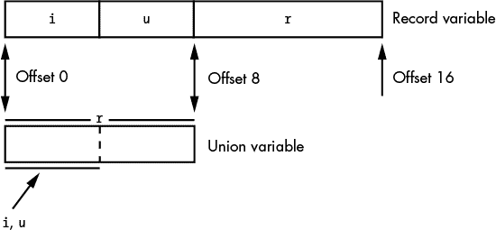

*图 11-2：联合体与记录变量的布局*

#### 11.2.3 以其他方式使用联合体

除了节省内存，程序员还经常使用联合体在代码中创建别名。*别名*是同一内存对象的不同名称。尽管别名往往会引起程序中的困惑，应当谨慎使用，但有时使用它们是方便的。例如，在程序的某些部分，你可能需要不断地使用类型强制转换来引用某个特定对象。为了避免这种情况，你可以使用一个联合体变量，其中每个字段代表你想要为该对象使用的不同类型。考虑以下 HLA 代码片段：

```

			type
    CharOrUns:
        union
            c:char;
            u:uns32;
        endunion;

static
    v:CharOrUns;
```

使用这样的声明，你可以通过访问`v.u`来操作`uns32`对象。如果在某个时刻，你需要将此`uns32`变量的低字节视为字符，只需访问`v.c`变量，如下所示：

```

			mov( eax, v.u );
stdout.put( "v, as a character, is '", v.c, "'" nl );
```

另一个常见的做法是使用联合体将一个较大的对象拆解为其组成字节。考虑以下 C/C++代码片段：

```

			typedef union
{
    unsigned int u;
    unsigned char bytes[4];
} asBytes;

asBytes composite;
        .
        .
        .
    composite.u = 1234567890;
    printf
    (
        "HO byte of composite.u is %u, LO byte is %u\n",
        composite.bytes[3],
        composite.bytes[0]
    );
```

尽管这样组合和拆解数据类型是一个有时非常有用的技巧，但请记住，这段代码并不具有可移植性。多字节对象的高字节（HO）和低字节（LO）在大端和小端机器上的地址是不同的。因此，这段代码在小端机器上可以正常工作，但在大端 CPU 上则无法正确显示字节。每次使用联合体来拆解更大的对象时，你都应该意识到这个限制。不过，这个技巧通常比使用左移、右移和与操作要高效得多，所以你会经常看到它的使用。

### 11.3 变体类型

变体对象具有*动态*类型——即，对象的类型可以在运行时变化。这使得程序员在设计程序时不必决定数据类型，并且允许最终用户在程序运行时输入任何他们喜欢的数据。用动态类型语言编写的程序通常比用传统静态类型语言编写的程序更加紧凑。这使得动态类型语言在快速原型开发、解释型语言和高级语言中非常受欢迎。一些主流语言（包括 Visual Basic 和 Delphi）也支持变体类型。在本节中，我们将讨论编译器如何实现变体类型，并讨论与之相关的效率成本。

为了实现一个变体类型，大多数语言使用联合体来为变体对象支持的所有不同类型预留存储空间。这意味着变体对象将至少消耗它所支持的最大原始数据类型的空间。除了保存其值所需的存储空间外，变体对象还需要存储空间来跟踪其当前类型。如果语言允许变体假定数组类型，可能还需要更多存储空间来指定数组中有多少个元素（或者如果语言支持多维变体数组，则指定每个维度的边界）。最重要的是，变体消耗了相当多的内存，即使实际数据只占一个字节。

也许最好的方式来说明变体数据类型是如何工作的，就是手动实现一个。考虑以下 Delphi 的 case-variant 记录声明：

```

			type
    dataTypes =
           (
               vBoolean, paBoolean, vChar, paChar,
               vInteger, paInteger, vReal, paReal,
               vString, paString
           );

       varType =
           record
               elements : integer;
               case theType: dataTypes of
                   vBoolean:  ( b:boolean );
                   paBoolean: ( pb:array[0..0] of ^boolean );
                   vChar:     ( c:char );
                   paChar:    ( pc:array [0..0] of ^char );
                   vInteger:  ( i:integer );
                   paInteger: ( pi:array[0..0] of ^integer );
                   vReal:     ( r:real );
                   paReal:    ( pr:array[0..0] of ^real );
                   vString:   ( s:string[255] );
                   paString:  ( ps:array[0..0] of ^string[255] )
          end;
```

在这个记录中，当对象是一个一维数组时，元素将包含数组中元素的数量（此数据结构不支持多维数组）。另一方面，如果对象是标量变量，则元素值将不相关。`theType`字段指定对象的当前类型。如果该字段包含枚举常量之一`vBoolean`、`vChar`、`vInteger`、`vReal`或`vString`，则对象是标量变量；如果它包含常量`paBoolean`、`paChar`、`paInteger`、`paReal`或`paString`之一，则对象是指定类型的一维数组。

Pascal 记录中的 case-variant 部分的字段保存变体的值（如果它是标量对象），或者如果变体是数组对象，则保存指向对象数组的指针。从技术上讲，Pascal 要求你在声明中指定数组的边界。但幸运的是，Delphi 允许你关闭边界检查（并且还允许你为任意大小的数组分配内存），因此在这个例子中有虚拟的数组边界。

操作两个具有相同类型的变体对象是很容易的。例如，假设你想将两个变体值相加。首先，你需要确定这两个对象的当前类型，以及加法操作是否对这些数据类型有意义。^(4) 一旦你决定加法操作是合理的，就可以很容易地使用基于两个变体类型标签字段的`case`（或`switch`）语句：

```

			// Handle the addition operation:

// Load variable theType with either left.theType
// or right.theType (which, presumably, contain
// the same value at this point).

case( theType ) of

    vBoolean: writeln( "Cannot add two Boolean values!" );
    vChar: writeln( "Cannot add two character values!" );
    vString: writeln( "Cannot add two string values!" );
    vInteger: intResult := left.vInteger + right.vInteger;
    vReal: realResult := left.vReal + right.vReal;
    paBoolean: writeln( "Cannot add two Boolean arrays!" );
    paChar: writeln( "Cannot add two character arrays!" );
    paInteger: writeln( "Cannot add two integer arrays!" );
    paReal: writeln( "Cannot add two real arrays!" );
    paString: writeln( "Cannot add two Boolean arrays!" );

end;
```

如果左右操作数类型不同，那么操作会变得稍微复杂一些。一些混合类型操作是合法的。例如，将整数操作数和实数操作数相加是合理的（在大多数语言中，它会产生实数类型的结果）。其他操作可能只有在操作数的值可以相加时才是合法的。例如，如果字符串恰好包含一串可以在加法之前转换为整数的数字字符，那么将字符串和整数相加是合理的（对于字符串和实数操作数也一样）。这里需要的是一个二维的`case`/`switch`语句。不幸的是，除了汇编语言外，你不会找到这种结构。^(5) 但是，你可以通过嵌套`case`/`switch`语句来轻松模拟这种结构：

```

			case( left.theType ) of

    vInteger:
        case( right.theType ) of
            vInteger:
                (* code to handle integer + integer operands *)
            vReal:
                (* code to handle integer + real operands *)
            vBoolean:
                (* code to handle integer + boolean operands *)
            vChar:
                (* code to handle integer + char operands *)
            vString:
                (* code to handle integer + string operands *)
            paInteger:
                (* code to handle integer + intArray operands *)
            paReal:
                (* code to handle integer + realArray operands *)
            paBoolean:
                (* code to handle integer + booleanArray operands *)
            paChar:
                (* code to handle integer + charArray operands *)
            paString:
                (* code to handle integer + stringArray operands *)
        end;

    vReal:
        case( right.theType ) of
            (* cases for each of the right operand types
                REAL + type *)
        end;

    Boolean:
        case( right.theType ) of
            (* cases for each of the right operand types:
                BOOLEAN + type *)
        end;

    vChar:
        case( right.theType ) of
            (* cases for each of the right operand types:
                CHAR + type *)
        end;

    vString:
        case( right.theType ) of
            (* cases for each of the right operand types:
                STRING + type *)
        end;

    paInteger:
        case( right.theType ) of
            (* cases for each of the right operand types:
                intArray + type *)
        end;

    paReal:
        case( right.theType ) of
            (* cases for each of the right operand types:
                realArray + type *)
        end;

    paBoolean:
        case( right.theType ) of
            (* cases for each of the right operand types:
                booleanArray + type *)
        end;

    paChar:
        case( right.theType ) of
            (* cases for each of the right operand types:
                charArray + type *)
        end;

    paString:
        case( right.theType ) of
            (* cases for each of the right operand types:
                stringArray + type *)
        end;

end;
```

一旦你扩展了这些注释中提到的所有代码，你将会有相当多的语句。这只是为了一个运算符！显然，实施所有基本的算术、字符串、字符和布尔操作需要相当多的工作——并且在每次需要将两个变体值相加时，在线展开这段代码是不可行的。通常，你会写一个像`vAdd()`这样的函数，接受两个变体参数并返回一个变体结果（如果操作数相加不合法，则引发某种异常）。

这里的要点不是变体加法的代码很长——真正的问题是性能。期望一个变体加法操作需要几十甚至上百条机器指令来完成，这一点一点也不不合理。相比之下，两个整数或浮点数值相加只需要两到三条机器指令。因此，你可以预计涉及变体对象的操作将比标准操作慢大约一个到两个数量级。事实上，这正是“无类型”语言（通常是非常高级的语言）运行缓慢的主要原因之一。当你真正需要变体类型时，它的性能往往与你为避免使用它所写的替代代码一样好（甚至更好）。然而，如果你使用变体对象来存储那些在编写程序时就知道类型的值，那么由于没有使用类型化对象，你将付出沉重的性能代价。

在面向对象的语言如 C++、Java、Swift 和 Delphi（Object Pascal）中，有一个更好的变体计算解决方案：继承和多态。使用 `union`/`switch` 语句版本的一个大问题是，扩展变体类型时需要添加新类型，这可能非常麻烦。例如，假设你想添加一个新的复合数据类型来支持复数。你必须找到你写的每个函数（通常每个运算符一个），并在 `switch` 语句中添加一个新的 `case`。这可能会导致维护上的噩梦（尤其是当你无法访问原始源代码时）。然而，使用对象时，你可以创建一个新的类（比如 `ComplexNumber`），它重写现有的基类（可能是 `Numeric`），而无需修改任何现有的代码（对于其他数字类型和运算）。有关此方法的更多信息，请参见 *Write Great Code, Volume 4: Designing Great Code*。

### 11.4 命名空间

随着你的程序变得越来越大，特别是当这些大型程序使用第三方软件库来减少开发时间时，源文件中出现名称冲突的可能性也会越来越高。名称冲突发生在你想在程序的某一部分使用一个特定的标识符时，但该名称已经在其他地方被使用（例如，在你使用的一个库中）。在一个非常大的项目中，你可能会想出一个新的名称来解决命名冲突，结果却发现新名称也已经被使用。软件工程师称这种情况为 *命名空间污染*。就像环境污染一样，当污染小而局部时，问题容易忽视。然而，随着程序变得越来越大，处理“所有好的标识符都已经被占用”的问题变得越来越具有挑战性。

初看起来，这个问题可能显得有些夸大；毕竟，程序员总能想到一个不同的名称。然而，编写优质代码的程序员往往会遵循某些命名约定，以确保他们的源代码一致且易于阅读（我将在 *Write Great Code, Volume 5: Great Coding* 中回到这个话题）。不断想出新的名称，即使它们并不那么糟糕，往往会导致源代码中的不一致性，使程序更难阅读。如果你能够随心所欲地为标识符选择名称，而不必担心与其他代码或库冲突，那将是多么美好。命名空间应运而生。

*命名空间* 是一种机制，允许你将一组标识符与命名空间标识符关联。在许多方面，命名空间就像是记录声明。事实上，在不直接支持命名空间的语言中，你可以使用 `record`（或 `struct`）声明作为一种简单的命名空间（有一些主要的限制）。例如，考虑以下 Pascal 变量声明：

```

			var
    myNameSpace:
        record
            i: integer;
            j: integer;
            name: string[64];
            date: string[10];
            grayCode: integer;
        end;

    yourNameSpace:
        record
            i: integer;
            j: integer;
            profits: real;
            weekday: integer;
        end;
```

如你所见，这两个记录中的 `i` 和 `j` 字段是不同的变量。由于程序必须使用记录变量名来限定这两个字段名称，因此永远不会发生命名冲突。也就是说，你使用以下名称来引用这些变量：

```

			myNameSpace.i, myNameSpace.j,
yourNameSpace.i, yourNameSpace.j
```

作为字段前缀的记录变量唯一标识了这些字段名称中的每一个。对于曾经编写过使用记录或结构体代码的人来说，这是显而易见的。因此，在不支持命名空间的语言中，你可以使用记录（或类）来代替它们。

然而，使用记录或结构体创建命名空间有一个主要问题：许多语言只允许在记录中声明变量。命名空间声明（如 C++ 和 HLA 中可用的那种）专门允许你包含其他类型的对象。例如，在 HLA 中，命名空间声明具有以下形式：

```

			namespace nsIdentifier;

    << constant, type, variable, procedure,
            and other declarations >>

end nsIdentifier;
```

类声明（如果在你选择的语言中可用）可以克服一些这些问题。至少，大多数语言允许在类中声明过程或函数，但许多语言也允许常量和类型声明。

命名空间本身就是一个声明部分。特别地，它们不必放在 `var` 或 `static`（或任何其他）部分中。你可以在命名空间内创建常量、类型、变量、静态对象、过程等。

在 HLA 中访问命名空间对象时，使用记录、类和联合体所使用的熟悉的点符号。如果要访问 C++ 命名空间中的名称，则使用 `::` 操作符。

只要命名空间标识符是唯一的，并且命名空间内的所有字段都是该命名空间唯一的，你就不会遇到任何问题。通过仔细将项目划分为不同的命名空间，你可以轻松避免由于命名空间污染而发生的大部分问题。

命名空间的另一个有趣的方面是它们是可扩展的。例如，考虑以下 C++ 中的声明：

```

			namespace aNS
{
    int i;
    int j;
}

int i;  // Outside the namespace, so this is unique.
int j;  // ditto.
namespace aNS
{
    int k;
}
```

这个示例代码是完全合法的。`aNS` 的第二个声明与第一个声明不冲突：它扩展了 `aNS` 命名空间，包含了标识符 `aNS::k` 以及 `aNS::i` 和 `aNS::j`。这个特性在你想扩展一组库例程和头文件时非常有用，而无需修改原始库的头文件（假设库的名称都出现在命名空间中）。

从实现的角度来看，命名空间和出现在命名空间外的声明集之间真的没有区别。编译器通常以几乎相同的方式处理这两种类型的声明，唯一的区别是程序会使用命名空间的标识符来为命名空间内的所有对象加上前缀。

### 11.5 类和对象

*类* 数据类型是现代面向对象编程（OOP）的基石。在大多数 OOP 语言中，类与记录或结构密切相关。然而，与记录（在大多数语言中具有惊人一致的实现）不同，类的实现往往有所不同。然而，许多现代 OOP 语言通过类似的方式实现其结果，因此本节展示了来自 C++、Java、Swift、HLA 和 Delphi（Object Pascal）的一些具体示例。其他语言的用户将发现他们的语言也有类似的工作方式。

#### 11.5.1 类与对象

许多程序员混淆了*类*和*对象*这两个术语。类是一种数据类型；它是编译器根据类的字段组织内存的模板。对象是类的实例化——也就是说，对象是某个类类型的变量，内存已分配用于存储与类字段相关的数据。对于给定的类，只有一个类定义。然而，您可以有该类类型的多个对象（变量）。

#### 11.5.2 C++ 中的简单类声明

在 C++ 中，类和结构在语法和语义上是相似的。实际上，它们之间只有一个语法上的区别：使用 `class` 关键字和使用 `struct` 关键字。考虑以下两个在 C++ 中有效的类型声明：

```

			struct student
{
        // Room for a 64-character zero-terminated string:

        char Name[65];

        // Typically a 2-byte integer in C/C++:

        short Major;

        // Room for an 11-character zero-terminated string:

        char SSN[12];

        // Each of the following is typically a 2-byte integer

        short Mid1;
        short Mid2;
        short Final;
        short Homework;
        short Projects;
};

class myClass
{
public:

// Room for a 64-character zero-terminated string:

        char Name[65];

        // Typically a 2-byte integer in C/C++:

        short Major;

        // Room for an 11-character zero-terminated string:

        char SSN[12];

        // Each of the following is typically a 2-byte integer

        short Mid1;
        short Mid2;
        short Final;
        short Homework;
        short Projects;
};
```

尽管这两种数据结构包含相同的字段，且你将以相同的方式访问这些字段，但它们的内存实现略有不同。结构体的典型内存布局出现在 图 11-3 中，可以与类的内存布局（见 图 11-4）进行比较。（图 11-3 与 图 11-1 相同，但此处为了方便与 图 11-4 进行比较而再次出现。）

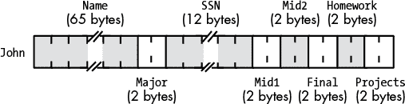

*图 11-3：学生结构体在内存中的存储*

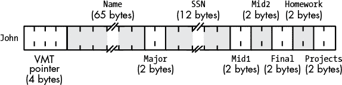

*图 11-4：学生类在内存中的存储*

*VMT 指针* 是一个字段，如果类包含任何类成员函数（即 *方法*），该字段会出现。某些 C++ 编译器如果没有成员函数，则不会生成 VMT 指针字段，这种情况下，`class` 和 `struct` 对象在内存中的布局是相同的。

**注意**

VMT *代表* 虚拟方法表，*将在“虚拟方法表”一节中进一步讨论，见 第 367 页。*

虽然 C++ 类声明可能仅包含数据字段，但类通常还包含成员函数定义以及数据成员。在 `myClass` 示例中，可能有以下成员函数：

```

			class myClass
{
public:

// Room for a 64-character zero-terminated string:

        char Name[65];

        // Typically a 2-byte integer in C/C++:

        short Major;

        // Room for an 11-character zero-terminated string:

        char SSN[12];

        // Each of the following is typically a 2-byte integer

        short Mid1;
        short Mid2;
        short Final;
        short Homework;
        short Projects;

        // Member functions:

        double computeGrade( void );
        double testAverage( void );
};
```

`computeGrade()` 函数可能计算课程的总成绩（基于期中考试、期末考试、作业和项目分数的相对权重）。`testAverage()` 函数可能返回所有测试分数的平均值。

#### 11.5.3 C# 和 Java 中的类声明

C# 和 Java 类与 C/C++ 类声明非常相似。以下是一个 C# 类声明示例（也适用于 Java）：

```

			class student
{
        // Room for a 64-character zero-terminated string:

        public char[] Name;

        // Typically a 2-byte integer in C/C++:

        public short Major;

        // Room for an 11-character zero terminated string:

        public char[] SSN;

        public short Mid1;
        public short Mid2;
        public short Final;
        public short Homework;
        public short Projects;

        public double computeGrade()
        {
            return Mid1 * 0.15 + Mid2 * 0.15 + Final *
                   0.2 + Homework * 0.25 + Projects * 0.25;
        }
        public double testAverage()
        {
            return (Mid1 + Mid2 + Final) / 3.0;
        }
    };
```

#### 11.5.4 Delphi (Object Pascal) 中的类声明

Delphi (Object Pascal) 类看起来与 Pascal 记录非常相似。类使用 `class` 关键字，而不是 `record`，并且你可以在类中包含函数原型声明。

```

			type
  student =
    class
      Name:     string [64];
      Major:    smallint;    // 2-byte integer in Delphi
      SSN:      string[11];
      Mid1:     smallint;
      Mid2:     smallint;
      Final:    smallint;
      Homework: smallint;
      Projects: smallint;

      function computeGrade:real;
      function testAverage:real;
  end;
```

#### 11.5.5 HLA 中的类声明

HLA 类看起来与 HLA 记录非常相似。类使用 `class` 关键字，而不是 `record`，并且你可以在类中包含函数（方法）原型声明。

```

			type
    student:
        class
          var
            sName:    char[65];
            Major:    int16;
            SSN:      char[12];
            Mid1:     int16;
            Mid2:     int16;
            Final:    int16;
            Homework: int16;
            Projects: int16;

            method computeGrade;
            method testAverage;

        endclass;
```

#### 11.5.6 虚拟方法表

如你在图 11-3 和 11-4 中看到的，类定义与结构定义的区别在于前者包含了 VMT 字段。VMT，代表*虚拟方法表*，是指向对象类中所有成员函数或*方法*的指针数组。虚拟方法（在 C++ 中是*虚拟成员函数*）是你在类中声明为字段的特殊类相关函数。在当前的学生示例中，类实际上没有任何虚拟方法，因此大多数 C++ 编译器会去除 VMT 字段，但一些面向对象编程语言仍会在类中为 VMT 指针分配存储。

这是一个实际具有虚拟成员函数的小型 C++ 类，因此它也具有 VMT：

```

			class myclass
{
    public:
        int a;
        int b;
        virtual int f( void );
};
```

当 C++ 调用标准函数时，它直接调用该函数。虚拟成员函数则另当别论，正如你在图 11-5 中看到的那样。

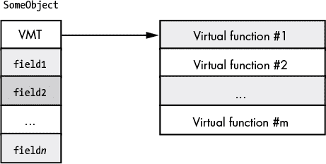

*图 11-5：C++ 中的虚拟方法表*

调用虚拟成员函数需要*两个*间接访问。首先，程序需要从类对象中获取 VMT 指针，并利用该指针间接获取 VMT 中特定虚拟函数的地址。然后，程序必须通过从 VMT 检索到的指针，间接调用虚拟成员函数。作为例子，请考虑以下 C++ 函数：

```

			#include <stdlib.h>

// A C++ class with two trivial
// member functions (so the VMT
// will have two entries).

class myclass
{
    public:
        int a;
        int b;
        virtual int f( void );
        virtual int g( void );
};

// Some trivial member functions.
// We're really only interested
// in looking at the calls, so
// these functions will suffice
// for now.

int myclass::f( void )
{
    return b;
}

int myclass::g( void )
{
    return a;
}

// A main function that creates
// a new instance of myclass and
// then calls the two member functions

int main( int argc, char **argv )
{
    myclass *c;

    // Create a new object:

    c = new myclass;

    // Call both member functions:

    c->a = c->f() + c->g();
    return 0;

}
```

这是 Visual C++ 生成的相应 x86-64 汇编代码：

```

			; Here is the VMT for myclass. It contains
; three entries:
; a pointer to the constructor for myclass,
; a pointer to the myclass::f member function,
; and a pointer to the myclass::g member function.

CONST   SEGMENT
??_7myclass@@6B@ DQ FLAT:??_R4myclass@@6B@ ; myclass::`vftable'
        DQ      FLAT:?f@myclass@@UEAAHXZ
        DQ      FLAT:?g@myclass@@UEAAHXZ
CONST   ENDS
;
    .
    .
    .
;
; Allocate storage for a new instance of myclass:
; 16 = two 4-byte ints plus 8-byte VMT pointer
        mov     ecx, 16

        call    ??2@YAPEAX_K@Z             ; operator new
        mov     rdi, rax                   ; Save pointer to allocated object
        test    rax, rax                   ; Did NEW FAIL (returning NULL)?
        je      SHORT $LN3@main

; Initialize VMT field with the address of the VMT:

        lea     rax, OFFSET FLAT:??_7myclass@@6B@
        mov     QWORD PTR [rdi], rax
        jmp     SHORT $LN4@main
$LN3@main:
        xor     edi, edi                   ; For failure, put NULL in EDI

; At this point, RDI contains the "THIS" pointer
; that refers to the object in question. In this
; particular code sequence, "THIS" is the address
; of the object whose storage we allocated above.

; Get the VMT into RAX (first indirect access
; needed to make a virtual member function call)

        mov     rax, QWORD PTR [rdi]

        mov     rcx, rdi                   ; Pass THIS in RCX
        call    QWORD PTR [rax+8]          ; Call c->f()
        mov     ebx, eax                   ; Save function result

        mov     rdx, QWORD PTR [rdi]       ; Load VMT into RDX
        mov     rcx, rdi                   ; Pass THIS in RCX
        call    QWORD PTR [rdx]            ; Call c->g()

; Compute sum of function results:

        add     ebx, eax
        mov     DWORD PTR [rdi+8], ebx     ; Save sum in c->a
```

这个例子充分展示了为什么面向对象程序通常比标准的过程式程序运行稍慢：调用虚拟方法时的额外间接访问。C++ 尝试通过提供*静态成员函数*来解决这一效率问题，但它们失去了虚拟成员函数带来的许多面向对象编程的好处。

#### 11.5.7 抽象方法

一些语言（例如 C++）允许在类中声明*抽象方法*。抽象方法声明告诉编译器，你不会提供该方法的实际代码。相反，你承诺某个派生类会提供该方法的实现。以下是具有抽象方法的`myclass`版本：

```

			class myclass
{
public:
    int a;
    int b;
    virtual int f(void);
    virtual int g(void);
    virtual int h(void) = 0;
};
```

为什么会有这种奇怪的语法？将 `0` 赋值给虚函数似乎没有太大意义。为什么不直接使用像大多数其他语言那样的 `abstract` 关键字（而不是 `virtual`）呢？这些问题很有价值。答案可能与 `0`（`NULL` 指针）被放置在抽象函数的 VMT 条目中有很大关系。在现代版本的 C++ 中，编译器实现者通常将某个函数的地址放在这里，该函数会生成一个合适的运行时消息（例如 `不能调用抽象方法`），而不是放置 `NULL` 指针。以下代码片段展示了 Visual C++ 中该版本 `myclass` 的 VMT：

```

			CONST   SEGMENT
??_7myclass@@6B@ DQ FLAT:??_R4myclass@@6B@              ; myclass::`vftable'
        DQ      FLAT:?f@myclass@@UEAAHXZ
        DQ      FLAT:?g@myclass@@UEAAHXZ
        DQ      FLAT:_purecall
CONST   ENDS
```

`_purecall` 条目对应于抽象函数 `h()`。这是处理非法调用抽象函数的子程序的名称。当你重写一个抽象函数时，C++ 编译器会将 VMT 中指向 `_purecall` 函数的指针替换为重写函数的地址（就像它会替换任何被重写函数的地址一样）。

#### 11.5.8 共享 VMT

对于一个给定的类，内存中只有一份 VMT 副本。它是一个静态对象，因此所有该类类型的对象共享相同的 VMT。这是合理的，因为所有同类类型的对象具有完全相同的成员函数（参见 图 11-6）。

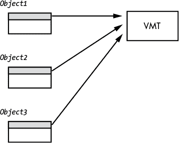

*图 11-6：共享相同 VMT 的对象（注意对象都是相同的类类型）*

由于 VMT 中的地址在程序执行过程中永远不会改变，大多数语言将 VMT 放置在内存中的常量（只读保护）部分。在前面的例子中，编译器将 `myclass` 的 VMT 放置在 `CONST` 段。

#### 11.5.9 类中的继承

继承是面向对象编程的基本概念之一。基本思想是一个类继承或复制某个已有类的所有字段，然后可能会扩展新类数据类型中的字段数量。例如，假设你创建了一个描述平面（二维）空间中点的数据类型 `point`。该点的类可能如下所示：

```

			class point
{
    public:
        float x;
        float y;

        virtual float distance( void );
};
```

`distance()` 成员函数可能会计算从原点（0,0）到由对象的 (`x`,`y`) 字段指定的坐标的距离。

这是该成员函数的典型实现：

```

			float point::distance( void )
{
    return sqrt( x*x + y*y );
}
```

继承允许你通过添加新的字段或替换现有字段来扩展一个已有的类。例如，假设你想将二维点的定义扩展到第三个空间维度。你可以通过以下 C++ 类定义轻松实现这一点：

```

			class point3D :public point
{
    public:
        float z;

        virtual void rotate( float angle1, float angle2 );
};
```

`point3D` 类继承了 `x` 和 `y` 字段，以及 `distance()` 成员函数。（当然，`distance()` 并没有计算三维空间中点的正确结果，不过稍后我会讨论这个问题。）我所说的“继承”是指，`point3D` 对象将它们的 `x` 和 `y` 字段定位在与 `point` 对象相同的偏移位置（见 图 11-7）。

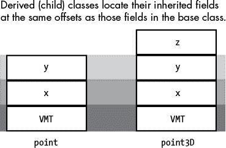

*图 11-7：类中的继承*

正如你可能注意到的，`point3D` 类实际上添加了两个项——一个新的数据字段 `z` 和一个新的成员函数 `rotate()`。在 图 11-7 中，你可以看到添加 `rotate()` 虚拟成员函数并没有对 `point3D` 对象的布局产生任何影响。这是因为虚拟成员函数的地址出现在 VMT 中，而不是对象本身中。虽然 `point` 和 `point3D` 都包含一个名为 `VMT` 的字段，但这些字段并不指向内存中的同一表格。每个类都有其独特的 VMT，该 VMT 如前所述，由指向类的所有成员函数（包括继承或显式声明的）的指针数组组成（见 图 11-8）。

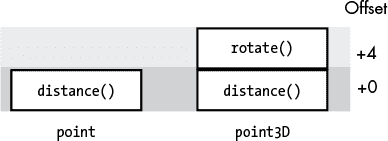

*图 11-8：继承类的 VMT（假设为 32 位指针）*

对于给定的类，所有对象共享相同的 VMT，但对于不同类的对象则不成立。由于 `point` 和 `point3D` 是不同的类，它们的对象的 VMT 字段将在内存中指向不同的 VMT。（见 图 11-9）。

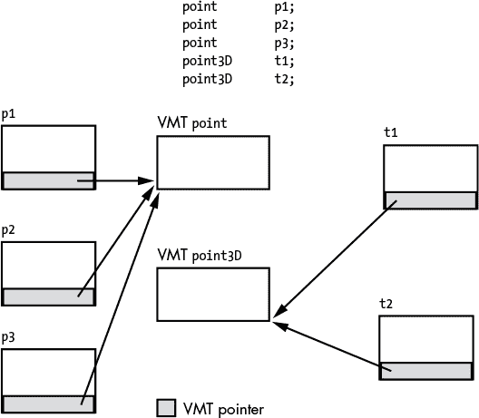

*图 11-9：VMT 访问*

到目前为止，`point3D` 定义的一个问题是，它从 `point` 类继承了 `distance()` 函数。默认情况下，如果一个类从另一个类继承了成员函数，则对应于这些继承函数的 VMT 条目将指向基类相关函数的地址。如果你有一个 `point3D` 类型的对象指针变量，比如 `p3D`，并调用成员函数 `p3D->distance()`，你将得不到正确的结果。因为 `point3D` 从 `point` 类继承了 `distance()` 函数，`p3->distance()` 会计算到 (`x,y,z`) 在二维平面上的投影的距离，而不是正确的三维平面上的值。在 C++ 中，你可以通过*重载*继承的函数，并编写一个新的、特定于 `point3D` 的成员函数来解决这个问题，代码如下：

```

			class point3D :public point
{
    public:
        float z;

        virtual float distance( void );
        virtual void rotate( float angle1, float angle2 );
};
float point3D::distance( void )
{
    return sqrt( x*x + y*y + z*z );
}
```

创建一个重载的成员函数不会改变类的数据布局或`point3D` VMT 的布局。这个函数引发的唯一变化是，C++ 编译器将 `distance()` 条目的地址初始化为 `point3D::distance()` 函数的地址，而不是 `point::distance()` 函数的地址。

#### 11.5.10 类中的多态性

除了继承和重载外，*多态性*是面向对象编程的另一个基石。多态性，字面意思是“多面性”（或者翻译得更好一点是“多种形式”或“多种形状”），描述的是在你的程序中，像`x->distance()`这样的单一函数调用如何最终调用不同的函数（在上一节的例子中，这可能是`point::distance()`或者`point3D::distance()`函数）。之所以能够实现这一点，是因为 C++在处理派生类（继承类）时，会在一定程度上放宽类型检查。

我们来看一个例子。通常情况下，如果你尝试执行以下操作，C++编译器会报错：

```

			float f;
int *i;
    .
    .
    .
i = &f; // C++ isn't going to allow this.
```

C++不允许将某个对象的地址赋值给基类型与对象类型完全不匹配的指针——但有一个主要的例外。C++放宽了这一限制，只要指针的基类型与对象的类型匹配*或是对象类型的祖先*（祖先类是通过继承直接或间接派生出其他类类型的类），那么就可以将某个对象的地址赋值给指针。这意味着以下代码是合法的：

```

			point *p;
point3D *t;
point *generic;

    p = new point;
    t = new point3D;
        .
        .
        .
    generic = t;
```

如果你在想这如何可能是合法的，可以再看看图 11-7。如果`generic`的基类型是`point`，那么 C++编译器将允许访问对象中偏移量为 0 的 VMT，偏移量为 4（在 64 位机器上为 8）的`x`字段，以及偏移量为 8（16）的`y`字段。同样，任何尝试调用`distance()`成员函数的操作都会访问指向对象 VMT 字段的 VMT 中的函数指针。如果`generic`指向`point`类型的对象，那么所有这些要求都得到满足。如果`generic`指向`point`的任何派生类（即，任何继承自`point`字段的类），也是如此。派生类中（`point3D`）的额外字段无法通过`generic`指针访问，但这是预期的，因为`generic`的基类是`point`。

然而，需要注意的一个关键点是，当你调用`distance()`成员函数时，实际上是调用了由`point3D` VMT 指向的函数，而不是由`point` VMT 指向的函数。这一事实是 C++等面向对象编程语言多态性的基础。编译器生成的代码与`generic`包含`point`类型对象地址时生成的代码完全相同。所有的“魔法”发生的原因是，编译器允许程序员将`point3D`对象的地址加载到`generic`中。

#### 11.5.11 多重继承（在 C++中）

C++是为数不多的支持*多重继承*的现代编程语言之一，允许一个类从多个类继承数据和成员函数。考虑以下 C++代码片段：

```

			class a
{
    public:
        int i;
        virtual void setI(int i) { this->i = i; }
};

class b
{
    public:
        int j;
        virtual void setJ(int j) { this->j = j; }
};

class c : public a, public b
{
    public:
        int k;
        virtual void setK(int k) { this->k = k; }
};
```

在这个例子中，`c` 类继承了 `a` 和 `b` 类的所有信息。在内存中，典型的 C++ 编译器会创建如图 11-10 所示的对象。

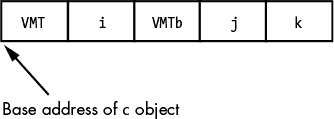

*图 11-10：多重继承内存布局*

VMT 指针条目指向一个典型的 VMT，包含了 `setI()`、`setJ()` 和 `setK()` 方法的地址，如图 11-11 所示。如果你调用 `setI()` 方法，编译器将生成代码，将 `this` 指针加载为对象中 VMT 指针条目的地址（如图 11-10 所示的 `c` 对象的基地址）。进入 `setI()` 方法时，系统认为 `this` 指向的是一个类型为 `a` 的对象。特别地，`this`.`VMT` 字段指向一个 VMT，其第一个（对于类型 `a` 来说是唯一的）条目是 `setI()` 方法的地址。同样地，在内存中偏移量为 (`this+8`) 的位置（由于 VMT 指针为 8 字节，假设使用 64 位指针），`setI()` 方法将找到 `i` 数据值。对于 `setI()` 来说，`this` 指向的是一个类型为 `a` 的类对象（尽管它实际上指向的是一个类型为 `c` 的对象）。

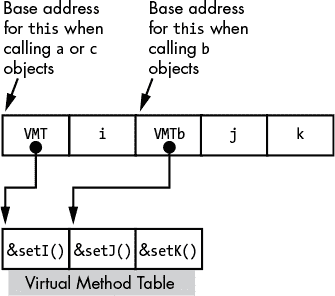

*图 11-11：多重继承中的 `this` 值*

当你调用 `setK()` 方法时，系统也会传递 `c` 对象的基地址。当然，`setK()` 方法期望的是一个类型为 `c` 的对象，并且 `this` 正指向一个类型为 `c` 的对象，因此对象中的所有偏移量都正如 `setK()` 所期望的那样。请注意，`c` 类型的对象（以及 `c` 类中的方法）通常会忽略 `c` 对象中的 `VMT2` 指针字段。

问题出现在程序尝试调用`setJ()`方法时。因为`setJ()`属于类`b`，它期望`this`指针指向一个 VMT 指针，该指针指向类`b`的 VMT。它还期望在偏移量（`this+8`）处找到数据字段`j`。如果我们将`c`对象的`this`指针传递给`setJ()`，访问（`this+8`）将引用数据字段`i`，而不是`j`。此外，如果类`b`的方法调用了类`b`中的另一个方法（例如`setJ()`递归调用自身），那么 VMT 指针将不正确——它指向一个 VMT，其中`setI()`的指针在偏移量 0，而类`b`期望它指向一个 VMT，其中`setJ()`的指针在偏移量 0。为了解决这个问题，典型的 C++编译器会在`c`对象中的`j`数据字段之前插入一个额外的 VMT 指针。它会初始化这个第二个 VMT 字段，指向`c` VMT 中类`b`方法指针开始的位置（见图 11-11）。当调用类`b`中的方法时，编译器会生成代码，用这个第二个 VMT 指针的地址初始化`this`指针（而不是指向内存中`c`类型对象的开头）。现在，当进入类`b`的方法——比如`setJ()`时——`this`将指向类`b`的一个合法 VMT 指针，而`j`数据字段将在偏移量（`this+8`）处出现，这是类`b`方法所期望的。

### 11.6 协议和接口

Java 和 Swift 不支持多重继承，因为它存在一些逻辑问题。经典的例子是“钻石格”数据结构。这种情况发生在两个类（比如`b`和`c`）都从同一个类（比如`a`）继承信息，然后第四个类（比如`d`）从`b`和`c`继承。结果，`d`从`a`继承了两次数据——一次通过`b`，一次通过`c`。这可能会导致一些一致性问题。

尽管多重继承可能会导致像这样的一些奇怪问题，但毫无疑问，从多个位置继承通常是非常有用的。因此，像 Java 和 Swift 这样的语言的解决方案是允许类从多个父类继承方法/函数，但只允许从一个祖先类继承。这避免了大多数多重继承的问题（特别是继承数据字段的模糊选择），同时允许程序员从不同来源包含方法。Java 称这种扩展为*接口*，而 Swift 称之为*协议*。

这里是几个 Swift 协议声明的示例，以及一个支持该协议的类：

```

			protocol someProtocol
{
    func doSomething()->Void;
    func doSomethingElse() ->Void;
}
protocol anotherProtocol
{
    func doThis()->Void;
    func doThat() ->Void;
}

class supportsProtocols: someProtocol, anotherProtocol
{
    var i:Int = 0;
    func doSomething()->Void
    {        // appropriate function body
    }
    func doSomethingElse()->Void
    {        // appropriate function body
    }
    func doThis()->Void
    {        // appropriate function body
    }
    func doThat()->Void
    {        // appropriate function body
    }

}
```

Swift 协议不提供任何函数。相反，一个支持协议的类承诺提供协议中指定的函数的实现。在前面的示例中，`supportsProtocols`类负责提供它所支持的协议所要求的所有函数。实际上，协议就像只包含抽象方法的抽象类——继承的类必须为所有抽象方法提供实际的实现。

下面是前面的示例，用 Java 编写并演示其相应机制，即接口：

```

			interface someInterface
{
    void doSomething();
    void doSomethingElse();
}
interface anotherInterface
{
    void doThis();
    void doThat();
}

class supportsInterfaces  implements someInterface, anotherInterface
{
    int i;
    public void doSomething()
    {
        // appropriate function body
    }
    public void doSomethingElse()
    {
        // appropriate function body
    }
    public void doThis()
    {
        // appropriate function body
    }
    public void doThat()
    {
        // appropriate function body
    }
}
```

接口/协议在行为上有点类似于 Java 和 Swift 中的基类类型。如果你实例化一个类对象并将该实例赋值给一个接口/协议类型的变量，那么你可以执行该接口/协议所支持的成员函数。考虑以下 Java 示例：

```

			someInterface some = new supportsInterfaces();

// We can call the member functions defined for someInterface:

some.doSomething();
some.doSomethingElse();

// Note that it is illegal to try and call doThis or doThat
// (or access the i data field)
// using the "some" variable.
```

下面是一个 Swift 中的相似示例：

```

			import Foundation

protocol a
{
    func b()->Void;
    func c()->Void;
}

protocol d
{
    func e()->Void;
    func f()->Void;
}
class g : a, d
{
    var i:Int = 0;

    func b()->Void {print("b")}
    func c()->Void {print("c")}
    func e()->Void {print("e")}
    func f()->Void {print("f")}

    func local()->Void {print( "local to g" )}
}

var x:a = g()
x.b()
x.c()
```

协议或接口的实现非常简单——它只是一个指向 VMT 的指针，VMT 包含在该协议/接口中声明的函数地址。因此，前面示例中 Swift `g`类的数据结构将包含三个 VMT 指针：一个指向协议`a`，一个指向协议`d`，一个指向类`g`（其中包含指向`local()`函数的指针）。图 11-12 显示了类和 VMT 布局。

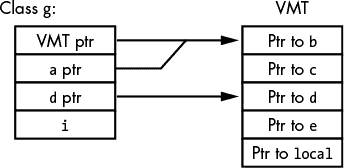

*图 11-12：多重继承内存布局*

在图 11-12 中，类`g`的 VMT 指针包含整个 VMT 的地址。该类中有两个条目，分别包含指向协议`a`和协议`d`的 VMT 的指针。由于类`g`的 VMT 也包含指向这些协议所属函数的指针，因此无需为这两个协议单独创建 VMT；相反，`aPtr`和`dPtr`字段可以指向类`g`的 VMT 中的相应条目。

当在前面的示例中发生赋值`var x:a = g()`时，Swift 代码会用`g`对象中持有的`aPtr`指针加载变量`x`。因此，对`x.b()`和`x.c()`的调用就像正常的函数调用一样——系统使用`x`中持有的指针引用 VMT，然后通过索引适当的位置来调用`b`或`c`。如果`x`的类型是`d`而不是`a`，那么赋值`var x:d = g()`将会加载`x`为`d`协议 VMT 的地址（由`dPtr`指向）。对`d`和`e`的调用将发生在`d` VMT 的偏移量 0 和 8（64 位指针）处。

### 11.7 类、对象和性能

正如你在本章中看到的，与面向对象编程相关的直接成本并不特别显著。调用成员函数（方法）因为有双重间接引用，会稍微贵一些；然而，对于 OOP 所带来的灵活性来说，这只是一个小代价。额外的指令和内存访问大约只会占应用程序总性能的 10%左右。一些语言，例如 C++和 HLA，支持*静态成员函数*的概念，当多态性不必要时，允许直接调用成员函数。

面向对象程序员有时面临的一个大问题是过度应用面向对象原则。与其直接访问对象的字段，他们编写访问器函数来读取和写入这些字段值。除非编译器非常出色地内联这些访问器函数，否则访问对象字段的成本大约会增加一个数量级。换句话说，当过度使用 OOP 范式时，应用程序的性能可能会受到影响。采用“面向对象方式”做事（比如使用访问器函数访问对象的所有字段）可能有合理的原因，但要记住，这些成本会迅速累积。除非你绝对需要 OOP 技术提供的功能，否则你的程序可能会比必要时运行得更慢（并占用更多空间）。

Swift 是面向对象编程极致应用的一个很好的例子。任何将编译后的 Swift 代码与等效的 C++程序性能进行比较的人都知道，Swift 要慢得多。主要原因是 Swift 将一切都视作对象（并在运行时不断检查它们的类型和边界）。结果是，在 Swift 中执行同一任务可能需要数百条机器指令，而优化后的 C++编译器只需要半打机器指令。

许多面向对象程序的另一个常见问题是过度泛化。这种情况发生在程序员使用大量类库，通过继承扩展类以尽量减少编程工作量时。虽然节省编程工作通常是个好主意，但扩展类库可能会导致你需要完成一个小任务时，却调用了一个执行所有功能的库例程。问题在于，在面向对象系统中，库例程往往是高度层次化的。也就是说，你需要完成一些工作时，就调用你继承的某个类中的成员函数。该函数可能会对你传递的数据做一些处理，然后调用它继承的类中的成员函数。接着该函数再对数据进行一些处理，然后调用它继承的成员函数，以此类推。没过多久，CPU 花在调用和返回函数上的时间比实际做有用工作的时间还要多。虽然在标准（非面向对象）库中也可能发生这种情况，但在面向对象应用中，这种情况更加常见。

精心设计的面向对象程序的运行速度不必比同等的过程式程序显著慢。只需小心不要为了做一些琐碎的任务而调用过多的昂贵函数。

### 11.8 了解更多信息

Dershem, Herbert 和 Michael Jipping. *程序设计语言，结构与模型*. 加利福尼亚州贝尔蒙特: Wadsworth 出版社, 1990 年。

Duntemann, Jeff. *汇编语言一步步学习*. 第 3 版. 印第安纳波利斯: Wiley 出版社, 2009 年。

Ghezzi, Carlo 和 Jehdi Jazayeri. *程序设计语言的概念*. 第 3 版. 纽约: Wiley 出版社, 2008 年。

Hyde, Randall. *汇编语言的艺术*. 第 2 版. 旧金山: No Starch Press 出版社, 2010 年。

Knuth, Donald. *计算机程序设计的艺术，第一卷：基本算法*. 第 3 版. 波士顿: Addison-Wesley Professional 出版社, 1997 年。

Ledgard, Henry 和 Michael Marcotty. *编程语言的全景*. 芝加哥: SRA 出版社, 1986 年。

Louden, Kenneth C. 和 Kenneth A. Lambert. *程序设计语言，原理与实践*. 第 3 版. 波士顿: Course Technology 出版社, 2012 年。

Pratt, Terrence W. 和 Marvin V. Zelkowitz. *程序设计语言，设计与实现*. 第 4 版. 新泽西州上萨德尔河: 普伦蒂斯霍尔出版社, 2001 年。

Sebesta, Robert. *程序设计语言的概念*. 第 11 版. 波士顿: Pearson 出版社, 2016 年。
