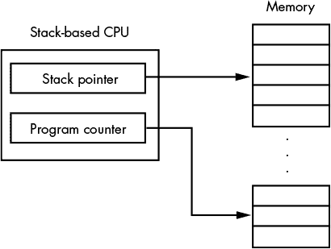
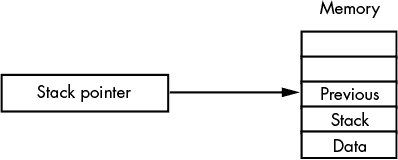
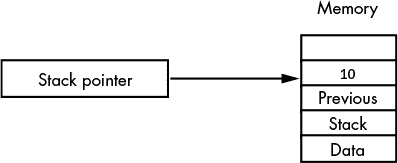
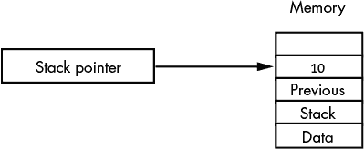
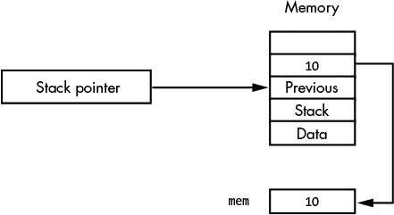
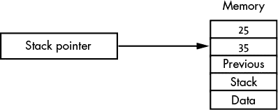

# 第十二章：**算术与逻辑表达式**


高级语言相较于低级语言的一个主要优势是使用代数算术和逻辑表达式（以下简称“算术表达式”）。高级语言的算术表达式在可读性上比编译器生成的机器指令序列高一个数量级。然而，将算术表达式转换为机器代码的过程也是最难以高效完成的转换之一，典型编译器的优化阶段有相当一部分时间用于处理这一过程。由于翻译的难度，这是你可以帮助编译器的一个领域。本章将描述：

+   计算机架构如何影响算术表达式的计算

+   算术表达式的优化

+   算术表达式的副作用

+   算术表达式中的序列点

+   算术表达式中的求值顺序

+   算术表达式的短路与完全求值

+   算术表达式的计算成本

有了这些信息，你将能够编写更高效、更强大的应用程序。

### 12.1 算术表达式与计算机架构

就算术表达式而言，我们可以将传统的计算机架构分为三种基本类型：基于栈的机器、基于寄存器的机器和基于累加器的机器。这些架构类型之间的主要区别在于 CPU 将算术操作的操作数存放在哪里。一旦 CPU 从这些操作数中获取数据，数据将传递给算术和逻辑单元，实际的算术或逻辑计算将在这里发生。^(1)我们将在接下来的章节中探讨这些架构。

#### 12.1.1 基于栈的机器

基于栈的机器在大多数计算中使用内存，采用一种名为*栈*的数据结构来存储所有操作数和结果。具有栈架构的计算机系统在某些方面相较于其他架构有一些重要的优势：

+   在栈架构中，指令通常较小，因为这些指令通常不需要指定任何操作数。

+   编写栈架构的编译器通常比编写其他机器的编译器更容易，因为将算术表达式转换为一系列栈操作非常简单。

+   在栈架构中，临时变量很少需要，因为栈本身就可以完成这个任务。

不幸的是，栈机器也有一些严重的缺点：

+   几乎每条指令都引用内存（在现代机器上内存较慢）。尽管缓存可以帮助缓解这个问题，但内存性能仍然是栈机器上的一个主要问题。

+   尽管从高级语言转换到栈机器非常容易，但与其他架构相比，优化的机会较少。

+   由于栈机器不断访问相同的数据元素（即栈顶的数据），因此实现流水线和指令并行性是困难的。

**注意**

*参见* WGC1 *了解流水线和指令并行性的详细信息。*

使用栈时，通常会执行以下三种操作之一：将新数据压入栈、从栈中弹出数据，或操作当前位于*栈顶*的数据（并可能操作栈顶下方的数据，或*栈中的下一个数据*）。

##### 12.1.1.1 基本栈机器组织

典型的栈机器在 CPU 内部维护几个寄存器（见图 12-1）。特别地，你可以找到一个*程序计数器寄存器*（如 80x86 的 RIP 寄存器）和一个*栈指针寄存器*（如 80x86 的 RSP 寄存器）。



*图 12-1：典型的栈机器架构*

栈指针寄存器包含当前栈顶元素（TOS）在内存中的地址。每当程序将数据压入栈中或从栈中移除数据时，CPU 都会递增或递减栈指针寄存器。在某些架构中，栈从高地址向低地址扩展；在其他架构中，栈从低地址向高地址增长。从根本上讲，栈增长的方向并不重要；它真正决定的是，机器在将数据压入栈时是递减栈指针寄存器（如果栈向低地址增长）还是递增栈指针寄存器（如果栈向高地址增长）。

##### 12.1.1.2 push 指令

要将数据压入栈中，通常使用机器指令`push`。该指令通常包含一个操作数，用于指定要压入栈的数据值，例如：

```

			push memory or constant operand
```

这里有几个具体的例子：

```

			push 10  ; Pushes the constant 10 onto the stack
push mem ; Pushes the contents of memory location mem
```

`push`操作通常会将栈指针寄存器的值增加操作数大小的字节数，然后将该操作数复制到栈指针现在指定的内存位置。例如，图 12-2 和图 12-3 展示了`push 10`操作前后的栈情况。



*图 12-2：执行 push 10 操作前*



*图 12-3：执行 push 10 操作后*

##### 12.1.1.3 pop 指令

要从栈顶移除数据项，使用`pop`或`pull`指令。（本书将使用`pop`；不过请注意，有些架构使用`pull`代替。）典型的`pop`指令可能如下所示：

```

			pop memory location
```

**注意**

*你不能将数据弹出到常量中。*pop*操作数必须是一个内存位置。*

`pop` 指令将堆栈指针指向的数据复制并存储到目标内存位置。然后，它递减（或递增）堆栈指针寄存器，以指向堆栈上的下一个较低项或下一个堆栈项（NOS）；见 图 12-4 和 12-5。



*图 12-4：执行 pop mem 操作之前*



*图 12-5：执行 pop mem 操作之后*

请注意，`pop` 指令从堆栈中移除的堆栈内存中的值仍然物理存在于新 TOS 上方的内存中。然而，下次程序将数据推送到堆栈时，它会用新值覆盖此值。

##### 12.1.1.4 堆栈机器上的算术操作

堆栈机器上的算术和逻辑指令通常不允许任何操作数。这就是为什么堆栈机器通常被称为 *零地址机器*；算术指令本身并不编码任何操作数地址。例如，考虑一个典型堆栈机器上的 `add` 指令。此指令将从堆栈中弹出两个值（TOS 和 NOS），计算它们的和，并将结果推送回堆栈（见 图 12-6 和 12-7）。


*图 12-6：执行加法操作之前*



*图 12-7：执行加法操作之后*

由于算术表达式本质上是递归的，而递归需要堆栈才能正确实现，因此将算术表达式转换为堆栈机器指令序列相对简单也不足为奇。常见编程语言中的算术表达式使用 *中缀表示法*，即操作符位于两个操作数之间。例如，`a + b` 和 `c - d` 是中缀表示法的例子，因为操作符（`+` 和 `-`）出现在操作数（[`a`, `b`] 和 [`c`, `d`]）之间。在你能够进行堆栈机器指令的转换之前，你必须将这些中缀表达式转换为 *后缀表示法*（也称为 *逆波兰表示法*），在后缀表示法中，操作符紧随其后作用的操作数。例如，中缀表达式 `a + b` 和 `c - d` 对应的后缀表达式分别为 `a b +` 和 `c d -`。

一旦你拥有一个后缀表达式，将其转换为堆栈机器指令序列非常简单。你只需为每个操作数发出一个 `push` 指令，并为操作符发出相应的算术指令。例如，`a b +` 转换为：

```

			push a
push b
add
```

`c d -` 转换为：

```

			push c
push d
sub
```

当然，假设 `add` 操作将堆栈顶部的两个项相加，`sub` 操作将 TOS 与其下方的值相减。

##### 12.1.1.5 现实世界中的堆栈机器

栈架构的一个巨大优势是，它很容易为这种机器编写编译器。为基于栈的机器编写仿真器也非常简单。正因为如此，栈架构在*虚拟机 (VM)* 中非常流行，例如 Java 虚拟机、UCSD Pascal p-machine，以及微软的 Visual Basic、C# 和 F# CIL。尽管确实存在一些现实世界中的基于栈的 CPU，例如 Java VM 的硬件实现，但由于内存访问的性能限制，它们并不太受欢迎。尽管如此，理解栈架构的基本原理仍然很重要，因为许多编译器会在生成实际机器代码之前将高级语言源代码转换为基于栈的形式。事实上，在最糟糕的情况下（尽管这种情况很少见），编译器在编译复杂的算术表达式时被迫生成模拟基于栈的机器的代码。

#### 12.1.2 基于累加器的机器

栈机器指令序列的简单性掩盖了巨大的复杂性。考虑上一节中的以下基于栈的指令：

```
add
```

这条指令看起来很简单，但实际上它指定了大量的操作：

+   从栈指针指向的内存位置获取一个操作数。

+   将栈指针的值发送到*ALU (算术/逻辑单元)*。

+   指示 ALU 减少刚刚发送给它的栈指针的值。

+   将 ALU 的值路由回栈指针。

+   从栈指针指向的内存位置获取操作数。

+   将上一步和第一步的值发送到 ALU。

+   指示 ALU 对这些值进行加法运算。

+   将和存储在栈指针指向的内存位置。

一个典型栈机器的组织方式会阻止许多通过流水线实现的并行操作（有关流水线的更多细节，请参见*WGC1*）。因此，栈架构面临两次挑战：典型的指令需要多个步骤才能完成，而且这些步骤很难与其他操作并行执行。

栈架构的一个大问题是它几乎所有的操作都需要访问内存。例如，如果你只是想计算两个变量的和并将结果存储到第三个变量，你必须先从内存中取出两个变量并将它们写入栈中（四次内存操作）；然后你必须从栈中取出这两个值，进行加法运算，并将它们的和写回栈中（三次内存操作）；最后，你必须从栈中弹出该项，并将结果存储到目标内存位置（两次内存操作）。总共是九次内存操作。当内存访问速度较慢时，这是一种计算两个数字和的高成本方式。

避免大量内存访问的一种方法是提供一个通用算术寄存器。累加器机器的理念就是提供一个单一的*累加器*寄存器，CPU 在此寄存器中计算临时结果，而不是在内存（栈上）中计算临时值。累加器机器也被称为*单地址*或*单一地址机器*，因为大多数操作两个操作数的指令都将累加器作为默认的目标操作数，并且需要一个内存或常数操作数作为源操作数。累加器机器的典型例子是 6502，它包含以下指令：

```

			LDA constant or memory ; Load accumulator register
STA memory             ; Store accumulator register
ADD constant or memory ; Add operand to accumulator
SUB constant or memory ; Subtract operand from accumulator
```

由于单地址指令需要一个在许多零地址指令中不存在的操作数，因此，累加器机器上的单个指令通常比典型的栈机器上的指令更大（因为你必须将操作数地址作为指令的一部分进行编码；详情见*WGC1*）。然而，程序通常更小，因为完成相同操作所需的指令更少。例如，假设你要计算`x = y + z`。在栈机器上，你可能会使用如下的指令序列：

```

			push y
push z
add
pop x
```

在累加器机器上，你可能会使用如下的指令序列：

```

			lda y
add z
sta x
```

假设`push`和`pop`指令的大小大致与累加器机器的`lda`、`add`和`sta`指令相同（这是一个安全的假设），可以明确看到栈机器的指令序列实际上更长，因为它需要更多的指令。即便忽略栈机器中的额外指令，累加器机器也可能执行代码更快，因为它只需要三次内存访问（用于获取`y`和`z`，以及存储`x`），相比之下栈机器需要九次内存访问。此外，累加器机器在计算过程中不会浪费时间操作栈指针寄存器。

尽管基于累加器的机器通常比基于栈的机器具有更高的性能（正如你刚才所看到的原因），但它们也并非没有问题。由于仅有一个通用寄存器可用于算术操作，这在系统中形成了瓶颈，导致了*数据冒险*。许多计算会产生临时结果，应用程序必须将这些结果写入内存，以便计算表达式的其他部分。这导致了额外的内存访问，如果 CPU 提供额外的累加器寄存器，这些访问本可以避免。因此，大多数现代通用 CPU 不使用基于累加器的架构，而是提供大量的通用寄存器。

**注意**

*参见* WGC1 *讨论数据冒险问题。*

基于累加器的架构在早期计算机系统中非常流行，当时制造工艺限制了 CPU 内的功能数量，但今天除了低成本嵌入式微控制器外，几乎看不到它们。

#### 12.1.3 基于寄存器的机器

在本章讨论的三种架构中，基于寄存器的机器是目前最常见的，因为它们提供了最高的性能。通过提供相当数量的 CPU 内寄存器，这种架构在计算复杂表达式时能够避免 CPU 进行昂贵的内存访问。

理论上，一个基于寄存器的机器可以只有两个通用（算术能力）寄存器。在实践中，唯一符合这一类别的机器是摩托罗拉 680x 处理器，大多数人认为它是带有两个独立累加器的累加器架构的一个特例。寄存器机器通常至少包含八个“通用”寄存器（这个数字并非随意的；它是 80x86 CPU、8080 CPU 和 Z80 CPU 中发现的通用寄存器数量，这些可能是计算机架构师所称的“基于寄存器”的机器的最简化示例）。

虽然一些基于寄存器的机器（如 32 位的 80x86）有较少的可用寄存器，但一个普遍的原则是“越多越好”。典型的 RISC 机器，如 PowerPC 和 ARM，至少有 16 个通用寄存器，并且通常至少有 32 个寄存器。例如，英特尔的 Itanium 处理器提供 128 个通用整数寄存器。IBM 的 CELL 处理器在每个处理单元中提供 128 个寄存器（每个处理单元是一个能够执行特定操作的微型 CPU）；典型的 CELL 处理器包含八个这样的处理单元，并且配有一个 PowerPC CPU 核心。

拥有尽可能多的通用寄存器的主要原因是为了避免内存访问。在基于累加器的机器中，累加器是一个用于计算的瞬态寄存器，但你不能将一个变量的值长时间保存在那里，因为你还需要使用累加器执行其他任务。在一个具有大量寄存器的寄存器机器中，可以将某些（经常使用的）变量保存在寄存器中，这样在使用这些变量时就不必进行内存访问。考虑赋值语句 `x := y+z`；在一个基于寄存器的机器（如 80x86）上，我们可以使用以下 HLA 代码来计算这个结果：

```

			// Note: Assume x is held in EBX, y is held in ECX,
// and z is held in EDX:

mov( ecx, ebx );
add( edx, ebx );
```

这里只需要两条指令，并且不需要进行内存访问（对于变量）。这比基于累加器或堆栈的架构效率要高得多。从这个例子中，您可以看到为什么基于寄存器的架构在现代计算机系统中变得如此普遍。

正如您将在接下来的章节中看到的那样，寄存器机器通常被描述为两地址机器或三地址机器，具体取决于特定 CPU 的架构。

#### 12.1.4 算术表达式的典型形式

计算机架构师已经深入研究了典型的源文件，他们发现的一个事实是，大部分赋值语句采用以下几种形式之一：

```

			var = var2;
var = constant;
var = op var2;
var = var op var2;
var = var2 op var3;
```

尽管其他类型的赋值语句也存在，但程序中采用这些形式的语句通常比其他任何赋值语句形式都要多。因此，计算机架构师通常会优化他们的 CPU，以高效地处理这些形式。

#### 12.1.5 三地址架构

许多机器使用*三地址架构*。这意味着一个算术语句支持三个操作数：两个源操作数和一个目标操作数。例如，大多数 RISC CPU 提供`add`指令，将两个操作数的值相加并将结果存储到第三个操作数中：

```

			add source1, source2, dest
```

在这种架构中，操作数通常是机器寄存器（或小常数），所以通常你会按如下方式编写此指令（假设你使用*R*0、*R*1、……、*Rn*来表示寄存器）：

```
add r0, r1, r2   ; computes r2 := r0 + r1
```

由于 RISC 编译器尝试将变量保存在寄存器中，因此这条单指令处理了上一节中给出的最后一个赋值语句：

```
var = var2 op var3;
```

处理如下形式的赋值：

```
var = var op var2;
```

也相对简单——只需将目标寄存器作为其中一个源操作数，如下所示：

```
add r0, r1, r0  ; computes r0 := r0 + r1
```

三地址架构的缺点是，你必须将所有三个操作数编码到每个支持三个操作数的指令中。这就是为什么三操作数指令通常只对寄存器操作数进行操作的原因。编码三个单独的内存地址可能相当昂贵——问问任何 VAX 程序员就知道了。DEC VAX 计算机系统是一个很好的三地址 CISC 机器示例。

#### 12.1.6 二地址架构

80x86 架构被称为*二地址机器*。在这种架构中，一个源操作数也是目标操作数。考虑以下 80x86/HLA `add`指令：

```
add( ebx, eax );  ; computes eax := eax + ebx;
```

二地址机器，如 80x86，可以用单个指令处理前面给出的赋值语句的前四种形式。然而，最后一种形式需要两个或更多指令和一个临时寄存器。例如，要计算：

```
var1 = var2 + var3;
```

你需要使用以下代码（假设*var2*和*var3*是内存变量，且编译器将*var1*保存在 EAX 寄存器中）：

```

			mov( var2, eax );
add( var3, eax );  //Result (var1) is in EAX.
```

#### 12.1.7 架构差异与你的代码

一地址、二地址和三地址架构具有以下层次结构：

**1 地址** ⊂ **2 地址** ⊂ **3 地址**

也就是说，二地址机器能够做任何一地址机器能做的事情，而三地址机器能够做任何一地址或二地址机器能做的事情。证明非常简单：^(2)

+   为了证明二地址机器可以做任何单地址机器能做的事情，只需选择二地址机器上的一个寄存器，并在模拟单地址架构时将其用作“累加器”。

+   为了证明三地址机器可以完成任何二地址机器能够做的事情，只需将同一个寄存器同时用作一个源操作数和目标操作数，从而使所有操作仅限于两个寄存器（操作数/地址）。

根据这个层次结构，你可能会认为如果你限制编写的代码，使其在单地址机器上运行良好，那么它在所有机器上都会获得良好的结果。实际上，今天大多数通用 CPU 都是二地址或三地址机器，因此将代码写成偏向单地址机器可能会限制二地址或三地址机器上可能的优化。此外，优化质量在不同编译器之间差异如此之大，以至于很难为这样的说法提供支持。如果你希望编译器生成最佳的代码，最好还是尝试创建符合之前给出的五种形式的表达式（在《典型的算术表达式形式》部分的第 394 页）。因为大多数现代程序都运行在二地址或三地址机器上，本章其余部分假设使用的是这种环境。

#### 12.1.8 复杂表达式

一旦你的表达式比之前给出的五种形式更复杂，编译器将必须生成两条或更多指令的序列来计算它们。在编译代码时，大多数编译器会将复杂的表达式内部转换为一系列与其语义等价的“三地址语句”，如以下示例所示：

```

			// complex = ( a + b ) * ( c - d ) - e/f;

temp1 = a + b;
temp2 = c - d;
temp1 = temp1 * temp2;
temp2 = e / f;
complex = temp1 - temp2;
```

如你所见，这五条语句在语义上等同于注释中出现的复杂表达式。计算中的主要区别是引入了两个临时值（`temp1`和`temp2`）。大多数编译器会尝试使用机器寄存器来维护这些临时值。

由于编译器内部将复杂指令转换为三地址语句的序列，你可能会想，是否可以通过自己将复杂的表达式转换为三地址语句来帮助编译器。嗯，这取决于你的编译器。对于许多（优秀的）编译器，将复杂的计算分解成更小的部分，实际上可能会妨碍编译器优化某些语句的能力。因此，在处理算术表达式时，大多数情况下你应该做好自己的工作（尽可能清晰地编写代码），让编译器做好它的工作（优化结果）。然而，如果你能使用一种自然转化为二地址或三地址形式的方式来指定计算，毫不犹豫地去做。至少，它对编译器生成的代码没有任何影响。在某些特殊情况下，它甚至可能帮助编译器生成更好的代码。不管怎样，结果代码可能会更易于阅读和维护，如果它不那么复杂的话。

### 12.2 算术语句的优化

因为高级语言编译器最初是为了让程序员在源代码中使用类似代数的表达式而设计的，所以这是计算机科学中一个已经得到充分研究的领域。大多数现代编译器都提供了合理的优化器，能够很好地将算术表达式转化为机器码。你通常可以假设你使用的编译器在优化算术表达式时不需要太多帮助（如果它确实需要，你可能考虑换一个更好的编译器，而不是尝试手动优化代码）。

为了帮助你理解编译器为你做的工作，本节讨论了一些你可以从现代优化编译器中预期的典型优化。通过了解一个（优秀的）编译器的工作，你可以避免手动优化那些它能够处理的部分。

#### 12.2.1 常量折叠

常量折叠是一种优化技术，它在编译时计算常量表达式或子表达式的值，而不是在运行时生成代码来计算其结果。例如，支持这种优化的 Pascal 编译器会将类似`i := 5 + 6;`的语句在生成机器码之前转化为`i := 11;`。这样可以避免在运行时执行`add`指令。再举一个例子，假设你想分配一个包含 16MB 存储的数组。可以通过以下方式来实现：

```
char bigArray[ 16777216 ]; // 16 MB of storage
```

这个方法唯一的问题是 16,777,216 是一个魔法数字。它代表的是 2²⁴的值，而不是其他任意值。现在考虑以下 C/C++声明：

```
char bigArray[ 16*1024*1024 ]; // 16 MB of storage
```

大多数程序员知道 1,024 乘以 1,024 是二进制的百万，而这个值的 16 倍对应 16 兆什么的。是的，你需要知道子表达式 `16*1024*1024` 等同于 16,777,216。但这个模式更容易被识别为 16MB（至少在字符数组中使用时），而不是 `16777216`（或者是 `16777214`？）。在这两种情况下，编译器分配的存储量完全相同，但第二种情况可以说更具可读性。因此，这是更好的代码。^(3)

变量声明并不是唯一可以使用此优化的地方。任何包含常量操作数的算术表达式（或子表达式）都可以作为常量折叠的候选。因此，如果你能够通过使用常量表达式而不是手动计算结果，使算术表达式更清晰，应该选择更具可读性的版本，并让编译器在编译时处理常量计算。如果你的编译器不支持常量折叠，你当然可以通过手动执行所有常量计算来模拟它。然而，这应该仅作为最后的手段。寻找一个更好的编译器通常是更好的选择。

一些优秀的优化编译器在折叠常量时可能会采取极端手段。例如，一些开启了足够高优化级别的编译器会将某些带有常量参数的函数调用替换为相应的常量值。例如，编译器可能会将 C/C++ 语句 `sineR = sin(0);` 转换为 `sineR = 0;`（因为零弧度的正弦值为 `0`）。然而，这种类型的常量折叠并不常见，通常需要启用特别的编译器模式才能实现。

如果你对自己的编译器是否支持常量折叠有任何疑问，可以让编译器生成汇编清单并查看其输出（或使用调试器查看反汇编输出）。下面是一个用 C/C++ 编写的简单示例（使用 Visual C++ 编译）：

```

			#include <stdio.h>
int main(int argc, char **argv)
{
      int i = 16 * 1024 * 1024;
      printf( "%d\n", i);
       return 0;
}

// Assembly output for sequence above (optimizations turned off!)

        mov     DWORD PTR i$[rsp], 16777216             ; 01000000H

        mov     edx, DWORD PTR i$[rsp]
        lea     rcx, OFFSET FLAT:$SG7883
        call    printf
```

这是一个用 Java 编写的相应程序：

```

			public class Welcome
{
      public static void main( String[] args )
      {
            int i = 16 * 1024 * 1024;
            System.out.println( i );
      }
}

// JBC generated by the compiler:

javap -c Welcome
Compiled from "Welcome.java"
public class Welcome extends java.lang.Object{
public Welcome();
  Code:
   0:   aload_0

        ; //Method java/lang/Object."<init>":()V
   1:   invokespecial   #1

   4:   return

public static void main(java.lang.String[]);
  Code:
   0:   ldc #2; //int 16777216
   2:   istore_1

        ; //Field java/lang/System.out:Ljava/io/PrintStream;
   3:   getstatic   #3

   6:   iload_1

        ; //Method java/io/PrintStream.println:(I)V
   7:   invokevirtual   #4   10:  return

}
```

请注意，`ldc #2` 指令将常量池中的常量推送到栈上。附加在这条字节码指令上的注释解释了 Java 编译器将 `16*1024*1024` 转换为一个单一常量 `16777216`。Java 在编译时进行常量折叠，而不是在运行时计算这个乘积。

这是相应的 Swift 程序，并附带了相关部分^(4)的汇编代码：

```

			import Foundation

var i:Int = 16*1024*1024
print( "i=\(i)" )

// code produced by
// "xcrun -sdk macosx
//       swiftc -O -emit-assembly main.swift -o result.asm"

       movq    $16777216, _$S6result1iSivp(%rip)
```

正如你所看到的，Swift 也支持常量折叠优化。

#### 12.2.2 常量传播

常量传播是一种优化技术，编译器使用它来将变量访问替换为常量值，如果编译器确定这样做是可能的。例如，支持常量传播的编译器将进行如下优化：

```

			// original code:

    variable = 1234;
    result = f( variable );

// code after constant propagation optimization

    variable = 1234;
    result = f( 1234 );
```

在目标代码中，操作立即常量通常比操作变量更有效；因此，常量传播通常会产生更好的代码。在某些情况下，常量传播还可以使编译器完全消除某些变量和语句（在这个例子中，如果源代码中没有后续对变量对象的引用，编译器可以删除 `variable = 1234;`）。

在某些情况下，编写良好的编译器可以进行一些令人惊讶的优化，涉及常量折叠。考虑以下 C 代码：

```

			#include <stdio.h>
static int rtn3( void )
{
    return 3;
}
int main( void )
{
    printf( "%d", rtn3() + 2 );
    return( 0 );
}
```

这是 GCC 在启用 `-O3`（最大）优化选项后生成的 80x86 输出：

```

			.LC0:
        .string "%d"
        .text
        .p2align 2,,3
.globl main
        .type   main,@function
main:
        ; Build main's activation record:

        pushl   %ebp
        movl    %esp, %ebp
        subl    $8, %esp
        andl    $-16, %esp
        subl    $8, %esp

        ; Print the result of "rtn3()+5":

        pushl   $5      ; Via constant propagation/folding!
        pushl   $.LC0
        call    printf
        xorl    %eax, %eax
        leave
        ret
```

快速查看表明，`rtn3()` 函数在哪里都找不到。启用了 `-O3` 命令行选项后，GCC 发现 `rtn3()` 仅仅返回一个常量，因此它将常量返回结果传播到你调用 `rtn3()` 的每个地方。在 `printf()` 函数调用的情况下，常量传播和常量折叠的结合生成了一个单一的常量 `5`，该常量被传递给 `printf()` 函数。

和常量折叠一样，如果你的编译器不支持常量传播，你可以手动模拟它，但这只是最后的手段。再次强调，找到一个更好的编译器几乎总是更好的选择。

你可以开启编译器的汇编语言输出，来判断你的编译器是否支持常量传播。例如，以下是 Visual C++ 的输出（启用了 `/O2` 优化级别）：

```

			#include <stdio.h>

int f(int a)
{
      return a + 1;
}

int main(int argc, char **argv)
{
      int i = 16 * 1024 * 1024;
      int j = f(i);
      printf( "%d\n", j);
}

// Assembly language output for the above code:

main    PROC                                            ; COMDAT

$LN6:
        sub     rsp, 40                                 ; 00000028H

        mov     edx, 16777217                           ; 01000001H
        lea     rcx, OFFSET FLAT:??_C@_02DPKJAMEF@?$CFd?$AA@
        call    printf

        xor     eax, eax
        add     rsp, 40                                 ; 00000028H
        ret     0
main    ENDP
```

正如你所看到的，Visual C++ 也消除了 `f()` 函数以及 `i` 和 `j` 变量。它在编译时计算了函数结果（`i+1`），并将常量 `16777217` （`16*1024*1024 + 1`）替换到所有的计算中。

这是一个使用 Java 的示例：

```

			public class Welcome
{
      public static int f( int a ) { return a+1;}
      public static void main( String[] args )
      {
            int i = 16 * 1024 * 1024;
            int j = f(i);
            int k = i+1;
            System.out.println( j );
            System.out.println( k );
       }
}

// JBC emitted for this Java source code:

javap -c Welcome
Compiled from "Welcome.java"
public class Welcome extends java.lang.Object{
public Welcome();
  Code:
   0:   aload_0

        ; //Method java/lang/Object."<init>":()V
   1:   invokespecial   #1
   4:   return

public static int f(int);
  Code:
   0:   iload_0
   1:   iconst_1
   2:   iadd
   3:   ireturn

public static void main(java.lang.String[]);
  Code:
   0:   ldc #2; //int 16777216
   2:   istore_1
   3:   iload_1
   4:   invokestatic    #3; //Method f:(I)I
   7:   istore_2
   8:   iload_1
   9:   iconst_1
   10:  iadd
   11:  istore_3

        ; //Field java/lang/System.out:Ljava/io/PrintStream;
   12:  getstatic   #4
   15:  iload_2

        ; //Method java/io/PrintStream.println:(I)V
   16:  invokevirtual   #5

        ; //Field java/lang/System.out:Ljava/io/PrintStream;
   19:  getstatic   #4
   22:  iload_3

        ; //Method java/io/PrintStream.println:(I)V
   23:  invokevirtual   #5
   26:  return

}
```

快速查看这个 Java 字节码显示，Java 编译器（`java version "1.6.0_65"`）不支持常量传播优化。它不仅没有消除 `f()` 函数，而且也没有消除变量 `i` 和 `j`，并且它将 `i` 的值传递给 `f()` 函数，而不是传递合适的常量。有人可能会说，Java 的字节码解释会显著影响性能，因此像常量传播这样的简单优化不会对性能产生太大影响。

这是用 Swift 编写的类似程序，以及编译器的汇编输出：

```

			import Foundation

func f( _ a:Int ) -> Int
{
    return a + 1
}
let i:Int = 16*1024*1024
let j = f(i)
print( "i=\(i), j=\(j)" )

// Assembly output via the command:
// xcrun -sdk macosx swiftc -O -emit-assembly main.swift -o result.asm

    movq    $16777216, _$S6result1iSivp(%rip)
    movq    $16777217, _$S6result1jSivp(%rip)
    .
    .   // Lots of code that has nothing to do with the Swift source
    .
    movl    $16777216, %edi
    callq   _$Ss26_toStringReadOnlyPrintableySSxs06CustomB11ConvertibleRzlFSi_Tg5
    .
    .
    .
    movl    $16777217, %edi
    callq   _$Ss26_toStringReadOnlyPrintableySSxs06CustomB11ConvertibleRzlFSi_Tg5
```

Swift 编译器生成了大量代码来支持其运行时系统，因此你几乎不能称 Swift 为一个 *优化* 编译器。话虽如此，它生成的汇编代码表明，Swift 支持常量传播优化。它消除了 `f()` 函数，并将计算结果的常量传播到打印 `i` 和 `j` 值的调用中。它没有消除 `i` 和 `j`（可能是因为与运行时系统有关的一些一致性问题），但它确实通过编译代码传播了常量。

鉴于 Swift 编译器生成的代码量过大，是否值得进行这种优化值得怀疑。然而，即使有了所有这些额外的代码（这里太多了，无法全部打印出来，欢迎自己查看），输出仍然比解释执行的 Java 代码运行得更快。

#### 12.2.3 死代码消除

死代码消除是指删除与特定源代码语句相关的目标代码，如果程序再也不使用该语句的结果。这通常是编程错误的结果。（毕竟，为什么有人会计算一个值却不使用它呢？）如果编译器在源文件中遇到死代码，它可能会警告你检查代码逻辑。然而，在某些情况下，早期的优化可能会产生死代码。例如，前面示例中值变量的常量传播可能会导致语句`variable = 1234;`变成死代码。支持死代码消除的编译器会悄悄地从目标文件中删除这条语句的目标代码。

作为死代码消除的一个示例，考虑以下 C 程序及其相应的汇编代码：

```

			static int rtn3( void )
{
    return 3;
}

int main( void )
{
    int i = rtn3() + 2;

    // Note that this program
    // never again uses the value of i.

    return( 0 );
}
```

这是 GCC 在提供`-O3`命令行选项时生成的 32 位 80x86 代码：

```

			.file   "t.c"
        .text
        .p2align 2,,3
.globl main
        .type   main,@function
main:
        ; Build main's activation record:

        pushl   %ebp
        movl    %esp, %ebp
        subl    $8, %esp
        andl    $-16, %esp

        ; Notice that there is no
        ; assignment to i here.

        ; Return 0 as main's function result.

        xorl    %eax, %eax
        leave
        ret
```

现在考虑 GCC 在未启用优化时的 80x86 输出：

```

			.file   "t.c"
        .text
        .type   rtn3,@function
rtn3:
        pushl   %ebp
        movl    %esp, %ebp
        movl    $3, %eax
        leave
        ret
.Lfe1:
        .size   rtn3,.Lfe1-rtn3
.globl main
        .type   main,@function
main:
        pushl   %ebp
        movl    %esp, %ebp
        subl    $8, %esp
        andl    $-16, %esp
        movl    $0, %eax
        subl    %eax, %esp

        ; Note the call and computation:

        call    rtn3
        addl    $2, %eax
        movl    %eax, -4(%ebp)

        ; Return 0 as the function result.

        movl    $0, %eax
        leave
        ret
```

实际上，本书中大多数程序示例调用像`printf()`这样的函数来显示各种值，主要是为了显式地使用这些值，以防止死代码消除将我们正在检查的代码从汇编输出文件中删除。如果你从这些示例中的 C 程序中移除最后一个`printf()`，大部分汇编代码将因为死代码消除而消失。

这是前面 Visual C++代码的输出：

```

			; Listing generated by Microsoft (R) Optimizing Compiler Version 19.00.24234.1

include listing.inc

INCLUDELIB LIBCMT
INCLUDELIB OLDNAMES

PUBLIC  main
; Function compile flags: /Ogtpy
; File c:\users\rhyde\test\t\t\t.cpp
_TEXT   SEGMENT
main    PROC

        xor     eax, eax

        ret     0
main    ENDP
_TEXT   ENDS
; Function compile flags: /Ogtpy
; File c:\users\rhyde\test\t\t\t.cpp
_TEXT   SEGMENT
rtn3    PROC

        mov     eax, 3

        ret     0
rtn3    ENDP
_TEXT   ENDS
END
```

与 GCC 不同，Visual C++没有删除`rtn3()`函数。然而，它确实删除了对`i`的赋值以及对`rtn3()`的调用——这些都在主程序中被移除。

下面是等效的 Java 程序和 JBC 输出：

```

			public class Welcome
{
    public static int rtn3() { return 3;}
    public static void main( String[] args )
    {
        int i = rtn3();
    }
}

// JBC output:

public class Welcome extends java.lang.Object{
public Welcome();
  Code:
   0:   aload_0

        ; //Method java/lang/Object."<init>":()V
   1:   invokespecial   #1
   4:   return

public static int rtn3();
  Code:
   0:   iconst_3
   1:   ireturn

public static void main(java.lang.String[]);
  Code:
   0:   invokestatic    #2; //Method rtn3:()I
   3:   istore_1
   4:   return
}
```

初看之下，似乎 Java 不支持死代码消除。然而，问题可能是我们的示例代码没有触发编译器的这个优化。让我们尝试一些编译器更容易识别的代码：

```

			public class Welcome
{
    public static int rtn3() { return 3;}
    public static void main( String[] args )
    {
        if( false )
        {   int i = rtn3();
        }
    }
}

// Here's the output bytecode:

Compiled from "Welcome.java"
public class Welcome extends java.lang.Object{
public Welcome();
  Code:
   0:   aload_0

        ; //Method java/lang/Object."<init>":()V
   1:   invokespecial   #1
   4:   return

public static int rtn3();
  Code:
   0:   iconst_3
   1:   ireturn

public static void main(java.lang.String[]);
  Code:
   0:   return
}
```

现在我们给 Java 编译器提供了一些它可以处理的内容。主程序消除了对`rtn3()`的调用和对`i`的赋值。这个优化不如 GCC 或 Visual C++的优化聪明，但（至少）在某些情况下，它是有效的。不幸的是，没有常量传播，Java 错过了很多死代码消除的机会。

下面是前一个示例的等效 Swift 代码：

```

			import Foundation

func rtn3() -> Int
{
    return 3
}
let i:Int = rtn3()
// Assembly language output:

_main:
    pushq   %rbp
    movq    %rsp, %rbp
    movq    $3, _$S6result1iSivp(%rip)
    xorl    %eax, %eax
    popq    %rbp
    retq

    .private_extern _$S6result4rtn3SiyF
    .globl  _$S6result4rtn3SiyF
    .p2align    4, 0x90
_$S6result4rtn3SiyF:
    pushq   %rbp
    movq    %rsp, %rbp
    movl    $3, %eax
    popq    %rbp
    retq
```

请注意，Swift（至少对于这个示例）不支持死代码消除。然而，让我们尝试像在 Java 中做的那样。考虑以下代码：

```

			import Foundation

func rtn3() -> Int
{
    return 3
}
if false
{
    let i:Int = rtn3()
}

// Assembly output

_main:
    pushq   %rbp
    movq    %rsp, %rbp
    xorl    %eax, %eax
    popq    %rbp
    retq

    .private_extern _$S6result4rtn3SiyF
    .globl  _$S6result4rtn3SiyF
    .p2align    4, 0x90
_$S6result4rtn3SiyF:
    pushq   %rbp
    movq    %rsp, %rbp
    movl    $3, %eax
    popq    %rbp
    retq
```

编译这段代码会生成关于死代码的警告列表，但输出结果证明了 Swift 确实支持死代码消除。此外，由于 Swift 也支持常量传播，它不会像 Java 那样错过那么多死代码消除的机会（尽管 Swift 在追赶 GCC 或 Visual C++之前可能还需要一些时间）。

#### 12.2.4 公共子表达式消除

通常，一些表达式的部分—一个*子表达式*—可能在当前函数的其他地方出现。如果在子表达式中出现的变量的值没有发生变化，那么程序就不需要两次计算它的值。相反，它可以在第一次计算时保存子表达式的值，然后在子表达式再次出现时使用该值。例如，考虑以下 Pascal 代码：

```

			complex := ( a + b ) * ( c - d ) - ( e div f );
lessSo  := ( a + b ) - ( e div f );
quotient := e div f;
```

一个合格的编译器可能会将这些转换为以下三地址语句序列：

```

			temp1 := a + b;
temp2 := c - d;
temp3 := e div f;
complex := temp1 * temp2;
complex := complex - temp3;
lessSo := temp1 - temp3;
quotient := temp3;
```

尽管前面的语句分别使用了子表达式`(a + b)`两次和子表达式`(e div f)`三次，但三地址代码序列只计算这些子表达式一次，并在后续出现公共子表达式时使用它们的值。

作为另一个例子，考虑下面的 C/C++代码：

```

			#include <stdio.h>

static int i, j, k, m, n;
static int expr1, expr2, expr3;

extern int someFunc( void );

int main( void )
{
    // The following is a trick to
    // confuse the optimizer. When we call
    // an external function, the optimizer
    // knows nothing about the value this
    // function returns, so it cannot optimize
    // the values away. This is done to demonstrate
    // the optimizations that this example is
    // trying to show (that is, the compiler
    // would normally optimize away everything
    // and we wouldn't see the code the optimizer
    // would produce in a real-world example without
    // the following trick).

    i = someFunc();
    j = someFunc();
    k = someFunc();
    m = someFunc();
    n = someFunc();

    expr1 = (i+j) * (k*m+n);
    expr2 = (i+j);
    expr3 = (k*m+n);

    printf( "%d %d %d", expr1, expr2, expr3 );
    return( 0 );
}
```

这是 GCC 为上述 C 代码生成的 32 位 80x86 汇编文件（使用`-O3`选项）：

```

			.file   "t.c"
        .section        .rodata.str1.1,"aMS",@progbits,1
.LC0:
        .string "%d %d %d"
        .text
        .p2align 2,,3
.globl main
        .type   main,@function
main:
        ; Build the activation record:

        pushl   %ebp
        movl    %esp, %ebp
        subl    $8, %esp
        andl    $-16, %esp

        ; Initialize i, j, k, m, and n:

        call    someFunc
        movl    %eax, i
        call    someFunc
        movl    %eax, j
        call    someFunc
        movl    %eax, k
        call    someFunc
        movl    %eax, m
        call    someFunc ;n's value is in EAX.

        ; Compute EDX = k*m+n
        ; and ECX = i+j
        movl    m, %edx
        movl    j, %ecx
        imull   k, %edx
        addl    %eax, %edx
        addl    i, %ecx

        ; EDX is expr3, so push it
        ; on the stack for printf

        pushl   %edx

        ; Save away n's value:

        movl    %eax, n
        movl    %ecx, %eax

        ; ECX is expr2, so push it onto
        ; the stack for printf:

        pushl   %ecx

        ; expr1 is the product of the
        ; two subexpressions (currently
        ; held in EDX and EAX), so compute
        ; their product and push the result
        ; for printf.

        imull   %edx, %eax
        pushl   %eax

        ; Push the address of the format string
        ; for printf:

        pushl   $.LC0

        ; Save the variable's values and then
        ; call printf to print the values

        movl    %eax, expr1
        movl    %ecx, expr2
        movl    %edx, expr3
        call    printf

        ; Return 0 as the main function's result:

        xorl    %eax, %eax
        leave
        ret
```

注意编译器如何在不同的寄存器中保持公共子表达式的结果（请参阅汇编输出中的注释以了解详细信息）。

这是 Visual C++的（64 位）输出：

```

			_TEXT   SEGMENT
main    PROC

$LN4:
        sub     rsp, 40                                 ; 00000028H

        call    someFunc
        mov     DWORD PTR i, eax

        call    someFunc
        mov     DWORD PTR j, eax

        call    someFunc
        mov     DWORD PTR k, eax

        call    someFunc
        mov     DWORD PTR m, eax

        call    someFunc

        mov     r9d, DWORD PTR m

        lea     rcx, OFFSET FLAT:$SG7892
        imul    r9d, DWORD PTR k
        mov     r8d, DWORD PTR j
        add     r8d, DWORD PTR i
        mov     edx, r8d
        mov     DWORD PTR n, eax
        mov     DWORD PTR expr2, r8d
        add     r9d, eax
        imul    edx, r9d
        mov     DWORD PTR expr3, r9d
        mov     DWORD PTR expr1, edx
        call    printf

        xor     eax, eax

        add     rsp, 40                                 ; 00000028H
        ret     0
main    ENDP
_TEXT   ENDS
```

由于 x86-64 架构上额外的寄存器，Visual C++能够将所有临时变量保留在寄存器中，并且在重用公共子表达式的预计算值时做得更好。

如果你使用的编译器不支持公共子表达式优化（你可以通过检查汇编输出来判断），那么它的优化器可能比较差，你应该考虑使用不同的编译器。然而，在此期间，你可以始终手动实现这种优化。考虑以下版本的前述 C 代码，它手动计算了公共子表达式：

```

			#include <stdio.h>

static int i, j, k, m, n;
static int expr1, expr2, expr3;
static int ijExpr, kmnExpr;

extern int someFunc( void );

int main( void )
{
    // The following is a trick to
    // confuse the optimizer. By calling
    // an external function, the optimizer
    // knows nothing about the value this
    // function returns, so it cannot optimize
    // the values away because of constant propagation.

    i = someFunc();
    j = someFunc();
    k = someFunc();
    m = someFunc();
    n = someFunc();

    ijExpr = i+j;
    kmnExpr = (k*m+n);
    expr1 = ijExpr * kmnExpr;
    expr2 = ijExpr;
    expr3 = kmnExpr;

    printf( "%d %d %d", expr1, expr2, expr3 );
    return( 0 );
}
```

当然，没有必要创建`ijExpr`和`kmnExpr`变量，因为我们本可以直接使用*expr2*和*expr3*变量来达到目的。然而，这段代码的编写目的是让对原程序的更改尽可能明显。

下面是类似的 Java 代码：

```

			public class Welcome
{
    public static int someFunc() { return 1;}
    public static void main( String[] args )
    {
        int i = someFunc();
        int j = someFunc();
        int k = someFunc();
        int m = someFunc();
        int n = someFunc();
        int expr1 = (i + j) * (k*m + n);
        int expr2 = (i + j);
        int expr3 = (k*m + n);
    }
}

// JBC output

public class Welcome extends java.lang.Object{
public Welcome();
  Code:
   0:   aload_0

        ; //Method java/lang/Object."<init>":()V
   1:   invokespecial   #1
   4:   return

public static int someFunc();
  Code:
   0:   iconst_1
   1:   ireturn

public static void main(java.lang.String[]);
  Code:
   0:   invokestatic    #2; //Method someFunc:()I
   3:   istore_1
   4:   invokestatic    #2; //Method someFunc:()I
   7:   istore_2
   8:   invokestatic    #2; //Method someFunc:()I
   11:  istore_3
   12:  invokestatic    #2; //Method someFunc:()I
   15:  istore  4
   17:  invokestatic    #2; //Method someFunc:()I
   20:  istore  5
; iexpr1 = (i + j) * (k*m + n);
   22:  iload_1
   23:  iload_2
   24:  iadd
   25:  iload_3
   26:  iload   4
   28:  imul
   29:  iload   5
   31:  iadd
   32:  imul
   33:  istore  6
; iexpr2 = (i+j)
   35:  iload_1
   36:  iload_2
   37:  iadd
   38:  istore  7
; iexpr3 = (k*m + n)
   40:  iload_3
   41:  iload   4
   43:  imul
   44:  iload   5
   46:  iadd
   47:  istore  8
   49:  return
}
```

请注意，Java 不会优化公共子表达式；相反，它每次遇到子表达式时都会重新计算它。因此，在编写 Java 代码时，你应该手动计算公共子表达式的值。

这是当前示例在 Swift 中的变体（以及汇编输出）：

```

			import Foundation

func someFunc() -> UInt32
{
    return arc4random_uniform(100)
}
let i = someFunc()
let j = someFunc()
let k = someFunc()
let m = someFunc()
let n = someFunc()

let expr1 = (i+j) * (k*m+n)
let expr2 = (i+j)
let expr3 = (k*m+n)
print( "\(expr1), \(expr2), \(expr3)" )

// Assembly output for the above expressions:

; Code for the function calls:

    movl    $0x64, %edi
    callq   arc4random_uniform
    movl    %eax, %ebx  ; EBX = i
    movl    %ebx, _$S6result1is6UInt32Vvp(%rip)
    callq   _arc4random
    movl    %eax, %r12d ; R12d = j
    movl    %r12d, _$S6result1js6UInt32Vvp(%rip)
    callq   _arc4random
    movl    %eax, %r14d ; R14d = k
    movl    %r14d, _$S6result1ks6UInt32Vvp(%rip)
    callq   _arc4random
    movl    %eax, %r15d ; R15d = m
    movl    %r15d, _$S6result1ms6UInt32Vvp(%rip)
    callq   _arc4random
    movl    %eax, %esi  ; ESI = n
    movl    %esi, _$S6result1ns6UInt32Vvp(%rip)

; Code for the expressions:

    addl    %r12d, %ebx ; R12d = i + j (which is expr2)
    jb  LBB0_11         ; Branch if overflow occurs

    movl    %r14d, %eax ;
    mull    %r15d
    movl    %eax, %ecx  ; ECX = k*m
    jo  LBB0_12         ; Bail if overflow
    addl    %esi, %ecx  ; ECX = k*m + n (which is expr3)
    jb  LBB0_13         ; Bail if overflow

    movl    %ebx, %eax
    mull    %ecx        ; expr1 = (i+j) * (k*m+n)
    jo  LBB0_14         ; Bail if overflow
    movl    %eax, _$S6result5expr1s6UInt32Vvp(%rip)
    movl    %ebx, _$S6result5expr2s6UInt32Vvp(%rip)
    movl    %ecx, _$S6result5expr3s6UInt32Vvp(%rip)
```

如果你仔细阅读这段代码，你可以看到 Swift 编译器正确地优化了公共子表达式，并且每个子表达式只计算一次。

#### 12.2.5 强度减少

通常，CPU 可以使用不同的操作符直接计算某个值，从而用更简单的指令替代更复杂（或更强大）的指令。例如，`shift`操作可以实现乘以或除以 2 的幂的常数，而某些取模（余数）操作可以使用按位`and`指令来完成（`shift`和`and`指令通常比`multiply`和`divide`指令执行得更快）。大多数编译器优化器擅长识别此类操作，并将更昂贵的计算替换为更便宜的一系列机器指令。要看到强度化简的实际效果，可以考虑以下 C 代码及其后面的 80x86 GCC 输出：

```

			#include <stdio.h>

unsigned i, j, k, m, n;

extern unsigned someFunc( void );
extern void preventOptimization( unsigned arg1, ... );

int main( void )
{
    // The following is a trick to
    // confuse the optimizer. By calling
    // an external function, the optimizer
    // knows nothing about the value this
    // function returns, so it cannot optimize
    // the values away.

    i = someFunc();
    j = i * 2;
    k = i % 32;
    m = i / 4;
    n = i * 8;

    // The following call to "preventOptimization" is done
    // to trick the compiler into believing the above results
    // are used somewhere (GCC will eliminate all the code
    // above if you don't actually use the computed result,
    // and that would defeat the purpose of this example).

    preventOptimization( i,j,k,m,n);
    return( 0 );
}
```

这是 GCC 生成的最终 80x86 代码：

```

			.file   "t.c"
        .text
        .p2align 2,,3
.globl main
        .type   main,@function
main:
        ; Build main's activation record:

        pushl   %ebp
        movl    %esp, %ebp
        pushl   %esi
        pushl   %ebx
        andl    $-16, %esp

        ; Get i's value into EAX:

        call    someFunc

        ; compute i*8 using the scaled-
        ; indexed addressing mode and
        ; the LEA instruction (leave
        ; n's value in EDX):

        leal    0(,%eax,8), %edx

        ; Adjust stack for call to
        ; preventOptimization:

        subl    $12, %esp

        movl    %eax, %ecx      ; ECX = i
        pushl   %edx            ; Push n for call
        movl    %eax, %ebx      ; Save i in k
        shrl    $2, %ecx        ; ECX = i/4 (m)
        pushl   %ecx            ; Push m for call

        andl    $31, %ebx       ; EBX = i % 32
        leal    (%eax,%eax), %esi ;j=i*2
        pushl   %ebx            ; Push k for call
        pushl   %esi            ; Push j for call
        pushl   %eax            ; Push i for call
        movl    %eax, i         ; Save values in memory
        movl    %esi, j         ; variables.
        movl    %ebx, k
        movl    %ecx, m
        movl    %edx, n
        call    preventOptimization

        ; Clean up the stack and return
        ; 0 as main's result:

        leal    -8(%ebp), %esp
        popl    %ebx
        xorl    %eax, %eax
        popl    %esi
        leave
        ret
.Lfe1:
        .size   main,.Lfe1-main
        .comm   i,4,4
        .comm   j,4,4
        .comm   k,4,4
        .comm   m,4,4
        .comm   n,4,4
```

在这段 80x86 代码中，请注意，GCC 从未生成乘法或除法指令，即使 C 代码中大量使用了这两个操作符。GCC 将每个（开销大的）操作替换为较便宜的地址计算、移位和逻辑与操作。

这个 C 示例将变量声明为`unsigned`而不是`int`。这样做有一个很好的理由：强度化简对于某些无符号操作数比有符号操作数生成更高效的代码。这是一个非常重要的点：如果你有选择使用有符号或无符号整数操作数的机会，总是尝试使用无符号值，因为编译器在处理无符号操作数时通常能够生成更好的代码。为了看到差异，以下是之前的 C 代码使用有符号整数重写后的版本，并附上 GCC 的 80x86 输出：

```

			#include <stdio.h>

int i, j, k, m, n;

extern int someFunc( void );
extern void preventOptimization( int arg1, ... );

int main( void )
{
    // The following is a trick to
    // confuse the optimizer. By calling
    // an external function, the optimizer
    // knows nothing about the value this
    // function returns, so it cannot optimize
    // the values away. That is, this prevents
    // constant propagation from computing all
    // the following values at compile time.

    i = someFunc();
    j = i * 2;
    k = i % 32;
    m = i / 4;
    n = i * 8;

    // The following call to "preventOptimization"
    // prevents dead code elimination of all the
    // preceding statements.

    preventOptimization( i,j,k,m,n);
    return( 0 );
}
```

这是 GCC（32 位）为此 C 代码生成的 80x86 汇编输出：

```

			.file   "t.c"
        .text
        .p2align 2,,3
        .globl main
        .type   main,@function
main:
        ; Build main's activation record:

        pushl   %ebp
        movl    %esp, %ebp
        pushl   %esi
        pushl   %ebx
        andl    $-16, %esp

        ; Call someFunc to get i's value:

        call    someFunc
        leal    (%eax,%eax), %esi ; j = i * 2
        testl   %eax, %eax        ; Test i's sign
        movl    %eax, %ecx
        movl    %eax, i
        movl    %esi, j
        js      .L4

; Here's the code we execute if i is non-negative:

.L2:
        andl    $-32, %eax       ; MOD operation
        movl    %ecx, %ebx
        subl    %eax, %ebx
        testl   %ecx, %ecx       ; Test i's sign
        movl    %ebx, k
        movl    %ecx, %eax
        js      .L5
.L3:
        subl    $12, %esp
        movl    %eax, %edx
        leal    0(,%ecx,8), %eax ; i*8
        pushl   %eax
        sarl    $2, %edx         ; Signed div by 4
        pushl   %edx
        pushl   %ebx
        pushl   %esi
        pushl   %ecx
        movl    %eax, n
        movl    %edx, m
        call    preventOptimization
        leal    -8(%ebp), %esp
        popl    %ebx
        xorl    %eax, %eax
        popl    %esi
        leave
        ret
        .p2align 2,,3

; For signed division by 4,
; using a sarl operation, we need
; to add 3 to i's value if i was
; negative.

.L5:
        leal    3(%ecx), %eax
        jmp     .L3
        .p2align 2,,3

; For signed % operation, we need to
; first add 31 to i's value if it was
; negative to begin with:

.L4:
        leal    31(%eax), %eax
        jmp     .L2
```

这两个编码示例之间的差异展示了为什么在不需要处理负数时，你应该选择无符号整数（而不是有符号整数）。

手动进行强度化简是有风险的。虽然某些操作（如除法）在大多数 CPU 上通常比其他操作（如右移）慢，但许多强度化简优化在不同 CPU 之间并不具有可移植性。也就是说，用左移操作替代乘法操作，可能在你为不同 CPU 编译时并不会产生更快的代码。一些较旧的 C 程序包含了当初为了提高性能而手动加入的强度化简。今天，这些强度化简反而可能导致程序的运行速度比预期更慢。在将强度化简直接加入 HLL 代码时要非常小心——这是一个应该让编译器完成工作的领域。

#### 12.2.6 归纳

在许多表达式中，特别是在循环中，表达式中某个变量的值完全依赖于另一个变量。例如，考虑以下 Pascal 中的`for`循环：

```

			for i := 0 to 15 do begin

    j := i * 2;
    vector[ j ] := j;
    vector[ j+1 ] := j + 1;

end;
```

编译器的优化器可能会识别到 `j` 完全依赖于 `i` 的值，并将此代码重写如下：

```

			ij := 0;  {ij is the combination of i and j from
           the previous code}
while( ij < 32 ) do begin

    vector[ ij ] := ij;
    vector[ ij+1 ] := ij + 1;
    ij := ij + 2;

end;
```

这个优化减少了循环中的一些工作量（具体来说，是 `j := i * 2` 的计算）。

另一个示例，考虑以下 C 代码以及 Microsoft 的 Visual C++ 编译器生成的 MASM 输出：

```

			extern unsigned vector[32];

extern void someFunc( unsigned v[] );
extern void preventOptimization( int arg1, ... );

int main( void )
{

    unsigned i, j;

    //  "Initialize" vector (or, at least,
    //  make the compiler believe this is
    //  what's going on):

    someFunc( vector );

    // For loop to demonstrate induction:

    for( i=0; i<16; ++i )
    {
        j = i * 2;
        vector[ j ] = j;
        vector[ j+1 ] = j+1;
    }

    // The following prevents dead code elimination
    // of the former calculations:

    preventOptimization( vector[0], vector[15] );
    return( 0 );
}
```

这是 Visual C++ 生成的 MASM（32 位 80x86）输出：

```

			_main   PROC

        push    OFFSET _vector
        call    _someFunc
        add     esp, 4
        xor     edx, edx

        xor     eax, eax
$LL4@main:

        lea     ecx, DWORD PTR [edx+1]      ; ECX = j+1
        mov     DWORD PTR _vector[eax], edx ; EDX = j
        mov     DWORD PTR _vector[eax+4], ecx

; Each time through the loop, bump j up by 2 (i*2)

        add     edx, 2

; Add 8 to index into vector, as we are filling two elements
; on each loop.

        add     eax, 8

; Repeat until we reach the end of the array.

        cmp     eax, 128                                ; 00000080H
        jb      SHORT $LL4@main

        push    DWORD PTR _vector+60
        push    DWORD PTR _vector
        call    _preventOptimization
        add     esp, 8

        xor     eax, eax

        ret     0
_main   ENDP
_TEXT   ENDS
```

正如你在这个 MASM 输出中看到的，Visual C++ 编译器识别到 `i` 在这个循环中没有被使用。没有涉及 `i` 的计算，它被完全优化掉了。此外，也没有 `j = i * 2` 的计算。相反，编译器使用归纳法来确定 `j` 在每次迭代中增加 2，并生成执行这一操作的代码，而不是从 `i` 计算 `j` 的值。最后，注意到编译器并没有索引到向量数组，而是通过每次迭代循环中的指针来遍历数组——再次使用归纳法生成比没有这个优化时更快、更短的代码序列。

至于常见的子表达式，你可以手动将归纳优化融入到你的程序中。结果几乎总是更难以阅读和理解，但如果编译器的优化器未能在程序的某个部分生成好的机器代码，手动优化始终是一个可行的选项。

这是这个示例的 Java 变种和 JBC 输出：

```

			public class Welcome
{
    public static void main( String[] args )
    {
          int[] vector = new int[32];
          int j;
          for (int i = 0; i<16; ++i)
          {
            j = i * 2;
            vector[j] = j;
            vector[j + 1] = j + 1;
          }
    }
}

// JBC:

Compiled from "Welcome.java"
public class Welcome extends java.lang.Object{
public Welcome();
  Code:
   0:   aload_0

        ; //Method java/lang/Object."<init>":()V
   1:   invokespecial   #1
   4:   return

public static void main(java.lang.String[]);
  Code:
; Create vector array:

   0:   bipush  16
   2:   newarray int
   4:   astore_1

; i = 0   -- for( int i=0;...;...)
   5:   iconst_0
   6:   istore_3

; If i >= 16, exit loop  -- for(...;i<16;...)

   7:   iload_3
   8:   bipush  16
   10:  if_icmpge   35

; j = i * 2

   13:  iload_3
   14:  iconst_2
   15:  imul
   16:  istore_2

; vector[j] = j

   17:  aload_1
   18:  iload_2
   19:  iload_2
   20:  iastore

; vector[j+1] = j + 1

   21:  aload_1
   22:  iload_2
   23:  iconst_1
   24:  iadd
   25:  iload_2
   26:  iconst_1
   27:  iadd
   28:  iastore

; Next iteration of loop -- for(...;...; ++i )

   29:  iinc    3, 1
   32:  goto    7

; exit program here.

   35:  return
}
```

很明显，Java 完全没有优化这段代码。如果你希望获得更好的代码，就必须手动优化它：

```

			for ( j = 0; j < 32; j = j + 2 )
{
    vector[j] = j;
    vector[j + 1] = j + 1;
}
  Code:
; Create array:

   0:   bipush  16
   2:   newarray int
   4:   astore_1

; for( int j = 0;...;...)

   5:   iconst_0
   6:   istore_2

; if j >= 32, bail -- for(...;j<32;...)

   7:   iload_2
   8:   bipush  32
   10:  if_icmpge   32

; vector[j] = j

   13:  aload_1
   14:  iload_2
   15:  iload_2
   16:  iastore

; vector[j + 1] = j + 1

   17:  aload_1
   18:  iload_2
   19:  iconst_1
   20:  iadd
   21:  iload_2
   22:  iconst_1
   23:  iadd
   24:  iastore

; j += 2  -- for(...;...; j += 2 )

   25:  iload_2
   26:  iconst_2
   27:  iadd
   28:  istore_2
   29:  goto    7

   32:  return
```

正如你所看到的，如果你希望生成优化后的运行时代码，Java 可能不是最佳的语言选择。也许 Java 的作者认为由于字节码的解释执行，没有必要尝试优化编译器的输出，或者他们认为优化是 JIT 编译器的责任。

#### 12.2.7 循环不变式

目前为止展示的优化方法都是编译器可以用来改进已经编写得很好的代码的技巧。相比之下，处理循环不变式是编译器用来修复坏代码的优化方法。*循环不变式*是指在某个循环的每次迭代中都不会改变的表达式。下面的 Visual Basic 代码演示了一个简单的循环不变式计算：

```

			i = 5
for j = 1 to 10
    k = i*2
next j
```

`k` 的值在循环执行过程中不会改变。一旦循环执行完毕，`k` 的值与将 `k` 的计算移到循环前后时的值完全相同。例如：

```

			i = 5
k = i * 2
for j = 1 to 10
next j
rem At this point, k will contain the same
rem value as in the previous example
```

这两个代码片段的区别显然是，第二个示例只计算一次 `k = i * 2`，而不是每次循环迭代时都计算。

许多编译器的优化器会发现循环不变式计算，并使用*代码移动*将其移出循环。作为这种操作的示例，考虑以下 C 程序及其相应的输出：

```

			extern unsigned someFunc( void );
extern void preventOptimization( unsigned arg1, ... );

int main( void )
{
    unsigned i, j, k, m;

    k = someFunc();
    m = k;
    for( i = 0; i < k; ++i )
    {
        j = k + 2;    // Loop-invariant calculation
        m += j + i;
    }
    preventOptimization( m, j, k, i );
    return( 0 );
}
```

这是 Visual C++ 生成的 80x86 MASM 代码：

```

			_main   PROC NEAR ; COMDAT
; File t.c
; Line 5
        push    ecx
        push    esi
; Line 8
        call    _someFunc
; Line 10
        xor     ecx, ecx  ; i = 0
        test    eax, eax  ; see if k == 0
        mov     edx, eax  ; m = k
        jbe     SHORT $L108
        push    edi

; Line 12
; Compute j = k + 2, but only execute this
; once (code was moved out of the loop):

        lea     esi, DWORD PTR [eax+2] ; j = k + 2

; Here's the loop the above code was moved
; out of:

$L99:
; Line 13
        ; m(edi) = j(esi) + i(ecx)

        lea     edi, DWORD PTR [esi+ecx]
        add     edx, edi

        ; ++i
        inc     ecx

        ; While i < k, repeat:

        cmp     ecx, eax
        jb      SHORT $L99

        pop     edi
; Line 15
;
; This is the code after the loop body:

        push    ecx
        push    eax
        push    esi
        push    edx
        call    _preventOptimization
        add     esp, 16                                 ; 00000010H
; Line 16
        xor     eax, eax
        pop     esi
; Line 17
        pop     ecx
        ret     0
$L108:
; Line 10
        mov     esi, DWORD PTR _j$[esp+8]
; Line 15
        push    ecx
        push    eax
        push    esi
        push    edx
        call    _preventOptimization
        add     esp, 16                                 ; 00000010H
; Line 16
        xor     eax, eax
        pop     esi
; Line 17
        pop     ecx
        ret     0
_main   ENDP
```

正如你从汇编代码中的注释中看到的那样，循环不变的表达式 `j = k + 2` 被移出了循环，并在循环代码开始之前执行，从而节省了每次循环迭代的执行时间。

与大多数优化不同，尽可能将循环不变的计算移出循环，除非有充分的理由将它们保留在循环内。循环不变的计算会让阅读代码的人产生疑问（“这不是应该在循环中变化吗？”），因为它们的存在实际上使代码更难以阅读和理解。如果你出于某种原因想将不变的代码保留在循环内，请务必在代码中添加注释，解释你的理由，方便以后查看代码的人理解。

#### 12.2.8 优化器与程序员

HLL 程序员根据对编译器优化的理解分为三类：

+   第一组程序员不了解编译器优化的原理，他们编写代码时没有考虑代码组织对优化器的影响。

+   第二组程序员理解编译器优化的工作原理，因此他们编写更易于阅读的代码。他们假设优化器会处理诸如将乘法和除法转换为位移（适用时）和预处理常量表达式等问题。这第二组程序员对编译器能够正确优化代码抱有相当的信心。

+   第三组程序员也了解编译器可以进行的优化类型，但他们不信任编译器来为他们执行优化。相反，他们手动将这些优化融入到自己的代码中。

有趣的是，编译器优化器实际上是为第一组程序员设计的，那些不了解编译器如何工作的程序员。因此，一个好的编译器通常会为这三类程序员生成大致相同质量的代码（至少在算术表达式方面）。当你在不同的编译器中编译同一程序时，这一点尤其如此。然而，记住，这一断言仅适用于那些具有良好优化能力的编译器。如果你不得不在大量编译器上编译代码，并且不能确保所有编译器都有良好的优化器，那么手动优化可能是实现跨所有编译器一致良好性能的一种方式。

当然，真正的问题是：“哪些编译器好，哪些不好？”如果本书能够提供一个表格或图表，描述你可能遇到的所有不同编译器的优化能力，那就太好了。但不幸的是，随着编译器厂商不断改进产品，排名会发生变化，因此这里印刷的任何内容都会迅速过时。^(5) 幸运的是，有一些网站会尽力保持编译器的最新对比。

### 12.3 算术表达式中的副作用

你一定要为编译器提供关于表达式中可能发生的副作用的指导。如果你不理解编译器如何处理算术表达式中的副作用，你可能会写出不总是产生正确结果的代码，尤其是在不同编译器之间迁移源代码时。希望编写最快或最小的代码是可以理解的，但如果它没有产生正确的答案，那么你对代码的任何优化都将毫无意义。

*副作用*是对程序全局状态的任何修改，超出了代码段所产生的即时结果。算术表达式的主要目的是产生表达式的结果。任何在表达式中对系统状态的其他更改都是副作用。C、C++、C#、Java、Swift 及其他基于 C 的语言尤其容易在算术表达式中允许副作用。例如，考虑以下 C 语言代码片段：

```
i = i + *pi++ + (j = 2) * --k
```

这个表达式表现出四个独立的副作用：

+   表达式结束时`k`的递减。

+   在使用`j`的值之前对`j`的赋值。

+   在解引用`pi`之后对指针`pi`的递增。

+   对`i`的赋值^(6)。

尽管很少有非基于 C 的语言提供像 C 语言那样多的方式在算术表达式中创建副作用，但大多数语言确实允许通过函数调用在表达式中创建副作用。例如，在不直接支持此功能的语言中，当你需要返回多个值作为函数结果时，函数中的副作用非常有用。考虑以下 Pascal 代码片段：

```

			var
   k:integer;
   m:integer;
   n:integer;

function hasSideEffect( i:integer; var j:integer ):integer;
begin

    k := k + 1;
    hasSideEffect := i + j;
    j := i;

end;
        .
        .
        .
    m := hasSideEffect( 5, n );
```

在这个例子中，调用`hasSideEffect()`函数会产生两个不同的副作用：

+   对全局变量`k`的修改。

+   对通过引用传递的参数`j`的修改（在这段代码中，实际参数是`n`）。

该函数的真实目的是计算其返回结果。任何修改全局值或引用参数的行为都构成了该函数的副作用；因此，在表达式中调用该函数会产生副作用。任何允许你从函数中修改全局值（无论是直接修改还是通过参数）的语言，都能够在表达式中产生副作用；这一概念并不限于 Pascal 程序。

算术表达式中的副作用问题在于，大多数语言并不保证构成表达式的各个组件的求值顺序。许多初学者程序员错误地假设，当他们写下如下表达式时：

```
i := f(x) + g(x);
```

编译器会生成首先调用函数`f()`，然后调用函数`g()`的代码。然而，很少有编程语言要求这种执行顺序。也就是说，一些编译器确实会先调用`f()`，然后调用`g()`，并将它们的返回结果相加。然而，其他编译器则会先调用`g()`，再调用`f()`，并计算函数返回结果的和。也就是说，编译器在生成本地机器代码之前，可能会将此表达式转换为以下任一简化的代码序列：

```

			{ Conversion #1 for "i := f(x) + g(x);" }

    temp1 := f(x);
    temp2 := g(x);
    i := temp1 + temp2;

{ Conversion #2 for "i := f(x) + g(x);" }

    temp1 := g(x);
    temp2 := f(x);
    i := temp2 + temp1;
```

如果`f()`或`g()`产生副作用，那么这两种不同的函数调用顺序可能会产生完全不同的结果。例如，如果函数`f()`修改了你传递给它的`x`参数，那么前面的顺序可能会产生不同的结果。

请注意，优先级、结合性和交换性等问题并不影响编译器是否在某个子表达式之前评估另一个子表达式。

例如，考虑以下算术表达式及其几种可能的中间形式：

```

			    j := f(x) - g(x) * h(x);

{ Conversion #1 for this expression: }

    temp1 := f(x);
    temp2 := g(x);
    temp3 := h(x);
    temp4 := temp2 * temp3
    j := temp1 - temp4;

{ Conversion #2 for this expression: }

    temp2 := g(x);
    temp3 := h(x);
    temp1 := f(x);
    temp4 := temp2 * temp3
    j := temp1 - temp4;

{ Conversion #3 for this expression: }

    temp3 := h(x);
    temp1 := f(x);
    temp2 := g(x);
    temp4 := temp2 * temp3
    j := temp1 - temp4;
```

其他组合也是可能的。

大多数编程语言的规范明确规定了求值顺序是未定义的。这看起来可能有些奇怪，但这样做有一个充分的理由：有时候，编译器通过重新排列表达式中某些子表达式的求值顺序，可以生成更高效的机器代码。因此，语言设计者若试图强制编译器实现特定的求值顺序，可能会限制优化的范围。

当然，也有一些规则是大多数语言都会强制执行的。最常见的规则可能是表达式中的所有副作用将在该语句执行完毕之前发生。例如，如果函数`f()`修改了全局变量`x`，那么以下语句将始终打印出`x`在`f()`修改之后的值：

```

			i := f(x);
writeln( "x=", x );
```

你可以依赖的另一个规则是，赋值语句左侧的变量赋值操作不会在表达式右侧同一变量被使用之前发生。也就是说，以下代码不会将表达式的结果存储到变量`n`中，直到它在表达式中使用了`n`的先前值：

```
n := f(x) + g(x) - n;
```

因为在大多数语言中，表达式中副作用的产生顺序是未定义的，所以以下代码的结果通常是未定义的（在 Pascal 中）：

```

			function incN:integer;
begin
    incN := n;
    n := n + 1;
end;
        .
        .
        .
    n := 2;
    writeln( incN + n*2 );
```

编译器可以先调用`incN()`函数（这样`n`将在执行子表达式`n * 2`之前包含`3`），也可以先计算`n * 2`再调用`incN()`函数。因此，这条语句的某一次编译可能会产生输出`8`，而另一种编译则可能产生`6`。在这两种情况下，`n`在执行`writeln`语句后会包含`3`，但`writeln`语句中表达式的计算顺序可能会有所不同。

不要误以为你可以通过做一些实验来确定求值顺序。最好的情况是，这些实验只能告诉你特定编译器使用的顺序。不同的编译器可能会以不同的顺序计算子表达式。事实上，即使是同一个编译器，也可能根据子表达式的上下文以不同的方式计算子表达式的各个组成部分。这意味着编译器可能在程序的某个位置使用一种顺序来计算结果，而在程序中的其他地方使用另一种顺序。这就是为什么“确定”你的特定编译器使用的顺序并依赖于该顺序是危险的原因。即使编译器在计算副作用时使用一致的顺序，编译器供应商也可能会在后续版本中改变这个顺序。如果你必须依赖于求值顺序，首先将表达式分解为一系列更简单的语句，从而能够控制它们的计算顺序。例如，如果你确实需要在这个语句中确保程序先调用`f()`再调用`g()`：

```
i := f(x) + g(x);
```

那么你应该这样编写代码：

```
temp1 := f(x);
temp2 := g(x);
i := temp1 + temp2;
```

如果你必须控制表达式内的求值顺序，请特别注意确保所有副作用在适当的时机被计算。为了做到这一点，你需要了解序列点。

### 12.4 包含副作用：序列点

如前所述，大多数编程语言都保证在程序执行的某些时刻，副作用的计算会在被称为*序列点*的特定位置完成。例如，几乎所有的语言都保证在包含表达式的语句执行完成时，所有的副作用都会被计算完。语句结束就是一个序列点的例子。

C 编程语言在表达式中提供了几个重要的序列点，除了语句结尾的分号外。C 定义了在以下每个操作符之间的序列点：

```
expression1, expression2                 (comma operator in an expression)
expression1 && expression2               (logical AND operator)
expression1 || expression2               (logical OR operator)
expression1 ? expression2 : expression3  (conditional expression operator)
```

在这些示例中，C^(7)保证在计算表达式 2 或表达式 3 之前，表达式 1 中的所有副作用都已完成。请注意，对于条件表达式，C 只会计算表达式 2 或表达式 3 中的一个，因此，只有其中一个子表达式的副作用会在每次执行条件表达式时发生。同样，短路求值可能只会导致`&&`和`||`操作中表达式 1 的求值。因此，在使用最后三种形式时，请小心。

为了理解副作用和顺序点如何影响程序的操作，考虑以下 C 语言中的示例：

```

			int array[6] = {0, 0, 0, 0, 0, 0};
int i;
    .
    .
    .
i = 0;
array[i] = i++;
```

请注意，C 语言并没有定义赋值运算符之间的顺序点。因此，语言并不保证它使用的作为索引的表达式`i`的值。编译器可以选择在索引数组之前或之后使用`i`的值。`++`运算符是后置递增运算符，仅意味着`i++`返回递增前的`i`值；它并不保证编译器在表达式的其他地方使用递增前的`i`值。关键在于，这个示例中的最后一条语句在语义上可能等同于以下任一语句：

```

			      array[0] = i++;
-or-
      array[1] = i++;
```

C 语言定义允许两种形式；它并不要求使用第一种形式，仅仅因为数组索引出现在表达式中并且在后置递增运算符之前。

在此示例中，要控制对`array`的赋值，你必须确保表达式的任何部分都不依赖于表达式中其他部分的副作用。也就是说，除非两个使用之间有顺序点，否则你不能在表达式的某个地方使用`i`的值，并在另一个地方对`i`应用后置递增运算符。由于此语句中没有这样的顺序点，结果根据 C 语言标准是未定义的。

为了保证副作用在合适的时刻发生，必须确保在两个子表达式之间有一个顺序点。例如，如果你希望在递增之前使用`i`的值作为数组的索引，你可以编写如下代码：

```

			array [i] = i; //<-semicolon marks a sequence point.
++i;
```

要使用递增操作后的`i`值作为数组索引，你可以使用如下代码：

```

			++i;               //<-semicolon marks a sequence point.
array[ i ] = i-1;
```

顺便提一下，一个合格的编译器不会先递增`i`然后再计算`i - 1`。它会识别这里的对称性，在递增之前获取`i`的值，并将该值作为数组索引。这是一个例子，说明熟悉典型编译器优化的人如何利用这些知识编写更具可读性的代码。一个天生不信任编译器及其优化能力的程序员可能会写出如下代码：

```

			j=i++;           //<-semicolon marks a sequence point.
array[ i ] = j;
```

一个重要的区别是，序列点并未指定确切的计算时机，只是规定计算会发生在跨越序列点之前。副作用的计算可能早在代码的某个时刻就已完成，处于前一个序列点与当前序列点之间的任何位置。另一个关键点是，序列点并不强制编译器在一对序列点之间完成某些计算，尤其是当该计算没有产生副作用时。例如，消除公共子表达式就不是一个有用的优化，如果编译器只能在序列点之间使用公共子表达式的计算结果。只要该子表达式不产生副作用，编译器可以提前尽可能远地计算子表达式的结果。同样，编译器也可以推迟计算子表达式的结果，直到它想要计算，只要该结果不成为副作用的一部分。

由于语句结束符（即分号）在大多数语言中是序列点，控制副作用计算的一种方法是将复杂的表达式手动拆解成一系列类似三地址码的语句。例如，不必依赖 Pascal 编译器将前面的示例翻译成三地址代码，你可以使用自己选择的语义集显式编写代码：

```

			{ Statement with an undefined result in Pascal }

    i := f(x) + g(x);

{ Corresponding statement with well-defined semantics }

    temp1 := f(x);
    temp2 := g(x);
    i := temp1 + temp2;

{ Another version, also with well-defined but different semantics }

    temp1 := g(x);
    temp2 := f(x);
    i := temp2 + temp1;
```

再次强调，运算符的优先级和结合性并不控制表达式中计算的时机。即使加法是左结合的，编译器也可能在计算加法运算符的左操作数之前，先计算加法运算符的右操作数的值。优先级和结合性控制的是编译器如何安排计算以生成结果，而不控制程序何时计算表达式的子组件。只要最终的计算结果符合优先级和结合性的预期，编译器可以在任何顺序和任何时机计算子组件。

到目前为止，本节内容暗示编译器总是在遇到语句末尾的分号时计算赋值语句的值，并完成该赋值（以及其他副作用）。严格来说，这并不完全正确。许多编译器的做法是确保所有副作用发生在一个序列点与下一个引用被副作用改变的对象之间。例如，考虑以下两个语句：

```

			j = i++;
k = m*n + 2;
```

尽管这段代码中的第一个语句有副作用，但一些编译器可能在完成第一个语句的执行之前就计算第二个语句的值（或其中的一部分）。许多编译器会重新排列各种机器指令，以避免数据风险和代码中可能影响性能的其他执行依赖关系（有关数据风险的详细信息，请参见*WGC1*）。这两个语句之间的分号并不能保证第一个语句的所有计算在 CPU 开始任何新计算之前都已经完成；它只保证程序在执行任何依赖于它们的代码之前，先计算任何先于分号的副作用。由于第二个语句不依赖于`j`或`i`的值，编译器可以在完成第一个语句之前开始计算第二个赋值。

序列点充当屏障。一个代码序列必须在任何受副作用影响的后续代码执行之前完成其执行。编译器不能在执行程序中所有到达先前序列点的代码之前计算副作用的值。考虑以下两个代码片段：

```

			// Code fragment #1:

    i = j + k;
    m = ++k;

// Code fragment #2:

    i = j + k;
    m = ++n;
```

在代码片段 1 中，编译器不能重新排列代码，使得副作用`++k`在使用`k`之前发生。语句末尾的序列点保证了本例中的第一个语句在任何后续语句产生副作用之前使用`k`的值。然而，在代码片段 2 中，`++n`产生的副作用结果并不影响`i = j + k;`语句中的任何内容，因此编译器可以将`++n`操作移到计算`i`值的代码中，如果这样做更方便或更高效的话。

### 12.5 避免副作用引起的问题

因为通常很难看到代码中副作用的影响，所以尽量限制程序暴露于副作用问题中是个好主意。当然，最好的方法是完全消除程序中的副作用。不幸的是，这并不是一个现实的选择。许多算法依赖副作用才能正常运行（通过引用参数或甚至全局变量返回多个结果的函数就是一个很好的例子）。然而，您可以通过遵循一些简单的规则来减少副作用带来的不良后果：

+   避免在程序流程控制语句（如`if`、`while`和`do..until`）中的布尔表达式中引入副作用。

+   如果赋值运算符右侧存在副作用，尽量将副作用移入它自己的语句中，放在赋值语句之前或之后（取决于赋值语句是在应用副作用之前还是之后使用该对象的值）。

+   避免在同一语句中进行多次赋值；将它们分解为单独的语句。

+   避免在同一个表达式中调用多个可能产生副作用的函数。

+   编写函数时，避免修改全局对象（例如副作用）。

+   始终详细记录副作用。对于函数，应在函数文档中注明副作用，并在每次调用该函数时做出记录。

### 12.6 强制特定的求值顺序

如前所述，运算符优先级和结合性并不控制编译器何时计算子表达式。例如，如果`X`、`Y`和`Z`都是子表达式（它们可以是从单一常量或变量引用到复杂的表达式本身），那么形如`X / Y * Z`的表达式并不意味着编译器会先计算`X`的值，再计算`Y`和`Z`的值。实际上，编译器可以自由选择先计算`Z`的值，然后是`Y`，最后是`X`。运算符优先级和结合性仅要求编译器必须在计算`X/Y`之前，先计算`X`和`Y`的值（顺序可以任意），并且必须在计算`(X / Y) * Z`之前，先计算子表达式`X/Y`的值。当然，编译器可以通过适用的代数变换来改变表达式，但它们通常会小心操作，因为并非所有标准的代数变换在有限精度的算术运算中都适用。

虽然编译器可以按照自己选择的顺序计算子表达式（这也是为什么副作用可能会导致难以察觉的问题），但它们通常避免重新排列实际计算的顺序。例如，在数学上，以下两个表达式在遵循标准代数规则（而非有限精度计算机算术）的情况下是等价的：

```

			X / Y * Z
Z * X / Y
```

在标准数学中，这个恒等式成立是因为乘法运算符是*交换律*的；即，*A* × *B* 等于 *B* × *A*。实际上，只要按以下方式计算，这两个表达式通常会产生相同的结果：

```

			(X / Y) * Z
Z * (X / Y)
```

这里使用括号并不是为了表示优先级，而是为了将计算分组为 CPU 必须作为一个整体执行的单元。也就是说，这些语句等价于：

```

			A = X / Y;
B = Z
C = A * B
D = B * A
```

在大多数代数系统中，`C`和`D`应该有相同的值。为了理解为什么`C`和`D`可能不等价，可以考虑当`X`、`Y`和`Z`都是整数对象，且其值分别为`5`、`2`和`3`时会发生什么：

```

			    X / Y * Z
=   5 / 2 * 3
=   2 * 3
=   6

    Z * X / Y
=   3 * 5 / 2
=   15 / 2
=   7
```

再次强调，这也是编译器在代数变换表达式时非常小心的原因。大多数程序员都意识到，`X * (Y / Z)`与`(X * Y) / Z`并不相同。大多数编译器也意识到了这一点。从理论上讲，编译器应该将`X * Y / Z`这样的表达式翻译为`(X * Y) / Z`，因为乘法和除法操作符具有相同的优先级并且是左结合的。然而，好的程序员从不依赖结合性规则来保证这一点。尽管大多数编译器会按照预期正确地翻译这个表达式，但下一个工程师可能并不明白发生了什么。因此，明确地包含括号以澄清预期的求值顺序是个好主意。更好的做法是，将整数截断视为副作用，并将表达式分解为其组成计算（使用类似三地址的表达式），以确保正确的求值顺序。

整数运算显然遵循其自身的规则，而实数代数的规则并不总是适用。然而，不要假设浮点运算不受相同问题的影响。每当进行有限精度的运算，涉及到舍入、截断、溢出或下溢的可能性时——就像浮点运算一样——标准的实数代数变换可能不合法。换句话说，对浮点表达式应用任意的实数代数变换可能会引入计算的不准确性。因此，一个好的编译器不会对实数表达式进行这些类型的变换。不幸的是，一些编译器确实会将实数算术规则应用于浮点运算。大多数情况下，它们产生的结果是相对正确的（在浮点表示的限制范围内）；然而，在一些特殊情况下，它们的结果特别糟糕。

一般来说，如果你必须控制求值顺序以及程序何时计算表达式的子组件，你唯一的选择是使用汇编语言。尽管存在一些小问题，例如指令执行顺序不一致，但在实现汇编代码时，你可以精确地指定软件在何时计算表达式的各个组件。对于非常精确的计算，当求值顺序会影响你获得的结果时，汇编语言可能是最安全的方法。尽管并不是所有程序员都能读懂和理解汇编语言，但毫无疑问，它允许你准确地指定算术表达式的语义——你所看到的就是你得到的，不会被汇编器修改。这在大多数高级语言系统中并不成立。

### 12.7 短路求值

对于某些算术和逻辑运算符，如果表达式的一个组成部分具有某个值，则无论表达式的其他部分值如何，整个表达式的值都会自动确定。一个经典的例子是乘法运算符。如果你有一个表达式`A * B`，并且知道`A`或`B`之一是`0`，那么就无需计算另一个组成部分，因为结果已经是`0`。如果计算子表达式的代价相对于比较的代价较高，那么程序可以通过测试第一个组件来节省一些时间，以确定是否需要继续计算第二个组件。这个优化被称为*短路求值*，因为程序跳过了（在电子学术语中是“短路”）计算表达式的剩余部分。

尽管一些算术运算可以使用短路求值，但检查优化的代价通常比完成计算的代价要高。例如，乘法可以使用短路求值来避免乘以零，如前所述。然而，在实际程序中，乘以零的情况很少发生，因此在所有其他情况下进行零值比较的成本通常超过了通过避免乘以零所带来的节省。因此，你很少会看到支持算术运算短路求值的语言系统。

#### 12.7.1 使用短路求值与布尔表达式

一种*可以*受益于短路求值的表达式是布尔/逻辑表达式。布尔表达式有三个原因使它们成为短路求值的好候选者：

+   布尔表达式只有两种结果，`true`和`false`；因此，出现短路“触发”值的概率很高（50/50 的机会，假设随机分布）。

+   布尔表达式往往很复杂。

+   布尔表达式在程序中经常出现。

由于这些特性，你会发现许多编译器在处理布尔表达式时使用短路求值。

请考虑以下两个 C 语言语句：

```

			A = B && C;
D = E || F;
```

请注意，如果`B`为`false`，那么无论`C`的值如何，`A`都会是`false`。类似地，如果`E`为`true`，那么无论`F`的值如何，`D`都会是`true`。因此，我们可以如下计算`A`和`D`的值：

```

			A = B;
if( A )
{
    A = C;
}

D = E;
if( !D )
{
    D = F;
}
```

现在，这看起来可能是很多额外的工作（确实是更多的输入！），但如果`C`和`F`代表复杂的布尔表达式，那么如果`B`通常为`false`，而`E`通常为`true`，那么这段代码可能会运行得更快。当然，如果你的编译器完全支持短路求值，你根本不需要输入这段代码；编译器会为你生成等效的代码。

顺便提一下，短路运算的对立面是*完整布尔运算*。在完整布尔运算中，编译器生成的代码始终计算布尔表达式的每个子组件。一些语言（如 C、C++、C#、Swift 和 Java）规定使用短路运算。一些语言（如 Ada）允许程序员指定是否使用短路或完整布尔运算。大多数语言（如 Pascal）没有定义表达式是否使用短路或完整布尔运算——该语言将选择权留给实现者。实际上，同一个编译器可能在同一程序中，对于某个表达式的一个实例使用完整布尔运算，而对于该表达式的另一个实例使用短路运算。除非你使用的是严格定义布尔运算类型的语言，否则你需要查看你所使用的编译器文档，了解它是如何处理布尔表达式的。（如果将来可能需要使用不同的编译器编译代码，记得避免使用特定于编译器的机制。）

再看看之前布尔表达式的展开。应该很清楚，如果`A`为`false`并且`D`为`true`，程序将不会计算`C`和`F`。因此，连接运算符（`&&`）或析取运算符（`||`）的左侧可以充当门控，防止执行表达式右侧的部分。这是一个重要的点，实际上，许多算法依赖于这个特性来保证正确运行。考虑下面这个（非常常见的）C 语句：

```

			if( ptr != NULL && *ptr != '\0' )
{
    << process current character pointed at by ptr >>
}
```

如果使用完整的布尔运算，可能会导致这个示例失败。考虑`ptr`变量包含`NULL`的情况。使用短路运算时，程序不会计算子表达式`*ptr != '\0'`；因为它意识到结果总是`false`。因此，控制立即转移到这个`if`语句中结束括号后的第一条语句。然而，假设该编译器使用的是完整的布尔运算，会发生什么情况呢？在确定`ptr`包含`NULL`之后，程序仍然会尝试解引用`ptr`。不幸的是，这个尝试可能会产生运行时错误。因此，完整的布尔运算会导致该程序失败，尽管它认真地检查了通过指针访问是否合法。

完全布尔求值和短路布尔求值之间的另一个语义差异与副作用有关。特别是，如果由于短路求值某个子表达式没有被执行，那么该子表达式就不会产生任何副作用。这种行为非常有用，但本质上是危险的。它之所以有用，是因为某些算法绝对依赖于短路求值。它之所以危险，是因为某些算法也期望所有副作用都能发生，即使在某个时刻表达式的值为`false`。例如，考虑以下奇特（但完全合法）的 C 语句，它将一个“游标”指针推进到字符串的下一个 8 字节边界，或者字符串的末尾（以先到者为准）：

```
*++ptr && *++ptr && *++ptr && *++ptr && *++ptr && *++ptr && *++ptr && *++ptr;
```

这个语句首先递增指针，然后从内存中获取一个字节（由`ptr`指向）。如果获取的字节是`0`，则此表达式/语句的执行会立即停止，因为此时整个表达式的值为`false`。如果获取的字符不是`0`，则该过程会重复最多七次。在这一序列的末尾，`ptr`要么指向`0`字节，要么指向比原始位置前进 8 个字节的位置。这里的技巧是，在到达字符串的末尾时，表达式会立即终止，而不是盲目地跳过该点。

当然，也有一些互补的例子，展示了当在布尔表达式中发生副作用时，完全布尔求值会带来期望的行为。需要注意的重要一点是，没有一种方案是绝对正确或错误的；这一切取决于具体的上下文。在不同的情况下，给定的算法可能需要使用短路布尔求值或完全布尔求值才能得到正确的结果。如果你使用的语言的定义没有明确指定使用哪种方案，或者你想使用另一种方案（例如 C 语言中的完全布尔求值），那么你就需要编写代码以强制使用你偏好的求值方案。

#### 12.7.2 强制使用短路或完全布尔求值

在使用（或可能使用）短路求值的语言中，强制执行完全布尔求值相对容易。你只需要将表达式拆分成各个独立的语句，将每个子表达式的结果存入一个变量中，然后对这些临时变量应用合取和析取运算符。例如，考虑以下转换：

```

			// Complex expression:

if( (a < f(x)) && (b != g(y)) || predicate( a + b ))
{
    <<stmts to execute if this expression is true>>
}

// Translation to a form that uses complete Boolean evaluation:

temp1 = a < f(x);
temp2 = b != g(y);
temp3 = predicate( a + b );
if( temp1 && temp2 || temp3 )
{
    <<stmts to execute if this expression is true>>
}
```

`if`语句中的布尔表达式仍然使用短路求值。然而，由于这段代码在`if`语句之前就对子表达式进行了求值，这段代码确保了`f()`、`g()`和`predicate()`函数产生的所有副作用都会发生。

假设你想反过来做。也就是说，如果你的语言只支持完整布尔求值（或没有指定求值类型），你想强制短路求值该怎么办？这种方向的工作量比反向略多，但仍然不难。

考虑以下 Pascal 代码：^(8)

```

			if( ((a < f(x)) and (b <> g(y))) or predicate( a + b )) then begin

    <<stmts to execute if the expression is true>>

end; (*if*)
```

为了强制短路布尔求值，你需要测试第一个子表达式的值，只有当它求值为`true`时，才评估第二个子表达式（以及这两个表达式的连接）。你可以使用以下代码实现：

```

			boolResult := a < f(x);
if( boolResult ) then
    boolResult := b <> g(y);

if( not boolResult ) then
    boolResult := predicate( a+b );
 if( boolResult ) then begin

    <<stmts to execute if the if's expression is true>>

end; (*if*)
```

这段代码通过使用`if`语句来模拟短路求值，基于布尔表达式的当前状态（保存在`boolResult`变量中），阻止（或强制）执行`g()`和`predicate()`函数。

将一个表达式转换为强制短路求值或完整布尔求值，似乎需要比原始形式更多的代码。如果你担心这种转换的效率，请放心。内部，编译器将这些布尔表达式转换为类似你手动翻译的三地址代码。

#### 12.7.3 比较短路和完整布尔求值效率

虽然你可能从前面的讨论中推测出完整的布尔求值和短路求值具有相同的效率，但事实并非如此。如果你正在处理复杂的布尔表达式，或者某些子表达式的成本较高，那么短路求值通常比完整布尔求值更快。至于哪种形式生成的目标代码更少，它们大致相同，具体差异将完全依赖于你正在求值的表达式。

为了理解完整与短路布尔求值周围的效率问题，查看以下 HLA 代码，该代码同时使用两种形式实现了这个布尔表达式：^(9)

```

			// Complex expression:

 //  if( (a < f(x)) && (b != g(y)) || predicate( a+b ))
 //  {
 //      <<stmts to execute if the if's expression is true>>
 //  }
 //
 // Translation to a form that uses complete
 //  Boolean evaluation:
 //
 //  temp1 = a < f(x);
 //  temp2 = b != g(y);
 //  temp3 = predicate( a + b );
 //  if( temp1 && temp2 || temp3 )
 //  {
 //      <<stmts to execute if the expression evaluates true>>
 //  }
 //
 //
// Translation into 80x86 assembly language code,
 // assuming all variables and return results are
 // unsigned 32-bit integers:

     f(x);            // Assume f returns its result in EAX
     cmp( a, eax );   // Compare a with f(x)'s return result.
     setb( bl );      // bl = a < f(x)
     g(y);            // Assume g returns its result in EAX
     cmp( b, eax );   // Compare b with g(y)'s return result
     setne( bh );     // bh = b != g(y)
     mov( a, eax );   // Compute a + b to pass along to the
     add( b, eax );   // predicate function.
     predicate( eax );// al holds predicate's result (0/1)
     and( bh, bl );   // bl = temp1 && temp2
     or( bl, al );    // al = (temp1 && temp2) || temp3
     jz skipStmts;    // 0 if false, not 0 if true.

       <<stmts to execute if the condition is true>>

skipStmts:
```

以下是使用短路布尔求值的相同表达式：

```

			    //  if( (a < f(x)) && (b != g(y)) || predicate( a+b ))
    //  {
    //      <<stmts to execute if the if's expression evaluates true>>
    //  }

        f(x);
        cmp( a, eax );
        jnb TryOR;          // If a is not less than f(x), try the OR clause
        g(y);
        cmp( b, eax );
        jne DoStmts         // If b is not equal g(y) (and a < f(x)), then do the body.

TryOR:
        mov( a, eax );
        add( b, eax );
        predicate( eax );
        test( eax, eax );   // EAX = 0?
        jz SkipStmts;

DoStmts:
        <<stmts to execute if the condition is true>>
SkipStmts:
```

如你所见，通过简单地计数语句，使用短路求值的版本稍微短一些（11 条指令对 12 条指令）。然而，短路版本可能会运行得更快，因为在一半的时间里，代码只会求值三个表达式中的两个。只有当第一个子表达式`a < f(x)`求值为`true`，且第二个表达式`b != g(y)`求值为`false`时，这段代码才会评估所有三个子表达式。如果这些布尔表达式的结果是等概率的，那么这段代码将有 25%的时间测试所有三个子表达式。其余时间它只需要测试两个子表达式（50%的时间它将测试`a < f(x)`和`predicate(a + b)`，25%的时间它将测试`a < f(x)`和`b != g(y)`，剩下的 25%时间它将需要测试所有三个条件）。

需要注意的有趣之处在于这两个汇编语言序列，完全的布尔运算评估倾向于在实际变量中维持表达式的状态（`true` 或 `false`），而短路评估则通过程序在代码中的位置维持当前的表达式状态。再看一遍短路示例。请注意，它并不会在代码中的其他位置保存每个子表达式的布尔结果，只有在代码中的位置会保存。例如，如果你到达了这段代码中的 `TryOR` 标签，你就知道涉及结合（逻辑与）的子表达式是 `false`。同样，如果程序执行了对 `g(y)` 的调用，你就知道示例中的第一个子表达式 `a < f(x)` 已经被评估为 `true`。当你到达 `DoStmts` 标签时，你就知道整个表达式已经评估为 `true`。

如果在当前示例中，`f()`、`g()` 和 `predicate()` 函数的执行时间大致相同，你可以通过几乎微不足道的修改大大提升代码的性能：

```

			    //  if( predicate( a + b ) || (a < f(x)) && (b != g(y)))
    //  {
    //      <<stmts to execute if the expression evaluates true>>
    //  }

        mov( a, eax );
        add( b, eax );
        predicate( eax );
        test( eax, eax );   // EAX = true (not zero)?
        jnz DoStmts;

        f(x);
        cmp( a, eax );
        jnb SkipStmts;      // If a >= f(x), try the OR clause
        g(y);
        cmp( b, eax );
        je SkipStmts;       // If b != g(y) then do the body.

DoStmts:
        <<stmts to execute if the condition is true>>
SkipStmts:
```

再次假设每个子表达式的结果是随机且均匀分布的（也就是说，每个子表达式产生 `true` 的概率为 50/50），那么这个代码的执行速度平均会比之前的版本快约 50%。为什么？将 `predicate()` 的测试移到代码段的开始意味着代码现在可以通过一次测试来确定是否需要执行代码体。因为 `predicate()` 有 50% 的时间会返回 `true`，你可以通过一次测试来确定是否会执行循环体。在之前的示例中，至少需要两次测试才能确定是否执行循环体。

这里有两个假设（布尔表达式同样可能产生 `true` 或 `false`，以及计算每个子表达式的成本相等）在实际中很少成立。然而，这意味着你有更多的机会来优化代码，而不是减少机会。例如，如果调用 `predicate()` 函数的成本很高（相对于计算表达式其余部分的成本），那么你会希望安排表达式，使得只有在绝对必要时才调用 `predicate()`。相反，如果调用 `predicate()` 的成本相对较低，比较于计算其他子表达式的成本，那么你会希望优先调用它。对于 `f()` 和 `g()` 函数的情况也是类似的。因为逻辑与操作是交换律的，以下两个表达式在语义上是等价的（没有副作用的情况下）：

```

			a < f(x) && b != g(y)
b != g(y) && a < f(x)
```

当编译器使用短路评估时，如果调用函数 `f()` 的成本低于调用函数 `g()` 的成本，第一个表达式会比第二个表达式执行得更快。相反，如果调用 `f()` 的成本高于调用 `g()`，那么第二个表达式通常执行得更快。

影响短路布尔表达式求值性能的另一个因素是给定布尔表达式在每次调用时返回相同值的可能性。考虑以下两个模板：

```
expr1 && expr2
expr3 || expr4
```

在处理连接操作时，尽量将更可能返回`true`的表达式放在连接操作符（`&&`）的右侧。记住，对于逻辑与操作，如果第一个操作数是`false`，采用短路求值的布尔系统将不会评估第二个操作数。出于性能考虑，您希望将最可能返回`false`的操作数放在表达式的左侧。这将避免更多地计算第二个操作数，相较于将操作数交换位置时。

对于析取（`||`），情况正好相反。在这种情况下，您应将操作数排列，使得 *expr3* 更可能返回`true`而不是*expr4*。通过这种方式组织析取操作，您将比交换操作数时更频繁地跳过执行右侧表达式。

如果布尔表达式会产生副作用，则不能随意重新排列操作数，因为副作用的正确计算可能依赖于子表达式的精确顺序。重新排列子表达式可能导致发生某个本不该发生的副作用。在您尝试通过重新排列布尔表达式中的操作数来提高性能时，请记住这一点。

### 12.8 算术操作的相对成本

大多数算法分析方法都使用简化假设，即所有操作所需时间相同。^(10) 这一假设很少是正确的，因为有些算术操作比其他计算慢两个数量级。例如，一个简单的整数加法操作通常比整数乘法要快得多。类似地，整数操作通常比相应的浮点操作要快。对于算法分析来说，忽略某个操作可能比其他操作快 *n* 倍这一事实是可以接受的。然而，对于那些希望编写高效代码的人来说，了解哪些操作符最有效是很重要的，尤其是当你有选择的余地时。

不幸的是，我们无法创建一个列出操作符相对速度的表格。给定算术操作符的性能会因 CPU 而异。即使在同一 CPU 系列中，相同的算术操作性能也会有很大差异。例如，移位和旋转操作在 Pentium III 上相对较快（相对于加法操作）。然而，在 Pentium 4 上，它们要慢得多。这些操作在后来的 Intel CPU 上更快。因此，像 C/C++ 中的`<<`或`>>`操作符可能相对加法操作来说，执行速度快或慢，这取决于它执行的 CPU。

话虽如此，我可以提供一些通用的指导。例如，在大多数 CPU 上，加法操作是最有效的算术和逻辑操作之一；很少有 CPU 支持比加法更快的算术或逻辑操作。因此，根据与加法等操作的性能相对关系，将不同的操作分组是很有用的（可以参考表 12-1 中的示例）。

**表 12-1：** 算术操作的相对性能（指导原则）

| **相对性能** | **操作** |
| --- | --- |
| 最快 | 整数加法、减法、取反、逻辑与、逻辑或、逻辑异或、逻辑非和比较 |
|  | 逻辑移位 |
|  | 逻辑旋转 |
|  | 乘法 |
|  | 除法 |
|  | 浮点比较和取反 |
|  | 浮点加法和减法 |
|  | 浮点乘法 |
| 最慢 | 浮点除法 |

表 12-1 中的估算值并不适用于所有 CPU，但它们提供了一个“初步估算”，可以在你对特定处理器获得更多经验之前作为参考。在许多处理器中，你会发现最慢和最快操作之间的性能差距在两个到三个数量级之间。特别是，除法在大多数处理器上通常相当慢（浮点除法甚至更慢）。乘法通常比加法慢，但具体的差异在不同处理器之间差异较大。

如果你绝对需要进行浮点除法，使用其他操作对提高应用程序的性能几乎没有帮助（虽然在某些情况下，通过乘以倒数来实现浮点除法会更快）。然而，值得注意的是，你可以使用不同的算法来计算许多整数算术。举例来说，左移操作通常比乘以 2 便宜。虽然大多数编译器会自动为你处理这种“操作符转换”，但是编译器并非全知全能，并不是每次都能找出最佳的计算方法。然而，如果你自己手动进行“操作符转换”，就不必依赖编译器来正确处理它。

### 12.9 获取更多信息

Aho, Alfred V.，Monica S. Lam，Ravi Sethi，和 Jeffrey D. Ullman. *编译原理：技术与工具*。第 2 版。英国埃塞克斯：Pearson Education Limited，1986 年。

Barrett, William，和 John Couch. *编译器构造：理论与实践*。芝加哥：SRA，1986 年。

Fraser, Christopher，和 David Hansen. *可重定向 C 编译器：设计与实现*。波士顿：Addison-Wesley Professional，1995 年。

Duntemann, Jeff. *汇编语言逐步教程*。第 3 版。印第安纳波利斯：Wiley，2009 年。

Hyde, Randall. *汇编语言的艺术*。第 2 版。旧金山：No Starch Press，2010 年。

Louden, Kenneth C. *编译器构造：原理与实践*。波士顿：Cengage，1997 年。

Parsons, Thomas W. *编译器构造导论*。纽约：W. H. Freeman，1992 年。

Willus.com. “Willus.com 的 2011 Win32/64 C 编译器基准测试。”最后更新于 2012 年 4 月 8 日。*[`www.willus.com/ccomp_benchmark2.shtml`](https://www.willus.com/ccomp_benchmark2.shtml)*。
