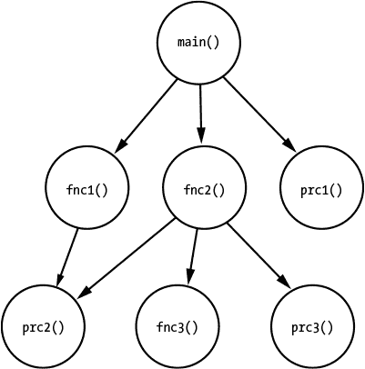
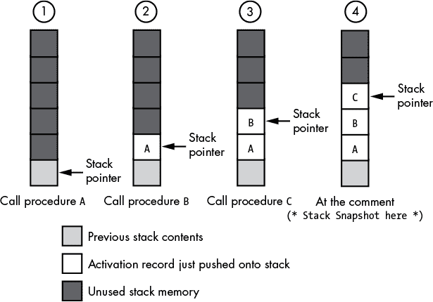
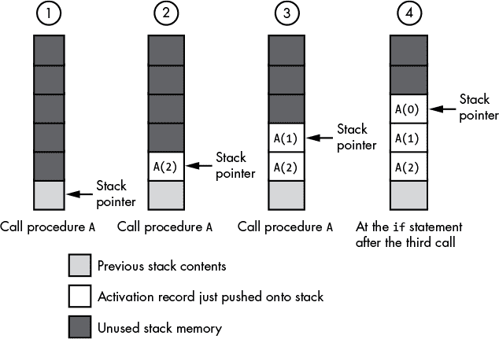
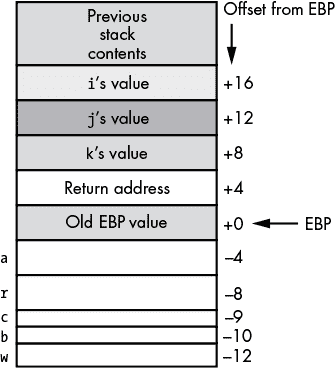
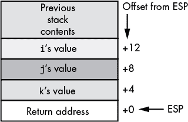
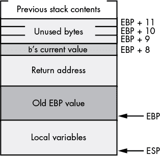

# 第十五章：**函数和过程**


自从 1970 年代结构化编程革命开始以来，子程序（过程和函数）一直是软件工程师用来组织、模块化和构建程序的主要工具之一。由于过程和函数调用在代码中使用频繁，CPU 制造商尝试使它们尽可能高效。然而，这些调用及其相关的返回操作存在成本，许多程序员在创建函数时未考虑到这些成本，不恰当地使用它们可能会大幅增加程序的大小和执行时间。本章将讨论这些成本及如何避免它们，涵盖以下主题：

+   函数和过程调用

+   宏和内联函数

+   参数传递和调用约定

+   激活记录和局部变量

+   参数传递机制

+   函数返回结果

通过理解这些主题，你可以避免现代程序中常见的效率陷阱，这些程序大量使用过程和函数。

### 15.1 简单的函数和过程调用

我们从一些定义开始。*函数*是一个计算并返回某个值的代码块——即函数结果。*过程*（或在 C/C++/Java/Swift 术语中称为*无返回函数*）仅仅执行某些操作。函数调用通常出现在算术或逻辑表达式中，而过程调用则像编程语言中的语句。为了讨论的目的，你可以假设过程调用和函数调用是相同的，可以互换使用*函数*和*过程*这两个术语。大多数情况下，编译器对过程和函数调用的实现是一样的。

**注意**

*函数和过程确实存在一些差异。然而，函数结果相关的效率问题是其中之一，我们将在“函数返回值”一节中讨论，详见第 590 页。*

在大多数 CPU 上，你通过类似于 80x86 的`call`指令（ARM 和 PowerPC 上的`branch`和`link`）调用过程，并使用`ret`（返回）指令返回调用者。`call`指令执行三项离散操作：

1.  它决定了从过程返回时要执行的指令地址（通常是紧随`call`指令后的那条指令）。

1.  它将此地址（通常称为*返回地址*或*链接地址*）保存到一个已知位置。

1.  它通过跳转机制将控制权转移到过程的第一条指令。

执行从过程的第一条指令开始，直到 CPU 遇到`ret`指令，这时会获取返回地址并将控制权转移到该地址处的机器指令。考虑以下 C 语言函数：

```

			#include <stdio.h>

void func( void )
{
    return;
}
int main( void )
{
    func();
    return( 0 );
}
```

这是 GCC 将其转换为 PowerPC 代码后的结果：

```

			_func:
        ; Set up activation record for function.
        ; Note R1 is used as the stack pointer by
        ; the PowerPC ABI (application binary
        ; interface, defined by IBM).

        stmw r30,-8(r1)
        stwu r1,-48(r1)
        mr r30,r1

        ; Clean up activation record prior to the return

        lwz r1,0(r1)
        lmw r30,-8(r1)

        ; Return to caller (branch to address
        ; in the link register):

        blr

_main:
        ; Save return address from
        ; main program (so we can
        ; return to the OS):

        mflr r0
        stmw r30,-8(r1) ; Preserve r30/31
        stw r0,8(r1)    ; Save rtn adrs
        stwu r1,-80(r1) ; Update stack for func()
        mr r30,r1       ; Set up frame pointer

        ; Call func:

        bl _func

        ; Return 0 as the main
        ; function result:

        li r0,0
        mr r3,r0
        lwz r1,0(r1)
        lwz r0,8(r1)
        mtlr r0
        lmw r30,-8(r1)
        blr
```

这是由 GCC 编译的 32 位 ARM 版本源代码：

```

			func:
    @ args = 0, pretend = 0, frame = 0
    @ frame_needed = 1, uses_anonymous_args = 0
    @ link register save eliminated.

    str fp, [sp, #-4]!  @ Save frame pointer on stack
    add fp, sp, #0
    nop
    add sp, fp, #0
    @ sp needed
    ldr fp, [sp], #4    @ Load FP from stack.
    bx  lr              @ Return from subroutine

main:
    @ args = 0, pretend = 0, frame = 0
    @ frame_needed = 1, uses_anonymous_args = 0

    push    {fp, lr}    @ Save FP and return address

    add fp, sp, #4      @ Set up FP
    bl  func            @ Call func
    mov r3, #0          @ main return value = 0
    mov r0, r3

    @ Note that popping PC returns to Linux
    pop {fp, pc}
```

下面是 GCC 将相同源代码转换为 80x86 代码的结果：

```

			func:
.LFB0:
    pushq   %rbp
    movq    %rsp, %rbp
    nop
    popq    %rbp
    ret

main:
.LFB1:
    pushq   %rbp
    movq    %rsp, %rbp
    call    func
    movl    $0, %eax
    popq    %rbp
    ret
```

如你所见，80x86、ARM 和 PowerPC 都花费了相当大的努力来构建和管理激活记录（请参阅第 179 页的“栈部分”）。在这两段汇编语言序列中，重要的是要注意 PowerPC 代码中的`bl _func`和`blr`指令；ARM 代码中的`bl func`和`bx lr`指令；以及 80x86 代码中的`call func`和`ret`指令。这些是调用函数和从函数返回的指令。

#### 15.1.1 返回地址存储

那么，CPU 到底将返回地址存储在哪里呢？在没有递归和某些其他程序控制结构的情况下，CPU 可以将返回地址存储在任何足够大的位置，只要这个位置在过程返回调用者时仍然包含该地址。例如，程序可以选择将返回地址存储在机器寄存器中（在这种情况下，返回操作将是间接跳转到寄存器中包含的地址）。然而，使用寄存器有一个问题，那就是 CPU 通常只有有限数量的寄存器。这意味着每个保存返回地址的寄存器都不能用于其他目的。因此，在那些将返回地址保存在寄存器中的 CPU 上，应用程序通常会将返回地址移动到内存中，以便可以重用该寄存器。

考虑 PowerPC 和 ARM 的`bl`（分支和链接）指令。该指令将控制转移到其操作数指定的目标地址，并将`bl`后面的指令地址复制到 LINK 寄存器中。在一个过程内部，如果没有代码修改 LINK 寄存器的值，则该过程可以通过执行 PowerPC 的`blr`（分支到 LINK 寄存器）或 ARM 的`bx`（分支和交换）指令来返回到调用者。在我们简单的示例中，`func()`函数没有执行任何修改 LINK 寄存器值的代码，因此这正是`func()`返回到其调用者的方式。然而，如果该函数将 LINK 寄存器用于其他目的，那么过程就需要负责保存返回地址，以便在函数调用结束时通过`blr`指令恢复返回地址。

一个更常见的保存返回地址的地方是内存。尽管在大多数现代处理器上，访问内存的速度比访问 CPU 寄存器慢得多，但将返回地址保存在内存中允许程序有大量的嵌套过程调用。大多数 CPU 实际上使用*栈*来保存返回地址。例如，80x86 的`call`指令*将*返回地址压入内存中的栈数据结构，而`ret`指令*将*这个返回地址从栈中弹出。使用内存位置的栈来保存返回地址有几个优点：

+   栈由于其*后进先出 (LIFO)* 的组织方式，完全支持嵌套过程调用和返回以及递归过程调用和返回。

+   栈具有内存效率，因为它们重用相同的内存位置来存储不同过程的返回地址（而不是需要单独的内存位置来存储每个过程的返回地址）。

+   即使栈访问比寄存器访问慢，CPU 通常也能比访问其他地方的返回地址更快地访问栈上的内存位置，因为 CPU 频繁访问栈，并且栈内容通常会保存在缓存中。

+   如第七章所述，栈也是存储激活记录（如参数、局部变量和其他过程状态信息）的好地方。

然而，使用栈也会带来一些惩罚。最重要的是，维护栈通常需要分配一个 CPU 寄存器来跟踪栈在内存中的位置。这可能是 CPU 专门为此目的分配的寄存器（例如，x86-64 的 RSP 寄存器或 ARM 的 R14/SP 寄存器），或者是没有提供显式硬件栈支持的 CPU 上的通用寄存器（例如，运行在 PowerPC 处理器系列上的应用通常使用 R1 寄存器来完成此任务）。

在提供硬件栈实现和`call`/`ret`指令对的 CPU 上，进行过程调用非常简单。如前面 80x86 GCC 示例输出所示，程序只需执行`call`指令将控制转移到过程的开始，然后执行`ret`指令从过程返回。

PowerPC/ARM 的方式，使用“分支和链接”指令，可能看起来比`call`/`ret`机制效率低。虽然“分支和链接”方法确实需要稍微多一些代码，但并不明显比`call`/`ret`方法慢。`call`指令是一条复杂指令（通过一条指令完成多个独立任务），因此通常需要几个 CPU 时钟周期来执行。`ret`指令的执行类似。额外的开销是否比维护软件栈更昂贵，取决于 CPU 和编译器。然而，“分支和链接”指令以及通过链接地址的间接跳转，通常比相应的`call`/`ret`指令对更快，因为没有维护软件栈的开销。如果一个过程不调用其他过程，并且能够在机器寄存器中维护参数和局部变量，那么完全可以跳过软件栈维护指令。例如，前面示例中的`func()`调用在 PowerPC 和 ARM 上可能比在 80x86 上更高效，因为`func()`不需要将 LINK 寄存器的值保存到内存中——它只是将该值保持在 LINK 寄存器中，直到函数执行完成。

由于许多过程较短，且参数和局部变量较少，一个好的 RISC 编译器通常能够完全省去软件栈的维护。因此，对于许多常见的过程，这种 RISC 方法比 CISC（`call`/`ret`）方法更快；然而，这并不意味着它总是更好。本节中的简短示例是一个非常特殊的情况。在我们的简单演示程序中，这段代码调用的函数——通过`bl`指令——离`bl`指令很近。在一个完整的应用程序中，`func()`可能会*非常*远，而编译器将无法将目标地址编码为指令的一部分。这是因为 RISC 处理器（如 PowerPC 和 ARM）必须将整个指令编码在一个 32 位值内（该值必须同时包括操作码和到函数的偏移量）。如果`func()`的距离超出了剩余偏移位（在 PowerPC 和 ARM 的`bl`指令中为 24 位）所能编码的范围，编译器必须发出一系列指令来计算目标例程的地址，并通过该地址间接转移控制权。大多数时候，这不应该是个问题。毕竟，很少有程序的函数会超出这个范围（在 PowerPC 中为 64MB，ARM 为±32MB）。然而，有一个非常常见的情况是 GCC（以及其他编译器，可能也一样）必须生成这种类型的代码：当编译器不知道函数的目标地址时，因为它是一个外部符号，链接器必须在编译完成后将其合并进来。因为编译器不知道该例程将在内存中的哪个位置（而且大多数链接器仅处理 32 位地址，而不是 24 位的偏移量字段），编译器必须假设该函数的地址超出了范围，并生成长版本的函数调用。考虑一下对之前示例的轻微修改：

```

			#include <stdio.h>

extern void func( void );

int main( void )
{
    func();

    return( 0 );
}
```

这段代码将`func()`声明为外部函数。现在看看 GCC 生成的 PowerPC 代码，并与之前的代码进行比较：

```

			.text
        .align 2
        .globl _main
_main:
        ; Set up main's activation record:

        mflr r0
        stw r0,8(r1)
        stwu r1,-80(r1)

        ; Call a "stub" routine that will
        ; do the real call to func():

        bl L_func$stub

        ; Return 0 as Main's function
        ; result:

        lwz r0,88(r1)
        li r3,0
        addi r1,r1,80
        mtlr r0
        blr

; The following is a stub that calls the
; real func() function, wherever it is in
; memory.

        .data
        .picsymbol_stub
L_func$stub:
        .indirect_symbol _func

        ; Begin by saving the LINK register
        ; value in R0 so we can restore it
        ; later.

        mflr r0

        ; The following code sequence gets
        ; the address of the L_func$lazy_ptr
        ; pointer object into R12:

        bcl 20,31,L0$_func      ; R11<-adrs(L0$func)
L0$_func:
        mflr r11
        addis r11,r11,ha16(L_func$lazy_ptr-L0$_func)

        ; Restore the LINK register (used by the
        ; preceding code) from R0:

        mtlr r0

        ; Compute the address of func() and move it
        ; into the PowerPC COUNT register:

        lwz r12,lo16(L_func$lazy_ptr-L0$_func)(r11)
        mtctr r12

        ; Set up R11 with an environment pointer:

        addi r11,r11,lo16(L_func$lazy_ptr-L0$_func)

        ; Branch to address held in the COUNT
        ; register (that is, to func):

        bctr

; The linker will initialize the following
; dword (.long) value with the address of
; the actual func() function:

        .data
        .lazy_symbol_pointer
L_func$lazy_ptr:
        .indirect_symbol _func
        .long dyld_stub_binding_helper
```

这段代码实际上调用了两个函数来调用`func()`。首先，它调用一个*存根*函数（`L_func$stub`），然后将控制权转交给实际的`func()`函数。显然，这里有相当大的开销。如果不对 PowerPC 代码与 80x86 代码进行实际的基准测试，推测 80x86 解决方案可能会更高效一些。（即使在编译外部引用时，80x86 版本的 GCC 编译器也会生成与之前示例中相同的主程序代码。）很快你会发现，PowerPC 也会为除外部函数之外的其他情况生成存根函数。因此，CISC 解决方案通常比 RISC 解决方案更高效（大概 RISC 处理器在其他方面弥补了性能差距）。

Microsoft CLR 还提供了通用的调用和返回功能。考虑以下带有静态函数`f()`的 C# 程序：

```

			using System;

namespace Calls_f
{
     class program
      {
        static void f()
        {
            return;
        }
        static void Main( string[] args)
        {
            f();
        }
      }
}
```

以下是 Microsoft C# 编译器为函数`f()`和`Main()`生成的 CIL 代码：

```

			.method private hidebysig static void  f() cil managed
{
  // Code size       4 (0x4)
  .maxstack  8
  IL_0000:  nop
  IL_0001:  br.s       IL_0003
  IL_0003:  ret
} // end of method program::f

.method private hidebysig static void  Main(string[] args) cil managed
{
  .entrypoint
  // Code size       8 (0x8)
  .maxstack  8
  IL_0000:  nop
  IL_0001:  call       void Calls_f.program::f()
  IL_0006:  nop
  IL_0007:  ret
} // end of method program::Main
```

作为最后一个例子，这是一个类似的 Java 程序：

```

			public class Calls_f
{
    public static void f()
    {
        return;
    }

    public static void main( String[] args )
    {
        f();
    }
}
```

以下是 Java 字节码（JBC）输出：

```

			Compiled from "Calls_f.java"
public class Calls_f extends java.lang.Object{
public Calls_f();
  Code:
   0:   aload_0
        //call Method java/lang/Object."<init>":()
   1:   invokespecial   #1;
   4:   return

public static void f();
  Code:
   0:   return

public static void main(java.lang.String[]);
  Code:
   0:   invokestatic    #2; //Method f:()
   3:   return

}
```

请注意，Microsoft CLR 和 Java VM 都有多种调用和调用指令变体。这些简单的例子展示了对静态方法的调用。

#### 15.1.2 其他开销来源

当然，一个典型的过程调用和返回涉及的开销不仅仅是执行实际的过程`call`和`return`指令。在调用过程之前，调用代码必须计算并传递任何参数给它。进入过程后，调用代码还可能需要完成*激活记录*的构建（即为局部变量分配空间）。这些操作的开销因 CPU 和编译器而异。例如，如果调用代码能够通过寄存器而非栈（或其他内存位置）传递参数，通常会更高效。同样，如果过程能够将所有局部变量保存在寄存器中，而不是在栈上的激活记录中，那么访问这些局部变量会更高效。这是 RISC 处理器相较于 CISC 处理器的一个重要优势。典型的 RISC 编译器可以为传递参数和局部变量保留多个寄存器。（RISC 处理器通常具有 16、32 个或更多通用寄存器，因此为此目的保留几个寄存器并不算过分。）对于那些不调用其他过程的过程（将在下一节讨论），无需保存这些寄存器的值，因此参数和局部变量的访问非常高效。即使在寄存器数量有限的 CPU（如 32 位 80x86）上，仍然可以在寄存器中传递少量参数，或者保持少量局部变量。例如，许多 80x86 编译器会将最多三个值（参数或局部变量）保存在寄存器中。显然，RISC 处理器在这方面具有优势。^(1)

拥有这些知识，并结合本书前面关于激活记录和栈帧的背景（参见 第 179 页中的《栈部分》），我们现在可以讨论如何编写高效的过程和函数。具体的规则高度依赖于您的 CPU 和使用的编译器，但一些概念足够通用，可以应用于所有程序。以下各节假设您是在为 80x86 或 ARM CPU 编写程序（因为世界上大多数软件运行在这两种 CPU 上之一）。

### 15.2 叶函数和过程

编译器通常能够为*叶子*过程和函数生成更好的代码——也就是那些不调用其他过程或函数的过程和函数。这个隐喻来源于一种叫做*调用树*的过程/函数调用图形表示。调用树由一组圆圈（*节点*）组成，这些圆圈表示程序中的函数和过程。从一个节点到另一个节点的箭头表示第一个节点包含对第二个节点的调用。图 15-1 展示了一个典型的调用树。

在这个例子中，主程序直接调用过程`prc1()`和函数`fnc1()`以及`fnc2()`。函数`fnc1()`直接调用过程`prc2()`。函数`fnc2()`直接调用过程`prc2()`和`prc3()`，以及函数`fnc3()`。在这个调用树中，叶子过程和函数是`prc1()`、`prc2()`、`fnc3()`和`prc3()`，它们没有调用任何其他过程或函数。



*图 15-1：调用树*

处理叶子过程和函数有一个优势：它们不需要将传递给它们的参数保存在寄存器中，也不需要保持它们在寄存器中维护的局部变量的值。例如，如果`main()`将两个参数通过 EAX 和 EDX 寄存器传递给`fnc1()`，而`fnc1()`将一对不同的参数通过 EAX 和 EDX 传递给`prc2()`，那么`fnc1()`必须在调用`prc2()`之前先保存 EAX 和 EDX 中的值。另一方面，`prc2()`过程则不需要在调用某个过程或函数之前保存 EAX 和 EDX 中的值，因为它不会进行这样的调用。同样，如果`fnc1()`在寄存器中分配了任何局部变量，那么它在调用`prc2()`时需要保留这些寄存器的值，因为`prc2()`可以将这些寄存器用于它自己的目的。相反，如果`prc2()`使用寄存器来存储局部变量，它就不需要保留该变量的值，因为它从不调用任何子程序。因此，优秀的编译器通常会为叶子过程和函数生成更好的代码，因为它们不需要保存寄存器的值。

将调用树*扁平化*的一种方式是将内部节点中与过程和函数相关的代码内联到调用树中更高的函数中。例如，在图 15-1 中，如果将`fnc1()`的代码移到`main()`中是可行的，那么就不需要保存和恢复寄存器（以及其他操作）。然而，在扁平化调用树时，要确保你没有牺牲可读性和可维护性。你希望避免编写那些仅仅调用其他过程和函数而自己不做任何工作的过程和函数，但你也不希望通过在代码中扩展函数和过程调用来破坏应用程序设计的模块化。

你已经看到，当使用 RISC 处理器（如 PowerPC 或 ARM）时，具有叶子函数是很方便的，因为它们使用“分支和链接”指令来进行子程序调用。PowerPC 和 ARM 的 LINK 寄存器就是必须在过程调用中保留的寄存器的良好示例。因为叶子过程通常不修改 LINK 寄存器的值，所以在叶子过程中不需要额外的代码来保留该寄存器的值。要了解在 RISC CPU 上调用叶子函数的好处，可以参考以下 C 代码：

```

			void g( void )
{
    return;
}

void f( void )
{
    g();
    g();
    return;
}

int main( void )
{
    f();
    return( 0 );
}
```

GCC 生成以下 PowerPC 汇编代码：

```

			; g's function code:

_g:
        ; Set up g's environment
        ; (set up activation record):

        stmw r30,-8(r1)
        stwu r1,-48(r1)
        mr r30,r1

        ; Tear down the activation
        ; record.

        lwz r1,0(r1)
        lmw r30,-8(r1)

        ; Return to caller via LINK:

        blr

; f's function code:

_f:
        ; Set up activation record,
        ; including saving the value
        ; of the LINK register:

        mflr r0         ; R0 = LINK
        stmw r30,-8(r1)
        stw r0,8(r1)    ; Save LINK
        stwu r1,-80(r1)
        mr r30,r1

        ; Call g (twice):

        bl _g
        bl _g

        ; Restore LINK from the
        ; activation record and
        ; then clean up activation
        ; record:

        lwz r1,0(r1)
        lwz r0,8(r1)    ; R0 = saved adrs
        mtlr r0         ; LINK = RO
        lmw r30,-8(r1)

        ; Return to main function:

        blr

; Main function code:

_main:
        ; Save main's return
        ; address into main's
        ; activation record:

        mflr r0
        stmw r30,-8(r1)
        stw r0,8(r1)
        stwu r1,-80(r1)
        mr r30,r1

        ; Call the f function:

        bl _f

        ; Return 0 to whomever
        ; called main:

        li r0,0
        mr r3,r0
        lwz r1,0(r1)
        lwz r0,8(r1)    ; Move saved return
        mtlr r0         ; address to LINK
        lmw r30,-8(r1)
        ; Return to caller:

        blr
```

在这段 PowerPC 代码中，`f()`和`g()`函数的实现有一个重要区别——`f()`必须保留 LINK 寄存器的值，而`g()`则不需要。这样不仅涉及额外的指令，而且还涉及访问内存，这可能会比较慢。

使用叶子过程的另一个优点是，从调用树上看不出来的，就是构建它们的激活记录需要更少的工作。例如，在 80x86 架构上，一个优秀的编译器不需要保留 EBP 寄存器的值，不需要将 EBP 加载为激活记录的地址，然后通过栈指针寄存器（ESP）访问局部对象来恢复原始值。而在手动管理栈的 RISC 处理器上，这种节省可能是显著的。对于这些过程，过程调用和返回以及激活记录维护的开销大于过程实际执行的工作。因此，消除激活记录维护代码几乎可以使过程的速度加倍。基于这些原因，你应该尽量保持调用树尽可能浅。程序中使用的叶子过程越多，使用合适编译器编译时程序的效率可能越高。

### 15.3 宏和内联函数

结构化编程革命的一个结果是，计算机程序员被教导编写小型、模块化且逻辑连贯的函数^(2)。一个逻辑连贯的函数能做好一件事。该过程或函数中的所有语句都专注于完成手头的任务，不进行任何副计算或无关操作。多年的软件工程研究表明，将问题分解为小组件，然后实现这些组件，能生成更容易阅读、维护和修改的程序。不幸的是，很容易在这个过程中过度设计，产生像下面这个 Pascal 示例这样的函数：

```

			function sum( a:integer; b:integer ):integer;
begin

       (* returns sum of a & b as function result *)

        sum := a + b;

end;
      .
      .
      .
sum( aParam, bParam );
```

在 80x86 上，计算两个值的和并将其存储到内存变量中大约需要三条指令。例如：

```

			mov( aParam, eax );
add( bParam, eax );
mov( eax, destVariable );
```

将其与简单*调用*函数`sum()`所需的代码进行对比：

```

			push( aParam );
push( bParam );
call sum;
```

在`sum`过程内（假设使用一个普通编译器），你可能会看到如下 HLA 代码：

```

			// Construct the activation record

push( ebp );
mov( esp, ebp );

// Get aParam's value

mov( [ebp+12], eax );

// Compute their sum and return in EAX

add( [ebp+8], eax );

// Restore EBP's value

pop( ebp );

// Return to caller, cleaning up
// the activation record.

ret( 8 );
```

如你所见，使用一个函数来计算这两个对象的和，比直接的（没有函数调用的）代码需要更多三倍的指令。更糟糕的是，这九条指令通常比构成内联代码的三条指令要慢。内联代码的运行速度可能比带有函数调用的代码快 5 到 10 倍。

关于函数或过程调用的开销，唯一值得肯定的优点是它是固定的。不管过程或函数体包含 1 条还是 1,000 条机器指令，设置参数和激活记录所需的指令数是相同的。尽管当过程体较小时，过程调用的开销很大，但当过程体较大时，这种开销几乎可以忽略不计。因此，为了减少程序中过程/函数调用的开销影响，尽量将较大的过程和函数放置为内联代码，并编写较短的序列。

在模块化结构的好处与过于频繁的过程调用成本之间找到最佳平衡可能很困难。不幸的是，良好的程序设计通常会阻止我们将过程和函数的大小增加到足以使调用和返回的开销变得微不足道的程度。确实，我们可以将多个函数和过程调用合并为一个过程或函数，但这会违反几个编程风格的规则，而且优秀的代码通常避免使用这种策略。（这样产生的程序的一个问题是，很少有人能够弄清楚它们是如何工作的，从而优化它们。）然而，如果通过增加过程的大小不能足够降低过程体的开销，你仍然可以通过其他方式减少开销，从而提高整体性能。正如你所看到的，一个选项是使用叶子过程和函数。优秀的编译器对调用树中的叶节点生成更少的指令，从而减少调用/返回的开销。然而，如果过程体很短，你需要一种方法来完全消除过程调用/返回的开销。有些语言通过*宏*实现这一点。

*纯*宏会将过程或函数的主体直接扩展为调用位置。由于没有程序中其他地方的调用/返回，宏扩展避免了与这些指令相关的开销。此外，宏还通过使用文本替换参数而不是将参数数据推入栈或将其移动到寄存器中，节省了相当大的开销。宏的缺点是编译器会为每次调用宏时扩展宏的主体。如果宏的主体很大，并且你在多个地方调用它，那么可执行程序的体积可能会增加相当多。宏代表了经典的时间/空间权衡：通过增加大小来换取更快的代码。因此，除非在某些对速度要求极高的罕见情况下，否则应只使用宏来替代语句较少的过程和函数（比如说，一到五个语句）。

一些语言（如 C/C++）提供了 *内联* 函数和过程，它们是函数（或过程）和纯宏之间的结合体。大多数支持内联函数和过程的语言并不保证编译器会进行内联扩展。*内联扩展*，或调用内存中的实际函数，是由编译器决定的。如果函数体太大，或者有过多的参数，大多数编译器不会将内联函数扩展出来。此外，与纯宏不同，纯宏没有任何关联的过程调用开销，而内联函数可能仍然需要构建一个激活记录，以处理局部变量、临时变量以及其他需求。因此，即使编译器确实进行了内联扩展，可能仍然会有一些额外开销，这些是使用纯宏时不会遇到的。

要查看函数内联的结果，请考虑以下由 Microsoft Visual C++ 准备进行编译的 C 源文件：

```

			#include <stdio.h>

// Make geti and getj external functions
// to thwart constant propagation so we
// can see the effects of the following
// code.

extern int geti( void );
extern int getj( void );

// Inline function demonstration. Note
// that "_inline" is the legacy MSVC++ "C" way
// of specifying an inline function (the
// actual "inline" keyword was a C++/C99 feature,
// which this code avoids in order to make
// the assembly output a little more readable).
//
//
// "inlineFunc" is a simple inline function
// that demonstrates how the C/C++ compiler
// does a simple inline macro expansion of
// the function:

_inline int inlineFunc( int a, int b )
{
    return a + b;
}

_inline int ilf2( int a, int b )
{
    // Declare some variable that will require
    // an activation record to be built (that is,
    // register allocation won't be sufficient):

    int m;
    int c[4];
    int d;

    // Make sure we use the "c" array so that
    // the optimizer doesn't ignore its
    // declaration:

    for( m = 0; m < 4; ++m )
    {
        c[m] = geti();
    }
    d = getj();
    for( m = 0; m < 4; ++m )
    {
        d += c[m];
    }
    // Return a result to the calling program:

    return (a + d) - b;
}

int main( int argc, char **argv )
{
    int i;
    int j;
    int sum;
    int result;

    i = geti();
    j = getj();
    sum = inlineFunc( i, j );
    result = ilf2( i, j );
    printf( "i+j=%d, result=%d\n", sum, result );
    return 0;
}
```

这是 MSVC 在指定 C 编译时（与 C++ 编译时不同，后者会产生更为混乱的输出）生成的与 MASM 兼容的汇编语言代码：

```

			_main      PROC NEAR
main    PROC
;
; Create the activation record:
;
$LN6:
        mov     QWORD PTR [rsp+8], rbx
        push    rdi
        sub     rsp, 32        ; 00000020H
; Line 66
;
; i = geti();
;
        call    ?geti@@YAHXZ   ; geti -- returns result in EAX
        mov     edi, eax       ; Save i in edi

; Line 67
;
; j = getj();
;
        call    ?getj@@YAHXZ   ; getj -- Returns result in EAX
; Line 69
;
; Inline expansion of inlineFunc()
;
        mov     edx, eax       ; Pass j in EDX
        mov     ecx, edi       ; Pass i in ECX
        mov     ebx, eax       ; Use EBX as "sum" local
        call    ?ilf2@@YAHHH@Z ; ilf2

;       Computes sum = i+j (inline)

        lea     edx, DWORD PTR [rbx+rdi]

; Line 70
;
; Call to printf function:

        mov     r8d, eax
        lea     rcx, OFFSET FLAT:??_C@_0BD@INCDFJPK@i?$CLj?$DN?$CFd?0?5result?$DN?$CFd?6?$AA@
        call    printf
; Line 72
;
; Return from main function
;
        mov     rbx, QWORD PTR [rsp+48]
        xor     eax, eax
        add     rsp, 32        ; 00000020H
        pop     rdi
        ret     0
main    ENDP

?ilf2@@YAHHH@Z PROC            ; ilf2, COMDAT
; File v:\t.cpp
; Line 30
$LN24:
        mov     QWORD PTR [rsp+8], rbx
        mov     QWORD PTR [rsp+16], rsi
        push    rdi
        sub     rsp, 64        ; 00000040H
;
; Extra code to help prevent hacks from messing with
; stack data (clears array data to prevent observing old
; memory data).

        mov     rax, QWORD PTR __security_cookie
        xor     rax, rsp
        mov     QWORD PTR __$ArrayPad$[rsp], rax
        mov     edi, edx
        mov     esi, ecx
; Line 43
; Loop to fill "v" array:
;
        xor     ebx, ebx
$LL4@ilf2:
; Line 45
        call    ?geti@@YAHXZ   ; geti
        mov     DWORD PTR c$[rsp+rbx*4], eax
        inc     rbx
        cmp     rbx, 4
        jl      SHORT $LL4@ilf2

; Line 47
;
; d = getj();
;
        call    ?getj@@YAHXZ   ; getj
; Line 50
;
; Second for loop is unrolled and expanded inline:
;
; d += c[m];

        mov     r8d, DWORD PTR c$[rsp+8]
        add     r8d, DWORD PTR c$[rsp+12]
        add     r8d, DWORD PTR c$[rsp]
        add     r8d, DWORD PTR c$[rsp+4]
;
; return (a+d) - b
;
        add     eax, r8d
; Line 55
        sub     eax, edi
        add     eax, esi
; Line 56
;
; Verify code did not mess with stack before leaving
; (array overflow):
;
        mov     rcx, QWORD PTR __$ArrayPad$[rsp]
        xor     rcx, rsp
        call    __security_check_cookie
        mov     rbx, QWORD PTR [rsp+80]
        mov     rsi, QWORD PTR [rsp+88]
        add     rsp, 64        ; 00000040H
        pop     rdi
        ret     0
?ilf2@@YAHHH@Z ENDP            ; ilf2

?inlineFunc@@YAHHH@Z PROC      ; inlineFunc, COMDAT
; File v:\t.cpp
; Line 26
        lea     eax, DWORD PTR [rcx+rdx]
; Line 27
        ret     0
?inlineFunc@@YAHHH@Z ENDP      ; inlineFunc
```

正如您在这个汇编输出中看到的那样，`inlineFunc()` 函数没有被调用。相反，编译器在 `main()` 函数中扩展了这个函数，扩展的位置正是主程序调用它的地方。虽然 `ilf2()` 函数也被声明为内联，编译器拒绝将其内联扩展，并将其视为普通函数（可能是因为它的大小）。

### 15.4 将参数传递给函数或过程

参数的数量和类型也会对编译器为你的过程和函数生成的代码效率产生重大影响。简而言之，传递的参数数据越多，过程或函数调用的开销就越大。通常，程序员会调用（或设计）需要传递多个可选参数的通用函数，而这些参数的值函数可能并不会使用。这种方案可以让函数在不同的应用程序中更具通用性，但正如你将在本节中看到的那样，这种通用性是有代价的，因此，如果空间或速度是问题，你可能需要考虑使用针对特定应用程序的函数版本。

参数传递机制（例如，传值或传引用）也会影响过程调用和返回时的开销。一些语言允许你通过值传递大数据对象。（例如，Pascal 允许传递字符串、数组和记录作为值，C/C++ 允许传递结构体作为值；其他语言的设计有所不同。）每当你通过值传递大数据对象时，编译器必须生成机器代码来将该数据复制到过程的激活记录中。这可能是一个耗时的过程（特别是当复制大型数组或结构时）。此外，大对象可能无法适应 CPU 的寄存器集，因此在过程或函数内访问这些数据会变得很昂贵。通常，通过引用传递像数组和结构体这样的大型数据对象比通过值传递更高效。间接访问数据的额外开销通常通过避免将数据复制到激活记录中得以节省，通常是几倍地节省。考虑以下 C 代码，其中将一个大型结构体通过值传递给 C 函数：

```

			#include <stdio.h>

typedef struct
{
    int array[256];
} a_t;

void f( a_t a )
{
    a.array[0] = 0;
    return;
}

int main( void )
{
    a_t b;

    f( b );
    return( 0 );
}
```

这是 GCC 发出的 PowerPC 代码：

```

			_f:
        li r0,0 ; To set a.array[0] = 0

        ; Note: the PowerPC ABI passes the
        ; first eight dwords of data in
        ; R3..R10\. We need to put that
        ; data back into the memory array
        ; here:

        stw r4,28(r1)
        stw r5,32(r1)
        stw r6,36(r1)
        stw r7,40(r1)
        stw r8,44(r1)
        stw r9,48(r1)
        stw r10,52(r1)

        ; Okay, store 0 into a.array[0]:

        stw r0,24(r1)

        ; Return to caller:

        blr

; main function:

_main:

        ; Set up main's activation record:

        mflr r0
        li r5,992
        stw r0,8(r1)

        ; Allocate storage for a:

        stwu r1,-2096(r1)

        ; Copy all but the first
        ; eight dwords to the
        ; activation record for f:

        addi r3,r1,56
        addi r4,r1,1088
        bl L_memcpy$stub

        ; Load the first eight dwords
        ; into registers (as per the
        ; PowerPC ABI):

        lwz r9,1080(r1)
        lwz r3,1056(r1)
        lwz r10,1084(r1)
        lwz r4,1060(r1)
        lwz r5,1064(r1)
        lwz r6,1068(r1)
        lwz r7,1072(r1)
        lwz r8,1076(r1)

        ; Call the f function:

        bl _f

        ; Clean up the activation record
        ; and return 0 to main's caller:

        lwz r0,2104(r1)
        li r3,0
        addi r1,r1,2096
        mtlr r0
        blr

; Stub function that copies the structure
; data to the activation record for the
; main function (this calls the C standard
; library memcpy function to do the actual copy):

        .data
        .picsymbol_stub
L_memcpy$stub:
        .indirect_symbol _memcpy
        mflr r0
        bcl 20,31,L0$_memcpy
L0$_memcpy:
        mflr r11
        addis r11,r11,ha16(L_memcpy$lazy_ptr-L0$_memcpy)
        mtlr r0
        lwz r12,lo16(L_memcpy$lazy_ptr-L0$_memcpy)(r11)
        mtctr r12
        addi r11,r11,lo16(L_memcpy$lazy_ptr-L0$_memcpy)
        bctr
.data
.lazy_symbol_pointer
L_memcpy$lazy_ptr:
        .indirect_symbol _memcpy
        .long dyld_stub_binding_helper
```

如你所见，对函数 `f()` 的调用通过 `memcpy` 将数据从 `main()` 函数的局部数组复制到 `f()` 函数的激活记录中。再次强调，复制内存是一个慢过程，这段代码充分展示了你应该避免通过值传递大型对象。考虑在通过引用传递结构体时的相同代码：

```

			#include <stdio.h>

typedef struct
{
    int array[256];
} a_t;

void f( a_t *a )
{
    a->array[0] = 0;
    return;
}

int main( void )
{
    a_t b;
    f( &b );
    return( 0 );
}
```

这是 GCC 将该 C 源代码转换为 32 位 ARM 汇编的代码：

```

			f:
    @ Build activation record:

    str fp, [sp, #-4]!  @ Push old FP on stack
    add fp, sp, #0      @ FP = SP
    sub sp, sp, #12     @ Reserve storage for locals
    str r0, [fp, #-8]   @ Save pointer to 'a'
    ldr r3, [fp, #-8]   @ r3 = a

    @ a->array[0] = 0;

    mov r2, #0
    str r2, [r3]
    nop

    @ Remove locals from stack.

    add sp, fp, #0

    @ Pop FP from stack:

    ldr fp, [sp], #4

    @ Return to main function:

    bx  lr

main:
    @ Save Linux return address and FP:

    push    {fp, lr}
 @ Set up activation record:

    add fp, sp, #4
    sub sp, sp, #1024   @ Reserve storage for b
    sub r3, fp, #1024   @ R3 = &b
    sub r3, r3, #4

    mov r0, r3          @ Pass &b to f in R0
    bl  f               @ Call f

    @ Return 0 result to Linux:

    mov r3, #0
    mov r0, r3
    sub sp, fp, #4      @ Clean up stack frame
    pop {fp, pc}        @ Returns to Linux
```

根据你的 CPU 和编译器，将小（标量）数据对象通过值传递可能比通过引用传递更高效。例如，如果你使用的是 80x86 编译器并且参数通过栈传递，那么传递一个内存对象时通过引用需要两条指令，而通过值传递只需要一条指令。因此，尽管尝试通过引用传递大对象是一个好主意，但对于小对象而言，通常相反。不过，这并不是一条死板的规则；它的有效性取决于你使用的 CPU 和编译器。

一些程序员可能会认为通过全局变量将数据传递给过程或函数更加高效。毕竟，如果数据已经存储在一个全局变量中，且该全局变量对过程或函数是可访问的，那么调用该过程或函数时就不需要额外的指令来传递数据给子程序，从而减少了调用开销。尽管这看起来是一个巨大的优势，但要记住，编译器在优化大量使用全局变量的程序时会遇到困难。虽然使用全局变量可能减少函数/过程调用的开销，但也可能会妨碍编译器处理其他本可以实现的优化。下面是一个简单的 Microsoft Visual C++示例，展示了这个问题：

```

			#include <stdio.h>

// Make geti an external function
// to thwart constant propagation so we
// can see the effects of the following
// code.

extern int geti( void );

// globalValue is a global variable that
// we use to pass data to the "usesGlobal"
// function:

int globalValue = 0;
 // Inline function demonstration. Note
// that "_inline" is the legacy MSVC++ "C" way
// of specifying an inline function (the
// actual "inline" keyword is a C99/C++ feature,
// which this code avoids in order to make
// the assembly output a little more readable).

_inline int usesGlobal( int plusThis )
{
    return globalValue+plusThis;
}

_inline int usesParm( int plusThis, int globalValue )
{
    return globalValue+plusThis;
}

int main( int argc, char **argv )
{
    int i;
    int sumLocal;
    int sumGlobal;

    // Note: the call to geti in between setting globalValue
    // and calling usesGlobal is intentional. The compiler
    // doesn't know that geti doesn't modify the value of
    // globalValue (and neither do we, frankly), and so
    // the compiler cannot use constant propagation here.

    globalValue = 1;
    i = geti();
    sumGlobal = usesGlobal( 5 );

    // If we pass the "globalValue" as a parameter rather
    // than setting a global variable, then the compiler
    // can optimize the code away:

    sumLocal = usesParm( 5, 1 );
    printf( "sumGlobal=%d, sumLocal=%d\n", sumGlobal, sumLocal );
    return 0;
}
```

下面是 32 位 MASM 源代码（带手动注释），这是 MSVC++编译器为此代码生成的：

```

			_main      PROC NEAR
;   globalValue = 1;

    mov    DWORD PTR _globalValue, 1

;   i = geti();
;
; Note that because of dead code elimination,
; MSVC++ doesn't actually store the result
; away into i, but it must still call geti()
; because geti() could produce side effects
; (such as modifying globalValue's value).

    call   _geti

;   sumGlobal = usesGlobal( 5 );
;
; Expanded inline to:
;
; globalValue+plusThis

    mov    eax, DWORD PTR _globalValue
    add    eax, 5          ; plusThis = 5

; The compiler uses constant propagation
; to compute:
;   sumLocal = usesParm( 5, 1 );
; at compile time. The result is 6, which
; the compiler directly passes to print here:

    push   6

; Here's the result for the usesGlobal expansion,
; computed above:

    push   eax
    push   OFFSET FLAT:formatString ; 'string'
    call   _printf
    add    esp, 12                  ; Remove printf parameters

; return 0;

    xor    eax, eax
    ret    0
_main      ENDP
_TEXT      ENDS
           END
```

如你所见，编译器在优化全局变量时的能力很容易被一些看似无关的代码所破坏。在这个例子中，编译器无法确定对外部`geti()`函数的调用不会修改`globalValue`变量的值。因此，编译器不能假设在计算`usesGlobal()`的内联函数结果时，`globalValue`仍然保持值`1`。在使用全局变量在过程或函数与调用者之间传递信息时，要格外小心。与当前任务无关的代码（如对`geti()`的调用，可能并不影响`globalValue`的值）会阻止编译器优化使用全局变量的代码。

### 15.5 激活记录与堆栈

由于堆栈的工作方式，软件创建的最后一个过程激活记录将是系统首先回收的激活记录。由于激活记录保存过程参数和局部变量，因此*后进先出（LIFO）*的组织方式是实现激活记录的非常直观的方法。为了理解它是如何工作的，考虑下面这个（简单的）Pascal 程序：

```

			program ActivationRecordDemo;

    procedure C;
    begin

        (* Stack Snapshot here *)

    end;

    procedure B;
    begin

        C;

    end;

    procedure A;
    begin

        B;

    end;

begin (* Main program *)

    A;

end.
```

图 15-2 显示了程序执行时堆栈的布局。

当程序开始执行时，首先为主程序创建一个激活记录。主程序调用`A`过程（①）。进入`A`过程时，代码完成`A`的激活记录的构建，并有效地将其压入堆栈中。一旦进入`A`过程，代码调用`B`过程（②）。注意，`A`在代码调用`B`时仍然处于活动状态，因此`A`的激活记录仍然保留在堆栈上。进入`B`后，系统为`B`构建激活记录，并将其压入堆栈的顶部（③）。一旦进入`B`过程，代码调用`C`过程，`C`在堆栈上构建其激活记录，并到达注释`(* Stack snapshot here *)`（④）。



*图 15-2：三层嵌套过程调用后的堆栈布局*

由于程序会将它们的局部变量和参数值保存在激活记录中，因此这些变量的生命周期从系统首次创建激活记录时开始，直到程序返回调用者时系统释放激活记录为止。在图 15-2 中，注意到`A`的激活记录在执行`B`和`C`过程时仍然保留在栈上。因此，`A`的参数和局部变量的生命周期完全覆盖了`B`和`C`激活记录的生命周期。

现在考虑以下带有递归函数的 C/C++代码：

```

			void recursive( int cnt )
{
    if( cnt != 0 )
    {
        recursive( cnt - 1 );
    }
}

int main( int argc, char **argv )
{
    recursive( 2 );
}
```

这个程序在开始返回之前调用了`recursive()`函数三次（主程序调用`recursive()`一次，参数值为`2`，而`recursive()`自身调用了两次，参数值分别为`1`和`0`）。由于每次递归调用`recursive()`时都会在当前调用返回之前再压入一个激活记录，因此，当程序最终在代码中的`if`语句处，`cnt`等于`0`时，栈的情况大致如下图 15-3 所示。



*图 15-3：三次递归过程调用后的栈布局*

由于每个过程调用都有一个单独的激活记录，每次激活该过程时都会有其自身的参数和局部变量副本。程序或函数代码执行时，仅会访问它最新创建的激活记录中的局部变量和参数^(3)，从而保留了先前调用的值。

#### 15.5.1 激活记录的分解

现在你已经了解了程序如何在栈上操作激活记录，接下来我们来看看典型的激活记录的内部组成。在这一节中，我们将使用一个典型的激活记录布局，这是你在执行 80x86 代码时会看到的布局。虽然不同的编程语言、不同的编译器和不同的 CPU 对激活记录的布局有所不同，但这些差异（如果有的话）通常是微小的。

80x86 使用两个寄存器来管理栈和激活记录：ESP/RSP（栈指针）和 EBP/RBP（帧指针，Intel 称其为*基址指针*）。ESP/RSP 寄存器指向当前栈顶，EBP 寄存器指向激活记录的基地址^(4)。过程可以通过使用索引寻址模式（见第 34 页的“索引寻址模式”）并提供从 EBP/RBP 寄存器值偏移的正负偏移量来访问激活记录中的对象。通常，过程为局部变量分配的内存存储会位于 EBP/RBP 值的负偏移量处，而为参数分配的内存存储则位于 EBP/RBP 的正偏移量处。考虑以下的 Pascal 过程，它同时包含了参数和局部变量：

```

			procedure HasBoth( i:integer; j:integer; k:integer );
var
    a  :integer;
    r  :integer;
    c  :char;
    b  :char;
    w  :smallint;  (* smallints are 16 bits *)
begin
        .
        .
        .
end;
```

图 15-4 显示了该 Pascal 过程的典型激活记录（请记住，在 32 位 80x86 上，栈是向低地址生长的）。



*图 15-4：典型的激活记录*

当你看到与内存对象相关的术语 *base* 时，你可能会认为基地址是该对象在内存中最低的地址。然而，实际上并没有这样的要求。基地址只是内存中你用来基准偏移量以访问该对象特定字段的地址。如这个激活记录所示，80x86 激活记录的基地址实际上位于记录的中间。

激活记录的构建分为两个阶段。第一阶段始于调用过程的代码将调用的参数压入栈中。例如，考虑下面在之前示例中对 `HasBoth()` 的调用：

```
HasBoth( 5, x, y + 2 );
```

下面是可能对应于此调用的 HLA/x86 汇编代码：

```

			pushd( 5 );
push( x );
mov( y, eax );
add( 2, eax );
push( eax );
call HasBoth;
```

这段代码中的三个 `push` 指令构建了激活记录的前三个双字，而 `call` 指令将 *返回地址* 压入栈中，创建了激活记录的第四个双字。调用后，执行继续进入 `HasBoth()` 过程本身，程序在该过程中继续构建激活记录。

`HasBoth()` 过程的前几条指令负责完成激活记录的构建。进入 `HasBoth()` 后，栈呈现出 图 15-5 中所示的形式。^(5)



*图 15-5：进入 HasBoth() 时的激活记录*

该过程代码的第一件事应该是保留 80x86 EBP 寄存器中的值。进入时，EBP 可能指向调用者激活记录的基址。退出 `HasBoth()` 时，EBP 需要包含其原始值。因此，在进入时，`HasBoth()` 需要将当前的 EBP 值压入栈中，以保留 EBP 的值。接下来，`HasBoth()` 过程需要更改 EBP，使其指向 `HasBoth()` 激活记录的基址。以下 HLA/x86 代码处理了这两个操作：

```

			// Preserve caller's base address.

        push( ebp );

        // ESP points at the value we just saved. Use its address
        // as the activation record's base address.

        mov( esp, ebp );
```

最后，`HasBoth()` 开头的代码需要为其局部（自动）变量分配存储空间。如 图 15-4 所示，这些变量位于激活记录中的帧指针下方。为了防止未来的压栈操作覆盖这些局部变量的值，代码必须将 ESP 设置为激活记录中最后一个局部变量双字的地址。为了实现这一点，它通过以下机器指令将局部变量的字节数从 ESP 中减去：

```
sub( 12, esp );
```

对于像`HasBoth()`这样的过程，*标准入口序列*包括刚才提到的三条机器指令——`push(ebp);`、`mov(esp, ebp);`和`sub(12, esp);`——它们完成了过程内激活记录的构建。在返回之前，Pascal 过程负责释放与激活记录相关的存储空间。*标准退出序列*通常在 Pascal 过程中以以下形式出现（在 HLA 中）：

```

			// Deallocates the local variables
// by copying EBP to ESP.

mov( ebp, esp );

// Restore original EBP value.

pop( ebp );

// Pops return address and
//  12 parameter bytes (3 dwords)

ret( 12 );
```

第一条指令为图 15-4 中显示的局部变量释放存储空间。请注意，EBP 指向 EBP 的旧值；该值存储在所有局部变量上方的内存地址中。通过将 EBP 中的值复制到 ESP，我们将堆栈指针移动过所有局部变量，从而有效地释放它们。现在，堆栈指针指向堆栈上 EBP 的旧值；因此，该序列中的`pop`指令恢复 EBP 的原始值，并将 ESP 指向堆栈上的返回地址。标准退出序列中的`ret`指令执行两项操作：它从堆栈中弹出返回地址（并将控制权转移到该地址），并从堆栈中移除 12 个字节的参数。因为`HasBoth()`有三个双字参数，从堆栈中弹出 12 个字节会移除这些参数。

#### 15.5.2 分配局部变量的偏移量

这个`HasBoth()`示例按照编译器遇到局部变量的顺序分配局部（自动）变量。典型的编译器维护一个*当前偏移量*（初始值为 0），该偏移量用于局部变量的激活记录。每当编译器遇到一个局部变量时，它会从当前偏移量中减去该变量的大小，然后使用结果作为局部变量在激活记录中的偏移量（相对于 EBP/RBP）。例如，遇到变量`a`的声明时，编译器将`a`的大小（假设`a`是 32 位整数，占用 4 字节）从当前偏移量（0）中减去，并将结果（–4）作为`a`的偏移量。接下来，编译器遇到变量`r`（同样占用 4 字节），将当前偏移量设置为–8，并将此偏移量分配给`r`。这个过程对程序中的每个局部变量都会重复进行。

尽管这是编译器分配局部变量偏移量的典型方式，但大多数语言允许编译器实现者根据需要自由分配局部对象。如果这样做更为方便，编译器可以重新排列激活记录中的对象。这意味着你应该避免设计依赖于上述分配方案的算法，因为某些编译器的做法可能不同。

许多编译器尝试确保你声明的所有局部变量的偏移量都是对象大小的倍数。例如，假设你在 C 函数中有以下两个声明：

```

			char c;
int  i;
```

通常，你会期望编译器为`c`变量分配偏移量–1，为（4 字节）`int`变量`i`分配偏移量–5。然而，一些 CPU（例如 RISC CPU）要求编译器将双字对象分配在双字边界上。即使是在不要求这样做的 CPU 上（例如 80x86），如果编译器将双字变量对齐到双字边界上，访问该变量可能会更快。正因为如此（如前面章节所述），许多编译器会自动在局部变量之间添加填充字节，使得每个变量位于激活记录中的*自然*偏移量。一般来说，字节可以出现在任何偏移量上，字最好位于偶数地址边界上，而双字则应该位于地址是 4 的倍数的内存地址上。

尽管一个优化编译器可能会自动为你处理这种对齐，但这样做是有代价的——那些额外的填充字节。如前所述，编译器通常可以自由地重新排列激活记录中的变量，但它们并不总是这样做。因此，如果你在局部变量声明中交织了多个字节、字、双字和其他大小的对象，编译器最终可能会在激活记录中插入几字节的填充字节。你可以通过尽可能合理地将相同大小的对象分组在你的过程和函数中，从而最小化这个问题。考虑以下在 32 位机器上的 C/C++代码：

```

			char c0;
int  i0;
char c1;
int  i1;
char c2;
int  i2;
char c3;
int  i3;
```

一个优化编译器可能会选择在每个字符变量和紧随其后的（4 字节）整数变量之间插入 3 字节的填充字节。这意味着前述代码将浪费大约 12 字节的空间（每个字符变量占 3 字节）。现在考虑以下相同 C 代码中的声明：

```

			char c0;
char c1;
char c2;
char c3;
int  i0;
int  i1;
int  i2;
int  i3;
```

在这个例子中，编译器不会为代码插入任何额外的填充字节。为什么？因为字符（每个字符为 1 字节）可以在内存中的任何地址开始。^(6) 因此，编译器可以将这些字符变量放置在激活记录中的偏移量–1、–2、–3 和–4 处。由于最后一个字符变量出现在一个是 4 的倍数的地址上，编译器不需要在`c3`和`i0`之间插入任何填充字节（`i0`会自然地出现在前述声明中的偏移量–8 处）。

正如你所看到的，将你的声明安排得使得所有相同大小的对象彼此相邻，可以帮助编译器生成更好的代码。然而，不要把这个建议极端化。如果重新排列会使你的程序更难以阅读或维护，那么你应该仔细考虑在程序中是否值得这样做。

#### 15.5.3 将偏移量与参数关联

如前所述，编译器在为过程中的局部（自动）变量分配偏移量时，拥有相当大的自由度。只要编译器一致地使用这些偏移量，它所采用的具体分配算法几乎是无关紧要的；实际上，它可以在同一程序的不同过程使用不同的分配方案。然而，编译器*不能*在为参数分配偏移量时完全自由。因为过程外部的其他代码也会访问这些参数。具体来说，过程和调用代码必须就激活记录中参数的布局达成一致，以便调用代码可以构建参数列表。请注意，调用代码可能不在同一个源文件中，甚至可能不在同一种编程语言中。为了确保过程和调用该过程的任何代码之间的互操作性，编译器必须遵循某些*调用约定*。本节将探讨 Pascal/Delphi 和 C/C++ 的三种常见调用约定。

##### 15.5.3.1 Pascal 调用约定

在 Pascal（包括 Delphi）中，标准的参数传递约定是将参数按照在参数列表中的出现顺序推送到堆栈中。考虑以下对早期示例中 `HasBoth()` 过程的调用：

```
HasBoth( 5, x, y + 2 );
```

以下汇编代码实现了这一调用：

```

			// Push the value for parameter i:

pushd( 5 );

// Push x's value for parameter j:

push( x );

// Compute y + 2 in EAX and push this as the value
// for parameter k:

mov( y, eax );
add( 2, eax );
push( eax );

// Call the HasBoth procedure with these
// three parameter values:

call HasBoth;
```

在为过程的正式参数分配偏移量时，编译器将第一个参数分配给最高的偏移量，而将最后一个参数分配给最低的偏移量。由于 EBP 的旧值在激活记录中的偏移量为 0，返回地址的偏移量为 4，因此在激活记录中（当使用 Pascal 调用约定并且在 80x86 CPU 上时）最后一个参数将位于 EBP 偏移量 +8 处。回顾 图 15-4，你可以看到参数 `k` 位于偏移量 +8，参数 `j` 位于偏移量 +12，而参数 `i`（第一个参数）位于偏移量 +16。

Pascal 调用约定还规定，当过程返回到其调用者时，程序必须负责清除调用者推送的参数。如前所述，80x86 CPU 提供了一种 `ret` 指令的变种，允许你指定在返回时从堆栈中移除多少字节的参数。因此，使用 Pascal 调用约定的过程通常会在返回到其调用者时，将参数字节数作为操作数传递给 `ret` 指令。

##### 15.5.3.2 C 调用约定

C/C++/Java 语言采用了另一种非常流行的调用约定，通常称为*cdecl 调用约定*（或简称*C 调用约定*）。C 调用约定与 Pascal 调用约定有两个主要区别。首先，C 语言中的函数调用必须按反向顺序将参数压入栈中。也就是说，第一个参数必须位于栈上的最低地址（假设栈向下增长），最后一个参数必须位于内存中的最高地址。第二个区别是 C 语言要求调用者而非函数来从栈中移除所有参数。

请考虑以下使用 C 语言编写的`HasBoth()`版本，而不是 Pascal：

```

			void HasBoth( int i, int j, int k )
{
    int a;
    int r;
    char c;
    char b;
    short w;  /* assumption: short ints are 16 bits */
        .
        .
        .
}
```

图 15-6 展示了典型的`HasBoth`激活记录的布局（在 32 位 80x86 处理器上使用 C 语言编写）。


*图 15-6：C 语言中的 HasBoth()激活记录*

仔细观察，你会看到这个图与图 15-4 之间的区别。`i`和`k`变量的位置在这个激活记录中被颠倒了（巧合的是，`j`在两个图中的偏移量相同）。

由于 C 调用约定会颠倒参数顺序，并且由调用者负责从栈中移除所有参数值，因此`HasBoth()`在 C 中的调用顺序与 Pascal 有所不同。请考虑以下对`HasBoth()`的调用：

```
HasBoth( 5, x, y + 2 );
```

下面是这次调用的 HLA 汇编代码：

```

			// Compute y + 2 in EAX and push this
// as the value for parameter k

mov( y, eax );
add( 2, eax );
push( eax );

// Push x's value for parameter j

push( x );

// Push the value for parameter i

pushd( 5 );

// Call the HasBoth procedure with
// these three parameter values

call HasBoth;

// Remove parameters from the stack.

add( 12, esp );
```

由于使用了 C 调用约定，这段代码与 Pascal 实现的汇编代码有两个不同之处。首先，这个例子以与 Pascal 代码相反的顺序压入实际参数的值；也就是说，它先计算`y+2`并将该值压入栈中，然后再压入`x`，最后压入值`5`。第二个不同之处是在调用之后立即包含了`add(12,esp);`指令。这条指令在返回时从栈中移除 12 个字节的参数。`HasBoth()`的返回只会使用`ret`指令，而不是`ret n`指令。

##### 15.5.3.3 在寄存器中传递参数的约定

正如你在这些例子中看到的那样，在两个过程或函数之间通过栈传递参数需要相当多的代码。优秀的汇编语言程序员早就知道，最好通过寄存器传递参数。因此，遵循 Intel ABI（应用二进制接口）规则的多个 80x86 编译器可能尝试将最多三个参数通过 EAX、EDX 和 ECX 寄存器传递。^(7) 大多数 RISC 处理器专门为函数和过程之间传递参数预留了一组寄存器。有关更多信息，请参见第 585 页的“寄存器的拯救”。

大多数 CPU 要求堆栈指针保持在某个合理的边界上（例如，双字边界），即使是那些不绝对要求这一点的 CPU，仍然可能从中受益。此外，许多 CPU（包括 80x86）无法轻松地将某些小尺寸的对象（如字节）推入堆栈。因此，大多数编译器为一个参数保留最少的字节数（通常是 4 字节），无论其实际大小如何。作为一个例子，考虑下面的 HLA 过程片段：

```

			procedure OneByteParm( b:byte ); @nodisplay;
    // local variable declarations
begin OneByteParm;
    .
    .
    .
end OneByteParm;
```

该过程的激活记录显示在图 15-7 中。



*图 15-7：OneByteParm() 激活记录*

如你所见，HLA 编译器为 `b` 参数保留了 4 字节，尽管 `b` 只是一个单字节变量。这个额外的填充确保了 ESP 寄存器将保持在双字边界对齐。^(8) 我们可以通过 4 字节的 `push` 指令轻松地将 `b` 的值推入调用 `OneByteParm()` 的堆栈中。^(9)

即使你的程序可以访问与`b`参数相关的额外填充字节，这样做也从来不是一个好主意。除非你明确地将参数推入堆栈（例如，使用汇编语言代码），否则不能保证填充字节中的数据值。特别地，它们可能不包含 0。你的代码也不应假设填充字节存在，或者编译器将这些变量填充到 4 字节。一些 16 位处理器可能只需要 1 字节的填充。一些 64 位处理器可能需要 7 字节的填充。一些 80x86 上的编译器可能使用 1 字节的填充，而其他编译器使用 3 字节的填充。除非你愿意接受只有一个编译器能够编译的代码（并且代码可能在下一个编译器版本发布时无法工作），否则最好忽略这些填充字节。

#### 15.5.4 访问参数和局部变量

一旦子程序设置了激活记录，访问局部（自动）变量和参数就变得非常容易。机器代码只需要使用索引寻址模式来访问这些对象。再考虑一下图 15-4 中的激活记录。`HasBoth()`过程中的变量在表 15-1 中列出了其偏移量。

**表 15-1：** `HasBoth()` 中局部变量和参数的偏移量（Pascal 版本）

| **变量** | **偏移量** | **寻址模式示例** |
| --- | --- | --- |
| `i` | +16 | `mov( [ebp+16], eax );` |
| `j` | +12 | `mov( [ebp+12], eax );` |
| `k` | +8 | `mov( [ebp+8], eax );` |
| `a` | –4 | `mov( [ebp-4], eax );` |
| `r` | –8 | `mov( [ebp-8], eax );` |
| `c` | –9 | `mov( [ebp-9], al );` |
| `b` | –10 | `mov( [ebp-10], al );` |
| `w` | –12 | `mov( [ebp-12], ax );` |

编译器将静态局部变量分配在函数的固定内存地址。静态变量不会出现在激活记录中，因此 CPU 使用直接寻址模式访问静态对象。^(10) 如第三章所讨论，在 80x86 汇编语言中，使用直接寻址模式的指令需要将完整的 32 位地址编码为机器指令的一部分。因此，使用直接寻址模式的指令通常至少为 5 个字节长（而且通常更长）。在 80x86 上，如果 EBP 的偏移量在 –128 到 +127 之间，那么编译器可以将形式为 `[ebp + constant]` 的指令编码为 2 或 3 个字节。这样的指令比编码完整 32 位地址的指令更高效。这个原则适用于其他处理器，即使这些 CPU 提供不同的寻址模式、地址大小等。具体来说，访问偏移量较小的局部变量通常比访问静态变量或偏移量较大的变量更高效。

由于大多数编译器在遇到局部（自动）变量时会为其分配偏移量，局部变量的前 128 个字节将具有最短的偏移量（至少在 80x86 上是这样；对于其他处理器，这个值可能不同）。

考虑以下两组局部变量声明（假设它们出现在某个 C 函数中）：

```

			// Declaration set #1:

char string[256];
int i;
int j;
char c;
```

这是第二个版本的声明：

```

			// Declaration set #2

int i;
int j;
char c;
char string[256];
```

虽然这两个声明部分在语义上是相同的，但编译器为 32 位 80x86 生成的访问这些变量的代码有很大差异。在第一个声明中，变量 `string` 在激活记录中的偏移量为 –256，`i` 在 –260，`j` 在 –264，`c` 在 –265。由于这些偏移量超出了 –128 到 +127 的范围，编译器将不得不生成编码 4 字节偏移常量的机器指令，而不是 1 字节常量。因此，关联的代码会更大，并且可能运行得更慢。

现在考虑第二个声明。在这个例子中，程序员首先声明标量（非数组）对象。因此，变量的偏移量如下：`i` 为 –4，`j` 为 –8，`c` 为 –9，`string` 为 –265。这被证明是这些变量的最优配置（`i`、`j` 和 `c` 将使用 1 字节偏移量；`string` 将需要 4 字节偏移量）。

这个例子演示了你在声明局部（自动）变量时应该遵循的另一条规则：在一个过程内，首先声明较小的标量对象，然后声明所有数组、结构体/记录和其他大对象。

正如在《将偏移量与参数关联》一节中所解释的，参见第 570 页，如果你声明了几个不同大小的局部对象并将它们相邻放置，编译器可能需要插入填充字节，以确保较大的对象在合适的内存地址处对齐。虽然在拥有千兆字节（或更多）内存的机器上为几字节的浪费而烦恼看起来很荒谬，但这些填充字节可能恰好足以将某些局部变量的偏移量推得超过–128，从而导致编译器为这些变量发出 4 字节的偏移量，而不是 1 字节的偏移量。这也是你应该尽量将大小相似的局部变量放在一起声明的另一个原因。

在 RISC 处理器（如 PowerPC 或 ARM）上，可能的偏移量范围通常比±128 大得多。这是件好事，因为一旦你超出了 RISC CPU 可以直接在指令中编码的激活记录偏移量范围，参数和局部变量的访问将变得非常昂贵。考虑以下的 C 程序：

```

			#include <stdio.h>
int main( int argc, char **argv )
{
    int a;
    int b[256];
    int c;
    int d[16*1024*1024];
    int e;
    int f;

    a = argc;
    b[0] = argc + argc;
    b[255] = a + b[0];
    c = argc + b[1];
    d[0] = argc + a;
    d[4095] = argc + b[255];
    e = a + c;
    printf
    (
        "%d %d %d %d %d ",
        a,
        b[0],
        c,
        d[0],
        e
    );
    return( 0 );
}
```

这是来自 GCC 的 PowerPC 汇编输出：

```

			.data
        .cstring
        .align 2
        LC0:
        .ascii "%d %d %d %d %d \0"
        .text

; main function:

        .align 2
        .globl _main
_main:
        ; Set up main's activation record:

        mflr r0
        stmw r30,-8(r1)
        stw r0,8(r1)
        lis r0,0xfbff
        ori r0,r0,64384
        stwux r1,r1,r0
        mr r30,r1
        bcl 20,31,L1$pb
L1$pb:
        mflr r31

        ; The following allocates
        ; 16MB of storage on the
        ; stack (R30 is the stack
        ; pointer here).

        addis r9,r30,0x400
        stw r3,1176(r9)

        ; Fetch the value of argc
        ; into the R0 register:

        addis r11,r30,0x400
        lwz r0,1176(r11)
        stw r0,64(r30)      ; a = argc

        ; Fetch the value of argc
        ; into r9

        addis r11,r30,0x400
        lwz r9,1176(r11)

        ; Fetch the value of argc
        ; into R0:

        addis r11,r30,0x400
        lwz r0,1176(r11)

        ; Compute argc + argc and
        ; store it into b[0]:

        add r0,r9,r0
        stw r0,80(r30)

        ; Add a + b[0] and
        ; store into c:

        lwz r9,64(r30)
        lwz r0,80(r30)
        add r0,r9,r0
        stw r0,1100(r30)
        ; Get argc's value, add in
        ; b[1], and store into c:

        addis r11,r30,0x400
        lwz r9,1176(r11)
        lwz r0,84(r30)
        add r0,r9,r0
        stw r0,1104(r30)

        ; Compute argc + a and
        ; store into d[0]:

        addis r11,r30,0x400
        lwz r9,1176(r11)
        lwz r0,64(r30)
        add r0,r9,r0
        stw r0,1120(r30)

        ; Compute argc + b[255] and
        ; store into d[4095]:

        addis r11,r30,0x400
        lwz r9,1176(r11)
        lwz r0,1100(r30)
        add r0,r9,r0
        stw r0,17500(r30)

        ; Compute argc + b[255]:

        lwz r9,64(r30)
        lwz r0,1104(r30)
        add r9,r9,r0

; ************************************************
        ; Okay, here's where it starts
        ; to get ugly. We need to compute
        ; the address of e so we can store
        ; the result currently held in r9
        ; into e. But e's offset exceeds
        ; what we can encode into a single
        ; instruction, so we have to use
        ; the following sequence rather
        ; than a single instruction.

        lis r0,0x400
        ori r0,r0,1120
        stwx r9,r30,r0

; ************************************************
        ; The following sets up the
        ; call to printf and calls printf:

        addis r3,r31,ha16(LC0-L1$pb)
        la r3,lo16(LC0-L1$pb)(r3)
        lwz r4,64(r30)
        lwz r5,80(r30)
        lwz r6,1104(r30)
        lwz r7,1120(r30)
        lis r0,0x400
        ori r0,r0,1120
        lwzx r8,r30,r0
        bl L_printf$stub
        li r0,0
        mr r3,r0
        lwz r1,0(r1)
        lwz r0,8(r1)
        mtlr r0
        lmw r30,-8(r1)
        blr

; Stub, to call the external printf function:

        .data
        .picsymbol_stub
L_printf$stub:
        .indirect_symbol _printf
        mflr r0
        bcl 20,31,L0$_printf
L0$_printf:
        mflr r11
        addis r11,r11,ha16(L_printf$lazy_ptr-L0$_printf)
        mtlr r0
        lwz r12,lo16(L_printf$lazy_ptr-L0$_printf)(r11)
        mtctr r12
        addi r11,r11,lo16(L_printf$lazy_ptr-L0$_printf)
        bctr
.data
.lazy_symbol_pointer
L_printf$lazy_ptr:
        .indirect_symbol _printf
        .long dyld_stub_binding_helper
```

这个编译是在没有优化的情况下通过 GCC 完成的，目的是展示当激活记录增长到你无法再将激活记录偏移量编码到指令中时会发生什么。

要编码偏移量过大的`e`的地址，我们需要这三条指令：

```

			lis r0,0x400
ori r0,r0,1120
stwx r9,r30,r0
```

而不是一条将`R0`存储到`a`变量中的指令，如：

```
stw r0,64(r30)      ; a = argc
```

尽管在这个大小的程序中，增加两条额外指令看起来似乎微不足道，但请记住，编译器会为每次这样的访问生成这些额外的指令。如果你频繁访问一个偏移量巨大的局部变量，编译器可能会在你的函数或过程内生成大量的额外指令。

当然，在标准的 RISC 应用程序中，这个问题很少出现，因为我们很少会分配超出单条指令能够编码的激活记录偏移量的局部存储。此外，RISC 编译器通常将标量（非数组/非结构）对象分配到寄存器中，而不是盲目地将它们分配到激活记录中的下一个内存地址。例如，如果你在命令行中使用`-O2`开关开启 GCC 优化，你会得到以下 PowerPC 输出：

```

			.globl _main
_main:

; Build main's activation record:

        mflr r0
        stw r31,-4(r1)
        stw r0,8(r1)
        bcl 20,31,L1$pb
L1$pb:
        ; Compute values, set up parameters,
        ; and call printf:

        lis r0,0xfbff
        slwi r9,r3,1
        ori r0,r0,64432
        mflr r31
        stwux r1,r1,r0
        add r11,r3,r9
        mr r4,r3
        mr r0,r3
        lwz r6,68(r1)
        add r0,r0,r11 ;c = argc + b[1]
        stw r0,17468(r1)
        mr r5,r9
        add r6,r3,r6
        stw r9,64(r1)
        addis r3,r31,ha16(LC0-L1$pb)
        stw r11,1084(r1)
        stw r9,1088(r1)
        la r3,lo16(LC0-L1$pb)(r3)
        mr r7,r9
        add r8,r4,r6
        bl L_printf$stub

; Clean up main's activation
; record and return 0:

        lwz r1,0(r1)
        li r3,0
        lwz r0,8(r1)
        lwz r31,-4(r1)
        mtlr r0
        blr
```

在这个启用了优化的版本中，你会注意到一个现象，那就是 GCC 没有按照遇到变量的顺序分配变量到激活记录中。而是将大部分对象放入了寄存器中（即使是数组元素）。请记住，一个优化的编译器很可能会重新排列你声明的所有局部变量。

ARM 处理器有类似的限制，这些限制基于指令操作码的大小（32 位）。这是来自 GCC 的（未优化的）ARM 输出：

```

			.LC0:
    .ascii  "%d %d %d %d %d \000"

main:

    @ Set up activation record

    push    {fp, lr}
    add fp, sp, #4

    @ Reserve storage for locals.
    @ (2 instructions due to instruction
    @ size limitations).

    add sp, sp, #-67108864
    sub sp, sp, #1056

    @ Store argc (passed in R0)
    @ into a. Three additions
    @ (-67108864, 4, and -1044)
    @ are needed because of ARM
    @ 32-bit instruction encoding
    @ limitations

    add r3, fp, #-67108864
    sub r3, r3, #4
    str r0, [r3, #-1044]

    @ a = argc

    add r3, fp, #-67108864
    sub r3, r3, #4
    ldr r3, [r3, #-1044]    @ r3 = argc
    str r3, [fp, #-8]       @ a = argc

    @ b[0] = argc + argc

    add r3, fp, #-67108864
    sub r3, r3, #4
    ldr r2, [r3, #-1044]    @ R2 = argc
    ldr r3, [r3, #-1044]    @ R3 = argc
    add r3, r2, r3          @ R3 = argc + argc
    str r3, [fp, #-1040]    @ b[0] = argc+argc

    ldr r2, [fp, #-1040]    @ R2 = b[0]
    ldr r3, [fp, #-8]       @ R3 = a
    add r3, r2, r3          @ a + b[0]
    str r3, [fp, #-20]      @ b[255] = a  +b[0]

    ldr r2, [fp, #-1036]    @ R2 = b[1]
    add r3, fp, #-67108864
    sub r3, r3, #4
    ldr r3, [r3, #-1044]    @ R3 = argc
    add r3, r2, r3          @ argc + b[1]
    str r3, [fp, #-12]      @ c = argc + b[1]

    add r3, fp, #-67108864
    sub r3, r3, #4
    ldr r2, [r3, #-1044]    @ R2 = argc
    ldr r3, [fp, #-8]       @ R3 = a
    add r3, r2, r3          @ R3 = argc + a
    add r2, fp, #-67108864
    sub r2, r2, #4
    str r3, [r2, #-1036]    @ d[0] = argc + a

    ldr r2, [fp, #-20]      @ R2 = b[255]
    add r3, fp, #-67108864
    sub r3, r3, #4
    ldr r3, [r3, #-1044]    @ R3 = argc
    add r3, r2, r3          @ R3 = argc + b[255]
    add r2, fp, #-67108864
    sub r2, r2, #4
    add r2, r2, #12288
    str r3, [r2, #3056]     @ d[4095] = argc + b[255]

    ldr r2, [fp, #-8]       @ R2 = a
    ldr r3, [fp, #-12]      @ R3 = c
    add r3, r2, r3          @ R3 = a + c
    str r3, [fp, #-16]      @ e = a + c

    @ printf function call:

    ldr r1, [fp, #-1040]
    add r3, fp, #-67108864
    sub r3, r3, #4
    ldr r3, [r3, #-1036]
    ldr r2, [fp, #-16]
    str r2, [sp, #4]
    str r3, [sp]
    ldr r3, [fp, #-12]
    mov r2, r1
    ldr r1, [fp, #-8]
    ldr r0, .L3
    bl  printf
    @ return to Linux from function
    mov r3, #0
    mov r0, r3
    sub sp, fp, #4

    pop {fp, pc}

.L3:
    .word   .LC0
```

尽管这比 PowerPC 代码要好，但由于 ARM CPU 不能将 32 位常量编码为指令操作码的一部分，地址计算中仍然存在相当大的不美观。要理解为什么 GCC 会发出如此奇怪的常量来计算激活记录中的偏移量，请参阅在线附录 C 中“立即寻址模式”一节中对 ARM 立即数操作数的讨论。

如果你发现优化后的 PowerPC 或 ARM 代码有些难以理解，可以考虑以下同一 C 程序的 80x86 GCC 输出：

```

			.file   "t.c"
        .section        .rodata.str1.1,"aMS",@progbits,1
.LC0:
        .string "%d %d %d %d %d "
        .text
        .p2align 2,,3
        .globl main
        .type   main,@function
main:
        ; Build main's activation record:

        pushl   %ebp
        movl    %esp, %ebp
        pushl   %ebx
        subl    $67109892, %esp

        ; Fetch ARGC into ECX:

        movl    8(%ebp), %ecx

        ; EDX = 2*argc:

        leal    (%ecx,%ecx), %edx

        ; EAX = a (ECX) + b[0] (EDX):

        leal    (%edx,%ecx), %eax

        ; c (ebx) = argc (ecx) + b[1]:

        movl    %ecx, %ebx
        addl    -1028(%ebp), %ebx
        movl    %eax, -12(%ebp)
 ; Align stack for printf call:

        andl    $-16, %esp

        ;d[0] (eax) = argc (ecx) + a (eax);

        leal    (%eax,%ecx), %eax

        ; Make room for printf parameters:

        subl    $8, %esp
        movl    %eax, -67093516(%ebp)

        ; e = a + c

        leal    (%ebx,%ecx), %eax

        pushl   %eax    ;e
        pushl   %edx    ;d[0]
        pushl   %ebx    ;c
        pushl   %edx    ;b[0]
        pushl   %ecx    ;a
        pushl   $.LC0
        movl    %edx, -1032(%ebp)
        movl    %edx, -67109896(%ebp)
        call    printf
        xorl    %eax, %eax
        movl    -4(%ebp), %ebx
        leave
        ret
```

当然，80x86 没有足够多的寄存器用于传递参数和存储局部变量，因此 80x86 代码必须在激活记录中分配更多的局部变量。此外，80x86 在 EBP 寄存器周围只提供–128 到+127 字节的偏移范围，因此更多的指令必须使用 4 字节的偏移而不是 1 字节的偏移。幸运的是，80x86 确实允许你将一个完整的 32 位地址编码为访问内存的指令的一部分，因此你不必执行多条指令来访问存储在 EBP 指向的堆栈帧远距离位置的变量。

#### 15.5.5 寄存器的救援

正如上一节中的示例所示，当 RISC 代码需要处理那些偏移量不容易在指令操作码的范围内表示的参数和局部变量时，它会遭遇很大的困难。然而，在实际代码中，情况并没有那么糟糕。编译器足够聪明，能够使用机器寄存器传递参数并存储局部变量，从而实现对这些值的即时访问。这大大减少了典型函数中的指令数量。

考虑一下（寄存器匮乏的）32 位 80x86 CPU。由于只有八个通用寄存器，其中两个（ESP 和 EBP）有特殊用途，限制了它们的使用，因此可用来传递参数或存储局部变量的寄存器并不多。典型的 C 编译器使用 EAX、ECX 和 EDX 将最多三个参数传递给函数。函数通过 EAX 寄存器返回结果。函数必须保存它使用的任何其他寄存器（EBX、ESI、EDI 和 EBP）的值。幸运的是，访问函数内的局部变量和参数非常高效——鉴于寄存器集的限制，32 位 80x86 通常需要频繁使用内存来实现这一目的。

对于大多数应用程序，64 位 x86-64 相对于 32 位 80x86 的最大架构改进并不是 64 位寄存器（甚至不是地址），而是 x86-64 新增了八个通用寄存器和八个新的 XMM 寄存器，编译器可以使用它们来传递参数和存储局部变量。Intel/AMD 的 x86-64 ABI 允许编译器通过寄存器将最多六个不同的参数传递给函数（无需调用者在使用之前显式保存这些寄存器的值）。表 15-2 列出了可用的寄存器。

**表 15-2：** Ix86-64 通过寄存器传递参数

| **寄存器** | **用途** |
| --- | --- |
| RDI | 第一个参数 |
| RSI | 第二个参数 |
| RDX | 第三个参数 |
| RCX | 第四个参数 |
| R8 | 第五个参数 |
| R9 | 第六个参数 |
| XMM0–XMM7 | 用于传递浮点参数 |
| R10 | 可用于传递静态链指针 |
| RAX | 如果参数数量可变，则用于传递参数个数 |

32 位 ARM (A32) ABI 定义最多四个参数出现在 R0 到 R3 寄存器中。由于 A64 架构有两倍数量的寄存器（32 个），因此 A64 ABI 比较宽松，允许最多将八个 64 位整数/指针参数传递给 R0 到 R7 寄存器，并且允许最多将八个额外的浮点参数传递给 V0 到 V7 寄存器。

PowerPC ABI 拥有 32 个通用寄存器，将 R3 到 R10 寄存器留给传递最多八个函数参数。它还将 F1 到 F8 浮点寄存器留给传递浮点函数参数。

除了分配寄存器用于保存函数参数外，各种 ABI 通常还定义了各种寄存器，供函数用于存储局部变量或临时值（在进入函数时，不必显式保存这些寄存器中的值）。例如，Windows ABI 为临时/局部使用预留了 R11、XMM8 到 XMM15、MMX0 到 MMX7、FPU 寄存器和 RAX。ARM A32 ABI 为局部变量预留了 R4 到 R8 和 R10 到 R11 寄存器。A64 ABI 为局部变量和临时值预留了 R9 到 R15 寄存器。PowerPC 为局部变量预留了 R14 到 R30 和 F14 到 F31 寄存器。一旦编译器用尽了 ABI 定义的用于传递参数的寄存器，大多数 ABI 期望调用代码通过栈传递额外的参数。类似地，一旦函数用完了为局部变量保留的所有寄存器，额外的局部变量分配将发生在栈上。

当然，编译器可以使用其他寄存器来存储局部和临时值，包括那些由 CPU 或操作系统的 ABI 预留的寄存器。然而，编译器有责任在函数调用之间保持这些寄存器的值。

**注意**

*ABI 是一种* 约定，*并非底层操作系统或硬件的要求。遵循某一 ABI 的编译器作者（以及汇编语言程序员）可以期待他们的目标代码模块能够与遵循该 ABI 的其他语言编写的代码进行交互。但是，没有什么可以阻止编译器作者使用他们选择的任何机制。*

#### 15.5.6 Java VM 和 Microsoft CLR 参数与局部变量

由于 Java 虚拟机和 Microsoft CLR 都是虚拟栈机器，编译为这两种架构的程序总是将函数参数推入栈中。除此之外，这两种虚拟机架构存在差异。差异的原因在于，Java 虚拟机的设计支持通过 JIT 编译高效地解释 Java 字节码，从而在需要时提高性能。而 Microsoft CLR 则不支持解释执行；相反，CLR 代码（CIL）的设计支持将其高效地 JIT 编译为优化后的机器码。

Java 虚拟机是传统的栈架构，参数、局部变量和临时变量都位于栈上。除了没有可供此类对象使用的寄存器外，Java 的内存组织与 80x86/x86-64、PowerPC 和 ARM CPU 非常相似。在 JIT 编译期间，可能很难弄清楚栈上的哪些值可以移到寄存器中，Java 编译器分配到栈上的哪些局部变量可以分配到寄存器中。优化这种栈分配以使用寄存器可能非常耗时，因此怀疑 Java JIT 编译器会在应用程序运行时执行此操作（因为这样做会大大降低应用程序的运行时性能）。

Microsoft 的 CLR 采用不同的哲学。CIL 总是 JIT 编译成本地机器码。此外，Microsoft 的目标是让 JIT 编译器生成*优化过*的本地机器码。尽管 JIT 编译器的表现通常不如传统的 C/C++ 编译器，但它通常比 Java JIT 编译器做得更好。这是因为 Microsoft CLR 的定义明确区分了参数传递和局部变量内存访问。当 JIT 编译器遇到这些特殊指令时，它可以将这些变量分配到寄存器而不是内存位置。因此，CLR JIT 编译的代码通常比 Java 虚拟机 JIT 编译的代码更短且更快（尤其在 RISC 架构上）。

### 15.6 参数传递机制

大多数高级语言提供至少两种机制来将实际参数数据传递给子例程：按值传递和按引用传递。^(11) 在像 Visual Basic、Pascal 和 C++ 这样的语言中，声明和使用这两种类型的参数非常简单，以至于程序员可能会得出结论，认为这两种机制在效率上几乎没有区别。这是一个误区，本节旨在澄清这一点。

**注意**

*除了按值传递（pass-by-value）和按引用传递（pass-by-reference）之外，还有其他的参数传递机制。例如，FORTRAN 和 HLA 支持一种被称为按值/结果传递（pass-by-value/result，或称按值/返回传递）的机制。Ada 和 HLA 支持按结果传递（pass-by-result）。HLA 和 Algol 支持按名称传递（pass-by-name）。本书不会进一步讨论这些替代的参数传递机制，因为你可能很少遇到它们。如果你想了解更多信息，可以查阅一本关于编程语言设计的好书或 HLA 文档。*

#### 15.6.1 按值传递

按值传递是最容易理解的参数传递机制。调用过程的代码会复制参数的数据，并将这个副本传递给过程。对于小型值，按值传递通常只需要一个 `push` 指令（或者，在寄存器中传递参数时，需要一个将值移动到寄存器的指令）。因此，这种机制通常非常高效。

按值传递参数的一个大优点是，CPU 将它们视为激活记录中的局部变量。因为你通常不会传递超过 120 字节的参数数据，所以支持索引寻址模式的 CPU 将能够使用更短（因此更高效）的指令访问大多数参数值。

按值传递在某些情况下可能效率较低，尤其是当你需要传递一个大型数据结构时，如数组或记录。调用代码需要将实际参数逐字节复制到过程的激活记录中，正如你在之前的示例中所看到的那样。这可能是一个非常慢的过程，例如，如果你决定通过值传递一个包含百万个元素的数组给子程序。因此，除非绝对必要，否则你应该避免按值传递大型对象。

#### 15.6.2 按引用传递

按引用传递机制传递的是对象的地址，而不是它的值。这相比于按值传递有几个明显的优点。首先，无论参数的大小如何，按引用传递的参数始终消耗相同的内存——指针的大小（通常可以适配到机器寄存器中）。其次，按引用传递的参数允许你修改实际参数的值——这是按值传递无法做到的。

然而，按引用传递的参数也并非没有缺点。通常，访问过程中的引用参数比访问值参数更昂贵，因为子程序在每次访问对象时都需要解引用该地址。这通常涉及将指针加载到寄存器中，以便使用寄存器间接寻址模式解引用该指针。

例如，考虑以下 Pascal 代码：

```

			procedure RefValue
 (
    var dest:integer;
    var passedByRef:integer;
        passedByValue:integer
);
begin

    dest := passedByRef + passedByValue;

end;
```

这是等效的 HLA/x86 汇编代码：

```

			procedure RefValue
(
var     dest:int32;
var     passedByRef:int32;
            passedByValue:int32
); @noframe;
begin RefValue;

    // Standard entry sequence (needed because of @noframe).
    // Set up base pointer.
    // Note: don't need SUB(nn,esp) because
    // we don't have any local variables.

    push( ebp );
    mov( esp, ebp );

    // Get pointer to actual value.

    mov( passedByRef, edx );

    // Fetch value pointed at by passedByRef.
 mov( [edx], eax );

    // Add in the value parameter.

    add( passedByValue, eax );

    // Get address of destination reference parameter.

    mov( dest, edx );

    // Store sum away into dest.

    mov( eax, [edx] );

    // Exit sequence doesn't need to deallocate any local
    // variables because there are none.

    pop( ebp );
    ret( 12 );

end RefValue;
```

请注意，这段代码比使用值传递的版本多了两条指令——特别是，将`dest`和`passedByRef`的地址加载到 EDX 寄存器中的两条指令。通常，访问值传递参数的值只需要一条指令。然而，在通过引用传递参数时，需要两条指令来操作参数的值（第一条指令用于获取地址，第二条指令用于操作该地址中的数据）。因此，除非你需要引用传递的语义，否则尽量使用值传递。

当你的 CPU 有大量可用寄存器来存储指针值时，引用传递的问题往往会减少。在这种情况下，CPU 可以使用一条指令通过寄存器中的指针来获取或存储一个值。

### 15.7 函数返回值

大多数高级语言（HLL）会通过一个或多个 CPU 寄存器返回函数结果。具体使用哪个寄存器取决于数据类型、CPU 和编译器。然而，大多数情况下，函数会将结果返回到寄存器中（假设返回的数据适合存放在机器寄存器中）。

在 32 位的 80x86 中，大多数返回整数值的函数会将其结果返回到 AL、AX 或 EAX 寄存器。返回 64 位值（`long long int`）的函数通常会将结果返回到 EDX:EAX 寄存器对中（其中 EDX 包含 64 位值的高双字）。在 80x86 家族的 64 位版本中，64 位编译器会将 64 位结果返回到 RAX 寄存器。在 PowerPC 上，大多数编译器遵循 IBM ABI，并将 8 位、16 位和 32 位值返回到 R3 寄存器中。32 位版本的 PowerPC 编译器将 64 位整数值返回到 R4:R3 寄存器对中（其中 R4 包含函数结果的高字）。可以推测，运行在 64 位 PowerPC 上的编译器可以直接在 R3 寄存器中返回 64 位整数结果。

通常，编译器会将浮点数结果返回到 CPU（或 FPU）的浮点寄存器中。在 32 位的 80x86 CPU 家族中，大多数编译器将浮点结果返回到 80 位的 ST0 浮点寄存器中。虽然 80x86 家族的 64 位版本也提供与 32 位版本相同的 FPU 寄存器，但一些操作系统，如 Windows64，通常使用 SSE 寄存器中的一个（XMM0）来返回浮点值。PowerPC 系统通常将浮点函数结果返回到 F1 浮点寄存器中。其他 CPU 则将浮点结果返回到相应的位置。

一些语言允许函数返回非标量（聚合）值。编译器用于返回大函数结果的具体机制因编译器而异。然而，一种典型的解决方案是传递函数一个存储地址，函数可以将返回结果放在该存储区域。例如，考虑以下短小的 C++ 程序，其中 `func()` 函数返回一个结构体对象：

```

			#include <stdio.h>

typedef struct
{
    int a;
    char b;
    short c;
    char d;
} s_t;

s_t func( void )
{
    s_t s;

    s.a = 0;
    s.b = 1;
    s.c = 2;
    s.d = 3;
    return s;
}

int main( void )
{
    s_t t;

    t = func();
    printf( "%d %d", t.a, func().a );
    return( 0 );
}
```

这是 GCC 为这个 C++ 程序生成的 PowerPC 代码：

```

			.text
        .align 2
        .globl _func

; func() -- Note: upon entry, this
;           code assumes that R3
;           points at the storage
;           to hold the return result.

_func:
        li r0,1
        li r9,2
        stb r0,-28(r1) ; s.b = 1
        li r0,3
        stb r0,-24(r1) ; s.d = 3
        sth r9,-26(r1) ; s.c = 2
        li r9,0        ; s.a = 0

        ; Okay, set up the return
        ; result.

        lwz r0,-24(r1) ; r0 = d::c
        stw r9,0(r3)   ; result.a = s.a
        stw r0,8(r3)   ; result.d/c = s.d/c
        lwz r9,-28(r1)
        stw r9,4(r3)   ; result.b = s.b

        blr
        .data
        .cstring
        .align 2
LC0:
        .ascii "%d %d\0"
        .text
        .align 2
        .globl _main
_main:
        mflr r0
        stw r31,-4(r1)
        stw r0,8(r1)
        bcl 20,31,L1$pb
L1$pb:
        ; Allocate storage for t and
        ; temporary storage for second
        ; call to func:

        stwu r1,-112(r1)

        ; Restore LINK from above:

        mflr r31
        ; Get pointer to destination
        ; storage (t) into R3 and call func:

        addi r3,r1,64
        bl _func

        ; Compute "func().a"

        addi r3,r1,80
        bl _func

        ; Get t.a and func().a values
        ; and print them:

        lwz r4,64(r1)
        lwz r5,80(r1)
        addis r3,r31,ha16(LC0-L1$pb)
        la r3,lo16(LC0-L1$pb)(r3)
        bl L_printf$stub
        lwz r0,120(r1)
        addi r1,r1,112
        li r3,0
        mtlr r0
        lwz r31,-4(r1)
        blr

; stub for printf function:

        .data
        .picsymbol_stub
L_printf$stub:
        .indirect_symbol _printf
        mflr r0
        bcl 20,31,L0$_printf
L0$_printf:
        mflr r11
        addis r11,r11,ha16(L_printf$lazy_ptr-L0$_printf)
        mtlr r0
        lwz r12,lo16(L_printf$lazy_ptr-L0$_printf)(r11)
        mtctr r12
        addi r11,r11,lo16(L_printf$lazy_ptr-L0$_printf)
        bctr
        .data
        .lazy_symbol_pointer
L_printf$lazy_ptr:
        .indirect_symbol _printf
        .long dyld_stub_binding_helper
```

这是 GCC 为相同函数生成的 32 位 80x86 代码：

```

			.file   "t.c"
        .text
        .p2align 2,,3
        .globl func
        .type   func,@function

; On entry, assume that the address
; of the storage that will hold the
; function's return result is passed
; on the stack immediately above the
; return address.

func:
        pushl   %ebp
        movl    %esp, %ebp
        subl    $24, %esp       ; Allocate storage for s.

        movl    8(%ebp), %eax   ; Get address of result
        movb    $1, -20(%ebp)   ; s.b = 1
        movw    $2, -18(%ebp)   ; s.c = 2
        movb    $3, -16(%ebp)   ; s.d = 3
        movl    $0, (%eax)      ; result.a = 0;
        movl    -20(%ebp), %edx ; Copy the rest of s
        movl    %edx, 4(%eax)   ; to the storage for
        movl    -16(%ebp), %edx ; the return result.
        movl    %edx, 8(%eax)
        leave
        ret     $4
.Lfe1:
        .size   func,.Lfe1-func
        .section        .rodata.str1.1,"aMS",@progbits,1
.LC0:
        .string "%d %d"

        .text
        .p2align 2,,3
        .globl main
        .type   main,@function
main:
        pushl   %ebp
        movl    %esp, %ebp
        subl    $40, %esp       ; Allocate storage for
        andl    $-16, %esp      ; t and temp result.

        ; Pass the address of t to func:

        leal    -24(%ebp), %eax
        subl    $12, %esp
        pushl   %eax
        call    func

        ; Pass the address of some temporary storage
        ; to func:

        leal    -40(%ebp), %eax
        pushl   %eax
        call    func
        ; Remove junk from stack:

        popl    %eax
        popl    %edx

        ; Call printf to print the two values:

        pushl   -40(%ebp)
        pushl   -24(%ebp)
        pushl   $.LC0
        call    printf
        xorl    %eax, %eax
        leave
        ret
```

从这些 80x86 和 PowerPC 示例中可以得出结论：返回大对象的函数通常会在返回之前复制函数结果数据。这种额外的复制可能会花费相当多的时间，尤其是在返回结果很大的时候。与其像这里展示的那样返回一个大的结构体作为函数结果，通常更好的做法是明确地将指向某个目标存储区的指针传递给一个返回大结果的函数，然后让该函数进行必要的复制操作。这通常可以节省一些时间和代码。考虑以下实现此策略的 C 代码：

```

			#include <stdio.h>

typedef struct
{
    int a;
    char b;
    short c;
    char d;
} s_t;

void func( s_t *s )
{
    s->a = 0;
    s->b = 1;
    s->c = 2;
    s->d = 3;
    return;
}

int main( void )
{
    s_t s,t;
    func( &s );
    func( &t );
    printf( "%d %d", s.a, t.a );
    return( 0 );
}
```

这是 GCC 转换成 80x86 代码的结果：

```

			        .file   "t.c"
        .text
        .p2align 2,,3
        .globl func
        .type   func,@function
func:
        pushl   %ebp
        movl    %esp, %ebp
        movl    8(%ebp), %eax
        movl    $0, (%eax)      ; s->a = 0
        movb    $1, 4(%eax)     ; s->b = 1
        movw    $2, 6(%eax)     ; s->c = 2
        movb    $3, 8(%eax)     ; s->d = 3
        leave
        ret
.Lfe1:
        .size   func,.Lfe1-func
        .section        .rodata.str1.1,"aMS",@progbits,1
.LC0:
        .string "%d %d"
        .text
        .p2align 2,,3
        .globl main
        .type   main,@function
main:
        ; Build activation record and allocate
        ; storage for s and t:

        pushl   %ebp
        movl    %esp, %ebp
        subl    $40, %esp
        andl    $-16, %esp
        subl    $12, %esp

        ; Pass address of s to func and
        ; call func:

        leal    -24(%ebp), %eax
        pushl   %eax
        call    func

        ; Pass address of t to func and
        ; call func:

        leal    -40(%ebp), %eax
        movl    %eax, (%esp)
        call    func

        ; Remove junk from stack:

        addl    $12, %esp
        ; Print the results:

        pushl   -40(%ebp)
        pushl   -24(%ebp)
        pushl   $.LC0
        call    printf
        xorl    %eax, %eax
        leave
        ret
```

如你所见，这种方法更高效，因为代码不必复制数据两次，一次是复制到数据的本地副本，再一次复制到最终的目标变量。

### 15.8 更多信息

Aho, Alfred V., Monica S. Lam, Ravi Sethi 和 Jeffrey D. Ullman。*《编译原理：技术与工具》*。第 2 版。英国埃塞克斯：Pearson Education Limited，1986。

Barrett, William 和 John Couch。*《编译器构建：理论与实践》*。芝加哥：SRA，1986。

Dershem, Herbert 和 Michael Jipping。*《编程语言、结构与模型》*。加利福尼亚州贝尔蒙特：Wadsworth，1990。

Duntemann, Jeff. *《汇编语言逐步解析》*。第 3 版。印第安纳波利斯：Wiley，2009。

Fraser, Christopher 和 David Hansen。*《可重定向的 C 编译器：设计与实现》*。波士顿：Addison-Wesley Professional，1995。

Ghezzi, Carlo 和 Jehdi Jazayeri。*《编程语言概念》*。第 3 版。纽约：Wiley，2008。

Hoxey, Steve, Faraydon Karim, Bill Hay, 和 Hank Warren, 主编。*《PowerPC 编译器编写指南》*。加利福尼亚州帕洛阿尔托：Warthman Associates for IBM，1996。

Hyde, Randall. *《汇编语言的艺术》*。第 2 版。旧金山：No Starch Press，2010。

———. “Webster：互联网上学习汇编语言的地方。” *[`plantation-productions.com/Webster/index.html`](http://plantation-productions.com/Webster/index.html)*。

英特尔。“英特尔 64 和 IA-32 架构软件开发者手册。” 更新于 2019 年 11 月 11 日。 *[`software.intel.com/en-us/articles/intel-sdm`](https://software.intel.com/en-us/articles/intel-sdm)*。

Ledgard, Henry 和 Michael Marcotty。*《编程语言景观》*。芝加哥：SRA，1986。

Louden, Kenneth C. *《编译器构建：原理与实践》*。波士顿：Cengage，1997。

Louden, Kenneth C. 和 Kenneth A. Lambert. *编程语言：原理与实践*. 第 3 版. 波士顿: 课程技术出版社, 2012 年。

Parsons, Thomas W. *编译原理导论*. 纽约: W. H. Freeman 出版社, 1992 年。

Pratt, Terrence W. 和 Marvin V. Zelkowitz. *编程语言：设计与实现*. 第 4 版. 新泽西州上萨德尔河: 普伦蒂斯霍尔出版社, 2001 年。

Sebesta, Robert. *编程语言概念*. 第 11 版. 波士顿: Pearson 出版社, 2016 年。
