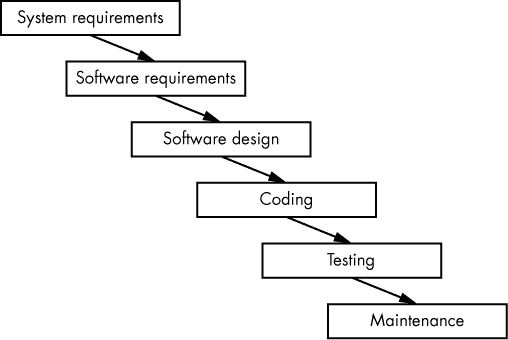
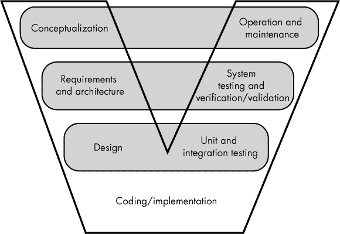
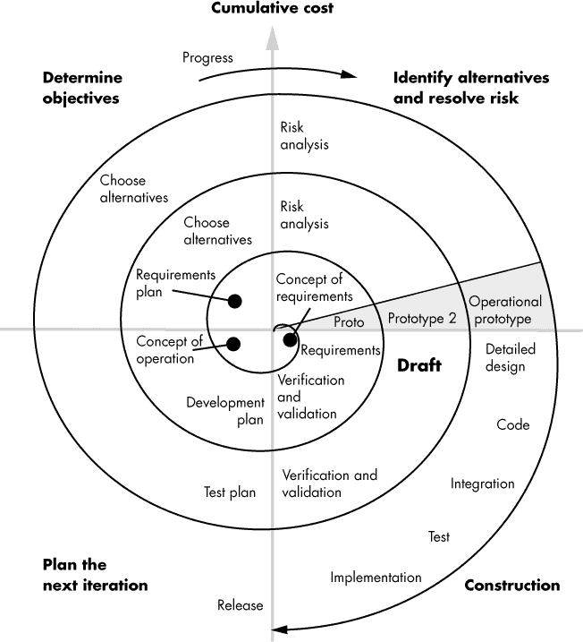
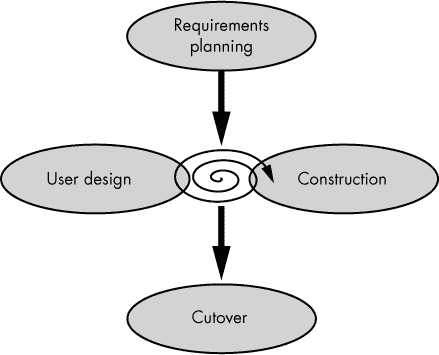
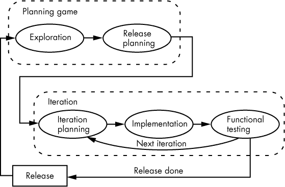

## 第四章：软件开发模型**

你不会通过对每个项目都遵循一套固定的规则来编写出伟大的代码。对于某些项目，可能只需要编写几百行代码就能生产出一个优秀的程序。然而，其他项目可能涉及到数百万行代码，成百上千的项目工程师，以及几层管理或其他支持人员；在这些情况下，你所使用的软件开发过程将极大地影响项目的成功。

在本章中，我们将讨论各种开发模型以及何时使用它们。

### 3.1 软件开发生命周期

在软件的生命周期中，一般会经历八个阶段，统称为*软件开发生命周期（SDLC）*：

1.  产品构思

1.  需求开发与分析

1.  设计

1.  编码（实现）

1.  测试

1.  部署

1.  维护

1.  退役

让我们逐一看看每个阶段。

**产品构思**

客户或经理为某个软件构思一个想法，并创建一个业务案例，证明其开发的合理性。

通常，一个非工程师会设想出对软件的需求，并寻求能够实现它的公司或个人。

**需求开发与分析**

一旦你有了产品构思，就必须制定产品需求。项目经理、利益相关者和客户（用户）会面，讨论并明确软件系统必须完成的任务，以满足各方需求。当然，用户希望软件能够做到任何事情。项目经理会根据可用资源（例如程序员）、估算的开发时间和成本来调整这一预期。其他利益相关者可能包括风险投资家（为项目提供资金的人）、监管机构（例如，如果你正在开发核反应堆的软件，可能需要核监管委员会的审批），以及可能为设计提供意见以使其具备销售潜力的市场人员。

通过会议、讨论、谈判等，相关方根据以下问题来制定需求：

+   系统是为谁设计的？

+   系统应该提供什么输入？

+   系统应该产生什么样的输出（以及以何种格式）？

+   会涉及到什么类型的计算？

+   如果有视频显示，系统应该使用什么屏幕布局？

+   *预期*的输入与输出响应时间应该是多少？

通过这一讨论，开发人员将编写*系统需求规格说明书（SyRS）*，该文档规定了所有硬件、软件等的主要需求。接着，项目管理和系统分析师使用 SyRS 来生成*软件需求规格说明书（SRS）*，^(1)这是本阶段的最终成果。一般而言，SRS 是仅供内部使用的，由软件开发团队使用，而 SyRS 则是供客户参考的外部文档。SRS 从 SyRS 中提取所有软件需求并进行扩展。第十章详细讨论了这两份文档（请参见《系统需求规格说明书》，第 193 页和《软件需求规格说明书》，第 194 页）。

**设计**

软件设计架构师（软件工程师）根据 SRS 中的软件需求准备*软件设计描述（SDD）*。SDD 提供了以下项目的某些组合，但不一定是全部：

+   系统概述

+   设计目标

+   使用的数据（通过*数据字典*）和数据库

+   数据流（可能使用数据流图表示）

+   接口设计（软件如何与其他软件以及软件用户进行交互）

+   必须遵循的任何标准

+   资源需求（例如，内存、CPU 周期和磁盘容量）

+   性能要求

+   安全性要求

详见第十一章，了解 SDD 内容的更多细节。设计文档将成为下一阶段——编码的输入。

**编码**

编码——编写实际的软件——是软件工程师最熟悉且最有趣的步骤。软件工程师使用 SDD 来编写软件。*WGC5: 伟大的编码*将专门讨论这一阶段。

**测试**

在这个阶段，代码将针对 SRS 进行测试，以确保产品解决了需求中列出的所有问题。此阶段包含几个组成部分，包括：

**单元测试** 检查程序中的各个语句和模块，以验证它们是否按预期工作。虽然这通常发生在编码阶段，但从逻辑上来说，它属于测试阶段。

**集成测试** 验证软件中的各个子系统能够很好地协同工作。这个过程通常发生在编码阶段，通常是在接近尾声时。

**系统测试** 验证实现情况；即，证明软件正确地实现了 SRS（软件需求规格说明书）。

**验收测试** 向客户展示软件是否适合其预期用途。

*WGC6: 测试、调试与质量保证*将详细讨论测试阶段。第十二章描述了你将在测试过程中创建的软件测试用例和软件测试程序文档。

**部署**

软件产品交付给客户用于使用。

**维护**

一旦客户开始使用软件，他们很有可能会发现缺陷并要求新增功能。在这个过程中，软件工程师可能会修复缺陷或增加新的功能，然后将软件的新版本部署给客户。

**退休**

最终，在一些软件的生命周期中，开发将停止，可能是因为开发组织决定不再支持或开发它，或者它被不同版本的程序取代，或者开发它的公司倒闭，或者它运行的硬件变得过时。

### 3.2 软件开发模型

*软件开发模型* 描述了 SDLC（软件开发生命周期）中的所有阶段如何在软件项目中结合。不同的模型适用于不同的情况：有些强调某些阶段，忽略其他阶段；有些在开发过程中反复进行各个阶段；还有一些完全跳过某些阶段。

目前有八种受人尊敬的软件开发模型，且这些模型有数十种，甚至数百种变体在使用。那么，为什么开发者不选择一个流行的模型并用它来处理所有的事情呢？如第一章中所述，适合个人或小团队的做法，在大型团队中不一定能有效扩展；同样，适合大项目的技术，往往不能很好地适用于小项目。本书将重点讨论适合个人的技术，但伟大的程序员必须能够在所有设计过程中工作，才能在各类项目中成为优秀的程序员。

在本章中，我将描述八种主要的软件模型——它们的优缺点，以及如何正确地应用它们。然而，在实践中，这些模型中的任何一个都不能盲目跟随，也不能指望它们保证项目的成功。本章还将讨论伟大的程序员如何在被迫使用某个模型的局限性时，依然能够绕开这些限制，编写出优秀的代码。

#### *3.2.1 非正式模型*

非正式模型描述了软件开发过程中的最小化流程或纪律：没有正式的设计，没有正式的测试，缺乏项目管理。这个模型最初被称为 *黑客*^(2)，那些参与其中的人被称为 *黑客*。然而，随着这些最初的黑客成长并获得经验、教育和技能，他们自豪地保留了“黑客”这个称号，所以这个术语不再指代一个缺乏经验或技能的程序员^(3)。我仍然会使用 *黑客* 来表示一种非正式的编码过程，但我会用 *非正式编码者* 来描述那些参与黑客行为的人。这样可以避免与“黑客”一词不同定义的混淆。

在非正式模型中，程序员直接从产品概念化进入编码阶段，不断“敲代码”，直到程序有些许功能（通常效果不好），而不是设计一个健壮、灵活、易读的程序。

黑客技术有几个优势：它很有趣，通常是独立完成的（虽然当然许多人参与像黑客马拉松这样的团体活动），程序员负责大多数设计决策并推动项目进展，因此他们通常能够比遵循正式开发过程的软件工程师更快地让某些东西工作。

非正式模型的问题在于它有意缺乏设计，这可能导致一个无效的系统，无法满足最终用户的需求，因为他们的要求没有被考虑到需求和软件规格中——如果这些需求和规格存在的话——而且通常软件没有经过测试或文档化，这使得除原始程序员外的任何人都很难使用它。

因此，非正式模型适用于那些仅供编写程序的程序员使用的小型一次性程序。对于这样的项目，编写几百行代码用于有限且谨慎的使用，比起完整的软件开发过程要便宜得多且更高效。（不幸的是，一些“一次性”程序可能会因用户的发现而获得生命，并变得流行。发生这种情况时，程序应当重新设计并重新实现，以便能够正确地维护。）

黑客技术也有助于开发小型原型，特别是那些旨在向潜在客户展示正在开发中的程序的屏幕显示。然而，这里有一个棘手的问题，那就是客户和经理可能会查看这个原型，并假设已经有大量代码就绪，这意味着他们可能会推动进一步开发被“破解”的代码，而不是从头开始开发，这会导致未来的问题。

#### *3.2.2 瀑布模型*

瀑布模型是软件开发模型的祖父，大多数模型都是它的变体。在瀑布模型中，SDLC 的每个步骤都是按顺序从头到尾执行的（参见图 3-1），每个步骤的输出形成下一个步骤的输入。

*图 3-1：瀑布模型*

你从生成系统需求说明书（SyRS）开始使用瀑布模型。一旦系统需求被确定，你就可以从 SyRS 生成软件需求说明书（SRS）。当软件需求被确定后，你可以从 SRS 生成软件设计文档（SDD）。接着你从 SDD 生成源代码并进行软件测试。然后你将部署并维护软件。SLDC 中的一切都按照这个顺序进行，没有任何偏差。

作为原始的 SDLC 模型，瀑布模型通常非常简单，容易理解并应用于软件开发项目，因为每个步骤都是独立的，且有明确的输入和输出交付物。使用该模型进行的工作也相对容易审查，并且可以验证项目是否按计划进行。

然而，瀑布模型存在一些重大问题。最重要的一点是，它假设你在进行到下一个步骤之前会完美地执行每个步骤，并且会在某个步骤的早期发现错误并进行修复。然而，现实情况是，这种情况很少发生：需求或设计阶段的缺陷通常要到测试或部署时才会被发现。到那时，倒退到系统中并修正所有问题可能非常昂贵。

另一个缺点是，瀑布模型在开发过程的很晚阶段才能提供一个可供客户评审的工作系统。我数不清有多少次，我向客户展示静态截图或代码如何工作图示，获得了他们的认可，但最终他们却拒绝了运行结果。如果我在需求阶段就制作了一个可用的代码原型，让客户能够在某些系统功能上进行实验，这种重大期望上的差距本可以避免。

最终，这个模型是非常有风险的。除非你能*准确*地在开始之前定义系统将要执行的任务，否则瀑布模型很可能不适合你的项目。

瀑布模型适用于小型项目，例如代码行数不到几万行，且仅涉及少数几名程序员的情况；或者适用于非常大型的项目（因为在那个层级，别的模型都无法适用）；又或者当当前项目与之前使用瀑布模型开发的产品相似时（因此你可以使用现有的文档作为模板）。

#### *3.2.3 V 模型*

V 模型，如图 3-2 所示，遵循与瀑布模型相同的基本步骤，但强调在开发生命周期的早期制定测试标准。V 模型的结构使得早期的步骤——需求和设计——会产生两组输出：一组用于后续步骤，另一组用于测试阶段的平行步骤。

*图 3-2：V 模型*

在图 3-2 中，V 左侧的项目直接链接到右侧的项目：在每个设计阶段，程序员都在考虑如何测试并使用正在建模的概念。例如，在*需求和架构*阶段，系统架构师设计系统验收测试，以验证软件是否正确实现了所有需求。在*设计*阶段，系统设计师实施软件的单元测试和集成测试。

与瀑布模型的最大区别在于，工程师在早期就实现了测试用例和程序，因此当编码开始时，软件工程师可以利用现有的测试程序在开发过程中验证代码行为。这种方法被称为*测试驱动开发（TDD）*，在这种方法中，程序员在整个开发过程中不断进行测试。持续的测试可以让你更早发现漏洞，并使修复这些漏洞变得更加便宜和迅速。

话虽如此，V 模型并不完美。像其母模型瀑布模型一样，V 模型过于简单，并且在早期阶段要求过多的完善，以避免后期的灾难。例如，需求和架构阶段的缺陷可能直到系统测试和验证时才显现出来，导致在开发过程中需要付出昂贵的返工成本。因此，V 模型并不适用于需求在产品生命周期中可能发生变化的项目。

该模型通常鼓励验证，而牺牲了验证的效果。*验证*确保产品满足特定的需求（例如软件需求）。开发测试用例来证明软件符合 SRS 和 SyRS 中列出的要求是很容易的。相比之下，*确认*证明产品满足最终用户的需求。由于更加开放，确认更难以实现。

例如，测试软件是否会因试图处理`NULL`指针而崩溃是困难的。因此，验证测试通常在测试程序中完全缺失。大多数测试用例是需求驱动的，像“这一段代码中没有除以零的情况”或“这个模块没有内存泄漏”等需求则很少见（这些被称为*需求缺口*；在没有任何需求依据的情况下设计测试用例可能会非常具有挑战性，尤其对于初学者来说）。

#### *3.2.4 迭代模型*

像瀑布模型和 V 模型这样的顺序模型假设在编码之前，规格、需求和设计都已经完美无缺，这意味着用户在软件首次部署之前不会发现设计问题。而此时，通常修复设计、修正软件并进行测试的成本已经过高（或者为时已晚）。迭代模型通过多次遍历开发模型克服了这个问题。

迭代模型的标志是用户反馈。系统设计师从用户和利益相关者那里获取产品的整体构想，并创建一个最小的需求和设计文档。编码人员实施并测试这个最小实现。然后，用户体验这个实现并提供反馈。系统设计师根据用户反馈产生新的需求和设计，程序员实施并测试这些更改。最后，用户会得到第二个版本进行评估。这个过程会重复，直到用户满意或软件达成最初的目标。

迭代模型的一个大优点是，当在开发周期开始时很难完全指定软件的行为时，它依然能很好地工作。系统架构师可以从一个大致的路线图出发，设计足够的系统部分，让最终用户可以进行操作并确定哪些新功能是必要的。这避免了花费大量精力去开发那些最终用户希望以不同方式实现或根本不需要的功能。

另一个优势是，迭代模型降低了*市场时间*风险。为了快速将产品推向市场，你会决定最终产品的一部分功能并优先开发这些功能，先让产品以最简化的方式工作，并发布这个*最小可行产品 (MVP)*。然后，在每次新迭代中添加功能，生产出新版本的增强产品。

迭代模型的优势包括：

+   你可以非常迅速地实现最小功能。

+   管理风险比顺序模型更容易，因为你不需要完成整个程序就能确定它不能正常工作。

+   随着项目的进展（接近完成），管理变得比顺序模型更容易和更明显。

+   支持需求变化。

+   改变需求的成本更低。

+   并行开发是可能的，通过两组（或更多）团队交替工作在不同版本上。

以下是迭代模型的一些缺点：

+   管理项目的工作量更多。

+   它不太适合规模较小的项目。

+   它可能需要更多资源（特别是当进行并行开发时）。

+   定义迭代可能需要一个“更宏大的”系统路线图（即，在开发开始前重新指定所有需求）。

+   迭代次数可能没有限制；因此，可能无法预测项目何时完成。

#### *3.2.5 螺旋模型*

螺旋模型也是一个迭代模型，它重复四个阶段：规划、设计、评估/风险分析和构建（见图 3-3）。

*图 3-3：螺旋模型*

螺旋模型极度依赖于风险：每个迭代都会评估继续推进项目的风险。管理层通过分析风险（即失败的可能性）来选择添加和省略哪些特性，并决定采取哪些方法。

螺旋模型常被称为*模型生成器*或*元模型*，因为你可以在每个螺旋中使用进一步发展的模型——相同类型的或不同类型的。缺点是，最终的模型会变得特定于该项目，难以应用于其他项目。

螺旋模型的一个关键优势是，它在开发过程中通过定期生成工作原型，早期且持续地让最终用户参与进来。最终用户可以与这些原型互动，判断开发是否走在正确的轨道上，并在需要时调整开发过程。这解决了瀑布模型和 V 模型的一大缺陷。

这种方法的一个缺点是它奖励“刚刚足够好”的设计。如果代码能写得“足够快”或“足够小”，那么进一步的优化会被推迟到后期阶段，直到确有必要时才进行。类似地，测试只会进行到足以对代码有最低程度信心的程度。额外的测试被认为是浪费时间、金钱和资源。螺旋模型往往会导致在早期工作的妥协，尤其是当管理不善时，这种情况会导致开发后期出现问题。

另一个缺点是螺旋模型增加了管理的复杂性。这个模型本身很复杂，因此项目管理需要风险分析专家。寻找具备此类专业知识的经理和工程师很困难，且通常无法找到合适的替代人选会导致灾难性后果。

螺旋模型仅适用于大型、高风险项目。为低风险项目投入的工作量（尤其是在文档方面）是难以证明合理的。即便是在更大的项目中，螺旋模型可能会无限循环，最终产品迟迟无法产生，或者预算在开发仍处于中间阶段时已被完全消耗。

另一个问题是，工程师需要花费大量时间开发原型和其他中间版本的代码，而这些代码最终并不会出现在最终的软件版本中，这意味着螺旋模型通常比使用其他方法开发软件要花费更多。

尽管如此，螺旋模型还是提供了一些巨大的优势：

+   在项目开始之前，不需要完全明确需求；螺旋模型非常适合需求不断变化的项目。

+   它在开发周期的早期就能产生可用的代码。

+   它与*快速原型开发*（见下节“快速应用开发模型”）配合得非常好，能让客户和其他利益相关者在应用程序开发的早期就能感到安心。

+   开发可以被分成若干部分，风险较大的部分可以提前完成，从而降低整体开发风险。

+   由于需求可以在发现时就创建，因此更加准确。

+   和迭代模型一样，功能可以随着时间的推移逐步展开，允许在时间或预算允许的情况下添加新功能，而不会影响初始版本的发布。

#### *3.2.6 快速应用开发模型*

与螺旋模型类似，快速应用开发（RAD）模型强调在开发过程中与用户的持续互动。RAD 模型由 IBM 的研究员 James Martin 在 1990 年代提出，最初的 RAD 模型将软件开发分为四个阶段（见图 3-4）。

*图 3-4：RAD 模型*

**需求规划** 项目的相关方聚集在一起讨论业务需求、范围、限制和系统需求。

**用户** **设计** 终端用户与开发团队合作，制作系统模型和原型（详细说明输入、输出和计算），通常使用 *计算机辅助软件工程（CASE）* 工具。

**构建** 开发团队利用工具从需求和用户设计中自动生成代码来构建软件。在此阶段，用户仍然参与其中，随着用户界面的逐步完善，他们会提出修改建议。

**切换** 软件被部署。

RAD 比螺旋模型更轻量，风险缓解技术较少，文档需求也相对较轻，这使得它更适用于中小型项目。与其他模型不同，传统的 RAD 强烈依赖于高级语言（VHLL）、用户界面建模工具、复杂的现有代码库和框架，以及 CASE 工具来根据需求和用户界面模型自动生成代码。一般来说，RAD 只有在针对特定项目问题可用 CASE 工具时才实际可行。今天，许多通用语言系统都支持高度自动化的代码生成，包括微软的 Visual Basic 和 Visual Studio 包、苹果的 Xcode/Interface Builder 包、Free Pascal/Lazarus 以及 Embarcadero 的 Delphi（Object Pascal）包。

RAD 模型的优点与螺旋模型类似：

+   客户在整个开发过程中都参与其中，从而降低了风险。

+   RAD 缩短了开发时间，因为写文档的时间减少了，避免了文档在规格变更时需要重新编写的情况。

+   RAD 模型鼓励快速交付可运行的代码，测试（和缺陷缓解）也更加高效。开发人员将更多时间花在运行代码上，测试问题。

和任何开发模型一样，RAD 也有一些缺点：

+   RAD 需要具备大宗师级别的开发经验的软件工程师，他们能够缩短其他开发模型中冗长的开发过程。然而，这类资源在许多组织中比较稀缺。

+   RAD 需要与终端用户持续互动，这在许多项目中可能会受到限制。

+   RAD 可能很难进行调度和控制。那些依赖 Microsoft Project 的经理会发现很难应对 RAD 模型中的不确定性。

+   如果管理不当，RAD 很容易变成拼凑式编程。软件工程师可能会放弃正式的设计方法，而直接在代码上“乱改”以实现更改。当最终用户开始提出“只是为了看看结果会是什么样”这样的建议时，这种情况尤为棘手^(4)。

+   RAD 不适用于大型系统开发。

#### *3.2.7 增量模型*

增量模型与迭代模型非常相似，主要的区别在于规划和设计。在迭代模型中，首先创建系统设计，软件工程师在每次迭代中实现不同的部分；初始设计仅定义第一段工作代码。一旦程序运行，新功能会按阶段逐步设计并添加。

增量模型强调“保持代码可运行”的理念。当基础产品可操作时，开发团队在每次迭代中添加最少量的新功能，并对软件进行测试并保持其可用性。通过限制新功能，团队可以更容易地定位和解决开发中的问题。

增量模型的优点是始终保持一个可工作的产品。该模型对程序员来说也很自然，特别是在小型项目中。缺点是，它一开始并没有考虑到产品的完整设计。通常，新的功能只是简单地加在现有设计上。当最终用户请求在原始设计中未考虑到的功能时，这可能会导致未来的问题。增量模型适用于小型项目，但对于大型项目而言，扩展性较差，此时迭代模型可能是更好的选择。

### 3.3 软件开发方法论

软件开发模型描述了*做什么*工作，但在*如何*做的方面留有相当大的余地。本节将介绍一些可以应用于许多前面提到的模型的开发方法论和过程。

Belitsoft 公司博客^(5)描述了软件方法论如下：

一套原则体系，以及一组定义软件开发风格的理念、概念、方法、技术和工具。

因此，我们可以将软件方法论的概念归结为一个词：*风格*。在开发软件时，可以使用各种风格。

#### *3.3.1 传统（预测型）方法论*

传统的方法论是*预测性的*，这意味着管理层预测哪些活动将会发生，何时发生，以及由谁来执行。这些方法论与线性/顺序的开发模型（如瀑布模型或 V 模型）密切配合。你可以在其他模型中使用预测，但那些模型的设计本意就是为了避免预测方法论常见的问题。

预测性方法论在无法预测未来需求、关键人员或经济条件变化时会失败（例如，公司是否在项目的某个里程碑时获得了预期的额外融资？）。

#### *3.3.2 自适应方法论*

螺旋模型、RAD 模型、增量模型和迭代模型的出现，正是因为通常很难正确预测大型软件系统的需求。自适应方法论处理这些工作流程中的不可预测变化，并强调短期规划。毕竟，如果你只提前 30 天规划一个大型项目，最糟糕的情况就是你需要重新规划接下来的 30 天；这远没有在大型瀑布/预测性项目中出现变化时所面临的灾难性后果，那时的变化会迫使你重新同步整个项目。

#### *3.3.3 敏捷*

敏捷是一种增量方法论，专注于客户协作、快速响应变化的短期开发迭代、可工作的软件以及支持个人的贡献和互动。敏捷方法论作为一个总的框架，涵盖了几种不同的“轻量级”（即非预测性）方法论，包括极限编程、Scrum、动态系统开发模型（DSDM）、自适应软件开发（ASD）、Crystal、特性驱动开发（FDD）、务实编程等。这些方法论中的大多数被视为“敏捷”，尽管它们通常涵盖软件开发过程的不同方面。敏捷方法论已在现实项目中得到了充分验证，成为目前最流行的方法论之一，因此我们将在这里详细介绍它。

**注意事项**

*有关敏捷背后原则的详细列表，请参阅敏捷宣言：[`agilemanifesto.org/`](http://agilemanifesto.org/)*。

##### 3.3.3.1 敏捷具有增量性质

敏捷开发本质上是增量的、迭代的和进化的，因此与增量模型或迭代模型最为契合（也可以使用螺旋模型或快速应用开发（RAD）模型）。一个项目被分解为团队可以在一到四周内完成的任务，这通常被称为*sprint*。在每个 sprint 期间，开发团队进行规划、创建需求、设计、编码、单元测试以及接受测试新功能的软件。

在 sprint 结束时，交付成果是一块能展示新功能、且尽可能少缺陷的可工作软件。

##### 3.3.3.2 敏捷要求面对面沟通

在整个冲刺过程中，必须有一位客户代表随时待命，回答出现的任何问题。如果没有这位代表，开发过程很容易偏离正确方向或在团队等待回复时陷入困境。

敏捷开发中的高效沟通需要面对面的交流。^(6) 当开发人员直接向客户展示产品时，客户常常会提出一些在邮件中或自己试用功能时无法想到的问题。有时，演示中的随意评论会激发出一阵不同的思维，这种思维如果没有面对面交流是难以产生的。

##### 3.3.3.3 敏捷注重质量

敏捷强调各种提升质量的技术，如自动化单元测试、TDD、设计模式、结对编程、代码重构以及其他广为人知的最佳软件实践。其核心思想是在初始设计和编码过程中尽可能减少缺陷。

*自动化单元测试*创建了一个测试框架，开发人员可以自动运行该框架来验证软件是否正常运行。它对于*回归测试*也非常重要，回归测试用来确保在添加新功能后，代码仍然能够正常工作。手动运行回归测试太过繁琐，因此通常不会发生。

在 TDD 中，开发人员会先编写自动化测试用例，再编写代码，这意味着测试最初会失败。开发人员运行测试，选择一个失败的测试，编写软件来修复这个失败，然后重新运行测试。只要某个测试通过，开发人员就会继续处理下一个失败的测试。成功地消除所有失败的测试就验证了软件满足需求。

*结对编程*是敏捷中较具争议的一项实践，它要求两名程序员共同编写每一段代码。一名程序员输入代码，另一名程序员观察，纠正屏幕上的错误，提供设计建议，进行质量控制，并帮助第一个程序员保持专注于项目。

##### 3.3.3.4 敏捷冲刺（迭代）周期短

敏捷方法最有效的方式是保持迭代周期短—从一周到最多几个月。这也呼应了那句老话：“如果没有最后一分钟，什么事都做不成。”通过保持迭代短小，软件工程师总是在“最后一分钟”工作，减少了疲劳和拖延，提升了项目的专注度。

短周期的冲刺与短周期的反馈紧密相连。一个常见的敏捷特性是简短的每日站会，通常不超过 15 分钟，^(7)，在会上，程序员简洁地描述他们正在做什么，遇到了什么问题，已经完成了什么。这使得项目管理可以重新安排资源并在进度滞后的情况下提供帮助。这些会议能及早发现问题，而不是等到问题积累数周才引起项目管理的注意。

##### 3.3.3.5 敏捷不强调笨重文档

瀑布模型的最大问题之一是，它会产生大量从未再被阅读的文档。过于全面的、*笨重的*文档有几个问题：

+   文档必须得到维护。每当软件进行更改时，文档也必须更新。一份文档中的更改必须反映在许多其他文档中，从而增加了工作量。

+   许多文档在编写代码之前很难写。更多时候，这些文档是在代码写完后更新的，并且再也没有被阅读（浪费了时间和金钱）。

+   迭代开发过程会迅速破坏代码与文档之间的一致性。因此，在每次迭代中正确地维护文档与敏捷方法论不太匹配。

敏捷强调*恰到好处（JBGE）*的文档——也就是说，文档应该足够多，以便下一个程序员能接着你的工作继续，但不能过多（事实上，敏捷强调 JBGE 适用于大多数概念，包括设计/建模）。

许多书籍都写了关于敏捷开发的内容（参见“更多信息”在第 69 页）。这本书并不是其中之一，但我们将探讨敏捷方法下的几种不同方法论。这些方法论并不是互相排斥的；可以将两种或更多方法结合起来使用在同一个项目中。

#### *3.3.4 极限编程*

极限编程（XP）可能是最广泛使用的敏捷方法论。它旨在简化开发实践和过程，交付能够提供所需功能集的工作软件，而不附加不必要的内容。

XP 的指导原则有五个：

**沟通** 客户与团队之间、团队成员之间、团队与管理层之间的良好沟通对于成功至关重要。

**简单性** XP 力求今天产生最简单的系统，即使明天扩展它的成本更高，而不是产生一个复杂的产品，实现那些可能永远不会用到的功能。

**反馈** XP 依赖于持续的反馈：单元和功能测试在程序员更改代码时为其提供反馈；客户在添加新功能时提供即时反馈；项目管理跟踪开发进度，提供关于估算的反馈。

**尊重** XP 要求团队成员彼此尊重。程序员永远不会提交破坏代码库的更改，或者做出任何会拖延其他团队成员工作进度的行为。

**勇气** XP 的规则和实践与传统的软件开发实践不一致。XP 要求投入资源（例如“随时可用”的客户代表或配对程序员），这些资源在传统方法中可能成本高昂或难以证明其价值。一些 XP 的政策，如“早重构，常重构”，与常见做法（如“如果没有坏，就不要修”）相悖。如果没有勇气完全实施其极端政策，XP 会变得不那么严谨，甚至可能退化为临时拼凑的编程方式。

##### 3.3.4.1 XP 团队

XP 过程中的关键概念是 XP *全体团队*理念：团队的所有成员共同合作生产最终产品。团队成员并不是专门从事某一领域的专家，而是经常承担不同的责任或角色，不同的团队成员可能在不同时间执行相同的角色。XP 团队由不同的成员填补以下角色。

**客户代表**

客户代表负责确保项目按正确的轨道进行，提供验证，编写*用户故事*（需求、功能和用例）和*功能测试*，并决定新功能的*优先级*（发布规划）。客户代表必须在团队需要时随时可用。

没有可用的客户代表是成功的 XP 项目中最大的障碍之一。如果没有来自客户的持续反馈和指导，XP 就会退化为临时拼凑的编程方式。XP 不依赖于需求文档，而是将客户代表视为该文档的“活版本”。

**程序员**

程序员在 XP 团队中有多项责任：与客户代表合作编写用户故事，估算资源分配给这些故事的方式，估算实现这些故事的时间表和成本，编写单元测试，并编写代码来实现这些故事。

**测试人员**

测试人员（实施或修改给定单元并运行单元测试的程序员）执行功能测试。通常，至少有一名测试人员是客户代表。

**教练**

教练是团队领导，通常是首席程序员，负责确保项目的成功。教练确保团队拥有合适的工作环境；促进良好的沟通；通过充当上级管理层的联络人，保护团队免受组织其他部分的干扰；帮助团队成员保持自律；并确保团队维持 XP 过程的执行。当程序员遇到困难时，教练提供资源帮助他们克服问题。

**经理/追踪者**

XP 项目经理负责安排会议并记录会议结果。跟踪员通常（但不总是）与经理是同一个人，负责跟踪项目的进度，并确定当前迭代的计划是否能够按时完成。为此，跟踪员每周会与每位程序员沟通几次。

不同的 XP 配置通常包括额外的团队角色，如分析师、设计师、悲观者等。由于 XP 团队的规模较小（通常约 15 名成员），并且（配对）程序员占据团队的主要成员，因此大多数角色是共享的。有关更多信息，请参见第 69 页的“更多信息”部分。

##### 3.3.4.2 XP 软件开发活动

XP 使用四个基本的软件开发活动：编码、测试、倾听和设计。

**编码**

XP 认为代码是开发过程中的*唯一*重要输出。与瀑布等串行模型中的“先思考，后编码”哲学相反，XP 程序员从软件开发周期开始时就开始编写代码。毕竟，“到头来，必须有一个可工作的程序。”^(8)

XP 程序员不会立即开始编码，而是会得到一个小且简单的功能列表来实现。他们为特定功能制定基本设计，然后编写该功能并确保其正常工作，再逐步扩展每个增量，确保每个增量都能正确工作，从而确保主代码始终运行。程序员在将更改集成到更大的系统之前，通常只会对项目进行小幅度的修改。XP 最大限度地减少了所有非代码输出，如文档，因为它几乎没有什么好处。

**测试**

XP 强调通过自动化单元和功能测试来实现 TDD。这使得 XP 工程师能够开发出*正确的产品*（通过自动化单元测试进行验证）和开发出*合适的产品*（通过功能测试进行验证）。*WGC6: 测试、调试和质量保证*将更专注于测试，因此我们在这里不会深入讨论；只需要知道 TDD 对 XP 过程非常重要，因为它确保系统始终正常运行。

XP 中的测试始终是自动化的。如果添加一个功能因某些原因破坏了无关的功能，那么及时发现这一点至关重要。通过在添加新功能时运行完整的单元（和功能）测试，可以确保新代码不会引起回归。

**倾听**

XP 开发人员几乎与客户进行持续沟通，确保他们开发的是正确的产品（验证）。

XP 是一个*以变化为驱动的过程*，这意味着它期望在整个过程中根据客户的反馈，要求、资源、技术和性能发生变化。

**设计**

设计在整个 XP 过程中不断发生——在发布规划、迭代规划、重构等阶段。这个关注点防止 XP 陷入乱搞代码的局面。

##### 3.3.4.3 XP 过程

XP 的每个周期都会产生一个软件*发布*。频繁的发布确保了来自客户的持续反馈。每个周期由几个固定时间段组成，这些时间段被称为迭代（每个迭代的时间不超过几周）。如图 3-5 所示，周期对于规划是必需的；该图中的中间框代表一个或多个迭代。

*图 3-5：XP 周期*

在规划游戏中，XP 团队决定要实现哪些功能，估算其成本，并规划发布。在探索阶段，客户定义功能集，开发人员估算这些功能的成本和时间需求。接下来的部分（在“用户故事”下）描述了客户用来指定功能的机制。

在发布规划阶段，客户与开发人员就本次迭代中要实现的功能进行协商。开发人员承诺执行发布计划，并分配各种任务。在发布规划结束时，过程进入*引导*阶段，在该阶段，客户确保项目按计划进行。

在总体计划确定后，当前发布的过程进入一个包含三个步骤的内循环：迭代规划、实施和功能测试。迭代规划是对单个功能的缩小版规划游戏。

实施步骤是功能的编码和单元测试。开发人员编写一组单元测试，实施足够的代码以使单元测试通过，必要时对代码进行重构，并将更改集成到共享代码库中。

在迭代的最后一步，客户进行功能测试。然后，如果当前版本的所有迭代都完成，则进入下一个迭代，或者发布新版本。

##### 3.3.4.4 XP 软件开发规则

XP 通过 12 条简单规则来实现四项软件开发活动——编码、测试、倾听和设计：^(9)

+   用户故事（规划游戏）

+   小规模发布（构建块）

+   隐喻（标准化命名方案）

+   集体所有权

+   编码标准

+   简单设计

+   重构

+   测试

+   配对编程

+   现场客户

+   持续集成

+   可持续节奏

每个规则接下来都会描述，并列出其优缺点。

**用户故事**

用户故事描述了一组简化的用例，由客户编写，定义了系统的需求。项目团队使用这一套用户故事，它应该只提供足够的细节来估算实现该功能所需的时间，进而估算成本并规划系统的开发。

在项目开始时，客户会生成 50 到 100 个用户故事，用于发布计划会议中。然后，客户和团队会协商决定在下一次发布中由团队实现哪些功能。客户可能会在开发人员的帮助下，也会根据用户故事创建功能测试。

**小范围发布**

一旦一段软件实现了基本功能，团队会一次添加一个功能。在新功能编写、测试、调试并合并到主版本之前，不会添加其他功能。每添加一个新功能，团队都会创建一个新的系统构建版本。

**隐喻**

XP 项目围绕着一个所有利益相关者都能理解的系统操作故事展开。隐喻是软件中使用的命名约定，确保每个人都能清晰地理解操作；它们将复杂的业务流程名称替换为简单的名称。例如，“火车乘务员”可能用来描述数据采集系统的操作方式。

**集体所有权**

在 XP 中，整个团队共同拥有并维护所有源代码。在任何时候，任何团队成员都可以检出代码并进行修改。在评审过程中，不会因为编码错误而特别指责任何人。集体代码所有权避免了延误，并且意味着某个人的缺席不会妨碍进展。

**编码标准**

所有 XP 成员必须遵守关于样式和格式的共同编码标准。团队可以制定这些标准，或者它们可以来自外部来源，但每个人都必须遵守。编码标准使得系统更易于阅读和理解，尤其是对于新加入的成员，他们需要迅速适应项目，并帮助团队避免以后浪费时间重构代码以符合标准。

**简单设计**

始终选择满足所有要求的最简单设计。设计中绝不会预见到尚未添加的功能——例如，添加“钩子”或应用程序编程接口（API），以便将来代码能够与当前代码进行接口。简单设计意味着*足够完成当前任务*。最简单的代码会通过当前迭代的所有测试。这与传统的软件工程相悖，后者通常将软件设计得尽可能通用，以便处理任何未来的增强功能。

**重构**

重构代码是指在不改变外部行为的情况下，重构或重写代码，以使代码更简单、更易读，或通过其他改善指标来提高代码质量。

*WGC5: 卓越编码*将更详细地讲解重构。有关重构的更多参考资料，请参见第 69 页中的“更多信息”。

**测试**

XP 采用 TDD 方法论，如第 57 页的“XP 软件开发活动”中所讨论的。

**结对编程**

在配对编程中，一名程序员（*司机*）输入代码，第二名程序员（*导航员*）在每行代码编写时进行审查。两名工程师在整个过程中互换角色，并且配对通常会不断形成和解散。

说服管理层相信两名程序员在同一份代码上合作工作比各自独立工作更具生产力，往往是很困难的。XP 传教士认为，由于导航员在不断审查司机的代码，因此不需要单独的审查会话，除此之外还有其他好处：^(10)

**经济效益** 配对编程所花费的时间比个人多大约 15%，但代码的缺陷比个人少约 15%。^(11)

**设计质量** 两名程序员能产生更好的设计，因为他们为项目带来了更多经验。他们从不同的角度思考问题，并根据他们的司机/导航员角色以不同的方式设计解决方案。更好的设计意味着项目在整个生命周期中需要更少的回溯和重设计。

**满意度** 大多数程序员喜欢配对工作，而不是单独工作。他们对自己的工作更有信心，因此能够产生更好的代码。

**学习** 配对编程使配对成员可以相互学习，提高各自的技能。这是单独编程无法实现的。

**团队建设与沟通** 团队成员共享问题和解决方案，这有助于将知识产权（IP）传播开来，并使其他人在给定的代码部分上更容易进行工作。

总的来说，关于配对编程有效性的研究结果是喜忧参半的。大多数来自行业的已发布论文讨论了配对编程的成功案例，但描述其在行业（相对于学术界）环境中失败的论文通常不会被发布。Kim Man Lui 和 Andreas Hofer 的研究考虑了配对编程中的三种配对类型：专家–专家、初学者–初学者和专家–初学者。

*专家–专家配对* 可以产生有效的结果，但两个专家程序员可能会使用“经验证的方法”，而不引入任何新的见解，这意味着这种配对相较于两个单独的专家程序员的有效性是值得质疑的。

*初学者–初学者配对* 通常比让合作伙伴独立做项目更有效。初学者的背景和经验差异很大，他们的知识更有可能是互补的，而不是重叠的（这与专家配对的情况不同）。两位初学者一起工作时，更可能在两个项目上按顺序工作，而不是独立地平行处理各自的项目。

*专家–新手配对*通常被称为*指导*。许多 XP 的拥护者认为这不是配对编程，但指导是一种高效的方式，能让初级程序员迅速熟悉代码库。在指导中，最好让新手担任驾驶员角色，这样他们就可以与代码互动并从中学习。

简单设计指南

与简单设计相关的常见短语包括：

**不要重复自己（DRY）** 重复的代码是复杂的代码。

**一次且仅一次（OAOO）** 所有独特的功能应该以某种方法/过程的形式存在于代码中，并且只出现一次（这一点是 DRY 的体现）。

**你不需要它（YAGNI）** 避免推测性编码。当你向代码库中添加功能时，确保它是由用户故事（需求）指定的。不要提前为未来的需求添加代码。

**限制 API 和（发布的）接口** 如果你的代码通过发布 API 与其他系统进行交互，将接口数量限制到最小，将使得未来修改代码时更容易（而不会破坏外部代码）。

简单设计是极其困难的。往往你只能通过编写复杂的代码，并反复重构它，直到你对结果满意，才能实现它。一些著名计算机科学家的几句话将帮助你深刻理解这一点：

构建软件设计有两种方式：一种是使其简单到明显没有缺陷，另一种是使其复杂到没有明显缺陷。

—C. A. R. 霍尔

最便宜、最快和最可靠的组件是那些不存在的组件。

—戈登·贝尔

删除的代码就是已调试的代码。

—杰夫·西克尔

调试的难度是编写代码的两倍。因此，如果你编写的代码足够巧妙，那么按定义来说，你就不够聪明去调试它。

—布赖恩·肯尼汉和 P. J. 普劳杰

任何试图做到足够通用和可配置的程序，试图处理任何任务，要么无法达到这一目标，要么会被严重破坏。

—克里斯·温哈姆

添加一个功能的成本不仅仅是编码所需的时间。成本还包括为未来扩展增加的障碍。诀窍在于挑选那些不会相互冲突的功能。

—约翰·卡马克

简单的设计难以构建，容易使用，但很难收费。复杂的设计容易构建，难以使用，却容易收费。

—克里斯·萨卡

尽管配对编程的支持证据主要是轶事，并且本质上未经过验证，但 XP 依赖配对编程来替代正式的代码审查、结构化的走查和—在一定程度上—设计文档，因此它不能被放弃。正如 XP 方法论中常见的，某些繁重的过程，如代码审查，往往会被融入到配对编程等其他活动中。试图消除某一条规则或子流程，很可能会在整体方法中留下空隙。

并非所有 XP 活动都是以配对形式进行的。许多非编程活动是单独进行的——例如，阅读（和编写）文档、处理电子邮件和在网上进行研究——有些活动总是单独进行的，比如编写*代码突发*（用于测试某个理论或想法的临时代码）。归根结底，*结对编程对 XP 成功至关重要*。如果一个团队无法有效地进行结对编程，它应该采用不同的开发方法。

**现场客户**

如前所述，在 XP 中，客户是开发团队的一部分，必须始终可用。

现场客户规则可能是最难遵循的规则。大多数客户不愿意或无法提供这个资源。然而，如果没有客户代表的持续参与，软件可能会偏离轨道，遇到延迟，或从之前的工作版本中退步。这些问题都是可以解决的，但解决方案会破坏使用 XP 的好处。

**持续集成**

在传统的软件开发系统（如瀑布模型）中，系统的各个组件是由不同的开发人员编写的，直到项目中的某个重要里程碑才会进行整合测试，而集成后的软件可能会出现灾难性的失败。问题在于单元测试与必须与单元集成的代码行为不同，通常是由于通信问题或需求理解错误。

一定会发生误解和沟通不畅，但 XP 通过*持续集成*使集成问题更容易解决。每当一个新功能实现时，它就会与主构建合并并进行测试。有些测试可能会失败，因为某个功能尚未实现，但整个程序都会运行，测试与应用中其他单元的链接。软件构建会频繁创建（每天多次）。因此，你可以在问题成本较低时，尽早发现集成问题。

**可持续的步伐**

许多研究表明，创造性的人在没有过度工作的情况下会产出最好的成果。XP 规定软件工程师的工作时间为每周 40 小时。有时可能会出现需要少量加班的紧急情况。但如果管理层让编程团队始终处于危机模式，工作的质量就会下降，加班也会变得适得其反。

##### 3.3.4.5 其他常见实践

除了之前的 12 条规则，XP 还推广了其他一些常见的实践：

**开放的工作空间和联合办公**

XP 方法论建议整个团队使用开放的工作区域，团队成员在相邻的工作站进行结对工作。让大家聚在一起促进了持续的沟通，并保持了团队的专注。问题可以迅速提出并得到解答，其他程序员可以根据需要在讨论中加入评论。^(12)

但开放式工作空间也有其挑战。一些人比其他人更容易分心。嘈杂的噪音和对话会非常烦人，并打破集中注意力的状态。

开放式工作空间在 XP 中是“最佳实践”，而不是绝对规则。如果这种设置对某个团队不适用，他们可以使用办公室或小隔间，在没有干扰的情况下工作。

**回顾/总结会议**

当一个项目完成时，团队会聚在一起讨论成功和失败的经验，将这些信息传播以帮助改进下一个项目。

**自主团队**

自主团队在没有通常管理层（项目负责人、高级和初级工程师等）的情况下工作。团队通过共识来决定优先事项。XP 团队并非完全没有管理，但这里的观点是，给定一组任务和适当的截止日期，团队可以自行管理任务分配和项目进度。

##### 3.3.4.6 XP 方法的问题

XP 不是万能的。它有几个问题，包括：

+   没有创建或保存详细的规格说明。这使得在项目后期很难加入新程序员，或者让另一个编程团队来维护项目。

+   即使不起作用，也要求进行结对编程。在某些情况下，这可能是过度的。两个程序员共同开发一个相对简单的代码片段可能会使开发成本翻倍。

+   实际上，XP 通常要求所有团队成员都具备 GMP（通用多功能专业人员）的能力，以应对每个成员必须支持的广泛角色。除非在最小规模的项目中，这在现实中很少能实现。

+   持续重构可能带来与它解决的问题（新 bug）一样多的麻烦。当程序员重构不需要重构的代码时，还会浪费时间。

+   不进行前期大设计（即非瀑布式开发）通常会导致过度的重新设计。

+   需要有客户代表。通常，客户会因考虑成本将一个初级人员安排到这个职位上，导致失败点。如果客户代表在项目完成前离开，所有未记录下来的需求都会丢失。

+   XP 不适用于大团队。一个高效的 XP 团队的上限大约是十几个工程师。

+   XP 尤其容易受到“功能蔓延”的影响。由于缺乏文档化的需求/功能，客户可能会将新功能注入系统。

+   单元测试，即使是 XP 程序员创建的，也常常无法指出缺失的功能。单元测试测试的是“已存在的代码”，而不是“*应该*存在的代码”。

+   XP 通常被认为是一种“全有或全无”的方法论：如果你不遵循“XP 宗教”的每一条原则，过程就会失败。大多数 XP 规则都有缺陷，而这些缺陷会被其他规则的优点所弥补。如果你未能应用一条规则，另一条规则很可能会被打破（因为它的缺点不再得到弥补，这条破坏的规则又会破坏另一条规则，如此反复）。

这个关于 XP 的简短介绍无法完全阐述该主题。有关 XP 的更多信息，请参阅 “更多信息” 以及 第 69 页。

#### *3.3.5 Scrum*

Scrum 方法论本身并不是一种软件开发方法论，而是一种*管理*软件开发过程的敏捷机制。通常，Scrum 用于管理其他模型，例如 XP。

除了工程师外，Scrum 团队还有两位特殊成员：产品负责人和 Scrum Master。*产品负责人* 负责引导团队构建正确的产品，例如，维护需求和功能。*Scrum Master* 是一位教练，指导团队成员通过基于 Scrum 的开发流程，管理团队进展，维护项目清单，并确保团队成员不受阻碍。

Scrum 是一个迭代开发过程，像所有其他敏捷方法论一样，每个迭代都是一个为期一到四周的 sprint。sprint 从计划会议开始，团队在会议中确定要完成的工作。将组成一个被称为 *待办事项清单* 的事项列表，团队估算每个待办事项需要的时间。待办事项清单一旦创建，sprint 就可以开始了。

每天，团队都会召开简短的站会，在会上，成员简要提到昨天的进展和今天的计划。Scrum Master 记录下任何进度问题，并在会议后处理这些问题。站会期间不会进行项目的详细讨论。

团队成员从待办事项清单中选择任务并开始工作。当任务从待办事项清单中移除时，Scrum Master 维护一个 Scrum *燃尽图*，显示当前 sprint 的进展。当所有事项都已按产品负责人要求完成，或者团队认为某些事项无法按时完成或根本无法完成时，团队会召开 *结束会议*。

在结尾会议上，团队展示已实现的功能，并解释未完成事项的失败。如果可能，Scrum Master 会收集未完成的事项以供下一个迭代使用。

结尾会议的一部分是 sprint *回顾*会议，在会议上，团队成员讨论他们的进展，提出流程改进建议，并确定哪些做得好，哪些做得不好。

请注意，Scrum 并不规定工程师如何执行他们的工作或如何记录任务，也没有提供开发过程中要遵循的一套规则或最佳实践。Scrum 将这些决策留给开发团队。例如，许多团队在 Scrum 框架下采用 XP 方法论。任何与迭代开发兼容的方法论都可以很好地工作。

和极限编程（XP）类似，Scrum 适用于小团队（成员少于十人），并且难以扩展到大型团队。为支持大型团队，Scrum 进行了一些扩展。特别是，"scrum-of-scrums"过程允许多个团队将 Scrum 方法应用于大型项目。大型项目被拆分成多个团队，然后每个团队派出一名代表参加每日的 scrum-of-scrums 会议，讨论他们的进展。这虽然无法解决大型团队所有的沟通问题，但可以使该方法适用于稍大一些的项目。

#### *3.3.6 特性驱动开发*

特性驱动开发，作为敏捷方法中的一种有趣方法，专门设计用来扩展到大型项目。

大多数敏捷方法论的共同点是，它们要求专家级程序员才能成功。另一方面，FDD 允许有大型团队，在这种情况下，物流上不可能确保每个项目活动都有最合适的人来完成，因此在涉及十多个软件工程师的项目中，FDD 值得认真考虑。

特性驱动开发（FDD）采用迭代模型。项目开始时进行三个过程（通常称为*零迭代*），然后剩余的两个过程在项目持续过程中迭代进行。这些过程如下：

1.  开发一个整体模型。

1.  创建特性列表。

1.  按特性规划。

1.  按特性设计。

1.  按特性构建。

##### 3.3.6.1 开发整体模型

开发整体模型是所有利益相关者——客户、架构师和开发人员——之间的协作工作，所有团队成员共同努力理解系统。与串行方法中的规格和设计文档不同，整体模型侧重于广度而非深度，旨在尽可能多地填充通用特性，以定义整个项目，然后在模型设计的未来迭代中填充深度，目的是引导当前项目，而不是为未来进行文档化。

与其他敏捷方法相比，这种方法的优点在于，大多数特性从项目开始时就已经规划好。因此，设计无法朝着某个方向偏离，以至于某些特性在后期很难或不可能添加，同时也无法随意增加新的特性。

##### 3.3.6.2 创建特性列表

在 FDD 的第二个步骤中，团队记录了在模型开发步骤中制定的特性列表，然后由首席程序员正式化，以便在设计和开发过程中使用。此过程的输出是正式的特性文档。虽然不像其他模型中的 SRS 文档那么繁重，但特性描述是正式且明确的。

##### 3.3.6.3 按特性规划

按特性计划过程包括为软件开发制定初步的时间表，决定哪些特性将首先实现，哪些特性将在后续迭代中实现。

按特性计划还将一组特性分配给不同的首席程序员，他们与各自的团队一起负责实施这些特性。首席程序员及其团队成员对这些特性及相关代码负有所有权。这与标准的敏捷实践有所不同，因为在标准敏捷中，整个团队都拥有代码。这也是 FDD 在大型项目中比标准敏捷流程更有效的原因之一：集体代码所有权对于大型项目的扩展性较差。

通常，每个特性是一个小任务，由三到五人组成的团队可以在两到三周内开发完成（更常见的是几天内完成）。每个特性类是独立的，因此没有任何特性依赖于其他团队所拥有的特性类的开发。

##### 3.3.6.4 按特性设计

一旦选定了给定迭代的特性，由每个特性集的首席程序员组成的团队会设计该特性。特性团队不是静态的；它们会在每次设计按特性和按特性构建的迭代过程中组建和解散。

特性团队分析需求并设计当前迭代的特性。团队决定该特性的实现方式及其与系统其他部分的互动。如果特性影响范围较广，首席程序员可能会邀请其他特性类所有者以避免与其他特性集发生冲突。

在设计阶段，特性团队决定使用哪些算法和流程，并为特性开发和记录测试。如果有必要，首席程序员（以及原始利益相关者）会更新整体模型以反映设计。

##### 3.3.6.5 按特性构建

按特性构建步骤包括编写代码和测试特性。开发人员会对自己的代码进行单元测试，特性团队则提供对特性的正式系统测试。FDD 并不要求 TDD，但确实要求对所有添加到系统中的特性进行测试和审查。

FDD 要求代码审查（这是最佳实践，但大多数敏捷流程并不要求）。正如 Steve McConnell 在《*Code Complete*》（Microsoft Press，2004）中指出的，执行良好的代码检查能发现很多仅靠测试无法发现的缺陷。

### 3.4 优秀程序员的模型和方法论

一个优秀的程序员应该能够适应团队使用的任何软件开发模型或方法论。也就是说，一些模型比其他模型更合适。如果你可以选择模型，本章将指导你选择一个合适的模型。

没有任何一种方法论可以在项目规模上进行*上下*扩展，因此你需要根据项目大小选择合适的模型和方法论。对于小型项目，黑客式开发或无文档版本的瀑布模型可能是一个不错的选择。对于中型项目，迭代（敏捷）模型和方法论是最佳选择。对于大型项目，顺序模型或 FDD 通常是最成功的（尽管通常非常昂贵）。

通常，你无法选择你参与项目的开发模型，除非它们是你的个人项目。关键是要熟悉各种模型，这样你才能适应任何被要求使用的模型。以下部分提供了一些资源，帮助你进一步了解本章描述的不同软件开发模型和方法论。像往常一样，互联网搜索将提供大量关于软件开发模型和方法论的信息。

### 3.5 更多信息

Astels, David R. *测试驱动开发：实践指南*. 上萨德尔河，新泽西州：Pearson Education, 2003.

Beck, Kent. *通过示例进行测试驱动开发.* 波士顿：Addison-Wesley Professional, 2002.

Beck, Kent，和 Cynthia Andres. *极限编程解释：拥抱变化*. 第二版. 波士顿：Addison-Wesley, 2004.

Boehm, Barry. *螺旋开发：经验、原则与改进*. （特别报告 CMU/SEI-2000-SR-008.）由 Wilfred J. Hansen 编辑. 匹兹堡：卡内基梅隆软件工程研究所, 2000.

Fowler, Martin. *重构：改善现有代码的设计*. 雷丁，马萨诸塞州：Addison-Wesley, 1999.

Kerievsky, Joshua. *重构到模式*. 波士顿：Addison-Wesley, 2004.

Martin, James. *快速应用开发*. 印第安纳波利斯：Macmillan, 1991.

Martin, Robert C. *敏捷软件开发，原则，模式与实践*. 上萨德尔河，新泽西州：Pearson Education, 2003.

McConnell, Steve. *代码大全*. 第二版. 雷德蒙德，华盛顿：Microsoft Press, 2004.

———. *快速开发：驯服狂野的软件进度表*. 雷德蒙德，华盛顿：Microsoft Press, 1996.

Mohammed, Nabil, Ali Munassar, 和 A. Govardhan. “五种软件工程模型的比较。” *IJCSI 国际计算机科学问题期刊* 7，第 5 期（2010 年）。

Pressman, Robert S. *软件工程：实践者的方法*. 纽约：McGraw-Hill, 2010.

Schwaber, Ken. *Scrum 敏捷项目管理（开发者最佳实践）*. 雷德蒙德，华盛顿：Microsoft Press, 2004.

Shore, James，和 Shane Warden. *敏捷开发的艺术*. 塞巴斯托波尔，加利福尼亚州：O'Reilly, 2007.

Stephens, Matt, 和 Doug Rosenberg. *极限编程重构：反对 XP 的案例*. 纽约：Apress, 2003.

Wake, William C. *重构工作簿*. 波士顿：Addison-Wesley Professional, 2004.

Williams, Laurie，和 Robert Kessler. *配对编程启示*. 雷丁，马萨诸塞州：Addison-Wesley, 2003.
