## 第六章：**UML 和用例简介**


*统一建模语言（UML）* 是一种基于图形的开发语言，用于描述软件设计的需求和标准。最新版本的电气和电子工程师学会（IEEE）软件设计文档（SDD）标准围绕 UML 概念构建，因此我们将首先介绍 UML 的背景和特点，然后再讨论如何使用该语言实现用例，帮助我们清晰、一致地表示软件系统设计。

### 4.1 UML 标准

UML 最早起源于 1990 年代中期，作为三种独立建模语言的集合：Booch 方法（Grady Booch）、面向对象建模技术（Jim Rumbaugh）和面向对象软件工程系统（Ivar Jacobson）。经过这次初步合并后，面向对象管理组织（OMG）于 1997 年制定了第一个 UML 标准，得到了众多研究人员的输入。今天，UML 仍然由 OMG 管理。由于 UML 本质上是通过统一设计的，它包含了许多不同的方式来指定相同的内容，这导致了许多系统范围的冗余和不一致性。

那么，为什么要使用 UML 呢？尽管它存在一些缺点，但它仍然是一个相当完整的面向对象设计建模语言。它也已成为事实上的 IEEE 文档标准。所以即使你不打算在自己的项目中使用 UML，处理其他项目的文档时，你也需要能够阅读它。因为 UML 已经变得非常流行，所以很有可能你的项目相关方已经熟悉它。它有点像 C 编程语言（或者，如果你不懂 C，可以类比 BASIC）：语言设计上它并不美观，但每个人都知道它。

UML 是一种非常复杂的语言，需要相当多的学习才能掌握，这一教育过程超出了本书的范围。幸运的是，关于这个主题有许多优秀的书籍可供参考，有些书籍几乎有 1000 页长（例如，*The UML Bible*，作者 Tom Pender；请参见 “更多信息” 和 第 88 页）。本章及随后的章节并不是为了让你成为 UML 专家，而是快速介绍本书中使用的 UML 特性和概念。这样，当你在本书后续章节中遇到 UML 图表时，可以回头参考这些章节来帮助理解。

简短的介绍结束后，接下来我们将讨论 UML 如何帮助我们以标准化的方式可视化系统设计。

### 4.2 UML 用例模型

UML 通过用例来描述系统的功能。*用例* 大致对应于一个需求。设计师创建 *用例图* 来指定从外部观察者的角度来看系统做什么，这意味着他们仅指定系统做什么，而不是它是如何做到的。然后，他们会创建一个用例叙述，填充图表的细节。

#### *4.2.1 用例图元素*

用例图通常包含三个元素：参与者、通信链接（或关联）以及实际的用例：

+   *参与者*通常以火柴人图形表示，代表使用设计中的系统的用户或外部设备和系统。

+   *通信链接*绘制为参与者和用例之间的一条线，表示两者之间的某种形式的通信。

+   *用例*绘制为椭圆形，具有适当的描述，表示参与者在系统上执行的活动。

图 4-1 展示了一个用例图的示例。

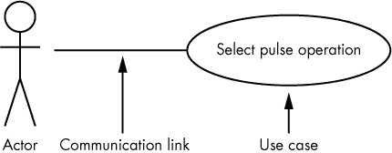

*图 4-1：一个示例用例图*

每个用例应具有一个高层次的名称，简洁且唯一地描述操作。例如，核反应堆操作员可能希望从核电（NP）通道中选择一个功率输入：“选择 %Pwr”是一个通用描述，而“按下 NP 设备上的百分比功率按钮”可能过于具体。用户如何选择百分比功率更多的是设计问题，而不是系统分析问题（分析是我们在此阶段进行的工作）。

用例名称应唯一，因为您可能会用它将图表与 UML 文档中的其他用例叙述关联起来。实现唯一性的一种方法是附加一个*标签*（请参阅标签格式）在第 172 页）。然而，用例图的主要目的是使操作对读者和利益相关者（即外部观察者）显而易见，而标签可能会使意义不清晰。一种可能的解决方案是在用例椭圆中同时包含描述性名称（或短语）*和*标签，如图 4-2 所示。

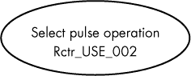

*图 4-2：一个结合了用户友好名称的用例标签*

标签唯一地标识用例叙述，且用户友好的名称使得图表易于阅读和理解。

用例图可以包含多个参与者以及多个用例，如图 4-3 所示，其中提供了生成个别兆瓦时（MWH）和其他报告的用例。

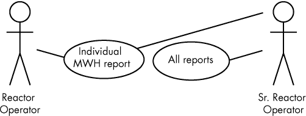

*图 4-3：用例图中的多个参与者和用例*

火柴人形象对于快速表明你正在指定一个演员非常有用，但它也有一些缺点。首先，火柴人形象比较大，可能占用相当大的屏幕（或页面）空间。另外，在一个大且杂乱的 UML 图中，将名称和其他信息与火柴人演员关联起来可能会变得困难。因此，UML 设计师通常使用构造型来表示演员。*构造型*是一个特殊的 UML 名称（如“演员”），它被引号（«和»）包围，并与元素名称一起封闭在矩形内，如图 4-4 所示。（如果你的编辑系统中没有引号，可以使用一对尖括号——小于号和大于号。）


*图 4-4：一个演员的构造型*

构造型可以应用于任何 UML 元素，而不仅仅是演员。构造型占用较少空间，减少了杂乱，但其缺点是，元素的类型不像使用实际图标时那么直观清晰。^(1)

#### *4.2.2 用例包*

你可以通过使用一对冒号将用例名称与不同的*包*名称分开，来为不同的包分配用例名称。例如，如果上述的反应堆操作员需要从两个不同的核电系统（NP 和 NPP）中选择百分比功率，我们可以使用`NP`和`NPP`包来分隔这些操作（参见图 4-5）。

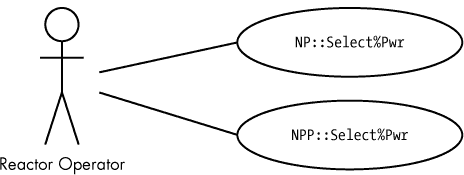

*图 4-5：用例中的包名称*

#### *4.2.3 用例包含*

有时，用例会重复信息。例如，图 4-5 中的用例可能对应于反应堆操作员为某个操作选择使用的核电通道（NP 或 NPP 仪表）。如果操作员必须在做出选择之前验证通道是否在线，那么`NP::Select%Pwr`和`NPP::Select%Pwr`中的任一用例可能都包含确认这一点所需的步骤。当编写这两个用例的叙述时，你可能会发现你在重复大量信息。

为了避免这种重复，UML 定义了*用例包含*，它允许一个用例完全包含另一个用例的功能。

你通过绘制两个椭圆形图标的用例，并在包括用例和被包含用例之间放置一个虚线箭头来指定用例包含。同时，将标签«include»附加到虚线箭头上，如图 4-6 所示。


*图 4-6：用例包含*

我们可以使用包含的方式重新绘制图 4-5，如图 4-7 所示。

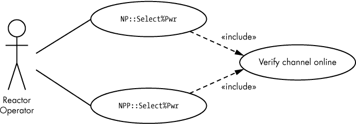

*图 4-7：用例包含示例*

包含是用例图中函数调用的等效物。包含允许你从其他用例中重用一个用例，从而减少冗余。

#### *4.2.4 用例泛化*

有时候，两个或更多用例共享一个基础设计，并在其基础上构建出不同的用例。回顾图 4-3 中的例子，资深反应堆操作员演员可能会生成额外的反应堆报告（即“所有报告”），而这些报告是反应堆操作员演员生成的报告（“单个 MWH 报告”）之外的。然而，这两个用例仍然是更一般的“生成报告”用例的例子，因此它们共享一些共同的（*继承的*）操作。这种关系被称为*用例泛化*。

我们可以通过在用例图中画一条从具体用例指向更一般的用例的空心箭头来表示用例泛化，如图 4-8 所示。

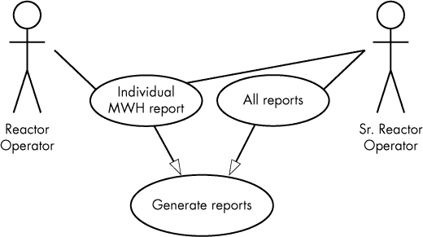

*图 4-8：用例的泛化*

该图告诉我们，“单个 MWH 报告”和“所有报告”用例共享一些从“生成报告”用例继承的共同活动。

我们也可以通过画一条从多个（具体的）演员指向一个概括的演员的开放箭头来对演员进行泛化，如图 4-9 所示。

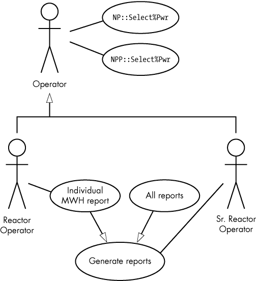

*图 4-9：演员的泛化*

泛化（特别是用例泛化）等同于面向对象系统中的继承。空心箭头指向基础用例，箭头的尾部（即没有箭头的那一端）连接到继承的或派生的用例。在图 4-9 中，“生成报告”是基础用例，而“单个 MWH 报告”和“所有报告”是派生用例。

派生用例继承了基础用例的所有特性和活动。也就是说，基础用例中的所有项和功能都存在于派生用例中，同时还包括一些仅属于派生用例的项。

在图 4-9 中，反应堆操作员演员只能选择“单个 MWH 报告”。因此，反应堆操作员演员生成的任何报告总是遵循与该单个报告相关的步骤。另一方面，资深反应堆操作员演员可以生成任何从“所有报告”或“单个 MWH 报告”用例派生的报告。

尽管泛化看起来与包含非常相似，但它们之间有细微的区别。在包含的情况下，一个用例是完全被包含的，而在继承中，基础用例是通过派生用例中的特性进行扩展的。

#### *4.2.5 用例扩展*

UML 的*用例扩展*允许你指定某些用例的可选（*条件性*）包含。你绘制一个类似包含的扩展，只不过使用“extend”代替“include”，并且箭头是虚线带实心箭头的。另一个不同点是，箭头指向扩展的用例，箭头尾指向扩展用例，如图 4-10 所示。

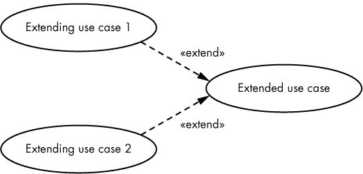

*图 4-10：用例扩展*

用例扩展在你希望根据某些内部系统/软件状态选择多个不同用例中的一个时非常有用。一个经典的例子是错误或异常处理条件。假设你有一个小型命令行处理器，它识别以动词开头的某些命令（例如`read_digital`）。命令语法可能如下所示：

```
read_digital port#
```

其中，`port#`是一个表示要读取端口的数字字符串。当软件处理此命令时，可能会发生两种错误：`port#`可能存在语法错误（即它不是有效的数字值），或者`port#`的值超出了范围。因此，处理此命令时可能有三种结果：命令正确并读取指定的端口；发生语法错误，系统向用户展示适当的消息；或者发生范围错误，系统显示适当的错误消息。用例扩展可以轻松处理这些情况，如图 4-11 所示。

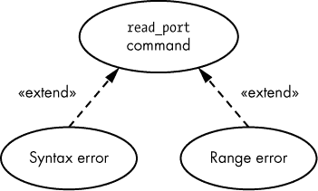

*图 4-11：用例扩展示例*

请注意，正常情况（无错误）不是扩展用例。`read_port`命令用例直接处理无错误的情况。

#### *4.2.6 用例叙述*

目前为止，你看到的用例图并没有解释任何细节。一个实际的用例（与用例*图*不同）是文本，而不是图形。用例图提供了用例的“高层概览”，并使外部观察者容易区分活动，但*用例叙述*才是你真正描述用例的地方。尽管用例叙述中没有固定的一组项，但通常包含表 4-1 中列出的信息。

**表 4-1：用例叙述项**

| **用例叙述项** | **描述** |
| --- | --- |
| 相关需求 | 与用例相关的需求标签或其他需求指示。这提供了与 SyRS 和 SRS 文档的可追溯性。 |
| 角色 | 与用例交互的角色列表。 |
| 目标/目的/简要描述 | 目标的描述（及其在系统中的背景），以明确用例的目的。 |
| 假设和前提条件 | 执行用例之前必须为真条件的描述。 |
| 触发器 | 启动用例执行的外部事件。 |
| 交互/事件流程 | 描述外部演员在执行用例期间如何与系统逐步交互。 |
| 可选交互/替代事件流程 | 与交互步骤描述的交互不同的替代交互。 |
| 终止 | 导致用例终止的条件。 |
| 结束条件 | 描述用例成功终止或失败时发生的情况。 |
| 后置条件 | 用例执行完成后适用的条件（无论成功或失败）。 |

额外项（在线搜索描述）可能包括：^(2)

+   最小保证

+   成功的保证

+   对话（实际上是交互的另一种名称）

+   次要演员

+   扩展（可选/条件性交互的另一个名称）

+   异常（即，错误处理条件）

+   相关用例（即，其他相关的用例）

+   利益相关者（对用例感兴趣的人）

+   优先级（在用例实现中的优先顺序）

##### 4.2.6.1 用例叙述的正式性

用例叙述可以从随意到正式不等。

随意的用例叙述是用自然语言（例如，英语）描述的用例，结构上较为简单。随意叙述适用于小型项目，并且通常因用例而异。

完全正式的用例叙述是对用例的正式描述，通常通过填写包含所有项目定义的表单来创建。完全正式的用例叙述通常包括三种形式：

+   用例项的列表，排除对话/事件流程/交互和替代事件流程/可选交互项

+   主要事件流程

+   替代事件流程（扩展）

表 4-2，4-3，和 4-4 显示了完全正式的用例叙述示例。

**表 4-2：** 选择核电源，RCTR_USE_022

| **需求** | **RCTR_SyRS_022, RCTR_SRS_022_000** |
| --- | --- |
| 演员 | 反应堆操作员，高级反应堆操作员 |
| 目标 | 选择在自动操作期间使用的电力测量通道 |
| 假设和前提条件 | 操作员已登录反应堆控制台 |
| 触发器 | 操作员按下相应按钮，选择自动模式电源 |
| 终止 | 操作员指定的电源被选择 |
| 结束条件 | 如果成功，系统在自动操作时使用选定的电源；如果失败，系统将恢复到原来的自动模式电源 |
| 后置条件 | 系统有一个可用的操作自动模式电源 |

**表 4-3：** 事件流程，RCTR_USE_022

| **步骤** | **操作** |
| --- | --- |
| 1 | 操作员按下 NP 选择按钮 |
| 2 | 系统验证 NP 是否在线 |
| 3 | 系统切换自动模式电源选择到核电源通道 |

**表 4-4：** 事件的替代流程（扩展），RCTR_USE_022

| **步骤** | **动作** |
| --- | --- |
| 2.1 | NP 通道不在线 |
| 2.2 | 系统未切换到使用 NP 电源通道，并继续使用先前选择的电源通道进行自动模式 |

##### 4.2.6.2 事件的替代流程

每当事件流程表中的步骤包含条件或可选项（在 UML 术语中称为*扩展*）时，你将在替代事件流程表中看到相应的条目，描述当条件项为 `false` 时的行为。请注意，你不会为每个条件使用单独的替代事件流程表；你只需使用与事件流程表中的步骤编号（例如表 4-3 的步骤 2）关联的子步骤（在本示例中为表 4-4 中的 2.1 和 2.2）。

这只是一个完整的用例叙述的可能示例。还有许多其他形式。例如，你可以创建第四个表来列出所有可能的结束条件，如表 4-5 所示。

**表 4-5：** 结束条件，RCTR_USE_022

| **条件** | **结果** |
| --- | --- |
| 成功 | NP 通道被选为自动模式电源通道 |
| 失败 | 先前选择的通道继续控制自动模式 |

如果有两个以上的结束条件，添加结束条件表尤其有说服力。

另一个示例是考虑图 4-11 中的 `read_port` 用例。它的叙述可能类似于表 4-6、4-7 和 4-8。

**表 4-6：** `read_port` 命令

| **需求** | **DAQ_SyRS_102, DAQ_SRS_102_000** |
| --- | --- |
| 角色 | PC 主机计算机系统 |
| 目标 | 读取数据采集系统上的数字数据端口 |
| 假设和前提条件 | 数字数据采集端口已初始化为输入端口 |
| 触发条件 | 接收到 `read_port` 命令 |
| 终止条件 | 数据端口被读取，返回值给请求系统 |
| 结束条件 | 如果命令格式不正确，系统返回端口值或适当的错误信息 |
| 后置条件 | 系统准备好接受另一个命令 |

**表 4-7：** 事件流程，`read_port` 命令

| **步骤** | **动作** |
| --- | --- |
| 1 | 主机 PC 发送以 `read_port` 开头的命令行 |
| 2 | 系统验证是否存在第二个参数 |
| 3 | 系统验证第二个参数是否为有效的数字字符串 |
| 4 | 系统验证第二个参数是否为 0–15 范围内的数字值 |
| 5 | 系统从指定的端口读取数字数据 |
| 6 | 系统将端口值返回给主机 PC |

**表 4-8：** 事件的替代流程（扩展），`read_port` 命令

| **步骤** | **动作** |
| --- | --- |
| 2.1 | 第二个参数不存在 |
| 2.2 | 系统向主机 PC 返回“语法错误”消息 |
| 3.1 | 第二个参数不是有效的数字字符串 |
| 3.2 | 系统向主机 PC 返回“语法错误”消息 |
| 4.1 | 第二个参数超出了 0–15 的范围 |
| 4.2 | 系统向主机 PC 返回“范围错误”消息 |

表 4-8 实际上包含了几个独立的事件流程。小数点左边的主要数字指定了与事件流程表中的步骤相关联的步骤；小数点右边的次要数字是替代事件流程中的特定步骤。流程仅在与单个事件流程编号关联的步骤内发生。也就是说，2.1 到 2.2 的流程在 2.2 结束；它不会继续到 3.1（在这个例子中）。

通常，一旦系统选择了一个替代流程（例如，本例中的“范围错误”流程，步骤 4.1 和 4.2），用例就在完成该替代流程时结束（即在步骤 4.2）。控制不会返回到主事件流程。只有在没有替代流程发生时，才会执行到主事件流程列表的末尾。

使用事件流程和替代事件流程的“正确”方式是编写一个直线序列，表示通过用例的路径，该路径产生预期的结果。如果存在多个可行路径，通常会为每个正确路径创建多个用例。替代流程处理任何偏离正确路径的情况（通常是错误路径）。当然，这种方法的一个风险是，您可能最终会得到过多的用例图。

对于事件流程，图表的创建和维护比文本描述更为昂贵；即使使用适当的 UML 绘图工具，创建图形通常也比仅仅编写文本描述更耗时和精力。

##### 4.2.6.3 条件事件流程

对于具有多个正确路径的用例，您可以使用分支和条件将这些路径编码到主事件流程中，并将替代路径留给异常情况。考虑一个数据采集系统的命令，该命令支持两种不同的语法：^(3)

```
ppdio boards

ppdio boards boardCount
```

第一个变体返回系统中的 PPDIO 板数量，第二个变体设置 PPDIO 板的数量。技术上正确的做法是为这两个命令创建两个独立的用例，每个用例都有自己的事件流程。然而，如果数据采集系统有数十个不同的命令，创建独立的用例可能会使文档显得杂乱无章。一个解决方案是通过将条件操作（即`if..else..endif`）合并到单个事件流程中，将这些用例合并为一个用例，具体如下面的示例所示。

**事件流程**

1.  验证命令以`ppdio`开头。

1.  验证命令行上的第二个单词是`boards`。

1.  如果命令行上没有出现额外的参数：

    1.  返回系统中 PPDIO 板的数量作为响应。

1.  验证该行上是否只有一个数值参数。

1.  验证数值参数是否在`0..6`的范围内。

1.  将 PPDIO 板的数量设置为数值参数中指定的值。

**替代流**

1.1 如果命令没有以`ppdio`开头，返回`not PPDIO`响应。

2.1 如果命令没有以`ppdio boards`开头，返回`not PPDIO BOARDS`响应。

5.1 返回`syntax error`作为响应。

6.1 返回`range error`作为响应。

在事件流中使用条件语句和多个退出点并不是“干净”的 UML；然而，它可以减少文档的整体大小（节省时间和费用），因此这是用例中常见的解决办法。

你甚至可以在事件流中加入`while`、`for`、`switch`等高级语言风格的操作。但请记住，用例（及其描述）应当非常通用。一旦你开始将编程语言的概念嵌入到用例中，你不可避免地会开始引入实现细节，而这些不属于用例的范畴；这些细节应留到后续的 UML 图（如活动图）中。

这些示例可能让人觉得替代流仅仅用于错误处理，但你也可以用它们来处理其他情况；任何时候条件分支脱离主流，你都可以使用扩展来处理。然而，使用替代流来处理通用条件的一个问题是，原本相关的概念最终会在你的用例描述中被分开，这会使得理解这些描述中的逻辑变得更加困难。

##### 4.2.6.4 泛化与扩展

泛化通常比扩展更有效。例如，假设你有一个通用的`port_command`用例，并且你想将`read_port`和`write_port`附加到它上面。理论上，你可以创建一个扩展来处理这个问题，如图 4-12 所示。

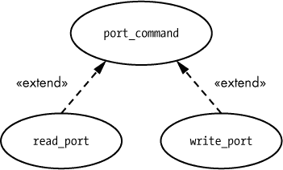

*图 4-12：用例扩展的糟糕示例*

实际上，这种情况可能更适合使用泛化处理，因为`read_port`和`write_port`是`port_command`的特例（而不是从`port_command`派生的替代分支）。图 4-13 展示了泛化方法。

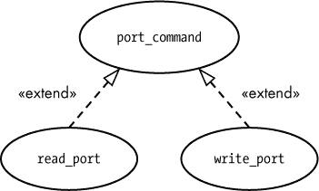

*图 4-13：使用泛化而不是扩展*

使用泛化时，派生的用例遵循基本用例中的所有步骤。当使用扩展时，控制从主事件流转移到替代事件流，主事件流中剩余的步骤将不再执行。

#### *4.2.7 用例场景*

*场景*是用例中的单一路径。例如，`read_port` 用例有四个场景：当命令读取端口并返回端口数据时的成功场景；两个语法错误场景（Alternative Flow of Events 中的 2.1/2.2 和 3.1/3.2）；以及一个范围错误场景（Alternative Flow of Events 中的 4.1/4.2）。通过选择完成特定路径的事件流程和备用事件流程中的步骤，你可以生成一个完整的场景。`read_port` 命令有以下场景：

**成功场景**

1.  主机发送以 `read_port` 开头的命令。

1.  系统验证是否存在第二个参数。

1.  系统验证第二个参数是否为数字字符串。

1.  系统验证第二个参数是否在 `0..15` 范围内。

1.  系统从指定的端口读取数据。

1.  系统将端口值返回给主机 PC。

**语法错误 #1 场景**

1.  主机发送以 `read_port` 开头的命令。

1.  系统确定没有第二个参数。

1.  系统向主机 PC 发送语法错误。

**语法错误 #2 场景**

1.  主机发送以 `read_port` 开头的命令。

1.  系统验证是否存在第二个参数。

1.  系统确定第二个参数不是合法的数字字符串。

1.  系统向主机 PC 发送语法错误。

**范围错误场景**

1.  主机发送以 `read_port` 开头的命令。

1.  系统验证是否存在第二个参数。

1.  系统验证第二个参数是否为数字字符串。

1.  系统确定数字字符串的值超出了 `0..15` 范围。

1.  系统向主机 PC 发送范围错误。

你可以使用场景来为系统创建测试用例和测试流程。每个场景都会有一个或多个测试用例。

你可以通过在事件流程中加入 `if` 语句来结合用例场景。然而，由于这会将低级细节引入你的用例叙述中，除非用例叙述数量失控，否则应避免结合场景。

### 4.3 UML 系统边界图

当你绘制简单的用例图时，应该能明显区分哪些组件是系统内部的，哪些是外部的。具体来说，参与者是外部实体，用例是内部的。不过，如果你使用带有刻板矩形而不是火柴人图形来表示参与者，可能不容易立刻明确哪些组件是系统外部的。此外，如果你在用例图中引用了多个系统，确定哪些用例属于哪个系统可能会很有挑战性。UML 系统边界图解决了这些问题。

*UML 系统边界图* 只是一个阴影矩形，围绕着特定系统内部的用例，如图 4-14 所示。系统标题通常出现在矩形的顶部附近。

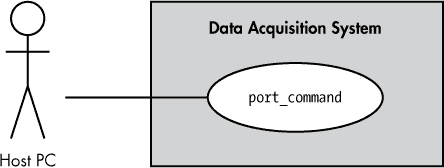

*图 4-14：系统边界图*

### 4.4 超越用例

本章介绍了 UML 用例，这是统一建模语言中一个非常重要的特性。然而，UML 除了用例之外，还有许多其他组件。下一章将介绍 UML 活动图，它提供了一种在软件设计中建模动作的方法。

### 4.5 获取更多信息

Bremer, Michael. *用户手册手册：如何研究、编写、测试、编辑和制作软件手册*。加利福尼亚州格拉斯谷：UnTechnical Press，1999 年。可以通过*[`www.untechnicalpress.com/Downloads/UMM%20sample%20doc.pdf`](http://www.untechnicalpress.com/Downloads/UMM%20sample%20doc.pdf)*下载样本章节。

Larman, Craig. *应用 UML 与模式：面向对象分析与设计及迭代开发导论*。第 3 版。新泽西州上萨德尔河：普伦蒂斯霍尔，2004 年。

Miles, Russ, 和 Kim Hamilton. *学习 UML 2.0：UML 的实用入门*。加利福尼亚州塞巴斯托波尔：O’Reilly Media，2003 年。

Pender, Tom. *UML 圣经*。印第安纳波利斯：Wiley，2003 年。

Pilone, Dan, 和 Neil Pitman. *UML 2.0 概要：桌面快速参考*。第 2 版。加利福尼亚州塞巴斯托波尔：O’Reilly Media，2005 年。

Roff, Jason T. *UML：初学者指南*。加利福尼亚州伯克利：麦格劳-希尔教育，2003 年。

Tutorials Point. “UML 教程。”[*https://www.tutorialspoint.com/uml/*](https://www.tutorialspoint.com/uml/)。
