## 第七章：UML 活动图**

UML *活动图*，传统上称为*流程图*，用于说明系统不同组件之间的工作流。流程图在软件开发的早期阶段非常流行，并且在面向对象编程（OOP）兴起之前的时期仍然用于软件设计。虽然 UML 面向对象的符号在很大程度上取代了传统的流程图，但 OOP 仍然依赖于小方法、函数和过程来实现低级的、细节丰富的部分，而流程图在这些情况下仍然用于描述控制流。因此，UML 的设计者创建了活动图，作为流程图的更新版本。

### 5.1 UML 活动状态符号

UML 活动图使用基于传统流程图符号的状态符号。本节描述了你将常用的一些符号。

**注意**

*如果你想了解关于一般流程图的信息，任何网络搜索应该都会有不错的结果。*

#### *5.1.1 起始和停止状态*

UML 图总是包含一个单一的*起始状态*，表示开始终端对象。它由一个实心圆和一个从中指向的单箭头（UML 术语中的*过渡*）组成。你可以将起始状态与一个标签关联，该标签可以是整个活动图的名称。

UML 通常还包含*结束状态*和*结束流程*符号。结束状态符号表示整个过程的终止，而结束流程符号表示单个线程的终止，适用于涉及多个执行线程的过程。你可以将结束状态符号与一个标签关联，表示过程结束时系统的状态。

图 5-1 显示了起始状态、结束状态和结束流程符号。

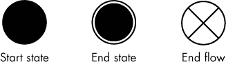

*图 5-1: UML 的起始和结束状态*

尽管活动图只有一个起始状态符号，但它可能有多个结束状态符号（想象一个方法从代码中的多个点返回）。附加在各种结束状态上的标签可能不同，如“异常退出”和“正常退出”。

#### *5.1.2 活动*

UML 中的活动符号是带有半圆形端点的矩形（类似于流程图中的终止符号），表示某个动作，如图 5-2 所示。^(1)

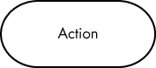

*图 5-2: UML 活动*

活动通常对应于编程语言中的一条或多条语句（动作），并按顺序执行。符号内的文本描述了要执行的动作，如“读取数据”或“计算 CRC”。一般来说，UML 活动图不包含太多低级细节；提供这些细节的任务由程序员负责。

#### *5.1.3 状态*

UML 活动图除了起始状态和结束状态外，还提供了中间状态，这些状态实际上充当了里程碑，指示在状态符号的某一点上存在的某些条件。状态符号是圆角矩形（*roundangles*），如图 5-3 所示，尽管圆角的大小比活动符号的圆角小得多。

*图 5-3: UML 状态*

状态符号中的文本应描述系统在该特定点的状态。例如，如果活动是“计算 CRC”，你可能会将紧接其后的状态标记为“CRC 已计算”或“CRC 可用”。状态不包含任何动作，只表示在特定时刻系统的当前状态。

#### *5.1.4 过渡*

过渡表示活动图中从一个点（例如状态或活动）到另一个点的控制流。如果一个过渡从某个活动流出，则表示系统在完成该活动的大部分动作后会进行该过渡。如果一对过渡流入并流出一个状态，则控制流会立即转移到流出箭头所指向的地方。UML 状态实际上是过渡中的一个标记，因此在 UML 状态中不会发生任何动作，如图 5-4 所示。

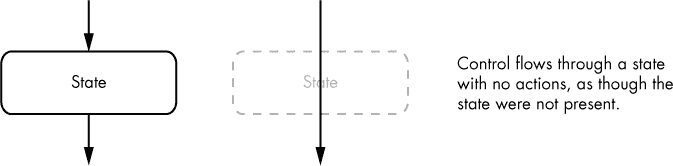

*图 5-4: 通过一个状态的控制流*

#### *5.1.5 条件语句*

在 UML 活动图中，你可以通过几种不同的方式处理条件语句：过渡守卫和决策点。

##### 5.1.5.1 过渡守卫

在条件语句中，布尔表达式附加在过渡符号上。UML 称这些布尔表达式为*守卫*。一个条件 UML 符号必须至少有两个受保护的过渡，这些过渡用方括号括起来的表达式标注，但可能有超过两个，如图 5-5 所示（其中六边形形状表示一个任意的 UML 符号）。

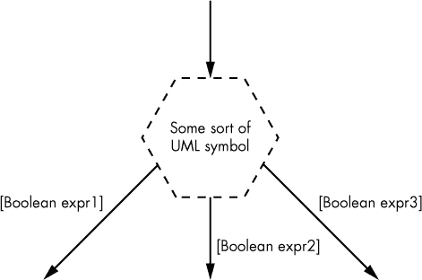

*图 5-5: 过渡守卫*

布尔表达式的集合必须是互斥的；也就是说，在任何时候，只有一个表达式可以为`true`。此外，表达式覆盖必须是*完整的*，在此语境中，意味着对于所有可能的输入值组合，至少一个布尔表达式在一组受保护的过渡中必须评估为`true`（这与第一个条件结合起来，意味着*只有一个*布尔条件必须评估为`true`）。

如果你希望有一个“通用”的过渡来处理现有守卫未处理的任何输入值，只需在过渡上附加如*else*、*otherwise* 或 *default* 等词语（见图 5-6）。

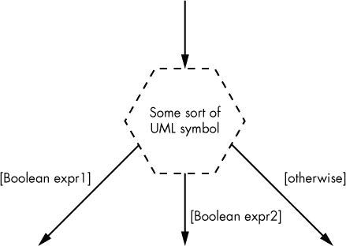

*图 5-6: 通用过渡守卫*

##### 5.1.5.2 决策点

带有守卫的转换几乎可以从任何 UML 符号中退出；状态和动作符号通常包含它们。然而，如果多个动作或状态合并到一个决策点，这时可能会产生问题，决策可能会创建分支路径。为此，UML 提供了一个特殊符号，*决策点*，来清晰地收集和连接发生决策分支的路径。决策点使用菱形符号，如图 5-7 所示。

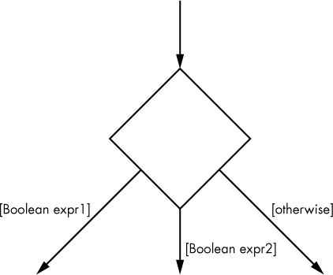

*图 5-7：一个 UML 决策点*

尽管 UML 允许受控转换从任何 UML 符号中发出，但最佳实践是始终使用决策点来开始一组相关的受控转换。

#### *5.1.6 合并点*

在 UML 中，我们还可以使用菱形符号将多个进入的转换收集到一个外出的转换中，如图 5-8 所示；我们称之为*合并点*。

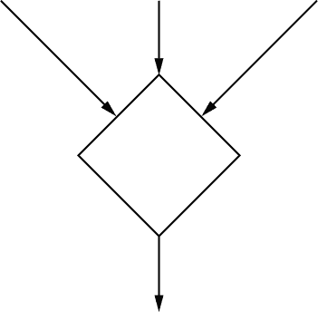

*图 5-8：一个 UML 合并点*

从技术上讲，合并点和决策点是相同的对象类型。实质上，合并点是一个没有名字的状态对象；它除了将控制从所有进入的转换传递到出去的转换外，不进行其他任何操作。决策点则是合并点的一个特殊情况，它有多个外出的受控转换。

从理论上讲，合并点可以有多个进入和外出的受控转换。然而，结果可能会非常复杂，因此常规做法是将单一的合并点拆分成独立的合并点和决策点，如图 5-9 所示。大多数情况下，这种分离比替代方案更清晰且易于阅读。

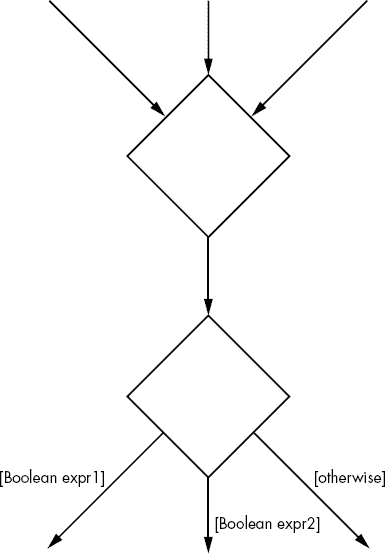

*图 5-9：UML 合并点和决策点*

#### *5.1.7 事件和触发器*

事件和触发器是控制流外的动作，通常来自其他执行线程或硬件输入，它们会导致控制流的某些变化。^(2) 在 UML 中，事件和触发器转换在语法上与带有守卫的转换相似，因为它们都由标记的转换组成。不同之处在于，带有守卫的转换会立即评估某个布尔表达式，并将控制转移到转换另一端的 UML 符号，而事件或触发器转换则在事件或触发器发生之前等待，然后才转移控制。

事件和触发器转换标有事件或触发器的名称，以及发生时提供给控制流的任何必要参数（参见图 5-10）。

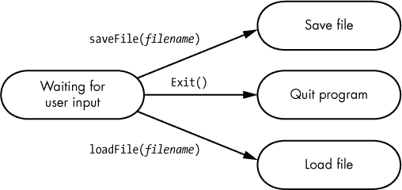

*图 5-10：UML 事件或触发器*

在这个例子中，系统正在等待用户的输入（可能是点击显示屏上的一个 UI 按钮）。当用户激活保存、退出或加载操作时，控制将转移到事件或触发器转换末尾指定的动作（分别是保存文件、退出程序或加载文件）。

你还可以将守卫条件附加到事件或触发过渡中，守卫条件是一个布尔表达式，位于触发器或事件后面的方括号内，如图 5-11 所示。这样，过渡只有在事件或触发发生且守卫表达式求值为`true`时才会发生。

*图 5-11：事件或触发器上的守卫条件*

UML 事件和触发器还支持动作表达式和多个动作，这些内容超出了本章的范围。如需了解更多内容，请查阅 Tom Pender 的*UML 圣经*中的示例（参见更多信息在第 100 页）。

#### *5.1.8 分叉与合并（同步）*

UML 通过提供符号支持并发处理，允许将单个执行线程拆分成多个线程，以及将多个执行线程合并为单个线程（见图 5-12）。^(3)

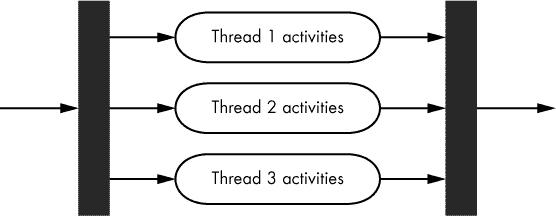

*图 5-12：分叉与合并*

UML 的*分叉*操作（一个细的实心矩形）将单一的执行线程分割成两个或多个并发操作。*合并*操作（同样由细的实心矩形表示）将多个线程集合合并为一个执行线程。合并操作还会同步线程：该图假设，进入合并操作的所有线程，除了最后一个线程，将会暂停，直到最后一个线程到达，这时单个执行线程将继续进行。

#### *5.1.9 调用符号*

UML 中的调用符号，看起来像一个小耙子，附加到活动上，明确声明它是另一个 UML 序列的调用。你将在 UML 活动中包含调用符号，并附上要调用的序列名称，如图 5-13 所示。

在 UML 文档的其他部分，你会使用调用名称作为活动图的名称来定义该序列（或*子程序*），如图 5-14 所示。

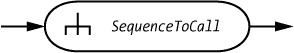

*图 5-13：一个 UML 序列调用*

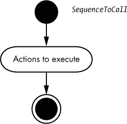

*图 5-14：一个 UML 子程序*

#### *5.1.10 分区*

分区用于组织一个过程的步骤，由多个并排的矩形框组成，每个框的顶部标有一个参与者、对象或域名。^(4) 活动图在框之间过渡，当过程的每个部分由某个框的拥有者控制时，正如图 5-15 所示。

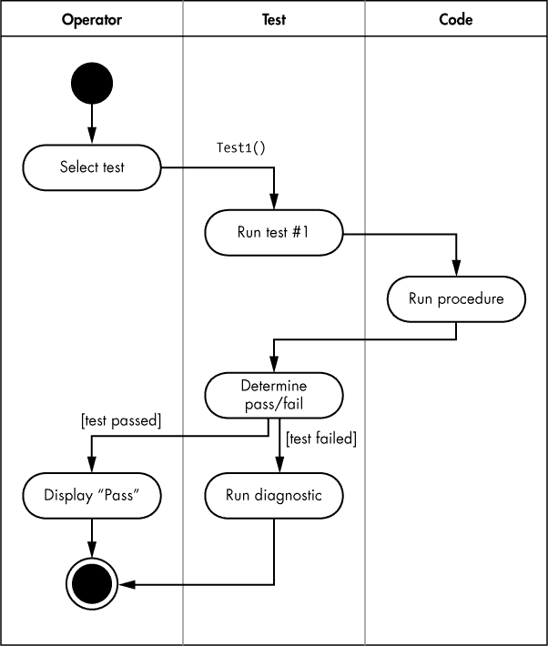

*图 5-15：一个 UML 分区*

图 5-15 中的过程展示了正在测试的代码。一个操作员选择要运行的测试，控制权交给测试软件。一个事件或触发器随后将控制权转交给“运行测试#1”的动作。测试软件调用正在测试的代码（位于第三个分区）。在代码执行完毕后，控制返回测试软件，测试软件根据测试是否通过来决定是显示“通过”给操作员，还是运行诊断程序。

#### *5.1.11 评论和注释*

UML 中的评论和注释使用一个看起来像小纸张并有折角的图标，如图 5-16 所示。你需要从框的一侧画一条虚线，指向你想要注释的 UML 元素。

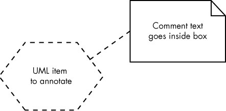

*图 5-16：UML 评论或注释*

#### *5.1.12 连接器*

连接器是带有内部标签（通常是数字）的圆圈，表示控制流转移到图中另一个具有相同标签的点（见图 5-17）。你可以使用相同的符号表示页面内连接器和页面外连接器。

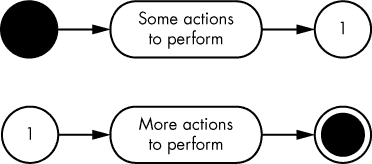

*图 5-17：UML 连接器*

正确使用 UML 连接器可以通过减少冗长或重叠的过渡线，使活动图更易于阅读。但要记住，连接器是编程语言中`goto`语句的 UML 等价物，过度使用可能会使图表更难阅读。

#### *5.1.13 额外的活动图符号*

完整的 UML 2.0 规范提供了许多可以在活动图中使用的附加符号，例如结构化活动、扩展区域/节点、条件节点、循环节点等。在本书的 UML 基础介绍中没有空间讨论所有这些内容，但如果你对更多细节感兴趣，请参见第 100 页中“更多信息”部分列出的资料，或在线搜索“UML”。

### 5.2 扩展 UML 活动图

有时 UML 活动图的符号表示无法满足需求。在这种情况下，你可能会有动机创造自己定制的符号。这几乎总是个坏主意，原因如下：

+   UML 是一个*标准*。如果你扩展了 UML，就不再使用一个明确的标准。这意味着所有学习过 UML 的人将无法理解你的活动图，除非他们首先阅读你的文档（而且这些文档会在你非标准的活动图中对他们可用吗？）。

+   有许多可用的 UML 图形工具用于创建和编辑 UML 活动图，而它们大多数无法处理非标准符号和对象。

+   许多计算机辅助软件工程（CASE）工具可以直接从 UML 图生成代码。同样，这些 CASE 工具只适用于标准 UML，可能无法处理你的非标准扩展。

+   如果你无法弄清楚如何在 UML 活动图中实现某个功能，你或许可以使用其他方案。用非标准的方法做一些你能通过标准工具轻松完成的任务，可能会被其他 UML 用户认为是一种业余的做法。

话虽如此，UML 仍然远远不完美。在少数情况下，开发一些非标准的活动图对象可以极大地简化你的活动图。

作为一个例子，考虑一个并发编程中的*临界区*，这是一个只有一个执行线程可以在同一时间内运行的代码区域。UML 序列图（详见第七章）使用*序列片段*符号来描述具有临界区的并发性。虽然你可以将序列片段符号应用于活动图，但结果会显得杂乱无章，且难以阅读和理解。在我为个人项目创建的一些活动图中，我使用了图 5-18 中的自定义符号来表示临界区。

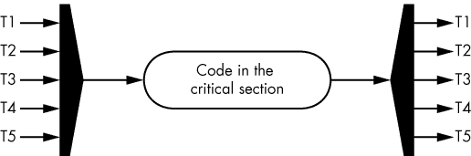

*图 5-18：非标准的临界区图*

从左侧五边形进入的箭头表示转换（通常来自不同的线程），它们在争夺一个临界区。五边形外的单一箭头表示发生在临界区内的单一执行线程。右侧的五边形接受这个单一执行线程，并将其路由回原始线程（例如，如果 T1 是进入临界区的线程，则临界区结束时，控制将返回到 T1 的转换/流程）。

这个图表并不意味着只有五个线程可以使用这个临界区。它表达的是五个活动图流程（T1–T5）可能会竞争这个临界资源。实际上，可能有多个线程在执行这些流程中的任何一个，并且也在争夺临界区资源。例如，可能有三个线程在执行 T1 流程并等待临界区可用。

由于多个线程可能在同一个流程中执行，因此在临界区图中，只进入临界区的流可能是单一的（见图 5-19）。

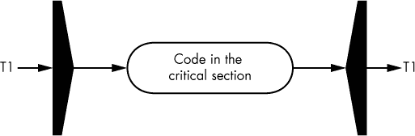

*图 5-19：单流临界区图*

这个示例要求多个线程执行相同的流程（T1），才能使这个图表有意义。

正如你所看到的，即使是这样一个简单的图示，也需要相当多的文档来描述和验证它。如果这些文档不可用（即，如果它们没有直接嵌入你的 UML 活动图中），读者在试图理解你的图示时可能找不到它。当你在图示中直接注释一个非标准对象时，这是唯一合理的做法。将有意义的文档放在包含活动图的文档的单独部分（例如 SDD 文档）或完全放在另一个文档中，当别人将你的图示剪切并粘贴到其他文档时，这些信息将无法使用。

**注意**

*图 5-19 中的临界区域图只是你可能扩展 UML 活动图的一种示例。一般来说，我不建议在你自己的图示中采用它，也不建议扩展 UML 符号。然而，如果你真的需要，你应该知道这个选项是可以使用的。*

### 5.3 更多信息

Bremer, Michael. *《用户手册手册：如何研究、编写、测试、编辑和制作软件手册》*。加利福尼亚州格拉斯谷：UnTechnical Press，1999 年。可以在 *[`www.untechnicalpress.com/Downloads/UMM%20sample%20doc.pdf`](http://www.untechnicalpress.com/Downloads/UMM%20sample%20doc.pdf)* 获取示例章节。

Larman, Craig. *《应用 UML 和模式：面向对象分析与设计及迭代开发导论》*。第三版。新泽西州上萨德尔河：Prentice Hall，2004 年。

Miles, Russ 和 Kim Hamilton. *《学习 UML 2.0：UML 的务实入门》*。加利福尼亚州塞巴斯托波尔：O'Reilly Media，2003 年。

Pender, Tom. *《UML 圣经》*。印第安纳波利斯：Wiley，2003 年。

Pilone, Dan 和 Neil Pitman. *《UML 2.0 概览：桌面快速参考》*。第二版。加利福尼亚州塞巴斯托波尔：O'Reilly Media，2005 年。

Roff, Jason T. *《UML：初学者指南》*。加利福尼亚州伯克利：McGraw-Hill Education，2003 年。

Tutorials Point. “UML 教程。” [*https://www.tutorialspoint.com/uml/*](https://www.tutorialspoint.com/uml/)。
