## 第八章：UML 类图**


本章介绍了*类图*，这是 UML 中一个非常重要的图示工具。类图是定义程序中数据类型、数据结构和对数据进行操作的基础。反过来，它们也是*面向对象分析 (OOA)* 和*面向对象设计 (OOD)*的基础。

### 6.1 UML 中的面向对象分析与设计

UML 的创建者希望有一个正式的系统来设计面向对象的软件，以取代当时（1990 年代）可用的结构化编程形式。在这里，我们将讨论如何在 UML 中表示类（数据类型）和对象（数据类型的实例变量）。

UML 中最完整的类图形式见图 6-1。

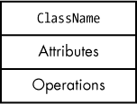

*图 6-1：完整的类图*

*属性* 对应于类的数据字段成员（即变量和常量）；它们代表类内部的信息。

*操作* 对应于表示类行为的活动。操作包括方法、函数、过程以及我们通常认作代码的其他内容。

有时，引用类图时不需要列出所有的属性和操作（或者根本没有属性和操作）。在这种情况下，你可以绘制部分类图，如图 6-2 所示。

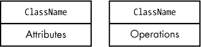

*图 6-2：部分类图*

部分类图中缺少属性或操作并不意味着它们不存在；这只是表示在当前上下文中没有必要将它们添加到图中。设计者可能会让编码者在编码时自行补充这些内容；或者可能完整的类图在其他地方出现，而当前图中只包含感兴趣的信息。

在最简单的形式中，UML 使用一个简单的矩形表示类，矩形内包含类的名称，如图 6-3 所示。


*图 6-3：一个简单的类图*

再次强调，这并不意味着该类没有属性或操作（那样的话就没有意义）；这只是表示这些项目在当前图中不重要。

### 6.2 类图中的可见性

UML 定义了四种类成员的*可见性*（这些都来自 C++ 和 Java，尽管其他语言，如 Swift，也支持它们）：public（公共）、private（私有）、protected（受保护）和 package（包）。我们将逐一讨论每种可见性。

#### *6.2.1 公共类可见性*

公有类成员对所有类和代码都是可见的，既可以在包含该公有项的类内部访问，也可以在外部访问。在设计良好的面向对象系统中，公有项几乎总是操作（方法、函数、过程等），并构成类对外部世界的接口。尽管你也可以将属性设置为公有，但这样做往往会破坏面向对象编程的主要好处之一：*封装性*，即能够将类内部的值和活动隐藏起来，防止外界访问。

在 UML 中，我们使用加号（`+`）作为公有属性和操作的前缀，如图 6-4 所示。公有属性和操作的集合提供了类的*公有接口*。

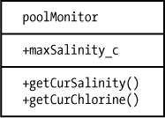

*图 6-4：公有属性和操作*

该图包含一个公有属性，`maxSalinity_c`。`_c`后缀是我用来表示该字段是*常量*而非变量的约定。^(1) 在良好的设计中，常量通常是类中唯一的公有属性，因为外部代码不能更改常量的值：它仍然可见（即没有被隐藏或封装），但不可更改。封装的主要原因之一是防止外部代码更改内部类属性时产生副作用。由于外部代码不能更改常量的值，这种不可变性实现了与封装相同的效果；因此，面向对象的设计者愿意使某些类常量可见。^(2)

#### 6.2.2 私有类可见性

在另一端是私有可见性。私有属性和操作仅在该类内部可访问：它们对其他类和代码隐藏。私有属性和操作是封装性的体现。

我们使用减号（`-`）表示类图中的私有实体，如图 6-5 所示。

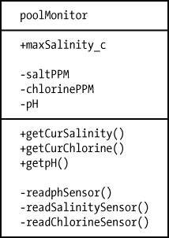

*图 6-5：私有属性和操作*

你应该对任何不绝对需要其他可见性形式的属性或操作使用私有可见性，并力求确保所有属性（类中的数据字段）都是类的私有成员。如果外部代码需要访问数据字段，你可以使用公有的*访问器*函数（获取器和设置器）来提供对私有类成员的访问。*获取器*函数返回私有字段的值。*设置器*函数将一个值存储到私有字段中。

如果你在想，为什么还要使用访问器函数（毕竟，直接访问数据字段不是更简单吗？^(3)），请考虑以下情况：setter 函数可以检查你存储在属性中的值，确保它在范围内。另外，并非所有字段都独立于类中的其他属性。例如，在盐水游泳池中，盐度、氯含量和 pH 值并不是完全独立的：泳池中有一个电解池，将水和氯化钠（盐）转化为氢氧化钠和氯气。这一转化过程会降低盐度，同时提高氯含量和 pH 值。因此，与其让外部代码任意修改盐度值，你可能希望通过 setter 函数传递该修改，以便它可以决定是否同时调整其他水平。

#### *6.2.3 受保护类可见性*

尽管公有和私有可见性涵盖了大部分可见性需求，但在某些特殊情况下，如继承，你需要使用介于两者之间的可见性：受保护可见性。

继承与封装和多态一起，是面向对象编程的“三大特性”之一。继承允许一个类接收另一个类的所有特性。

私有可见性的问题在于*你不能在继承它们的类中访问私有字段*。然而，受保护可见性放宽了这些限制，允许继承类访问，但不允许类外部或其继承类访问私有字段。

UML 注记使用井号（`#`）来表示受保护的可见性，如图 6-6 所示。

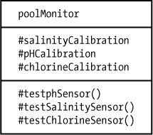

*图 6-6：受保护的属性和操作*

#### *6.2.4 包类可见性*

包可见性位于私有和受保护之间，主要是 Java 的概念。其他语言也有类似的东西，包括 Swift、C++ 和 C#，你可以使用命名空间来模拟包可见性，尽管语义上并不完全相同。

包保护字段在同一包中的所有类之间是可见的。包外的类（即使它们继承了包含包保护字段的类）不能访问具有包可见性的项。

我们使用波浪号（`~`）来表示包可见性，如图 6-7 所示。第八章讨论了 UML 包注记（即如何将多个类放置在同一个包中）。

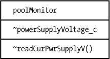

*图 6-7：包属性和操作*

#### *6.2.5 不支持的可见性类型*

如果你选择的编程语言不支持 UML 指定的相同可见性类型，会发生什么呢？好消息是，UML 可见性在很大程度上是一个范围，如图 6-8 所示。^(4)

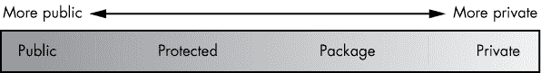

*图 6-8：可见性范围*

如果你的编程语言不支持特定的可见性，你总可以将更私有的可见性替换为更公开的可见性。例如，高级汇编（HLA）语言仅支持公共字段；C++仅部分支持包可见性（通过`friend`声明或*命名空间*）；Swift 支持包可见性的一个分支——对象内的所有私有字段会自动对同一源文件中声明的所有类可见。一种避免滥用额外可见性的方法是为属性或操作的名称添加某种可见性标注——例如，通过在受保护的名称前加上`prot_`，然后将其声明为公共对象，如图 6-9 所示。

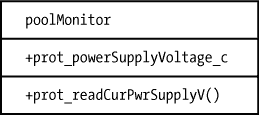

*图 6-9：伪造可见性限制*

### 6.3 类属性

UML 类中的属性（也称为*数据字段*或简单地称为*字段*）包含与对象关联的数据。属性有可见性和名称；它还可以有数据类型和初始值，如图 6-10 所示。

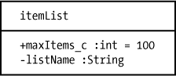

*图 6-10：属性*

#### *6.3.1 属性可见性*

如前所述，你通过在属性名称前加上`+`、`-`、`#`或`~`符号来指定属性的可见性，分别表示公共、私有、受保护和包可见性。有关更多细节，请参见“类图中的可见性”在第 105 页。

#### *6.3.2 属性派生值*

大多数情况下，类将属性值存储为变量或常量数据字段（即*基础*值）。然而，一些字段包含*派生*值，而不是基础值。每当某个表达式引用该属性时，类会计算派生值。一些语言（如 Swift）提供了直接定义声明值的语法；而在其他语言（如 C++）中，你通常需要编写 getter 和 setter 访问器函数来实现派生值。

在 UML 中创建派生属性时，立即在属性名称前（可见性符号之后）加上斜杠(`/`)，如图 6-11 所示。


*图 6-11：派生属性*

每当你使用派生属性时，必须在某处定义如何计算它。图 6-11 为此目的使用了注释，尽管你也可以使用*属性字符串*（参见“属性字符串”在第 112 页）。

#### *6.3.3 属性名称*

属性名称应该适用于你用来实现设计的任何编程语言。尽量避免使用特定编程语言的语法或约定，除非要求使用该语言来实现。通常，以下约定适用于 UML 属性名称：

+   所有名称应以一个（ASCII）字母字符（a–z 或 A–Z）开头。

+   在第一个字符之后，名称应仅包含 ASCII 字母字符（a–z, A–Z）、数字（0–9）或下划线（_）。

+   所有名称的前六到八个字符应当是唯一的（某些编译器允许任意长度的名称，但在编译过程中仅在内部符号表中保留其前缀）。

+   名称应该短于某个任意长度（这里我们使用 32 个字符）。

+   所有名称应当是*不区分大小写*的；也就是说，两个不同的名称必须包含至少一个不同的字符，而不仅仅是大小写的差异。此外，给定名称的所有出现应该在字母大小写方面保持一致。^(5)

#### *6.3.4 属性数据类型*

UML 对象可以选择性地关联一个数据类型（参见图 6-10 中的示例）。UML 并不要求你明确声明数据类型；如果缺少数据类型，假设读者可以从属性的名称或用法中推断出数据类型，或者程序员在实现设计时决定数据类型。

你可以为原始数据类型使用任何类型名称，并让程序员在编写代码时选择适当的或最匹配的数据类型。也就是说，在使用通用数据类型时，大多数人选择 C++或 Java 的类型名称（这很有道理，因为 UML 的设计在很大程度上是基于这两种语言的）。你会在 UML 属性中看到的常见数据类型包括：

+   `int`, `long`, `unsigned`, `unsigned long`, `short`, `unsigned short`

+   `float`, `double`

+   `char`, `wchar`

+   `string`, `wstring`

当然，任何用户定义的类型名称也是完全有效的。例如，如果你在设计中将`uint16_t`定义为与`unsigned short`相同的含义，那么将`uint16_t`作为属性类型是完全可以接受的。此外，你在 UML 中定义的任何类对象也都可以作为有效的数据类型名称。

#### *6.3.5 操作数据类型（返回值）*

你还可以将数据类型与操作关联。例如，函数可以返回某种数据类型的值。为了指定返回数据类型，可以在操作名称（和参数列表）后跟一个冒号和数据类型，如图 6-12 所示。

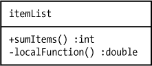

*图 6-12：返回类型*

我们将在“类操作”一节中进一步讨论操作，第 112 页。

#### *6.3.6 属性多重性*

一些属性可能包含数据对象的集合（数组或列表）。在 UML 中，我们使用方括号`[]`表示基数，类似于许多高级语言中的数组声明；见图 6-13。

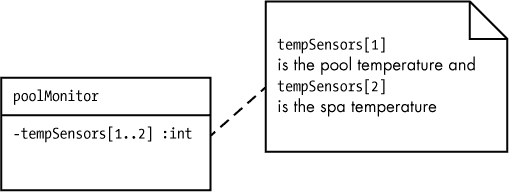

*图 6-13：基数*

在方括号内，您可以指定一个表达式，可以是以下任意内容：

+   一个数字值（例如，`5`）表示集合中元素的数量

+   一个数字范围（例如，`1..5`或`0..7`），表示集合元素的数量和有效的后缀范围

+   一个星号（`*`）表示任意数量的元素

+   一个星号终止的范围（例如，`0..*`或`1..*`），表示一个开放的数组元素范围

如果没有这个符号，基数默认为`[1]`（即单个数据对象）。

#### *6.3.7 默认属性值*

要为属性指定初始值，使用等号（`=`）后跟一个表达式（类型应适合该属性）。这通常跟随属性的基数（如果存在）和/或类型。但如果类型可以从初始值推断出来，则可以省略类型和基数。如果基数不是`1`，则在大括号内包含一个逗号分隔的初始值列表，每个元素一个。见图 6-14。

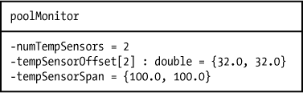

*图 6-14：初始值*

在这个示例中，`numTempSensors`属性是`integer`类型（可以从初始值`2`推断出来），而`tempSensorSpan`是一个包含两个元素的`double`数组（通过大括号中的数量和类型的值来推断）。

#### *6.3.8 属性字符串*

UML 的属性语法可能无法覆盖所有可能的属性情况。UML 提供了*属性字符串*来处理特殊情况。要创建一个属性字符串，您需要在属性末尾添加描述它的文本，并将其放在大括号内，如图 6-15 所示。

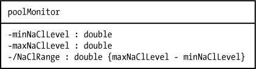

*图 6-15：属性字符串*

您还可以使用属性字符串来定义其他属性类型。常见的例子包括`{readOnly}`、`{unique}`和`{static}`。^(6) 请记住，属性字符串是属性中的一个通用字段。您可以在大括号内定义任何语法。

#### *6.3.9 属性语法*

属性的正式语法如下所示（注意，选项项出现在大括号中，除了引用的大括号，它们表示字面上的大括号字符）：

```
{visibility}{"/"} name { ":" type }{multiplicity}{"=" initial}{"{"property string"}"}
```

### 6.4 类操作

类操作是类中的项目，执行某些操作。通常，操作代表类中的代码（但也可能有与派生属性相关联的代码，因此代码不仅限于 UML 类中的操作）。

UML 类图将属性和操作放入不同的矩形中，尽管这并不是区分它们的标准。（考虑图 6-2：部分类图在区分哪些类图只包含属性，哪些类图只包含操作方面存在歧义。）在 UML 中，我们通过在操作名称后加上（可能为空的）参数列表并用括号括起来来明确指定操作（参考图 6-4 查看示例）。

如“操作数据类型（返回值）”一节中所述，在第 110 页你还可以通过在参数列表后加上冒号和数据类型名称来为操作指定返回类型。如果存在类型，则表示你有一个函数；如果缺少类型，则你可能有一个过程（*空函数*）。

到目前为止，所有操作示例中缺少的都是参数。要指定参数，可以在操作名称后面的括号内插入以逗号分隔的属性列表，如图 6-16 所示。

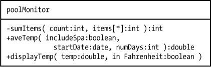

*图 6-16：操作参数*

默认情况下，UML 操作中的参数是 *值* 参数，这意味着它们作为参数传递给操作，且操作对值参数所做的更改不会影响调用者传递给函数的实际参数。值参数是 *输入参数*。

UML 还支持 *输出* 参数和 *输入/输出* 参数。顾名思义，输出参数将信息从操作返回到调用代码；输入/输出参数则将信息传递给操作并返回数据。UML 使用以下语法表示输入、输出和输入/输出参数：

+   输入参数：`in` *paramName*`:`*paramType*

+   输出参数：`out` *paramName*`:`*paramType*

+   输入/输出参数：`inout` *paramName*`:`*paramType*

默认的参数传递机制是输入。如果参数名前没有任何说明，UML 假设它是一个 `in` 参数。图 6-17 展示了一个简单的 `inout` 参数示例。


*图 6-17：参数输入输出示例*

在这张图中，待排序项的列表是一个输入 *和* 输出参数。在输入时，`items` 数组包含待排序的数据；在输出时，它包含排序后的项（就地排序）。

UML 尽量做到尽可能通用。`in`、`out` 和 `inout` 参数传递说明符并不一定意味着按值传递或按引用传递。这个实现细节留给实际的实现者来决定。从设计角度来看，UML 只指定数据传输的方向，而不是数据如何被传输。

### 6.5 UML 类关系

在本节中，我们将探讨类之间的五种不同关系：依赖关系、关联关系、聚合关系、组合关系和继承关系。

类似于可见性，类之间的关系沿着一个光谱分布（见图 6-18）。这个范围是基于它们的*强度*，即两个类之间的相互通信的级别和类型。

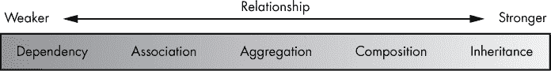

*图 6-18：类关系光谱*

强度范围从*松散耦合*到*紧密耦合*。当两个类是紧密耦合时，对一个类的任何修改很可能会影响到另一个类的状态。松散耦合的类通常相互独立；对一个类的修改不太可能影响到另一个类。

我们将依次讨论每种类型的类关系，从最弱到最强。

#### *6.5.1 类依赖关系*

当一个类的对象需要与另一个类的对象*短暂*合作时，这两个类就形成了依赖关系。在 UML 中，我们使用一个虚线开口箭头来表示依赖关系，如图 6-19 所示。

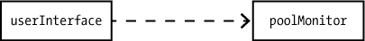

*图 6-19：依赖关系*

在这个例子中，每当`userInterface`对象想要检索数据进行显示时（例如，当你将`poolMonitor`对象作为参数传递给`userInterface`方法时），`userInterface`和`poolMonitor`类就会协同工作。除此之外，两个类（以及这些类的对象）相互独立操作。

#### *6.5.2 类关联关系*

关联关系发生在一个类包含一个属性，而该属性的类型是另一个类时。UML 中有两种表示关联关系的方式：内联属性和关联链接。你已经见过内联属性——它们是你在第 112 页的“属性语法”中看到的常规属性定义。唯一的要求是类型名称必须是其他类。

指定类关联关系的第二种方式是通过关联*线*或*链接*，如图 6-20 所示。

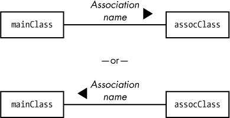

*图 6-20：关联关系*

*关联名称*通常是一个动词短语，描述关联关系，如*拥有*、*控制*、*由…拥有*、*由…控制*（见图 6-21）。

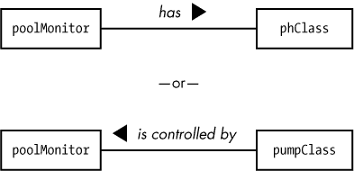

*图 6-21：关联名称*

我们如何从关联图中判断哪个类是另一个类的属性呢？注意关联名称左侧或右侧的箭头头部。这指示了关联的方向；在这里，它表明`poolMonitor`有一个`phClass`，而不是反过来。

尽管一个有意义的关联名称和箭头动词短语可以给你一个线索，但无法保证你的直觉是正确的。虽然这看起来可能违反直觉，但在图 6-21 中，`pumpClass`可能包含`poolMonitor`对象作为一个属性，即使`poolMonitor`类控制着`pumpClass`对象。UML 的解决方案是通过应用*可导航性*（参见“可导航性”在第 123 页）来处理，通过在指向作为其他类属性的类上放置一个开口箭头，如图 6-22 所示。

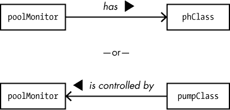

*图 6-22：关联的可导航性*

#### *6.5.3 类聚合关系*

聚合是关联的一个稍微紧密耦合的版本，存在于一个可能是独立存在的类，但又是一个更大类的一部分。大多数时候，聚合关系是一种*控制*关系；也就是说，一个控制类（*聚合类*或*整体类*）控制一组从属对象或属性（*部分类*）。聚合类不能在没有部分类的情况下存在；然而，部分类可以在聚合类的上下文之外存在（例如，一个部分类可以与聚合类和另一个类建立关联）。

聚合作为*门控*器，负责其部分属性，确保部分方法以适当的参数（例如，范围检查）被调用，并且这些部分的操作环境是一致的。聚合类还可以检查返回值的一致性，处理部分类引发的异常和其他问题。

例如，你可以有一个`pHSensor`类，它与独立的 pH 计配合得很好，一个`salinitySensor`类，它与独立的盐度（或电导率）传感器配合得很好。`poolMonitor`类不是一个独立的类：它需要这两个类来完成它的工作，尽管它们不需要`poolMonitor`来完成它们的工作。我们通过在聚合类（`poolMonitor`）上使用空心菱形符号，并通过一条关联线连接到部分类（`pHSensor`和`salinitySensor`）来建模这种关系，如图 6-23 所示。

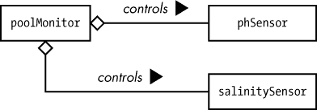

*图 6-23：聚合关系*

关联线的开口菱形端（即聚合类）总是包含关联线另一端的属性类（部分类）。

聚合对象及其关联部分对象的生命周期不一定相同。你可以创建多个部分对象，然后将它们附加到聚合对象上。当聚合对象完成任务后，它可以被销毁，而部分对象则可以继续解决其他问题。换句话说，从低级编程的角度来看，系统在聚合对象中存储指向部分对象的指针。当系统销毁聚合对象的存储时，指针可能会消失，但它们所引用的对象可能会继续存在（并且可能会被系统中的其他聚合对象指向）。

为什么使用聚合图？对于关联和聚合生成的代码是相同的。区别在于意图。在聚合图中，设计师表示部分对象或类由聚合类或对象控制。以我们的`poolMonitor`示例为例，在聚合关系中，`poolMonitor`完全掌控——`salinitySensor`和`pHSensor`对象由它控制，绝不是反过来。而在关联关系中，相关类是*平等*的，而不是主从关系；也就是说，`pHSensor`和`salinitySensor`可以独立于`poolMonitor`操作——反之亦然——仅在必要时共享信息。

#### *6.5.4 类的组合关系*

在组合关系中，较小的类是由较大的类包含的，这些小类不是独立的类：它们仅存在于支持包含它们的*组合*类。与聚合不同，组合部分只能属于单一的组合。

组合对象和部分对象的生命周期是相同的。当你销毁组合对象时，包含的部分对象也会被销毁。组合对象负责分配和回收与部分对象相关的存储空间。

我们使用实心菱形来表示组合关系，如图 6-24 所示。

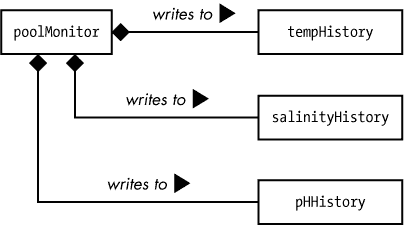

*图 6-24：组合关系*

#### *6.5.5 关系特性*

对于依赖、关联、聚合和组合关系，UML 支持这 10 个特性，其中一些你已经见过：

+   属性名称

+   角色

+   接口说明符

+   可见性

+   多重性

+   顺序

+   约束

+   限定符

+   可导航性

+   可变性

这些特性不适用于继承关系，这就是为什么我还没有描述它。我们将在后面的“类继承关系”部分中讨论继承内容，具体见第 125 页，但首先我们会讲解这些关系特性。

**注意**

*为了简化，我使用*关联*来讨论每个特性，但*依赖*、聚合*和*组合*都同样适用。

##### 6.5.5.1 关联和属性名称

附加到链接上的关联名称可以告诉你交互的类型或所有权，但它并没有说明这两个类是如何相互引用的。关联链接仅提供两个类对象之间的连接。类通过类定义中的属性和操作字段来相互引用。

正如你在“类关联关系”部分中阅读到的，关联图实际上是将属性或操作名称嵌入类中的内联语法的替代方案。图 6-25 中的两个图示是等效的。

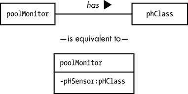

*图 6-25：简写（上）和长写（下）关联关系图*

在图 6-25 中，简写版本缺少了属性或操作名称（在此示例中为`pHSensor`）以及可见性（`-`，或私有），但你可以通过将属性名称附加到离对象最近的关联链接上，来补充这些缺失的部分，如图 6-26 所示。

与内联语法一样，属性名称由属性或操作名称和可见性符号前缀（`-`，`~`，`#`，或`+`）组成。可见性符号必须存在，因为它区分了属性名称和角色（接下来将描述）。

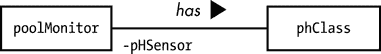

*图 6-26：属性名称*

另一种选择是将关联和属性名称结合在一起，如图 6-27 所示。

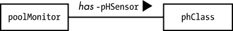

*图 6-27：组合关联和属性名称*

##### 6.5.5.2 角色

在图 6-27 中，两个类的作用并不完全清晰。`poolMonitor`类有一个连接到`pHClass`的`pHSensor`字段，但图示并未解释发生了什么。通常出现在关联链接两端的*角色*，提供了缺失的描述。

在此示例中，`poolMonitor`类或对象通常从 pH 传感器设备（封装在`pHClass`中）读取 pH 值。反之，`pHClass`类或对象可以提供 pH 读数。你可以使用 UML 中的角色来描述这两个活动（读取 pH 和提供 pH 值）。图 6-28 展示了这些角色的示例。

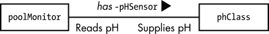

*图 6-28：角色*

##### 6.5.5.3 接口说明符

*接口*是一组预期由某些类提供的操作。它类似于类，但不会实例化对象。遵循接口的类确保提供接口中所有存在的操作（并为这些操作提供方法）。如果你是 C++程序员，你可以把接口看作是一个只包含抽象成员函数的抽象基类。Java、C#和 Swift 都有各自的定义接口（也称为*协议*）的特殊语法。

**注意**

*接口说明符在 UML 1.x 中受支持，但已从 UML 2.0 中删除。我在本章中描述它们，因为你可能会遇到它们，但你不应该在新的 UML 文档中使用它们，因为它们已被弃用。*

如果一个类实现了一个接口，它实际上是继承了该接口的所有操作。也就是说，如果一个接口提供了操作 A、B 和 C，而某个类实现了该接口，那么这个类也必须提供操作 A、B 和 C（并提供这些操作的具体实现）。有两种不同的方式来指定一个接口——使用 *立体符号* 或 *球体符号*，如 图 6-29 所示。

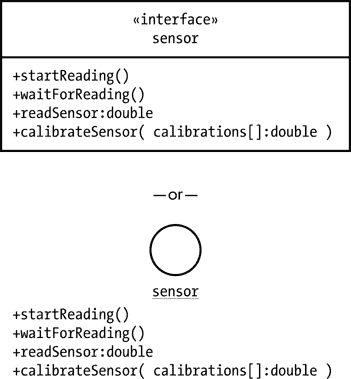

*图 6-29：接口语法：立体符号（顶部）和球体符号（底部）*

为了表示一个类实现了某个接口，你需要从类到接口图绘制一条带有空心箭头的虚线，如 图 6-30 所示。

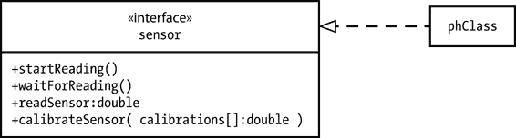

*图 6-30：接口实现图*

##### 6.5.5.4 可见性

可见性适用于关联链接中的属性名。如前所述，所有属性名必须以符号（`-`、`~`、`#` 或 `+`）作为前缀，用来指定它们的可见性（分别为私有、包内、受保护或公共）。

##### 6.5.5.5 多重性

“属性多重性”部分在 第 111 页 介绍了内联属性的多重性。你还可以通过在关联链接的两端或其中一端指定多重性值，将多重性包含在关联图中（参见 图 6-31）。将多重性值放在链接的上方或下方，且尽可能靠近它所适用的类或对象。如果没有提供多重性值，则默认值为 `1`。

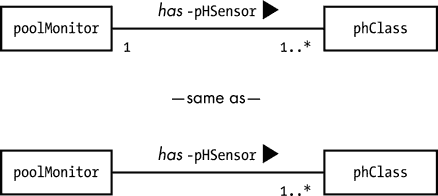

*图 6-31：关联链接上的多重性*

图 6-31 表明存在一个 `poolMonitor` 对象，它可以有一个或多个关联的 `pHSensor`（例如，水疗池和游泳池中可能分别有不同的 pH 传感器）。

这个示例展示了一个 *一对多* 的关系。图中也可以有 *多对一* 甚至 *多对多* 的关系。例如，图 6-32 显示了 `poolMonitor` 和 `pHClass` 类或对象之间的多对多关系（如果你很难想象这种关系如何运作，可以考虑一个有多个泳池和多个 pH 测量仪的水上乐园）。

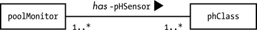

*图 6-32：多对多关系*

##### 6.5.5.6 排序

UML 提供了 `{ordered}` 约束，你可以将其附加到任何多重性不是 `1` 的关联上（参见 图 6-33）。


*图 6-33：有序关联*

当单独出现时，`{ordered}` 约束并未指定如何排序项目列表，只说明它们*是*有序的。排序的方式必须由实现来处理。

##### 6.5.5.7 约束

约束是应用程序特定的文本，它放在大括号内并附加到关联链接上。尽管 UML 有一些预定义的约束（如刚刚提到的 `{ordered}` 约束），通常你会创建自己的约束来对关联链接提供应用程序定义的控制。你甚至可以通过在大括号内用逗号分隔来指定多个约束。例如，图 6-33 中的单一 `{ordered}` 约束并未描述如何对温度历史信息进行排序。你可以通过向图示中添加另一个约束（如 `按日期/时间排序`）来指定排序方式，如 图 6-34 所示。

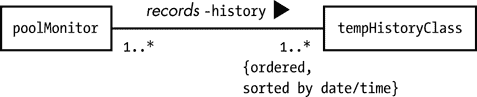

*图 6-34：一个自定义约束*

##### 6.5.5.8 限定符

限定符告知实现者，指定的关联需要快速访问，通常是通过键或索引值。例如，假设 图 6-34 中的温度记录机制每分钟记录一次游泳池温度。在一周的时间里，历史对象将积累 10,080 次读取；一年内，它将积累超过 360 万次读取。为了提取过去一年中每天（比如中午）的读取，你必须扫描近 400 万次读取，才能得出 365 或 366 次读取。这可能需要大量的计算资源，并且可能会带来性能问题，特别是对于实时系统（如游泳池监测系统）。我们可以为每次读取分配一个唯一的索引值，这样就只提取我们需要的读取。

要创建 UML 限定符，你需要将一些限定信息（通常是限定类或对象中的属性名称）放置在关联链接的一端的矩形框内，如 图 6-35 所示。

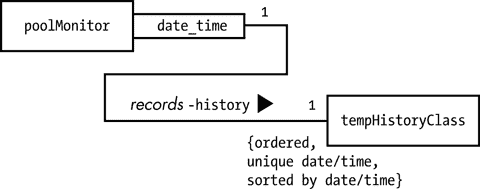

*图 6-35：一个限定符示例*

唯一的限定符要求所有 `tempHistoryClass` 对象具有唯一的日期和时间；也就是说，不能有两个读取记录具有相同的日期和时间值。

图 6-35 表明系统将维护一个特殊机制，让我们可以基于 `date_time` 值直接选择一个 `tempHistoryClass` 对象。这类似于数据库表中的键。^(7)

在此示例中，乘法值均为 `1`，因为日期和时间都是唯一的，`date_time` 限定符将选择一个特定的日期，因此只能有一个关联记录。（从技术上讲，可能没有匹配项；然而，图示中并未考虑这种情况，因此必须有匹配对象。）

如果`date_time`键在历史对象中不是唯一的，那么多重性可能是除`1`以外的其他值。例如，如果你想生成一份记录了正午所有温度的报告，你可以按如下方式指定，如图 6-36 所示。


*图 6-36：一个限定符集示例*

假设你有一年份的`tempHistoryClass`对象读数，你将得到 365/366 条不同日期但相同时间（在此示例中为正午）的读数。

需要记住的一点是，你可以有多个关联图来描述同一关联的不同变体。例如，在同一套 UML 文档中看到图 6-34、6-35 和 6-36 是合理的。图 6-34 描述了`poolMonitor`类或对象与`tempHistoryClass`对象之间的通用关联。图 6-35 可能描述了一个搜索操作，在这个操作中，你正在查找特定的温度；这个操作可能非常常见，以至于你想生成某种关联数组（即哈希表）来提高其性能。同样，图 6-36 建议你希望拥有另一个快速查找表，以加速收集正午时录得的一组读数。每个图表都有其自己的上下文，它们并不相互冲突。

##### 6.5.5.9 可导航性

在第 109 页的“属性名称”中，我介绍了将属性名称添加到关联链接中的概念。建议将名称放置在包含该属性的类或对象附近（即，在关联链接的另一端引用其他类或对象）。尽管这种隐式指定通信方向和属性所有权的方式对于大多数简单图表非常有效，但随着 UML 图表变得更加复杂，这种方式可能会变得令人困惑。UML 可导航性功能解决了这个问题。

可导航性指定图表中信息流的方向（即数据如何在系统中流动）。默认情况下，关联链接是双向可导航的。这意味着链接一端的类/对象可以访问另一端的数据字段或方法。然而，也可以指定信息只在关联链接的一个方向上流动。

为了指示可导航性，可以在关联链接的末端放置箭头，以指定通信流的方向（你不需要在关联链接的两端都放置箭头来指定双向通信）。例如，在图 6-37 中，通信流从`poolMonitor`类或对象流向`pHClass`类或对象。这个方向告诉你两件事：`pHSensor`属性是`poolMonitor`类或对象的成员，且`pHClass`没有属性可以引用`poolMonitor`内部的任何内容。

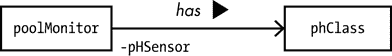

*图 6-37：可导航性*

UML 2.*x*新增了一个符号，用来明确表示某个方向上不发生通信：你可以在禁止通信的一侧的关联链接上放置一个小×（参见图 6-38）。

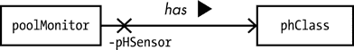

*图 6-38：显式非可导航性*

我认为这会使图表显得杂乱，阅读起来更困难，所以我坚持使用默认规范。你可以自行决定使用哪种选项。

##### 6.5.5.10 可变性

UML 的可变性特性允许你指定某个数据集在创建后是否可以修改。在图 6-34 中的历史记录示例中，一旦温度值被记录在历史数据库中，你不希望系统或用户编辑或删除该值。你可以通过在关联链接上添加`{frozen}`约束来实现，如图 6-39 所示。

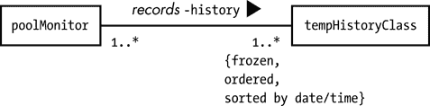

*图 6-39：一个{frozen}示例*

现在你已经更好地理解了前四种关系类型的特点，让我们转向最后一种类型：继承。

#### *6.5.6 类继承关系*

继承关系（在 UML 中也称为*泛化关系*）是最强的或最紧密耦合的类关系形式。你对基类字段所做的任何更改都会对子类（继承类）或对象产生直接且显著的影响。^(8) 继承是一种与依赖、关联、聚合或组合不同的关系。这些其他关系描述了一个类或对象如何使用另一个类或对象；而继承描述了一个类如何*包含*另一个类的所有内容。

对于继承关系，我们使用一条线，其中一端带有空心箭头。箭头指向基类（通用项），而线的另一端连接到继承类（派生类），如图 6-40 所示。

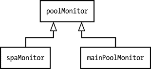

*图 6-40：继承*

在这个例子中，`spaMonitor`和`mainPoolMonitor`是*派生类*，继承了基类（祖先类）`poolMonitor`的所有字段（这些派生类很可能还会添加新的属性和操作）。

继承关系不同于依赖、关联、聚合或组合，因为像多重性、角色和可导航性这样的特征不适用。

### 6.6 对象

到目前为止，你在所有的图示中看到了两种类型的参与者：*角色* 和 *类*。具体来说，大多数项目是类。然而，从面向对象编程的角度来看，类只是数据类型，并不是软件可以操作的实际数据项。对象是类的实例——在应用程序中维护状态的实际数据对象。在 UML 中，你使用矩形表示一个对象，就像表示类一样。不同之处在于，你需要指定一个对象名称以及它关联的类名称，并在对象图中将这对名称下划线，如图 6-41 所示。

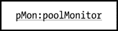

*图 6-41：一个对象*

### 6.7 更多信息

Bremer, Michael. *The User Manual Manual: How to Research, Write, Test, Edit, and Produce a Software Manual*. Grass Valley, CA: UnTechnical Press, 1999。可在 *[`www.untechnicalpress.com/Downloads/UMM%20sample%20doc.pdf`](http://www.untechnicalpress.com/Downloads/UMM%20sample%20doc.pdf)* 获取样本章节。

Larman, Craig. *Applying UML and Patterns: An Introduction to Object-Oriented Analysis and Design and Iterative Development*. 第 3 版. Upper Saddle River, NJ: Prentice Hall, 2004.

Miles, Russ, 和 Kim Hamilton. *Learning UML 2.0: A Pragmatic Introduction to UML*. Sebastopol, CA: O’Reilly Media, 2003.

Pender, Tom. *UML Bible*. Indianapolis: Wiley, 2003.

Pilone, Dan, 和 Neil Pitman. *UML 2.0 in a Nutshell: A Desktop Quick Reference*. 第 2 版. Sebastopol, CA: O’Reilly Media, 2005.

Roff, Jason T. *UML: A Beginner’s Guide*. Berkeley, CA: McGraw-Hill Education, 2003.

Tutorials Point. “UML 教程。” *[`www.tutorialspoint.com/uml/`](https://www.tutorialspoint.com/uml/)*.
