## 第九章：UML 交互图**


交互图模拟系统中不同对象（参与者）之间发生的操作。UML 中有三种主要类型的交互图：时序图、协作图（通信图）和时序图。本文大部分内容将聚焦于时序图，接下来简要讨论协作图。

### 7.1 时序图

时序图显示参与者（演员、对象）之间的交互，按照发生的顺序。与活动图描述单一操作的细节不同，时序图将多个操作的顺序关联起来。从设计的角度来看，时序图比活动图更具信息性，因为它们展示了系统的整体架构；然而，在活动图（较低级别）中，系统架构师通常可以放心地假设实现系统的软件工程师能够理解设计所需的活动。

#### *7.1.1 生命周期*

在时序图的顶部，你需要绘制参与者集，使用矩形或简笔画（参见图 7-1），然后从每个参与者绘制一条虚线到底部，表示该对象的生命周期。*生命周期*显示从执行的最早（最上面）到最新（最下面）时间点的流动。然而，仅凭生命周期并不能指示经过的*时间量*，它仅表示时间的流逝从图表的顶部到底部，等长的线段不必对应相同的时间量——某个地方的 1 厘米段可能是几天，而另一个地方的 1 厘米段可能是微秒。


*图 7-1: 基本时序图*

#### *7.1.2 消息类型*

参与者之间的通信以*消息*（有时我称之为*操作*）的形式存在，它们由绘制在生命周期之间的箭头组成，甚至可能从一个生命周期指向其自身。

有四种类型的消息箭头可以使用，如图 7-2 所示。

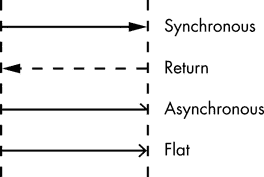

*图 7-2: 时序图中的消息类型*

*同步*消息是大多数程序使用的典型调用/返回操作（用于执行对象方法、函数和过程）。发送者会暂停执行，直到接收者返回控制。

*返回*消息表示控制从同步消息返回到消息发送方，但在顺序图中返回消息是完全可选的。在同步消息完成之前，对象无法继续执行，因此在同一时间线上出现的其他消息（无论是接收还是发送）本身就暗示了一个返回操作。由于大量返回箭头可能会混淆顺序图，因此如果图表开始变得混乱，最好省略它们。然而，如果顺序图相对简洁，返回箭头有助于准确显示发生的事情。

*异步*消息会触发接收方代码的调用，但消息发送方在继续执行之前不需要等待返回消息。因此，在顺序图中，异步调用不需要画出明确的返回箭头。

*平面*消息可以是同步的，也可以是异步的。当类型对设计无关紧要，并且你希望将选择留给实现代码的工程师时，可以使用平面消息。作为一般规则，平面消息不绘制返回箭头，因为那样会暗示实现者必须使用同步调用。

**注意**

*平面消息仅为 UML 1.*x *实体。在 UML 2.0 中，异步消息使用完整的开放箭头。*

#### *7.1.3 消息标签*

绘制消息时，必须为消息的箭头附加标签。这个标签可以只是消息的描述，如图 7-3 所示。

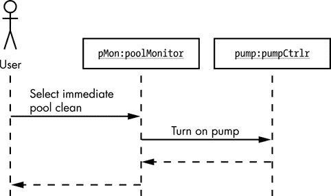

*图 7-3：消息标签*

消息的顺序通过其垂直位置来表示。在图 7-3 中，“选择即时池清理”标签是图中的第一条消息线，意味着它是第一个执行的操作。向下移动，“开启泵”是第二条消息线，所以它接着执行。“开启泵”的返回是第三个操作，“选择即时池清理”的返回是第四个操作。

#### *7.1.4 消息编号*

随着顺序图变得更复杂，仅凭消息位置可能很难确定执行顺序，因此在每个消息标签上附加额外的指示符（如编号）可能会有所帮助。图 7-4 使用了顺序整数，尽管 UML 并不要求如此。你也可以使用像 3.2.4 这样的编号，甚至是非数字指示符（例如 A、B、C）。然而，目标是使得消息顺序易于确定，所以如果在此处过于复杂，可能会适得其反。

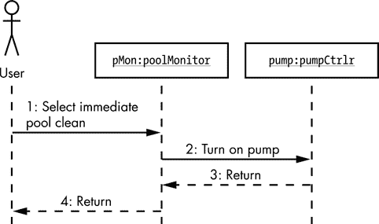

*图 7-4：消息编号*

虽然到目前为止你看到的消息标签是相对简单的描述，但也不罕见将实际操作名称、参数和返回值用作消息箭头的标签，如图 7-5 所示。

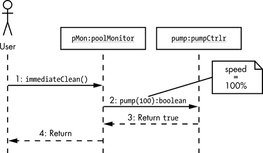

*图 7-5：消息参数和返回值*

#### *7.1.5 保护条件*

你的消息标签也可以包含保护条件：用括号括起来的布尔表达式（参见图 7-6）。如果保护条件的结果为`true`，系统就会发送消息；如果结果为`false`，系统则不会发送消息。


*图 7-6：消息保护条件*

在图 7-6 中，只有当`pumpPower`为`on`（`true`）时，`pMon`对象才会向`pump`发送`pump(100)`消息。如果`pumpPower`为`off`（`false`）并且`pump(100)`消息没有执行，那么相应的返回操作（序列项 3）也不会执行，控制将转移到`pMon`生命线中的下一个外发箭头项（序列项 4，返回控制到用户对象）。

#### *7.1.6 迭代*

你还可以通过在序列图中提供迭代次数来指定消息执行的次数。要指定迭代，可以使用星号符号（`*`），后跟保护条件或`for`循环迭代次数（参见图 7-7）。只要保护条件为`true`，系统就会重复发送消息。

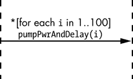

*图 7-7：带有迭代的部分序列图*

在图 7-7 中，消息执行 100 次，变量`i`的值从`1`变到`100`，并在每次迭代时递增。如果`pumpPwrAndDelay`函数应用了作为参数指定的百分比功率，并且延迟 1 秒，那么大约 1 分 40 秒后，水泵将以全速运行（每秒增加总速度的 1%）。

#### *7.1.7 长时间延迟和时间约束*

序列图通常只描述消息的顺序，而不描述每条消息执行所需的时间。然而，有时设计者可能希望指出某个特定操作相对于其他操作可能需要更长时间。这在一个对象向另一个位于当前系统之外的对象发送消息时尤为常见（例如，当一个软件组件向远程服务器上的某个对象发送消息时），我们稍后会讨论。通过将消息箭头稍微指向下方来表示一个操作需要更长时间。例如，在图 7-8 中，你会预期`scheduledClean()`操作的执行时间会比典型操作更长。

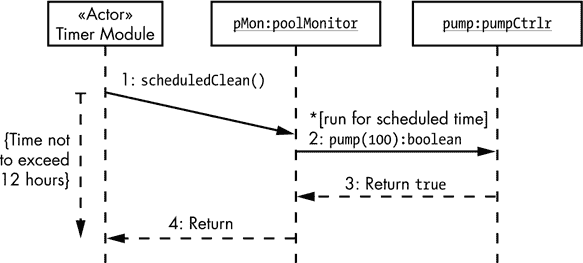

*图 7-8：带有时间约束的定时消息*

你还必须通过在图表中添加某种约束来指定每个消息的预期时间量。图 7-8 通过一条从`scheduledClean()`操作开始到系统将控制权交还给计时器模块演员（很可能是泳池监控系统上的物理计时器）的位置的虚线垂直箭头来演示这一点。所需的时间约束显示在虚线箭头旁边的花括号内。

#### *7.1.8 外部对象*

有时，序列图中的某个组件必须与系统外部的某个对象进行通信。例如，泳池监控中的一些代码可能会检查盐度水平，如果过低，则向所有者的手机发送短信。实际发送短信的代码可能由物联网（IoT）设备处理，因此超出了泳池监控软件的范围；因此，短信代码是一个外部对象。

你需要为外部对象绘制一个粗边框，并使用实线表示它们的生命线，而不是使用虚线（参见图 7-9）。

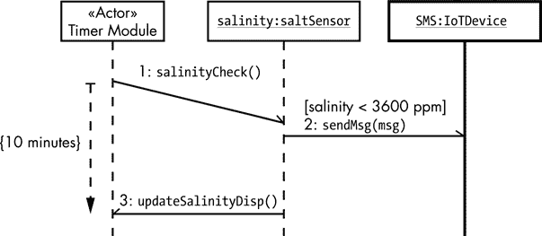

*图 7-9：序列图中的外部对象*

在图 7-9 中，计时器模块对`salinity`对象进行异步调用，并且`salinityCheck()`操作没有返回值。之后，计时器模块可以执行其他任务（在这个简单的示意图中未显示）。十分钟后，如时间约束所示，`salinity`对象对计时器模块进行异步调用，并要求其更新显示上的盐度值。

由于`sendMsg()`操作没有明确的时间约束，因此它可能在`salinityCheck()`操作之后、`updateSalinityDisp()`操作之前的任何时刻发生；这可以通过`sendMsg()`消息箭头在另外两个消息之间的位置来表示。

#### *7.1.9 激活条*

激活条表示一个对象已实例化并处于活动状态，它们呈现为横跨生命线的开放矩形（参见图 7-10）。它们是可选的，因为通常你可以仅通过观察发送到和接收到对象的消息来推测对象的生命周期。

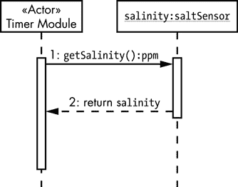

*图 7-10：激活条*

**注意**

*大多数情况下，激活条会让序列图显得杂乱，因此本书不会使用它们。它们在这里的描述仅仅是为了防止你在其他来源的序列图中遇到它们。*

#### *7.1.10 分支*

如“守卫条件”部分所述，见第 131 页，你可以将守卫条件应用于一条消息，这相当于说，“如果`true`，则执行消息；否则，继续沿这个生命周期。”另一个有用的工具是分支——等同于 C 风格的 `switch`/`case` 语句，你可以根据一组守卫条件选择执行的消息，每条消息都有一个守卫条件。为了根据泳池使用氯或溴作为消毒剂来执行不同的消息，你可能会倾向于按图 7-11 所示的方式绘制分支逻辑。

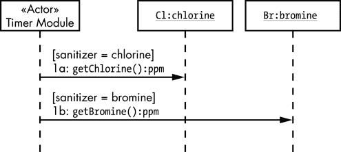

*图 7-11：不良的分支逻辑实现*

从一个角度来看，这个图表是完全合理的。如果这个特定泳池的消毒剂是溴而不是氯，则第一个消息不会执行，控制流程会转到第二个消息，第二个消息会执行。这个图表的问题在于两个消息出现在生命周期的不同点，因此它们可能会在完全不同的时间执行。尤其是当你的序列图变得更复杂时，可能会有其他消息调用插入到这两者之间，从而在`getBromine()`消息之前执行。相反，如果消毒剂不是`氯`，你应该立即检查是否是`溴`，并且不允许有任何干扰消息。图 7-12 展示了正确绘制这种逻辑的方法。

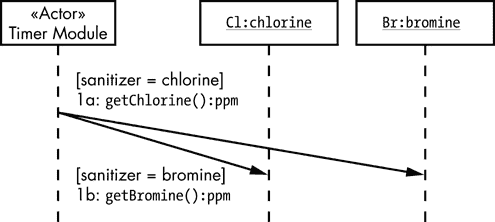

*图 7-12：良好的分支逻辑实现*

使用从相同垂直位置开始的箭头尾部和在相同垂直位置结束的箭头头部来绘制分支逻辑，可以避免执行顺序的任何歧义（前提是守卫条件是互斥的——也就是说，不可能同时使两个条件为`true`）。

分支使用斜向的消息箭头，类似于长时间延迟，但是长延迟项会有相关的时间约束。^(1)

#### *7.1.11 替代流程*

分支还有另一个潜在问题：当你需要向同一个目标对象发送两种不同消息中的一种时该怎么办？由于箭头的尾部和头部必须分别在相同的垂直位置开始和结束，这两条箭头会相互重叠，并且无法表明分支的发生。解决这个问题的方法是使用*替代流程*。

在替代流程中，一个单独的生命周期会在某个点分裂成两个独立的生命周期（见图 7-13）。

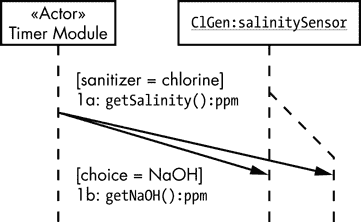

*图 7-13：替代流程*

在这个示例中，定时器模块必须在获取当前盐度（NaCl）或氢氧化钠（NaOH）之间做出选择。`getSalinity()`和`getNaOH()`操作是同一类中的方法，因此它们的消息箭头都会指向`ClGen`生命线的同一个位置。为了避免消息箭头重叠，图 7-13 将`ClGen`生命线分成了两个生命线：原始生命线和一个备用流程。

在消息调用之后，如果需要，您可以将两个流程重新合并在一起。

#### *7.1.12 对象创建与销毁*

到目前为止的示例中，所有对象都在序列图的生命周期内存在；也就是说，所有对象在执行第一条消息（操作）之前就已存在，并且在执行最后一条消息之后仍然存在。在实际设计中，您需要创建和销毁一些在程序执行的整个过程中并不一直存在的对象。

对象的创建与销毁和其他消息一样。UML 中的常用约定是使用特殊消息«create»和«destroy»（参见图 7-14）来显示序列图中的对象生命周期；然而，您也可以使用任何您喜欢的消息名称。在`cleanProcess`生命线末尾，紧接着«destroy»操作的 X，表示该生命线的结束，因为对象不再存在。

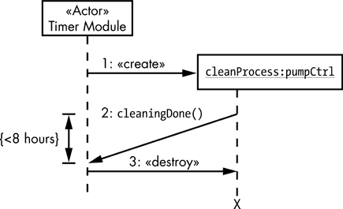

*图 7-14：对象创建与销毁*

该示例使用了一个*掉落标题框*来表示新创建对象的生命周期开始。如 Russ Miles 和 Kim Hamilton 在《学习 UML 2.0》（O'Reilly, 2003）中指出，许多标准化的 UML 工具不支持使用掉落标题框，导致您只能将对象标题框放置在图表的顶部。对于这个问题，存在一些解决方案，应该适用于大多数标准 UML 工具。

您可以将对象放置在图表的顶部，并添加注释，明确指出对象创建和销毁发生的点（参见图 7-15）。

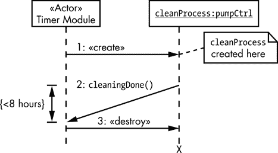

*图 7-15：使用注释表示对象生命周期*

您还可以使用替代流程来表示对象的生命周期（参见图 7-16）。

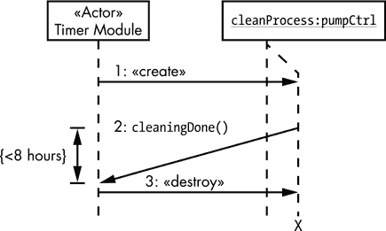

*图 7-16：使用替代流程表示对象生命周期*

激活条提供了一个第三种选择，这里可能会更加清晰。

#### *7.1.13 序列片段*

UML 2.0 增加了*序列片段*来表示循环、分支和其他替代流程，使您能够更好地管理序列图。UML 定义了几种标准序列片段类型，您可以使用，这些类型简要定义在表 7-1 中（完整描述稍后会在本节中出现）。

**表 7-1：** 序列片段类型的简要描述

| `alt` | 仅执行`true`的替代片段（可以类比于`if`/`else`或`switch`语句）。 |
| --- | --- |
| `assert` | 表示如果守卫条件为 `true`，片段中的操作是有效的。 |
| `break` | 退出循环片段（基于某些守卫条件）。 |
| `consider` | 提供序列片段中有效消息的列表。 |
| `ignore` | 提供序列片段中无效消息的列表。 |
| `loop` | 执行多次，守卫条件决定片段是否重复。 |
| `neg` | 永不执行。 |
| `opt` | 仅在关联条件为 `true` 时执行。与 `alt` 类似，但只有一个替代片段。 |
| `par` | 并行执行多个片段。 |
| `ref` | 表示调用另一个序列图。 |
| `region` | （也称为 `critical`）定义一个临界区，在该区域中只能有一个执行线程。 |
| `seq` | 表示在多任务环境中操作必须按特定顺序执行。 |
| `strict` | `seq` 的严格版本。 |

通常，你会画出一个包围消息的矩形序列片段，矩形的左上角有一个特殊的五边形符号（一个右下角被裁剪的矩形），其中包含 UML 片段的名称/类型（参见 图 7-17；在此图中，用实际的片段类型替代 typ）。

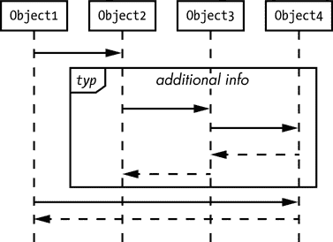

*图 7-17：通用序列片段形式*

例如，如果你想多次重复一系列消息，可以将这些消息放入一个 `loop` 序列片段中。这告诉实现程序的工程师根据 `loop` 片段指定的次数重复这些消息。

你还可以包括一个可选的 *附加信息* 项，通常是守卫条件或迭代次数。以下小节将详细描述 表 7-1 中的序列片段类型以及它们可能需要的任何附加信息。

##### 7.1.13.1 ref

`ref` 序列片段有两个组成部分：UML 交互发生和引用本身。一个 *交互发生* 是与代码中的子例程（过程或函数）对应的独立序列图。它被一个序列片段框包围。框的左上角的五边形矩形包含 `sd`（表示 *序列图*），后面是 `ref` 片段的名称以及你希望分配给它的任何参数（参见 图 7-18）。

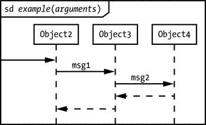

*图 7-18：交互发生示例*

最左侧的输入箭头对应于 *子例程入口点*。如果没有这个，你可以假设控制流将进入其生命线顶部的最左侧参与者。

接下来我们讲解 `ref` 序列片段的第二个组成部分：在不同的序列图中引用交互发生（参见 图 7-19）。

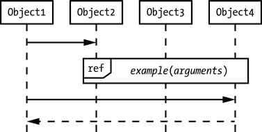

*图 7-19：`ref` 序列片段示例*

这对应于代码中的子程序调用（过程或函数）。

##### 7.1.13.2 consider 和 ignore

`consider`序列片段列出了在序列图的某一部分中有效的所有消息；所有其他消息/操作符都是非法的。`ignore`操作符列出了在序列图的某一部分中无效的消息名称；所有其他操作符/消息是合法的。

`consider`和`ignore`可以作为操作符与现有的序列片段一起使用，或者作为独立的序列片段使用。`consider`或`ignore`操作符的格式如下：

```
consider{ comma-separated-list-of-operators }

ignore{ comma-separated-list-of-operators }
```

`consider`和`ignore`操作符可以出现在交互发生时`sd` *名称* 标题之后（参见图 7-20），在这种情况下，它们适用于整个图表。

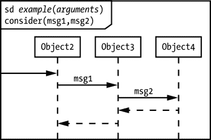

*图 7-20：一个 consider 操作符示例*

你也可以在另一个序列图中创建一个序列片段，并用`consider`或`ignore`操作对该片段进行标注。在这种情况下，`consider`或`ignore`仅适用于该特定序列片段中的消息（参见图 7-21）。

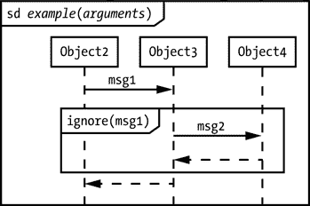

*图 7-21：一个忽略序列片段示例*

如果这些片段类型看起来很奇怪，可以考虑创建一个非常通用的`ref`片段，仅处理某些消息，然后从多个不同的地方引用该`ref`，这些地方可能会传递未处理的消息以及已处理的消息。通过向`ref`添加`consider`或`ignore`操作符，你可以让该片段简单地忽略它未明确处理的消息，这样你就可以在不必为系统添加任何额外设计的情况下使用该`ref`。

##### 7.1.13.3 assert

`assert`序列片段告诉系统实现者，只有在某个保护条件计算结果为`true`时，里面的消息才是有效的。在`assert`片段的末尾，通常会提供某种布尔条件（即保护条件），这个条件在序列完成后必须为`true`（参见图 7-22）。如果`assert`片段执行完毕后该条件不是`true`，则设计无法保证结果正确。`assert`提醒工程师通过例如使用 C++的`assert`宏调用（或者其他语言中的类似方法，甚至是`if`语句）来验证该条件确实为`true`。

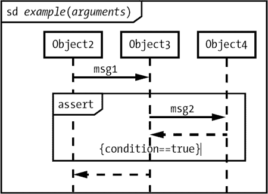

*图 7-22：一个 assert 序列片段示例*

在 C/C++中，你可能会使用如下代码来实现图 7-22 中的序列：

```
Object3->msg1();                  // Inside example

Object4->msg2();                  // Inside Object3::msg1

assert( condition == TRUE );      // Inside Object3::msg1
```

##### 7.1.13.4 循环

`loop`序列片段表示迭代。你将在与序列片段相关的五边形矩形中放置`loop`操作符，并且还可以在序列片段的顶部包含一个括起来的保护条件。`loop`操作符和保护条件的组合控制迭代次数。

这种序列片段的最简单形式是*无限*循环，由没有任何参数且没有保护条件的`loop`运算符组成（见图 7-23）。大多数“无限”循环实际上并非真无限，而是在某个条件为真时通过`break`序列片段终止（我们将在下一节讨论`break`序列）。

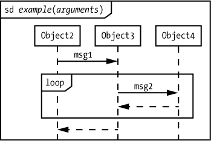

*图 7-23：一个无限循环*

图 7-23 中的循环大致等同于以下的 C/C++代码：

```
// This loop appears inside Object3::msg1

for(;;)

{

      Object4->msg2();

} // endfor
```

或者，替代的方式是：

```
while(1)

{

      Object4->msg2()

} // end while
```

**注意**

*个人来说，我更喜欢以下这种方式：*

#define ever ;;

.

.

.

for(ever)

{

Object4->msg2();

} // endfor

*我觉得这是最易读的解决方案。当然，如果你是“无论如何都反对宏”的人，你可能会不同意我选择使用无限循环！*

*确定*循环执行固定次数，可以有两种形式。第一种是`loop(`*integer*`)`，它是`loop(0,` *integer*`)`的简写；也就是说，它将至少执行零次，最多执行*integer*次。第二种是`loop(`*minInt*`,` *maxInt*`)`，表示循环将至少执行*minInt*次，最多执行*maxInt*次。如果没有保护条件，最小次数无关紧要；循环将始终执行*maxInt*次。因此，大多数确定循环使用`loop(`*integer*`)`的形式，其中*integer*是要执行的迭代次数（参见图 7-24）。

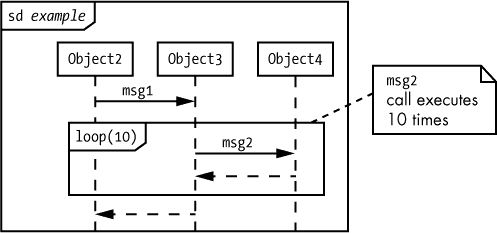

*图 7-24：一个确定循环*

图 7-24 中的循环大致等同于以下的 C/C++代码：

```
// This code appears inside Object3::msg1

for( i = 1; i<=10; ++i )

{

      Object4->msg2();

} // end for
```

你也可以使用乘法符号`*`来表示无限。因此，`loop(*)`等同于`loop(0, *)`，也等同于`loop`（换句话说，你得到的是一个无限循环）。

*不确定*循环会执行不确定次数（对应于编程语言中的`while`、`do/while`、`repeat/until`等循环形式）。不确定循环包括一个保护条件作为`loop`序列片段的一部分，^(2)这意味着`loop`序列片段会始终执行*minInt*次循环（如果*minInt*不存在，则执行零次）。在执行了*minInt*次之后，循环序列片段将开始测试保护条件，只有当保护条件为`true`时，才会继续执行循环。循环序列片段最多会执行*maxInt*次（总共，不包括*minInt*次）。图 7-25 展示了一个传统的`while`类型循环，最低执行零次，最高执行无限次，只要保护条件（`[cond == true]`）的值为`true`。

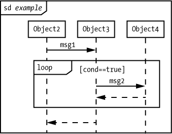

*图 7-25：一个不确定的 while 循环*

图 7-25 中的循环大致等同于以下的 C/C++代码：

```
// This code appears inside Object3::msg1

while( cond == TRUE )

{

      Object4->msg2();

} // end while
```

你可以通过将*minInt*值设置为`1`，将*maxInt*值设置为`*`，然后指定布尔表达式来继续循环执行（参见图 7-26）。

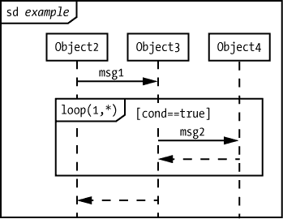

*图 7-26：一个不确定的 do..while 循环*

图 7-26 中的循环大致等同于以下 C/C++代码：

```
// This code appears inside Object3::msg1

do

{

      Object4->msg2();

} while( cond == TRUE );
```

当然，你可以创建许多其他复杂的循环类型，但我会把这个留给感兴趣的读者作为练习。

##### 7.1.13.5 break

`break`序列片段由一个带有保护条件的五边形矩形框中的单词`break`组成。如果保护条件评估为`true`，则系统执行`break`序列片段中的序列，然后控制立即退出封闭的序列片段。如果封闭的序列片段是`loop`，控制会立即执行到`loop`之后的第一条消息（就像 Swift、C/C++和 Java 等语言中的`break`语句）。图 7-27 提供了这样一个循环的示例。

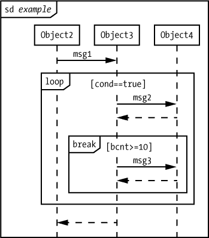

*图 7-27：一个 break 序列片段的示例*

图 7-27 中的循环大致等同于以下 C++代码片段：

```
// This code appears inside Object3::msg1

while( cond == TRUE )

{

     Object4->msg2();

     if( bcnt >= 10 )

     {

          Object4->msg3();

          break;

     } // end if

     Object4->msg4();

} // end while loop
```

如果最近的`break`兼容的外层序列是子例程，而不是循环，则`break`序列片段的行为类似于从子例程操作中返回。

##### 7.1.13.6 opt 和 alt

`opt`和`alt`序列片段允许你通过一个单一的保护条件来控制一组消息的执行——特别是当组成保护条件的组件的值可能在序列执行过程中发生变化时。

`opt`序列片段就像一个简单的`if`语句，没有`else`子句。你附加一个保护条件，系统只有在保护条件评估为`true`时，才会执行`opt`片段中包含的序列（参见图 7-28）。


*图 7-28：`opt`序列片段的示例*

图 7-28 中的示例大致等同于以下 C/C++代码：

```
// Assumption: Class2 is Object2's data type. Because control

// transfers into the Object2 sequence at the top of its 

// lifeline, example must be a member function of Object2/Class2

void Class2::example( void )

{

      Object3->msg1();

} // end example

--snip--

//    This code appears in Object3::msg1 

if( cond == TRUE )

{

      Object4->msg2();

} // end if
```

对于更复杂的逻辑，使用`alt`序列片段，它类似于`if`/`else`或`switch`/`case`。要创建`alt`序列片段，你可以将多个矩形组合在一起，每个矩形都有自己的保护条件和一个可选的`else`，从而形成多路决策（参见图 7-29）。

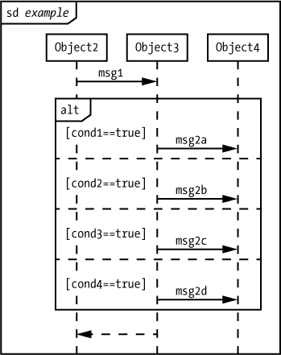

*图 7-29：一个 alt 序列片段*

图 7-29 中的交互发生大致等同于以下代码：

```
// Assumption: Class2 is Object2's data type. Because control

// transfers into the Object2 sequence at the top of its

// lifeline, example must be a member function of Object2/Class2

void Class2::example( void )

{

      Object3->msg1();

} // end example

--snip--

//    This code appears in Object3::msg1 

if( cond1 == TRUE )

{

      Object4->msg2a();

}

else if( cond2 == TRUE )

{

      Object4->msg2b();

}

else if( cond3 == TRUE )

{

      Object3->msg2c();

}

else

{

      Object4->msg2d();

} // end if
```

##### 7.1.13.7 neg

你使用`neg`序列片段来封装一段不包含在最终设计中的序列。实际上，使用`neg`就是注释掉封闭的序列。如果一段序列最终不包含在设计中，为什么还要包括它呢？至少有两个很好的理由：代码生成和未来功能。

尽管大多数情况下，UML 是一种图示语言，旨在帮助在像 Java 或 Swift 这样的编程语言实现之前进行系统设计，但也有一些 UML 工具可以直接将 UML 图转换为代码。在开发过程中，你可能想要包含一些图示来说明某些内容，但这些图示尚未完成（当然还没到生成可执行代码的程度）。在这种情况下，你可以使用`neg`序列片段来关闭那些尚未准备好投入使用的序列的代码生成。

即使你不打算直接从 UML 图生成代码，你可能也想为未来的功能使用`neg`。当你将 UML 图交给工程师实现设计时，它们代表着一个合同，表明：“这就是代码应该如何编写。”然而，有时候，你希望图示中显示的是你计划在未来版本中加入的功能，而不是在当前（或第一）版本中。`neg`序列片段是告诉工程师忽略该部分设计的一种清晰方式。图 7-30 展示了`neg`序列片段的一个简单示例。

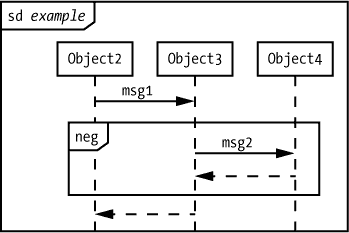

*图 7-30：neg 序列片段的示例*

图 7-30 中的示例大致等同于以下 C/C++代码：

```
// Assumption: Class2 is Object2's data type. Because control

// transfers into the Object2 sequence at the top of its

// lifeline, example must be a member function of Object2/Class2

void Class2::example( void )

{

      Object3->msg1();

} // end example
```

##### 7.1.13.8 par

`par`序列片段，示例见图 7-31，指出被包含的序列^(4)（操作）可以并行执行。

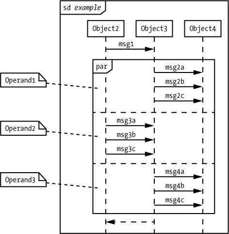

*图 7-31：par 序列片段的示例*

图 7-31 展示了三个操作数：包含{`msg2a`，`msg2b`，`msg2c`}的序列，包含{`msg3a`，`msg3b`，`msg3c`}的序列，以及包含{`msg4a`，`msg4b`，`msg4c`}的序列。`par`序列片段要求给定序列中的操作必须按出现的顺序执行（例如，`msg2a`，然后是`msg2b`，然后是`msg2c`）。然而，系统可以自由交错不同操作数中的操作，只要它保持这些操作数的内部顺序。所以，在图 7-31 中，顺序{`msg2a`，`msg3a`，`msg3b`，`msg4a`，`msg2b`，`msg2c`，`msg4b`，`msg4c`，`msg3c`}是合法的，{`msg4a`，`msg4b`，`msg4c`，`msg3a`，`msg3b`，`msg3c`，`msg2a`，`msg2b`，`msg2c`}也是合法的，因为包含的序列的顺序匹配。然而，{`msg2a`，`msg2c`，`msg4a`，`msg4b`，`msg4c`，`msg3a`，`msg3b`，`msg3c`，`msg2b`}是不合法的，因为`msg2c`出现在`msg2b`之前（这与图 7-31 中指定的顺序相反）。

##### 7.1.13.9 seq

`par`序列片段强制执行以下限制：

+   系统保持操作数内操作的顺序。

+   系统允许来自不同操作数的不同生命线上的操作按任何顺序执行。

而`seq`序列片段又添加了另一层：

+   不同操作数中相同生命线上的操作必须按它们在图中出现的顺序执行（从上到下）。

例如，在图 7-32 中，`Operand1`和`Operand3`有发送到同一对象（生命线）的消息。因此，在`seq`序列片段中，`msg2a`、`msg2b`和`msg2c`必须在`msg4a`之前执行。

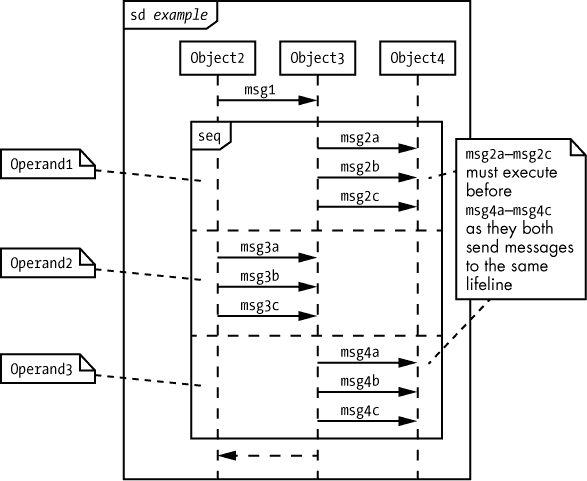

*图 7-32：一个`seq`序列片段的示例*

图 7-32 展示了一个独立的`seq`序列片段。然而，在典型使用中，`seq`序列片段会出现在`par`内，以控制`par`的部分操作数的执行顺序。

##### 7.1.13.10 strict

`strict`序列片段强制操作按它们在每个操作数中出现的顺序进行；不允许操作数之间的操作交叉执行。`strict`序列片段的格式类似于`par`和`seq`（参见图 7-33）。

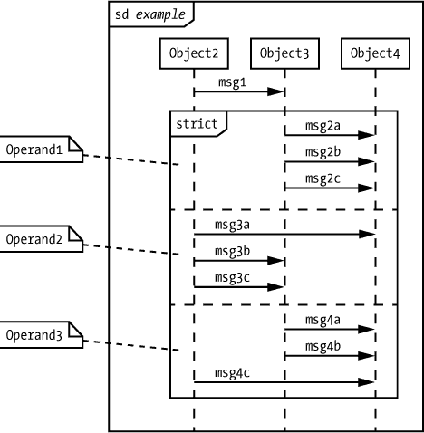

*图 7-33：一个`strict`序列片段的示例*

`strict`并行操作允许操作数按任何顺序执行，但一旦某个操作数开始执行，所有操作必须按指定的顺序完成，才能开始执行其他操作数。

在图 7-33 中，有六种不同的操作序列可能性：{`Operand1`，`Operand2`，`Operand3`}；{`Operand1`，`Operand3`，`Operand2`}；{`Operand2`，`Operand1`，`Operand3`}；{`Operand2`，`Operand3`，`Operand1`}；{`Operand3`，`Operand1`，`Operand2`}；和{`Operand3`，`Operand2`，`Operand1`}。

然而，操作数内部的操作不能交叉执行，必须从上到下执行。

##### 7.1.13.11 region

在第 99 页的“扩展 UML 活动图”部分中，我用活动图中的一个自制临界区示例来演示如何扩展 UML 以满足自己的需求。我指出了为什么这是一个不好的主意（可以重新阅读该部分获取详细信息），并提到有另一种方法可以使用标准 UML 实现你想做的事情：`region`序列片段。UML 活动图不支持临界区，但序列图支持。

`region`序列片段指定一旦执行进入该区域，同一并行执行上下文中的其他操作不能交叉执行，直到执行完成。`region`序列片段必须始终出现在其他并行序列片段中（通常是`par`或`seq`；技术上它可以出现在`strict`内部，尽管最终这没有实际意义）。

作为一个示例，考虑图 7-34—系统可以自由地交织任何操作数消息的执行，遵循`par`序列片段给出的规则，但一旦系统进入临界区域（执行`msg4a`操作），`par`序列片段中的其他线程将无法执行。

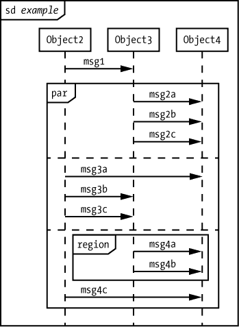

*图 7-34: 区域序列片段*

### 7.2 协作图

协作图（或通信图）提供与序列图相同的信息，但形式更紧凑一些。与其在生命线之间绘制箭头，在协作图中，我们直接在对象之间绘制消息箭头，并为每条消息附上编号以表示顺序（见图 7-35）。

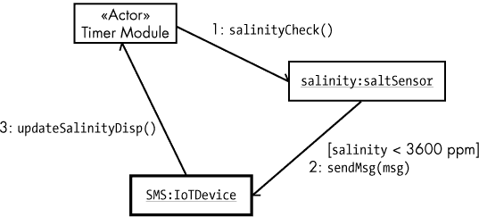

*图 7-35: 一个协作图*

图 7-35 中的图表大致等同于图 7-9 中的序列图（不考虑 10 分钟的时间限制）。在图 7-35 中，`salinityCheck`消息首先执行，`sendMsg`第二执行，`updateSalinityDisplay`最后执行。

图 7-36 显示了一个更复杂的协作图，它更好地展示了这一选项的紧凑性。这个示例中的六条消息在序列图中需要六条线，而在这里只需要三条通信链接。

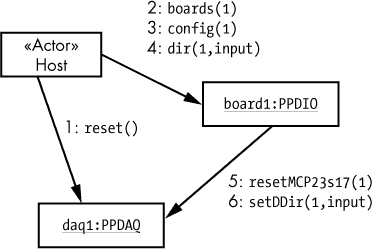

*图 7-36: 更复杂的协作图*

**注意**

*同时拥有协作图和序列图可能是 UML 创建过程中合并不同系统的产物。你使用哪一个实际上只是个人偏好的问题。然而，请记住，随着图表的复杂性增加，协作图会变得更加难以理解。*

### 7.3 更多信息

Bremer, Michael. *用户手册手册：如何研究、编写、测试、编辑和制作软件手册*. Grass Valley, CA: UnTechnical Press, 1999\. 你可以在 *[`www.untechnicalpress.com/Downloads/UMM%20sample%20doc.pdf`](http://www.untechnicalpress.com/Downloads/UMM%20sample%20doc.pdf)* 下载示例章节。

Larman, Craig. *应用 UML 与模式：面向对象分析与设计及迭代开发导论*. 第三版. Upper Saddle River, NJ: Prentice Hall, 2004.

Miles, Russ, 和 Kim Hamilton. *学习 UML 2.0：UML 的实用入门*. Sebastopol, CA: O’Reilly Media, 2003.

Pender, Tom. *UML 圣经*. 印第安纳波利斯: Wiley, 2003.

Pilone, Dan, 和 Neil Pitman. *UML 2.0 概述：桌面快速参考*. 第二版. Sebastopol, CA: O’Reilly Media, 2005.

Roff, Jason T. *UML：初学者指南*. 伯克利, CA: McGraw-Hill Education, 2003.

Tutorials Point. “UML 教程。” [*https://www.tutorialspoint.com/uml/*](https://www.tutorialspoint.com/uml/)。
