## 第十章：杂项 UML 图表**

本章通过描述五种额外的图表，完成了本书关于 UML 的讨论，这些图表对于 UML 文档非常有用：构件图、包图、部署图、复合结构图和状态图。

### 8.1 构件图

UML 使用*构件图*来封装可重用的构件，如库和框架。尽管构件通常比类更大，责任也更多，但它们支持与类相同的许多功能，包括：

+   与其他类和构件的泛化与关联

+   操作

+   接口

UML 使用矩形和«component»构件标注来定义构件（参见图 8-1）。一些用户（和 CASE 工具）也使用«subsystem»标注来表示构件。

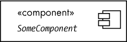

*图 8-1：UML 构件*

构件使用接口（或协议）来促进封装和松耦合。通过使设计独立于外部对象，接口提高了构件的可用性。构件与系统的其余部分通过两种预定义接口进行通信：提供接口和需求接口。*提供的*接口是构件提供的，外部代码可以使用它。*需求的*接口则是外部代码为构件提供的接口，这可能是构件调用的外部函数。

正如你现在从 UML 中所期望的那样，绘制构件的方式不止一种：可以使用*构件标注*（其中有两种版本）或*球窝标注*。

表示具有接口的 UML 构件最简洁的方式可能是图 8-2 中所示的简单构件标注形式，其中列出了构件内部的接口。

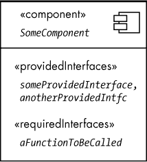

*图 8-2：构件标注的简单形式*

图 8-3 显示了更完整的（尽管较为庞大的）构件标注形式，图中有单独的`interface`对象。当你想列出接口的单独属性时，这种选项更为适用。

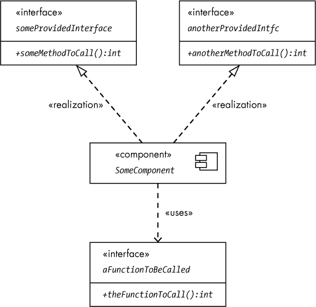

*图 8-3：更完整的构件标注形式*

球窝标注提供了一种替代构件标注的方式，使用圆形图标（*球*）表示提供的接口，使用半圆形（*插座*）表示需要的接口（参见图 8-4）。

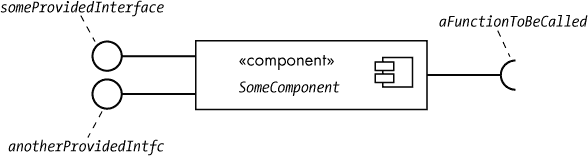

*图 8-4：球窝标注*

球窝标注的优点在于，连接的构件在视觉上可以更加美观（参见图 8-5）。

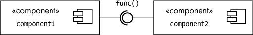

*图 8-5：连接两个球窝构件*

正如你所看到的，`component1`的所需接口与`component2`的提供接口在此图中很好地连接在一起。但尽管球窝符号比刻板符号更加紧凑和吸引人，它在超出少数接口时扩展性较差。当你添加更多的提供和所需接口时，刻板符号通常是更好的解决方案。

### 8.2 包图

UML 包是其他 UML 项（包括其他包）的容器。UML 包相当于文件系统中的子目录、C++和 C#中的命名空间，或者 Java 和 Swift 中的包。要在 UML 中定义一个包，可以使用带有包名的文件夹图标（参见图 8-6）。

*图 8-6：UML 包*

以池监控应用为一个更具体的例子，可能有一个有用的包`sensors`，其中包含与 pH 和盐度传感器相关的类/对象。图 8-7 展示了该包在 UML 中的样子。`phSensors`和`saltSensor`对象前面的*+*前缀表示这些是可以在包外访问的公共对象。^(1)

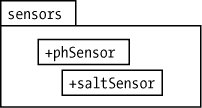

*图 8-7：传感器包*

要引用包外的（公共）对象，可以使用`packageName`::`objectName`的形式。例如，在`sensors`包之外，你可以使用`sensors::pHSensor`和`sensors::saltSensor`来访问内部对象。如果一个包嵌套在另一个包中，你可以使用像`outsidePackage::internalPackage::object`这样的顺序来访问最内层包中的对象。例如，假设你有两个核电站通道，分别名为 NP 和 NPP（来自第四章中的用例示例）。你可以创建一个名为`instruments`的包来包含这两个包`NP`和`NPP`。`NP`和`NPP`包可以包含与 NP 和 NPP 仪器直接相关的对象（参见图 8-8）。

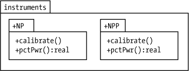

*图 8-8：嵌套包*

请注意，`NP`和`NPP`包都包含名为`calibrate()`和`pctPwr()`的函数。在这些包之外调用这些函数时不会产生歧义，因为你必须使用*限定名称*来访问这些函数。例如，在`instruments`包外，你需要使用类似`instruments::NP::calibrate`和`instruments::NPP::calibrate`这样的名称，以避免混淆。

### 8.3 部署图

部署图呈现了系统的物理视图。物理对象包括 PC、外设如打印机和扫描仪、服务器、插入式接口板和显示器。

为了表示物理对象，UML 使用*节点*，即一个 3D 盒子图像。在盒子内部放置刻板印象«device»和节点名称。图 8-9 提供了一个来自 DAQ 数据采集系统的简单示例。它显示了一台主机 PC 与 DAQ_IF 和 Plantation Productions 的 PPDIO96 96 通道数字 I/O 板连接。

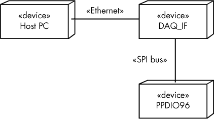

*图 8-9：一个部署图*

这个图中缺少的一个内容是系统中实际安装的软件。在这个系统中，可能至少有两个应用程序在运行：一个在主机 PC 上运行，负责与 DAQ_IF 模块通信（我们称之为*daqtest.exe*），另一个是运行在 DAQ_IF 板上的固件程序（*frmwr.hex*），它可能才是部署图所描述的真实软件系统。图 8-10 展示了一个扩展版，图中小图标标示了安装在各个机器上的软件。部署图使用刻板印象«artifact»来表示二进制机器代码。

*图 8-10：一个扩展的部署图*

请注意，PPDIO96 板是由 DAQ_IF 板直接控制的：PPDIO96 板上没有 CPU，因此也没有安装任何软件。

部署图其实有更多内容，但本书中需要的内容已经足够。如果你有兴趣，可以查看 “更多信息” 在第 165 页，其中有更详细的部署图参考资料。

### 8.4 复合结构图

在某些情况下，类图和顺序图无法准确描述一些类中组件之间的关系和动作。请参阅图 8-11，它说明了 PPDIO96 的一个类。

*图 8-11：PPDIO96 类组成*

这个类组成图告诉我们，`PPDIO96`类包含（由）两个子类：`portInitialization`和`writePort`。它没有告诉我们的是这两个`PPDIO96`的子类如何相互作用。例如，当你通过`portInitialization`类初始化端口时，可能`portInitialization`类还会调用`writePort`中的一个方法，通过该方法将端口初始化为某个默认值（例如`0`）。裸类图并没有展示这一点，也不应该展示。让`portIntialization`通过`writePort`调用写入默认值，可能只是`PPDIO96`内部可能出现的众多不同操作之一。任何试图展示`PPDIO96`内部允许和可能的通讯方式，都会产生一个非常混乱、难以理解的图。

复合结构图提供了解决方案，它只关注那些感兴趣的通信链接（可能只有一个通信链接，或者几个，但通常不会太多，以免图表变得难以理解）。

图 8-12 展示了一个初步（但有问题）的复合结构图。

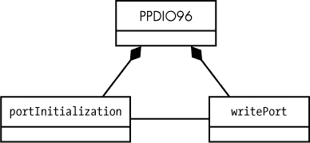

*图 8-12：尝试的复合结构图*

该图的问题在于，它没有明确指出`portInitialization`与哪个`writePort`对象进行通信。请记住，类只是通用的*类型*，而实际的通信发生在显式实例化的*对象*之间。在实际系统中，图 8-12 的意图可能更好地通过图 8-13 来传达。

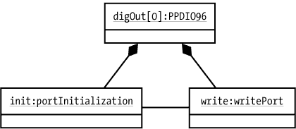

*图 8-13：实例化的复合结构图*

然而，图 8-12 和图 8-13 都没有暗示`port``Initialization`和`writePort`实例化的对象特定属于`PPDIO96`对象。例如，如果有两组`PPDIO96`、`portInitialization`和`writePort`对象，那么图 8-14 中的拓扑结构在图 8-12 中的类图基础上是完全有效的。

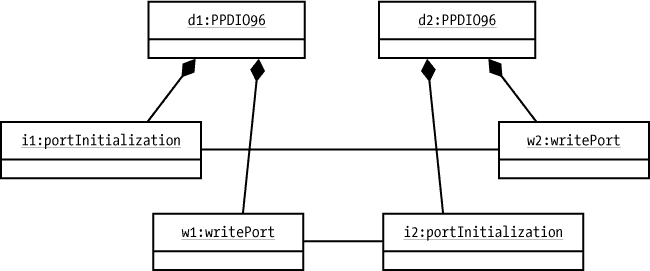

*图 8-14：奇怪但合法的通信链接*

在这个例子中，`i1`（属于对象`d1`）调用`w2`（属于对象`d2`）将数字值写入其端口；`i2`（属于`d2`）调用`w1`将其初始值写入其端口。这可能不是原始设计者的初衷，尽管图 8-12 中的通用复合结构图在技术上允许这样做。尽管任何合理的程序员都会立即意识到`i1`应该调用`w1`，而`i2`应该调用`w2`，但是复合结构图并没有明确这一点。显然，我们希望尽可能消除设计中的歧义。

为了纠正这个不足，UML 2.0 提供了（真实的）复合结构图，它将成员属性直接包含在封装类图中，如图 8-15 所示。

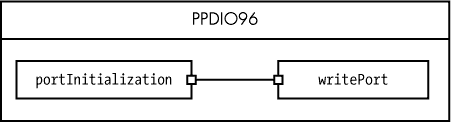

*图 8-15：复合结构图*

该图清楚地表明，`PPDIO96`的实例化对象将约束`portInitialization`和`writePort`类之间的通信，只能与该实例相关联的对象进行通信。

`portInitialization`和`writePort`两侧的小方块是*端口*。这个术语与`writePort`对象或 PPDIO96 上的硬件端口无关；这是 UML 中的一个概念，表示 UML 中两个对象之间的交互点。端口可以出现在复合结构图和组件图中（见“组件图”在第 155 页）中，用于指定与对象的所需或提供接口。在图 8-15 中，`portInitialization`一侧的端口（可能）是所需接口，而连接的`writePort`一侧的端口（可能）是提供接口。

**注意**

*在连接的两侧，一个端口通常是所需接口，另一个是提供接口。*

在图 8-15 中，端口是*匿名*的。然而，在许多图表中（特别是在列出系统接口的情况下），你可以为端口添加名称（见图 8-16）。

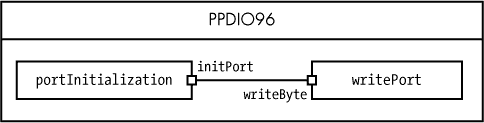

*图 8-16：命名的端口*

你还可以使用球和插座符号表示通信链路的哪一侧是提供者，哪一侧有所需接口（记住，插座侧表示所需接口；球侧表示提供接口）。如果需要，你甚至可以为通信链路命名（见图 8-17）。典型的通信链路形式是 name`:`type，其中 name 是唯一的名称（在组件内），type 是通信链路的类型。

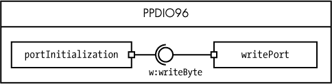

*图 8-17：指示提供和需要的接口*

### 8.5 状态图

UML 状态图（或状态机）图与活动图非常相似，因为它们显示了系统中的控制流。主要区别在于，状态图仅显示系统可能的各种状态以及系统如何从一个状态过渡到另一个状态。

状态图不引入任何新的图表符号；它们使用来自活动图的现有元素——特别是起始状态、结束状态、状态过渡、状态符号和（可选的）决策符号，如图 8-18 所示。

*图 8-18：状态图的元素*

给定的状态图将有一个*起始* *状态*符号；这是活动开始的地方。状态图中的状态符号始终有一个关联的状态名称（显然，这表示当前状态）。状态图可以有多个*结束状态*符号，这是一个特殊状态，标志着活动的结束（进入任何结束状态符号会停止状态机）。过渡箭头表示状态机中状态之间的流动（见图 8-19）。

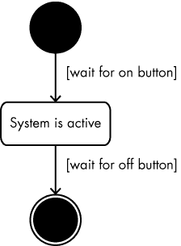

*图 8-19：一个简单的状态图*

转换通常是对系统中的某些外部事件或触发器的响应。*触发器*是引起系统从一个状态转换到另一个状态的刺激。您可以像在图 8-19 中所示那样，将守卫条件附加到转换上，以指示导致转换发生的触发器。

转换箭头有一个箭头头和箭头尾。当在状态图中发生活动时，转换总是从附加在箭头尾部的状态发生，指向箭头头部指示的状态。

如果您处于某个特定状态，并且发生了一个没有对应离开转换的事件，则状态机会忽略该事件。^(2) 例如，在图 8-19 中，如果您已经处于“系统处于活动状态”状态，并且发生了`on` `button`事件，系统将保持在“系统处于活动状态”状态。

如果一个状态的两个转换具有相同的守卫条件，则该状态机是*非确定性的*。这意味着转换箭头的选择是任意的（可以随机选择）。在 UML 状态图中，非确定性是一个不好的特性，因为它会引入歧义。在创建 UML 状态图时，您应该始终努力保持其确定性，确保所有转换都具有相互排斥的守卫条件。从理论上讲，对于每一个可能发生的事件，您应该有一个确切的离开转换；然而，大多数系统设计师假设，如前所述，如果发生一个没有离开转换的事件，那么该状态会忽略该事件。

从一个状态到另一个状态可以没有附加守卫条件的转换；这意味着系统可以从第一个状态（在转换尾部）任意移动到第二个状态（在箭头头部）。当您在状态机中使用决策符号时，这很有用（请参见图 8-20）。在状态图中，决策符号并非必须存在——就像在活动图中，您也可以直接从一个状态发出多个转换（比如图 8-20 中的“系统处于活动状态”状态）——但是，使用决策符号有时可以让您的图表更加简洁。

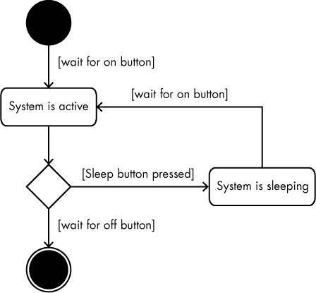

*图 8-20：状态图中的决策符号*

### 8.6 更多 UML

一如既往，这只是对 UML 的简要介绍。本书不会使用更多的图表和其他功能，比如*对象约束语言（OCL）*，因此本章没有讨论它们。然而，如果您有兴趣使用 UML 来记录您的软件项目，您应该花更多的时间学习它。请参见下一节的推荐阅读。

### 8.7 更多信息

Bremer, Michael. *用户手册手册：如何研究、编写、测试、编辑并制作软件手册*. Grass Valley, CA: UnTechnical Press, 1999。可以在 *[`www.untechnicalpress.com/Downloads/UMM%20sample%20doc.pdf`](http://www.untechnicalpress.com/Downloads/UMM%20sample%20doc.pdf)* 获取示例章节。

Larman, Craig. *应用 UML 与模式：面向对象分析与设计及迭代开发导论*. 第 3 版. Upper Saddle River, NJ: Prentice Hall, 2004.

Miles, Russ, 和 Kim Hamilton. *学习 UML 2.0：UML 实用入门*. Sebastopol, CA: O’Reilly Media, 2003.

Pender, Tom. *UML 圣经*. 印第安纳波利斯: Wiley, 2003.

Pilone, Dan, 和 Neil Pitman. *UML 2.0 精要：桌面快速参考手册*. 第 2 版. Sebastopol, CA: O’Reilly Media, 2005.

Roff, Jason T. *UML：初学者指南*. Berkeley, CA: McGraw-Hill Education, 2003.

Tutorials Point. “UML 教程.” *[`www.tutorialspoint.com/uml/`](https://www.tutorialspoint.com/uml/)*.
