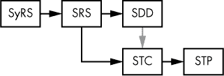
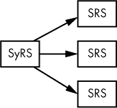
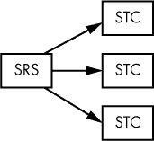
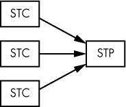
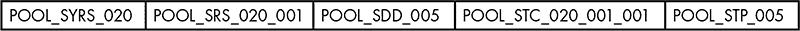
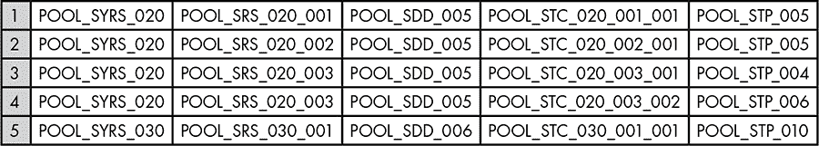
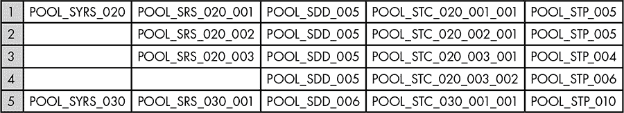
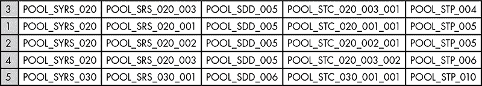

## 第十一章：系统文档**

系统文档指定系统需求、设计、测试用例和测试过程。在大型软件系统中，系统文档通常是最昂贵的部分；例如，瀑布式软件开发模型往往生成比代码更多的文档。此外，通常你必须手动维护系统文档，因此，如果你在某个文档中更改了描述（如需求），你需要搜索整个系统文档并更新每个引用该描述的文档，以确保一致性。这是一个困难且成本高昂的过程。

在本章中，我们将探讨常见的系统文档类型，如何在文档中强制执行一致性，以及减少与开发相关的一些成本的文档策略。

**注意**

*本章讨论的是* 系统 *文档，而非* 用户 *文档。如需详细了解用户文档，请参阅 第 184 页 的“更多信息”。*

### 9.1 系统文档类型

传统的软件工程通常使用以下类型的系统文档：

**系统需求规格说明书 (SyRS)**

SyRS（参见 “系统需求规格说明书” 在 第 193 页）是*系统级别*的需求文档。除了软件需求外，它可能还包括硬件、业务、程序、手册和其他非软件相关的需求。SyRS 是面向客户/管理层/利益相关者的文档，避免详细描述，呈现需求的“宏观视图”。

**软件需求规格说明书 (SRS)**

SRS（参见 “软件需求规格说明书” 在 第 194 页）从 SyRS 中提取软件需求^(1)，并深入探讨高层需求，介绍更详细的新需求（适合软件工程师）。

**注意**

*SyRS 和 SRS 是* 需求 *文档，其内容在范围和细节上可能有所不同。许多组织会生成一个文档，而不是两个单独的文档，但本书将它们分别讨论，因为 SyRS 涉及的需求范围更广（例如，硬件和业务需求），而 SRS 主要集中在软件需求上。*

**软件设计说明书 (SDD)**

SDD（参见 第十一章）讨论系统将如何构建（与 SyRS 和 SRS 不同，它们描述的是系统将做什么）。理论上，任何程序员都应该能够使用 SDD，并编写相应的代码来实现软件系统。

**软件测试用例 (STC)**

STC（见 “软件测试用例文档” 在 第 274 页）描述了验证系统是否包含所有需求，并且在需求列表之外正确功能所需的各种测试值。

**软件测试过程（STP）文档**

STP（见 “软件测试过程文档” 在 第 288 页）描述了高效执行软件测试用例（来自 STC）以验证系统正确操作的程序。

**需求（或反向）追溯矩阵（RTM）文档**

RTM（见 “需求/反向追溯矩阵” 在 第 178 页）将需求与设计、测试用例和代码联系起来。使用 RTM，利益相关者可以验证需求是否在设计和代码中实现，并且测试用例和程序是否正确检查了该需求的实现。

**注意**

*某些组织也可能有一个* 功能需求规格说明 *文档；这通常指的是外部客户提供的需求，或者它也可以仅仅是 SRS 或 SyRS 的同义词。本书后续将不再使用此术语。*

还有许多其他类型的文档，但这些是任何（至少非 XP）项目中你所期望的基本文档，它们对应于瀑布模型的不同阶段（见 “瀑布模型” 在 第 44 页），如图 9-1 所示。

*图 9-1：系统文档依赖关系*

如你所见，SRS 是从 SyRS 构建的，SDD 是从 SRS 构建的，STC 也是如此（在某些情况下，它也受到 SDD 的影响，如灰色箭头所示^(2))。STP 是从 STC 构建的。

### 9.2 追溯性

系统文档中可能最大的后勤问题就是一致性。一个需求通常会生成一些设计项和测试用例（这些测试用例是 STP 中的一部分）。这是在严格的瀑布模型下的直观和自然的进展——首先编写 SRS，然后是 SDD、STC 和 SDD。然而，当你需要对这个链中的早期文档进行更改时，问题就出现了。例如，当你更改一个需求时，可能需要更改 SDD、STC 和 STP 文档中的条目。因此，最佳实践是使用*追溯性*，它允许你轻松地将一个文档中的项追溯到其他所有系统文档。如果你能将需求追溯到设计元素、测试用例和测试过程，你就可以在修改需求时快速定位和更改这些元素。

*反向可追溯性*允许你将测试程序追溯到相应的测试用例，并将测试用例和设计项目追溯到相应的需求。例如，你可能会遇到需要修改测试程序的测试问题，这时可以找到相应的测试用例和需求，以确保你对测试程序的修改能够涵盖所有问题。通过这种方式，反向可追溯性还帮助你判断是否需要修改测试用例或需求。

#### *9.2.1 将可追溯性融入文档的方式*

有几种方法可以实现可追溯性和反向可追溯性。一种方法是将可追溯性内建于与需求、设计元素、测试用例或测试程序文档相关联的*标识符*或*标签*中。该标签可以是段落（或项目）编号、描述性词语或其他能够唯一标识引用文本的符号集合。使用标签的软件文档通过直接引用其他文档来避免浪费空间。

作者们常常使用段落编号作为标签，在文字处理系统中这样做非常简单。然而，许多文字处理软件并不支持跨多个文档类型的交叉引用。而且，你想要使用的标签机制或格式可能与文字处理软件提供的格式不匹配。

尽管可以编写自定义软件，或使用数据库应用程序来提取和维护交叉引用信息，但最常见的解决方案是手动维护标签。这听起来可能需要相当大的努力，但只需稍加规划，实际上并不难。

也许最好的解决方案是创建 RTM（参见“需求/反向可追溯性矩阵” 在第 178 页），它跟踪系统文档中各个项目之间的关联。尽管 RTM 是你需要维护的又一份文档，但它提供了一种完整且易于使用的机制，用于跟踪系统中所有组件。

我们将首先讨论常见的标签格式，然后再探讨如何构建 RTM。

#### *9.2.2 标签格式*

标签语法没有特定的标准；标签可以采用任何你喜欢的形式，只要语法一致且每个标签唯一。为了自己的需要（以及为了这本书），我创建了一种语法，将可追溯性元素直接融入标签中。以下标签格式按文档类型进行组织。

##### 9.2.2.1 SyRS 标签

对于 SyRS，标签的格式为[*productID*_SYRS_*xxx*]，其中：

***productID*** 指代产品或项目。例如，对于游泳池监控应用，*productID* 可能是“POOL”。你不想使用过长的 ID（最多四到五个字符），因为它将频繁输入。

**SYRS** 表明这是来自 SyRS 文档的标签（这可能是一个系统需求标签）。

***xxx*** 表示一个或多个数字，如果使用多个整数，则用句点分隔。这个数字序列在 SyRS 中唯一标识该标签。

在理想情况下，所有 SyRS 需求（以及其他需要标签的项目）应从 1 开始按顺序编号，且数字与它们所指代的文本块的含义无关。

在 SyRS 文档中请考虑以下两个需求：

**[POOL_SYRS_001]: 泳池温度监控**

系统应监控泳池温度。

**[POOL_SYRS_002]: 最高泳池温度**

如果泳池温度超过 86 华氏度，系统应开启“高温”LED 指示灯。

假设在[POOL_SYRS_002]之后有 150 个额外需求。

现在假设有人建议在泳池温度降到 70 华氏度以下时启动泳池加热器。你可以添加以下需求：

**[POOL_SYRS_153]: 最低泳池温度**

如果泳池温度降到 70 华氏度以下，系统应开启泳池加热器。

**[POOL_SYRS_154]: 最高加热器启动温度**

如果泳池温度超过 70 华氏度，系统应关闭泳池加热器。

在 SyRS 中，将相关需求靠近安排是有意义的，这样读者就能在文档中一个地方找到与某个功能相关的所有需求。你可以理解为什么不应该按标签排序需求——这样做会将泳池加热器的新需求推到文档的末尾，远离其他泳池温度需求。

没有什么可以阻止你将需求移到一起；然而，看到这样的需求集有点令人困惑：

**[POOL_SYRS_001]: 泳池温度监控**

系统应监控泳池温度。

**[POOL_SYRS_153]: 最低泳池温度**

如果泳池温度降到 70 华氏度以下，系统应开启泳池加热器。

**[POOL_SYRS_154]: 最高加热器启动温度**

如果泳池温度超过 70 华氏度，系统应关闭泳池加热器。

**[POOL_SYRS_002]: 最高泳池温度**

如果泳池温度超过 86 华氏度，系统应开启“高温”LED 指示灯。

一个更好的解决方案是使用*点序列*重新编号标签，以扩展标签编号。点序列由两个或更多整数组成，整数之间用点分隔。例如：

**[POOL_SYRS_001]: 泳池温度监控**

系统应监控泳池温度。

**[POOL_SYRS_001.1]: 最低泳池温度**

如果泳池温度降到 70 华氏度以下，系统应开启泳池加热器。

**[POOL_SYRS_001.2]: 最高加热器启动温度**

如果泳池温度超过 70 华氏度，系统应关闭泳池加热器。

**[POOL_SYRS_002]: 最高泳池温度**

如果游泳池温度超过 86 华氏度，系统应打开“高温”LED 指示灯。

这样可以让你在任何地方插入新的需求或变更。请注意，001.1 和 001.10 是不同的。这些数字不是浮动点数字值；它们是两个用句点分隔的整数。数字 001.10 可能是序列 001.1 到 001.10 中的第 10 个值。同样，001 与 001.0 也不同。

如果你需要在 001.1 和 001.2 之间插入一个需求，你可以简单地在序列的末尾添加一个句点，如 001.1.1。你也可以在标签号之间留空，以便将来插入更多标签，例如：

**[POOL_SYRS_010]: 游泳池温度监控**

系统应监控游泳池温度。

**[POOL_SYRS_020]: 最大游泳池温度**

如果游泳池温度超过 86 华氏度，系统应打开“高温”LED 指示灯。

所以当你决定添加另外两个要求时，你会有：

**[POOL_SYRS_010]: 游泳池温度监控**

系统应监控游泳池温度。

**[POOL_SYRS_013]: 最低游泳池温度**

如果游泳池温度低于 70 华氏度，系统应打开游泳池加热器。

**[POOL_SYRS_017]: 最大加热器开启温度**

如果游泳池温度超过 70 华氏度，系统应关闭游泳池加热器。

**[POOL_SYRS_020]: 最大游泳池温度**

如果游泳池温度超过 86 华氏度，系统应打开“高温”LED 指示灯。

请记住，确保所有标签唯一是很重要的。

**注意**

*到目前为止，在本节中，标签一直是段落标题的一部分，这在需要在文档中搜索标签时非常有用（尤其是当文档不是电子版时）。不过，你也可以将标签放置在段落中。*

##### 9.2.2.2 SRS 标签

对于仅包含 SRS 而不是 SyRS 作为需求文档的系统文档集，“SRS”可以简单地替换标签中的“SYRS”：[POOL_SRS_010]: 游泳池温度监控。

然而，当一个项目的文档集同时包含 SyRS 和 SRS 时，本书使用一种约定，将 SRS 标签中的反向追溯性直接构建到 SyRS 中。这样的 SRS 标签格式为[*productID*_SRS_*xxx_yyy*]。

*productID*与 SyRS 标签相同：SRS 表示软件需求规格标签（与系统需求规格标签相对），*xxx*和*yyy*是十进制数字，其中*xxx*是对应的 SyRS 标签的编号（参见“SyRS 标签”在第 172 页）。

包含父 SyRS 需求的标签编号将反向可追溯性信息直接嵌入其标签中。因为几乎所有 SRS 需求都是从相应的 SyRS 标签派生的，并且 SyRS 需求和 SRS 需求之间是一个一对多的关系，一个 SyRS 需求可以生成一个或多个 SRS 需求，但每个 SRS 需求只能追溯到一个 SyRS 需求，如图 9-2 所示。

*图 9-2：SyRS 到 SRS 的关系*

*yyy*组件是 SRS 标签值。作为一般规则（也是本书遵循的约定），*yyy*不必在所有 SRS 标签中是唯一的，但*xxx_yyy*的组合必须是唯一的。以下是所有有效（且唯一）的 SRS 标签：

[POOL_SRS_020_001]

[POOL_SRS_020_001.5]

[POOL_SRS_020_002]

[POOL_SRS_030.1_005]

[POOL_SRS_031_003]

本书还采用了在每个*xxx*值中重新开始*yyy*编号的约定。

通过这种方式构造 SRS 标签，你可以将从 SRS 到 SyRS 的自动反向可追溯性直接嵌入标签标识符中。要查找与 SRS 需求相关联的 SyRS 需求，只需提取*xxx*值并在 SyRS 文档中搜索相应的标签。也可以轻松地查找与 SyRS 标签相关联的 SRS 标签。例如，要找到所有与 POOL_SYRS_030 相关联的 SRS 需求，只需在 SRS 文档中搜索所有“SRS_030”的实例。

有可能 SRS 文档会产生一些全新的需求，这些需求并非基于某个特定的 SyRS 需求。如果是这样，则不会有*xxx*编号作为 SRS 标签的一部分。本书保留了 SyRS 标签编号 000（即，永远不会有 SyRS 标签[*productID*_SYRS_000]），任何不基于 SyRS 需求的全新 SRS 需求将采用[*productID*_SRS_000_*yyy*]的形式。

**注意**

*本书使用的另一个约定是用星号（*）代替*000*值。*

将所有与软件相关的 SyRS 需求直接包含在 SRS 中是一个好主意。^(3) 这样，SRS 就能作为一个独立的文档供软件开发人员使用。当将 SyRS 需求直接复制到 SRS 时，我们将使用语法[*productID*_SRS_*xxx*_000]来表示复制的需求标签。也就是说，*yyy*值为 000 表示这是一个复制的标签。

##### 9.2.2.3 SDD 标签

不幸的是，SRS 需求和 SDD 设计元素之间并不是一对多的关系。^(4) 这使得从 SDD 标签到相应 SRS 标签的反向可追溯性更难通过 SDD 标签语法构建。你必须依赖外部的 RTM 文档来提供 SRS 和 SDD 文档之间的链接。

鉴于在 SDD 标签中反向追踪性并不实用，本书使用简化的 SDD 标签格式[*productID*_SDD_*ddd*]，其中 *productID* 具有通常的含义，而 *ddd* 是类似于 SyRS 标签中 *xxx* 的唯一标识符。

##### 9.2.2.4 STC 标签

SRS 要求与 STC 测试用例之间应具有一对多的关系，如图 9-3 所示。

*图 9-3：SRS 到 STC 标签的关系*

这意味着你可以将 STC 到 SRS 的反向追踪性编码到标签中，就像你之前从 SRS 到 SyRS 那样。对于 STC 标签，本书使用语法[*productID*_STC_*xxx_yyy_zzz*]。如果所有的 *yyy* 值都是唯一的（而不是 *xxx_yyy* 的组合唯一），你可以去掉标签中的 *xxx*，但保留 *xxx* 和 *yyy* 组合有助于同时提供对 SRS 和 SyRS 的反向追踪性，这在某些情况下很方便（尽管会增加输入 STC 标签的工作量）。

尽管这种情况很少发生，但确实有可能创建一个不基于任何 SRS 要求的唯一测试用例。^(5) 例如，使用 SDD 实现代码的软件工程师可能会根据他们编写的源代码创建测试用例。在这种情况下，本书使用之前为那些不基于 SyRS 要求的 SRS 要求所示的方案：我们将 *xxx*_*yyy* 的值保留为 000_000 或 *_*，任何不基于要求标签的新 STC 标签将使用 000 作为标签编号后缀。一个 *xxx*_000 组件意味着该测试用例是基于 SyRS 要求，但不是任何基础的 SRS 要求（或者可能是基于通过前述语法从 SyRS 复制过来的 SRS 标签）；这不是一个独立的测试用例。

数值形式为 000_000 的 STC 标签不包含任何追踪性信息。在这种情况下，你需要明确提供链接信息以描述测试用例的来源。以下是一些建议：

+   在标签后使用 *:source* 来描述测试用例的来源（其中 *source* 是包含生成测试用例信息的文件或其他文档的名称）。

+   使用 RTM 提供源信息（请参见下一节，“要求/反向追踪性矩阵”获取更多详细信息）。

+   确保包含测试用例来源的文档中有注释或其他链接，明确指定 STC 标签。

##### 9.2.2.5 STP 标签

STC 测试用例与 STP 测试程序之间具有多对一的关系，如图 9-4 所示。

*图 9-4：STC 到 STP 标签的关系*

这意味着，和 SDD 一样，你不能将反向追踪性信息编码到 STP 标签中。因此，对于 STP 标签，本书使用语法[*productID*_STP_*ppp*]，其中 *productID* 具有通常的含义，*ppp* 是唯一的 STP 标签值。

#### *9.2.3 要求/反向追踪性矩阵*

如前所述，无法将反向可追溯性构建到 SDD 和 STP 标签中，因此你需要使用需求/反向可追溯性矩阵（RTM）。

如其名称所示，RTM 是一个二维矩阵或表格，其中：

+   每一行指定了需求、设计项、测试用例或测试过程之间的关联。

+   每一列指定了一个特定的文档（SyRS、SRS、SDD、STC 或 STP）。

+   每个单元格包含与之关联的文档类型的标签。

表格中的一典型行可能包含如下条目：

一般来说，SyRS 或 SRS 需求标签是 RTM 的驱动因素，你通常会通过这些列对表格进行排序。

由于 SyRS 需求和 SRS 需求之间存在一对多的关系，你可能需要在多个行中复制 SyRS 需求，如以下示例所示：

第 1、2 和 3 行共享相同的 SyRS 标签，但有不同的 SRS 标签；第 3 和 4 行共享相同的 SRS 标签（以及 SyRS 标签），但有不同的 STC 标签。

有时，当 SyRS 和 SRS 标签可以从前面的行推断出来时，省略重复的标签会更简洁，如下所示：

虽然你可以使用文字处理器（例如 Microsoft Word 或 Apple Pages）创建 RTM，但一个更好的解决方案是使用电子表格程序（例如 Microsoft Excel 或 Apple Numbers）或数据库应用程序，它们可以让你根据当前需求轻松地对表格中的行进行排序。本书假设你正在使用电子表格程序。

##### 9.2.3.1 添加额外的列

至少，你会希望 RTM 中为每种系统文档类型设置一列——SyRS（如果有的话）、SRS、SDD、STC 和 STP——但你可能还希望在 RTM 中包含其他信息。例如，你可以考虑增加一个“描述”列，帮助理解所有标签的含义。

或者，如果你有一个 SyRS 文档，“分配”列可能会有用，用来指定一个 SyRS 条目是硬件、软件还是其他。请注意，SRS、SDD、STP 和 STC（按定义）始终与软件相关，因此这些标签的分配项将是“无”（不适用）或始终为“软件”。

另一个有用的列可能是“验证”，它描述了如何在系统中测试（或验证）特定需求。验证类型的示例可能是测试（作为软件测试过程的一部分）、审查、检查、设计、分析、其他或无法测试。

另一个选项是添加一个额外的列（或多列），包含一些行号，你可以用它们快速地按不同方式对数据进行排序。例如，你可能会添加一个从 1 到*n*（其中*n*是行数）编号的列，排序后按需求（SyRS 和 SRS）列出行；另一个从 1 到*n*编号的列，可以按 SDD 标签值排序行，依此类推。

##### 9.2.3.2 排序 RTM

当然，如果你填写了矩阵中的每一个单元格，你可以通过列值（或多个列值）进行排序。例如，假设你正在使用 Microsoft Excel，且列按如下方式组织：

A: 描述

B: SyRS 标签

C: 分配

D: SRS 标签

E: 测试方法

F: SDD 标签

G: STC 标签

H: STP 标签

按照列 B 排序，然后是列 D，再然后是列 G，将按需求顺序对文档进行排序。按照列 F 排序，然后是列 B，再然后是列 D，将按设计元素顺序对文档进行排序。按照列 H 排序，然后是列 D，再然后是列 G，将按测试程序顺序对文档进行排序。

要使用 RTM 从 SyRS 或 SRS 需求追溯到 SRS 需求、SDD 设计项、STC 测试用例或 STP 测试程序，只需按照需求顺序对矩阵进行排序，找到你感兴趣的 SyRS 或 SRS 标签，然后从同一行中挑选出其他文档的对应标签。你可以使用这个方案从 STC 标签追溯到相应的测试程序（因为需求排序也会排序测试用例标签）。

从 STC 到 SRS 再到 SyRS 的反向可追溯性是标签语法的固有特性，因此进行此操作不需要特别的处理。从 SDD 到 SRS（或 SyRS）以及从 STP 到 STC/SRS/SyRS 的反向可追溯性则稍微复杂一些。首先，按 SDD 标签顺序或 STP 标签顺序对矩阵进行排序。这将给你一个所有 SDD 或 STP 标签按字典顺序排列的列表。现在，包含特定 SDD 或 STP 标签的行上的所有标签就是你需要关注的标签。以下示例显示了按测试程序排序的前述 RTM 示例：

在这个表格中，你可以很容易地看到测试程序 005 与 SyRS 标签 020 和 SRS 标签 020_001 以及 020_002 相关联。在这个简单的例子中，你不需要排序数据就能确定这些链接。但是，如果是更复杂的 RTM（包含数十、数百甚至上千个需求），如果表格没有按照 STP 标签排序，那么手动查找这些反向链接将会是相当繁琐的工作。

### 9.3 验证、确认与评审

验证（参见“迭代模型”在第 46 页）是证明产品满足最终用户需求的过程（即，“我们是否在构建正确的产品？”），而验证是确保你已按照项目规范构建它的过程（即，“我们是否在正确地构建产品？”）。验证通常在需求阶段结束时和整个开发周期结束时进行（参见“通过验证降低成本”在第 182 页）。而验证通常发生在软件开发过程的每个阶段结束时，以确保该阶段符合所有输入需求。例如，SDD 的验证将包括确保它覆盖了 SRS 文档中的所有需求（SRS 需求是 SDD 阶段的输入）。

每个阶段的验证步骤如下：

**SyRS/SRS** 确保文档中的需求充分覆盖了客户提供的所有需求——可能来自 UML 用例（参见“UML 用例模型”在第 74 页）或客户的功能规格。

**SDD** 确保设计覆盖了所有需求。输入是来自 SRS 的需求。

**STC** 确保每个（可测试的）需求都有至少一个测试用例。输入是来自 SRS 的需求。

**STP** 确保所有测试用例都被测试过程涵盖。输入是来自 STC 的测试用例（间接地，也是基于测试用例的需求）。

为了验证每个前置阶段，你需要审查由该阶段生成的文档。在这些审查中，RTM 将非常有用。例如，在审查 SDD 时，你会在 SRS 中查找每个需求，找到相应的 SDD 标签，然后验证设计元素是否实现了指定的需求。你将使用相同的过程验证 STC 文档是否通过测试用例覆盖了所有需求。

在审查代码时，最安全的方法是逐一检查每个阶段的所有输入（即 SDD 和 STC 的需求，以及 STP 的测试用例），并在验证正确处理后将每个输入标记为已完成。这个最终清单将成为该阶段审查文档的一部分。

在审查过程中，你还应确认各阶段输出的正确性。例如，在审查 SRS 时，你应该检查每个需求，确保其有用（参见《软件需求规格说明书》第 194 页）；在审查 SDD 时，应该确保每个设计项是正确的（例如，使用了合适的算法并恰当处理了并发操作）；在审查 STC 文档时，应该确保每个测试用例能够正确测试相关需求；在审查 STP 时，应该验证每个测试程序能够正确测试其关联的测试用例。

如果可能的话，为了获得最佳效果，最好由文档作者以外的工程师进行最终的正式审查，或者由另一位工程师参与审查过程。文档作者由于与项目的某一部分过于接近，可能会忽略遗漏的内容，在审查时他们可能会在脑海中补充缺失的元素。因此，文档作者应该在提交正式审查之前，先对文档进行自我审查。

### 9.4 使用文档减少开发成本

文档成本通常是项目整体成本的一个主要组成部分。部分原因是文档数量*过多*。但另一个原因是这些文档相互依赖，这使得它们难以更新和维护。在《*Code Complete*》（微软出版社，2004）一书中，Steve McConnell 报告称，与需求阶段相比，在设计（架构）阶段修正错误的成本是其三倍，在编码阶段是五到十倍，而在系统测试阶段则是十倍。造成这种情况有几个原因：

+   如果在开发过程的早期修复缺陷，你就不会浪费时间编写额外的文档、编写代码和测试有缺陷的设计。例如，为了某个需求编写 SDD 文档、编写实现该需求的代码、编写测试用例和测试程序并执行这些测试，都是需要时间的。如果该需求本身就有问题，那么你就浪费了所有这些努力。

+   如果在系统的某个阶段发现了缺陷项，你必须找到并编辑所有与该缺陷相关的内容，这项工作可能会很繁琐，且容易遗漏修改，进而导致不一致性和其他后续问题。

#### *9.4.1 通过验证减少成本*

没有任何地方比需求阶段（SyRS 和 SRS 开发）更需要验证活动。如果你坚持要求客户在进入后续阶段之前理解并批准所有需求，你可以确保没有不必要的需求，并且你正在解决客户的问题。没有什么比花费几个月时间记录、编码和测试程序的功能，最终客户却说：“这不是我们要求的”更糟糕了。一个良好的验证过程可以帮助减少这种情况的发生概率。

验证应在需求阶段结束和开发周期结束时进行，涉及提出以下问题：

**SyRS（如果存在）**

1.  每个现有需求是否重要？该需求是否描述了客户想要的某个功能？

1.  每个需求是否正确？它是否明确地（没有歧义）说明了客户的要求？

1.  是否存在遗漏的需求？

**SRS**

1.  SyRS（如果存在）中列出的所有软件需求是否也列在 SRS 中？

1.  每个现有需求是否重要？这个功能是否对系统架构师重要，并且已得到客户的同意？

1.  每个需求是否正确？它是否明确地（没有歧义）说明了软件必须做什么才能有效？

1.  是否存在遗漏的需求？

在最终验收测试过程中，测试工程师应持有 SRS 中所有需求的清单，并以复选框的形式列出。当每个需求被测试时，他们应勾选该需求（可能是在执行 STP 中的测试程序时），以确保软件正确地实现了该需求。

#### *9.4.2 通过验证减少成本*

如在第 181 页的“验证、确认与评审”中提到的，验证应在软件开发过程的每个阶段之后进行。特别是，在 SRS 之后，每个系统文档都应有一个验证步骤。以下是完成每个文档后你可能会问的一些问题：

**SDD**

1.  设计组件是否完全覆盖了 SRS 中的所有需求？

1.  需求（多个）与软件设计元素（一个）之间是否存在多对一（或一对一）的关系？虽然一个设计项可能满足多个需求，但不应需要多个设计元素来满足单一需求。

1.  某个软件设计元素是否提供了一个准确的设计来实现给定的需求？

**STC**

1.  需求与测试用例之间是否存在一对多（或一对一）的关系？（也就是说，一个需求可以有多个相关的测试用例，但不应有多个需求共享同一个测试用例。^(6))

1.  某个特定的测试用例是否准确测试了相关的需求？

1.  与某个需求相关的所有测试用例是否完全测试了该需求的正确实现？

**STP**

1.  测试用例在 STC 与测试程序在 STP 之间是否存在多对一关系？也就是说，是否一个测试程序实现一个或多个测试用例，而每个测试用例仅由一个测试程序处理？

1.  给定的测试程序是否准确实现了所有关联的测试用例？

### 9.5 了解更多信息

Bremer, Michael. *用户手册手册：如何研究、编写、测试、编辑和制作软件手册*. 草谷，加利福尼亚州：UnTechnical 出版社，1999 年。样章可在 *[`www.untechnicalpress.com/Downloads/UMM%20sample%20doc.pdf`](http://www.untechnicalpress.com/Downloads/UMM%20sample%20doc.pdf)* 下载。

IEEE. “IEEE 标准 830-1998：IEEE 软件需求规范推荐实践。” 1998 年 10 月 20 日。 *[`doi.org/10.1109/IEEESTD.1998.88286`](https://doi.org/10.1109/IEEESTD.1998.88286)*。

Leffingwell, Dean, 和 Don Widrig. *管理软件需求*. 波士顿：Addison-Wesley 专业出版，2003 年。

McConnell, Steve. *代码大全*. 第二版. 雷德蒙德，WA：微软出版社，2004 年。

Miles, Russ, 和 Kim Hamilton. *学习 UML 2.0：UML 实用入门*. 塞巴斯托波尔，加利福尼亚州：O’Reilly Media，2003 年。

Pender, Tom. *UML 圣经*. 印第安纳波利斯：Wiley 出版社，2003 年。

Roff, Jason T. *UML: 初学者指南*. 伯克利，加利福尼亚州：麦格劳-希尔教育，2003 年。

Wiegers, Karl E. *软件需求*. 雷德蒙德，WA：微软出版社，2009 年。

———. “编写质量需求。” *软件开发* 7，5 期（1999 年 5 月）：44–48。
