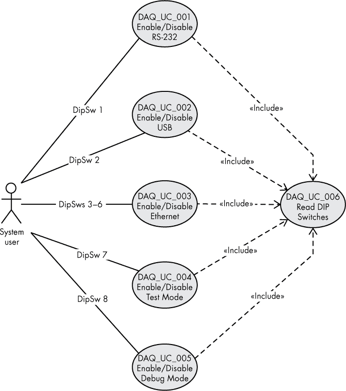

## 第十二章：**需求文档**

需求说明了软件必须做什么，以满足客户的需求，具体来说：

+   系统必须执行的功能（*功能性需求*）

+   系统必须如何执行这些功能（*非功能性需求*）

+   软件必须运行的资源或设计参数（*约束*，这也是非功能性需求）

如果某个软件未能满足特定需求，你不能认为该软件是完整或正确的。因此，一组软件需求是软件开发的基础起点。

### 10.1 需求来源与可追溯性

每个软件需求必须有一个来源。这可以是更高层次的需求文档（例如，软件需求规格说明书[SRS]中的需求可能来自系统需求规格说明书[SyRS]，或者 SyRS 中的需求可能来自客户提供的功能需求文档），特定的用例文档，客户的“工作声明”，客户的口头沟通，或头脑风暴会议。你应该能够追溯每个需求的来源；如果不能，可能说明该需求不必要，应该移除。

*反向可追溯性*是指能够追溯需求的来源。如在第九章中讨论的，反向可追溯性矩阵（RTM）是列出所有需求及其来源的文档或数据库。通过 RTM，你可以轻松识别需求的来源，以确定其重要性（有关 RTM 的详细描述，请参见《需求/反向可追溯性矩阵》，以及第 178 页）。

#### *10.1.1 建议的需求格式*

书面需求应采取以下一种形式：

+   [***触发器***] **演员**应**动作对象**[***条件***]

+   [***触发器***] **演员**必须**动作对象**[***条件***]

方括号内的项是可选的。单词*shall*表示功能性需求；单词*must*表示非功能性需求。每个项根据此示例需求描述如下：

当泳池温度在 40 华氏度到 65 华氏度范围内时，除非大气温度超过 90 华氏度，否则泳池监控员应关闭“良好”指示。

**触发器**触发器是指示需求何时适用的短语。没有触发器意味着该需求始终适用。在本例中，触发器是“当泳池温度在 40 华氏度到 65 华氏度范围内时”。

**演员**演员是执行动作的人或事物——在本例中，“泳池监控员”。

**动作**动作是需求导致的活动（“关闭”）。

**对象**对象是被作用的事物（“‘良好’指示”）。

**条件** 条件通常是一个负面情况，它会阻止某个行动（如果是正面条件引发行动，那它就是触发条件）。在这个例子中，条件是“除非大气温度高于 90 华氏度”。

一些作者允许用*should*或*may*代替*shall*或*must*；然而，这些术语表明该需求是可选的。本书坚持认为所有需求都是必要的，因此不应使用*should*或*may*。

#### *10.1.2 良好需求的特征*

本节讨论了描述良好需求的特征。

##### 10.1.2.1 正确性

需求必须是正确的，这不言而喻，但研究表明，项目成本的约 40%是由于需求中的错误。因此，花时间审查需求并纠正任何错误是确保软件质量的最具成本效益的方式之一。

##### 10.1.2.2 一致性

需求必须相互一致；也就是说，一个需求不能与另一个需求相矛盾。例如，如果一个池温监控器声明温度降到 70 度以下时必须触发警报，而另一个要求温度降到 65 度以下时触发相同的警报，这两个需求就是不一致的。

请注意，一致性指的是同一文档中的需求。如果一个需求与更高级别文档中的需求不一致，那么这个需求是*错误的*——更不用说不一致了。

##### 10.1.2.3 可行性

如果你无法实际实现一个软件需求，那么它就不是一个需求。毕竟，需求说明了为了提供一个令人满意的软件解决方案必须做什么；如果需求不可行，那么也就无法提供软件解决方案。

##### 10.1.2.4 必要性

根据定义，如果一个软件需求不是必要的，那它就不是一个需求。需求的实现成本很高——它们需要文档、代码、测试程序和维护——因此，除非是必要的需求，否则不应包含在内。不必要的需求通常是“过度完善”的结果，或者仅仅因为有人觉得这些功能很酷而添加，而不考虑实现这些功能的成本。

如果一个需求是必要的，那么：

+   使产品具有市场竞争力；

+   满足客户、最终用户或其他利益相关者表达的需求；

+   区分产品或使用模型；或者

+   由商业战略、路线图或可持续性需求所决定。

##### 10.1.2.5 优先级

软件需求指定了你必须做的一切，以生产出期望的应用程序。然而，鉴于各种约束（如时间、预算等），你可能无法在软件的第一次发布中实现每个需求。此外，随着时间的推移（和资金的消耗），一些需求可能会被放弃，因为情况发生了变化。因此，一个好的需求应该有相应的优先级。这有助于推动进度，因为团队首先实现最关键的功能，将不太重要的功能推迟到项目开发周期的最后阶段。通常，三个或四个优先级层次就足够了：关键/强制性、重要、可取和可选是不错的例子。

##### 10.1.2.6 完整性

一个好的需求应该是完整的；即它不应该包含任何*TBD*（待确定）项。

##### 10.1.2.7 明确性

需求不应有任何解释的余地（请注意，TBD 是这一点的特殊情况）。明确无误意味着需求有唯一的解释。

由于大多数需求是用自然语言（如英语）编写的，而自然语言是模糊的，因此在编写需求时必须特别小心，以避免歧义。

一个模糊的需求示例：

当游泳池温度过低时，软件应发出警报。

一个明确无误的示例：

当游泳池温度低于 65 华氏度时，软件应发出警报。

当以下自然语言特征出现在需求中时，便会产生歧义：

**模糊性** 发生在需求中使用*弱词*——那些没有确切含义的词时。本节将很快讨论弱词。

**主观性** 是指不同的人根据个人经验或观点对术语（弱词）赋予不同的含义。

**不完整性** 由使用待定项、部分规格或无界列表导致。在本节稍后将讨论无界列表。

**可选性** 发生在使用使要求变为可选而非必需的短语时（例如，*由……引起*、*使用*、*应该*、*可能*、*如果可能*、*在适当情况下*、*根据需要*）。

**欠规范性** 发生在需求未能充分指定要求时，通常是由于使用了弱词（如*支持*、*分析*、*响应*和*基于*）所致。

请考虑这个需求：

游泳池监视器应支持华氏和摄氏温标。

*支持*在这个上下文中究竟是什么意思？一个开发人员可能会将其解释为最终用户可以选择输入和输出为华氏度或摄氏度（固定），而另一个开发人员则可能解释为两种温标都用于输出，并且输入允许使用任一温标。一个更好的需求可能是：

游泳池监视器的设置应允许用户选择华氏或摄氏温标。

**引用不足** 是指需求提供了对另一个文档的不完整或缺失引用（例如需求的来源）。

**过度概括** 是指需求中包含诸如*任何*、*所有*、*总是*、*每个*等普遍限定词，或者在否定意义上，使用*无*、*从不*和*仅仅*。

**不 intelligibility** 是由糟糕的写作（语法）、未定义的术语、复杂的逻辑（例如双重否定）和不完整性造成的。

**被动语态** 是指需求未将行动者指派给某个动作。例如，一个使用被动语态的糟糕需求可能是：

如果温度低于 65 华氏度，则应触发警报。

谁负责触发警报？不同的人可能会有不同的理解。更好的需求可能是：

如果温度低于 65 华氏度，泳池监控软件应触发警报。

在需求中使用模糊词汇往往会导致歧义。模糊词汇的例子包括：*支持*、*通常*、*某种*、*大多数*、*相当*、*稍微*、*有点*、*某种程度上*、*各种*、*几乎*、*快速*、*简单*、*及时*、*之前*、*之后*、*用户友好*、*有效*、*多个*、*尽可能*、*适当*、*正常*、*能力*、*可靠*、*最先进*、*轻松*和*多*。

例如，“泳池监控器应提供多个传感器”的需求是模糊的，因为*多个*是一个模糊词。它是什么意思？两个？三个？十几个？

另一种创建模糊需求的方法是使用无界列表——一个缺少起始点、终止点或两者的列表。典型的例子包括类似*至少*；*包括但不限于*；*或更晚*；*或更多*；*例如*；*等等*和*等*的措辞。

例如：“泳池监控器应支持三个或更多传感器。” 它必须支持四个传感器吗？十个传感器吗？无限多个传感器吗？这个需求没有明确说明支持的传感器最大数量是多少。更好的需求可能是：

泳池监控器必须支持三个到六个传感器。

无界列表是无法设计和测试的（因此它们无法满足可行性和可验证性属性）。

##### 10.1.2.8 与实现无关

需求必须仅基于系统的输入和输出。它们不应涉及应用程序的实现细节（这是软件设计描述[SDD]文档的目的）。需求必须将系统视为一个黑箱，其中输入被提供并输出结果。

例如，一个需求可能会指出系统的输入是一个数字列表，该列表的输出是一个已排序的列表。该需求不应写成“应使用快速排序算法。” 软件设计师可能有充分的理由使用不同的算法；需求不应强迫软件设计师或程序员做出选择。

##### 10.1.2.9 可验证性

“如果无法测试，那就不是一个要求”是要求编写者应遵循的座右铭。如果你无法为其创建测试，就无法验证该要求是否已在最终产品中得到实现。事实上，如果你无法找到测试方法，要求可能根本无法实现。

如果你无法创建可以在最终软件产品上运行的物理测试，那么你的要求很可能不是完全基于系统输入和输出。例如，如果你有一个要求是“系统应使用快速排序算法对数据进行排序”，那么你该如何测试呢？如果你不得不依赖“通过检查代码来测试此要求”，那么你可能没有一个好的要求。并不是说要求不能通过检查或分析来验证，但实际的测试总是验证要求的最佳方式，特别是如果你能够自动化该测试。

##### 10.1.2.10 原子要求

一个好的要求陈述不得包含多个要求——也就是说，它不能是一个复合要求。要求应尽可能独立；其实现不应依赖于其他要求。

一些作者声称*和*与*或*这两个词在要求中绝不应出现。严格来说，这并不准确。你只是想避免使用*fanboys* 连词（*for*、*and*、*nor*、*but*、*or*、*yet*、*so*）将多个独立的要求合并为一个陈述。例如，以下内容并不是一个复合要求：

当温度在 70 华氏度*和*85 华氏度之间时，泳池监控器应设置“良好”指示。

这是一个单一的要求，而不是两个。*和*一词的出现并不会产生两个要求。如果你真想挑剔并去掉*和*，你可以这样重写该要求：

当温度在 70 华氏度到 85 华氏度的范围内时，泳池监控器应设置“良好”指示。

然而，实际上第一个版本并没有什么问题。以下是一个复合要求的例子：

当温度低于 70 华氏度*或*高于 85 华氏度时，泳池监控器应清除“良好”指示。

这应当被重写为两个独立的要求：^(1)

当温度低于 70 华氏度时，泳池监控器应清除“良好”指示。

当温度超过 85 华氏度时，泳池监控器应清除“良好”指示。

请注意，复合要求在构建可追溯性矩阵时会造成问题，正如本章在“更新包含要求信息的可追溯性矩阵”一节中讨论的那样，见第 222 页。复合要求还会导致测试问题。一个要求的测试必须给出单一的答案：通过或失败。你不能有一个要求的部分通过，而另一个部分失败。这是复合要求的明显标志。

##### 10.1.2.11 唯一性

需求规范中不得包含任何重复的需求。重复内容使得文档的维护变得更加困难，特别是在修改需求时，如果忘记修改重复的部分，会导致问题。

##### 10.1.2.12 可修改

期望项目的需求在其生命周期中保持不变是不现实的。预期会发生变化，技术会变化，市场会变化，竞争也会变化。在产品开发过程中，你可能需要修改一些需求，以适应不断变化的条件。特别是，你不希望选择那些强加某些系统约束的需求，而这些约束会成为其他需求的基础。例如，考虑以下需求：

游泳池监控器应使用 Arduino Mega 2560 单板计算机作为控制模块。

基于此需求，其他需求可能包括“游泳池监控器应使用 A8 引脚作为水位指示”以及“游泳池监控器应使用 D0 引脚作为低温输出”。这些基于使用 Mega 2560 板的需求的问题在于，如果将来出现新的板（例如 Teensy 4.0 模块），那么修改第一个需求就需要同时修改所有依赖它的其他需求。一组更好的需求可能是：

游泳池监控器应使用一块支持 8 个模拟输入、4 个数字输出和 12 个数字输入的单板计算机。

游泳池监控器应使用一个数字输出引脚作为低温报警。

游泳池监控器应使用一个模拟输入引脚作为池水水位输入。

##### 10.1.2.13 可追溯

所有需求必须是可追踪的，包括正向和反向追踪。*反向追踪*意味着该需求可以追溯到其来源。为了能够追溯到其他对象，该需求必须具有一个*标签*（一个独特的标识符，如第四章中介绍的）。

每个需求必须包括其来源，作为需求文本或标签的一部分；否则，必须提供一个单独的 RTM 文档（或数据库），来提供这些信息。通常，你应该在需求本身中明确列出需求的来源。

*正向追踪*提供了与所有基于（或由）需求文档派生的文档之间的链接。通常，正向追踪通过 RTM 文档来处理；在每个需求文档中维护这些信息会太过繁琐（会有过多重复信息，如前所述，这会使得文档的维护变得困难）。

##### 10.1.2.14 表述为正面

需求应陈述必须满足的条件，而不是陈述不允许发生的事情。大多数以否定方式表述的需求无法验证。例如，以下是一个不好的需求：

游泳池监控器不得在低于冰点的环境温度下运行。

该需求建议当温度降至冰点以下时，游泳池监控器必须停止运行。这是否意味着系统会感知温度并在低于冰点时关闭？还是仅仅意味着系统不能期望在低于冰点时产生合理的值？更好的需求可能是：

如果温度下降到冰点以下，游泳池监控器应自动关闭。

希望有一个需求讨论当温度回升至冰点以上时应发生什么。如果游泳池监控器已被关闭，它能感知到这个变化吗？

### 10.2 设计目标

尽管需求不能是可选的，但有时能够在需求文档中列出可选项是有益的。这些项目被称为设计目标。

设计目标违反了许多优秀需求的特性。显然，它们不是必需的，但它们也可能是不完整的、稍微模糊的、指定了实现或不可测试的。例如，一个设计目标可能是使用 C 标准库内置的 `sort()` 函数（一个实现细节）来减少开发时间。另一个设计目标可能是这样的：

游泳池监控器应支持尽可能多的传感器。

正如你所看到的，这既是可选的，也是开放式的。设计目标是开发人员可以用来指导开发选择的建议。它不应涉及额外的设计工作或测试，这些会导致进一步的开发开销。它应该只是帮助开发人员在设计系统时做出某些开发选择。

与需求类似，设计目标也可以有标签，尽管在文档系统中追踪设计目标的需求不大。然而，因为它们可能在某些时候被提升为需求状态，所以最好为它们关联一个标签，以便它们能作为派生文档中需求的起源。

### 10.3 系统需求规格说明书

《系统需求规格说明书》文档汇集了与完整系统相关的所有需求。这可能包括业务需求、立法/政治需求、硬件需求和软件需求。SyRS 通常是一个非常高层次的文档，尽管它是组织内部的。其目的是为组织的从属文档（例如 SRS）中出现的所有需求提供一个*单一来源*。

SyRS 的形式与 SRS（在下一节中描述）相同，因此除了指出 SyRS 会生成 SRS（以及在适当的情况下生成硬件需求规格说明书，或 HRS）之外，我不会进一步阐述其内容。SyRS 是可选的，通常在小型纯软件项目中不存在。

SyRS 需求通常表述为“*系统*应”或“*系统*必须”。这与 SRS 中的需求通常表述为“*软件*应”或“*软件*必须”形成对比。

### 10.4 软件需求规格说明书

软件需求规格说明书（SRS）是一个包含特定软件项目所有需求和设计目标的文档。互联网上有成百上千个 SRS 文档的示例。许多网站似乎对 SRS 的构成有自己的理解。与其在这个喧嚣的环境中引入另一个新模板，本书决定使用 IEEE 定义的模板：IEEE 830-1998《软件需求规格说明书推荐实践》。

本书认为使用 IEEE 830-1998 推荐实践是一个安全的决策，但请注意，该标准并非完美。它是由一个委员会创建的，因此包含了许多冗余信息（不必要的信息）。委员会设计的标准的问题在于，唯一能通过它们的方式是让每个人都将自己的想法注入文档中，即使这些想法与文档中的其他内容冲突。尽管如此，IEEE 830-1998 推荐实践仍然是一个很好的起点。你不必强制实施其中的所有内容，但在编写 SRS 时应将其作为指导方针。

一个典型的 SRS 使用类似于以下的提纲：

**目录**

1 引言

1.1 目的

1.2 范围

1.3 定义、缩写和术语

1.4 参考文献

1.5 概述

2 整体描述

2.1 产品视角

2.1.1 系统接口

2.1.2 用户界面

2.1.3 硬件接口

2.1.4 软件接口

2.1.5 通信接口

2.1.6 内存约束

2.1.7 操作

2.2 站点适配需求

2.3 产品功能

2.4 用户特征

2.5 约束条件

2.6 假设与依赖关系

2.7 需求分配

3 特定需求

3.1 外部接口

3.2 功能需求

3.3 性能要求

3.4 逻辑数据库要求

3.5 设计约束

3.6 标准合规性

3.7 软件系统属性

3.7.1 可靠性

3.7.2 可用性

3.7.3 安全性

3.7.4 可维护性

3.7.5 可移植性

3.8 设计目标

4 附录

5 索引

第三部分是最重要的——这里将列出所有的需求以及设计目标。

#### *10.4.1 引言*

引言部分包含 SRS 的整体概述。以下子部分描述了引言部分的建议内容。

##### 10.4.1.1 目的

在目的部分，你应该说明 SRS 的目的以及目标受众是谁。对于 SRS，目标受众可能是需要验证 SRS 的客户以及将创建 SDD、软件测试用例和软件测试程序并编写代码的开发人员/设计人员。

##### 10.4.1.2 范围

范围部分通过名称描述软件产品（例如，Plantation Productions Pool Monitor），解释产品的功能，并在必要时说明它将*不*做的事情。（不用担心这不符合“正面陈述”规则，因为这是范围声明，而不是需求陈述。）范围部分还概述了项目的目标、产品的收益和目标，以及为产品编写的应用软件。

##### 10.4.1.3 定义、缩写词和缩写

定义部分提供了 SRS 使用的所有术语、缩写词和缩写的词汇表。

##### 10.4.1.4 参考资料

参考资料部分提供了所有 SRS 引用的外部文档的链接。如果你的 SRS 依赖于外部 RTM 文档，你应该在这里引用该文档。如果文档是公司内部的，你应该提供其内部文档编号/引用。如果 SRS 引用的是公司外部的文档，SRS 应列出该文档的标题、作者、出版商、日期以及如何获取该文档的信息。

##### 10.4.1.5 概述

概述部分描述了 SRS 其余部分的格式及其包含的信息（如果你省略了 IEEE 建议中的某些项目，这一部分尤其重要）。

#### *10.4.2 总体描述*

总体描述部分指定了以下方面的要求：

##### 10.4.2.1 产品视角

产品视角部分将产品与其他（可能是竞争的）产品进行比较。如果该产品是更大系统的一部分，产品视角应指出这一点（并描述本文件中的需求如何与更大系统相关）。本节还可以描述产品的各种限制条件，例如：

###### 10.4.2.1.1 系统接口

本节描述了软件如何与系统的其他部分进行接口。这通常包括任何 API，例如软件如何与 Wi-Fi 适配器进行交互，以便远程查看泳池读数。

###### 10.4.2.1.2 用户接口

本节列出了满足需求所需的所有用户界面（UI）元素。例如，在泳池监控场景中，本节可以描述用户如何通过 LCD 显示器和设备上的各种按键与设备进行交互。

###### 10.4.2.1.3 硬件接口

本节可以描述软件如何与底层硬件进行交互。例如，泳池监控 SRS 可以指出，软件将在 Arduino Mega 2560 上运行，使用 A8 至 A15 的模拟输入连接传感器，使用 D0 至 D7 的数字线路作为连接按钮的输入。

###### 10.4.2.1.4 软件接口

本节描述了实现系统所需的任何附加/外部软件。这可能包括操作系统、第三方库、数据库管理系统或其他应用程序系统。例如，池监控器 SRS 可能会描述使用厂商提供的库来读取来自各种传感器的数据。对于每个软件项，你应在本节中包含以下信息：

+   名称

+   规格编号（如有，供应商提供的值）

+   版本号

+   来源

+   目的

+   相关文档的引用

###### 10.4.2.1.5 通信接口

本节列出了产品将使用的任何通信接口，如以太网、Wi-Fi、蓝牙和 RS-232 串行接口。例如，池监控器 SRS 可能会在本节中描述 Wi-Fi 接口。

###### 10.4.2.1.6 内存约束

本节描述了内存和数据存储的所有约束。对于在 Arduino Mega 2560 上运行的池监控器，SRS 可能会说明程序存储存在 1K EEPROM 和 8K RAM 的限制，此外还包括 64K 到 128K 的 Flash 存储。

###### 10.4.2.1.7 操作

本节（通常与 UI 部分合并）描述了产品的各种操作。它可能详细说明不同的操作模式——如正常、低功耗、维护或安装模式——并描述交互式会话、无人值守会话和通信功能。

##### 10.4.2.2 站点适配要求

本节描述了任何特定于站点的适应性。例如，池监控器 SRS 可能会在本节中描述带有水疗池的池的可选传感器。

##### 10.4.2.3 产品功能

产品功能部分描述了软件的（主要）功能。例如，池监控器 SRS 可能会使用本节来描述软件如何监控池水位、池水温度、大气温度、水导电率（用于盐水池）、通过过滤系统的水流量，以及自上次滤网清洁以来的过滤时间。

##### 10.4.2.4 用户特征

用户特征部分描述了将使用该产品的人。例如，池监控器 SRS 可能会定义一个工厂测试技术员（负责测试和修理设备）、一个现场安装技术员、一个高级终端用户和一个普通终端用户。可能会有不同的软件需求仅适用于某些类型的用户。

##### 10.4.2.5 约束

约束部分描述了可能影响开发者在设计和实现软件时选择的任何限制，例如：

+   监管政策

+   硬件限制（例如，信号时序要求）

+   与其他应用程序的接口

+   并行操作

+   审计功能

+   控制功能

+   高级语言要求

+   信号握手协议（例如，XON-XOFF）

+   可靠性要求

+   应用的重要性

+   安全和保密考虑

##### 10.4.2.6 假设与依赖

假设与依赖部分列出的项目仅适用于需求；它们不对设计施加约束。如果某个假设发生变化，将需要更改需求，而不是设计（尽管需求变化可能也会影响设计）。例如，在泳池监控 SRS 中，一个假设可能是 Arduino Mega 2560 提供足够的计算能力、端口和内存来完成任务。如果这个假设不正确，可能会影响一些关于端口使用、可用内存等方面的需求。

##### 10.4.2.7 需求划分

需求划分部分将需求和特性分成两个或更多组：一组是当前版本要实现的，另一组是计划在未来版本中实现的。

#### *10.4.3 特定需求*

特定需求部分应列出所有需求和支持文档。这些文档应编写成系统设计师可以根据记录的需求构建软件设计的方式。

所有需求应具备本章前面讨论的特点。它们还应具有标签和指向其来源的交叉引用（追踪）。由于需求文档将被阅读的次数远远超过写作次数，你应特别注意使该文档尽可能易读。

##### 10.4.3.1 外部接口

外部接口部分应详细描述软件系统的所有输入和输出，但不要重复产品视角部分接口子章节中的信息。每项列表应包含以下信息（根据系统的需要）：

+   标签

+   描述

+   输入源或输出目的地

+   有效值范围及必要的精度/容差

+   测量单位

+   时序和容差

+   与其他输入/输出项的关系

+   屏幕/窗口格式（仅列出实际需求的屏幕要求——不要在此设计用户界面）

+   数据格式

+   命令格式、协议及任何必要的哨兵消息

许多 SRS 作者会将此部分从特定需求部分中提取出来，并放到产品视角部分，以避免重复，尽管 IEEE 830-1998 标准建议该部分应作为特定需求部分的一部分。然而，IEEE 文档仅为*推荐*实践，因此最终选择权在于你。最重要的是，这些信息出现在 SRS 中。

##### 10.4.3.2 功能需求

功能需求部分包含大多数人立刻识别为需求的项目。此部分列出了输入时系统执行的基本活动，并描述了系统如何利用输入生成输出。按照惯例，功能需求始终包含助动词*应*。例如，“软件*应*在池低输入激活时触发警报。”

典型的功能需求包括以下内容：

+   输入有效性检查及对无效输入的响应

+   操作顺序

+   异常情况响应，包括：溢出、下溢、算术异常、通信故障、资源超限、错误处理和恢复，以及协议错误

+   软件执行期间数据的持久性

+   参数的影响

+   输入/输出关系，包括：合法和非法输入模式、输入与输出的关系，以及如何根据输入计算输出（但要小心，不要将软件设计融入需求中）

##### 10.4.3.3 性能需求

性能需求部分列出了规定软件必须达到的静态或动态性能目标的非功能性需求。像大多数非功能性需求一样，性能需求通常包含助动词*必须*——例如，“软件*必须*能够控制内部显示和远程显示。”

静态性能需求是为整个系统定义的，不依赖于软件的能力。池监控器的一个好例子是“池监控器*必须*能够读取来自 5 到 10 个模拟传感器的输入数据。”这是一个静态需求，因为在特定安装下，传感器的数量是静态的（例如，软件效率提高也不会改变传感器数量）。

动态性能需求是软件在执行过程中必须满足的要求。一个好的例子可能是“软件*必须*每秒读取每个传感器 10 到 20 次。”

##### 10.4.3.4 逻辑数据库需求

逻辑数据库需求部分描述了规定应用程序必须访问的数据库记录和字段格式的非功能性需求。通常，这些需求涉及外部访问的数据库。内部数据库（即对外部不可见的数据库）通常不在软件需求的范畴内，尽管 SDD 可能会涵盖这些内容。

##### 10.4.3.5 设计约束

标准合规性是*设计约束*的一个例子。任何限制软件设计师无法使用任意实现的方法的约束都应该列出在设计约束部分。例如，限制从 16 位 A/D 转换器读取数据仅为 13 位，因为 A/D 芯片/电路噪声较大，低三位可能不可靠。

##### 10.4.3.6 标准合规性

标准合规性部分应描述并提供所有软件必须遵循的标准的链接。标准编号和文档描述应允许读者在必要时研究这些标准。

##### 10.4.3.7 软件系统属性

软件系统属性部分列出了软件系统的特性，包括：

###### 10.4.3.7.1 可靠性

需求部分将指定软件系统的预期正常运行时间要求。可靠性是一个非功能性需求，通常以百分比形式描述系统在没有故障的情况下能运行的时间。一个典型的例子是“预期可靠性为 99.99％”，意味着软件在 0.01％的时间内可能会出现故障。与许多非功能性需求一样，很难提供测试以确保可靠性目标得到满足。

###### 10.4.3.7.2 可用性

可用性属性指定最终应用程序中可以接受的*停机时间*（实际上，它指定的是停机时间的*反向*）。可用性指定用户随时访问软件系统的能力。当系统*宕机*时，用户无法访问。这一非功能性需求可能区分计划停机时间和非计划停机时间（例如，硬件故障导致系统重启）。

###### 10.4.3.7.3 安全性

安全性属性是一种非功能性需求，指定预期的系统安全性，可能包括加密要求和网络套接字类型等内容。

###### 10.4.3.7.4 可维护性

可维护性是另一项非功能性需求，可能很难指定和测试。在大多数规范中，通常有一个模糊的陈述，例如“软件应易于维护”。这种说法没有实际意义。相反，这个属性应该明确表示：“一个有经验的维护程序员不超过一周就能掌握该系统并进行修改。”

需求组织

任何足够复杂的系统都会有大量的需求，因此如果没有正确组织，SRS（软件需求规格说明书）可能会变得笨重。应用程序类型多样，组织需求的方式也有很多种。没有一种特定的组织方式是正确的；你需要根据 SRS 的受众选择以下选项之一。

**按系统模式组织**

一些系统在不同模式下运行——例如，嵌入式系统可能有低功耗模式和常规模式。在这种情况下，你可以将系统需求组织成这两类。

**按用户类别组织**

一些系统支持不同类别的用户（例如，初学者、高级用户和系统管理员）。在一个复杂的系统中，你可能会有普通用户、高级用户、维护人员和程序员访问该系统。

**按对象类别组织**

对象是软件系统中的实体，代表了现实世界中的对象。你可以根据这些对象的类型或类别来组织需求。

**按功能组织**

组织 SRS 需求的常见方法之一是根据它们实现的功能特性进行分类。这种方法在应用程序为系统中的所有功能提供用户界面时特别有用。

**按输入刺激组织**

如果处理不同输入是应用程序的主要活动，那么你可以考虑根据应用程序处理的输入类型来组织你的 SRS。

**按输出响应组织**

类似地，如果生成广泛的输出是应用程序的主要活动，那么按输出响应来组织需求可能更为合理。

**按功能层次结构组织**

另一种常见的 SRS 组织方法是按功能进行组织。这通常是当没有其他合适的组织方式时，SRS 编写者所采用的备选方案。按共同输入、命令输出、常见数据库操作以及程序中的数据流对需求进行分组，是组织 SRS 的合理方式。

###### 10.4.3.7.5 可移植性

可移植性描述了将软件移植到不同环境所涉及的内容。本节应讨论跨 CPU、操作系统和编程语言方言的可移植性。

##### 10.4.3.8 设计目标

在编写软件需求规格说明书（SRS）时，通常很容易把所谓的可选需求放入其中。然而，正如本章前面所提到的，需求的定义本身就不可以是可选的。尽管如此，在某些时候，你可能会想说：“如果可能的话，请添加此功能。”你可以将这些请求表述为设计目标，并由设计师或软件工程师决定该功能是否值得添加。将设计目标放在单独的章节中，并在 SRS 中清楚地表述“*作为设计目标*，软件应该……。”

#### *10.4.4 支持信息*

任何优秀的软件需求规格说明书都应包含支持信息，如目录、附录、词汇表和索引。还应有一个需求标签表（按数字或字典顺序排序），列出每个标签、需求的简短描述以及需求在文档中出现的页码（这也可以放在 RTM 中，而不是 SRS 中）。

#### *10.4.5 一个示范软件需求规格说明书*

本节提供了一个游泳池监控器的示例 SRS，类似于本章至今提供的示例。由于篇幅原因，该游泳池监控器 SRS 被大大简化；其目的是提供一个示范性的大纲，而非完整的规格说明。

**目录**

**1 引言**

**1.1 目的**

游泳池监控设备将跟踪池水水位，并在水位较低时自动补充水池。

**1.2 范围**

游泳池监控器的软件将根据本规范编写。

硬件和软件开发的目标是根据分配给游泳池监控器系统的需求，提供功能、状态信息、监控和控制硬件、通信和自检功能。

**1.3 定义、缩略语和缩写**

| **术语** | **定义** |
| --- | --- |
| 准确度 | 与真实值的一致程度，对于数字显示的输入，以读数的百分比表示（ANSI N42.18-1980）。 |
| 异常 | 在软件的文档或操作中观察到的任何偏离预期的情况。（来源：IEEE Std 610.12-1990。） |
| 灾难性事件 | 一种没有预警且无法恢复的事件。灾难性事件包括导致计算和处理错误的硬件或软件故障。处理器将在灾难性事件发生后，根据配置项，停止或重置。 |
| 处理的条件 | 系统设计用于处理并继续处理的条件。这些条件包括异常、故障和失败。 |
| SBC | 单板计算机 |
| 软件需求规格说明书（SRS） | 记录软件及其外部接口的基本需求（功能、性能、设计约束和属性）（IEEE Std 610.12-1990）。 |
| SPM | 游泳池监控器 |
| 系统需求规格说明书（SyRS） | 体现系统需求的结构化信息集合（IEEE Std 1233-1998）。一份记录需求的规格说明书，用于建立设计基础和系统或子系统的概念设计。 |

**1.4 参考文献**

[无]

**1.5 概述**

第二部分提供了游泳池监控器（硬件和软件）的总体描述。

第三部分列出了游泳池监控器系统的具体需求。

第 4 和第五部分提供了任何必要的附录和索引。

在第三部分中，需求标签采用以下格式：

| <空白> | [POOL_SRS_*xxx*] |
| --- | --- |
| <空白> | [POOL_SRS_*xxx.yy*] |
| <空白> | [POOL_SRS_*xxx.yy.zz*] |
| <等等> |  |

其中*xxx*是一个三位或四位的 SRS 需求编号。

如果需要在两个其他值之间插入新的 SRS 需求标签（例如，在 POOL_SRS_040 和 POOL_SRS_041 之间添加一个需求），则应在 SRS 标签编号后附加一个小数分数（例如，POOL_SRS_040.5）。如果需要，可以添加多个小数点后缀（例如，POOL_SRS_40.05.02）。

**2 总体描述**

游泳池监控器（SPM）的目的是提供一个自动系统，用于保持池中的水位。这个任务足够简单，可以编写一个简短的 SRS，以便适应本章内容。

**2.1 产品视角**

在现实世界中，SPM 可能提供许多额外功能；将这些功能添加到此处只会增加 SRS 的大小，而不会提供太多额外的教育益处。此规格已故意简化，以符合本书的编辑要求。

**2.1.1 系统接口**

SPM 设计假定使用 Arduino 兼容的单板计算机（SBC）。因此，软件将通过 Arduino 兼容的库与硬件进行接口。

**2.1.2 用户界面**

用户界面应包括一个小型四行显示屏（每行最少 20 个字符）、六个按键（上、下、左、右、取消/返回、选择/确认）和一个旋转编码器（旋转旋钮）。

**2.1.3 硬件接口**

本文件没有指定使用特定的 SBC。然而，SBC 必须至少提供以下功能：

+   16 个数字输入

+   1 个模拟输入

+   2 个数字输出

+   少量非易失性可写内存（例如 EEPROM），用于存储配置值。

+   一个实时时钟（RTC；这可以是外部模块）

+   一个看门狗定时器，用于监控系统的软件操作。

SPM 提供泳池传感器，用于判断泳池水位的高低。它还提供一个电磁阀接口，允许 SPM 开启或关闭泳池的水源。

**2.1.4 软件接口**

SPM 软件是自包含的，不提供任何外部接口，也不需要任何外部软件接口。

**2.1.5 通信接口**

SPM 是自包含的，不与外界通信。

**2.1.6 存储限制**

由于 SPM 运行在 Arduino 兼容的 SBC 上，具体型号的选择（例如，Arduino Mega 2560 SBC 只提供 8KB 的静态 RAM）将决定（严重的）内存限制。

**2.1.7 操作**

SPM 以*始终开启*模式运行，全天候 24/7/365 监控泳池。因此，模块本身不应消耗过多电力。然而，它将通过电源供应连接到市电，因此不需要极低功耗操作。它将持续监控泳池水位，并在水位较低时自动开启水源。为了避免在传感器故障时发生水灾，SPM 将限制每天引入泳池的水量（时间限制可由用户选择）。

**2.2 现场适配要求**

对于这一特定版本的 SPM，几乎没有现场适配要求。没有可选的传感器或操作，SPM 本身之外唯一的接口是为系统提供电源和水源（通过电磁阀接口）。

**2.3 产品功能**

产品将使用七个水位传感器来确定池水水位：三个数字传感器提供*低水位*指示，三个数字传感器提供*高水位*指示，以及一个模拟传感器提供池水深度指示（可能只有几英寸或几厘米的范围）。三个低水位数字传感器在水位达到传感器水平时处于激活状态。水位低时，系统将开始注水。为避免传感器故障导致洪水，三个传感器以*三分之二*的配置工作，意味着必须至少有两个传感器指示低水位，SPM 才会尝试注水。三个高水位传感器在水位较高时以相同的方式工作，提示 SPM 停止注水。模拟传感器提供一个小范围的深度；SPM 将使用模拟传感器作为备份，以验证池水水位低于注水阈值。SPM 还将使用模拟传感器来确认在开启水源时池水确实在注入。

**2.4 用户特征**

SPM 用户分为两类：技术人员和最终用户。技术人员负责安装和调整 SPM，最终用户是游泳池的所有者，负责日常使用 SPM。

**2.5 限制条件**

SPM 应小心设计，防止因操作不当造成洪水和过度用水。特别是，软件必须足够强大，能够判断游泳池是否未被正确注满，并在传感器未显示正常工作时停止注水。如果任何传感器出现故障，软件应足够智能，避免盲目保持水流开启（否则可能导致水灾）。例如，如果 SPM 连接到一个地上游泳池，而该池有泄漏，可能永远无法将池水注满。软件应能够处理这种情况。

系统应具备故障安全功能，即在停电时应自动关闭水阀。某种类型的看门狗定时器还应检查软件是否正常运行，如果发生超时（例如，软件卡死），应关闭水阀。

为了避免由于继电器故障引发的洪水，SPM 应使用两个串联的继电器来打开水阀。两个继电器都必须通过软件触发才能打开电磁阀。

**2.6 假设和依赖关系**

本文档中的要求假设 SBC 拥有足够的资源（计算能力）来处理任务，并且设备能够在 24/7/365 的实时环境中合理运行。

**2.7 要求的分配**

这些要求定义了一个非常简单的游泳池监控器，用于展示完整的 SRS。由于这是一个为非常小的 SPM 设定的最小要求集，因此假设基于这些要求构建的产品将实现所有这些要求。一个实际的产品可能会包括许多超出这里列出的附加功能，并相应地增加该文档中的要求数量。

**3 特定要求**

**3.1 外部接口**

**[POOL_SRS_001]**

SPM 应提供一个数字输入，用于导航 *上* 按钮。

**[POOL_SRS_002]**

SPM 应提供一个数字输入，用于导航 *下* 按钮。

**[POOL_SRS_003]**

SPM 应提供一个数字输入，用于导航 *左* 按钮。

**[POOL_SRS_004]**

SPM 应提供一个数字输入，用于导航 *右* 按钮。

**[POOL_SRS_005]**

SPM 应提供一个数字输入，用于 *取消/返回* 按钮。

**[POOL_SRS_006]**

SPM 应提供一个数字输入，用于 *选择/输入* 按钮。

**[POOL_SRS_007]**

SPM 应提供四个数字输入，用于旋转编码器（正交）输入。

**[POOL_SRS_008.01]**

SPM 应提供一个数字输入，用于主 *水位低* 传感器。

**[POOL_SRS_008.02]**

SPM 应提供一个数字输入，用于次级 *水位低* 传感器。

**[POOL_SRS_008.03]**

SPM 应提供一个数字输入，用于三级 *水位低* 传感器。

**[POOL_SRS_009.01]**

SPM 应提供一个数字输入，用于主 *水位高* 传感器。

**[POOL_SRS_009.02]**

SPM 应提供一个数字输入，用于次级 *水位高* 传感器。

**[POOL_SRS_009.03]**

SPM 应提供一个数字输入，用于三级 *水位高* 传感器。

**[POOL_SRS_011]**

SPM 应提供一个模拟输入（最低 8 位分辨率）用于水位传感器。

**[POOL_SRS_012]**

SPM 应提供两个数字输出，用于控制水源电磁阀。

**3.2 功能要求**

**[POOL_SRS_013]**

SPM 应允许用户通过用户界面设置 RTC 日期和时间。

**[POOL_SRS_014]**

SPM 应具有最大填充时间，指定在 24 小时内水阀可以激活的最大时间（小时:分钟）。

**[POOL_SRS_015]**

用户应能够通过 SPM 用户界面设置最大填充时间（使用导航和输入按钮）。

**[POOL_SRS_015.01]**

一旦用户从用户界面选择了最大填充时间，用户应能够使用导航按钮选择小时或分钟字段。

**[POOL_SRS_015.02]**

用户应能够在选择小时字段后，使用旋转编码器独立设置最大填充时间的小时值。

**[POOL_SRS_015.03]**

用户应能够在选择分钟字段后，使用旋转编码器独立设置最大填充时间的分钟值。

**[POOL_SRS_015.04]**

软件不应允许最大填充时间超过 12 小时。

**[POOL_SRS_016]**

SPM 应每 24 小时在特定时间检查一次泳池水位，以确定是否需要向泳池加水。

**[POOL_SRS_017]**

用户应能够在 SPM 用户界面中设置 SPM 检查泳池水位的时间（因此，也就是 SPM 填充泳池的时间）。

**[POOL_SRS_017.01]**

一旦用户从用户界面选择了泳池水位检查时间，用户应能够使用导航按钮选择小时或分钟字段。

**[POOL_SRS_017.02]**

用户应能够在选择小时字段后，使用旋转编码器独立设置泳池水位检查时间的小时数值。

**[POOL_SRS_017.03]**

用户应能够在选择分钟字段后，使用旋转编码器独立设置泳池水位检查时间的分钟数值。

**[POOL_SRS_017.04]**

默认（恢复出厂设置）泳池检查时间应为凌晨 1:00。

**[POOL_SRS_018]**

每天泳池检查时，系统应读取三个 *泳池水位低* 传感器，并在至少两个传感器指示水位低时开始泳池填充操作。

**[POOL_SRS_018.01]**

在泳池填充操作过程中，软件应累计一个运行中的 *填充时间*。

**[POOL_SRS_018.02]**

在泳池填充操作过程中，如果填充时间超过最大填充时间，软件应停止泳池填充操作。

**[POOL_SRS_018.03]**

在泳池填充操作过程中，软件应读取 *泳池水位高* 传感器，如果至少两个传感器指示水位过高，则停止泳池填充操作。

**[POOL_SRS_018.04]**

在泳池填充操作过程中，软件应读取模拟泳池水位传感器，如果每半小时操作后水位没有增加，则关闭水流。

**[POOL_SRS_019]**

软件应允许用户选择一个 *手动泳池* 填充模式，该模式会打开水源至泳池。

**[POOL_SRS_019.01]**

软件应允许用户选择一个 *自动泳池* 填充模式，该模式会关闭手动泳池填充模式。

**[POOL_SRS_019.02]**

在手动泳池填充模式下，软件应忽略最大填充时间。

**[POOL_SRS_019.03]**

在手动泳池填充模式下，软件应忽略 *泳池水位高* 和 *泳池水位低* 传感器（当用户关闭手动填充模式时，填充停止）。

**[POOL_SRS_020]**

软件应至少以看门狗超时周期的两倍频率更新系统看门狗定时器。

**[POOL_SRS_020.01]**

看门狗超时时间应不小于 5 秒，不大于 60 秒。

**3.3 性能要求**

**[POOL_SRS_001.00.01]**

SPM 应当对所有按钮输入进行去抖动处理。

**[POOL_SRS_007.00.01]**

SPM 应能够读取旋转编码器输入，而不丢失输入上的任何更改。

**[POOL_SRS_015.00.01]**

SPM 应保持最大池水填充时间的准确性，误差不超过一分钟。

**[POOL_SRS_017.00.01]**

SPM 应保持池水位检查时间的准确性，误差不超过一分钟。

**3.4 逻辑数据库需求**

**[POOL_SRS_014.00.01]**

SPM 应将最大填充时间存储在非易失性存储器中。

**[POOL_SRS_016.00.01]**

SPM 应将池水检查时间存储在非易失性存储器中。

**3.5 设计约束**

[无]

**3.6 标准符合性**

[无]

**3.7 软件系统属性**

**3.7.1 可靠性**

软件将全天候运行（24/7/365）。因此，系统设计的关键因素是其稳健性。特别是，系统应具备故障安全功能，以确保在软件或其他故障发生时，水阀能自动关闭。

**3.7.2 可用性**

软件应持续运行（24/7/365）。软件不得受计数溢出或与长期执行相关的其他问题影响。最终用户应期待至少 99.99%的正常运行时间。

**3.7.3 安全性**

系统没有安全要求（封闭的、断开连接的、空气隔离的系统）。

**3.7.4 可维护性**

除了通常期望的专业软件工程项目中的维护性要求外，其他维护性要求不再列出。

也就是说，这是一个基础的需求文档。如果有人真的构建这个系统，预计将会有未来的增强功能。因此，系统应根据这些预期进行设计和实现。

**3.7.5 可移植性**

预计软件将运行在 Arduino 类设备上。除非选择不同的 Arduino 兼容模块（例如，Arduino Mega 2560 与 Teensy 4.0）进行实现，否则没有其他可移植性要求。

**3.8 设计目标**

本项目无要求。

**4 附录**

[无]

**5 索引**

鉴于此 SRS 的（较小）规模，文中未列出索引，以减少本书的页数。

### 10.5 创建需求

到目前为止，本章已经定义了需求和需求文档。但你可能会问，“需求到底是如何最初提出的？”这一节将为这个问题提供一些见解。

现代需求创建方法涉及使用案例，这些案例在第四章中介绍。系统架构师研究最终用户如何使用系统（用户故事），并从该研究中创建一组场景（使用案例）。每个使用案例成为一组一个或多个需求的基础。本节从游泳池监控器场景出发，考虑一个来自现实世界系统的例子——Plantation Productions *数字数据采集与控制（DAQ）系统*。^(2)

DAQ 系统由多个相互连接的电路板组成，包括模拟 I/O 板、数字 I/O 板、数字输出板（继电器板）和一个运行系统固件的单板计算机（SBC），Netburner MOD54415。这些组件使系统设计人员能够读取各种模拟和数字输入，计算结果并根据这些输入做出决策，然后通过将数字和模拟输出值发送到外部设备来控制这些设备。例如，DAQ 系统最初设计用于控制 TRIGA^(3)研究反应堆。

DAQ 系统的固件要求过于庞大，无法在此复制，因此本章将限制讨论系统首次启动时必须进行的某些 I/O 初始化。Netburner MOD54415 包括一组八个 DIP 开关，DAQ 系统使用这些开关来初始化各种系统组件。这些 DIP 开关执行以下功能：

1.  启用/禁用 RS-232 端口命令处理。

1.  启用/禁用 USB 端口命令处理。

1.  启用/禁用以太网端口命令处理。

1.  指定一个以太网连接或五个同时的以太网连接。

1.  使用两个 DIP 开关指定四种不同的以太网地址；请参见表 10-1。

1.  启用/禁用测试模式。

1.  启用/禁用调试输出。

**表 10-1：** 以太网地址选择

| **DIP 开关 A** | **DIP 开关 A + 1** | **以太网地址** |
| --- | --- | --- |
| 0 | 0 | 192.168.2.70 |
| 1 | 0 | 192.168.2.71 |
| 0 | 1 | 192.168.2.72 |
| 1 | 1 | 192.168.2.73 |

关于 DAQ 软件初始化的最后一点需要注意：调试输出使用 Netburner COM1:端口。Netburner 与 USB 端口共享此串口硬件。如果用户启用调试输出和 USB 命令端口，则会发生冲突。因此，要启用调试端口，必须满足两个条件：必须启用调试输出并禁用 USB 端口命令处理。

要启用来自 RS-232 或 USB 端口的命令，软件必须读取开关。如果特定开关指示命令流处于活动状态，则软件必须创建一个新任务^(4)来处理该端口的输入。新创建的任务负责从给定端口读取字符，并在接收到换行符时将整行文本发送到系统的命令处理器。如果相应的 DIP 开关处于禁用位置，软件将不会创建 RS-232 或 USB 任务，系统将忽略这些端口。

启用以太网命令稍微复杂一些。与以太网端口相关联有四个 DIP 开关。以太网初始化操作必须考虑所有四个 DIP 开关的设置。

一个 DIP 开关控制 DAQ 软件支持的并发客户端数量。在某一位置，DAQ 软件仅支持一个以太网客户端；在另一个位置，软件支持最多五个以太网客户端。在某些环境中，您可能需要允许多个主机计算机访问数据采集和控制硬件；例如，在调试过程中，您可能希望有一台测试计算机监控操作。在某些安全应用程序中（部署后），您可能希望限制对 DAQ 系统的访问，仅限一台计算机。

第三和第四个以太网 DIP 开关允许操作员选择四个独立的 IP/以太网地址之一。这允许在同一系统中控制最多四个独立的 Netburner 模块。如表 10-1 所示，四个可选的以太网地址为 192.168.2.70 到 192.168.2.73（当然，要求可以更改以支持不同的 IP 地址，但这些是为初始 DAQ 系统设计的便捷地址）。

### 10.6 用例

根据前述的用户故事，下一步是构建一组用例，描述这些操作。请记住，用例不仅仅是几张 UML 图，它们还包括描述性的叙述（见“用例叙述”第 80 页）。

**角色** 在以下用例中，只有一个角色，即*系统用户*。

**触发器** 在以下所有用例中，触发每个用例的触发器是系统启动。系统在启动时读取 DIP 开关设置，并根据这些设置进行初始化（见图 10-1）。

**场景/事件流程** 这些是给定用例中发生的活动。

**关联要求** 关联要求提供对 DAQ 系统 SRS 的交叉引用。要求出现在以下部分（见“(选定的)DAQ 软件要求（来自 SRS）”第 219 页）。您必须在填写此部分之前创建要求；否则，您将只能猜测所需的要求。

*图 10-1：读取 DIP 开关用例*

#### *10.6.1 启用/禁用调试模式*

**目标** 启用和禁用 DAQ 系统中的调试输出。

**前提条件** 系统已启动。

**结束条件** 调试模式根据需要处于激活或非激活状态。

##### 10.6.1.1 场景/事件流程

启用/禁用调试模式

1.  在系统初始化过程中，读取 DIP 开关。

1.  保存 DIP 开关 8 的值（`on` = 调试模式开启，`off` = 调试模式关闭）。

1.  如果 DIP 开关 8 为`on`且 DIP 开关 2（USB 模式）为`off`，则启用调试模式。

1.  启动`maintPrintf`任务。

##### 10.6.1.2 关联要求

DAQ_SRS_721_001：PPDAQ 调试模式启用

DAQ_SRS_721_002：PPDAQ 调试模式禁用

#### *10.6.2 启用/禁用以太网*

**目标** 启用和禁用 DAQ 系统中的以太网命令处理。

**前提条件** 系统已启动。

**结束条件** 以太网通信处于活动或非活动状态，根据需要。如果处于活动状态，则以太网输入处理任务正在运行。

##### 10.6.2.1 场景/事件流

启用/禁用以太网

1\. 在系统初始化期间，读取 DIP 开关。

2\. 使用 DIP 开关 3 的值来确定以太网是否启用（开关为`on`）或禁用（开关为`off`）。

3\. 保存 DIP 开关 4 的值以确定系统是否支持一个连接（开关为`off`）或五个并发连接（开关为`on`）。

4\. 使用 DIP 开关 5 和 6 的值来确定 IP 地址。

5\. 如果以太网已启用（DIP 开关 3 为`on`），则：

5.1 根据 DIP 开关 5 和 6 的值设置以太网地址，如下所示：

5.1.1 192.168.2.70

5.1.2 192.168.2.71

5.1.3 192.168.2.72

5.1.4 192.168.2.73

5.2 使用优先级为 `ETHL_PRIO` 启动 `ethernetListenTask` 任务。

6\. 否则（如果以太网未启用）：

6.1 不要启动 `ethernetListenTask`。

`ethernetListenTask`

1\. 初始化一个包含五个描述符的数组，初始值为零（空描述符插槽）。

2\. 等待在以太网套接字 0x5050 上的外部连接请求。

3\. 如果发起了连接请求：

3.1 在描述符数组中搜索一个空插槽（包含零的数组元素）。

3.2 如果没有可用的插槽：

3.2.1 拒绝连接。

3.2.2 转到步骤 2。

3.3 如果有可用插槽：

3.3.1 接受连接并将其文件描述符存储在可用插槽中。

3.3.2 创建与新连接关联的新的以太网命令任务；新任务的优先级应为 `ETH1_PRIO` 至 `ETH5_PRIO`，通过描述符插槽数组的索引选择；注意 `SER_PRIO` < `ETHL_PRIO` < `ETH1_PRIO` 到 `ETH5_PRIO` < `USB_PRIO`（较小的数字意味着任务在任务队列中的优先级更高）。

3.3.3 转到步骤 2。

4\. 如果监听连接断开，终止监听任务。

##### 10.6.2.2 关联要求

DAQ_SRS_708_000: PPDAQ 以太网 IP 地址

DAQ_SRS_709_000: PPDAQ 以太网 IP 地址 192.168.2.70

DAQ_SRS_710_000: PPDAQ 以太网 IP 地址 192.168.2.71

DAQ_SRS_711_000: PPDAQ 以太网 IP 地址 192.168.2.72

DAQ_SRS_712_000: PPDAQ 以太网 IP 地址 192.168.2.73

DAQ_SRS_716_000: PPDAQ 以太网启用

DAQ_SRS_716.5_000: PDAQ 以太网禁用

DAQ_SRS_716_001: PPDAQ 以太网任务

DAQ_SRS_716_002: PPDAQ 以太网任务优先级

DAQ_SRS_717_000: PPDAQ 以太网端口

DAQ_SRS_718_000: PPDAQ 以太网多客户端启用

DAQ_SRS_718_001: PPDAQ 以太网多客户端禁用

DAQ_SRS_728_000: PPDAQ 命令源 #3

DAQ_SRS_737_000: PPDAQ 最大以太网连接 #1

DAQ_SRS_738_000: PPDAQ 最大以太网连接 #2

DAQ_SRS_738_001: PPDAQ 以太网命令处理任务

DAQ_SRS_738_002: PPDAQ 以太网命令任务优先级

#### *10.6.3 启用/禁用 RS-232*

（类似于前面的使用案例；已删除以简化内容。）

#### *10.6.4 启用/禁用测试模式*

（类似于前面的使用案例；已删除以简化内容。）

#### *10.6.5 启用/禁用 USB*

（与前述用例类似；已删除以简化内容。）

#### *10.6.6 读取 DIP 开关*

（与前述用例类似；已删除以简化内容。）

### 10.7 从用例创建 DAQ 软件需求

将一个非正式的用例转化为正式需求的过程包括从用例中提取信息、补充缺失的细节，并将结果构建成需求的形式。

考虑“启用/禁用调试模式”的用例。你可能会觉得这个用例生成了一个单一的需求：

如果 Netburner 的 DIP 开关 8 设置为开启位置且 USB（DIP 开关 2）未启用，则 PPDAQ 软件应在特殊调试模式下运行；如果开关 8 在关闭位置或 DIP 开关 2 已启用，则应在非调试模式下运行。

问题在于，这实际上是两个独立的需求——不是因为“和”与“或”组件（你稍后会明白为什么），而是因为分号将两个从句分开。两个独立的需求是：

如果 Netburner 的 DIP 开关 8 设置为开启位置且 USB（DIP 开关 2）未启用，则 PPDAQ 软件应在特殊调试模式下运行。

和

如果开关 8 在关闭位置或 DIP 开关 2 已启用，则 PPDAQ 软件应在非调试模式下运行。

请注意，“和 USB”和“或 DIP 开关 2”并不意味着这些需求必须拆分成两个独立的需求。句子“如果 Netburner 的 DIP 开关 8 设置为开启位置且 USB（DIP 开关 2）未启用”实际上是该需求的*触发条件*的一部分。从技术角度来看，该需求可能需要重新措辞。

如果 Netburner 的 DIP 开关 8 设置为开启位置且 USB（DIP 开关 2）未启用，则 PPDAQ 软件应在特殊调试模式下运行。

这将触发条件移至需求的开头，正如在章节“建议的需求格式”中所建议的，在第 186 页中提到的那样。需要注意的是，这只是一个建议的格式；将触发条件放在演员（PPDAQ 软件）、动作（运行）和对象（调试模式）之后也是合理的。

下一节列出了 DAQ 软件系统的各种需求。它提供了一个示例，说明了如何从用例中生成 DAQ 需求。你应该能够自行填写剩余需求的详细信息。

### 10.8（选择的）DAQ 软件需求（来自 SRS）

实际的 DAQ SRS（而不是《示例软件需求规格》中的 `POOL_SRS`，见 第 203 页）包含数百个需求；为了保持本章篇幅合理，我选择了以下需求，它们代表了支持先前所示 DIP 开关使用案例所需的需求。请注意，这些 SRS 需求的标签形式为 [DAQ_SRS_*xxx_yyy*]，因为实际的 DAQ 系统需求既有 SyRS 也有 SRS。

**注意**

*DAQ SRS 文档将所有需求放在第三部分，就像所有 SRS 一样。因此，以下章节编号恢复为 3，而不是继续本章的段落编号。*

**3.1.1.1 PPDAQ 标准软件平台**

**3.1.1.15 PPDAQ 以太网 IP 地址**

**[DAQ_SRS_708_000]**

PPDAQ 软件应根据 Netburner 上 DIP 开关 5–6 的设置，将以太网 IP 地址设置为 192.168.2.70 到 192.168.2.73 范围内的某个值。

**3.1.1.16 PPDAQ 以太网 IP 地址 192.168.2.70**

**[DAQ_SRS_709_000]**

如果 Netburner DIP 开关 5–6 设置为 (OFF, OFF)，则 PPDAQ 软件应将以太网 IP 地址设置为 192.168.2.70。

**3.1.1.17 PPDAQ 以太网 IP 地址 192.168.2.71**

**[DAQ_SRS_710_000]**

如果 Netburner DIP 开关 5–6 设置为 (ON, OFF)，则 PPDAQ 软件应将以太网 IP 地址设置为 192.168.2.71。

**3.1.1.18 PPDAQ 以太网 IP 地址 192.168.2.72**

**[DAQ_SRS_711_000]**

如果 Netburner DIP 开关 5–6 设置为 (OFF, ON)，则 PPDAQ 软件应将以太网 IP 地址设置为 192.168.2.72。

**3.1.1.19 PPDAQ 以太网 IP 地址 192.168.2.73**

**[DAQ_SRS_712_000]**

如果 Netburner DIP 开关 5–6 设置为 (ON, ON)，则 PPDAQ 软件应将以太网 IP 地址设置为 192.168.2.73。

**3.1.1.20 PPDAQ 以太网启用**

**[DAQ_SRS_716_000]**

如果 Netburner DIP 开关 3 设置为 ON 位置，则 PPDAQ 软件应启用以太网操作。

**3.1.1.21 PPDAQ 以太网禁用**

**[DAQ_SRS_716.5_000]**

如果 Netburner DIP 开关 3 设置为 OFF 位置，则 PPDAQ 软件应禁用以太网操作。

**3.1.1.22 PPDAQ 以太网任务**

**[DAQ_SRS_716_001]**

如果启用了以太网通信，则应启动以太网监听任务。

**3.1.1.23 PPDAQ 以太网任务优先级**

**[DAQ_SRS_716_002]**

以太网监听任务的优先级应低于 USB 任务，但高于串口任务。

**3.1.1.24 PPDAQ 以太网端口**

**[DAQ_SRS_717_000]**

PPDAQ 软件应通过以太网使用套接字端口 0x5050（十进制 20560，ASCII *PP*，表示 *Plantation Productions*）进行通信。

**3.1.1.25 PPDAQ 以太网多个客户端启用**

**[DAQ_SRS_718_000]**

如果 Netburner DIP 开关 4 设置为 ON 位置，则 PPDAQ 软件应允许最多五个以太网客户端。

**3.1.1.26 PPDAQ 以太网多个客户端禁用**

**[DAQ_SRS_718_001]**

如果 Netburner DIP 开关 4 设置为 OFF 位置，则 PPDAQ 软件应只允许单个以太网客户端。

**3.1.1.29 PPDAQ 单元测试模式 I/O**

**[DAQ_SRS_721_000]**

除非启用了 USB 命令（USB 命令与测试模式输出共享相同的串口 [UART0]），否则 PPDAQ 软件将利用 Netburner MOD54415 MOD-70 评估板上的 UART0 串口进行单元测试通信。

**3.1.1.30 PPDAQ 调试模式启用**

**[DAQ_SRS_721_001]**

如果 Netburner DIP 开关 8 设置为开启且未启用 USB（DIP 开关 2），则 PPDAQ 软件将以特殊的*调试*模式运行。

**3.1.1.31 PPDAQ 调试模式禁用**

**[DAQ_SRS_721_002]**

如果 Netburner DIP 开关 8 设置为关闭位置，则 PPDAQ 软件将以正常（非调试）模式运行。

**3.1.1.38 PPDAQ 命令源 #3**

**[DAQ_SRS_728_000]**

如果启用了以太网通信，则 PPDAQ 软件将接受来自 Netburner MOD54415 MOD-70 评估板上以太网端口的命令。

**3.1.1.40 PPDAQ 最大以太网连接 #1**

**[DAQ_SRS_737_000]**

如果 Netburner DIP 开关 4 处于关闭位置，则 PPDAQ 软件仅会识别以太网端口上的单个连接。

**3.1.1.41 PPDAQ 最大以太网连接 #2**

**[DAQ_SRS_738_000]**

如果 Netburner DIP 开关 4 处于开启位置，则 PPDAQ 软件最多会识别以太网端口上的五个连接。

**3.1.1.42 PPDAQ 以太网命令处理任务**

**[DAQ_SRS_738_001]**

PPDAQ 软件应为每个连接启动一个新进程来处理命令。

**3.1.1.43 PPDAQ 以太网命令任务优先级**

**[DAQ_SRS_738_002]**

每个 PPDAQ 命令处理任务应具有不同的优先级，该优先级高于以太网监听任务的优先级，并低于 USB 命令任务的优先级。

### 10.9 更新带需求信息的可追溯性矩阵

SyRS 和 SRS 的需求通常会为 RTM 添加四到六列：描述、SyRS 标签（如果有 SyRS）、分配、SRS 标签以及测试/验证类型。描述列提供了需求的简要说明，例如上一节中的需求 DAQ_SRS_700_000 中的*PPDAQ 标准软件平台*。（请注意，这并不指代在“软件需求规格示例”中在第 203 页呈现的 POOL_SRS 标签。）

SyRS 和 SRS 标签列包含实际的 SyRS（如果存在）和 SRS 标签标识符。通常，您会根据 SyRS（主键）对 RTM 中的行进行排序，然后再按 SRS（次键）排序，除非没有 SyRS 标签，在这种情况下，您只需按 SRS 标签对行进行排序。

分配栏指定了该要求是硬件（*H*）、软件（*S*）、其他（*O*）还是它们的组合。通常，只有 SyRS 要求才会有仅限硬件的分配；毕竟，SRS 要求是*软件*要求。然而，如果 SRS 要求涉及系统的软硬件两个方面，它也可能有*HS*分配。*其他*类别是一个通用分类，涵盖那些不清楚属于硬件或软件的要求（例如，这可能描述了一个手动过程）。

请注意，如果你没有 SyRS，或者你所有的需求分配都是软件分配，你可以删除分配栏；这可以帮助减少 RTM 的大小和复杂性。

RTM 中的验证类型栏指定了你将在系统中如何验证（测试）此要求。可能的条目包括：*通过测试*（*T*）；*通过审查*（*R*）；*通过检查*（*I*；硬件设计的“通过审查”变体）；*通过设计*（*D*；通常适用于硬件，而非软件）；*通过分析*（*A*）；*其他*（*O*）；以及*不进行测试，或无法测试*（*N*）。

很明显，具有*T*验证方法的要求将会有一个关联的测试来验证该要求。这通常意味着你将为此要求准备一个相应的测试用例，并有一个测试程序来执行它。

测试某些要求可能很困难、不切实际，或者存在危险。^(5) 在这些情况下，仔细审查代码以验证它是否能正常运行可能会更加容易。对于这样的要求，验证方法将是*R*，通过审查。

*通过分析*（*A*）验证方法意味着你在某个地方提供了一个正式的（数学）证明，表明软件符合正式要求。这是一个比*通过审查*更加严格的过程，且远超本书的范围。然而，对于某些可能导致灾难性事件（如死亡）的要求，这种类型的验证可能是必需的。请参阅来自“（选定的）DAQ 软件要求（来自 SRS）”的第一个要求，见第 219 页：

**[DAQ_SRS_700_000]**

PPDAQ 软件应在连接到 DAQ_IF 接口板的 Netburner MOD54415 MOD-70 评估板上运行。

要提出一个实际的测试来证明这个要求被满足可能有些困难（除了将软件安装在 Netburner MOD54415 上并验证它是否能够运行）。另一方面，通过查看源代码（和构建文件）并验证这些代码是否是为 Netburner MOD54415 编写的几乎是微不足道的。一种*审查测试*无疑是处理这个特定要求的最合适方法。

*其他*验证方法是一个包容性类别，意味着你将提供文档来证明无测试方法或你计划使用的验证方法。

*无测试*或*无法测试*的验证要求你解释为什么不需要测试。如果你指定*N*表示*无法测试*，你应当仔细考虑这一要求是否有效（是否为实际要求）。记住，如果无法测试，它就不是一个要求。

这些是[DAQ_SRS_700_000]将添加到 RTM 中的四列条目。

| **描述** | **SRS 标签** | **分配** | **验证** |
| --- | --- | --- | --- |
| PPDAQ 标准软件平台 | DAQ_SRS_700_000 | HS | R |

根据“(选择的)DAQ 软件需求（来自 SRS）”在第 219 页的要求，我们可以将需求分为两类：一种是需要通过*测试*来验证的，另一种是需要通过*审查*来验证的（因为实际的测试可能难以执行或不便创建）。

#### *10.9.1 需要通过审查验证的需求*

表 10-2 列出了来自“(选择的)DAQ 软件需求（来自 SRS）”在第 219 页的需求，这些需求应该通过审查来验证，并且应该提供做出选择的理由。^(6)

**表 10-2：** DAQ 软件需求验证理由

| **需求** | **理由** |
| --- | --- |
| DAQ_SRS_700_000 | 虽然你可以争辩说，在 Netburner 上运行软件可以验证它是否在 Netburner 上运行，但审查 make/build 文件是一种更简单且更实际的方式来验证这一要求。 |
| DAQ_SRS_700_000.01 | 虽然你可以争辩说，在μC/OS 上运行软件可以验证它是否在μC/OS 下运行，但审查 make/build 文件是一种更简单且更实际的方式来验证这一要求。 |
| DAQ_SRS_702_001 | 编写一个测试来证明一个独立的进程正在运行是困难的，除非实际更改代码（即打印一些输出以证明这一点）。然而，查看代码以确认它启动了一个新的任务来处理 RS-232 通信并不困难。 |
| DAQ_SRS_702_002 | 编写一个测试来证明 RS-232 进程正在特定优先级级别运行需要修改代码；而审查代码更为简便。 |
| DAQ_SRS_703_001 | 让这一项通过审查来验证是有争议的。你可以辩称，如果系统接受 RS-232 命令，任务就运行了。然而，这并不能证明是否有独立任务在运行，或者是否没有（主任务可能在处理命令）。因此，这项应该通过审查来验证。 |
| DAQ_SRS_705_001 | 与 DAQ_SRS_702_001 相同的论点（只不过应用于 USB 输入任务）。 |
| DAQ_SRS_705_002 | 与 DAQ_SRS_702_002 相同的理由。 |
| DAQ_SRS_706_001 | 与 DAQ_SRS_705_001 相同的论点（仅为该要求的补充）。 |
| DAQ_SRS_716_001 | 与 DAQ_SRS_702_001 相同的论点（仅应用于以太网监听任务）。 |
| DAQ_SRS_716_002 | 与 DAQ_SRS_702_002 相同的论点（仅应用于以太网监听任务的优先级）。 |
| DAQ_SRS_719_000 | 当前 DAQ 系统中的单元测试模式尚未定义，因此无法测试系统是否已进入此模式。通过审查代码，可以验证内部变量是否已正确设置（DIP 开关的唯一影响）。 |
| DAQ_SRS_720_000 | 参见 DAQ_SRS_719_000。 |
| DAQ_SRS_723_000 | 另一个有争议的情况。系统读取 DIP 开关（用于处理其他测试）的事实应该足以表明软件正在读取 Netburner 开关。然而，这个要求的重要性不足，以至于选择的审查/测试方式并不重要。 |
| DAQ_SRS_723_000.01 | 参见 DAQ_SRS_723_000。 |
| DAQ_SRS_723_000.02 | 参见 DAQ_SRS_723_000。 |
| DAQ_SRS_725_000 | 检查 DAQ 是否响应命令并不复杂（容易测试）；然而，要求中指出 DAQ 不能主动发起通信（即它是以否定方式表述的，通常来说，这种表述在要求中是不好的）。审查代码是处理负面要求的唯一正确方式（这也是为什么我们要避免负面要求的原因）。 |
| DAQ_SRS_738_001 | 与 DAQ_SRS_702_001 有类似的理由。 |
| DAQ_SRS_738_002 | 与 DAQ_SRS_702_002 有类似的理由。 |

#### *10.9.2 需要通过测试验证的要求*

所有在“（选定的）DAQ 软件需求（来自 SRS）”中列出的要求，且在“通过审查验证的要求”中未列出，将通过测试用例和测试程序进行验证。第 219 页。 |

### 10.10 更多信息

IEEE. “IEEE 标准 830-1998: IEEE 推荐的软件需求规范实践。”1998 年 10 月 20 日。*[`doi.org/10.1109/IEEESTD.1998.88286`](https://doi.org/10.1109/IEEESTD.1998.88286)*. |

Leffingwell, Dean, 和 Don Widrig. *管理软件需求*. 波士顿: Addison-Wesley Professional, 2003. |

Wiegers, Karl E. *软件需求*. Redmond, WA: Microsoft Press, 2009. |

———. “编写高质量需求。” *软件开发* 7，第 5 期（1999 年 5 月）：44–48。 |
