# 第十三章：**软件设计说明文档**

软件设计说明书（SDD）文档提供了软件设计的低级实现细节。虽然它不一定深入到实际代码的层面，但它确实提供了软件实现的算法、数据结构和低级流程控制。

关于如何记录软件设计，存在很多不同的观点。本章遵循 IEEE 标准（Std）1016-2009^(1)提出的指南，并使用该标准中描述的许多概念。

IEEE Std 1016-2009 旨在做到语言独立。然而，统一建模语言（UML）几乎涵盖了该标准的所有要求，这也是第四章介绍 UML 的原因，并且我们将在本章中使用它。如果你对其他可用的软件设计建模语言感兴趣，可以在 IEEE Std 1016-2009 文档中查阅它们的描述。

### 11.1 IEEE Std 1016-1998 与 IEEE Std 1016-2009 的比较

原始的 IEEE SDD 指南于 1998 年定稿，基于 20 世纪 80 年代和 90 年代盛行的结构化编程软件工程概念。这些建议发布时，正值面向对象编程革命的兴起，因此很快就过时了。更新花费了 10 年时间，但修订版 Std 1016-2009 涵盖了面向对象的分析和设计。新指南保留了 1016-1998 标准的特性，但以某种程度上被弃用的形式呈现。不过，值得注意的是，其中一些特性在现代设计中依然有用，因此如果这些特性在你的上下文中适用，仍然没有理由忽视旧标准。

### 11.2 IEEE 1016-2009 概念模型

SDD 并不是孤立存在的。SDD 中的内容自然来源于软件需求规格说明书（SRS），而逆向可追溯矩阵（RTM）将这两份文档联系起来。图 11-1 展示了这种关系。

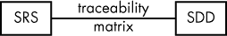

*图 11-1：SRS 与 SDD 的关系*

#### *11.2.1 设计问题和设计利益相关者*

SRS 中的每个需求最终都与 SDD 中的设计问题相关（参见图 11-2）。*设计问题*是指对系统设计中的任何利益相关者而言有意义的内容。*利益相关者*是指在系统设计中有发言权的任何人。*需求*是指 SRS 中的任何单独需求，详见第十章。

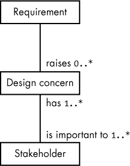

*图 11-2：需求映射到设计问题*

图 11-2 将需求映射到设计问题，具体如下：

**`0..*`** 每个需求有零个或多个相关的设计问题。

**`1..*`** 单一设计问题对一个或多个设计利益相关者来说是重要的。

**`1...*`** 每个利益相关者至少有一个（并可能有多个）设计问题。

IEEE 概念模型指出，需求会引发零个或多个设计关注点。但实际上，需求和设计关注点应该具有一对一关系：每个设计关注点都有一个相关的需求。如果一个需求没有引发任何设计关注点——也就是说，需求对软件设计没有影响——那么这个需求可能不是必要的（因此，也就不是有效的需求）。如果一个需求映射到多个设计关注点，这通常意味着你有一个复合需求，应该将其拆解为原子需求，在你的 SRS 中进行处理（见 “原子” 在 第 190 页）。

利益相关者和设计关注点应该具有多对多关系。一个利益相关者可以（通常会）有多个设计关注点。同样，一个设计关注点也可以（通常会）由多个不同的利益相关者共享。

#### *11.2.2 设计视角和设计元素*

最终，设计关注点（或仅需求）是 SDD 的接口点。一个 *设计视角* 逻辑上将一个或多个设计关注点分组在一起。例如，*逻辑视角*（参见 “逻辑视角” 在 第 235 页）描述设计中的静态数据结构，因此所有与类和数据对象相关的需求都将与该视角相关联。*算法视角*（参见 “算法视角” 在 第 239 页）描述设计中使用的某些算法，因此任何指定使用某些算法的需求（这应该是少数情况）将与该视角相关联。

IEEE Std 1016-2009 要求通过以下方式指定每个设计视角：

+   视角名称

+   与视角相关的设计关注点

+   视角使用的设计元素（设计实体类型、属性和约束）列表

+   讨论基于视角构建设计视图时所使用的分析方法

+   解释和评估设计的标准

+   作者姓名或用于该视角的参考资料

图 11-3 显示了设计关注点和设计视角之间的关系。多重性项 `1..*` 表示一个视角框定（或分组）一个或多个需求。

*图 11-3：将设计关注点映射到设计视角*

设计关注点和设计视角之间具有根本的多对一关系，这提供了 SDD 和 SRS 之间的可追溯性。在 RTM 中，每个需求（设计关注点）将链接到一个设计视角。因此，通常你会将 SDD 标签附加到设计视角上（或者，正如你稍后会看到的，你也可以将标签附加到设计视图上，因为设计视图和设计视角之间有一对一关系）。

设计视角定义了一组*设计元素*（见图 11-4），其中的示例包括类图、时序图、状态图、包、用例和活动图。

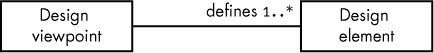

*图 11-4：设计视角与设计元素的映射*

设计元素是指你在设计视图中放置的任何东西，包括设计实体、属性、关系和约束：

+   设计*实体*是描述设计主要组件的对象。示例包括系统、子系统、库、框架、模式、模板、组件、类、结构、类型、数据存储、模块、程序单元、程序、线程和进程。IEEE Std 1016-2009 要求每个设计实体在 SDD 中必须具有名称和目的。

+   设计元素有相关的*属性*：名称、类型、目的和作者。在你的 SDD 视角中列出设计元素时，必须提供这些属性。

+   设计*关系*有一个关联的名称和类型。IEEE Std 1016-2009 并没有预定义任何关系；然而，UML 2.0 定义了几种关系——如关联、聚合、依赖和泛化——你通常会在你的 SDD 中使用这些关系。根据 IEEE 的要求，你必须在设计视角规范中描述你所使用的所有关系。

+   设计*约束*是一个元素（*源*元素），它对设计视图中的另一个设计元素（*目标*元素）施加限制或规则。IEEE 要求你在定义它们的视角中列出所有设计约束的名称和类型（以及源/目标元素）。

你使用正式设计语言定义设计元素（见图 11-5）。如前所述，IEEE Std 1016-2009 尝试保持语言中立，但实际上它是专门围绕 UML 设计的。IEEE 建议的其他（正式的）设计语言包括 IDEFO、IDEF1X 和维也纳定义方法。然而，对于本书来说，你可能最好使用 UML。

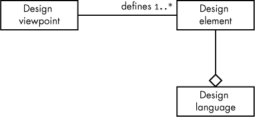

*图 11-5：设计视角、元素和语言之间的关系*

IEEE Std 1016-2009 定义了一组常见的设计视角。由于该标准是一组推荐的实践，而非绝对要求，以下列出的视角既不全面也不是必需的。也就是说，在你的 SDD 中，你可以根据需要定义并添加更多的视角，而且不需要包括所有视角（实际上，其中一些视角已经被废弃，仅为与旧版 IEEE Std 1016-1998 兼容而包含）。

##### 11.2.2.1 上下文视角

上下文视角收集需求的设计元素包括参与者（用户、外部系统、利益相关者）、系统提供的服务以及它们的交互（如输入和输出）。上下文视角还管理各种设计约束，如服务质量、可靠性和性能。从某种意义上讲，你在制定 SRS 需求时就开始了这项工作（例如，在创建用例来推动需求时），并在开发 SDD 时完成这项工作。

上下文视角的主要目的是设定系统边界，并定义系统内外的考虑因素。这限制了设计的范围，使得设计师和 SDD 的编写者可以集中精力于系统设计，而不会浪费时间考虑外部因素。

你通常会在 UML 用例图中表示上下文视角（见“用例”，第 214 页）。一个很好的例子是回到图 10-1，该图列出了用户通过数据采集（DAQ）系统的 DIP 开关可以设置的初始化。另一个例子是图 11-6，它展示了主机系统（通常是 PC）与 DAQ CPU 接口板之间的 DAQ 命令的简化用例集。

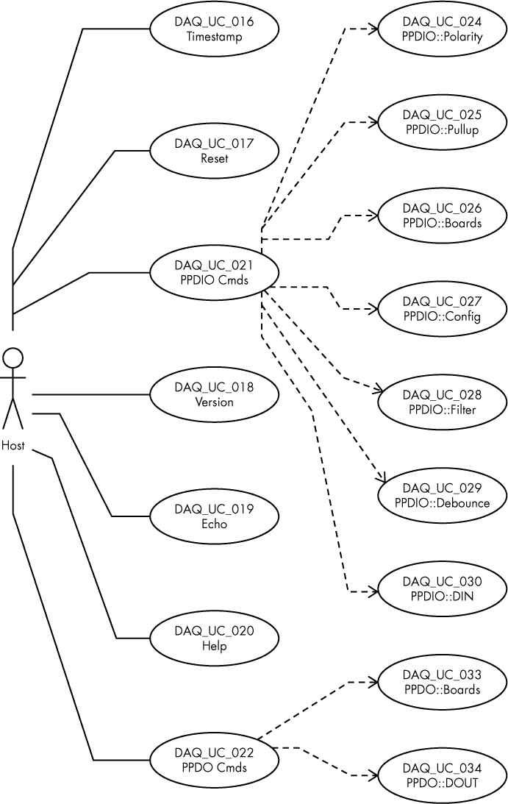

*图 11-6：DAQ 命令用例*

该图展示了外部系统（主机角色）与 DAQ 系统之间的命令接口。请注意，每个用例——在这个例子中有 16 个——对应着 DAQ SRS 中的需求。^(2)

##### 11.2.2.2 组成视角

组成视角列出了构成系统的主要模块/组件。此视角的主要目标之一是通过在设计中识别那些可以来自现有库或可以在系统中重用的专有设计项目，促进代码重用。

组成视角中的设计实体包括——举几个例子——组成（显然是）、包含、使用和泛化。组成视角通过实现、依赖、聚合、组成和泛化来描述设计实体之间的关系，以及对象之间的任何其他关系。

请注意，这是一种较旧的视角，源自 IEEE 标准 1016-1998。^(3) 大多数情况下，它已被结构视角所取代（见“结构视角”，第 237 页），其次是逻辑视角（见下一节）。组成视角来源于程序主要由过程和函数组成的时代，那时程序库已经组织起来，而这远早于面向对象分析与设计的出现。

现代设计如果包含组成视角，通常将其用来描述系统的主要组件，正如 IEEE Std 1016-2009 所推荐的那样。图 11-7 提供了一个关于 DAQ 系统的组成视角示例，使用简化的组件图。在我看来，组件图并不适合组成视角图——它们过于低级，无法完成此任务。组件图通常包含接口（必需的和提供的），这些接口在组成视角级别上没有意义。然而，显然由于 *组成* 和 *组件* 这两个词的相似性，使用简化的 UML 组件图来表示组成视角非常常见。

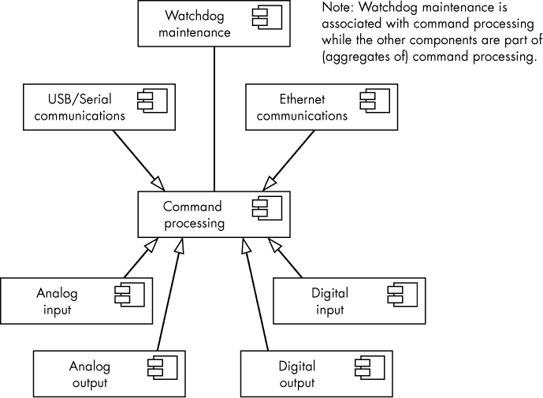

*图 11-7：组成视角图*

一些工程师使用组件图和部署图的组合（请参见 “部署图” 在 第 159 页）来说明组成视角，如 图 11-8 所示。

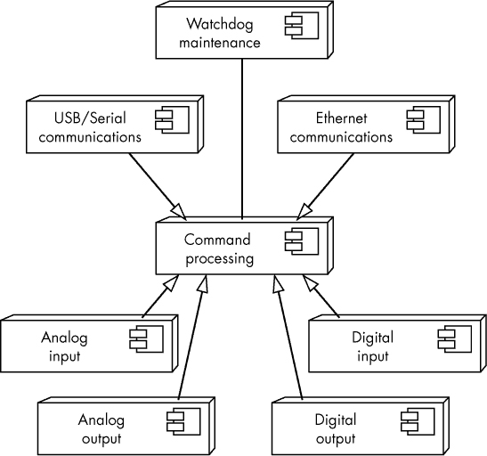

*图 11-8：部署/组件图*

请注意，这个图中的节点仍然包括组件符号，表明它们是构成更大系统的组件，而非硬件项。这是 UML 的非标准图示方法，但我在几个示例 SDD 中见过，所以我在这里也包括了它。

##### 11.2.2.3 逻辑视角

逻辑视角描述了设计中使用的预先存在的和新类型，以及它们的类、接口/协议和结构定义。逻辑视角还描述了设计中使用的对象（类型的实例）。

逻辑视角处理类、接口、数据类型、对象、属性、方法、函数、过程（子程序）、模板、宏和命名空间。它还为这些设计实体分配属性——如名称、可见性类型和数值——并附加适当的约束。

通常，您使用 UML 类图来实现逻辑视角。图 11-9 显示了一个 `adcClass_t` 类的类图，该类可能适用于 图 11-8 中的模拟输入模块。除了这个基本的类图外，您可能还想包括一个 *数据字典*，或者描述此类所有属性目的的文本。

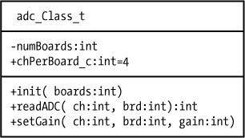

*图 11-9：adc 类图*

除了基本的类图外，逻辑视角还应包括类之间的关系（如依赖、关联、聚合、组合和继承）。有关这些类关系以及如何将其图示化的更多细节，请参见 “UML 类关系” 在 第 114 页。

##### 11.2.2.4 依赖视角

与组合视角类似，依赖视角是为了与 IEEE Std 1016-1998 兼容而保留下来的已弃用视角；在现代设计中，您通常不会使用此视角，因为其他选项（如逻辑视角和资源视角）可以更合乎逻辑地映射依赖关系。然而，您在适当的情况下使用依赖视角并不受限制，而且很可能会在 SDD 中遇到它们，因此您应该了解它们。

在 SDD 中，依赖视角展示了设计实体之间的关系和互联，包括共享信息、接口参数化和执行顺序，使用如*使用*、*提供*和*要求*等术语。依赖视角适用于子系统、组件、模块和资源。IEEE Std 1016-2009 建议使用 UML 组件图和包图来描述这一视角。如果您想采用组件图来展示组件或子系统之间的依赖关系（如 图 11-8 所示），使用组合部署/组件图可能是一个不错的选择。如果您描述的是包之间的依赖关系，使用包图则是个好主意，如图 11-10 所示。

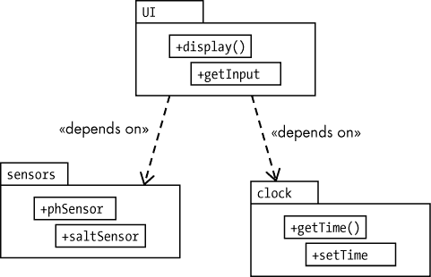

*图 11-10：包依赖关系*

##### 11.2.2.5 信息/数据库视角

信息/数据库视角描述了设计中持久数据的使用。它类似于逻辑视角，因为您使用类图来展示数据结构、内容和元数据定义。信息视角还会描述数据访问方案、数据管理策略和数据存储机制。

这是一个已弃用的项，包含在内以保持与 IEEE Std 1016-1998 的兼容性。在现代设计中，您可能会使用逻辑视角或可能的资源视角来代替它。

##### 11.2.2.6 模式使用视角

模式使用视角描绘了项目中使用的设计模式——以及从中实现的可重用组件。有关设计模式的更多信息，请参见更多信息，详见第 260 页。

模式使用视角图采用了 UML 复合结构、类图和包图的组合，同时结合关联、协作使用和连接器来指示从模式中生成的对象。这个视角设计较为宽松，因此如果您选择在 SDD 中使用它，您在创建时将拥有很大的自由度。

##### 11.2.2.7 接口视角

接口视角描述了设计所提供的服务（例如，API）。具体来说，它包括对在 SRS 中没有要求的接口的描述，包括与第三方库、项目的其他部分或同一组织内其他项目的接口。这是其他程序员在与接口视角覆盖的设计部分交互时可以使用的路线图。

IEEE Std 1016-2009 推荐使用 UML 组件图来表示接口视角。图 11-11 展示了两个组件（可能在 DAQ 系统中），它们处理数字 I/O 和继电器输出（数字输出的一种特定形式）。

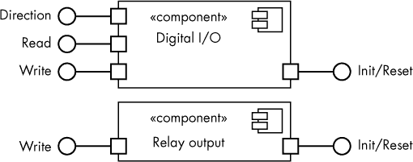

*图 11-11：接口视角示例*

除了组件图外，接口视角还应包括关于系统如何与这些接口交互的描述，包括数据类型、函数调用、延迟、输入的限制、输出的范围以及其他重要问题。例如，在讨论 `Direction` 接口时，你可能会包括如下信息：

**Direction**

`Direction(ddir:`int`, port:`int`)`

调用 `Direction` 会将指定的数字 I/O 端口（`port` = `0..95`）设置为输入端口（如果 `ddir` = `0`）或输出端口（如果 `ddir` = `1`）。

对于 `Read`，你可以使用如下描述：

**Read**

`Read(port:`int`):`int

调用 `Read` 会返回指定数字输入端口（`port` = `0..95`）的当前值（`0` 或 `1`）。

同样，接口视角在 IEEE Std 1016-2009 中仅作为与旧版 IEEE Std 1016-1998 的兼容性存在。在现代的 SDD 中，考虑将接口项放置在上下文视角和结构视角中。

##### 11.2.2.8 结构视角

结构视角描述了设计中对象的内部组织和构造。它是组成视角的现代版本，后者描述了设计是如何（递归地）分解成各个部分的。你可以使用结构视角将较大的对象拆解为更小的组件，目的是确定如何在设计中重用这些较小的组件。

结构视角通常使用的图示方法包括 UML 复合结构图、UML 包图和 UML 类图。这些图示在 图 11-12、图 11-13 和 图 11-14 中分别展示了游泳池监控器（SPM）的示例。

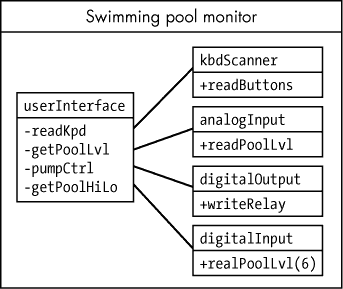

*图 11-12：SPM 复合结构图*

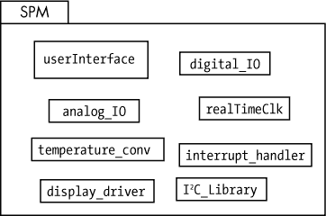

*图 11-13：SPM 包图*

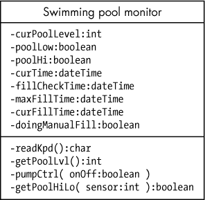

*图 11-14：SPM 类图*

这些示例说明，通常你会在一个给定的视角中拥有多个图示。同时注意，典型的结构视角将拥有多个复合结构图，（可能）多个包图，以及（肯定）多个类图。

##### 11.2.2.9 交互视角

交互视角是定义软件中发生活动的主要地方。在这里，你会放置大多数交互图—活动图、时序图、协作图等—可能唯一的例外是状态图，因为它们通常出现在状态动态视角中（将在下一部分讨论）。除了交互图外，你还可能在交互视角中使用复合结构图和包图。

交互视角的完整示例出现在《一个样本 SDD》的第 247 页。

##### 11.2.2.10 状态动态视角

状态动态视角描述软件系统的内部操作状态。对于这个视角，通常使用 UML 状态图（参见“状态图”在第 163 页）。

##### 11.2.2.11 算法视角

算法视角是从 IEEE 1016-1998 中延续下来的另一个旧视角。它的目的是描述系统中使用的算法（通常通过流程图、Warnier/Orr 图、伪代码等形式）。这个视角在 Std 1016-2009 文档中基本上被交互视角所替代。

##### 11.2.2.12 资源视角

资源视角描述设计如何使用各种系统资源。这包括 CPU 使用（包括多核使用）、内存使用、存储、外设使用、共享库以及与设计相关的其他安全、性能和成本问题。通常，资源是外部于设计的实体。

这是另一个为兼容性原因包含在 Std 1016-2009 中的 Std 1016-1998 项目。在新的设计中，通常使用上下文视角来描述资源使用情况。

#### *11.2.3 设计视图、叠加层与推理*

IEEE Std 1016-2009 规定，SDD 被组织成一个或多个设计视图。因此，设计视图是 SDD 中的基本组织单元。设计视图提供（可能）多个系统设计的视角，帮助相关方、设计师和程序员澄清设计如何满足与关联设计视角指定的需求。

当 SDD 完整时，它会覆盖每个需求（设计关注点），并且在至少一个设计视图中有体现，涵盖所有相关设计视角中的实体和关系，并且符合所有设计约束。通俗来说，这意味着你已经将所有需求与适当的图示和文本讨论对齐，如第 229 页的《设计视角与设计元素》部分所述。

如果设计视图中的任何元素之间没有冲突，那么一个 SDD 就是*一致*的。例如，如果类图表明一个名为`hasValue`的属性是布尔型，但活动图将该字段视为字符串，那么就存在不一致。

##### 11.2.3.1 设计视图与设计视点的区别

设计视图和设计视点之间存在一一对应的关系，如图 11-15 所示。关联链接表明，设计视图恰好符合一个设计视点，而设计视点恰好由一个设计视图所控制。

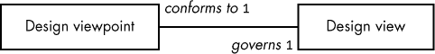

*图 11-15：设计视图和设计视点*

那么，设计视图和设计视点之间有什么区别呢？*设计视图*是你通常认为是“设计”的实际信息（图形和文本）。设计视点是你创建设计时所采用的*视角*。在 IEEE 的建议中，设计视点可能是类似于上下文视点或交互视点的内容。这些并非实际的设计视图，而是用于展示视图的格式。就 SDD 的组织而言，目录中的视图/视点部分可能会像以下这样组织：^(4)

1 视点 #1

1.1 视点 #1 规格（见“设计视点与设计元素”第 229 页）

1.2 视图 #1

2 视点 #2

2.1 视点 #2 规格

2.2 视图 #2

3 视点 #3

3.1 视点 #3 规格

3.2 视图 #3

4 等等

按照视点组织视图的原因很简单：视点代表了不同利益相关者的观点，因此这种组织方式可以让利益相关者快速找到 SDD 中与他们相关的部分，而无需阅读全文。

请注意，本大纲中的每个视图不一定对应一个单一的图示或文本描述。一个视图可能由多个独立的 UML 图和中间的文本描述组成。例如，在逻辑视点下，你可能会有多个不同的类图（不仅仅是一个），如果没有其他原因，仅仅因为将多个类合并到一个图中是困难的。即使你能做到，也可能希望逻辑地组织类图，使其更容易阅读。此外，除了类图本身，你还需要提供一些描述这些类成员（属性）的文本。与其先展示一个庞大的类图（可能需要几十页），然后紧跟着非常长的文本描述（又可能占据额外几十页），不如将几个类图放在同一张图中，紧随其后是关于属性的文本信息，然后对剩余需要记录的类执行同样的操作。

##### 11.2.3.2 设计叠加层

设计覆盖层是视角的“逃生条款”。设计视角符合设计覆盖层，或者相反，设计覆盖层支配设计视角，如图 11-16 所示。因此，如果你已经创建了一个逻辑视角，并且希望在该视角中加入一些交互图示以便更好地说明，你会使用设计覆盖层。

设计覆盖层修改视角/视点的组织方式如下：

视角 #1

1.1 视点 #1 规格

1.2 视角 #1

1.3 覆盖层 #1

1.4 覆盖层 #2

1.5 等等

2 等等

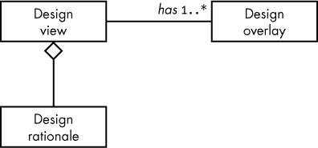

*图 11-16：设计视角/覆盖层/理由关系*

设计覆盖层必须被标识为设计覆盖层（以避免与关联视点混淆），并且必须具有唯一的名称，并且仅与一个视点相关联。

设计覆盖层的一个好处是，它可以让你混合搭配设计语言，或在现有设计语言不足以满足需求时进行扩展。设计覆盖层还允许你扩展现有的视角，而不必创建一个全新的视点（这可能需要大量额外工作）。

##### 11.2.3.3 设计理由

设计理由解释了设计背后的目的，并向其他查看者证明设计的合理性。通常，设计理由由设计过程中的评论和注释组成。它可能涉及（但肯定不限于）关于设计的潜在问题、在设计过程中考虑的不同选项和权衡、为什么做出某些决策的论证与理由，甚至是原型或开发阶段进行的变更（因为原始设计未能实现）。图 11-16 显示了设计理由与设计视角之间的关系（聚合符号表示设计理由评论被包含在设计视角中，或是设计视角的一部分）。

#### *11.2.4 IEEE Std 1016-2009 概念模型*

图 11-17 和图 11-18 根据 IEEE Std 1016-2009 提供了 SDD 和设计元素的概念模型图。^(5)

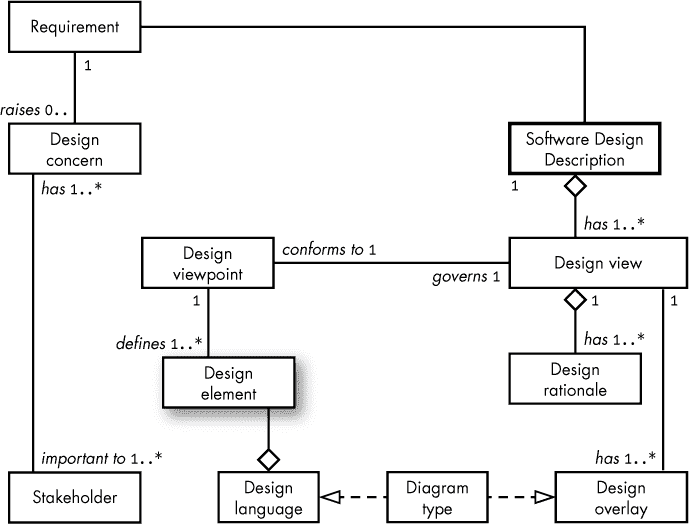

*图 11-17：SDD 概念模型*

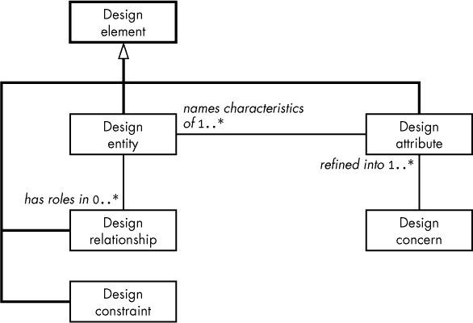

*图 11-18：SDD 设计元素概念模型*

### 11.3 SDD 必需内容

一个 SDD 必须包含以下内容（根据 IEEE Std 1016-2009）：

+   一个 SDD 标识

+   设计利益相关者列表

+   设计关注点（从产品需求中发展而来）

+   一组一个或多个设计视点（请注意，每个设计视角在 SDD 中都有一个对应的设计视点）

+   一组一个或多个设计视角（大致对应不同类型的 UML 图表，尽管设计视角不一定与特定的 UML 图表类型绑定）

+   所有必要的设计覆盖层

+   任何必要的设计理由（IEEE 要求至少提供目的）

#### *11.3.1 SDD 标识*

至少，SDD 应包括以下识别信息（不一定按照此顺序）：

+   创建日期/发行日期

+   当前状态

+   目的/范围

+   发行组织

+   作者（包括版权信息）

+   参考文献

+   上下文

+   用于设计视角的设计语言描述

+   正文

+   摘要

+   词汇表

+   变更历史

大部分信息是模板内容（除了日期外，您通常从组织的通用 SDD 模板中复制这些信息）。显然，某些信息会随着不同的 SDD 而发生变化（如日期、作者和变更历史），但大多数情况下，SDD 标识中几乎不涉及多少知识性活动。它的存在主要是为了使 SDD 成为一个独立的文档。

#### *11.3.2 设计利益相关者及其设计关注点*

SDD 必须列出所有为项目贡献需求/设计关注点的人员。这些内容至关重要：如果关于设计合理性的问题在 SDD 中未得到解决，读者应能够确定联系哪位利益相关者，以便了解设计关注点。

#### *11.3.3 设计视图、视角、叠加层和合理性*

设计视图、视角、叠加层和合理性构成了 SDD 的主体部分。

### 11.4 SDD 的可追溯性与标签

我们尚未讨论如何通过 RTM 将 SDD 中的设计元素追溯到 SRS 和其他系统文档（参见“可追溯性”在第 171 页）。如第九章所述，您可以使用*标签*来追踪文档中设计元素的来源。对于 SDD，您使用的标签形式是*proj*_SDD_*xxx*，其中*proj*是某个项目特定的名称或助记符，而*xxx*是一个数字（可能是十进制）值（参见“SDD 标签”在第 176 页）。然后，您所需要做的就是确保 SDD 标签唯一（通常通过验证*xxx*在所有 SDD 标签中是唯一的）并定义 SDD 标签的准确位置。

从技术上讲，SRS 中的需求直接映射到设计关注点（通常是一对一关系），这可能会让你认为应该将 SDD 标签附加到设计关注点上。然而，由于设计视图构成了 SDD 的主体部分，并且设计关注点是通过设计视角与之建立多对一的映射关系（设计视角与设计视图之间是一对一的关系），因此最好将 SDD 标签附加到设计视图或视角上。如果需求与设计元素的映射是多对一或一对多（尤其是避免多对多），那么在创建 RTM 时会更为轻松。

在实践中，给定的设计视角可以分解为多个图像或描述。如果你小心只将设计问题连接到这些图像或描述中的一个，你可以将 SDD 标签分配给设计视角的单个组件。但是，进行此操作时必须小心，因为如果一个设计问题映射到设计视角中的多个组件，你可能会遇到多对多关系。^(6)

### 11.5 一个建议的 SDD 大纲

IEEE Std 1016-2009, 附录 C 提供了一个建议的大纲，用于组织和格式化符合所需内容的 SDD（见 “SDD 所需内容” 第 244 页）。请注意，这个大纲绝不是强制性的；你可以根据自己的需要组织 SDD，只要它包含这些必需的内容，它仍然是有效的。以下是 IEEE 建议的一个略微修改的变体：^(7)

1 前言

1.1 目录

1.2 发布日期和状态

1.3 发布组织

1.4 作者

1.5 变更历史

2 介绍

2.1 目的

2.2 范围

2.3 目标受众

2.4 上下文

2.5 概览/总结

3 定义、缩略语和缩写

4 参考文献

5 词汇表

6 正文

6.1 确定的利益相关者和设计问题

6.2 设计视角 1

6.2.1 设计视图 1

6.2.2 （可选）设计叠加 1

6.2.3 （可选）设计合理性 1

6.3 设计视角 2

6.3.1 设计视图 2

6.3.2 （可选）设计叠加 2

6.3.3 （可选）设计合理性 2

6.4 设计视角 *n*

6.4.1 设计视图 *n*

6.4.2 （可选）设计叠加 *n*

6.4.3 （可选）设计合理性 *n*

7 （可选）索引

### 11.6 一个示例 SDD

本节展示了一个完整的（为了编辑简化而高度简化的）SDD 示例。这个 SDD 描述了前一章节中出现的示例用例和需求文档的设计（见 “用例” 第 214 页）。具体来说，这个 SDD 涵盖了 Plantation Productions 数字数据采集和控制（DAQ）系统组件的设计，这些组件在系统初始化时处理 DIP 开关。

**1 Plantation Productions DAQ DIP 开关控制**

**1.1 目录**

[因编辑原因省略]

**1.2 发布日期和状态**

初次创建于 2018 年 3 月 18 日

当前状态：完成

**1.3 发布组织**

Plantation Productions, Inc.

**1.4 作者**

Randall L. Hyde

版权 2019, Plantation Productions, Inc.

**1.5 变更历史**

2019 年 3 月 18 日：初版 SDD 创建。

**2 介绍**

**2.1 目的**

Plantation Productions, Inc. 的 DAQ 系统是一个数字数据采集和控制系统，旨在为工业和科学系统提供模拟和数字 I/O。

本软件设计说明书（SDD）描述了 DAQ 系统中 DIP 开关初始化组件的设计。其目的是让开发人员能够根据软件需求规格（SRS）实现 DIP 开关控制功能，并利用本文件实现该目的。

**2.2 范围**

本文档仅描述 DAQ 系统中的 DIP 开关设计（由于空间/编辑原因）。完整的 SDD 请参见*[`www.plantation-productions.com/Electronics/DAQ/DAQ.html`](http://www.plantation-productions.com/Electronics/DAQ/DAQ.html)*。

**2.3 预期受众**

预期的 SDD 受众*期望*：

本文档适用于将实现此设计的软件开发人员、希望在实施前审查设计的设计利益相关者，以及软件测试用例（STC）和软件测试程序（STD）文档的编写者。

*本*SDD 的真实预期受众：

本文档旨在为《写出伟大的代码，第 3 卷》的读者提供一个示例 SDD。

**2.4 上下文**

Plantation Productions 的 DAQ 系统满足了对一个文档齐全的数字数据采集与控制系统的需求，工程师可以将其设计到安全关键系统中，如核研究反应堆。虽然有许多现成的商业系统（COTS）可以使用，但它们存在几个主要缺点：通常是专有的（购买后难以修改或维修），通常在 5 到 10 年内就会过时，且没有办法维修或更换，而且很少有完整的支持文档（例如，SRS、SDD、STC 和 STP），工程师无法使用这些文档来验证和确认系统。

DAQ 系统通过提供一套开放硬件和开源设计以及完整的设计文档来克服这一问题，这些设计已经过安全系统的验证和确认。

虽然最初为核研究反应堆设计，但 DAQ 系统在任何需要基于以太网的控制系统的场合都非常有用，支持数字（TTL 级）I/O、光隔离数字输入、机械或固态继电器数字输出（隔离并调理）、模拟输入（例如，±10v 和 4–20mA）以及（调理过的）模拟输出（±10v）。

**2.5 概述/总结**

本文档的其余部分按如下方式组织。

第三部分介绍了软件设计，包括：

第 3.1 节：利益相关者与设计关注点

第 3.2 节：上下文视角与整体架构

第 3.3 节：逻辑视角与数据字典

第 3.4 节：交互视角与控制流程

第四部分提供了索引。^(8)

**3 定义、缩略语和简称**

| **术语** | **定义** |
| --- | --- |
| DAQ | 数据采集系统 |
| SBC | 单板计算机 |
| 软件设计说明书（SDD） | 软件系统设计文档（IEEE Std 1016-2009）——即本文档。 |
| 软件需求规格说明书（SRS） | 记录软件及其外部接口的基本需求（功能、性能、设计约束和属性）（IEEE 标准 610.12-1990）。 |
| 系统需求规格说明书（SyRS） | 一个结构化的信息集合，体现了系统的需求（IEEE 标准 1233-1998）。一个文档，记录了建立设计依据和系统或子系统概念设计的要求。 |

**4 参考文献**

| **参考** | **讨论** |
| --- | --- |
| IEEE 标准 830-1998 | SRS 文档标准 |
| IEEE 标准 829-2008 | STP 文档标准 |
| IEEE 标准 1012-1998 | 软件验证和确认标准 |
| IEEE 标准 1016-2009 | SDD 文档标准 |
| IEEE 标准 1233-1998 | SyRS 文档标准 |

**5 术语表**

DIP：双列直插封装

**6 软件设计**

**6.1 利益相关者和设计关注点**

DAQ DIP 开关设计的利益相关者是 Plantation Productions, Inc. 和 Randall Hyde。主要的设计关注点是创建一个简化的 SDD，能够符合《*写出伟大的代码，第 3 卷*》的编辑约束，同时仍能提供一个合理的 SDD 示例。其余的设计问题是 SRS 中描述的 DAQ DIP 开关系统的所有需求（请参阅 第 219 页的“(选定的) DAQ 软件需求（来自 SRS）”）。

**6.2 上下文视角与整体架构**

DAQ 上下文视角展示了用户和系统之间存在的功能。

名称/标签：DAQ_SDD_001

作者：Randall Hyde

设计元素：此视角采用用例、参与者（主机 PC 和终端用户）、节点、组件和包来描述系统接口。

需求/设计关注点：^(9)

DAQ_SRS_700_000

DAQ_SRS_701_000

DAQ_SRS_704_000

DAQ_SRS_707_000

DAQ_SRS_723_000.1

**6.2.1 上下文视图^(10)**

DAQ 系统固件运行在连接到 DAQ_IF（DAQ 接口）板的 Netburner MOD54415 SBC 上。终端用户可以设置 DIP 开关来初始化 DAQ 与主机 PC 的接口方式。主机 PC 可以通过 RS-232 串口、USB 或以太网连接与 DAQ 系统通信（请参阅 图 11-19）。此设计预期使用现有的库例程，如 `maintPrintf`、`serialTaskInit`、`usbTaskInit`、`ethernetTaskInit` 和 `readDIPSwitches`。

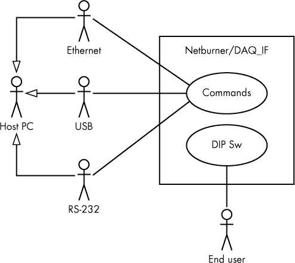

*图 11-19：示例上下文视图*

**6.2.2 组件/部署叠加视图**

以下设计叠加视图通过结合部署/组件图提供了对上下文视图的不同视角。图 11-20 展示了系统的物理组件^(11)及其相互连接。

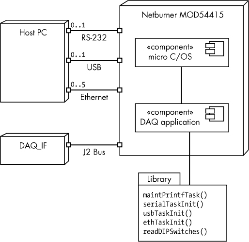

*图 11-20：示例设计叠加图*

**6.2.3 （可选）设计原理**

这个视角的目的是展示用户如何控制主机 PC 与 DAQ 系统的通信方式。

**6.3 逻辑视角和数据字典**

名称/标签：DAQ_SDD_002

作者：Randall Hyde

设计元素使用：该视角使用单一的类图来描述此应用程序的数据存储。

**注意**

*在实际应用中，可能更好使用全局变量来保存 DIP 开关设置，而不是实际的类。*

要求/设计考虑：

DAQ_SRS_723_000.2

**6.3.1 DIP 开关变量**

DAQ（DIP 开关）应用程序的数据存储需求非常简单。一个由 图 11-21 中的 12 个全局变量组成的集合（该 SDD 将其归类为 *globals*）就是实际需要的全部。

| **名称** | **描述** |
| --- | --- |
| `dipsw_g` | 包含 DIP 开关值的 8 位数组（在一个字节中） |
| `serialEnable_g` | 如果启用 RS-232 通信，则为 `true` |
| `USBEnabled_g` | 如果启用 USB 通信，则为 `true` |
| `ethEnabled_g` | 如果启用以太网通信，则为 `true` |
| `ethMultClients_g` | 如果为 `false`，则只允许单一的以太网客户端；如果为 `true`，则允许五个客户端 |
| `ethernetDipSw_g` | 在位 0 中保存 `dipsw_g[5]`，在位 1 中保存 `dipsw_g[6]`（`0..3`） |
| `unitTestMode_g` | 如果处于单元测试模式，则为 `true` |
| `debugMode_g` | 如果 `maintPrintf()` 函数将输出发送到 COM1:，则为 `true`；如果 `maintPrintf()` 被禁用，则为 `false` |
| `ethernetAdrs_g` | 保存 IP 地址（192.168.2.70–192.168.2.73） |
| `maxSockets_g` | 根据 `ethEnabled_g` 和 `ethMultClients_g` 的值为 `0`、`1` 或 `5` |
| `slots_g` | 保存最多五个活动以太网套接字的文件描述符 |
| `slot_g` | 用于索引 `slots_g` |
| `maintPrintfTask()` | 外部函数，启动 `maintPrintf()` 任务（用于处理调试输出） |
| `serialTaskInit()` | 外部函数，启动 RS-232 命令接收任务 |
| `usbTaskInit()` | 外部函数，启动 USB 命令接收任务 |
| `ethTaskInit()` | 外部函数，启动以太网命令接收任务（最多可以同时运行五个此类线程） |

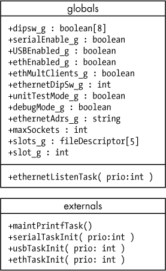

*图 11-21：DAQ 全局实体*

**6.3.2 设计叠加**

[无]

**6.3.3 设计理由**

这个逻辑视角使用类图而非一组全局变量，纯粹是因为典型的 `read` `dipswitches` 函数对于 Netburner 来说是将所有 8 个读取值作为一个 8 位字节返回（即，作为位数组）。因此，将所有 8 个值视为类的字段是有意义的，因为这些属性通常是通过掩码计算得出的，即通过屏蔽特定的位来计算。

**6.4 交互视角和控制流程**

名称/标签：DAQ_SDD_003

作者：Randall Hyde

设计元素使用：该视角使用了几个活动图来展示程序中的控制流程（及值计算）。

要求/设计考虑：

DAQ_SRS_702_000

DAQ_SRS_702_001

DAQ_SRS_702_002

DAQ_SRS_703_000

DAQ_SRS_703_001

DAQ_SRS_705_000

DAQ_SRS_705_001

DAQ_SRS_705_002

DAQ_SRS_706_000

DAQ_SRS_706_001

DAQ_SRS_708_000

DAQ_SRS_709_000

DAQ_SRS_710_000

DAQ_SRS_711_000

DAQ_SRS_712_000

DAQ_SRS_716_000

DAQ_SRS_716_001

DAQ_SRS_716_002

DAQ_SRS_716.5_000

DAQ_SRS_717_000

DAQ_SRS_718_000

DAQ_SRS_718_001

DAQ_SRS_719_000

DAQ_SRS_720_000

DAQ_SRS_721_001

DAQ_SRS_721_002

DAQ_SRS_723_000

DAQ_SRS_723_000

DAQ_SRS_723_000

DAQ_SRS_723_000.2

DAQ_SRS_726_000

DAQ_SRS_727_000

DAQ_SRS_728_000

DAQ_SRS_737_000

DAQ_SRS_738_000

DAQ_SRS_738_001

DAQ_SRS_738_002

**6.4.1 设计视图**

交互视角的设计视图使用 UML 活动图（流程图）来展示应用程序中的控制流。参见 图 11-22，11-23，和 11-24。

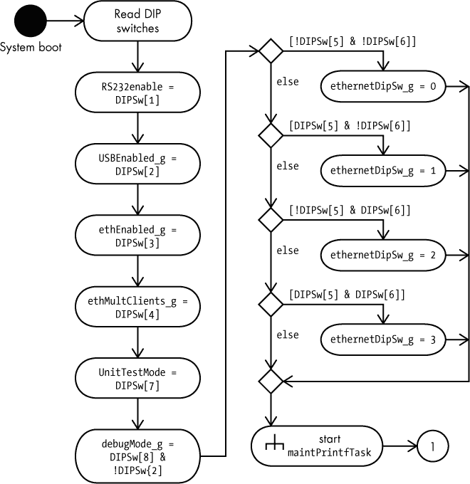

*图 11-22：活动图：读取 DIP 开关*

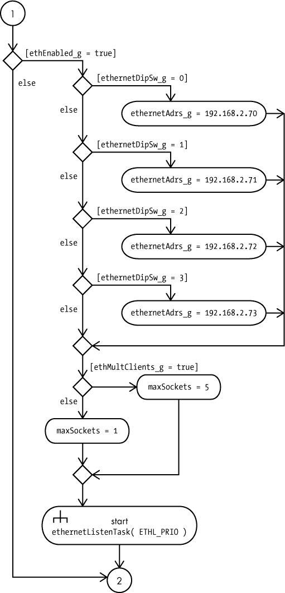

*图 11-23：活动图续篇 #1*

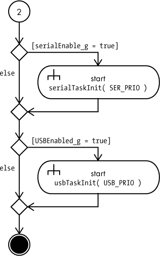

*图 11-24：活动图续篇 #2*

`serialTaskInit()` 和 `usbTaskInit()` 函数是外部库代码，这些函数启动了一个任务，`ethernetListenTask`，来处理 RS-232 和 USB 通信，如 图 11-25 所示。

`ethTaskInit()` 函数（由外部库提供）会一直运行，直到连接的主机终止以太网连接。届时，`ethernetListenTask` 任务将把相应插槽的条目设置为 `0` 并终止任务（线程）。如果监听连接中断，`ethernetListenTask` 将终止。

*图 11-25：活动图：ethernetListenTask*

**6.4.2 顺序图叠加**

图 11-26 中的顺序图展示了另一种查看 DAQ 应用程序线程初始化的方式。

**6.4.3 设计原理**

DAQ DIP 开关项目相对简单（故意设计成这样，以便 SDD 示例不至于过大而无法容纳在本书中）。因此，设计采用了传统的过程式/命令式编程模型（与面向对象设计相对）。

**7 索引**

[出于编辑原因省略]

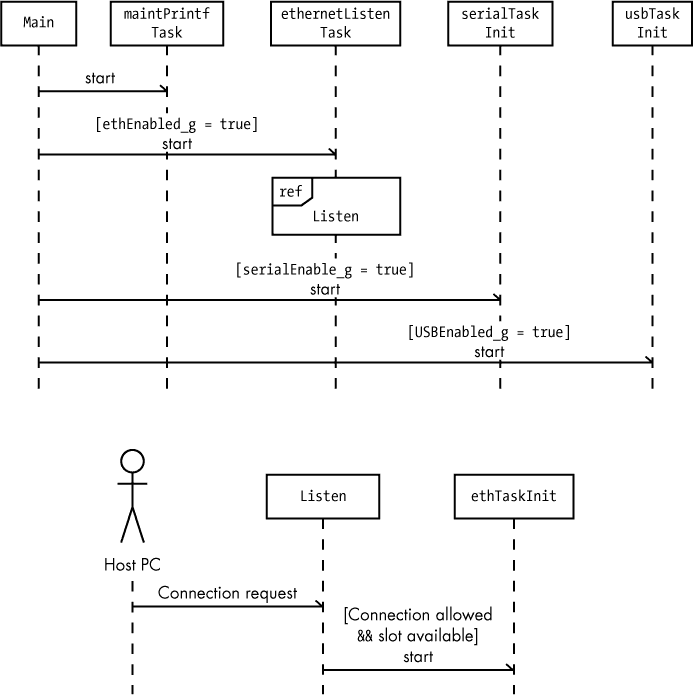

*图 11-26：顺序图：初始化任务*

### 11.7 使用设计信息更新可追溯性矩阵

SDD 在 RTM 中添加了一个单独的列：SDD 标签列。然而，SDD 标签并没有直接嵌入任何可追溯性信息，因此你需要从 SDD 中提取该信息，以确定在 RTM 中放置 SDD 标签的位置。

如在《设计视角与设计观点》一节中提到的，第 240 页，每个 SDS 中的观点必须包括设计关注点和需求信息。在本章中（参见《样本 SDS》，第 247 页），我强烈建议将所有 SRS 需求标签作为观点文档中的设计关注点列表。如果你已完成这一工作，那么你已经建立了从需求到设计的反向追踪。因此，在 RTM 中填写 SDS 标签就变得简单了：只需找到每个需求标签（列在当前观点中），然后将该观点的 SDS 标签复制到 RTM 中的 SDS 标签列中。当然，考虑到你可能会有多个需求与单个观点相关联，那么你也会在 RTM 中看到多个相同的 SDS 标签（每个相关需求一份）。

如果你想要将 SDS 标签追溯到 RTM 中的所有需求（而不查找 SDS 中的列表），只需按 SDS 标签列对 RTM 进行排序。这样，所有相关的需求（以及与该 SDS 标签关联的其他一切）就会聚集在矩阵中的一个连续组中，便于识别与该标签相关的所有内容。

如果你选择一种不涉及将 SRS 标签纳入观点中的其他方法来指定设计关注点，那么在 RTM 中确定 SDS 标签的位置就会变成一个手动（甚至繁琐）的过程。因此，我强烈建议在生成观点时使用 SRS 标签。因为无论如何你在生成观点时必须考虑所有需求，所以同时将这些信息收集到 SDS 中是有意义的。

### 11.8 创建软件设计

本章花费了大量时间讨论如何创建软件设计说明。在你所看到的例子中，可能会让你觉得这些设计似乎凭空产生。那么这些设计是从哪里来的呢？如果你正在创建一个新系统的设计，你是如何最初构思这个设计的呢？这个问题将在本系列的下一卷《写出伟大的代码，第 4 卷：设计伟大的代码》中讨论。本章为那本书打下了基础。

### 11.9 更多信息

Freeman, Eric 和 Elizabeth Robson. *Head First Design Patterns: A Brain-Friendly Guide*. Sebastopol, CA: O'Reilly Media, 2004.

Gamma, Erich 等人. *Design Patterns: Elements of Reusable Object-Oriented Software*. Upper Saddle River, NJ: Addison-Wesley Professional, 1994.

IEEE. “IEEE Std 1016-2009: IEEE 标准——信息技术——系统设计——软件设计说明。”2009 年 7 月 20 日。[`ieeexplore.ieee.org/document/5167255/`](https://ieeexplore.ieee.org/document/5167255/)。 (它不便宜——大约 100 美元——而且措辞让只有律师才能理解，但这是 SDS 的黄金标准。)
