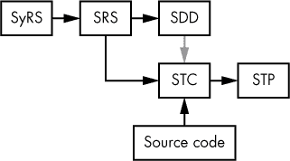
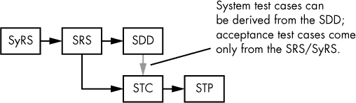

## 第十四章：软件测试文档**

本章讨论软件测试文档，主要关注软件测试用例（STC）和软件测试程序（STP）文档。如前几章所述，本讨论基于 IEEE 标准，特别是 IEEE 软件和系统测试文档标准（IEEE Std 829-2008，以下简称*Std 829*^(1))。

#### 12.1 标准 829 中的软件测试文档

标准 829 实际上描述了许多超出 STC 和 STP 的附加文档，包括：

+   主测试计划（MTP）

+   *级别* 测试计划（LTP）

+   *级别* 测试设计（LTD）

+   *级别* 测试用例（LTC）

+   *级别* 测试程序（LTPr）

+   *级别* 测试日志（LTL）

+   异常报告（AR）

+   *级别* 临时测试状态报告（LITSR）

+   *级别* 测试报告（LTR）

+   主测试报告（MTR）

请注意，这些并非实际的文档名称——*级别* 只是表示软件测试文档范围或程度的占位符。范围可能是在*组件* 或*组件集成*的层次上，适用于整个*系统*，或专注于*验收*。例如，*级别* 测试计划可能指代组件（或单元）测试计划、组件集成（或简单的集成）测试计划、系统（或系统集成）测试计划，或验收测试计划。

**注意**

*测试级别的详细解释请参见《软件开发测试级别》，见第 265 页。*

总的来说，标准 829 定义了 31 种不同的文档类型，但这些是主要的。大多数这些文档存在的目的是支持软件管理活动。因为这是一本关于个人软件工程的书，而不是软件项目管理书籍，所以本章不会详细讨论其中的大多数文档。相反，我们将重点讨论与实际软件测试相关的那些*级别* 测试文档——具体而言，*级别* 测试用例、*级别* 测试程序、*级别* 测试日志和异常报告文档类型。我们将涵盖所有四种*级别* 分类——组件、组件集成、系统和验收——尽管后两者是本章中主要使用的测试文档。这些*级别* 测试文档之间的差异相对较小，因此本章应用前面提到的总称：软件测试用例和软件测试程序。请记住，尽管这些是常见的软件工程术语，标准 829 仅涉及*级别* 测试文档。

#### *12.1.1 过程支持*

尽管本章集中在软件测试上，标准 829 描述了更为一般的测试过程。特别是，测试过程还涉及开发过程中每个文档步骤的验证和确认。具体来说，这意味着测试过程不仅测试实际的软件，还测试文档本身。

对于 SyRS 和 SRS，验证步骤确保需求真正满足客户需求（并且*仅*满足客户需求，不进行额外的无谓增加）。对于 SDD，验证步骤确保 SDD 涵盖所有需求。对于 STC，验证步骤确保每个需求都有一个或多个测试用例来测试该需求。对于 STP，验证步骤确保测试程序集合完全覆盖所有测试用例。

除了文档，Std 829 还讨论了验证采购（例如购买第三方库和计算硬件）、管理 RFP（提案请求）以及许多其他活动的测试程序。这些测试活动非常重要。然而，如前所述，这些主要是管理活动，而非软件开发活动，因此在此仅简要提及。

Std 829 规定，测试需要支持管理、采购、供应、开发、运营和维护的流程。本章将重点讨论开发和运营流程（并在有限程度上讨论维护流程，后者在很大程度上是开发和运营流程的迭代）。有关其他流程的更多详细信息，请参见 Std 829、IEEE/EIA Std 12207.0-1996 [B21]和 ISO-IEC-IEEE-29148-2011。

请注意，Std 829 允许您合并和省略一些测试文档。这意味着您可以只创建一个文档，同时仍符合 Std 829 规范。实际上，您创建的最终文档数量取决于项目的规模（大型项目需要更多文档）和预期的周转速度（快速项目的文档较少）。

#### *12.1.2 完整性等级和风险评估*

Std 829 定义了四个*完整性等级*，描述了软件组件对风险的敏感性或重要性：

**灾难性（等级 4）** 这一等级意味着软件必须正常执行，否则可能会发生灾难性的后果（例如死亡、系统的无法修复损坏、环境破坏或巨大的经济损失）。对于灾难性的系统故障没有应急措施。例如，软件控制的自动驾驶车辆中的刹车故障。

**关键（等级 3）** 这一等级意味着软件必须正常执行，否则可能会出现严重问题，包括永久性伤害、重大性能下降、环境破坏或经济损失。对于关键系统故障，可能存在部分应急措施。例如，自动驾驶车辆中负责传动控制的软件无法从二档换到空档。

**边际性（2 级）** 这一级别意味着软件必须正常执行，否则可能会产生（轻微的）错误结果并丧失一些功能。可以通过解决方法来解决问题。继续以自动驾驶汽车为例，阻止信息娱乐中心正常运行的软件故障就是一个边际性问题。

**微不足道（1 级）** 这一级别意味着软件必须正常执行，否则系统中可能会缺少某些次要功能（或者软件可能不像应有的那样“精致”）。微不足道的问题通常不需要解决方法，可以安全地忽略，直到更新发布为止。一个例子是自动驾驶汽车中信息娱乐中心触摸屏的拼写错误。

级别越高，测试过程的重要性就越大；也就是说，4 级（灾难性）问题比 1 级（微不足道）问题需要更高质量和更密集的测试。因此，完整性级别成为决定测试用例数量、质量和深度的依据。对于在失败时可能导致灾难性后果的程序功能，你需要创建足够数量的测试用例，并对该功能进行深入测试。对于潜在后果微不足道的功能，可能不需要任何测试用例，或者只进行非常浅显的测试（例如草率的检查）。^(2)

*风险评估* 是试图确定系统中哪些地方可能发生故障、其预期频率以及相关的成本。虽然风险评估本质上是预测性的（这意味着它不会是完美的），但你通常可以识别出那些更可能出现问题的程序部分（例如复杂的代码部分、经验较少的工程师编写的代码、来源可疑的代码，如来自互联网的开源库代码，以及使用理解不完全的算法的代码）。如果你能将问题的可能性分类为 *可能*、*有可能*、*偶尔* 或 *不太可能*，你可以帮助识别出需要更严格测试的代码（反之亦然，哪些代码只需要最少的测试）。

你可以将完整性级别和风险评估级别结合在一个矩阵中，生成风险评估方案，如表 12-1 所示。在这个示例中，值为 4 表示极其重要，值为 1 表示几乎不重要。

**表 12-1：** 风险评估方案

| **后果** | **可能性** |  |  |  |
| --- | --- | --- | --- | --- |
|  | 可能 | 有可能 | 偶尔 | 不太可能 |
| 灾难性 | 4 | 4 | 3.5 | 3 |
| 严重 | 4 | 3.5 | 3 | 2.5 |
| 边际性 | 3 | 2.5 | 1.5 | 1 |
| 微不足道 | 2 | 1.5 | 1 | 1 |

Std 829 并不强制要求在测试文档中使用完整性层级或风险评估方案，尽管它认为这是最佳实践。如果使用完整性层级，Std 829 也不要求使用 IEEE 推荐的方案（例如，您可以使用一个更精细的完整性层级，取值范围为 1 到 10）。然而，如果您“自行设计”完整性层级，IEEE 建议您记录从您的完整性层级到 IEEE 建议层级的映射，以便读者能够轻松进行对比。

#### *12.1.3 软件开发测试层级*

此外，与刚才描述的完整性层级相对，IEEE 定义了四个测试层级，每个层级通常描述正在记录的软件测试的范围或程度：

**组件（也称为** ***单元*****)****^(3)** 这一层级处理最低代码层级的子程序、函数、模块和子程序。例如，*单元测试*包括独立于程序其余部分的测试单个函数和其他小的程序单元。

**组件集成（也简称为** ***集成*****)** 这一层级是您开始将单独的单元组合在一起，形成系统的更大部分的地方，但不一定是整个系统。例如，集成测试发生在您将（已测试的）单元组合在一起，检查它们是否能良好协作（即，是否传递适当的参数、返回适当的函数结果等）。

**系统（也称为** ***系统集成*****)** 这一测试层级是集成测试的最终形式——您已将所有程序单元整合在一起，形成完整的系统。单元测试、集成测试和系统集成测试通常是开发人员在将完整系统交给开发组外的人员之前执行的测试。

**验收（变体包括** ***工厂验收*** **和** ***现场验收*****)** *验收测试*（*AT*）是开发后的测试。顾名思义，它指的是客户如何确定系统是否可以接受。根据系统的不同，可能会有几种验收测试的变体。*工厂验收测试（FAT）*发生在系统离开制造商之前（通常在工厂车间进行，因此得名）。即使一个产品是纯软件，它也可以进行工厂验收测试，客户的代表会来，在软件开发团队的监督下测试软件。这允许团队在客户在 FAT 过程中发现小错误时迅速做出更改。

*现场验收测试* *(SAT)* 在系统安装后于客户现场进行。对于硬件系统，这确保硬件安装正确，软件按预期功能运行。对于纯软件系统，SAT 提供了最终检查（可能是在 AT 或 FAT 之后），确保软件能够被系统的最终用户使用。

### 12.2 测试计划

软件测试计划是描述测试过程的范围、组织结构和相关活动的文档。这主要是对测试将如何进行、所需资源、时间表、必要工具和目标的管理概述。本章不会详细讨论测试计划，因为它们超出了本书的范围；然而，接下来的部分将提供 IEEE Std 829-2008 中提供的概要作为参考。如需了解更多关于这些测试计划的详细信息，请参阅 Std 829。

#### *12.2.1 主测试计划*

*主测试计划（MTP）* 是一份跨项目（或多个项目）跟踪测试过程的组织级高层管理文档。软件工程师通常不会直接参与 MTP 的工作，它更多是一个由 QA（质量保证）部门使用的综合性文档，用于跟踪项目的质量方面。项目经理或项目负责人可能会了解 MTP，并在日程和资源开发过程中有所贡献，但开发团队通常只在偶然的情况下看到 MTP。

以下大纲来自 IEEE Std 829-2008 第八部分（并使用 IEEE 章节编号）：

1 引言

1.1 文档标识符

1.2 范围

1.3 参考文献

1.4 系统概述与关键特性

1.5 测试概述

1.5.1 组织结构

1.5.2 主测试进度表

1.5.3 完整性等级架构

1.5.4 资源摘要

1.5.5 职责

1.5.6 工具、技术、方法与度量标准

2 主测试计划详情

2.1 测试过程，包括测试等级的定义

2.1.1 过程：管理

2.1.1.1 活动：测试工作管理

2.1.2 过程：采购

2.1.2.1 活动：采购支持测试

2.1.3 过程：供应

2.1.3.1 活动：规划测试

2.1.4 过程：开发

2.1.4.1 活动：概念

2.1.4.2 活动：需求

2.1.4.3 活动：设计

2.1.4.4 活动：实施

2.1.4.5 活动：测试

2.1.4.6 活动：安装/检查

2.1.5 过程：操作

2.1.5.1 活动：操作测试

2.1.6 过程：维护

2.1.6.1 活动：维护测试

2.2 测试文档要求

2.3 测试管理要求

2.4 测试报告要求

3 一般

3.1 术语表

3.2 文档变更程序和历史

这些部分的许多内容是 IEEE 文档中常见的信息（例如，参见前几章中的 SRS 和 SDD 示例）。由于 MTP 超出了本章的范围，请参阅 Std 829，以获取此大纲中每一节的具体描述。

#### *12.2.2* 级别* 测试计划*

级别 *测试计划（LTP）* 是指基于开发状态的一组测试计划。正如本章前面所述，文档集中的每个文档通常描述了正在记录的软件测试的范围或程度：组件测试计划（也称为单元测试计划，或 UTP）、组件集成测试计划（也称为集成测试计划，或 ITP）、系统测试计划（也称为系统集成测试计划，或 SITP）和验收测试计划（ATP；可能包括工厂验收测试计划 [FATP] 或现场验收测试计划 [SATP]）。^(4)

LTPs 也是管理/质量保证文档，但开发团队（甚至到个别软件工程师的层面）通常会参与其创建和使用，因为这些文档涉及软件设计的详细特性。这些测试计划不是指导性文档——也就是说，软件工程师在实际测试软件时不一定会参考这些文档——但没有开发团队的反馈，这些文档无法创建。与 MTP 类似，LTP 为创建测试用例和测试过程文档提供了路线图（这些文档对开发和测试团队尤为重要），并概述了如何执行测试。LTP 提供了测试过程的良好高层视图，尤其是对于对质量感兴趣的外部组织。^(5)

以下是来自 Std 829 的 LTP 大纲：

1 引言

1.1 文档标识符

1.2 范围

1.3 参考文献

1.4 在整体序列中的级别

1.5 测试类别和整体测试条件

2 本级测试计划的详细信息

2.1 测试项及其标识符

2.2 测试可追溯性矩阵

2.3 测试的特性

2.4 不测试的特性

2.5 方法

2.6 项目通过/失败标准

2.7 暂停标准和恢复要求

2.8 测试交付物

3 测试管理

3.1 计划活动和任务；测试进度

3.2 环境/基础设施

3.3 职责和权限

3.4 各方之间的接口

3.5 资源及其分配

3.6 培训

3.7 日程安排、估算和成本

3.8 风险及应急措施

4 总则

4.1 质量保证程序

4.2 指标

4.3 测试覆盖范围

4.4 术语表

4.5 文档变更程序和历史

你可能会注意到，LTP 和 MTP 之间有相当大的重叠。Std 829 规定，如果你在测试计划中复制了其他地方存在的信息，你可以简单地引用包含该信息的文档，而不必在 LTP（或 MTP）中重复该信息。例如，你可能会有一个总体的逆向可追溯性矩阵（RTM），其中包括所有测试的可追溯性信息。与其在 LTP 的第 2.2 节中重复该可追溯性信息，不如直接引用包含该信息的 RTM 文档。

#### *12.2.3* 级别 *测试设计文档*

*测试设计（LTD）*文档，顾名思义，描述了测试的设计。再次强调，有四种类型的 LTD 文档，每种文档通常描述了软件测试的范围或程度：组件测试设计（又称单元测试设计，或 UTD）、组件集成测试设计（又称集成测试设计，或 ITD）、系统测试设计（又称系统集成测试设计，或 SITD）和验收测试设计（ATD；这可能包括工厂验收测试设计[ FATD ]或现场验收测试设计[SATD]）。

LTD 的主要目的是将常见信息集中在一个地方，这些信息通常会在测试程序中重复。这意味着该文档很容易与测试程序文档合并（虽然这样会导致文档中有一些重复）。本书将采取这种方法，将相关项目直接合并到测试用例和测试程序文档中。^(6) 因此，本节将呈现 IEEE 推荐的大纲，而不做额外的评论，详细内容会保留在 STC 和 STP 文档中。

1 引言

1.1 文档标识符

1.2 范围

1.3 参考文献

2 级别测试设计的详细信息

2.1 要测试的特性

2.2 方法改进

2.3 测试标识

2.4 特性通过/失败标准

2.5 测试交付物

3 一般

3.1 术语表

3.2 文档变更程序和历史

### 12.3 软件审查清单文档

当你从需求开始构建 RTM 时，通常会创建的其中一列是测试/验证类型列。通常，一个软件需求会有两种相关的验证类型之一：*T*（表示*测试*）和 *R*（表示*审查*）。^(7) 标记为*T*的需求将有相关的测试用例和测试程序（有关创建测试用例的详细信息，请参见“使用需求信息更新可追溯矩阵”第 222 页）。标记为*R*的项将需要进行审查。本节描述了如何创建一个软件审查清单（SRL）文档，用于跟踪系统（通常是源代码）的审查，以验证这些需求。

SRL 相对简单。文档的核心只是一份项目清单，每个项目都在审查后打勾，确保软件正确支持相关需求。

理论上，你可以在四个独立的级别创建*级别*审查清单文档：组件、组件集成、系统和验收（如同其他 Std 829*级别*文档的情况）。然而，在现实中，一个适用于系统（集成）和验收使用的单一 SRL 就足够了。

**注意**

*SRL 文档不是 Std 829（或任何其他 IEEE 标准文档）的一部分。Std 829 确实允许你将此文档作为验证包的一部分，但本节中所呈现的格式并非 IEEE 标准格式。*

#### *12.3.1 示例 SRL 大纲*

尽管 SRL 不是标准的 IEEE 文档，但其大纲与 IEEE 推荐的 SRS、STC 和 STP 格式有些相似：

1 引言（每个文档中一次）

1.1 文档标识符

1.2 文档变更程序和历史

1.3 范围

1.4 目标读者

1.5 定义、缩略语和缩写

1.6 参考文献

1.7 描述符号

2 一般系统描述

3 检查清单（每个审查项一个）

3.1 审查标识符（标签）

3.2 审查项讨论

#### *12.3.2 示例 SRL*

本示例 SRL 继续使用前几章中的 DAQ DIP 开关项目。具体来说，该 SRL 基于“（已选）DAQ 软件需求（来自 SRS）”中的需求，参见 第 219 页，以及在 第 223 页 中详细说明的“需通过审查验证的需求”。

**1 引言**

本软件审查清单为那些需要通过审查验证的 DAQ 系统需求提供了软件审查检查表。

**1.1 文档标识符**

DAQ_SRL v1.0

**1.2 文档变更程序和历史**

所有修订应在此注明，包括日期和版本号。

2018 年 3 月 23 日—版本 1.0

**1.3 范围**

本 SRL 处理的是那些在创建正式测试程序上会比较困难（或在经济上不可行），但其正确性可以通过审查源代码和构建系统轻松验证的 DAQ DIP 开关初始化项目中的需求。

**1.4 目标读者**

SRL 的*正常*受众：

本文档主要面向那些将测试/审查 DAQ DIP 开关项目的人员。项目管理和开发团队也可能希望审查此文档。

该 SRL 的*实际*受众：

本 SRL 适用于《编写优秀代码》第三卷的读者。它提供了一个示例 SRL，可作为他们可能需要创建的 SRL 模板。

**1.5 定义、缩略语和缩写**

DAQ: 数据采集系统

DIP: 双列直插封装

SDD: 软件设计文档

SRL: 软件审查清单

SRS: 软件需求规格说明书

**1.6 参考文献**

SDD: IEEE 标准 1016-2009

SRS: IEEE 标准 830-1998

STC/STP: IEEE 标准 829-2008

**1.7 描述符号**

本文档中的审查标识符（*标签*）应采用以下形式：

DAQ_SR_*xxx_yyy_zzz*

其中 *xxx_yyy* 是从相应要求中提取的一串（可能是十进制）数字（例如，DAQ_SRS_*xxx_yyy*），*zzz* 是一个（可能是十进制）数字序列，它通过整个序列创建一个唯一的标识符。请注意，SRL 标签中的 *zzz* 值通常从 000 或 001 开始编号，并且通常在每个共享相同 *xxx_yyy* 字符串的附加审查项中递增 1。

**2 一般系统描述**

DAQ DIP 开关系统的目的是在上电时初始化 DAQ 系统。DAQ DIP 开关系统是更大 Plantation Productions DAQ 系统的一小部分，在本书中作为示例使用。

**3 检查清单**

在审查过程中，逐项勾选以下内容，确认每项已验证。

**3.1 DAQ_SR_700_000_000**

验证代码是否为 Netburner MOD54415 评估板编写。

**3.2 DAQ_SR_700_000.01_000.1**

验证代码是否为 μC/OS 编写。

**3.3 DAQ_SR_702_001_000**

验证软件是否创建了一个单独的任务来处理串口命令处理。

**3.4 DAQ_SR_702_002_000**

验证串行任务的优先级是否低于 USB 和以太网任务的优先级（注意：优先级编号越高，优先级越低）。

**3.5 DAQ_SR_703_001_000**

与 DAQ_SRS_702_001 相同，但如果 DIP 开关 1 处于 OFF 位置，则不会启动 RS-232 任务。

**3.6 DAQ_SR_705_001_000**

验证软件是否创建了一个单独的任务来处理 USB 端口命令处理。

**3.7 DAQ_SR_705_002_000**

验证 USB 任务的优先级是否高于以太网和串行协议任务。

**3.8 DAQ_SR_706_001_000**

验证当 DIP 开关 2 处于 OFF 位置时，软件是否不会启动 USB 任务。

**3.9 DAQ_SR_716_001_000**

验证只有在启用以太网通信时，才会启动以太网监听任务。

**3.10 DAQ_SR_716_002_000**

验证以太网监听任务的优先级是否低于 USB 任务，但高于串行任务。

**3.11 DAQ_SR_719_000_000**

验证软件是否根据 DIP 开关 7 设置将单元测试模式值设为 ON。

**3.12 DAQ_SR_720_000_000**

验证软件是否根据 DIP 开关 7 设置将单元测试模式值设为 OFF。

**3.13 DAQ_SR_723_000_000**

验证软件是否提供了读取 DIP 开关的功能。

**3.14 DAQ_SR_723_000.01_000**

验证系统是否使用 DIP 开关读取值来初始化启动时的 RS-232（串行）、USB、以太网、单元测试模式和调试模式。

**3.15 DAQ_SR_723_000.02_000**

验证启动代码是否存储了 DIP 开关读取值，以供软件后续使用。

**3.16 DAQ_SR_725_000_000**

验证当从 USB、RS-232 和以太网端口接收到完整的文本行时，命令处理器是否对命令做出响应。

**3.17 DAQ_SR_738_001_000**

验证系统是否在每个新的以太网连接上启动一个新的进程（任务）来处理命令。

**3.18 DAQ_SR_738_002_000**

验证以太网命令处理任务在以太网监听任务和 USB 命令任务之间的优先级。

#### *12.3.3 将 SRL 项目添加到可追溯性矩阵*

一旦你创建了 SRL，你需要将所有的*SR*标签添加到 RTM 中，这样就可以将已审阅的项目追溯到需求，以及 RTM 中的其他所有内容。为此，只需定位与每个审阅项目标签相关联的需求（如果你使用本章推荐的标签编号，这很简单；SRS 标签编号已包含在 SRL 标签编号中），并将 SRL 标签添加到 RTM 中相应行的适当列。

当你拥有 SRL 和 STC 文档时，实际上无需在 RTM 中为两者创建单独的列，因为它们是互斥的，标签将区分它们。（有关更多详细说明，请参见 “软件需求规格样本” 以及 第 203 页的相关评论。）

### 12.4 软件测试用例文档

对于 RTM 中每个需求验证类型为*T*的项目，您需要创建一个软件测试用例。*软件测试用例（STC）*文档是您放置实际测试用例的地方。

与所有 829 标准*级别*文档一样，*级别*测试用例文档有四个级别。术语*软件测试用例*通常指其中任何一个。如本章前面所述，这实际上是一组测试用例，每个文档类型通常描述文档化的软件测试的范围或程度：组件测试用例（也称为单元测试用例，或 UTC）、组件集成测试用例（也称为集成测试用例，或 ITC）、系统测试用例（也称为系统集成测试用例，或 SITC）和验收测试用例（ATC；可能包括工厂验收测试用例 [FATC] 和现场验收测试用例 [SATC]）。^(8)

STC 文档列出了项目的所有单个测试用例（测试）。以下是 Std 829 大纲，适用于*级别*测试用例文档：

1 引言（每个文档一次）

1.1 文档标识符

1.2 范围

1.3 参考文献

1.4 上下文

1.5 描述的符号表示法

2 详细信息（每个测试用例一次）

2.1 测试用例标识符

2.2 目标

2.3 输入

2.4 结果

2.5 环境需求

2.6 特殊程序要求

2.7 测试用例间依赖关系

3 全局（每个文档一次）

3.1 术语表

3.2 文档变更程序和历史

在实际应用中，单元测试用例和集成测试用例通常会合并到同一文档中（这两者的区分通常发生在测试过程级别）。你通常会根据源代码和软件设计文档（SDD）来开发单元测试用例（UTC）和集成测试用例（ITC）（见图 12-1，它是图 9-1 的扩展）。

*图 12-1：单元和集成测试用例来源*

通常，UTC 和 ITC（以及测试程序）文档作为软件存在，而不是自然语言文档。使用*自动化测试程序*，这是一种运行所有单元和集成测试的软件，是软件工程的最佳实践。通过这样做，你可以显著减少运行测试所需的时间以及人工执行测试程序时引入的错误。^(9)

不幸的是，并不是每个测试用例都能创建自动化测试，因此你通常会有一个 UTC/ITC 文档，涵盖（至少）你必须手动执行的测试用例。

许多组织——尤其是那些采用敏捷开发模型和测试驱动开发（TDD）方法的组织——放弃了正式的 UTC 和 ITC 文档。在这些情况下，非正式编写的程序和自动化测试程序更为常见，因为创建和（尤其是）维护文档的成本迅速失控。只要开发团队能够提供*一些*文档，证明他们正在执行一组固定的单元/集成测试（也就是说，他们没有进行随意的“临时”测试，这些测试每次执行可能都不同），较大的组织通常会选择不干涉。

无论是正式的、非正式的还是自动化的，拥有可重复的测试程序是关键。*回归测试*，用于检查自从你对代码做出更改后，是否有任何东西发生了破坏或回归，需要一个可重复的测试过程。因此，你需要某种测试用例来确保可重复性。

对于单元/集成测试，你生成的测试数据将是黑盒生成的测试数据和白盒生成的测试数据的组合。*黑盒测试数据*通常来自系统需求（SyRS 和 SRS）；在创建输入测试数据时，你只考虑系统的功能（需求所提供）。另一方面，生成*白盒测试数据*时，你需要分析软件的源代码。例如，确保在测试过程中每个语句至少执行一次——即实现完全代码覆盖——需要仔细分析源代码，因此，这是一个白盒测试数据生成技术。

**注意**

《编写优秀代码，第六卷：测试、调试与质量保证》*将更详细地讨论生成白盒和黑盒测试数据的技术。*

一旦进入系统集成测试或（更重要的）验收测试阶段，测试用例的正式文档就变得至关重要。如果您为客户创建定制系统，或者您的软件受制于监管或法律限制（如在自动驾驶汽车中的生命威胁环境），您可能需要说服某个监管机构证明您在测试过程中已尽最大努力，并证明系统满足其要求。正因为如此，许多 SITC 和（当然）ATC 文档直接从需求中推导出测试用例（见图 12-2）。因此，带着这个动机，让我们回到*级别*测试用例文档的讨论中（请参见本节开头的提纲）。

*图 12-2：SITC 和 ATC 推导*

通常，（F）ATC 文档只是 SITC 文档的一个子集。（如果您有 FATC 文档和 SATC 文档，站点变体通常是 FATC 文档的子集。）SITC 文档将包含每个需求的测试用例。在 ATC 文档中，系统架构师可能会合并或删除几乎完全冗余的测试用例，或者对客户和最终用户来说意义不大的测试用例。

#### *12.4.1 STC 文档中的引言*

STC（或任何*级别*测试用例）文档的引言部分应包括以下信息。

##### 12.4.1.1 文档标识符

文档标识符应是唯一的名称/编号，并应包括发行日期、作者标识、状态（例如草稿或最终版）、批准签名以及可能的版本号。一个唯一的 ID 名称/编号至关重要，这样您就可以在其他文档中引用测试用例文档（如 STP 和 RTM）。

##### 12.4.1.2 范围

本节总结了需要测试的软件系统和功能。

##### 12.4.1.3 参考文献

本节应提供与 STC 相关的所有参考文档的清单，包括内部和外部文档。内部参考文献通常包括如 SyRS、SRS、SDD、RTM 以及（如果存在）MTP 等文档。外部参考文献包括标准，如 IEEE Std 829-2008 以及可能适用的任何监管或法律文档。

##### 12.4.1.4 上下文

在本节中，您提供任何不出现在其他文档中的测试用例上下文。例如，可能包括命名用于生成或评估测试用例的自动化测试生成软件或基于互联网的工具。

##### 12.4.1.5 描述的符号

本节应描述您将应用于测试用例的标签（标识符）。例如，本章使用*proj*_STC_*xxx*_*yyy*_*zzz*格式的标签，因此 STC 的这一部分将解释这些标签的含义以及如何生成 STC 标签。

#### *12.4.2 详细信息*

您将在 STC 中为每个测试用例重复此部分。

##### 12.4.2.1 测试用例标识符

测试用例标识符是与此特定测试用例相关联的标签。例如，本书使用的标签形式为*DAQ_STC_002_000_001*，其中*DAQ*是项目 ID（针对 DAQ DIP 开关项目），*002_000*来自 SRS 需求标签，而*001*是特定于测试用例的值，用于使该标签在所有其他标签中唯一。前几章的游泳池监控器（SPM）项目可能会在 STC 中使用类似*POOL_STC_002_001*的标签。Std 829 并不要求使用此标签格式，只要求所有测试用例标签是唯一的。

##### 12.4.2.2 目标

这是对该特定测试用例目标或重点的简要描述。（请注意，一组测试用例可以具有相同的目标，在这种情况下，此字段可以仅引用另一个测试用例中的目标。）如果相关，您可以在此字段中放置风险评估和完整性级别信息。

##### 12.4.2.3 输入

本节列出执行此测试用例所需的所有输入及其关系（例如时序、顺序等）。某些输入可能是精确的，某些则可能是近似的，在这种情况下，您必须为输入数据提供容差。如果输入集很大，本节可以仅引用输入文件、数据库或提供测试数据的其他输入流^11。

##### 12.4.2.4 输出

本节列出了所有预期的输出数据值和行为，如响应时间、时序关系和输出数据的顺序。测试用例应尽可能提供精确的输出数据值；如果只能提供近似数据值，则测试用例还必须提供容差。如果输出流很大，则本节可以引用外部提供的文件或数据库。

如果测试能够成功运行且没有崩溃——也就是说，自我验证——那么在测试用例中这一部分就不需要了。

##### 12.4.2.5 环境需求

本节描述了测试所需的任何预先存在的软件或数据，例如已知的数据库。它还可以描述任何通过其网址引用的互联网站点，这些站点必须处于活动状态才能执行测试用例。这也可能包括任何特殊的电力需求，比如要求在测试电力故障之前 UPS 必须充满电，或者包括其他条件，比如在运行 SPM 系统测试之前，游泳池必须先注满水。

###### 12.4.2.5.1 硬件环境需求

本节列出执行测试所需的任何硬件，并指定其配置设置。它还可以指定任何特殊硬件，例如测试操作所需的测试夹具。例如，SPM 的测试夹具可能是一个装满水的五加仑桶，以及连接到水源阀门的软管，这些都是 SPM 的一部分。

###### 12.4.2.5.2 软件环境需求

本节列出了运行测试所需的所有软件（及其版本/配置）。这可能包括操作系统/设备驱动程序、动态链接库、仿真器、代码脚手架（如代码驱动程序）、^(12)和测试工具。

###### 12.4.2.5.3 其他环境需求

这是一个通用部分，可以让你添加配置信息或任何你认为需要记录的内容。例如，对于在特定日期或时间进行的测试，你需要考虑夏令时变更，在这种情况下，每日报告可能需要报告 23 或 25 小时的内容，等等。

##### 12.4.2.6 特殊程序要求

本节列出了测试用例的任何特殊条件或约束。这也可以包括任何特殊的前置条件或后置条件。例如，在测试软件是否能正确响应低池水位条件时，SPM 的一个前置条件是水位低于所有三个低池传感器。此处还应列出任何后置条件，例如桶不得溢出。如果你使用自动化测试程序，这是指定特定工具及如何在测试中使用它的好地方。

请注意，本节不应重复测试程序中已经出现的步骤。相反，它应为正确编写将执行该测试用例的测试程序步骤提供指导。

##### 12.4.2.7 用例间依赖关系

本节应列出（按标签标识符）在当前测试之前必须执行的任何测试用例，以便在执行当前测试之前，系统状态条件已准备就绪。Std 829 建议，通过按必须执行的顺序排列测试用例，你可以减少说明用例之间依赖关系的需求。（显然，这些依赖关系应该被清晰地记录。）然而，通常情况下，你不应依赖这种隐式的依赖关系组织方式，应该明确记录任何依赖关系。但在 STP 中，你*可以*依赖测试步骤的顺序。在 STC 中已经清晰地划定了执行顺序，这有助于减少创建 STP 时的错误。

##### 12.4.2.8 通过/失败标准

在 Std 829 中，IEEE 建议将通过/失败标准放入*级别*测试设计文档中；它们不是 Std 829 STC 的一部分。然而，特别是在文档集没有 LTD 的情况下，最好在每个测试用例中包含通过/失败标准。

请注意，如果通过/失败标准仅为“所有系统输出必须与结果部分规定的内容匹配”，那么你可能可以省略本节，但在引言部分明确说明这个默认条件也不会有什么坏处。

#### *12.4.3 一般*

本节提供了对词汇表和文档更改程序与历史部分的简要介绍和讨论。

##### 12.4.3.1 词汇表

词汇表部分提供了 STC 中使用的所有术语的按字母顺序排列的列表。它应包括所有缩写词及其定义。尽管标准 829 在大纲的末尾列出了词汇表，但通常它出现在文档的开头，接近参考文献部分。

##### 12.4.3.2 文档更改程序与历史

本节描述了创建、实施和批准 STC 更改的过程。这可能仅仅是一个对配置管理计划文档的引用，该文档描述了所有项目文档或所有组织内文档的更改程序。更改历史应包含以下信息的时间顺序列表：

+   文档 ID（每个版本应有唯一的 ID，可以简单地是附加到文档 ID 的日期）

+   版本号（你应该按顺序编号，从第一个批准版本的 STC 开始）

+   当前版本 STC 所做更改的描述

+   作者及其角色

更改历史通常出现在 STC 文档的开头，或者在封面页后，靠近文档标识符的位置。

#### *12.4.4 一个软件测试案例文档示例*

本章继续前几章的主题，提供了一个关于 Plantation Productions DAQ 系统 DIP 开关初始化设计的 STC 示例。这个 STC 将作为一个验收测试（纯功能测试用例），完全基于项目的 SRS（见第 219 页的“（选定的）DAQ 软件需求（来自 SRS）”）。出现在这个示例 STC 中的测试用例是所有未包含在“通过评审验证的需求”中的项目 SRS 要求，后者列出了“通过评审验证”的要求（见第 223 页）。然而，请注意，出于编辑/空间原因，此示例不会为该项目 SRS 中的每个“通过评审验证”的测试要求提供测试用例。^(13)

| **术语** | **定义** |
| --- | --- |
| DAQ | 数据采集系统 |
| SBC | 单板计算机 |
| 软件设计描述（SDD） | 软件系统设计的文档（IEEE Std 1016-2009）——即本文件。 |
| 软件需求规格说明（SRS） | 软件及其外部接口的基本需求（功能、性能、设计约束和属性）文档（IEEE Std 610.12-1990）。 |
| 系统需求规格说明（SyRS） | 一个结构化的信息集合，体现了系统的需求（IEEE Std 1233-1998）。一个文档，记录了建立系统或子系统设计依据和概念设计的需求。 |
| 软件测试用例（STC） | 描述测试用例（输入和结果）以验证软件在各种设计考虑/要求下的正确操作的文档（IEEE Std 829-2009）。 |
| 软件测试程序（STP） | 描述逐步执行一组测试用例，以验证软件在各种设计考虑/要求下的正确操作的文档（IEEE Std 829-2009）。 |

**1 引言**

DAQ DIP 开关项目的软件测试用例

**1.1 文档标识符（及变更历史）**

2018 年 3 月 22 日：DAQ_STC v1.0；作者：Randall Hyde

**1.2 范围**

本文档仅描述 DAQ 系统中的 DIP 开关测试用例（由于空间/编辑原因）。有关完整的软件设计描述，请参见 *[`www.plantation-productions.com/Electronics/DAQ/DAQ.html`](http://www.plantation-productions.com/Electronics/DAQ/DAQ.html)*。

**1.3 术语表、缩略语和缩写**

**注意**

*这是一个非常简单且简短的示例，目的是减少书籍的页数。请不要将其作为模板使用；您应该仔细挑选出文档中使用的术语和缩写，并在本节中列出。*

**1.4 参考文献**

| **参考文献** | **讨论** |
| --- | --- |
| DAQ STC | 一个完整的 Plantation Productions DAQ 系统的 STC 示例可以在 *[`www.plantation-productions.com/Electronics/DAQ/DAQ.html`](http://www.plantation-productions.com/Electronics/DAQ/DAQ.html)* 找到。 |
| IEEE Std 830-1998 | SRS 文档标准 |
| IEEE Std 829-2008 | STP 文档标准 |
| IEEE Std 1012-1998 | 软件验证和确认标准 |
| IEEE Std 1016-2009 | SDD 文档标准 |
| IEEE Std 1233-1998 | SyRS 文档标准 |

**1.5 背景**

Plantation Productions, Inc. 的 DAQ 系统满足了对一个有良好文档的数字数据采集和控制系统的需求，工程师可以将其设计到安全关键系统中，例如核研究反应堆。尽管有许多 COTS 系统^(14) 可以使用，但它们存在一些主要缺点，包括：通常是专有的，因此购买后难以修改或修复；通常在 5 到 10 年内就会过时，且无法修复或更换；并且它们很少有完整的支持文档（例如 SRS、SDD、STC 和 STP），工程师可以使用这些文档来验证和确认系统。

DAQ 系统通过提供一套开放硬件和开源设计，解决了这个问题，配有完整的设计文档，并已针对安全系统进行了验证和验证。

尽管最初设计用于核研究反应堆，DAQ 系统在任何需要支持数字（TTL 级）I/O、光隔离数字输入、机械或固态继电器数字输出、（隔离并调理的）模拟输入（例如，±10v 和 4-20mA）以及（调理后的）模拟输出（±10v）的以太网控制系统中都非常有用。

**1.6 描述的符号表示**

本文档中的测试用例标识符（*标签*）应采取以下形式：

DAQ_STC_*xxx*_*yyy*_*zzz*

其中*xxx_yyy*是对应要求中的（可能是十进制）数字串（例如，DAQ_SRS_*xxx*_*yyy*），*zzz*是（可能是十进制的）数字序列，用于从整个序列中创建唯一的标识符。请注意，STC 标签中的*zzz*值通常从 000 或 001 开始，并且每添加一个新的测试用例项，通常会递增 1，所有这些项共享相同的*xxx_yyy*字符串。

**2 细节（测试用例）**

**2.1 DAQ_STC_701_000_000**

目标：测试通过 RS-232 接受命令。

输入：

1\. DIP 开关 1 设置为 ON 位置。

2\. 在串行终端输入`help`命令。

结果：

1\. 屏幕显示`help`消息。

环境需求：

**硬件** 正常运行的（已启动）DAQ 系统，PC 通过 RS-232 端口连接到 DAQ

**软件** 已安装最新版的 DAQ 固件

**外部** 串行终端仿真程序在 PC 上运行

特殊程序要求：

[无]

测试间依赖：

[无]

**2.2 DAQ_STC_702_000_000**

目标：测试 DIP 开关 1 ON 时的命令接受。

输入：

1\. DIP 开关 1 设置为 ON 位置。

2\. 在串行终端输入`help`命令。

结果：

1\. 屏幕显示`help`消息。

环境需求：

**硬件** 正常运行的（已启动）DAQ 系统，PC 通过 RS-232 端口连接到 DAQ

**软件** 已安装最新版的 DAQ 固件

**外部** 串行终端仿真程序在 PC 上运行

特殊程序要求：

[无]

测试间依赖：

与 DAQ_STC_701_000_000 相同的测试

**2.3 DAQ_STC_703_000_000**

目标：测试 DIP 开关 1 OFF 时的命令拒绝。

输入：

1\. DIP 开关 1 设置为 OFF 位置。

2\. 在串行终端输入`help`命令。

结果：

1\. 系统忽略命令，终端程序没有响应。

环境需求：

**硬件** 正常运行的（已启动）DAQ 系统，PC 通过 RS-232 端口连接到 DAQ

**软件** 已安装最新版的 DAQ 固件

**外部** 串行终端仿真程序在 PC 上运行

特殊程序要求：

[无]

测试间依赖：

[无]

**注意**

*由于空间/编辑原因，本示例在此删除了几个测试用例，因为它们的内容与之前的测试用例非常相似。*

**2.4 DAQ_STC_709_000_000**

目标：测试以太网地址，当 DIP 开关 5 和 6 都为 OFF 时。

输入：

1\. DIP 开关 3 设置为 ON 位置（4 = 不关心）。

2\. DIP 开关 5 设置为 OFF 位置。

3\. DIP 开关 6 设置为 OFF 位置

4\. 使用以太网终端程序，尝试连接到 IP 地址 192.168.2.70，端口 20560（0x5050）。

5\. 发出`help`命令。

结果：

1\. 以太网终端连接到 DAQ 系统。

2\. 终端程序显示 DAQ `help`信息。

环境需求：

**硬件** 正常工作的（已启动的）DAQ 系统，PC 连接到 DAQ 的以太网端口

**软件** 安装了最新版本的 DAQ 固件

**外部**以太网终端仿真程序在 PC 上运行

特殊程序要求：

[无]

案例间依赖：

案例 DAQ_STC_708_000_000 到 DAQ_STC_718_001_000 紧密相关，应一同执行。

**注意**

*由于空间/编辑原因，示例中删除了几个测试案例，因为它们与之前的测试案例内容非常相似。*

**2.6 DAQ_STC_710_000_000**

目标：测试 DIP 开关 5 为 ON 和 6 为 OFF 时的以太网地址。

输入：

1\. DIP 开关 3 设置为 ON 位置（4 = 不关心）。

2\. DIP 开关 5 设置为 ON 位置。

3\. DIP 开关 6 设置为 OFF 位置。

4\. 使用以太网终端程序，尝试连接到 IP 地址 192.168.2.71，端口 20560（0x5050）。

5\. 发出`help`命令。

结果：

1\. 以太网终端连接到 DAQ 系统。

2\. 终端程序显示 DAQ `help`信息。

环境需求：

**硬件** 正常工作的（已启动的）DAQ 系统，PC 连接到 DAQ 的以太网端口

**软件** 安装了最新版本的 DAQ 固件

**外部**以太网终端仿真程序在 PC 上运行

特殊程序要求：

[无]

案例间依赖：

案例 DAQ_STC_708_000_000 到 DAQ_STC_718_001_000 紧密相关，应一同执行。

**2.7 DAQ_STC_711_000_000**

目标：测试 DIP 开关 5 为 OFF 和 6 为 ON 时的以太网地址。

输入：

1\. DIP 开关 3 设置为 ON 位置（4 = 不关心）。

2\. DIP 开关 5 设置为 OFF 位置。

3\. DIP 开关 6 设置为 ON 位置。

4\. 使用以太网终端程序，尝试连接到 IP 地址 192.168.2.72，端口 20560（0x5050）。

5\. 发出`help`命令。

结果：

1\. 以太网终端连接到 DAQ 系统。

2\. 终端程序显示 DAQ `help`信息。

环境需求：

**硬件** 正常工作的（已启动的）DAQ 系统，PC 连接到 DAQ 的以太网端口

**软件** 安装了最新版本的 DAQ 固件

**外部**以太网终端仿真程序在 PC 上运行

特殊程序要求：

[无]

案例间依赖：

案例 DAQ_STC_708_000_000 到 DAQ_STC_718_001_000 紧密相关，应一同执行。

**2.8 DAQ_STC_712_000_000**

目标：测试 DIP 开关 5 和 6 都为 ON 时的以太网地址。

输入：

1\. DIP 开关 3 设置为 ON 位置（4 = 不关心）。

2\. DIP 开关 5 设置为 ON 位置。

3\. DIP 开关 6 设置为 ON 位置。

4\. 使用以太网终端程序，尝试连接到 IP 地址 192.168.2.73，端口 20560（0x5050）。

5\. 发出`help`命令。

结果：

1\. 以太网终端连接到 DAQ 系统。

2\. 终端程序显示 DAQ `help`信息。

环境需求：

**硬件** 正常运行（已启动）的 DAQ 系统，带以太网端口并连接到 DAQ 的 PC

**软件** 安装了最新版本的 DAQ 固件

**外部** 在 PC 上运行的以太网终端仿真程序

特殊程序要求：

[无]

案例间依赖关系：

案例 DAQ_STC_708_000_000 到 DAQ_STC_718_001_000 密切相关，应一起执行。

**注意**

*出于篇幅/编辑原因，此示例在此删除了若干测试用例，因为它们与前面的测试用例内容非常相似。*

**2.9 DAQ_STC_726_000_000**

目标：测试来自 RS-232 端口的命令接收。

输入：

1. DIP 开关 1 设置为 ON 位置。

2. 在串行终端输入`help`命令。

结果：

1. 屏幕显示`help`消息。

环境需求：

**硬件** 正常运行（已启动）的 DAQ 系统，带 RS-232 端口并连接到 DAQ 的 PC

**软件** 安装了最新版本的 DAQ 固件

**外部** 在 PC 上运行的串行终端仿真程序

特殊程序要求：

[无]

案例间依赖关系：

与 DAQ_STC_701_000_000 相同的测试

**3 测试用例文档更改程序**

在对本 STC 进行任何修改时，变更的作者必须在此 STC 文档的 1.1 节中做出新的条目，至少列出日期、文档 ID（DAQ_STC）、版本号和作者。

#### *12.4.5 更新 RTM 以包含 STC 信息*

由于软件审核和软件测试用例（及分析/其他）验证方法是相互独立的，你只需要在 RTM 中使用单独的一列来关联这些对象的标签与 RTM 中的其他项。在官方 DAQ 系统的 RTM 中（该系统只有测试用例和软件审核项），该列的标签是*软件测试/审核用例*。当你将 DAQ_SR_*xxx_yyy_zzz*和 DAQ_STC_*xxx_yyy_zzz*项目添加到此列时，由于标签明确标识了你使用的验证类型，因此永远不会有歧义。当然，这假设你使用的是本章建议的标签标识符格式。你也可以使用自己的标签格式，只要它能在标签名称中区分审核和测试用例项。

如果你使用本章的 STC 标签格式，在 RTM 中定位要放置测试用例标签的行非常简单。只需找到带有标签 DAQ_SRS_*xxx_yyy*的需求，并将 STC 标签添加到同一行的适当列中。如果你使用的标签格式不同，且标签名称中不直接包含需求可追溯性，你需要手动确定关联关系（希望它能包含在测试用例中）。

### 12.5 软件测试程序文档

*软件测试程序（STP）*指定了执行一组测试用例的步骤，这些测试用例反过来评估软件系统的质量。从某种意义上说，STP 是一个可选文档；毕竟，如果你按适当的顺序执行所有的测试用例，你将全面测试所有测试用例。STP 的目的是简化测试过程。实际上，测试用例通常是重叠的。尽管它们测试不同的需求，但可能多个测试用例的输入是相同的。在某些情况下，甚至输出也是相同的。通过将这些测试用例合并到一个程序中，你可以运行一个单一的测试序列来处理所有的测试用例。

将测试用例合并为一个 STP 的另一个原因是为了方便共同的设置。许多测试用例在执行之前需要（可能是复杂的）设置，以确保特定的环境条件。往往，多个测试用例在执行之前需要相同的设置。通过将这些测试用例合并到一个程序中，你可以为整个测试集执行一次设置，而不是为每个测试用例重复设置。

最后，一些测试用例可能有依赖关系，需要在执行之前先执行其他测试用例。通过将这些测试用例放入测试程序中，你可以确保测试操作满足这些依赖关系。

标准 829 定义了一组*级别测试程序（LTPr）*。和标准 829 中所有*级别*的测试文档一样，LTPr 有四种变体，每种变体都是一个大致描述软件测试范围或程度的文档：组件测试程序（即单元测试程序，或 UTP），组件集成测试程序（即集成测试程序，或 ITP），系统测试程序（即系统集成测试程序，或 SITP），以及验收测试程序（ATP；可能包括工厂验收测试程序[FATP]或现场验收测试程序[SATP]）。^(15)

UTP 和 ITP 通常是自动化的测试程序或较为非正式的文档，类似于它们的测试用例文档对应物；详细讨论请见《软件测试用例文档》，见第 274 页。

如果你回顾一下图 12-1 和 12-2，你会看到，STP（以及所有的 LTPr）直接来源于 STC（LTC）文档。图 12-1 适用于 UTP 和 ITP。图 12-2 适用于 SITP 和 ATP（需要注意的是，ATPs 来源于严格来自 SyRS/SRS 要求的测试用例，而不是来自 SDD 元素）。

和测试用例文档一样，ATPs 通常是 SITPs 的一个子集，面向客户或最终用户。同样，如果存在 FATP 和 SATP 文档，SATP 通常是 FATP 的一个子集，经过进一步细化以满足最终用户的需求。^(16)

#### *12.5.1 IEEE Std 829-2009 软件测试程序*  

Std 829 STP 的大纲如下：  

1 引言  

1.1 文档标识符  

1.2 范围  

1.3 参考文献  

1.4 与其他文档的关系  

2 详细信息  

2.1 输入、输出和特殊要求  

2.2 执行测试用例步骤的有序描述  

3 一般  

3.1 词汇表  

3.2 文档变更程序与历史  

#### *12.5.2 扩展的软件测试程序大纲*  

像 IEEE 标准中典型的那样，您可以增强这个大纲（添加、删除、移动和编辑项目，前提是有适当的理由）。在这个特定的案例中，这种灵活性非常重要，因为这个大纲中缺少了一些内容。  

首先，引言中缺少描述符的符号表示法，这在 STC 大纲中有所提及（“软件测试用例文档”见第 274 页）。^(17) 也许 IEEE Std 829 的作者认为文档第二部分（“详细信息”）中的测试程序数量会很少。然而，实际上，测试程序的数量通常较多。将一个大型测试程序拆分成多个较小的程序有一些非常好的理由：  

+   测试可以并行进行。通过将（独立的）测试程序分配给多个测试团队，您可以更快地完成测试。  

+   某些测试可能会占用资源（例如，示波器、逻辑分析仪、测试夹具和信号发生器等测试设备）。通过将一个大型测试程序拆分为多个小的测试程序，您可能能够限制测试团队对某些资源的使用时间。  

+   能够在一个工作日内（甚至在白天的休息时间之间）完成一个测试程序是件不错的事情，这样测试人员在执行测试时就不会失去注意力。  

+   按相关活动（以及活动前所需的设置）组织测试程序可以简化测试程序，减少步骤，并使它们运行得更高效。

+   许多组织要求如果测试中的任何部分失败，测试团队必须从头开始重新执行测试程序（回归测试）。将测试程序分解为更小的部分可以使重新执行测试程序的成本大大降低。  

为了能够追溯这些测试程序到 STC、SRS 以及 RTM 中的其他文档，您需要测试程序标识符（标签）。因此，您应该有一个部分来描述这些标签的符号表示法。  

当然，IEEE 大纲中缺少的第二件事是*详细信息*部分中的测试程序标识符项。为了便于追溯，最好在每个测试程序中都有一个部分，列出它所涵盖的相关测试用例。最后，为了我自己的目的，我喜欢在每个测试程序中包含以下信息：  

+   简要描述  

+   标签/标识  

+   目的  

+   可追溯性（涵盖的测试用例）  

+   通过/失败标准（因为这可能会随着每个程序的不同而变化）

+   执行此测试程序所需的任何特殊要求（例如，环境要求）；这可能包括必须存在的输入/输出文件等内容

+   执行测试程序前的所有设置要求

+   执行测试程序时的软件版本号

+   执行测试程序的步骤

将这些项目整合后，产生了适用于 SIT、AT、FAT 或 SAT 的任意 STP 的扩展大纲：

1 目录

2 引言

2.1 文档标识符和变更历史（已移动）

2.2 范围

2.3 术语表、缩略语和缩写（已移动）

2.4 参考文献

2.5 描述符号

2.6 与其他文档的关系（已删除）

2.7 执行测试的说明（已添加）

3 测试程序（名称已更改为*详情*）

3.1 简要描述（简单短语），程序 #1

3.1.1 程序标识符（标签）

3.1.2 目的

3.1.3 本程序涵盖的测试用例列表

3.1.4 特殊要求

3.1.5 执行程序前的设置要求

3.1.6 本次执行的软件版本号

3.1.7 执行程序的详细步骤

3.1.8 测试程序签字确认

3.2 简要描述（简单短语），程序 #2

+   （与前一节相同的小节）

+   . . .

3.*n* 简要描述（简单短语），程序 #*n*

+   （与前一节相同的小节）

4 总则

4.1 文档变更程序

4.2 附件和附录

5 索引

#### *12.5.3 STP 文档中的引言*

以下小节描述了 STP 引言的组成部分。

##### 12.5.3.1 文档标识符和变更历史

文档标识符应是某个（组织范围内）唯一的名称；这通常会包括某个项目标识，如*DAQ_STP*，创建/修改日期，版本号以及作者。一个标识符列表（每次文档修订的一个标识符）将构成变更历史。

##### 12.5.3.2 范围

这里的范围基本上与用于 STC 的定义相同（请参见 “软件测试用例文档” 在 第 274 页）。标准 829 建议根据 STP 的重点及其与 STC 和其他测试文档的关系来描述 STP 的范围。通常，你可以简单地引用 STC 中的范围部分。

##### 12.5.3.3 参考文献

和往常一样，提供任何与 STP 相关的外部文档链接（例如 STC）。标准 829 还建议包括与此过程相关的各个测试用例的链接。然而，只有当 STP 中只包含少量测试过程时，这才有意义。在这种修订后的格式中，STP 将在第三部分（“测试过程”）中将测试用例链接附加到各个测试过程。如果你有一个由多个独立应用程序组成的非常大的系统，你可能会为每个应用程序准备独立的 STP。在 STP 文档的这一部分，你应提供指向其他 STP 的链接。

##### 12.5.3.4 描述的符号表示法

如同在 STC 中一样，你将在此描述你的 STP 标签格式。本书建议使用形如*proj*_STP_*xxx*的 STP 标签，其中*proj*是某个特定项目的 ID（例如*DAQ*或*POOL*），*xxx*是某个唯一的（可能是十进制的）数字序列。

请注意，STC 测试用例与 STP 测试过程之间是多对一的关系。因此，你不能轻易地将可追溯性信息嵌入 STP 标签中（在 SDD 标签中也存在类似情况；参见“SDD 可追溯性与标签”第 245 页）。因此，重要的是在每个测试过程中附加相关的 STC 标签，以便便于追溯回对应的测试用例。

##### 12.5.3.5 与其他文档的关系

在 STP 的修改版本中，我已删除此节。标准 829 建议使用它来描述此 STP 与其他测试过程文档的关系——具体而言，哪些测试过程必须在其他测试过程之前或之后执行。然而，在修改后的版本中，所有测试过程都出现在同一文档中。因此，测试之间的关系描述应随每个单独的测试过程一起出现。（这些信息出现在“特殊要求”部分。）

这是在 STP 的修改版本中包括此部分的原因之一：非常大的系统可能包含多个（且相对独立的）软件应用程序。每个应用程序可能都有单独的 STP 文档。修改后的 STP 的这一部分可以描述此 STP 与其他 STP 的关系，包括测试必须执行这些 STP 的顺序。

##### 12.5.3.6 测试运行说明

本节应包含对执行测试的人员的通用说明。通常，执行测试的人员并非软件开发人员。^(18) 本节可以为那些从未日常使用软件并从头开始接触的人提供关于待测试软件的见解。

这里应该包含的一项重要信息是，如果测试程序失败，应怎么做。测试人员是否应该尝试继续该测试程序（如果可能），希望找到更多问题？测试人员是否应立即暂停测试，直到开发团队解决问题？如果测试已被暂停，恢复测试的过程是什么？例如，大多数 QA 团队至少要求重新从头开始运行测试程序^(19)。有些 QA 团队可能还要求与开发团队开会，确定一组回归测试，以便在从故障点恢复测试程序之前进行运行。

本节还应讨论如何记录测试过程中出现的任何问题/异常，并描述在发生关键性或灾难性事件时，如何将系统恢复到稳定状态或将其关闭。

这里还应该描述如何记录测试程序的成功执行。测试人员通常会记录他们开始测试的日期和时间，提供测试工程师的姓名，并指定他们正在执行的测试程序。测试成功完成后，大多数测试程序要求测试工程师、可能的 QA 或客户代表，以及可能的其他管理人员或项目相关人员签字。本节应描述获取这些签名以及对测试程序成功执行进行签字确认的过程。

#### *12.5.4 测试程序*

本文档的这一部分会为每个单独的测试程序重复，针对系统下的每个测试程序进行描述。这是 Std 829 STP 的修改版，后者仅描述文档中的单个（或少数几个）测试程序。假设如果系统需要大量测试程序，可能会有多个 STP 文档。

##### 12.5.4.1 简要描述（用于测试程序 #1）

这是测试程序的标题。它应为简短的短语，如*DIP 开关 #1 测试*，提供一个快速且可能是非正式的程序标识。

###### 程序标识

这是该测试程序的唯一标识符（标签）。其他文档（例如 RTM）将通过其标签引用此测试程序。

###### 目的

这是对该测试程序的扩展描述：它的存在目的、测试内容及其在大局中的位置。

###### 本程序覆盖的测试用例列表

本节提供回溯追踪到 STC 文档的能力。它仅仅是列出了此测试程序覆盖的所有测试用例。请注意，这些测试用例应与其他测试程序中的测试用例集互相独立——任何测试用例标签不应出现在多个测试程序中。你需要保持测试用例与测试程序之间的多对一关系。这有助于保持 RTM 的整洁，这样你就不需要将多个测试程序附加到 RTM 的同一行。

现在，很可能多个测试程序会提供输入（并验证相应的结果），这些输入测试的是同一个测试用例。这不是问题；只需选择一个程序来负责覆盖该测试用例，并将测试用例分配给该程序。当有人在追踪需求并验证测试程序是否覆盖了特定需求时，他们不会在乎测试程序是否多次测试同一需求；他们关心的只是确定该需求至少在测试程序中的某个地方被测试过一次。

如果你有多个测试程序可供选择，以便将给定的测试用例与之关联，最好将该测试用例包含在一个也处理相关测试用例的测试程序中。当然，通常这种关联——即将相关的测试用例放入同一测试程序——是自动发生的。这是因为你不是随意创建测试程序并将测试用例分配给它们，而是选择一组（相关的）测试用例，并使用它们来生成测试程序。

###### 特殊要求

本节识别执行测试程序所需的任何外部资源，以便成功地执行测试。这包括数据库、输入文件、现有的目录路径、在线资源（如网页）、动态链接库及其他第三方工具，以及自动化测试程序。

###### 运行程序前需要的设置

本节描述了在运行测试程序之前需要执行的任何过程或步骤。例如，一个针对自动驾驶车辆软件的测试程序可能要求操作员将车辆开到测试赛道上的指定起点，然后再开始测试。其他例子可能包括确保互联网或服务器连接可用。在 SPM 中，设置的一个例子可能包括确保测试夹具（五加仑水桶）被加满至某个指定的水位。

###### 此执行的软件下载版本号

这是测试程序中的一个“填写空白”字段。它不要求指定运行测试的特定软件版本；而是测试人员在执行测试之前输入当前的软件版本号。请注意，这个字段必须为每个测试程序填写。你不能仅为整个 STP 写一次这个值。原因很简单：在测试过程中，可能会遇到需要暂停测试的缺陷。一旦开发团队修复了这些缺陷，测试通常会从测试程序的开始处恢复。由于 STP 中的不同程序可能是在不同的软件版本上运行的，因此你需要在运行每个程序时标明所使用的软件版本号。^(20)

###### 运行此程序所需的详细步骤

本节包含执行测试程序所必需的步骤。测试程序中有两种类型的步骤：操作和验证。*操作*是需要完成的工作项，例如向系统提供某些输入。*验证*则涉及检查某些结果/输出，并确认系统是否正常运行。

必须对所有程序步骤进行连续编号——通常从 1 开始，虽然你也可以使用像 3.2.1 到 3.2.40 这样的章节编号，适用于具有 40 个步骤的测试程序。至少，每个验证步骤前应有大约三个下划线字符（___）或一个框符号（见图 12-3），以便测试人员在成功完成步骤后可以勾选该步骤。有人倾向于在测试程序中的每个项目（即操作和验证）上都放置复选框，以确保测试人员在完成每个步骤时进行标记。也许可以在操作上使用横线，在验证上使用复选框。然而，这会给过程增加相当多的繁琐工作，因此请仔细考虑是否值得这样做。

*图 12-3：在验证语句上使用复选框*

请注意，详细步骤应包括以下信息（在适当的位置）：

+   启动程序所需的任何操作（显然，这些应出现在程序的前几步中）

+   如何进行测量或观察输出的讨论（不要假设测试人员对软件的熟悉程度与开发人员一样高）

+   如何在测试程序结束时关闭系统，并使系统保持稳定状态（如果需要，这显然会出现在程序的最后步骤中）

+   签署

在测试程序结束时，应留出空行供测试人员、观察员、客户代表和可能的管理人员签署，以确认测试程序的成功完成。签名和日期是应出现的最基本信息。每个组织可能会规定哪些签名是必需的。至少（例如在一人作业的情况下），执行测试程序的人应该签名并注明日期，以确认程序已执行。

#### *12.5.5 一般规定*

STP 的最后一部分是一个通用的“所有内容包含”部分，可以在这里放置无法归入其他部分的信息。

##### 12.5.5.1 文档变更程序

许多组织已制定了更改测试程序文档的政策。例如，他们可能要求在对 ATP 进行正式更改之前获得客户批准。本节概述了对 STP 进行更改所需遵循的规则及批准程序和流程。

##### 12.5.5.2 附件和附录

通常，将大型表格、图像和其他文档直接附加到 LTP 上是有用的，这样读者可以随时查看，而不是提供一个无法访问的文档链接。

#### *12.5.6 索引*

如果需要，可以在 STP 的末尾添加索引。

#### *12.5.7 软件测试程序示例*

本节展示了 DAQ DIP 开关项目的一个简化（出于篇幅/编辑目的）的 STP 示例。

**1 目录**

[由于篇幅原因省略]

**2 引言**

**2.1 文档标识符**

2018 年 3 月 22 日：DAQ_LTP，版本 1.0 Randall Hyde

**2.2 范围**

本文档描述了 DAQ 系统中一些 DIP 开关的测试程序（由于篇幅/编辑原因进行了简化）。

**2.3 术语表、缩写词和缩写**

**注意**

*这是一个非常简单且简短的示例，用以保持本书的简洁。请不要将其作为模板；你应当认真挑选出文档中使用的术语和缩写，并将它们列在此部分。*

| **术语** | **定义** |
| --- | --- |
| DAQ | 数据采集系统 |
| SBC | 单板计算机 |
| 软件设计描述（SDD） | 软件系统设计的文档（IEEE Std 1016-2009）——也就是这本文档。 |
| 软件需求规格说明书（SRS） | 记录软件及其外部接口的基本需求（功能、性能、设计约束和属性）的文档（IEEE Std 610.12-1990）。 |
| 系统需求规格说明书（SyRS） | 一个结构化的信息集合，体现了系统的需求（IEEE Std 1233-1998）。这是一个记录系统或子系统设计依据和概念设计需求的规范。 |
| 软件测试用例（STC） | 描述测试用例（输入和结果）以验证软件在各种设计问题/需求下正确操作的文档（IEEE Std 829-2009）。 |
| 软件测试程序（STP） | 记录描述逐步执行一组测试用例以验证软件在各种设计问题/需求下的正确操作的文档（IEEE Std 829-2009）。 |

**2.4 参考文献**

| **参考** | **讨论** |
| --- | --- |
| DAQ STC | 请参见“软件测试用例文档示例”在第 281 页。 |
| DAQ STP | 适用于 Plantation Productions DAQ 系统的完整 STP 示例，请参见*[`www.plantation-productions.com/Electronics/DAQ/DAQ.html`](http://www.plantation-productions.com/Electronics/DAQ/DAQ.html)*。 |
| IEEE Std 830-1998 | SRS 文档标准 |
| IEEE Std 829-2008 | STP 文档标准 |
| IEEE Std 1012-1998 | 软件验证与确认标准 |
| IEEE Std 1016-2009 | SDD 文档标准 |
| IEEE Std 1233-1998 | SyRS 文档标准 |

**注意**

*一个可能有用的附加参考（由于该项目较简单，未包含此参考）是与 DAQ 系统相关的任何文档链接，例如编程手册或电路图。*

**2.5 描述的符号说明**

本文档中的测试程序标识符（*标签*）应采取以下形式：

DAQ_STP_*xxx*

其中*xxx*是一个（可能带小数点的）数字序列，通过整个序列创建一个唯一的标识符。请注意，STP 标签的*xxx*值通常从 000 或 001 开始，每增加一个测试案例项时，*xxx*字符串通常递增 1。

**2.6 执行测试的说明**

按照说明精确执行每个测试程序。如果测试人员在程序中遇到错误或遗漏，应使用红色墨水（仅限于标记修改时使用红色墨水）标出正确的信息，并在测试日志中对该修改进行说明（包括日期/时间戳和签名）。测试程序中的所有红线修改必须由所有签署人在测试程序末尾初始化。

如果测试人员发现软件本身存在缺陷（即不仅仅是测试程序中的缺陷），测试人员应在测试日志中记录该异常，并为该缺陷创建一个异常报告。如果缺陷是边际性的或可以忽略不计的，测试人员可以继续执行测试程序（如果可能的话），并尝试在同一测试程序运行中发现其他缺陷。如果缺陷是关键性的或灾难性的，或者缺陷使得无法继续执行测试程序，测试人员应立即暂停测试并关闭系统电源。一旦缺陷被修复，测试人员必须从程序开始重新启动测试程序。

测试程序只有在测试人员完成所有步骤且没有任何失败时才能成功。

**3 测试程序**

**3.1 RS-232（串行端口）操作**

3.1.1 DAQ_STP_001

3.1.2 目的

本测试程序测试从 RS-232 端口发送的 DAQ 命令的正确操作。

3.1.3 测试案例

DAQ_STC_701_000_000

DAQ_STC_702_000_000

DAQ_STC_703_000_000

DAQ_STC_726_000_000

3.1.4 特殊要求

本测试程序要求在 PC 上运行一个串行终端仿真程序（例如，Netburner SDK 的一部分，名为*MTTY.exe*的程序；如果你有强烈的自虐倾向，也可以使用 Hyperterm）。PC 的串行端口与 Netburner 的 COM1 端口之间应该连接一根 NULL 调制解调器电缆。

3.1.5 在执行前的设置要求

Netburner 已开机并运行应用软件。串行终端程序应与 PC 的串行端口正确连接，而该端口又连接到 Netburner。

3.1.6 软件版本号

版本号： ____________

日期： ____________

3.1.7 详细步骤

1\. 将 DIP 开关 1 设置为开启位置。

2\. 重置 Netburner，并等待几秒钟，直到其完成重启。注意：重启 Netburner 时可能会在串行终端上产生信息，可以忽略这些信息。

3\. 在终端仿真器的单独一行按下 ENTER 键。

4\. ______ 验证 DAQ 系统是否仅响应一个换行符且没有其他输出。

5\. 输入 `help`，然后在单独的一行按下 ENTER 键。

6\. ______ 验证 DAQ 软件是否响应帮助信息（内容不重要，只要明显是帮助响应）。

7\. 将 DIP 开关 1 设置为 OFF 位置。

8\. 重置 Netburner，并等待几秒钟，直到其完成重启。注意：重启 Netburner 时可能会在串行终端上产生信息，可以忽略这些信息。

9\. 在串行终端中输入帮助命令。

10\. ______ 验证 DAQ 系统是否忽略了帮助命令。

3.1.8 测试程序签字确认

测试员: _________________ 日期: _________

QA: _________________ 日期: _________

**注意**

*在完整的 STP 文档中，可能会有更多的测试程序；以下测试程序忽略了这一可能性，并继续以 DAQ_STP_002 标号编号。*

**3.2 以太网地址选择**

3.2.1 DAQ_STP_002

3.2.2 目的

此测试程序测试基于 DIP 开关 5 和 6 的以太网 IP 地址初始化。

3.2.3 测试用例

DAQ_STC_709_000_000

DAQ_STC_710_000_000

DAQ_STC_711_000_000

DAQ_STC_712_000_000

3.2.4 特殊要求

此测试程序需要在 PC 上运行一个以太网终端仿真器程序（*Hercules.exe* 过去是一个不错的选择）。PC 的以太网端口与 Netburner 的以太网端口之间应有一根以太网（交叉或通过集线器）电缆连接。

3.2.5 运行前的设置要求

Netburner 已开启并运行应用软件。DIP 开关 3 在 ON 位置，DIP 开关 4 在 OFF 位置。

3.2.6 软件版本号

版本号: _________

日期: _________

3.2.7 详细步骤

1\. 将 DIP 开关 5 和 6 设置为 OFF 位置。

2\. 重置 Netburner，并等待几秒钟，直到其完成重启。

3\. 从以太网终端程序尝试连接到 IP 地址 192.168.2.70，端口 20560 (0x5050) 的 Netburner。

4\. 验证连接是否成功。

5\. 输入 `help` 命令并按下 ENTER 键。

6\. ______ 验证 DAQ 系统是否以适当的帮助信息做出响应。

7\. 将 DIP 开关 5 设置为 ON 位置，6 设置为 OFF 位置。

8\. 重置 Netburner，并等待几秒钟，直到其完成重启。

9\. 从以太网终端程序尝试连接到 IP 地址 192.168.2.71，端口 20560 (0x5050) 的 Netburner。

10\. ______ 验证连接是否成功。

11\. 输入 `help` 命令并按下 ENTER 键。

12\. ______ 验证 DAQ 系统是否以适当的帮助信息做出响应。

13\. 将 DIP 开关 5 设置为 OFF 位置，6 设置为 ON 位置。

14. 重置 Netburner，并等待几秒钟直到其完成重启。

15. 从以太网终端程序尝试连接到 IP 地址为 192.168.2.72，端口为 20560（0x5050）的 Netburner。

16. ______ 验证连接是否成功。

17. 输入`help`命令并按下 ENTER 键。

18. ______ 验证 DAQ 系统是否响应适当的帮助信息。

19. 将 DIP 开关 5 和 6 置于 ON 位置。

20. 重置 Netburner，并等待几秒钟直到其完成重启。

21. 从以太网终端程序尝试连接到 IP 地址为 192.168.2.73，端口为 20560（0x5050）的 Netburner。

22. ______ 验证连接是否成功。

23. 输入`help`命令并按下 ENTER 键。

24. ______ 验证 DAQ 系统是否响应适当的帮助信息。

3.2.8 测试程序签署

测试者: _________________ 日期: _________

QA: _________________ 日期: _________

**注意**

*在完整的 STP 文档中，这里可能会有更多的测试程序。*

**4 一般**

**4.1 文档变更程序**

每次对本文档进行修改时，至少在 2.1 节列表中添加一行，列出日期、项目名称（*DAQ_STP*）、版本号和作者信息。

**4.2 附件和附录**

[为了节省空间，本文中未提供；在实际的 STP 中，提供 DAQ 系统的原理图会是个好主意。]

**5 索引**

[由于空间原因，已省略。]

#### *12.5.8 使用 STP 信息更新 RTM*

因为 STP 标签与 SDD 标签在性质上非常相似，所以将 STP 标签添加到 RTM 的过程也与将 SDD 标签添加到 RTM 的过程非常相似（见“使用设计信息更新可追溯性矩阵”，第 259 页）。

STP 在 RTM 中添加了一个新的列：STP 标签列。不幸的是，STP 标签并不直接嵌入任何可追溯性信息，因此你需要从 STP 中提取这些信息，以确定在 RTM 中放置 STP 标签的位置。

如你在第 294 页的“本程序涵盖的测试用例列表”中所看到的，每个 STP 中的测试程序必须包括其涵盖的测试用例列表。尽管标准 829 并未要求此项内容，但我强烈建议你添加这一部分。如果你已经做了这一点，那么你已经创建了反向可追溯性，回溯到需求中，这使得在 RTM 中填写 STP 标签变得更加容易。为此，只需定位每个测试用例标签（列在当前测试程序中），然后将测试程序的 STP 标签复制到 RTM 中的 STP 标签列（与对应测试用例在同一行）。当然，因为一个测试程序可能与多个测试用例相关联，所以你还会在 RTM 中多次复制相同的 STP 标签（每个相关的测试用例一个）。

如果你希望轻松地将你的 STP 标签追溯到 RTM 中的所有需求，尤其是无需查阅 STP 列表，只需按 STP 标签列排序 RTM 即可。这将把所有需求（以及与该 STP 标签相关的所有内容）汇集到矩阵中的一个连续组中，方便识别与该标签相关的所有内容。

如果你选择一种不涉及在测试程序中嵌入 STC 标签的其他方法来指定测试用例，那么在 RTM 中确定 STP 标签的位置就成了一个手动——且往往非常繁琐——的过程。因此，我强烈建议在首次创建测试程序时就包含 STC 标签编号。

### 12.6 *级别* 测试日志

尽管每个测试程序都包含一个签名部分，测试人员（以及任何其他相关人员）可以在其中签署成功完成测试，但仍需要一个单独的测试日志来处理在测试过程中发生的异常，或仅仅记录测试人员在执行测试程序时的评论和疑虑。

也许这个级别的*测试日志 (LTL)* 最重要的任务是呈现测试过程的时间顺序视图。每当测试人员开始执行测试程序时，他们应首先记录一个条目，说明日期、时间、执行的测试程序及其姓名。在测试执行过程中，测试人员可以根据需要向测试日志中添加条目，指示：

+   测试程序开始（日期/时间）

+   测试程序结束（日期/时间）

+   发现的异常/缺陷（以及测试是否继续或暂停）

+   由于在测试程序本身中发现错误，需要对测试程序进行修改/变更（例如，测试程序可能列出了不正确的结果；如果测试人员能够证明即使程序输出与测试程序不同，输出也是正确的，他们会修改测试程序并在测试日志中添加适当的理由）

+   测试人员对程序输出结果的担忧（也许测试程序没有列出任何结果，或者测试程序的结果令人质疑）

+   人员变动（例如，如果测试人员在测试过程中因休息、轮班或需要不同的经验而更换）

+   测试程序中的任何休息期间（例如，午休或下班时间）

从技术上讲，测试日志所需的仅仅是一张（最好是有行的）纸张。更多时候，STP 创建者会在 STP 的末尾添加几张有行纸，专门用于记录测试日志。有些组织直接使用文字处理软件或文本编辑器（甚至是专门编写的应用程序）电子化维护测试日志。当然，Std 829 对测试日志提出了正式的建议：

1 引言

1.1 文档标识符

1.2 范围

1.3 参考资料

2 细节

2.1 描述

2.2 活动和事件条目

3 一般

3.1 词汇表

#### *12.6.1 在* Level *测试日志文档中的介绍*

除了引入以下的小节外，本节还可能会识别创建该文档的组织和当前状态。

##### 12.6.1.1 文档标识符

本文档的唯一标识符；与所有 Std 829 文档一样，至少应包括日期、一些描述性名称、版本号和作者信息。这里还可能会出现变更历史（仅限大纲/格式，而非具体日志）。

##### 12.6.1.2 范围

范围部分总结了相关测试过程所测试的系统和功能。通常情况下，这将引用测试过程的范围部分，除非此次测试运行有特殊之处。

##### 12.6.1.3 参考

至少，本节应提及创建此测试日志的 STP（特别是具体测试）文档。

#### *12.6.2 详情*

本节引入了以下小节，是大多数人认为的“测试日志”。

##### 12.6.2.1 描述

本节（每个测试日志中仅出现一次）描述了适用于所有测试日志条目的内容。这可能包括以下内容：

+   识别测试对象（例如，通过版本号）

+   识别在测试之前对测试过程所做的任何更改（例如，修订线）

+   测试开始的日期和时间

+   测试结束的日期和时间

+   执行测试的测试员姓名

+   解释为何测试被暂停（如果发生此情况）

##### 12.6.2.2 活动与事件条目

这部分测试日志记录了测试过程执行期间的每个事件。此部分（包含多个条目）通常记录以下内容：

+   测试过程执行的描述（过程 ID/标签）

+   所有观察/参与测试的人员——包括测试员、支持人员和观察员——以及每个参与者的角色

+   每个测试过程执行的结果（通过、失败、评论）

+   记录测试过程中偏离测试程序的任何情况（例如，修订线）

+   记录测试过程中发现的任何缺陷或异常（如果生成了异常报告，则附上相关报告的参考）

#### *12.6.3 术语表*

这部分 LTL 文档包含与所有 Std 829 文档相关的常见术语表。

#### *12.6.4 关于测试日志的几点评论*

说实话，Std 829 大纲对于这样一个简单的任务来说实在是太繁琐了。关于如何管理此文档中涉及的工作量，有一些技巧。

##### 12.6.4.1 管理开销

几乎所有创建符合 Std 829 LTL 大纲要求的文档所需的工作，都可以通过将测试日志直接附加到 STP 的末尾来消除。测试日志继承了 STP 中的所有前言信息，因此你只需要记录出现在“*级别*测试日志”部分的内容，如 第 303 页 所示。

请注意，LTL 有四种变体，这是所有 Std 829 级别文档的典型特征：组件测试日志（也称为单元测试日志）、组件集成测试日志（也称为集成测试日志）、系统测试日志（也称为系统集成测试日志）和验收测试日志（可能包括工厂验收测试日志或现场验收测试日志）。^(21)

实际上，很少会有很多组件或组件集成测试日志。最常见的是，相应的测试程序是自动化测试。即使不是，开发团队通常也会运行这些测试并立即修复发现的任何缺陷。因为这些测试通常频繁运行（尤其是在使用敏捷方法的团队中，往往一天运行多次），所以记录这些测试运行的开销非常大。

系统测试日志和验收测试日志是测试人员（独立于开发团队）执行的 LTL 变体，因此需要创建实际的测试日志。

##### 12.6.4.2 记录保存

测试日志与其他 Std 829 文档在根本上有所不同。大多数 Std 829 文档是静态文档；你做的几乎唯一的事情就是填写像软件版本号这样的详细信息，并勾选验证步骤。如果你重复运行程序，文档的基本结构不会改变。最终，没必要保留任何旧版的测试程序（例如，在执行过程中失败的测试运行）。你真正需要向客户展示的是最后一次成功执行所有步骤并通过整个程序的测试运行。

测试日志，与本章之前提到的其他文档不同，是*动态*文档。它们在每次测试运行时都会发生显著变化（即使没有其他变化，至少所有日期和时间戳都会变化）。此外，测试日志不是一个模板文档，你只需填写一些空白并勾选一些复选框。它本质上是一个空白的页面，你在实际运行测试时创建它。如果有失败、红线或注释，测试日志会记录这些事件的历史。因此，保存所有测试日志非常重要，即使是记录了失败测试的日志。几乎没有任何系统是完美的；在测试过程中会发现错误和缺陷。测试日志提供了你已经发现、修正并重新测试这些缺陷的证据。

如果你丢弃了所有记录发现的缺陷的旧测试日志，只展示完美的测试日志，那么任何理智的客户都会质疑你在隐藏什么。错误和缺陷是过程中的正常部分。如果你没有展示你已经发现并修正了这些错误，客户会认为你没有足够测试系统以发现缺陷，或者认为你伪造了测试日志。保留旧的测试日志！这证明你为你的产品做了质量保证的尽职调查。

你可以争辩说，保留旧的测试程序以显示测试过程中出现的红线或中断也是很重要的。然而，任何出现在测试程序文档中的红线或中断最好也出现在相应的测试日志中，这样你就不需要保留那些你实际上已经重新执行过的旧测试程序。

注意，这并不意味着你执行过的所有测试程序都应该是完美的。如果你已经适当记录并解释了测试程序中的红线，并且测试执行成功地完成了，那么就没有必要*重新编写*测试程序，并重新填写所有复选框来在最终文档中包含一个干净的测试程序。如果测试是成功的，即使有红线，也不要做任何修改。^(22) 红线并不意味着软件系统的失败；当然，它们是缺陷，但它们出现在测试程序本身，而不是软件上。测试程序的目标是测试软件，而不是测试程序。如果测试程序只有轻微的变更，就把它标记为红线并继续进行。

在许多组织中，正如我之前所说的，如果测试程序中的任何验证步骤失败，那么在缺陷修复后，整个程序必须从头开始执行（即完全回归测试）。对于一些测试程序或某些组织，可能有一种流程，可以暂时中止测试程序，更新软件，然后在解决缺陷后恢复测试程序。在这种情况下，你可以将验证失败的步骤视为红线：在测试日志中记录原始的失败，记录开发团队修复缺陷的事实，然后记录软件的新版本在失败的验证步骤中正确运行的情况。^(23)

##### 12.6.4.3 纸质日志与电子日志

有些人喜欢创建电子测试日志；有些组织或客户要求纸质测试日志（填写时使用钢笔，而非铅笔）。电子日志的问题在于（尤其是当你使用文字处理软件而不是专门设计的测试过程记录应用程序时），它们很容易被伪造。当然，没有优秀的程序员会伪造测试日志。然而，这个世界上确实有一些水平不高的程序员伪造过测试日志。不幸的是，这些少数人的行为污损了所有软件工程师的声誉。因此，最好是创建不容易伪造的测试日志，而这通常意味着使用纸质日志。

有人*可能*伪造纸质日志；然而，这需要更多的工作，并且通常更容易被察觉。最终，客户可能会希望获得测试日志的纸质副本；当他们需要电子版时，他们可能希望得到纸质日志的扫描图像。出于法律原因，他们会期望你将这些纸质日志存档保存。

也许最好的解决方案是使用专门为创建测试日志而设计的软件应用程序，该应用程序自动将条目记录到数据库中（使伪造数据变得更困难）。对于客户，你可以从数据库中打印报告提供纸质副本（或者如果客户需要电子副本，则生成 PDF 报告）。

无论测试人员如何生成原始测试日志，大多数组织都会要求他们最终创建纸质测试日志，然后测试人员、观察员和其他与测试运行相关的人员必须签名并注明日期，以证明信息的正确性和准确性。此时，这已成为一份法律文件；任何试图伪造数据的人都可能面临严重的法律风险。

##### 12.6.4.4 纳入到 RTM 中

通常，测试日志不会出现在可追溯性矩阵中。然而，完全没有理由不能将它们包含在其中。测试过程（因此，也包括 STP）与测试日志之间存在一对多的关系。因此，如果你为每个测试报告分配一个唯一标识符（标签），你可以将该标识符添加到 RTM 中的适当列中。

由于测试日志与测试过程之间存在多对一关系，因此可以参考本书中呈现的其他标签 ID 来建模。例如，可以使用类似以下格式的标签：proj_TL_*xxx*_*yyy*，其中*xxx*来自测试过程标签（例如，*005*来自*DAQ_STP_005*），而*yyy*是一个（可能是十进制的）数字序列，用以为测试日志创建唯一的标签。

### 12.7 异常报告

当测试人员、开发团队成员、客户或其他任何使用系统的人发现软件缺陷时，正确的文档记录方式是通过*异常报告（AR）*，也叫*缺陷报告*。常见的情况是，异常报告只是某人告诉程序员：“嘿，我在你的代码里发现了问题。”然后程序员跑到自己的机器上修复问题，然而并没有文档来追踪异常。这是非常不幸的，因为追踪系统中的缺陷对于维护系统质量至关重要。

异常报告是跟踪系统缺陷的正式方式。它捕获以下信息：

+   缺陷发生的日期和时间

+   发现缺陷的人（或至少是响应某用户投诉记录缺陷报告的人）

+   缺陷的描述

+   在系统中重现缺陷的过程（假设问题是确定性的，并且足够容易重现）

+   缺陷对系统的影响（例如，灾难性、关键性、边际性、可忽略）

+   缺陷对最终用户的重要性（经济和社会影响），以便管理层可以为其分配修复优先级

+   针对缺陷的任何可能的临时解决方案（以便用户在开发团队修复缺陷时仍能继续使用系统）

+   对如何修复缺陷的讨论（包括有关缺陷的建议和结论）

+   异常的当前状态（例如，“新异常”，“开发团队正在修复中”，“正在测试”，“在软件版本*xxx.xxx*中修复”）

自然，Std 829 为异常报告提供了建议的大纲。然而，大多数组织使用缺陷追踪软件来记录缺陷或异常。如果你不愿意花钱购买商业产品，有许多开源产品是免费的，例如 Bugzilla。这些产品中的大多数使用的数据库结构合理地与 Std 829 的建议兼容：

1 引言

1.1 文档标识符

1.2 范围

1.3 参考资料

2 详情

2.1 摘要

2.2 发现缺陷的日期

2.3 上下文

2.4 异常描述

2.5 影响

2.6 发起人对紧急性的评估（参见 IEEE 1044-1993 [B13]）

2.7 整改措施描述

2.8 异常状态

2.9 结论与建议

3 总则

3.1 文档变更程序与历史

#### *12.7.1 异常报告文档中的引言*

以下子节描述异常报告引言的组成部分。

##### 12.7.1.1 文档标识符

这是一个独特的名称，其他报告可以引用它（例如测试日志和测试报告）。

##### 12.7.1.2 范围

范围部分简要描述了异常报告中没有出现的任何内容。

##### 12.7.1.3 参考资料

参考资料包括指向其他相关文档的链接，例如测试日志和测试程序。

#### *12.7.2 详细信息*

本节介绍后续的子节。

##### 12.7.2.1 总结

在此简要描述异常。

##### 12.7.2.2 异常发现日期

列出异常发现的日期（如可能/适当，提供时间）。

##### 12.7.2.3 背景

软件版本和安装/配置信息应在背景部分中提供。本节还应提及相关的测试程序和测试日志（如果适用），这应有助于识别此异常。如果此异常没有现有的测试程序，考虑建议在某些测试程序中增加内容，以捕捉此类异常。

##### 12.7.2.4 异常描述

提供缺陷的详细描述，包括（如果可能）如何复现该缺陷。描述可能包括以下信息：

+   输入

+   实际结果

+   结果（特别是，与测试程序中预期结果不同的结果）

+   故障的过程步骤

+   环境

+   缺陷是否可重复？

+   故障发生前执行的任何测试，这些测试可能影响结果

+   测试者

+   观察者

##### 12.7.2.5 影响

描述此缺陷对系统用户的影响。描述任何可能的解决方法，例如更改文档或修改系统的使用方式。如果可能，估算修复该缺陷的成本和时间，以及留下该缺陷所带来的风险。估算修复该缺陷的风险，这可能会影响其他系统功能。

##### 12.7.2.6 提出者对紧急性的评估

说明修复的紧急程度。建议使用“完整性等级与风险评估”中的完整性等级和风险评估尺度，具体见第 263 页，这可能是描述修复紧急程度的最小机制。

##### 12.7.2.7 修正措施说明

本节描述确定缺陷原因所需的时间；修复缺陷的时间、成本和风险估算；以及重新测试系统所需的努力估算。包括任何必要的回归测试，以确保修复不会破坏其他内容。

##### 12.7.2.8 异常状态

列出当前缺陷的状态。Std 829 推荐的状态包括“未解决”、“已批准修复”、“已分配解决”、“已修复”和“已测试并确认修复”。

##### 12.7.2.9 结论与建议

本节应提供关于缺陷发生原因的评论，并建议可能的开发过程改进，以防止未来发生类似缺陷。本节还可能建议额外的需求、测试用例和（修改后的）测试程序，以在未来捕捉该异常；这在测试过程中意外发现异常时尤为重要，而不是通过运行特定的测试程序步骤来捕捉该缺陷。

##### 12.7.2.10 一般信息

这是 Std 829 文档中的通常结尾部分，提供了变更历史（针对 AR 格式，而不是特定 AR）和变更程序。Std 829 不推荐使用术语表。

#### *12.7.3 关于异常报告的几点评论*

处理异常报告时，牢记以下几点是值得的。

##### 12.7.3.1 ARs 不会进入 RTM

可追溯性矩阵的目的是能够追踪设计和测试的需求，以确保系统成功地满足所有需求。虽然有人可能会争辩说测试日志应该放入 RTM，但大多数人并不愿意将它们放进去，因为他们通常会将测试日志直接附加到完成的测试程序上。

异常报告（ARs），另一方面，并不是你试图证明其存在的东西；事实上，在一个完美的世界里，你试图*反驳*异常的存在。这并不意味着你要丢弃 ARs。就像测试日志一样，保留所有旧的 ARs 是非常重要的——它们提供了你在测试系统时已尽职尽责的宝贵证据。更重要的是，你需要保留 ARs 以备回归测试使用。有时，在一个缺陷被发现并修正之后，它可能会再次出现在系统中。拥有 ARs 的历史记录可以让你回溯并检查最初的原因及其解决方案。

##### 12.7.3.2 电子 ARs 与纸质 ARs

正如本章之前提到的，大多数组织使用缺陷跟踪系统来捕捉和跟踪 ARs。尽管 Std 829 并没有特别建议或要求纸质文档（实际上，Std 829 指出你可以使用软件来跟踪异常），但其大纲形式通常暗示着硬拷贝格式。但考虑到大多数组织使用缺陷跟踪软件，为什么还要使用纸质 ARs 呢？主要原因是便携性，即“你可以随身携带”。虽然在系统集成、工厂验收测试以及其他在开发站点进行的测试中，使用缺陷跟踪系统非常合理，因为可以方便地访问该跟踪器，但在某些情况下，在现场验收测试期间，它可能在安装现场不可用或无法访问。^(24) 在这种情况下，创建纸质 ARs 并在可能时将其录入缺陷跟踪系统，可能是最佳的做法。

### 12.8 测试报告

测试完成后，测试报告总结了测试结果。对于许多其他测试文档，Std 829 描述了你可以生成的各种测试报告。Std 829 定义了*级别*中期测试状态报告（LITSR）、*级别*测试报告（LTR）和主测试报告（MTR）。当然，你可以用*组件*、*组件集成*、*系统*和*验收*代替*级别*（当然也可以使用常见的名称）。

一个非常大的组织可能需要生成中期测试报告，以便管理层了解一个同样庞大的系统的情况。有关 LITSR 的更多信息，请参阅 IEEE Std 829-2008；坦率地说，它们对于大多数项目来说只是为了文档而生成文档，但大型政府合同可能会明确要求它们。

*级别* 和主测试报告的格式根据项目的大小而有所不同。大多数小型到中型系统（通常只有一个软件应用程序，因此只有一个 STP）将只有一个测试报告，如果有的话。

一旦系统发展到包含多个主要软件应用程序的规模，通常会为每个主要应用程序准备一个测试报告，然后有一个 MTR 作为对各个测试报告结果的总结。因此，MTR 提供了一个*高层次的回顾*，对所有测试进行了汇总。

#### *12.8.1 简要提及主测试报告*

由于 MTR 通常不是个别开发人员处理的文档，本节将简要展示 Std 829 建议的大纲，而不作进一步评论，随后集中讨论 LTRs。

1 引言

1.1 文档标识符

1.2 范围

1.3 参考文献

2 主测试报告的详细信息

2.1 所有汇总测试结果概述

2.2 决策依据

2.3 结论与建议

3 一般事项

3.1 术语表

3.2 文档变更程序和历史

关于 MTR 的更多信息，请参见 IEEE Std 829-2008。

#### *12.8.2* 级别 *测试报告*

尽管你可能有组件/单元测试报告和组件集成测试报告，但大多数组织将单元测试和集成测试交由开发部门处理，因为高层管理通常不关心这些低级细节。因此，你最常见的级别 *测试报告 (LTRs)* 将是系统（集成）测试报告和验收测试报告，通常是工厂验收测试报告和现场验收测试报告。Std 829 对 LTRs 的定义如下：

1 引言

1.1 文档标识符

1.2 范围

1.3 参考文献

2 详细信息

2.1 测试结果概述

2.2 详细测试结果

2.3 决策依据

2.4 结论与建议

3 一般事项

3.1 术语表

3.2 文档变更程序和历史

第一部分（“引言”）和第三部分（“一般事项”）与本章中大多数其他 Std 829 测试文档相同。测试报告的核心部分在第二部分（“详细信息”）。以下小节描述了其内容。

##### 12.8.2.1 测试结果概述

本节是对测试活动的总结。它将简要描述测试覆盖的功能、测试环境、软件/硬件版本号以及其他与测试相关的常规信息。概述还应提到测试环境是否有任何特殊之处，如果测试在不同环境（如工厂）中进行，会得到不同的结果。

##### 12.8.2.2 详细测试结果

在本节中总结所有的测试结果。列出所有发现的异常及其解决方案。如果某个缺陷的解决方案已被推迟，务必提供合理的解释，并讨论该缺陷对系统的影响。

如果有任何偏离测试程序的情况，需说明并为这些偏离提供理由。描述任何对测试程序的更改（红线）。

本节还应提供对测试过程的信心水平。例如，如果测试过程侧重于代码覆盖率，本节应描述测试过程中所实现的代码覆盖率的估算百分比。

##### 12.8.2.3 决策依据

如果团队在测试过程中做出了任何决策，比如偏离测试程序或未能修正已知的异常情况，本节应提供这些决策的理由。本节还可以为得出的任何结论提供解释（在下一节中）。

##### 12.8.2.4 结论与建议

本节应陈述测试过程得出的任何结论。本节应讨论产品是否适合发布/生产使用，并推荐可能的方案，例如禁用某些可能已知的异常功能，以便提前发布系统。此节也可以建议推迟发布，等待进一步的开发和可能的调试。

### 12.9 你真的需要所有这些吗？

IEEE Std 829-2008 描述了大量文档。你真的需要为你在家办公自己开发的下一个“杀手级应用”创建所有这些文档吗？当然不需要。除了最大的（政府资助的）应用程序外，Std 829 中描述的绝大多数文档都是过度的。对于普通项目，你可能只需要 STC、SRL 和 STP 文档。^25 测试日志将仅作为 STP 的附录。异常报告将是你缺陷跟踪系统中的条目（你可以从中生成纸质报告）。

你还可以通过使用自动化测试来减少 STC 和 STP 文档的大小。你可能无法消除所有手动测试，但可以去除其中的许多。

在较小的项目中，测试报告是完全可以省略的。STP 末尾的测试日志可能作为一个合理的替代方案，除非你有多个管理层要求完整的文档。

敏捷开发方法似乎是减少所有这些文档成本的一个不错选择。然而，请记住，开发、验证、验证和维护所有这些自动化测试程序也有相应的——而且往往是等同的——成本。

### 12.10 获取更多信息

Dingeldein, Tirena. “降低 IT 成本的 5 款最佳免费开源错误跟踪软件。”2019 年 9 月 6 日。*[`blog.capterra.com/top-free-bug-tracking-software/`](https://blog.capterra.com/top-free-bug-tracking-software/)*。

IEEE. “IEEE Std 829-2008：软件和系统测试文档的 IEEE 标准。”2008 年 7 月 18 日。*[`standards.ieee.org/findstds/standard/829-2008.html`](http://standards.ieee.org/findstds/standard/829-2008.html)*。这很昂贵（我最后一次检查时是 160 美元），但这是黄金标准。它比 SDD 标准更易读，但仍然是阅读负担。

Peham, Thomas. “7 款用户推荐的优秀开源缺陷追踪工具。”2016 年 5 月 8 日。 *[`usersnap.com/blog/open-source-bug-tracking/`](https://usersnap.com/blog/open-source-bug-tracking/)*。

Plantation Productions, Inc. “开源/开硬件：数字数据采集与控制系统。”无日期。 *[`www.plantation-productions.com/Electronics/DAQ/DAQ.html`](http://www.plantation-productions.com/Electronics/DAQ/DAQ.html)*。在这里你可以找到 DAQ 数据采集软件评审、软件测试用例、软件测试流程以及反向可追溯性矩阵。

Software Testing Help. “2019 年最佳缺陷追踪软件：顶级缺陷/问题追踪工具。”2019 年 11 月 14 日。 *[`www.softwaretestinghelp.com/popular-bug-tracking-software/`](http://www.softwaretestinghelp.com/popular-bug-tracking-software/)*。

Wikipedia. “缺陷追踪系统。”最后修改于 2020 年 4 月 4 日。 [*https://en.wikipedia.org/wiki/Bug_tracking_system*](https://en.wikipedia.org/wiki/Bug_tracking_system)。
